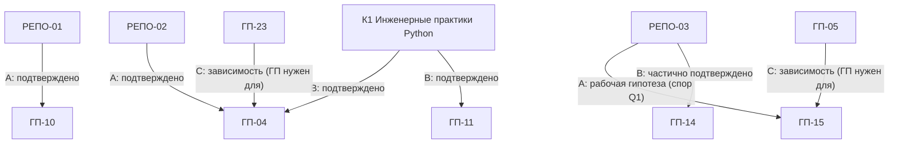

# Карта соответствия дисциплин: репозиторий ↔ генеральный план

> Сессия R0.2. Задача: RF-01 (карта + правило именования; остаток — решения владельца, см. §8).
> Термины и правила обращения — в [[Словарь_реформы]].
> Дока: [[РЕФОРМА_BACKLOG]], [[Журнал_реформы]], [[R0_Аудит_состояния_репозитория]].
> Карта фиксирует, **какая нумерация есть**, **что такое `РЕПО-NN`**, **что такое `ГП-NN`**,
> **какие сущности — дисциплины, какие — курсы** и **какие соответствия подтверждены, а какие —
> рабочая гипотеза**. Изменять учебные материалы и структуру по этой карте в R0.2 **запрещено**
> (задача R0.2 — только зафиксировать).

**Правило чтения статусов в этой карте** (полный словарь — в [[Словарь_реформы]]):

| Статус соответствия | Смысл |
|---|---|
| `подтверждено` | есть явная основа: совпадение названия и содержания, раздел «Опора на дисциплину NN», пункт ГП, решение владельца |
| `частично подтверждено` | соответствие подтверждено для части содержания (конкретные лекции/блоки указаны) |
| `рабочая гипотеза` | предложение агента на основе логики/названий; не подтверждено; может быть изменено решением владельца |
| `требует проверки` | доказательств недостаточно; **угадывать запрещено** (правило R0-аудита §1) |
| `вне ГП-24 — решение владельца` | сущность не входит в 24 дисциплины генерального плана; вопрос её места — за владельцем |
| `материалов нет` | дисциплина ГП не имеет материалов в репозитории (R0-аудит §10: «отсутствует») |
| `не назначается` | ГП-номер намерено не присваивается (курсы, фрагменты, мета-сущности — см. §§4, 7) |

> [!important] Главное правило
> В документах реформы запрещено писать «дисциплина 02», «предмет 04» и любые голые номера
> без префикса: системы нумерации две и несовместимые (R0-аудит §4 A2: «Совпадений по смыслу — ноль»).
> `РЕПО-NN` = папка/дисциплина репозитория · `ГП-NN` = дисциплина генерального плана.
> Подробности — [[Словарь_реформы#1. Правила обращения к дисциплинам|раздел «Правила обращения к дисциплинам»]].

---

# 1. Две системы нумерации

```text
Генеральный план (МОДЕРНИЗАЦИЯ/02, v1.0)        Репозиторий (01_Дисциплины/)
ГП-01 Операционные системы и среды               РЕПО-01 Технология разработки ПО
ГП-02 Архитектура аппаратных средств             РЕПО-02 Основы алгоритмизации и программирования
ГП-03 Информационные технологии                  РЕПО-03 Написание кода ИС
ГП-04 Основы алгоритмизации и программирования   РЕПО-04 Психология личности
ГП-05 Основы проектирования баз данных           РЕПО-05 Психология общения
ГП-06 Стандартизация, сертификация и ...         РЕПО-06 Моделирование и анализ ПО
ГП-07 Численные методы                           РЕПО-07 Основы философии
ГП-08 ... ГП-24 (24 дисциплины всего)
```

- **ГП** — авторская интегрированная программа (не официальный учебный план колледжа;
  источник — `МОДЕРНИЗАЦИЯ/02_Генеральный_учебный_план_09_02_07.md`, далее «ГП»).
  Это стратегический документ реформы: в R0.2 он **не изменяется** (сверка с фактом — RF-08).
- **РЕПО** — текущие папки дисциплин колледжа в `01_Дисциплины/`. Номера папок — исторические,
  **не меняются** в R0.2 (переименование — не раньше RF-16/R5).
- Единственное точное совпадение названий: РЕПО-02 ↔ ГП-04. Остальные — только по содержанию
  и частично по названиям.

Каждая сущность репозитория получает **один** идентификатор из систем `РЕПО-NN` / `ГП-NN` /
`КN` / `ВЕБ` (правила новых идентификаторов — [[Словарь_реформы#2. Правила именования сущностей|Словарь, «Правила именования сущностей»]]).

---

# 2. Мастер-таблица соответствия

Колонки едины для всех сущностей. «Роль» — место сущности в образовательной системе;
для авторских курсов указана роль относительно ГП (требование R0.2).

## 2.1. Дисциплины репозитория (7)

| Идентификатор | Название | Текущий путь | Соответствие ГП | Роль | Статус соответствия |
|---|---|---|---|---|---|
| РЕПО-01 | Технология разработки ПО | `01_Дисциплины/01_Технология_Разработки_ПО/` | ГП-10 | Дисциплина колледжа (преп. Подтяжкин В. Д.): контейнер материалов колледжа + авторская доработка; «каркас» для остальных дисциплин | `подтверждено` (название 1:1, содержание: ЖЦ, методологии, Git, качество, тестирование, Agile — программа ГП-10) |
| РЕПО-02 | Основы алгоритмизации и программирования | `01_Дисциплины/02_Основы_Алгоритмизации_и_Программирования/` | ГП-04 | Дисциплина колледжа (преп. Дрёмов А. В.); модули: «01. Алгоритмы и Python» (= блоки A+B программы ГП-04) и «02. Django» (= блок D «Web-мост», черновик) | `подтверждено` (единственное 1:1 по названию; Python-ядро ГП-04 реализовано; Django-блок — черновик). Оговорка: пункт ГП §2 «текущая ситуация слабая» устарел — сверка в RF-08 |
| РЕПО-03 | Написание кода ИС | `01_Дисциплины/03_Написание_Кода_ИС/` | **спорное**: по названию → ГП-15; по содержанию → ГП-14 (частично) и ГП-13 (частично) | Дисциплина колледжа (преп. Молите Д. А.). Содержимое — ООА, CASE-технологии, UML (3 лекции, `готово`); «кода» и практик в папке нет | `рабочая гипотеза (спорное, Q1)`: организационно — ГП-15 по названию; содержательно — ГП-14 `частично подтверждено` + ГП-13 `рабочая гипотеза`. Решение — RF-18 |
| РЕПО-04 | Психология личности | `01_Дисциплины/04_Психология_Личности/` | — | Дисциплина колледжа (преп. Кислова Н. В.); гуманитарный блок | **`вне ГП-24 — решение владельца`** (RF-17); удалять/перемещать запрещено |
| РЕПО-05 | Психология общения | `01_Дисциплины/05_Психология_Общения/` | — | Дисциплина колледжа (преп. Кислова Н. В.); гуманитарный блок; 6 черновиков, изолят, без `00_Курс.md` | **`вне ГП-24 — решение владельца`** (RF-17); удалять/перемещать запрещено |
| РЕПО-06 | Моделирование и анализ ПО | `01_Дисциплины/06_Моделирование_и_Анализ_ПО/` | ГП-13 | Дисциплина колледжа (преп. Тоболин Д. Ю.); граница предмета уточнена владельцем 03.10.2026: C++ из папки вынесен в курс К5; сейчас — авторская вводная (черновик) | `подтверждено` по названию (1:1); содержание — `требует проверки` (вводная ждёт проверки владельца, В8; фактических конспектов пар нет) |
| РЕПО-07 | Основы философии | `01_Дисциплины/07_Основы_Философии/` | — | Дисциплина колледжа (преп. Минбулатова И. Г.); гуманитарный блок; академический курс, происхождение помечено | **`вне ГП-24 — решение владельца`** (RF-17); удалять/перемещать запрещено |

## 2.2. Дисциплины генерального плана (24)

«Текущий путь» — где в репозитории лежат материалы, реализующие дисциплину ГП; «—» = материалов нет.

| Идентификатор | Название | Текущий путь | Соответствие ГП | Роль | Статус соответствия |
|---|---|---|---|---|---|
| ГП-01 | Операционные системы и среды | — | сама (ГП-01) | База для процессов, файлов, памяти, служб, командной строки и эксплуатации | `материалов нет` (точечные упоминания в К1 — не курс) |
| ГП-02 | Архитектура аппаратных средств | — | сама (ГП-02) | Понимание того, на чём выполняется ПО | `материалов нет` (К5 касается памяти/типов, но не архитектуры — R0 §10) |
| ГП-03 | Информационные технологии | — (нарратив «карты профессии» — [[Дорожная карта]]) | сама (ГП-03) | Общее поле ИТ, цифровые системы, инфраструктура | `материалов нет` как курс |
| ГП-04 | Основы алгоритмизации и программирования | `01_Дисциплины/02_…/` (модули «01. Алгоритмы и Python», «02. Django») + курсы К1–К4 (§4) | сама (ГП-04) | Центральный фундамент программирования | `подтверждено`: РЕПО-02 организационно; К1–К4 — содержательное пересечение (тип B, §4). Django-блок — черновик, срочный семестр |
| ГП-05 | Основы проектирования баз данных | — (ожидается тетрадь владельца — В4) | сама (ГП-05) | Формирование модели данных и переход к СУБД/SQL | `материалов нет`; критический пробел специальности (R0 §5.2) |
| ГП-06 | Стандартизация, сертификация и техническое документирование | — | сама (ГП-06) | Нормативная и документальная грамотность инженера | `материалов нет` |
| ГП-07 | Численные методы | — (К2 — инструмент, не методы; §4) | сама (ГП-07) | Алгоритмы для приближённых вычислений | `материалов нет` (пересечение с К2 — `рабочая гипотеза`) |
| ГП-08 | Компьютерные сети | — (HTTP/DNS — прозой в [[Дорожная карта]]; фрагмент ВЕБ — §3) | сама (ГП-08) | Сетевой фундамент для ИС и Web | `материалов нет`; блокер веб-маршрута |
| ГП-09 | Технические средства информатизации | — | сама (ГП-09) | Практическое устройство компьютерных систем | `материалов нет` |
| ГП-10 | Технология разработки ПО | `01_Дисциплины/01_Технология_Разработки_ПО/` | сама (ГП-10) | Процесс разработки, Git, качество, команда, жизненный цикл | `подтверждено`: РЕПО-01 (9 лекций + 7 практик; Л09 — черновик) |
| ГП-11 | Инструментальные средства разработки ПО | `02_Курсы/01. Инженерные практики Python/` (частично) + `VS Code templates/` (сироты, В12) | сама (ГП-11) | IDE, toolchain, сборка, отладка, пакеты, CI/CD | `частично подтверждено`: К1 (дебаггер, линтеры, pytest, uv, Git Л13); отдельного курса ГП-11 нет (R0 §10) |
| ГП-12 | Математическое моделирование | — (К2/К4 — инструменты; §4) | сама (ГП-12) | Связка математики, моделей и вычислений | `материалов нет` (пересечения К2/К4 — `рабочая гипотеза`) |
| ГП-13 | Моделирование и анализ ПО | `01_Дисциплины/06_Моделирование_и_Анализ_ПО/` + пересечение с РЕПО-03 (§4) | сама (ГП-13) | Модели программных систем, анализ, архитектурное мышление | `подтверждено` по названию (РЕПО-06); содержание — авторская вводная, `требует проверки` (В8); граница с РЕПО-03 не проведена (Q1) |
| ГП-14 | Проектирование и дизайн ИС | `01_Дисциплины/03_Написание_Кода_ИС/` (частично) | сама (ГП-14) | Системный анализ, архитектура, UX/интерфейсы, модели ИС | `частично подтверждено`: ООA/CASE/UML из РЕПО-03 (3 лекции); как система (требования, UX, архитектуры) — `материалов нет`; спор — Q1/RF-18 |
| ГП-15 | Разработка и написание кода ИС | `01_Дисциплины/03_Написание_Кода_ИС/` (по названию) | сама (ГП-15) | Перевод требований и моделей в рабочую ИС | `рабочая гипотеза (спорное, Q1)`: название папки ≈ название ГП, но «кода» в папке нет (стека Python+PostgreSQL+Django+pytest+Docker нет); R0-аудит §10: «название папки обещает код, содержимое — модели» |
| ГП-16 | Тестирование информационных систем | `01_Дисциплины/01_…/01_Лекции/07. Тестирование программного обеспечения.md` + практика 05 (шаблон) + К1 Л08 (pytest) | сама (ГП-16) | Контроль качества и подтверждение поведения системы | `частично подтверждено` как «начата» (концепция + шаблон); системного курса нет |
| ГП-17 | Сопровождение информационных систем | — | сама (ГП-17) | Работа с существующей системой и изменениями | `требует проверки` (Q3): ГП §2 — «Изучается сейчас», в репозитории 0 материалов; RF-19 |
| ГП-18 | Инженерно-техническая поддержка сопровождения ИС | — | сама (ГП-18) | Диагностика, эксплуатация, инциденты, поддержка | `требует проверки` (Q3): то же, что ГП-17; RF-19 |
| ГП-19 | Интеллектуальные системы и технологии | `01_Дисциплины/01_…/01_Лекции/04. ИИ в разработке ПО.md` | сама (ГП-19) | AI/ML и интеллектуальные функции как слой над фундаментом | `частично подтверждено` как «начата» (01-Л04: LLM/промпт-инжиниринг); ML-фундамента нет — правильно по ГП §21; статус «Изучается сейчас» — Q3 |
| ГП-20 | Управление и автоматизация баз данных | — | сама (ГП-20) | Администрирование, резервирование, производительность | `материалов нет` (зависит от ГП-05) |
| ГП-21 | Сертификация информационных систем | — | сама (ГП-21) | Подтверждение соответствия, требования, процедуры | `материалов нет` |
| ГП-22 | Элементы высшей математики | — | сама (ГП-22) | Математический фундамент | `материалов нет` (нужна для ГП-07/12/19) |
| ГП-23 | Дискретная математика | — (логика/множества — точечно в Python-курсе РЕПО-02) | сама (ГП-23) | Логика, множества, отношения, графы, комбинаторика | `материалов нет` (точечные упоминания — `рабочая гипотеза` как задел) |
| ГП-24 | Внедрение и поддержка компьютерных систем | — | сама (ГП-24) | Установка, конфигурация, интеграция, эксплуатация | `материалов нет` (по ГП — преподавателя нет; курс только авторский, фаза D) |

## 2.3. Курсы `02_Курсы` (5)

Курс ≠ дисциплина (§7). ГП-номеру **не назначается** намеренно — курс поддерживает один или
несколько ГП через содержательное пересечение (тип B, §4).

| Идентификатор | Название | Текущий путь | Соответствие ГП | Роль (относительно ГП) | Статус соответствия |
|---|---|---|---|---|---|
| К1 | Инженерные практики Python | `02_Курсы/01. Инженерные практики Python/` | не назначается | Авторский курс: **поддерживающий** (инженерный модуль РЕПО-02, вынесенный за программу; блок C программы ГП-04) + **инструментальный** (часть содержания ГП-11) | `не назначается` (курсы не нумеруются ГП); пересечения B: ГП-04 `подтверждено`, ГП-11 `подтверждено`, ГП-10 `подтверждено` (ГП §22), ГП-16 `рабочая гипотеза` |
| К2 | NumPy | `02_Курсы/02. NumPy/` | не назначается | Авторский курс: **углубляющий** (массивы/векторизация — над базовым Python); инструмент для будущих ГП-07/ГП-12 | `не назначается`; пересечения B: ГП-04 `подтверждено`, ГП-07 `рабочая гипотеза`, ГП-12 `рабочая гипотеза` |
| К3 | Pydantic | `02_Курсы/03. Pydantic/` | не назначается | Авторский курс: **углубляющий** (типизация → проверка данных); инструмент практического стека ГП-15 | `не назначается`; пересечения B: ГП-04 `подтверждено`, ГП-15 `рабочая гипотеза` |
| К4 | Matplotlib | `02_Курсы/04. Matplotlib/` | не назначается | Авторский курс: **углубляющий** (визуализация данных по массивам NumPy) | `не назначается`; пересечения B: ГП-04 `подтверждено`, ГП-12 `рабочая гипотеза` |
| К5 | C++ (C++20) | `02_Курсы/C++/` | не назначается | Авторский курс: **самостоятельный языковой курс** (решение владельца — вариант A); не продолжение РЕПО-06 (граница 03.10.2026); ГП §12: «C++ … не подменяет моделирование ПО». Колледж-темы C++ ожидаются с пар — к какому предмету колледжа относится C++, `требует проверки` (Q6) | `не назначается`; пересечения B: ГП-04 `рабочая гипотеза` (алгоритмы/структуры данных на C++); с ГП-13 — **граница**, а не пересечение (ГП §12) |

## 2.4. Веб-контур

| Идентификатор | Название | Текущий путь | Соответствие ГП | Роль | Статус соответствия |
|---|---|---|---|---|---|
| ВЕБ | Веб (фрагмент) | `02_Курсы/Веб/` | не назначается | **Не курс и не дисциплина**: фрагмент будущего начального веб-курса — 1 сырая заметка с пары (`черновик`, полный изолят) + PDF-учебник HTML/CSS/JS/PHP/MySQL 2019 г. (права — Ж4, Риск R-4). PDF-учебник Django в модуле «02. Django» (РЕПО-02) — сырьё Django-блока, а не ВЕБ | `требует проверки` (состав, актуальность, права — RF-06); пересечения B: ГП-04 блок D / ГП-08 / ГП-15 — `рабочая гипотеза` (веб-маршрут ГП §23 распределён между 01/08/05/15/16/24, отдельной «веб-дисциплины» в ГП нет) |

## 2.5. Мета-сущности, которые можно спутать с дисциплинами/курсами

Все — **не дисциплина и не курс**; идентификатор не присваивается, обращение — по имени файла.

| Название | Текущий путь | Что это | Почему путают |
|---|---|---|---|
| Дорожная карта | `02_Курсы/Дорожная карта.md` (+`.html`) | Нарративная **учебная траектория** специалиста 09.02.07 (требования специальности + подтверждённое + личные дополнения) | Название «карта», лежит в `02_Курсы/`; это не курс и не дисциплина |
| Курсы — обзор | `02_Курсы/Курсы — обзор.md` | **Каталог** курсов К1–К5 с уровнями и зависимостями | Лежит в `02_Курсы/`, похож на оглавление курса |
| Модуль «Алгоритмы и Python» (РЕПО-02) | `01_Дисциплины/02_…/01. Алгоритмы и Python/` | **Модуль** (учебный блок) внутри дисциплины РЕПО-02: блоки A+B программы ГП-04 | Номера папок «01.» похожи на номера дисциплин |
| Модуль «Django» (РЕПО-02) | `01_Дисциплины/02_…/02. Django/` | **Модуль** внутри дисциплины РЕПО-02 (черновик + PDF-учебник); срочный семестр; часть блока D «Web-мост» программы ГП-04 | Может со временем стать самостоятельным курсом — до решения владельца это **не** курс |
| `04_Код` (РЕПО-02) | `01_Дисциплины/02_…/04_Код/` | Архив **кода** задач/лабораторных (220 файлов) | Номер папки «04» похож на дисциплину (внутри РЕПО-02, не в `01_Дисциплины` верхнего уровня) |
| VS Code templates | `VS Code templates/` | Конфигурации инструментов (8 JSON, 4 стека) | Похоже на курс «инструменты» (ГП-11); судьба — В12, решение владельца |
| МОДЕРНИЗАЦИЯ | `МОДЕРНИЗАЦИЯ/` | Стратегия реформы (3 документа, вкл. ГП) | Имя конфликтует с `00_Мета/Модернизация/` (план косметики) — S3/RF-08 |
| Модернизация | `00_Мета/Модернизация/` | План **косметической** модернизации (10 этапов, параллельно R-сериям) | См. выше: два разных «Модернизации» |
| Контактная информация преподавателей | `01_Дисциплины/Контактная информация преподавателей.md` | Справочник (PII — RF-04, решение владельца) | Лежит в `01_Дисциплины/`, но не дисциплина |

---

# 3. Три типа отношений — не смешивать

Одно и то же слово «соответствует» в реформе означает три разных отношения. В мастер-таблице
(§2) колонка «Соответствие ГП» несёт только **тип A**; типы B и C — в §§4–5.



**A. Организационное соответствие** — папка репозитория фактически реализует дисциплину ГП
(контейнер материалов колледжа → единица программы). Носитель: колонка «Соответствие ГП» в §2.
Пример: `РЕПО-01 → ГП-10`.

**B. Содержательное пересечение** — курс/тема/модуль поддерживает несколько дисциплин, не
будучи ни одной из них. Носитель: §4. Пример: `К1 ↔ ГП-04 + ГП-11`.

**C. Профессиональная связь (зависимость)** — дисциплина ГП нужна для другой дисциплины ГП.
Это **не соответствие**, а рёбра графа программы. Носитель: §5 (источник — граф ГП §26).
Пример: `ГП-05 нужен для ГП-15`.

> [!warning] Частая ошибка
> Записать `К1 = ГП-11` — неверно: это пересечение (B), а не тождество. Записать
> `РЕПО-03 = ГП-14` — неверно: организационно (A) папка привязана к дисциплине колледжа
> «Написание кода ИС», а ГП-14 — только содержательное пересечение части её лекций.

---

# 4. Тип B — содержательные пересечения (курсы, модули, отдельные темы)

Статусы: `подтверждено` — основа в репозитории или тексте ГП; `рабочая гипотеза` — логическое
предложение, не подтверждено.

| Сущность | ГП | Что пересекается | Основа | Статус |
|---|---|---|---|---|
| К1 | ГП-04 | Блок C «Инженерное программирование» программы ГП-04 (Git, окружение, зависимости, линтеры, отладчик, тесты, структура проекта) = программа К1 | К1/00: «инженерный модуль дисциплины 02, вынесенный в отдельный курс» (т.е. модуль РЕПО-02); раздел «Опора на дисциплину 02» (= опора на РЕПО-02) в каждой лекции курсов 1–4 | `подтверждено` |
| К1 | ГП-11 | Дебаггер, линтеры, pytest, uv, Git (Л13), структура проекта (Л12) | R0-аудит §10: ГП-11 «≈ К1 частично + VS Code templates» | `подтверждено` |
| К1 | ГП-10 | Git/GitHub и PR (Л13), читаемость/ревью (Л14) | ГП §22 «Сквозной маршрут Git»: Git появляется в 10 → 04 → 11 → 15 → 16 → 24 → 17/18 | `подтверждено` |
| К1 | ГП-16 | pytest, модульное тестирование (Л08) — концепция, не дисциплина | К1 Л08; в ГП-16 pytest не назван | `рабочая гипотеза` |
| К2 | ГП-04 | Python-экосистема, типизация; база — РЕПО-02 | раздел «Опора на дисциплину 02» (= опора на РЕПО-02) | `подтверждено` |
| К2 | ГП-07 | NumPy как инструмент будущих численных методов (не сами методы) | R0 §10: «NumPy даёт инструмент, но не методы» | `рабочая гипотеза` |
| К2 | ГП-12 | Инструмент численного эксперимента и работы с данными | программа К2 (статистика, файлы) | `рабочая гипотеза` |
| К3 | ГП-04 | Типизация доведена до проверки данных | раздел «Опора на дисциплину 02» (= опора на РЕПО-02) | `подтверждено` |
| К3 | ГП-15 | Модели данных, сериализация, JSON — слой данных практического стека ГП-15 | программа К3; стек ГП §15 (Python, Django, API) | `рабочая гипотеза` |
| К4 | ГП-04 | Визуализация данных на Python | раздел «Опора на дисциплину 02» (= опора на РЕПО-02) | `подтверждено` |
| К4 | ГП-12 | Визуализация моделей (графики по результатам расчётов) | программа К4 | `рабочая гипотеза` |
| К5 | ГП-04 | Алгоритмы и структуры данных, сложность — на C++ | программа К5 (17 блоков: типы → RAII/STL/шаблоны) | `рабочая гипотеза` |
| К5 | ГП-13 | **Граница, а не пересечение**: «C++ может изучаться отдельно как язык … но не подменяет моделирование ПО» | ГП §12; решение владельца (вариант A, 03.10.2026) | `граница зафиксирована` |
| РЕПО-01, Л07 + практика 05 | ГП-16 | Концепция тестирования, тест-дизайн, тестовая документация (шаблон) | R0 §10: ГП-16 «начата (01-Л07 + шаблон практики)» | `частично подтверждено` |
| РЕПО-01, Л04 | ГП-19 | LLM, промпт-инжиниринг на этапах ЖЦ | R0 §10: ГП-19 «начата (01-Л04)» | `частично подтверждено` |
| Модуль «02. Django» (РЕПО-02) | ГП-04 | Блок D «Web-мост» программы ГП-04 (HTTP, HTML/CSS, формы, JSON, сервер, API, Django) | ГП §8; модуль — черновик + PDF-учебник (сырьё) | `подтверждено` как блок D; материал — `черновик` |
| РЕПО-03, 3 лекции | ГП-14 | ООA, CASE-технологии, UML = системный анализ и модели ИС | содержание лекций РЕПО-03; R0 §10 (ГП-14 «≈ репозиторий 03 частично») | `частично подтверждено` (часть спора Q1) |
| РЕПО-03, лекция UML | ГП-13 | Модели предметной области, нотации | лекция 03 РЕПО-03; граница 13↔03 «не проведена» (R0 §10) | `рабочая гипотеза` (часть спора Q1) |
| ВЕБ | ГП-04 (блок D) / ГП-08 / ГП-15 | HTML/CSS/JS, основы веба | учебник 2019 + заметка с пары; веб-маршрут ГП §23 | `рабочая гипотеза` (сырьё; права — Ж4) |
| РЕПО-06, вводная | ГП-13 | Моделирование и анализ ПО (авторская ориентация) | `01. Введение в моделирование и анализ ПО` (черновик) | `частично подтверждено`; ожидает проверки владельца (В8) |

> [!note] Про дубли «одна тема — несколько мест»
> Git (РЕПО-01-Л05 + К1-Л13), тестирование (РЕПО-01-Л07 + К1-Л08), dataclass (РЕПО-02-Л16 + К1-Л04 + К3)
> управляются правилом приоритета дисциплин ([[Соглашения]] §9): канон — в дисциплине, курс
> ссылается как «углубление». Реестр «канон ↔ проекции» — RF-09, не в R0.2.

---

# 5. Тип C — профессиональные связи (зависимости ГП → ГП)

Источник — граф ГП §26 (машиночитаемая часть; ГП не изменяется в R0.2). Формат: **«X нужен для Y»**.
Приведены рёбра, затрагивающие сущности, уже присутствующие в репозитории, и срочный путь семестра;
полный граф — в ГП §26.

| Нужен (предшественник) | Для (потомка) | Источник |
|---|---|---|
| ГП-23 (в графе) и ГП-22 (по тексту §6) | ГП-04 (алгоритмы) | ГП §26: ребро 23→04; схема ГП §6: {22,23}→04 (см. оговорку ниже) |
| ГП-23 | ГП-05 (БД) | ГП §26 (23→05) |
| ГП-04 | ГП-05, ГП-10, ГП-11, ГП-19 | ГП §26 |
| ГП-02 → ГП-09 → ГП-01 | цепочка «компьютер как система» | ГП §26, §4 |
| ГП-01 | ГП-08 (сети), ГП-24 (внедрение) | ГП §26 |
| ГП-05 | ГП-15 (разработка ИС), ГП-20 (управление БД) | ГП §26 |
| ГП-08 | ГП-15, ГП-24 | ГП §26 |
| ГП-06 | ГП-14, ГП-15 | ГП §26 |
| ГП-10 | ГП-13, ГП-14, ГП-11 | ГП §26 |
| ГП-13 | ГП-14 | ГП §26 |
| ГП-14, ГП-11 | ГП-15 | ГП §26 |
| ГП-15 | ГП-16 (тестирование), ГП-24 (внедрение) | ГП §26 |
| ГП-16 | ГП-21 (сертификация) | ГП §26 |
| ГП-24 | ГП-17 (сопровождение) → ГП-18 (поддержка) | ГП §26 |
| ГП-20 | ГП-17 | ГП §26 |
| ГП-22, ГП-23, ГП-12, ГП-04 | ГП-19 (интеллектуальные системы) | ГП §26 |

**Срочный путь семестра (Django, 01.09–31.12.2026)** через существующие сущности:

```text
ГП-04 (есть: РЕПО-02, Python-ядро)
  → ГП-05 (НЕТ — нужен для ГП-15)  и  ГП-08 (НЕТ — нужен для ГП-15)
  → ГП-15 (частично: РЕПО-03 — модели, без стека и кода; модуль Django РЕПО-02 — черновик)
  → ГП-16 (начато: РЕПО-01-Л07) → ГП-24 (нет)
```

> [!warning] Несоответствие внутри самого ГП (для RF-08)
> Схема в тексте ГП §6 показывает рёбра {ГП-22, ГП-23} → {ГП-07, ГП-04, ГП-13, ГП-19},
> а граф ГП §26 содержит 22→07, 22→19, 23→04, 23→05, 23→19, 12→19 (рёбра 22→04, 23→07, 22/23→13 в графе
> отсутствуют). В R0.2 ГП не правится; расхождение зафиксировано для сверки в RF-08.

---

# 6. Гуманитарный блок (РЕПО-04, РЕПО-05, РЕПО-07)

Все три — дисциплины колледжа с преподавателем и материалами, **но не входят в 24 дисциплины
генерального плана**. В R0.2 окончательное решение о включении/исключении **не принимается**
(запрет R0.2: «самостоятельно решать спорные вопросы, относящиеся к колледжу»).

| Идентификатор | Состояние материалов | Тип материала (по R0-аудиту) | Статус |
|---|---|---|---|
| РЕПО-04 Психология личности | 3 лекции `готово` (проф. самоопределение, Климов/Холланд, 8 кризисов) | смешанный (пары + Зеер/Холланд с пометками источников) | `вне ГП-24 — решение владельца` (RF-17) |
| РЕПО-05 Психология общения | 6 черновиков (~500 слов), изолят, без `00_Курс.md` | сырьё колледжа | `вне ГП-24 — решение владельца` (RF-17) |
| РЕПО-07 Основы философии | академический курс `готово` (3 темы: введение, Индия, Китай) + методика + сообщение о даосизме | смешанный, происхождение помечено блоками «Что из материала преподавателя, а что добавлено» | `вне ГП-24 — решение владельца` (RF-17) |

Варианты решения (для владельца, в RF-17):

- **A.** Держать как «общеобразовательное приложение» за контуром ГП-24: слой маркируется
  (в future — полем `origin`/меткой), реформа формальных слоёв (R1–R9) его не затрагивает,
  кроме общего договора оформления.
- **B.** Включить в генеральный план как дополнительные дисциплины (нужна правка самого ГП —
  только через RF-08, по решению владельца; ГП — стратегический документ).
- **C.** Исключить из контура реформы: материалы остаются в репозитории (удаление запрещено),
  в документах реформы фигурируют только как «не в контуре».

Связи гуманитарного блока с техническим (по R0 §8.3): РЕПО-04 → РЕПО-01 (8 ссылок),
РЕПО-07 → РЕПО-04/01/05 (7/5/3), обратных почти нет — зафиксировано, не исправляется в R0.2.

---

# 7. Курс ≠ дисциплина

> [!important] Рабочее правило (окончательная формулировка — в [[Словарь_реформы|Словаре]], раздел «Граница: дисциплина и курс»)
> **Дисциплина** — учебная область/единица программы (контейнер: откуда тема пришла, к какой
> программе относится). **Курс** — конкретно спроектированная последовательность обучения
> внутри дисциплины или на стыке дисциплин (как её осваивать).

Критерии отличия (для любых будущих сессий):

| Критерий | Дисциплина | Курс |
|---|---|---|
| Идентификатор | `РЕПО-NN` / `ГП-NN` | `КN` (или имя) |
| Единство программы | единица генеральной/колледжной программы | спроектированная последовательность, может быть междисциплинарной |
| Преподаватель колледжа | есть (YAML `teacher`) | нет (YAML `teacher` не ставится) |
| ГП-номер | имеет (ГП) или исторический (РЕПО) | **не имеет** — намерено |
| Может охватывать несколько ГП | нет (одна единица программы; пересечения — тип B) | да (тип B — нормальное состояние) |

Роли авторских курсов относительно ГП (категории из R0.2; курсу не дают номер ГП «ради симметрии»):

- **поддерживающий** — вынесен из дисциплины, закрывает часть её программы (К1 к РЕПО-02/ГП-04);
- **углубляющий** — ведёт тему дисциплины дальше базового уровня (К2–К4 к Python-экосистеме ГП-04);
- **инструментальный** — даёт инструменты будущей/чужой дисциплины (К1 частично к ГП-11; К2 к ГП-07/12);
- **междисциплинарный / самостоятельный** — свой маршрут на стыке (К5 — язык, не привязанный к одной дисциплине ГП).

Текущее состояние: К1–К4 — авторские, `02_Курсы`; К5 — авторский, `в работе` (ждёт тем с пар и
проверки Windows/MSVC); ВЕБ — фрагмент, ещё не курс; Rust — личная задача владельца (В7), в базе
курса нет; мини-темы в каталоге не заведены.

---

# 8. Спорные соответствия и открытые вопросы

| # | Вопрос | Что известно | Что неизвестно | Куда |
|---|---|---|---|---|
| Q1 | **Организационное соответствие РЕПО-03**: название «Написание кода ИС» ≈ ГП-15 «Разработка и написание кода ИС», но содержимое — ООA/CASE/UML (→ ГП-14, частично ГП-13); кода и практик в папке нет | 3 лекции `готово` по презентациям преподавателя; R0: «название папки обещает код, содержимое — модели» | Что именно преподаёт колледж в дисциплине «Написание кода ИС» (рабочая программа/план тем не переданы); где в базе будет жить «код» | **RF-18** (решение владельца + материалы колледжа). До решения: `рабочая гипотеза`, переносы/разделения запрещены |
| Q2 | **Гуманитарный блок** (РЕПО-04/05/07): в ГП-24 не входит | §6 этой карты; R0 §5.9 | Вариант A/B/C (§6) | **RF-17** (решение владельца) |
| Q3 | **ГП-17/18/19 «Изучается сейчас»** (ГП §2), но в репозитории 0 материалов (кроме 01-Л04 для ГП-19) | R0 §4 A5; §2.2 этой карты | Есть ли у владельца материалы/пары по сопровождению, техподдержке, интеллектуальным системам; переданы ли они в базу | **RF-19** (проверка владельцем; сверка ГП §2 — через RF-08) |
| Q4 | **Граница РЕПО-06**: авторская вводная (черновик) не проверена владельцем; фактических конспектов пар нет | РЕЕСТР: граница уточнена 03.10.2026; В8 | Проверка вводной + наличие заметок с пар у владельца | В8 (операционный [[Бэклог]]); статус ГП-13 — до проверки |
| Q5 | **ВЕБ-фрагмент и `Веб.rar`**: состав, актуальность (учебник 2019), права на PDF/RAR | R0 S5, Ж4, Риск R-4 | Содержимое RAR; судьба файлов | **RF-06** (расширен в R0.2 на весь `02_Курсы/Веб/`) |
| Q6 | **C++ и колледж**: курс К5 — самостоятельный маршрут (решение владельца), но «темы с пар» ожидаются — т.е. C++ преподаётся в колледже. К какому предмету колледжа относится C++ (отдельный предмет? внутри РЕПО-06? внутри РЕПО-02?) | Дорожная карта §2: «Основы C++ изучаются в отдельном готовом маршруте C++20, не в дисциплине 06» | Официальная программа курса C++ колледжа | **RF-19** (вопрос владельцу при сверке «изучается сейчас»); до ответа — `требует проверки` |

**Известные устаревания (не споры, фиксация для RF-08):** таблица ГП §2 местами противоречит
факту (ГП-04 «ситуация слабая» при собранном Python-курсе; ГП-13 «C++ ошибочно воспринимался» —
уже исправлено 03.10; расхождение схем §6 и §26 — §5). ГП не правится в R0.2.

---

# 9. Правила обслуживания карты

1. Любая сессия, говорящая о дисциплине/курсе, использует идентификаторы этой карты
   (`РЕПО-NN`, `ГП-NN`, `КN`, `ВЕБ`); голые номера — запрещены (Словарь, §1).
2. Новое соответствие/сущность — **сначала строка в этой карте**, потом упоминания в других
   документах. Изменение статуса — только с указанием основания или решением владельца.
3. Статус `рабочая гипотеза` становится `подтверждено` только при появлении явной основы
   (материалы колледжа, пункт ГП, решение владельца); `требует проверки` — при новом факте.
4. ГП и папки `01_Дисциплины`/`02_Курсы` по этой карте **не перемещаются и не переименовываются**
   (структурные изменения — R5+, имена — RF-16).
5. Карта обновляется в той же сессии, где изменился факт (правило «правил тексты — обновил срез»).

---

# 10. Связи с другими темами

- [[Словарь_реформы]] — определения терминов и правила именования (сопоставляется с этой картой).
- [[РЕФОРМА_BACKLOG]] — RF-01 (эта карта), RF-17/18/19 (споры Q1–Q3, Q6), RF-06 (Q5), RF-08 (ГП-сверка).
- [[R0_Аудит_состояния_репозитория]] — источник фактов: §4 A2 (двойная нумерация), §10 (24 ГП), §8 (связи).
- [[Журнал_реформы]] — запись R0.2.
