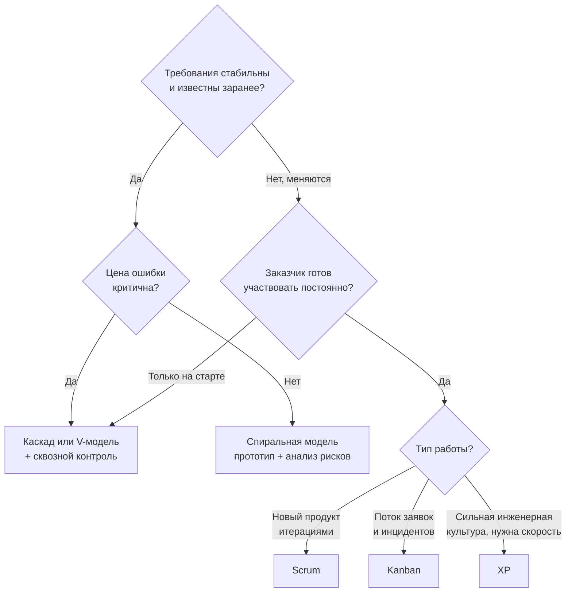

# Введение в технологию разработки ПО

> [!abstract] О чём эта лекция
> Базовый словарь дисциплины: что такое разработка ПО как инженерная дисциплина, чем **методология** отличается от **модели жизненного цикла**, какие подходы существуют и кто участвует в создании продукта.
>
> **Зачем это нужно.** Это точка входа в курс. Все следующие темы опираются на эти определения: [[03. Жизненный цикл ПО]] разворачивает каждый этап, [[02. Командная работа в IT]] — людей, а [[04. ИИ в разработке ПО]] — автоматизацию.
>
> **Что ты должен уметь после лекции:** объяснить разницу между методологией и моделью ЖЦ; перечислить 3–4 подхода и условия их применимости; назвать 6 ролей и зону ответственности каждой.

---

# Базовые определения

- **Разработка ПО** — инженерная дисциплина, которая охватывает все аспекты программного обеспечения: как саму разработку, так и сопутствующие процессы управления, анализа и сопровождения.
- **Методология разработки** — система принципов, правил, процедур и ролей, которая определяет, каким образом организован процесс создания конечного продукта.
- **Жизненный цикл ПО (Software Development Life Cycle, SDLC)** — структура, описывающая этапы существования продукта: от анализа и проектирования до вывода из эксплуатации.

> [!warning] Частая путаница: методология ≠ модель ЖЦ
> **Модель ЖЦ** отвечает на вопрос «*какие этапы проходит продукт*» (анализ → проектирование → разработка → тестирование → внедрение → сопровождение).
> **Методология** отвечает на вопрос «*как именно организовано движение по этим этапам*» — последовательно один раз или короткими повторяющимися циклами, с жёсткой фиксацией требований или с готовностью к изменениям.
> Этапы одни и те же почти везде; различается способ прохождения. Подробнее — в [[03. Жизненный цикл ПО]].

---

# Модели жизненного цикла

^b5e19a

Прежде чем говорить о методологиях, зафиксируем, какие бывают способы движения по этапам.

| Модель | Суть | Когда уместна |
|---|---|---|
| **Каскадная (Waterfall)** | Каждый этап начинается после полного завершения предыдущего, движение только вперёд | Требования известны и стабильны, ошибка дорога (медицина, авиация, госзаказ) |
| **V-модель** | То же, что каскад, но каждому этапу проектирования заранее ставится в соответствие этап проверки | Там же, где каскад, но с повышенными требованиями к верификации |
| **Итеративная** | Продукт уточняется повторными проходами по всем этапам; объём работ не нарастает | Требования уточняются в процессе, важна глубина проработки |
| **Инкрементальная** | Продукт собирается из готовых частей (инкрементов), каждая проходит полный цикл | Нужно отдавать работающий функционал по частям |
| **Спиральная** | Каждый виток — прототип + явный анализ рисков | Высокая неопределённость, дорогие ошибки, инновационные проекты |
| **Agile-модель** | Короткие циклы, в каждом — все этапы сразу; приоритет работающему продукту | Требования меняются, важна быстрая обратная связь |

> [!tip] Как запомнить
> Каскад двигается **вниз по ступеням**. Итерация — **шлифует одно и то же**. Инкремент — **достраивает по кирпичику**. Спираль — на каждом витке сначала **ищет риски**, потом делает прототип.

---

# Методологии разработки

^c4a8e1

## 1. Waterfall — водопад

- Последовательная модель ЖЦ, в которой каждая фаза начинается только после полного завершения предыдущей.
- Переходы между фазами разработки идут только в одном направлении.

**Стадии водопада:**

1. Системный анализ и требования
2. Проектирование
3. Реализация
4. Интеграция и тестирование
5. Внедрение
6. Сопровождение

**Плюсы:**

1. Прозрачная документация — на каждом этапе есть фиксированный, согласованный артефакт.
2. Стабильность требований — объём работ, сроки и бюджет известны заранее.

**Минусы:**

1. Высокий риск — рабочий продукт появляется только в конце, ошибки в требованиях всплывают поздно.
2. Сопротивление изменениям — возврат к предыдущей стадии означает пересмотр плана и бюджета.

> [!note] Почему ошибка дорожает
> Ошибка, допущенная на этапе анализа и найденная на этапе сопровождения, обходится на порядки дороже, чем найденная сразу: приходится переделывать требования, проект, код, тесты и документацию. Именно поэтому в [[02. Структура CASE-технологии. Структура среды разработки.]] так много внимания уделяется раннему контролю.

---

## 2. Agile — семейство подходов к разработке ПО

Agile появился как реакция на ограничения каскадной модели. Его ценности зафиксированы в **Agile-манифесте** (2001):

- Люди и взаимодействие важнее процессов и инструментов.
- **Работающий продукт важнее исчерпывающей документации.**
- Сотрудничество с заказчиком важнее согласования условий контракта.
- **Готовность к изменениям важнее следования первоначальному плану.**

> [!warning] Распространённое заблуждение
> «Agile — это когда без плана и без документации». Нет. Первые две ценности не отменяют документы и план вообще — они утверждают, что при конфликте приоритетов **работающий продукт и готовность к изменениям важнее**. Планирование в Agile есть, просто оно непрерывное, а не однократное.

### 2.1. Scrum

- Управление проектом по **спринтам** — коротким циклам по 1–4 недели.
- Быстрая адаптация к изменениям требований: перепланирование происходит на границе спринта, а не посреди него.
- Постоянное получение обратной связи и выпуск соответствующих частей продукта.

**Роли:**

- **Product Owner (владелец продукта)** — отвечает за ценность продукта и приоритеты бэклога; решает, *что* делать.
- **Scrum Master** — отвечает за процесс; устраняет препятствия, следит, что Scrum применяется корректно. Не начальник команды.
- **Команда разработки** — кросс-функциональная группа, которая сама решает, *как* делать; обычно 3–9 человек.

**События (церемонии):**

| Событие | Когда | Зачем |
|---|---|---|
| **Sprint Planning** | Начало спринта | Выбрать задачи из бэклога и спланировать, как их закрыть |
| **Daily Stand-up** | Каждый день, 15 минут | Синхронизация: что сделал, что сделаю, что мешает |
| **Sprint Review** | Конец спринта | Показать заказчику работающий инкремент, получить обратную связь |
| **Sprint Retrospective** | Конец спринта | Разобрать сам процесс: что улучшить в работе команды |

**Артефакты:**

- **Product Backlog** — полный упорядоченный список всего, что нужно продукту.
- **Sprint Backlog** — выбранное на текущий спринт + план реализации.
- **Инкремент** — работающая, потенциально поставляемая версия продукта по итогам спринта.

**Definition of Done (DoD)** — заранее согласованный критерий «задача действительно закончена» (например: написан код, есть тесты, пройдено ревью, обновлена документация). Без DoD «готово» каждый понимает по-своему.

### 2.2. Kanban

- Визуальное управление задачами на доске: «Нужно сделать», «В работе», «Готово».
- Ограничение количества задач в работе, чтобы не перегружать команду.
- Постепенное и непрерывное выполнение задач без спринтов, с улучшением процесса по ходу работы.

Ключевые понятия:

- **WIP-лимит (Work In Progress)** — максимальное число задач в каждом столбце. Задача не берётся в работу, пока не освободилось место. Это главный механизм Kanban: он выявляет «узкие места» процесса.
- **Cycle time** — время от начала работы над задачей до её завершения.
- **Lead time** — время от появления задачи в бэклоге до завершения (включает ожидание).
- **Непрерывная поставка** — результат отдаётся по готовности, а не партиями по спринтам.

> [!tip] Scrum или Kanban
> **Scrum** задаёт ритм и роли — подходит, когда важна предсказуемость поставки и есть что планировать на спринт.
> **Kanban** не ломает текущий процесс, а накладывается на него — подходит для поддержки, эксплуатации, потока разнородных входящих задач.

### 2.3. Extreme Programming (XP)

- Разработка через **парное программирование**: два разработчика работают за одним компьютером — один пишет код, другой контролирует и мыслит на шаг вперёд.
- Непрерывное тестирование (**TDD**): тесты пишутся до кода, частые интеграции и проверки.
- Тесное взаимодействие с заказчиком: короткие циклы, быстрая обратная связь, адаптация к изменениям требований.
- Простота дизайна, **рефакторинг**, **коллективное владение кодом**.

Дополнительные практики XP:

- **Непрерывная интеграция (CI)** — код сливается в общую ветку несколько раз в день, сборка и тесты запускаются автоматически.
- **Частые небольшие релизы** — поставлять работающую версию как можно чаще.
- **Простой дизайн** — не проектировать «на вырост» то, что не нужно сегодня.
- **Единый стиль кода** — команда придерживается общих соглашений.

---

## 3. Сравнение подходов

| Критерий | Waterfall | Agile (Scrum/Kanban) |
|---|---|---|
| Требования | Фиксируются заранее | Уточняются в процессе |
| Объём и сроки | Фиксирован объём, срок выводится | Фиксирован цикл, объём подстраивается |
| Рабочий продукт | В конце проекта | Каждую итерацию |
| Отношение к изменениям | Изменение — исключение, требует пересмотра плана | Изменение — норма, учитывается на границе итерации |
| Документация | Полный комплект на каждом этапе | Ровно столько, сколько нужно команде и заказчику |
| Роль заказчика | Участвует на старте и при приёмке | Постоянно участвует |
| Главный риск | Поздно обнаруженная ошибка в требованиях | Потеря управляемости при отсутствии дисциплины |

---

## 4. Как выбрать методологию

Универсального «лучшего» подхода нет — есть подходящий под конкретные условия. Ориентиры:

1. **Насколько стабильны требования?** Стабильны → каскад. Меняются → Agile.
2. **Какова цена ошибки?** Ошибка критична и недопустима → каскад или спиральная модель с анализом рисков.
3. **Нужна ли обратная связь в процессе?** Да → короткие итерации.
4. **Насколько заказчик готов участвовать?** Готов постоянно → Scrum. Только на старте → каскад.
5. **Какой тип работы?** Поток инцидентов и заявок → Kanban. Разработка нового продукта → Scrum.

> [!note] Практика важнее теории
> На практике используют гибриды: например, общее каскадное планирование проекта с Agile-итерациями внутри этапов. Если на защите спрашивают «а что выберете вы?» — отвечай не названием методологии, а **обоснованием по этим пяти критериям**.

---

# Профессии, задействованные в разработке

^f6d2b8

## 1. Front-end

Front-end-разработчик отвечает за клиентскую часть веб-приложений — всё, что пользователь видит и с чем взаимодействует в браузере.

**Задачи**

- Вёрстка интерфейсов
- Анимация
- Логика работы кнопок
- Общение с сервером

**Используемые технологии**

- JS/TS
- HTML
- CSS
- Фреймворки и библиотеки (React и др.)

## 2. Back-end

Back-end-разработчик создаёт серверную логику приложения, обрабатывает данные и обеспечивает работу всех скрытых от пользователя процессов.

**Задачи**

- Работа с БД
- Взаимодействие приложения и сервера
- Обработка запросов от Front-end
- Оптимизация работы
- Обеспечение безопасности
- Обеспечение надёжности

**Используемые технологии**

- Python / Rust / C / др.
- SQL
- REST / GraphQL API
- Docker, Kubernetes (контейнеризация)

## 3. DevOps

DevOps-инженер автоматизирует процессы доставки кода, управляет инфраструктурой и обеспечивает стабильную работу приложений в production.

**Задачи**

- Автоматизация сборки, тестирования и развёртывания (CI/CD)
- Управление инфраструктурой и конфигурациями
- Мониторинг и логирование работы приложений
- Обеспечение отказоустойчивости и масштабируемости
- Координация между разработкой и эксплуатацией

**Используемые технологии**

- CI/CD: Jenkins, GitHub Actions, GitLab CI
- Контейнеризация: Docker, Kubernetes
- Облачные платформы: AWS, Azure, GCP
- Конфигурация: Ansible, Terraform, Chef
- Мониторинг: Prometheus, Grafana, ELK-стек

## 4. Quality Assurance (QA)

QA-инженер (тестировщик) проверяет качество продукта, ищет дефекты и гарантирует, что приложение соответствует требованиям перед релизом.

**Задачи**

- Планирование и разработка тестов (ручных и автоматических)
- Выявление и документирование дефектов (багов)
- Проверка соответствия продукта требованиям и стандартам качества
- Участие в спринтах и планировании релизов
- Автоматизация регрессионного тестирования

**Используемые технологии**

- Тест-кейсы: TestRail, Zephyr
- Автоматизация: Selenium, Cypress, Playwright
- API-тестирование: Postman, Insomnia
- Баг-трекеры: Jira, Trello, Asana
- Нагрузочное тестирование: JMeter, Gatling
- CI/CD интеграция: Jenkins, GitHub Actions

## 5. Бизнес-аналитик

Бизнес-аналитик изучает потребности заказчика, описывает бизнес-процессы и формирует требования для команды разработки.

**Задачи**

- Сбор и анализ требований от заказчика и стейкхолдеров
- Моделирование бизнес-процессов
- Формирование и приоритизация бэклога продукта
- Подготовка спецификаций и документации для команды разработки
- Участие в приёмочном тестировании (UAT)

**Используемые технологии**

- Моделирование: BPMN, UML, ER-диаграммы
- Документация: Confluence, Notion, Google Docs
- Управление требованиями: Jira, Trello
- Прототипирование: Figma, Balsamiq, Miro
- Аналитика: SQL, Excel, Power BI

## 6. Product Manager

Product Manager (продакт-менеджер) определяет стратегию продукта, управляет бэклогом и отвечает за успех продукта на рынке.

**Задачи**

- Определение видения и стратегии продукта
- Формирование и приоритизация бэклога на основе данных и обратной связи
- Анализ рынка, конкурентов и метрик продукта
- Координация работы команды (разработчики, дизайнеры, аналитики)
- Ответственность за успех продукта на рынке

**Используемые технологии**

- Аналитика: Google Analytics, Amplitude, Mixpanel
- Управление бэклогом: Jira, Trello, Productboard
- Прототипирование: Figma, Miro
- Коммуникация: Slack, Notion, Confluence
- A/B-тестирование: Optimizely, VWO

---

## Сводная таблица ролей

| Роль | Отвечает за | Главный вопрос роли | Основной артефакт |
|---|---|---|---|
| **Front-end** | Клиентскую часть | Как это выглядит и работает у пользователя | Интерфейс, компоненты |
| **Back-end** | Серверную логику и данные | Как это работает «под капотом» | API, схема БД |
| **DevOps** | Доставку и инфраструктуру | Как это доезжает до продакшена и не падает | CI/CD-пайплайн, инфраструктура |
| **QA** | Качество | Где это сломается | Тесты, баг-репорты |
| **Бизнес-аналитик** | Требования | Что именно нужно построить | ТЗ, user stories, BPMN/UML |
| **Product Manager** | Ценность и стратегию | Стоит ли это строить и что дальше | Бэклог, метрики, roadmap |

> [!warning] PM и Product Owner — не всегда одно и то же
> **Product Manager** — роль про рынок и стратегию: что делать и почему это принесёт деньги.
> **Product Owner** — роль из Scrum: как превратить это в бэклог и приоритеты для команды. Часто их совмещает один человек, но это разные обязанности.

---

# Ключевые термины

| Термин | Определение |
|---|---|
| **Разработка ПО** | Инженерная дисциплина, охватывающая создание ПО и сопутствующие процессы управления и анализа |
| **Методология разработки** | Система принципов, правил, процедур и ролей, определяющая организацию процесса создания продукта |
| **SDLC (ЖЦ ПО)** | Структура этапов существования продукта от идеи до вывода из эксплуатации |
| **Waterfall** | Последовательная модель: следующий этап начинается после полного завершения предыдущего |
| **V-модель** | Каскад, в котором каждому этапу проектирования заранее поставлен в соответствие этап проверки |
| **Спиральная модель** | Итерационная модель с обязательным анализом рисков на каждом витке |
| **Agile** | Семейство подходов с короткими итерациями и приоритетом работающего продукта |
| **Спринт** | Фиксированный короткий цикл (1–4 недели), по итогам которого получают готовый инкремент |
| **Бэклог** | Упорядоченный список задач/требований продукта |
| **Definition of Done** | Согласованный критерий завершённости задачи |
| **WIP-лимит** | Ограничение числа задач, одновременно находящихся в работе |
| **Cycle / Lead time** | Время выполнения задачи / время от постановки до выполнения |
| **CI/CD** | Непрерывная интеграция и непрерывная поставка — автоматизация сборки, тестов и развёртывания |
| **TDD** | Разработка через тестирование: тест пишется раньше кода |
| **Рефакторинг** | Изменение внутреннего устройства кода без изменения его поведения |

---

# Типичные заблуждения

- ❌ **«Agile — значит без документации и без плана».** Документация и планирование есть, но они подчинены работающему продукту и непрерывно уточняются.
- ❌ **«Waterfall устарел и не используется».** Он уместен там, где требования стабильны, а цена ошибки критична — в госзаказе, медицине,embedded-системах.
- ❌ **«Scrum Master — это руководитель команды».** Это facilitator: он следит за процессом и устраняет препятствия, а не распределяет задачи и не оценивает людей.
- ❌ **«DevOps — это просто новый сисадмин».** Ключ в автоматизации доставки и в объединении разработки с эксплуатацией, а не в администрировании серверов.
- ❌ **«Бизнес-аналитик и Product Manager — одна роль».** Аналитик отвечает за требования, PM — за ценность и рынок.
- ❌ **«Чем больше процессов и церемоний, тем лучше».** Каждая церемония стоит времени команды; если она не даёт решений — её нужно упростить.

---

# Связи с другими темами

- [[03. Жизненный цикл ПО]] — этапы, по которым двигаются все эти методологии; именно там подробно разобраны аналитика, проектирование, разработка, тестирование, развёртывание и поддержка.
- [[02. Командная работа в IT]] — как эти роли складываются в работающую команду: роли по Белбину и стадии развития по Такману.
- [[04. ИИ в разработке ПО]] — чем автоматизируется работа каждой из этих ролей.
- [[01. Роль анализа предметной области в процессе разработки ПО. Основные понятия ООА]] — как бизнес-аналитик и системный аналитик формализуют требования предметной области.
- [[02. Вариант 6. Система учета заказов для небольшого кафе]] — пример, где весь этот словарь применяется к конкретному продукту.
- [[05. Логика и архитектура системы контроля версий]] — инструмент, без которого не работают ни CI/CD, ни Agile-практика «частые небольшие релизы»: дёшевое ветвление и слияние делают короткие итерации технически возможными.
- [[06. Принципы качественного кода и технический долг]] — что значит «качественный» результат работы разработчика: по каким критериям код оценивают на ревью и почему плохой код становится техническим долгом.
- [[01_Технология_Разработки_ПО/00_Курс|00_Курс]] — оглавление курса и порядок прохождения.
