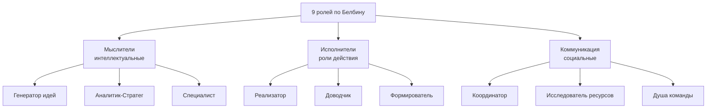
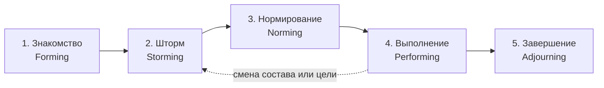

# Командная работа в IT

> [!abstract] О чём эта лекция
> Из чего складывается работоспособная команда: какие бывают навыки, чем команда отличается от группы, что такое психологическая безопасность, какие командные роли существуют по Белбину и через какие стадии проходит любая команда по Такману.
>
> **Зачем это нужно.** Роли из [[01. Введение в технологию разработки ПО]] описывают, *кто что делает*. Эта лекция отвечает на следующий вопрос: *как эти люди становятся командой, а не просто списком сотрудников*.
>
> **Что ты должен уметь после лекции:** объяснить разницу между группой и командой; перечислить 9 ролей по Белбину и 5 стадий по Такману; подобрать roles под задачу и под себя.

---

# Hard skills и soft skills

## Hard skills

**Hard skills** — это профессиональные, технические и прикладные навыки, которые можно приобрести через обучение и практику, а также проверить или измерить.

**Примеры**

- Знание языков программирования: Python, Rust, SQL.
- Работа с базами данных.
- Создание презентаций и диаграмм.
- Владение Microsoft Excel и Access.
- Настройка компьютерного оборудования.
- Знание иностранных языков.
- Бухгалтерский учёт и финансовый анализ.
- Разработка веб-сайтов и программ.

## Soft skills

**Soft skills** — это универсальные социальные, коммуникативные и личностные навыки, которые помогают человеку эффективно взаимодействовать с другими людьми, организовывать работу и адаптироваться к различным ситуациям.

**Примеры**

- Умение работать в команде.
- Коммуникабельность.
- Тайм-менеджмент.
- Критическое мышление.
- Способность решать проблемы.
- Лидерство.
- Стрессоустойчивость.
- Ответственность.
- Адаптивность.
- Умение выступать перед аудиторией.

> [!note] Почему в IT ценятся оба типа
> **Hard skills** определяют, *может* ли человек решить задачу.
> **Soft skills** определяют, *состоится* ли решение в команде: будет ли задача понята правильно, дойдёт ли информация, не развалится ли работа на стыке между людьми.
> Технический долг и провалы в проектах чаще возникают из-за коммуникации, а не из-за незнания синтаксиса.

---

# Группа и команда

## Группа

**Группа** — собрание людей, которые взаимодействуют и обмениваются информацией, но работают преимущественно над индивидуальными целями и несут личную ответственность за собственные результаты.

**Основные признаки группы**

- Участники могут иметь разные цели и задачи.
- Каждый человек отвечает в основном за свою часть работы.
- Результаты участников оцениваются индивидуально.
- Обмен информацией помогает выполнять личные задачи.
- Участники не обязательно обладают взаимодополняющими навыками.
- Координация между участниками может быть минимальной.

**Пример**

- Студенты одной учебной группы могут посещать одни и те же занятия и обмениваться информацией, но выполнять индивидуальные задания и получать отдельные оценки.

## Команда

**Команда** — малая группа людей, обладающих взаимодополняющими навыками, объединённых общей целью и общей ответственностью за результат.

**Основные признаки команды**

- Участников объединяет общая цель.
- Задачи распределяются между членами команды.
- Навыки участников дополняют друг друга.
- Участники координируют свои действия.
- Результат зависит от вклада каждого члена команды.
- Ответственность за итоговый результат является общей.
- Участники помогают друг другу и обмениваются знаниями.
- В команде существуют общие правила взаимодействия.

**Пример**

При разработке учебного приложения один участник пишет программный код, другой проектирует базу данных, третий создаёт интерфейс, а четвёртый проверяет работу программы. Все участники работают над одним продуктом и совместно отвечают за его результат.

## Главное различие

Главное различие между группой и командой заключается в характере общей работы. В **группе** люди могут взаимодействовать, но сохраняют индивидуальные цели и ответственность за личный результат. В **команде** люди объединены общей целью, распределяют обязанности, используют взаимодополняющие навыки и совместно отвечают за конечный результат.

## Условия эффективной работы команды

Для эффективной работы команды необходимы:

1. чётко сформулированная общая цель;
2. понятное распределение ролей и обязанностей;
3. доверие между участниками;
4. открытый обмен информацией;
5. взаимная поддержка;
6. конструктивное решение конфликтов;
7. согласованные сроки выполнения задач;
8. общая ответственность за результат.

---

# Психологическая безопасность

^a9c3f7

**Психологическая безопасность** — это уверенность члена команды в том, что его не накажут, не унизят и не отвергнут за высказывание идеи, вопроса, признание ошибки или выражение сомнений.

## Основная идея

Психологическая безопасность означает, что человек может открыто выражать своё мнение и участвовать в обсуждении без страха негативных последствий для своей репутации, положения или отношений с окружающими.

Она не означает отсутствие критики, конфликтов или высоких требований. Её основой является возможность обсуждать проблемы уважительно и конструктивно.

## Проявления психологической безопасности

Психологически безопасная среда позволяет человеку:

- задавать вопросы, если он чего-то не понимает;
- предлагать новые идеи;
- сообщать о проблемах и рисках;
- признавать собственные ошибки;
- выражать сомнения и несогласие;
- просить о помощи;
- давать и получать обратную связь;
- обсуждать сложные или неприятные темы;
- сообщать о перегрузке или нехватке ресурсов.

## Что происходит при отсутствии безопасности

Если психологическая безопасность отсутствует, человек может:

- скрывать ошибки и проблемы;
- избегать высказывания своего мнения;
- соглашаться с решениями, которые считает неправильными;
- не задавать уточняющие вопросы;
- бояться обращаться за помощью;
- воспринимать обсуждение как угрозу;
- реже предлагать новые идеи;
- испытывать напряжение и эмоциональное выгорание.

> [!warning] Почему это важно именно в разработке
> Ошибка, о которой сообщили на следующий день, стоит несколько часов. Та же ошибка, которую скрыли до релиза, стоит переработки, hotfix'а и репутационных потерь. Психологическая безопасность — это не «мягкая» тема, а механизм раннего обнаружения дефектов.

## Как формируется психологическая безопасность

Психологическая безопасность поддерживается с помощью следующих принципов:

- уважительное отношение к каждому участнику;
- внимательное выслушивание;
- отсутствие насмешек и унижения;
- спокойная реакция на ошибки;
- отделение ошибки от оценки личности;
- признание права на другое мнение;
- открытое обсуждение проблем;
- соблюдение договорённостей;
- справедливая и понятная обратная связь.

## Пример

Сотрудник замечает ошибку в плане проекта и сообщает о ней руководителю. Руководитель благодарит его за внимательность, вместе с ним анализирует причину ошибки и исправляет план. При этом сотрудника не обвиняют и не высмеивают.

Такая реакция показывает, что в организации можно открыто говорить о проблемах и учиться на ошибках.

## Важно

Психологическая безопасность не означает, что любое мнение считается правильным или что участники освобождаются от ответственности за свои действия. Она означает, что идеи и ошибки можно обсуждать без унижения, угроз и необоснованного наказания.

---

# Модель командных ролей по Белбину

^d2b6e4

> [!important] Один человек может брать на себя не более трёх ролей одновременно.

Модель описывает 9 поведенческих ролей, сгруппированных по трём направлениям: **Мыслители (интеллектуальные роли)**, **Исполнители (роли действия)** и **Коммуникация (социальные роли)**. Сбалансированная команда обычно включает представителей всех трёх групп.

> [!tip] Как запомнить три группы
> Мыслители **придумывают**, Исполнители **делают**, Коммуникация **связывает команду с собой и с внешним миром**.
> Перекос в любую сторону даёт предсказуемую болезнь: много Мыслителей и мало Исполнителей — идеи без результата;
> много Исполнителей без Мыслителей — аккуратно сделанное не то; нет Коммуникации — конфликт вместо работы.

---

## 1. Мыслители (интеллектуальные роли)

### 1.1. Генератор идей (Plant)

- **Занимается:** генерацией оригинальных, нестандартных идей и творческих решений сложных задач.
- **Плюсы:**
  - Креативен, предлагает инновационные подходы.
  - Умеет находить комплексные решения там, где другие видят тупик.
- **Минусы:**
  - Может быть труден в общении, игнорирует детали и протоколы.
  - Склонен «улетать» в абстракции и терять связь с практикой.

### 1.2. Аналитик-Стратег (Monitor Evaluator)

- **Занимается:** объективной оценкой идей, анализом вариантов и принятием взвешенных решений.
- **Плюсы:**
  - Логичен, беспристрастен, видит слабые места в планах.
  - Помогает команде избежать импульсивных ошибок.
- **Минусы:**
  - Может выглядеть как «тормоз» из-за излишней критичности.
  - Не всегда вдохновляет команду, склонен к скепсису.

### 1.3. Специалист (Specialist)

- **Занимается:** углублённой работой в узкой области экспертизы, предоставляет редкие знания и навыки.
- **Плюсы:**
  - Высокая компетентность в своей теме.
  - Самостоятелен, надёжен в профессиональных вопросах.
- **Минусы:**
  - Работает «в одиночку», слабо вовлечён в социальные аспекты проекта.
  - Может зацикливаться на технических деталях, упуская общую картину.

---

## 2. Исполнители (роли действия)

### 2.1. Реализатор (Implementer)

- **Занимается:** превращением идей и планов в конкретные, организованные действия.
- **Плюсы:**
  - Практичен, дисциплинирован, доводит задачи до конца.
  - Создаёт чёткие процедуры и рабочие процессы.
- **Минусы:**
  - Может быть недостаточно гибким при изменениях.
  - Не любит резких смен курса и неопределённости.

### 2.2. Доводчик (Completer Finisher)

- **Занимается:** поиском ошибок, шлифовкой результатов, контролем качества и сроков.
- **Плюсы:**
  - Внимателен к деталям, перфекционист.
  - Гарантирует, что проект будет сдан без «косяков».
- **Минусы:**
  - Склонен к излишней тревожности и микроменеджменту.
  - Может замедлять команду из-за стремления к идеалу.

### 2.3. Формирователь / Шейпер (Shaper)

- **Занимается:** давлением на команду для достижения результатов, преодолением инерции и препятствий.
- **Плюсы:**
  - Энергичен, нацелен на результат, не боится конфликтов.
  - «Толкает» проект вперёд, когда другие теряют темп.
- **Минусы:**
  - Может быть резким, провоцировать напряжение в коллективе.
  - Иногда игнорирует чувства и мнения других участников.

---

## 3. Коммуникация (социальные роли)

### 3.1. Координатор (Co-ordinator)

- **Занимается:** распределением ролей, делегированием обязанностей и согласованием усилий команды.
- **Плюсы:**
  - Спокоен, уверен в себе, видит сильные стороны участников.
  - Помогает команде двигаться к общей цели без хаоса.
- **Минусы:**
  - Может восприниматься как «ленивый лидер», который только раздаёт задачи.
  - Иногда склонен перекладывать работу на других.

### 3.2. Исследователь ресурсов (Resource Investigator)

- **Занимается:** поиском внешних связей, информации, подрядчиков и новых возможностей.
- **Плюсы:**
  - Общителен, любопытен, легко заводит контакты.
  - Приносит в команду свежие идеи и ресурсы извне.
- **Минусы:**
  - Может терять интерес к проекту после первоначального энтузиазма.
  - Не всегда доводит начатое до конца.

### 3.3. Душа компании / Душа команды (Teamworker)

- **Занимается:** поддержанием благоприятной атмосферы, снятием эмоционального напряжения и разрешением конфликтов.
- **Плюсы:**
  - Эмпатичен, дипломатичен, умеет слушать.
  - Помогает сохранить мотивацию и доверие в коллективе.
- **Минусы:**
  - Может избегать необходимых конфликтов ради «мира».
  - Иногда нерешителен в критических ситуациях.

---

## Сводная таблица ролей по Белбину

| Роль | Группа | Ключевая функция | Допустимая слабость |
|---|---|---|---|
| **Генератор идей** (Plant) | Мыслители | Источник нестандартных решений | Непрактичен, игнорирует детали |
| **Аналитик-Стратег** (Monitor Evaluator) | Мыслители | Взвешенная оценка вариантов | Избыточный скепсис, медлительность |
| **Специалист** (Specialist) | Мыслители | Глубокая узкая экспертиза | Оторванность от общей картины |
| **Реализатор** (Implementer) | Исполнители | Превращение плана в действия | Негибкость при изменениях |
| **Доводчик** (Completer Finisher) | Исполнители | Контроль качества и сроков | Тревожность, микроменеджмент |
| **Формирователь** (Shaper) | Исполнители | Давление ради результата | Резкость, конфликтность |
| **Координатор** (Co-ordinator) | Коммуникация | Распределение задач и делегирование | Может только делегировать |
| **Исследователь ресурсов** (Resource Investigator) | Коммуникация | Внешние связи и возможности | Теряет интерес, не доводит до конца |
| **Душа команды** (Teamworker) | Коммуникация | Атмосфера и снятие напряжения | Избегает конфликтов, нерешителен |

> [!tip] Как читать «допустимую слабость»
> У каждой роли сильные и слабые стороны — две стороны одной черты. Доводчик ловит ошибки именно потому, что тревожится о качестве. Задача команды — **не убрать слабость**, а закрыть её сильной стороной другой роли.

## Подсказки для использования в проектах

- **Баланс ролей:** старайся, чтобы в команде были представлены все три группы (Мыслители, Исполнители, Коммуникация).
- **Ограничение ролей:** один человек — максимум 3 роли, иначе снижается эффективность.
- **Гибкость:** роли могут меняться в зависимости от этапа проекта и состава команды.

> [!example] Признаки несбалансированной команды
> - Много **Мыслителей**, мало **Исполнителей** — идеи есть, готового продукта нет.
> - Много **Исполнителей**, мало **Мыслителей** — всё делается аккуратно, но не туда.
> - Нет **Коммуникации** — решения принимаются, но участники не понимают друг друга и конфликтуют.
> - Два **Формирователя** без **Координатора** — борьба за лидерство вместо работы.

**Практическое закрепление:** [[01. Самоанализ на роли по Белбину]] — какие роли лучше всего подходят, какие лучше избегать.

---

# Этапы формирования команды (модель Такмана)

^e8f4a2

Модель описывает, через какие состояния проходит команда от первого знакомства до роспуска. Стадии идут последовательно; вернуться на предыдущую можно — например, при смене состава команды.

> [!warning] Шторм нельзя перепрыгнуть
> Конфликт на второй стадии — не признак плохой команды, а рабочий этап: участники выясняют, кто за что отвечает
> и чьё мнение весит больше. Команда, которая «никогда не ссорится», чаще всего просто не дошла до настоящих
> решений. Задача руководителя в этот момент — не подавить конфликт, а вывести его в договорённости.

## 1. Знакомство (Forming)

- Участники только собираются в одну команду, присматриваются друг к другу и ищут своё место в группе.
- Много вопросов про цели проекта, роли, приоритеты и правила работы; на встречах все вежливы и согласны, но после — могут действовать по‑разному.
- Эффективность пока средняя: люди осторожничают, не выкладываются полностью и ещё не чувствуют себя единой командой (скорее «рабочая группа»).

**Что важно делать:** явно договориться о цели, границах и правилах взаимодействия; не ждать инициативы — её пока никто не проявит.

## 2. Шторм (Storming)

- Начинается «притирка»: проявляются разные ожидания, подходы и амбиции, возникают споры о приоритетах, ответственности и качестве работы.
- Это самый сложный этап: возможны конфликты, борьба за статус и влияние, обиды; некоторые могут даже задуматься о выходе из команды.
- К концу шторма роли начинают распределяться более равномерно, а группа превращается из псевдокоманды в потенциальную команду.

**Что важно делать:** не гасить конфликт, а переводить его в disagreement по существу — обсуждать решения, а не личности.

## 3. Нормирование (Norming)

- Появляются общие нормы и договорённости: как принимаются решения, как разрешаются конфликты, кто за что отвечает.
- Растёт доверие и взаимопомощь, люди начинают работать конструктивнее и чувствовать групповую идентичность («мы — команда»).
- Эффективность постепенно растёт: процессы становятся более предсказуемыми, коммуникация — спокойнее, а результаты — стабильнее.

**Что важно делать:** зафиксировать договорённости письменно — иначе при нагрузке команда откатывается к шторму.

## 4. Выполнение (Performing)

- Команда работает как слаженный механизм: задачи решаются быстро, с высоким качеством и минимальными трениями.
- Роли и процессы отлажены, люди понимают друг друга «с полуслова» и могут гибко перераспределять нагрузку.
- На этом этапе команда выдаёт максимальный результат и способна брать сложные, амбициозные задачи.

**Что важно делать:** не мешать; давать сложные задачи и беречь достигнутый уровень от лишней реорганизации.

## 5. Завершение / Роспуск (Adjourning)

- Проект заканчивается или команда реорганизуется: люди подводят итоги, дают друг другу обратную связь и благодарности.
- Формально команда расформировывается, участники переходят в новые проекты или отделы.
- Этот этап важен для закрытия гештальтов и сохранения хороших отношений на будущее.

**Что важно делать:** провести ретроспективу и зафиксировать выводы — иначе опыт команды теряется вместе с её роспуском.

## Сводная таблица стадий

| Стадия | Ключевой вопрос | Эффективность | Главный риск |
|---|---|---|---|
| **Forming** | Зачем мы здесь и кто я в этом? | Низкая–средняя | Расплывчатые цели |
| **Storming** | Чей подход правильный? | Падает | Конфликт переходит на личности |
| **Norming** | Как мы договорились работать? | Растёт | Договорённости не зафиксированы |
| **Performing** | Как сделать максимум? | Максимальная | Самоуспокоение, перегруз |
| **Adjourning** | Что мы вынесли из этого? | Снижается | Опыт не зафиксирован |

> [!note] Связь двух моделей
> **Белбин** описывает *состав* команды (какие роли нужны), **Такман** — *процесс* её развития во времени. Команда может быть идеально укомплектована по ролям и всё равно застрять в стадии «Шторм».

---

# Ключевые термины

| Термин | Определение |
|---|---|
| **Hard skills** | Профессиональные, технические, измеримые навыки |
| **Soft skills** | Социальные, коммуникативные и личностные навыки |
| **Группа** | Люди с индивидуальными целями и личной ответственностью |
| **Команда** | Люди с общей целью, взаимодополняющими навыками и общей ответственностью |
| **Психологическая безопасность** | Уверенность, что за вопрос, идею или признание ошибки не последует наказания |
| **Роль по Белбину** | Устойчивый паттерн поведения человека в команде |
| **Допустимая слабость** | Обратная сторона сильной черты роли |
| **Forming / Storming / Norming / Performing / Adjourning** | Пять стадий развития команды по Такману |
| **Фасилитация** | Организация обсуждения так, чтобы группа пришла к решению сама |

---

# Типичные заблуждения

- ❌ **«Хорошая команда — это команда без конфликтов».** Конфликт идей полезен; вреден конфликт личностей. Задача — удерживать разговор на уровне задач.
- ❌ **«Психологическая безопасность — это когда всех хвалят».** Нет: это когда можно сказать «я ошибся» и «я не согласен» без страха, при этом требования остаются высокими.
- ❌ **«Роль по Белбину — это должность».** Роль описывает поведение, а не позицию в штатном расписании. Один человек закрывает до трёх ролей.
- ❌ **«Команда соберётся сама, если собрать сильных специалистов».** Стадию «Шторм» проходят все команды; сильные специалисты без договорённостей конфликтуют даже сильнее.
- ❌ **«Soft skills — это про „приятно общаться“».** Это про то, дойдёт ли информация и будет ли результат: навык рабочий, а не «светский».

---

# Связи с другими темами

- [[01. Введение в технологию разработки ПО]] — роли и профессии, из которых складывается команда.
- [[01. Самоанализ на роли по Белбину]] — практическое применение модели Белбина: разбор собственных ролей.
- [[03. Жизненный цикл ПО]] — на каком этапе ЖЦ какие роли становятся ведущими.
- [[04. ИИ в разработке ПО]] — как меняется распределение ролей при использовании ИИ-ассистентов.
- [[05. Логика и архитектура системы контроля версий]] — техническая сторона совместной работы: ветки как изоляция задач, code review как коммуникация и конфликты слияния как симптом невыстроенных договорённостей.
- [[06. Принципы качественного кода и технический долг]] — ревью кода как главный механизм профилактики **ненамеренного** технического долга: второй человек видит нарушение принципов там, где автор его не замечает.
- [[01_Технология_Разработки_ПО/00_Курс|00_Курс]] — оглавление курса и порядок прохождения.
