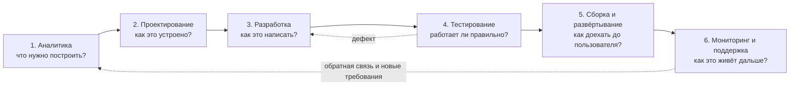

# Жизненный цикл ПО

> [!abstract] О чём эта лекция
> Из каких этапов состоит существование программного продукта, что получается на каждом этапе, кто в нём участвует и во сколько это обходится.
>
> **Зачем это нужно.** Это **опорный конспект курса** и вторая из трёх опор подготовки к экзамену (см. [[01_Технология_Разработки_ПО/00_Курс|00_Курс]]). Если ты помнишь этапы, артефакты и участников — у тебя есть скелет, на который навешивается весь остальной материал: [[01. Введение в технологию разработки ПО]] даёт методологии, [[04. ИИ в разработке ПО]] — автоматизацию каждого этапа, [[02. Вариант 6. Система учета заказов для небольшого кафе]] — живой пример прохождения всех этапов.
>
> **Что ты должен уметь после лекции:** назвать 6 этапов ЖЦ; для каждого — артефакты и участников; объяснить, из чего складывается бюджет и чем прямая ценность продукта отличается от косвенной.

---

# Понятие жизненного цикла ПО

Жизненный цикл ПО — последовательность взаимосвязанных этапов создания и сопровождения программного продукта: от возникновения идеи до вывода из эксплуатации.
Можно воспринимать его как «дорожную карту» или инструкцию, отвечающую на вопрос: «Как превратить идею в готовый продукт и поддерживать его дальше?».

**Дополнительные определения и общая информация**
- В стандартах (например, ISO/IEC 12207) жизненный цикл описывается как набор процессов, действий и задач, необходимых для разработки, эксплуатации и сопровождения ПО.
- Модели жизненного цикла (водопад, итеративная, инкрементальная, спиральная, Agile/SCRUM) определяют порядок и способ перехода между этапами.
- Жизненный цикл охватывает не только разработку, но и эксплуатацию, техническую поддержку, обновления и завершение использования продукта.

---

# Модели жизненного цикла

Модель ЖЦ задаёт **порядок и способ перехода между этапами**. Сами этапы при этом остаются прежними.

| Модель | Как движется | Ключевая особенность |
|---|---|---|
| **Каскадная (Waterfall)** | Строго последовательно, без возврата | Максимум документации, минимум гибкости |
| **V-модель** | Последовательно, но каждой стадии проектирования заранее сопоставлена стадия проверки | Тестирование планируется одновременно с проектированием |
| **Итеративная** | Повторные проходы по всем этапам, уточняющие продукт | Глубина проработки растёт, объём функций — не обязательно |
| **Инкрементальная** | Продукт собирается из частей, каждая проходит полный цикл | Работающий функционал появляется по частям |
| **Спиральная** | Виток = прототип + анализ рисков | Основной акцент на управлении рисками |
| **Agile (Scrum/Kanban)** | Короткие циклы, в каждом — все этапы сразу | Приоритет работающему продукту и обратной связи |

> [!warning] Чем дороже становится ошибка со временем
> Ошибка в требованиях, найденная на этапе анализа, стоит **условную единицу**. Та же ошибка, найденная при тестировании, — уже **десятки единиц** (нужно переделать код, тесты и документацию). Найденная в эксплуатации — **сотни** (плюс хотфикс, перевыпуск, потеря доверия).
> Это «правило 1:10:100» — и есть главный аргумент в пользу раннего контроля качества. Именно поэтому [[02. Структура CASE-технологии. Структура среды разработки]] переносит основную долю трудозатрат на анализ и проектирование.

---

# Экономика продукта

**Экономика продукта (в контексте IT)** — совокупность экономических эффектов и денежных потоков, которые продукт создаёт для владельца/компании: доходы, экономия затрат, влияние на репутацию и косвенные выгоды.

## 1. Прямая ценность
**Определение**: денежный поток, непосредственно поступающий от использования/продажи продукта (подписки, разовые покупки, комиссии, реклама внутри продукта).
**Примеры**:
- продажа лицензии на приложение;
- ежемесячная подписка на SaaS-сервис;
- комиссия с транзакций в платежном приложении.

## 2. Косвенная ценность
**Определение**: выгоды, которые не приходят напрямую в виде платежей за продукт, но повышают общую эффективность бизнеса и прибыль.
**Примеры**:
- внутренний инструмент автоматизации, который сокращает время обработки заявок и уменьшает затраты на персонал;
- CRM-система, повышающая конверсию продаж за счёт лучшего учёта клиентов;
- аналитическая панель, позволяющая быстрее принимать управленческие решения.

## 3. Репутационная ценность
**Определение**: нематериальные выгоды, связанные с имиджем, лояльностью и доверием к бренду, которые в перспективе конвертируются в деньги.
**Примеры**:
- бесплатное банковское приложение, упрощающее жизнь клиентам и усиливающее доверие к банку;
- открытый SDK/API для разработчиков, формирующий экосистему вокруг продукта;
- качественный бесплатный сервис, который становится «визитной карточкой» компании.

---

# Бюджет в IT

**Бюджет проекта/продукта в IT** — плановый объём финансовых ресурсов, выделенных на создание, запуск и поддержку продукта на определённый период, распределённый по статьям расходов.

## 1. Зарплата команды
**Определение**: расходы на оплату труда всех участников проекта (разработчики, дизайнеры, тестировщики, аналитики, менеджеры, DevOps и др.).
**Примеры**:
- оклады и премии команды разработки мобильного приложения;
- оплата услуг внешнего UX-дизайнера на часть проекта;
- затраты на привлечение фрилансеров для отдельных задач.

## 2. Маркетинг
**Определение**: расходы на продвижение продукта, привлечение и удержание пользователей.
**Примеры**:
- реклама в социальных сетях и поисковых системах;
- работа с блогерами и партнёрские программы;
- участие в конференциях, спонсорство, PR-кампании.

## 3. Серверы и хостинг
**Определение**: затраты на инфраструктуру, необходимую для работы продукта (серверы, облачные ресурсы, домены, CDN, базы данных как сервис).
**Примеры**:
- аренда виртуальных серверов (VPS) под бэкенд;
- использование облачных сервисов (например, хранилище, бессерверные функции);
- оплата домена и SSL-сертификатов.

## 4. Лицензии на ПО
**Определение**: расходы на приобретение прав на использование стороннего программного обеспечения, библиотек, инструментов и сервисов.
**Примеры**:
- лицензии на IDE, системы проектирования, инструменты тестирования;
- платные библиотеки/компоненты, используемые в продукте;
- подписки на сервисы аналитики, мониторинга, CI/CD.

---

# Этапы жизненного цикла ПО

Ниже — общая схема. Она одинакова для большинства моделей ЖЦ; различается только то, проходятся ли этапы один раз (каскад) или многократно короткими циклами (Agile).

> [!note] Две пунктирные стрелки — это то, чего нет в каскаде
> Возврат из тестирования в разработку и из поддержки в аналитику — не исключение, а норма.
> Именно поэтому стоимость ошибки растёт от этапа к этапу: чем дальше ушло требование,
> тем больше артефактов придётся переделывать при возврате.

## Сводная таблица этапов

| № | Этап | Главный вопрос | Ключевые артефакты | Ведущие роли |
|---|---|---|---|---|
| 1 | **Аналитика** | Что нужно построить? | ТЗ, user stories, критерии приёмки | Аналитик, заказчик, архитектор |
| 2 | **Проектирование** | Как это будет устроено? | Техническая архитектура, дизайн-макеты, ERD | Архитектор, UX/UI, аналитик |
| 3 | **Разработка** | Как это написать? | Исходный код, коммиты, MR/PR | Frontend, backend, mobile |
| 4 | **Тестирование** | Работает ли это правильно? | Тест-планы, тест-кейсы, баг-репорты | QA, разработчики |
| 5 | **Сборка и развёртывание** | Как это доехать до пользователя? | Сборка, установщик, CI/CD-пайплайн | DevOps, системные администраторы |
| 6 | **Мониторинг и поддержка** | Как это живёт дальше? | Логи, метрики, хотфиксы, обратная связь | L1/L2/L3, DevOps, аналитики |

> [!tip] Как пользоваться таблицей
> Это и есть «скелет» ответа на экзаменационный вопрос про ЖЦ. Дальше каждый этап разобран подробно — по определениям, артефактам и участникам.

> [!example] Как читать этап
> У каждого этапа три обязательные характеристики, и на экзамене спрашивают именно их:
> **артефакты** (что появляется на выходе), **участники** (кто делает) и **главный вопрос** (на что этап отвечает).
> Если можешь назвать все три по каждому из шести этапов — тема закрыта.

---

## Аналитика

^etap-analitika

- Анализ требований заказчика: что явно должно быть и чего быть не должно.

**Основные определения этапа**:
- **Техническое задание** — документ между заказчиком и разработчиком, который определяет требования заказчика.
- **Стейкхолдеры** — все люди, которых касается проект: пользователи, разработчики, заказчики, инвесторы, специалисты поддержки и др.
- **Пользовательская история (user story)** — короткий шаблон описания требования с точки зрения конкретного стейкхолдера (обычно пользователя), например: «Как `<роль>`, я хочу `<цель>`, чтобы `<причина/выгода>`».

**Два класса требований** — разделять их нужно уже на аналитике, потому что проверяются они по-разному:

| Класс | Что описывает | Формулировка | Как проверяется |
|---|---|---|---|
| **Функциональные (ФТ)** | Что система **делает**: конкретные действия и поведение | «Официант создаёт заказ и отправляет его на кухню» | Тест-кейсом: выполнил действие — получил результат |
| **Нефункциональные (НФТ)** | Какими **свойствами** обладает система: производительность, надёжность, безопасность, удобство | «Отклик интерфейса — не более 1 секунды», «работа без интернета» | Измерением или наблюдением, а не одним сценарием |

> [!warning] НФТ без критерия — не требование
> «Быстро» и «удобно» проверить нельзя. Требованием становится только формулировка с мерой:
> «отклик < 1 секунды», «выдерживает 50 одновременных заказов», «кнопки не меньше 44 px».
> Если НФТ нельзя измерить, его нельзя и принять — значит, на аналитике что-то не договорили.

**Источники требований**:
1. Проведение интервью (с заказчиком, пользователями, экспертами).
2. Наблюдение за текущими процессами (как пользователи работают сейчас).
3. Анализ конкурентов (какие функции есть у других, что удобно/неудобно).
4. Законодательство (обязательные требования: защита данных, отчётность, стандарты).

**Специалисты и их участие**:
- **Заказчик / бизнес-владелец**: формулирует бизнес-цели, приоритеты, ограничения.
- **Бизнес-аналитик / системный аналитик**: собирает, структурирует и формализует требования, пишет ТЗ и пользовательские истории.
- **Пользователи / эксперты предметной области**: участвуют в интервью, дают обратную связь по сценариям использования.
- **Разработчики и архитектор**: оценивают техническую реализуемость требований, задают уточняющие вопросы.
- **Тестировщики**: уже на этом этапе думают о том, как требования можно проверить (критерии приёмки).

---

## Проектирование

^etap-proektirovanie

- Архитектура программы.

**Типы архитектур**:

1. **Монолит**
   - Всё приложение собрано в единую кодовую базу и развёртывается как один цельный продукт.
   - Проще в начале: меньше сложностей с развёртыванием, отладкой, сетевыми вызовами.
   - При росте может стать тяжёлым в поддержке: любое изменение требует пересборки и повторного развёртывания всего приложения.

2. **Микросервисы**
   - Приложение разбито на несколько небольших независимых сервисов, каждый отвечает за свою бизнес-функцию.
   - Сервисы общаются по сети (HTTP/REST, gRPC, очереди сообщений и т.п.).
   - Легче масштабировать отдельные части, обновлять независимо, но выше сложность инфраструктуры и координации.

**Плагины к монолитным архитектурам**
Наличие сторонних плагинов само по себе **не превращает монолит в микросервисы**.
- Если плагины работают внутри того же процесса, используют общие библиотеки и базу, и развёртываются вместе с основным приложением — это всё ещё монолит с расширяемостью.
- Микросервисная архитектура предполагает, что отдельные части:
  - развёрнуты независимо;
  - имеют собственные процессы/контейнеры;
  - общаются преимущественно по сети;
  - могут разрабатываться и масштабироваться отдельно.
Плагины могут быть шагом к модульности, но не являются микросервисами сами по себе.

**Основные определения этапа**:
- **User Interface (UI)** — внешний вид программы: расположение элементов, цвета, шрифты, иконки, анимации.
- **User Experience (UX)** — удобство работы в программе: логика переходов, понятность интерфейса, скорость выполнения задач, удовлетворённость пользователя.

**Документация (артефакты) этапа**:

1. **Техническая архитектура**
   - Схема работы продукта: из каких компонентов состоит, как они взаимодействуют, какие технологии используются.
   - Может включать:
     - диаграммы компонентов;
     - схемы взаимодействия сервисов;
     - описание уровней (frontend, backend, база данных, внешние сервисы).

2. **Дизайн-макет**
   - Внешний вид продукта в виде статических или интерактивных макетов.

   **Понятия**:
   - **Wireframe** (каркас) — логическая схема расположения элементов интерфейса без детальной графики (чёрно-белый или схематичный вид).
   - **Мокап (mockup)** — цветной макет, похожий на конечный продукт, с дизайном, но без полной интерактивности.
   - **Прототип** — кликабельный вариант мокапа, имитирующий основные переходы и сценарии использования.
   - **Схема базы (ERD)** — диаграмма «сущность–связь», описывающая таблицы, поля и связи между ними.

**Специалисты и их участие**:
- **Архитектор / ведущий разработчик**: проектирует общую архитектуру, выбирает технологии, определяет границы модулей/сервисов.
- **Backend-разработчики**: участвуют в проектировании API, схем данных, логики сервисов.
- **Frontend-разработчики**: проектируют клиентскую часть, взаимодействие с API, состояние интерфейса.
- **UX/UI-дизайнеры**: создают wireframe, мокапы, прототипы, продумывают пользовательские сценарии.
- **Аналитики**: следят, чтобы проектные решения соответствовали требованиям из этапа аналитики.
- **DevOps-инженеры**: уже на этом этапе могут предлагать решения по развёртыванию, масштабированию, инфраструктуре.

---

## Разработка

- Выбор IDE для разработки.
- Система контроля версий: GitHub / GitLab (см. [[05. Логика и архитектура системы контроля версий]]).
- Выбор библиотек для решения задач.

**Содержание этапа**:
- Написание кода согласно проектной документации и техническому заданию.
- Реализация бизнес-логики, интерфейсов, интеграций с внешними сервисами.
- Постоянная работа с системой контроля версий (Git): ветки, pull/merge request’ы, ревью кода — механика описана в [[05. Логика и архитектура системы контроля версий]].
- Подбор и подключение библиотек/фреймворков для ускорения разработки (например, для работы с HTTP, базами данных, авторизацией, тестами).

**Специалисты и их участие**:
- **Backend-разработчики**: реализуют серверную логику, API, работу с базой данных.
- **Frontend-разработчики**: реализуют пользовательский интерфейс, клиентскую логику, взаимодействие с API.
- **Mobile-разработчики** (если есть): создают приложения для iOS/Android.
- **DevOps-инженеры**: настраивают окружение для разработки, CI-пайплайны, базовую инфраструктуру.
- **Тестировщики**: начинают писать автотесты параллельно с разработкой (особенно unit- и интеграционные).

---

## Тестирование

^etap-testirovanie

**Виды тестирования**:

1. **Ручное тестирование**
   - Выполняется по чек-листу или тест-кейсам.
   - Тестировщик проходит сценарии использования, проверяет соответствие требованиям и удобство работы.
   - Хорошо подходит для проверки UX, сложных сценариев, визуальных дефектов.

2. **Автоматическое тестирование**
   1. **Unit-тесты**
      - Проверяют отдельные функции, методы, классы изолированно.
      - Пишут разработчики и/или тестировщики.
      - Быстро выполняются, помогают ловить ошибки при рефакторинге.
   2. **UI-тесты (end-to-end, интеграционные)**
      - Проверяют работу интерфейса и взаимодействие компонентов «сквозь» систему.
      - Имитируют действия пользователя: клики, ввод данных, переходы.
      - Медленнее unit-тестов, но ближе к реальному использованию.

**Из чего состоит проверка**:

- **Тест-кейс** — описание одной проверки: предусловие → шаги → ожидаемый результат.
- **Критерии приёмки** — условия, при которых требование считается выполненным; формулируются ещё на аналитике, поэтому НФТ обязательно должны быть измеримыми.
- **Граничный случай (edge case)** — крайний или нетипичный сценарий: пустой заказ, нулевая сумма,
  отсутствие интернета, два официанта редактируют один стол. Именно на них система ломается чаще всего, поэтому их выносят в отдельный раздел тест-плана, а не надеются, что «обычные сценарии покроют».

> [!tip] Сколько тестов достаточно
> Тест-план строится от требований, а не от кода: на каждое ФТ — минимум один позитивный сценарий
> и минимум один негативный (что должно произойти при неверных данных). Отдельно — список граничных случаев.
> Если требование нельзя превратить в тест-кейс, значит, оно сформулировано не как требование.

**Специалисты и их участие**:
- **Тестировщики (QA-инженеры)**: составляют тест-планы, пишут и исполняют ручные и автоматические тесты, фиксируют дефекты.
- **Разработчики**: исправляют найденные ошибки, пишут и поддерживают unit-тесты, иногда участвуют в написании автотестов.
- **Аналитики / владельцы продукта**: помогают определить, соответствует ли поведение продукта изначальным требованиям и ожиданиям.

---

## Сборка и развёртывание

^etap-sborka-razvertyvanie

- Разработка закончена, тесты проведены.
- Компиляция продукта, создание установщика.
- Загрузка установщика «в массы».
- Большую часть работы выполняет DevOps.

**Содержание этапа**:
- Сборка финальных версий приложения (компиляция, линковка, минификация, оптимизация).
- Создание установщиков/пакетов: .exe, .msi, .deb, .rpm, образы контейнеров, мобильные пакеты (.apk, .ipa) и т.п.
- Настройка процессов непрерывной доставки (CI/CD): автоматическая сборка, тестирование и развёртывание при изменениях в коде.
- Развёртывание на продакшн-серверах, в облаке, в магазинах приложений (App Store, Google Play, маркетплейсы десктопных приложений).

**Специалисты и их участие**:
- **DevOps-инженеры**: настраивают пайплайны сборки и развёртывания, управляют серверами, контейнерами, окружениями.
- **Разработчики**: готовят код к релизу, исправляют критические ошибки, участвуют в проверке сборок.
- **Тестировщики**: проводят регрессионное тестирование на сборках, близких к релизным.
- **Системные администраторы / инженеры инфраструктуры**: поддерживают серверы, сети, базы данных, на которых развёрнут продукт.

---

## Мониторинг и поддержка

^etap-monitoring-podderzhka

- Хотфиксы, патчи и т.п.
- Сервис.
- Обновление по обратной связи.

**Содержание этапа**:
- Мониторинг работы продукта в продакшене: логи, метрики производительности, ошибки, доступность.
- Оперативное исправление критических ошибок (хотфиксы, патчи).
- Плановые обновления: новые функции, улучшения, исправления уязвимостей.
- Сбор и анализ обратной связи от пользователей для формирования требований к следующим версиям.

**Уровни технической поддержки**:

1. **Первая линия поддержки (L1)**
   - **Термин**: специалисты первой линии поддержки (first-line support, helpdesk).
   - **Определение**: сотрудники, которые первыми контактируют с пользователем, принимают обращения и первично классифицируют проблемы.
   - **Работа**:
     - отвечают на типовые вопросы (как зарегистрироваться, как восстановить пароль, как выполнить базовые действия);
     - собирают информацию о проблеме (шаги воспроизведения, скриншоты, логи, если доступны);
     - решают простые инциденты по инструкциям;
     - передают сложные технические случаи на вторую линию.

2. **Вторая линия поддержки (L2)**
   - **Термин**: специалисты второй линии поддержки (second-line support, technical support engineers).
   - **Определение**: технические специалисты, которые разбираются в устройстве продукта глубже и работают со сложными инцидентами.
   - **Работа**:
     - анализируют логи, конфигурации, воспроизводят проблему на тестовом окружении;
     - предлагают временные решения (workarounds) или исправления конфигурации;
     - при необходимости готовят подробное описание бага для разработчиков;
     - могут выполнять несложные изменения в коде/скриптах, если это входит в их зону ответственности.

3. **Третья линия поддержки (L3)**
   - **Термин**: разработчики / инженерная поддержка третьей линии (third-line support, development team).
   - **Определение**: команда разработчиков и ключевые инженеры, которые вносят изменения в код продукта для устранения причин ошибок.
   - **Работа**:
     - исследуют корневые причины дефектов, найденных L1/L2;
     - реализуют исправления в коде, пишут тесты, проверяют, что ошибка не повторится;
     - готовят новые версии/патчи, которые затем проходят сборку, тестирование и развёртывание;
     - могут участвовать в проектировании улучшений на основе частых обращений пользователей.

**Специалисты и их участие**:
- **Специалисты L1/L2/L3**: обрабатывают обращения пользователей, решают инциденты разной сложности.
- **DevOps / системные администраторы**: следят за доступностью, производительностью, исправляют проблемы инфраструктуры.
- **Разработчики**: исправляют ошибки, реализуют улучшения, выпускают новые версии.
- **Аналитики / менеджеры продукта**: анализируют обратную связь, формируют требования к новым функциям и изменениям.

---

# Ключевые термины

| Термин | Определение |
|---|---|
| **Жизненный цикл ПО (SDLC)** | Последовательность этапов создания и сопровождения продукта от идеи до вывода из эксплуатации |
| **Модель ЖЦ** | Способ перехода между этапами: каскадная, V-образная, итеративная, инкрементальная, спиральная, Agile |
| **ISO/IEC 12207** | Стандарт, описывающий процессы, действия и задачи жизненного цикла ПО |
| **Прямая ценность** | Денежный поток, непосредственно поступающий от использования или продажи продукта |
| **Косвенная ценность** | Выгоды, которые не приходят как платежи за продукт, но повышают эффективность бизнеса |
| **Репутационная ценность** | Нематериальные выгоды: имидж, лояльность, доверие к бренду |
| **Бюджет проекта** | Плановый объём финансовых ресурсов, распределённый по статьям расходов |
| **Стейкхолдер** | Любой человек, которого касается проект: пользователь, заказчик, разработчик, инвестор |
| **User story** | Шаблон требования: «Как `<роль>`, я хочу `<цель>`, чтобы `<выгода>`» |
| **Wireframe / мокап / прототип** | Каркас интерфейса / цветной макет / кликабельный макет с переходами |
| **ERD** | Диаграмма «сущность–связь», описывающая таблицы, поля и связи |
| **Монолит / микросервисы** | Единая кодовая база и развёртывание / независимые сервисы, общающиеся по сети |
| **Unit-тест / E2E-тест** | Тест отдельного модуля / тест сквозного сценария через интерфейс |
| **CI/CD** | Непрерывная интеграция и доставка: автоматические сборка, тесты и развёртывание |
| **L1 / L2 / L3** | Три линии технической поддержки: приём обращений, технический анализ, исправление в коде |

---

# Типичные заблуждения

- ❌ **«Аналитика заканчивается до начала разработки».** Требования уточняются весь проект; вопрос лишь в том, формализован ли этот процесс (Agile) или является исключением (каскад).
- ❌ **«Тестирование — это этап после разработки».** Тесты начинают писать параллельно с кодом; отдельный этап — это *регрессионное* тестирование и приёмочная проверка перед релизом.
- ❌ **«Микросервисы всегда лучше монолита».** Микросервисы покупают независимое масштабирование ценой сложности инфраструктуры. Для небольшой системы это почти всегда лишние затраты.
- ❌ **«Плагины делают монолит микросервисной архитектурой».** Плагин в том же процессе и с общей базой — это монолит с расширяемостью, а не микросервис.
- ❌ **«Поддержка — это когда чинят баги».** Это ещё и источник требований к следующим версиям: обратная связь L1/L2 превращается в бэклог.
- ❌ **«Бюджет проекта — это только зарплата разработчикам».** Маркетинг, инфраструктура, лицензии и поддержка — полноценные статьи расходов, и они не исчезают после релиза.

---

# Связи с другими темами

- [[01. Введение в технологию разработки ПО]] — методологии и модели ЖЦ: как именно двигаться по этим этапам.
- [[04. ИИ в разработке ПО]] — чем автоматизируется каждый из шести этапов; ссылается на разделы этого конспекта напрямую.
- [[02. Структура CASE-технологии. Структура среды разработки]] — как CASE-средства автоматизируют анализ и проектирование и перераспределяют трудозатраты по фазам.
- [[01. Роль анализа предметной области в процессе разработки ПО. Основные понятия ООА]] — чем наполнен этап аналитики: бизнес-процессы, функции, операции, объектная модель.
- [[02. Вариант 6. Система учета заказов для небольшого кафе]] — пример полного прохождения всех этапов на конкретном продукте.
- [[03. Применение промпт-инжиниринга на этапах ЖЦПО]] — те же этапы, пройденные с помощью ИИ.
- [[05. Логика и архитектура системы контроля версий]] — как устроены изнутри коммиты, ветки и MR/PR, которые на этапе разработки выступают артефактами, а на этапе сборки — источником триггеров CI/CD.
- [[06. Принципы качественного кода и технический долг]] — почему экономия на качестве на этапе разработки превращается в дорогой этап поддержки: DRY, KISS, признаки и причины технического долга.
- [[01_Технология_Разработки_ПО/00_Курс|00_Курс]] — оглавление курса и порядок прохождения.
