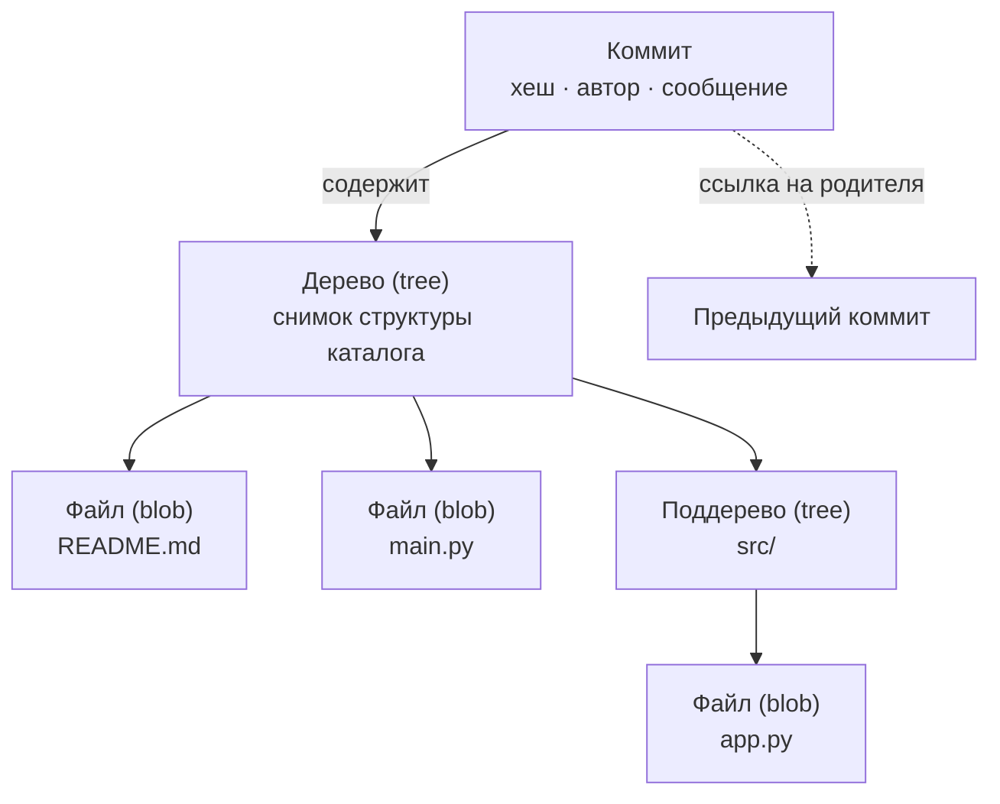
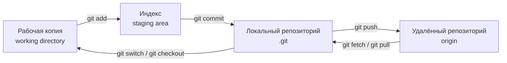
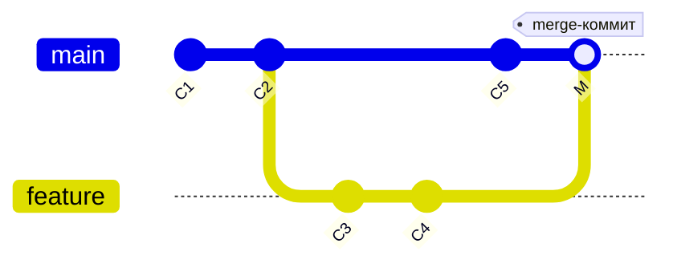
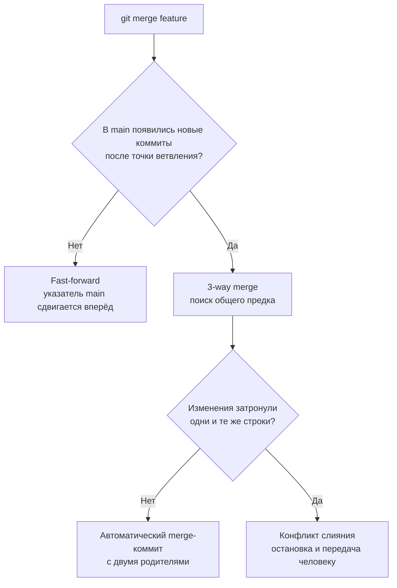
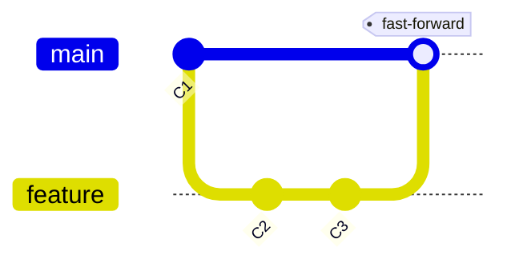
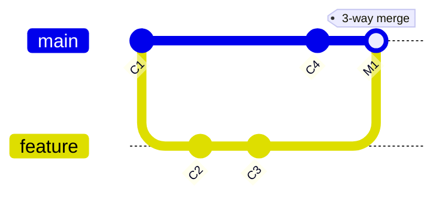
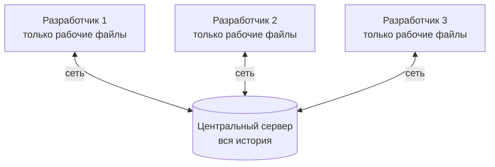
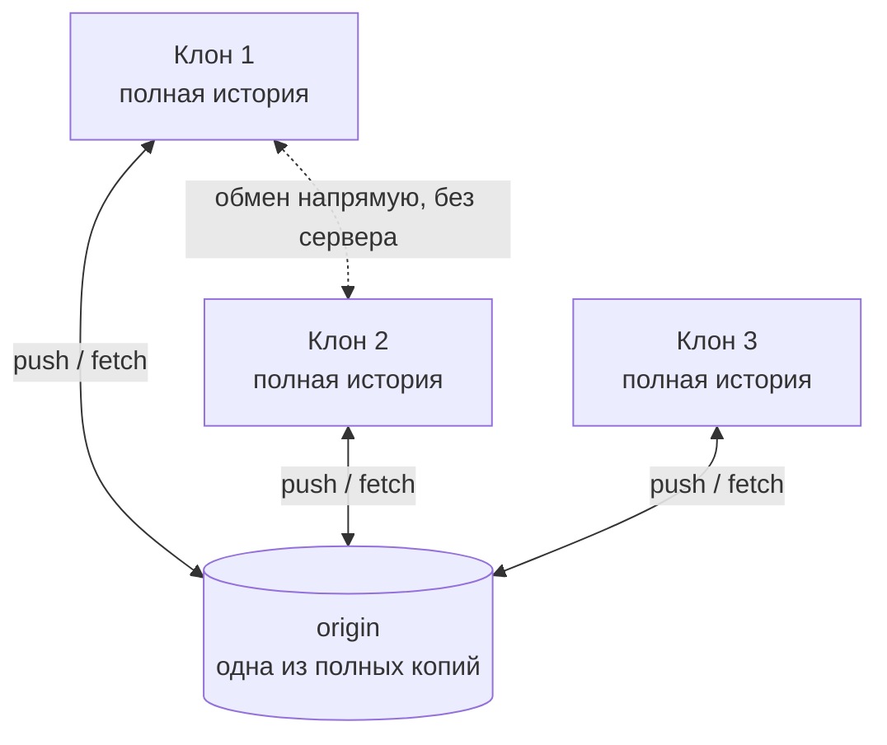

# Логика и архитектура системы контроля версий

> [!abstract] О чём эта лекция
> Как устроена система контроля версий изнутри: коммит как атомарная единица истории, репозиторий как граф, ветка как указатель, слияние как алгоритм с тремя исходами, и две архитектурные модели — централизованная и распределённая.
>
> **Зачем это нужно.** Это инструментальный слой всего курса. В [[03. Жизненный цикл ПО#Разработка|этапе разработки]] система контроля версий названа одним из трёх базовых инструментов, а артефактами этапа выступают именно *коммиты и MR/PR*; [[02. Командная работа в IT]] описывает людей, которые через ветки и ревью договариваются о совместной работе; [[04. ИИ в разработке ПО]] показывает ИИ-агентов, которые в 2026 году массово создают pull request’ы. Без понимания того, **что такое коммит и как работает слияние**, все эти процессы выглядят магией.
>
> **Что ты должен уметь после лекции:** объяснить, что хранится в коммите и почему это снимок, а не разница; описать, чем ветка отличается от копии файлов; различить fast-forward, трёхстороннее слияние и конфликт; сравнить CVCS и DVCS и объяснить, почему победила вторая; назвать элементы workflow (ветка → PR/MR → ревью → merge) и подобрать стратегию ветвления под проект.

---

# Проблема: хаос ручного управления

Пока проект живёт в одной папке, которую редактируют несколько человек, неизбежно возникают три проблемы:

1. **Непонятно, что именно изменилось между версиями.** Есть набор файлов, но нет ответа на вопрос «чем версия от вторника отличается от версии от понедельника».
2. **Непонятно, кто и когда внёс изменения.** Файл испорчен — найти автора правки невозможно, если правки не подписаны.
3. **Параллельные правки невозможно объединить.** Если два человека одновременно редактируют одну и ту же версию файла, их результаты перезаписывают друг друга; «склеить» две разошедшиеся копии вручную — дорогая и ошибкоопасная операция.

> [!example] Как это выглядит на практике
> Классическая эволюция имени файла в папке без VCS:
> `Отчёт.docx` → `Отчёт_финал.docx` → `Отчёт_финал2.docx` → `Отчёт_финал2_правленный.docx` → `Отчёт_ФИНАЛ_ТОЧНО_ФИНАЛ.docx`.
> При этом непонятно: какая версия актуальна, что изменилось между «финал» и «финал2», и кто из двух авторов добавил абзац про бюджет.

**Следствие.** Ручное управление версиями не масштабируется: оно работает, пока проект маленький и автор один. Как только появляются второй человек, второй компьютер или второй дедлайн — стоимость согласования растёт быстрее, чем объём работы.

---

# Решение: система контроля версий

- **Система контроля версий (Version Control System, VCS)** — программная система для отслеживания, документирования и управления изменениями в наборе данных (обычно в исходном коде) во времени, а также для координации совместной работы нескольких людей.
- VCS решает проблему хаоса, превращая линейный набор файлов в **структурированную историю изменений**, которой можно управлять: её можно читать, ветвить, объединять, откатывать и синхронизировать между машинами.

**Что конкретно даёт VCS:**

| Проблема без VCS | Что даёт VCS |
|---|---|
| Не видно, что изменилось | **История (history)** — каждая версия зафиксирована, есть построчная разница (diff) между любыми двумя состояниями |
| Не видно, кто и когда правил | **Авторство** — каждая правка привязана к автору, дате и сообщению с объяснением причины |
| Параллельные правки теряются | **Ветвление и слияние** — изолированные линии работы, которые потом объединяются алгоритмически |
| Ошибку нельзя откатить | **Возврат к любому состоянию** — любой коммит достижим, пока он не удалён сборщиком мусора |
| Файлы живут на одном компьютере | **Синхронизация** — общая точка обмена между машинами и людьми |
| Непонятно, что идёт в релиз | **Метки (теги)** — фиксация конкретной версии продукта: `v1.0.0`, `v2.3.1` |

**Какие системы существуют:**

| Тип | Примеры | Комментарий |
|---|---|---|
| Централизованные (CVCS) | CVS, **Subversion (SVN)**, Perforce | Исторически первые массовые решения; Perforce до сих пор силён в геймдеве |
| Распределённые (DVCS) | **Git**, Mercurial (hg), Bazaar | Git — фактический стандарт индустрии |

> [!note] Git ≠ GitHub
> **Git** — сама система контроля версий, программа на твоём компьютере. **GitHub**, **GitLab**, **Bitbucket**, **Gitea**, **Codeberg** — хостинги репозиториев, которые хранят копию репозитория и добавляют поверх Git веб-интерфейс, ревью, задачи и CI/CD. Git работает без хостинга; хостинг без Git — нет.

---

# Ключевая единица: коммит

- **Коммит (commit)** — атомарная единица истории VCS: зафиксированное, неделимое изменение состояния проекта.
- В Git коммит — это **полный снимок (snapshot) состояния всех файлов проекта** в конкретный момент времени, а не просто разница между файлами.
- **Атомарность** означает: коммит либо целиком вошёл в историю, либо его нет. Один коммит — одна логическая единица работы (одна функция, одно исправление, один рефакторинг), а не «всё, что накопилось за неделю».

> [!example] Аналогия: фотоальбом
> Каждый коммит — **фотография рабочего стола** проекта. Если ты изменил только один файл, система всё равно «фотографирует» весь проект, но для неизменённых файлов не делает новый снимок, а ставит **ссылку на уже существующий**. Поэтому сотня коммитов не означает стократного роста объёма хранилища.

> [!warning] Снимки в Git — но не во всех VCS
> Модель «каждый коммит — снимок» характерна для Git. Централизованные системы (SVN) исторически хранят **дельты**: базовую версию файла и цепочку различий между ревизиями. Отсюда разница в ощущениях: в Git любая версия извлекается одинаково быстро, потому что это готовый снимок; в дельтовых системах восстановление старой версии требует «прокрутки» всей цепочки изменений. Физически Git тоже применяет дельта-сжатие, но уже **внутри** хранилища (pack-файлы) — это оптимизация хранения, а не модель данных.

---

# Анатомия коммита

^d3f1a2

Каждый коммит строго формализован и содержит:

| Поле | Что это | Зачем нужно |
|---|---|---|
| **Уникальный хеш** | Криптографический отпечаток содержимого (по умолчанию SHA-1, 40 шестнадцатеричных символов, например `844ffe21…`) | Однозначно идентифицирует коммит; любое изменение содержимого меняет хеш |
| **Ссылка на родителя (parent)** | Указатель на предыдущий коммит (у merge-коммита родителей два, у корневого — ноль) | Именно это выстраивает коммиты в цепочку и делает историю графом |
| **Дерево (tree)** | Ссылка на снимок структуры каталогов и файлов | Описывает *что* именно зафиксировано |
| **Метаданные** | Автор, дата создания; отдельно — коммиттер и дата коммита | Отвечает на вопрос «кто и когда» |
| **Сообщение (message)** | Текстовое описание того, *что* и *почему* изменено | Единственное объяснение мотива правки; читается через годы |



**Почему хеш так важен.** Git — **контентно-адресуемое хранилище**: имя объекта в нём и есть хеш его содержимого. Следствия:

1. Изменить содержимое коммита, сохранив его хеш, нельзя — хеш пересчитается.
2. Изменение любого коммита меняет хеши **всех его потомков**, потому что они ссылаются на родителя. История связана «насквозь».
3. Два одинаковых файла в разных коммитах хранятся один раз: одинаковое содержимое → одинаковый хеш → один объект.

> [!important] Уточнение: «историю невозможно изменить» — некорректная формулировка
> Хеш **не запрещает** переписывать историю, он делает подмену **обнаружимой**. Историю можно изменить сознательно: `git commit --amend`, `git rebase`, `git filter-repo` создают новые коммиты с новыми хешами, после чего ветка проталкивается принудительно (`git push --force`). Именно поэтому:
> - публичные (общие) ветки защищают от force-push настройками хостинга — *protected branches*;
> - критичные коммиты **подписывают** (GPG или SSH-подпись, `git commit -S`), тогда подделку авторства видно;
> - в регулируемых отраслях требуется неизменяемый аудиторский след — и там это обеспечивается политиками доступа, а не самим алгоритмом хеширования.

**Актуальность про SHA-1.** Алгоритм SHA-1 криптографически сломан: в 2017 году показана практическая коллизия на файлах (SHAttered), в 2020 — более дешёвые коллизии типа «chosen-prefix». Git умеет работать с **SHA-256** начиная с версии 2.29 (октябрь 2020), с версии 2.42 (август 2023) эта поддержка больше не помечена как экспериментальная, а в релизных заметках Git 2.51 (август 2025) зафиксирован план: **переключение алгоритма по умолчанию на SHA-256 произойдёт на границе Git 3.0**. Существующие SHA-1-репозитории продолжат работать — переход рассчитан на годы и упирается в поддержку со стороны хостингов (см. раздел «Актуальность»). Проверить формат нового репозитория можно уже сейчас: `git init --object-format=sha256`.

---

# Хранилище: репозиторий

^b7c914

- **Репозиторий** — структурированное хранилище, которое содержит не только текущие файлы проекта, но и полную хронологическую историю всех их изменений.
- В Git вся служебная информация лежит в скрытом каталоге `.git` в корне проекта. Удалил `.git` — получил обычную папку с файлами без истории.
- Важно понимать: репозиторий хранит не «папку с файлами», а **ориентированный ациклический граф (DAG, Directed Acyclic Graph)** коммитов, связанных ссылками «родитель → потомок».

**Почему именно DAG, а не список:**

- **Ориентированный** — у каждого коммита есть направление к родителю.
- **Ациклический** — циклов быть не может: коммит не может быть собственным предком, потому что его хеш вычисляется из уже существующих родителей.
- **Граф, а не цепочка** — после слияния появляются коммиты с двумя родителями, то есть линии развития расходятся и сходятся.

## Четыре зоны, в которых живут файлы

Файл проекта одновременно существует в нескольких состояниях. Понимание этих зон снимает большинство вопросов новичка вида «почему мои изменения не улетели на сервер».



| Зона | Что это | Состояние файла |
|---|---|---|
| **Рабочая копия (working directory)** | То, что ты видишь в проводнике и редактируешь в IDE | `modified` — изменён, но не зафиксирован |
| **Индекс (staging area / index)** | Черновик будущего коммита: список того, что в него войдёт | `staged` — помечен к фиксации (`git add`) |
| **Локальный репозиторий** | История коммитов на твоей машине | `committed` — навсегда в истории |
| **Удалённый репозиторий** | Общая точка синхронизации команды | `pushed` — доступен остальным |

> [!tip] Зачем нужен индекс (staging area)
> Индекс позволяет собрать из кучи правок **осмысленный коммит**: изменить десять файлов, но зафиксировать в один коммит только три из них (`git add` по конкретным путям), а остальные — во второй. Без индекса коммит был бы равен «всё, что сейчас изменено в папке», и атомарность истории потерялась бы.

---

# Логика ветвления

^e42a08

## 1. Ветка (Branch)

- **Ветка** — не копия файлов и не отдельная папка.
- В контексте VCS ветка — **легковесный подвижный указатель** на конкретный коммит. Технически это файл размером в несколько десятков байт, внутри которого записан один хеш коммита.
- При новом коммите указатель ветки автоматически сдвигается на этот коммит.

**Следствие:** создание ветки — мгновенная и бесплатная операция, независимо от размера проекта. Скопировать гигабайтный репозиторий в «отдельную папку для экспериментов» — минуты; создать ветку — миллисекунды. Это и есть причина, по которой в Git принято ветвиться на каждую задачу.

## 2. HEAD

- **HEAD** — специальный системный указатель, который показывает, на каком коммите и в какой ветке ты находишься **прямо сейчас**.
- Обычно HEAD ссылается на ветку, а ветка — на коммит (то есть HEAD знает «текущую ветку»).
- При переключении веток система перемещает HEAD на нужный коммит и **заменяет файлы в рабочей папке** на те, что соответствуют этому коммиту.
- Особое состояние — **detached HEAD** («отсоединённый HEAD»): когда HEAD указывает прямо на коммит, минуя ветку (например, при `git checkout <хеш>`). Новые коммиты в этом состоянии не принадлежат ни одной ветке и могут быть потеряны — из такого состояния нужно либо создать ветку, либо вернуться в существующую.



## 3. Метка (Tag)

- **Тег (tag)** — тоже указатель на коммит, но **неподвижный**: он не сдвигается при новых коммитах.
- Назначение — фиксация точек релиза: `v1.0.0`, `v2.3.1`.
- Два вида: **легковесный (lightweight)** — просто имя и хеш; **аннотированный (annotated)** — полноценный объект с автором, датой, сообщением и возможностью подписи. Для релизов используют аннотированные.
- Семантика версий (**SemVer**, `MAJOR.MINOR.PATCH`) — соглашение, по которому рост первой цифры означает несовместимые изменения, второй — новую обратно совместимую функциональность, третьей — исправления.

---

# Зачем нужно ветвление

Ветвление позволяет создавать **изолированные линии разработки**.

| Сценарий | Суть | Что даёт |
|---|---|---|
| **Изоляция функций** | Разработка новой большой функции идёт в своей ветке | Нестабильный код не ломает рабочую версию в главной ветке |
| **Параллельная работа** | У каждого разработчика своя ветка под свою задачу | Люди не блокируют друг друга и не перезаписывают чужие правки |
| **Безопасные эксперименты** | Ветка для проверки гипотезы | Если не получилось — ветка удаляется, не оставляя следа в основной истории |
| **Исправления в бою (hotfix)** | Ветка от тега релиза, а не от текущей разработки | Критичный баг чинится в продакшн-версии, не дожидаясь новой функциональности |
| **Подготовка релиза** | Релизная ветка, в которой только стабилизация | Разработка следующих версий продолжается параллельно |

> [!note] Цена ветвления — цена слияния
> Ветка решает проблему изоляции, но порождает новую: изменения надо **вернуть** в основную линию. Чем дольше ветка живёт и чем дальше она ушла от главной, тем сложнее слияние. Отсюда практическое правило: ветки должны быть **короткоживущими** (часы–дни, не недели), а синхронизация с главной веткой — **частой**.

---

# Переход к слиянию: Merge

^a91f5c

- Когда работа в изолированной ветке завершена, её изменения необходимо вернуть в основную линию разработки.
- **Слияние (merge)** — операция объединения изменений из одной ветки в другую. Алгоритм VCS анализирует общую историю двух веток и принимает решение о том, как их соединить.



## 1. Быстрая перемотка (Fast-Forward)

- **Условие:** в целевой ветке не было новых коммитов с момента создания ветки.
- **Логика решения:** системе нечего объединять. Она просто перемещает указатель `main` вперёд, к последнему коммиту ветки. История остаётся **линейной**, merge-коммит не создаётся.



## 2. Трёхстороннее слияние (3-Way Merge)

- **Условие:** в обеих ветках появились новые коммиты после точки их разделения.
- **Логика решения:**
	1. Алгоритм находит **общего предка (merge base)** — последний коммит, присутствующий в истории обеих веток.
	2. Затем сравниваются три состояния: общий предок, состояние файлов в ветке А, состояние файлов в ветке Б.
	3. **Результат:** если изменения в ветках касались разных частей файла, алгоритм объединяет их автоматически и создаёт новый **merge-коммит**, у которого уже **два родителя**.

> [!note] Почему именно «трёх»-стороннее
> Сравнение только двух версий (А и Б) не позволяет отличить «А изменил строку» от «Б удалил строку». Третья точка — общий предок — даёт алгоритму направление изменения: видно, кто что сделал **относительно исходного состояния**.



## 3. Конфликт слияния (Merge Conflict)

^f20c77

- **Конфликт слияния** — ситуация, при которой алгоритм 3-way merge обнаруживает, что в двух ветках были изменены **одни и те же строки одного и того же файла** относительно общего предка.
- Git не создаёт коммит, а помечает спорные места в файле и останавливает операцию, передавая управление человеку.

**Как конфликт выглядит в файле:**

```text
<<<<<<< HEAD
const timeout = 30;   // версия текущей ветки (main)
=======
const timeout = 60;   // версия вливаемой ветки (feature)
>>>>>>> feature
```

**Порядок разрешения:**

1. Открыть конфликтные файлы — список даёт `git status`, IDE подсвечивает их же.
2. Для каждого блока выбрать вариант: свой, чужой, оба или **написать третий, объединяющий**.
3. Удалить служебные маркеры `<<<<<<<`, `=======`, `>>>>>>>` — в итоговом файле их остаться не должно.
4. Проверить, что проект собирается и тесты проходят (конфликт мог быть и логическим, не только текстовым).
5. `git add` разрешённые файлы → `git commit` (Git предложит сообщение merge-коммита по умолчанию).
6. При ошибке до завершения слияния — `git merge --abort` возвращает всё в состояние до начала операции.

**Почему алгоритм не решает сам:**

- У алгоритма нет **семантического понимания** текста — он работает с байтами и строками. Если в одной позиции байты разные, он не может угадать, какое изменение логически вернее: оставить чужой код, перезаписать своим или объединить оба. Поэтому он останавливается и спрашивает человека.

**Профилактика конфликтов** (важнее, чем умение их решать):

- Частая синхронизация с главной веткой: подтягивать `main` в свою ветку ежедневно, а не раз в месяц.
- Мелкие атомарные коммиты и маленькие PR — меньше площадь пересечения.
- Разделение ответственности за модули: если два человека постоянно правят один файл, это сигнал к проблеме в архитектуре или в распределении задач (см. [[02. Командная работа в IT]]).
- Единый форматировщик кода и настройки IDE (отступы, переводы строк) — иначе конфликтуют пробелы, а не логика.
- `.gitattributes` для фиксации поведения по типам файлов (например, `* text=auto`, бинарные файлы помечаются как `binary`).
- Файлы, которые меняются автоматически (lock-файлы, генерируемые ресурсы), лучше не править руками.

---

# Альтернативы слиянию: rebase и squash

## Rebase (перебазирование)

- **Rebase** — операция, которая «отрывает» цепочку коммитов ветки от общего предка и **пересаживает** её на актуальное состояние целевой ветки, пересоздавая коммиты с новыми хешами.
- **Результат:** линейная история без merge-коммитов; видно, что работа велась «поверх» последней версии.
- **Цена:** история переписывается. Коммиты до и после rebase — это **разные объекты** с разными хешами.

> [!warning] Золотое правило rebase
> **Никогда не переписывай историю, которую уже опубликовал и которую могли забрать другие.** Rebase уместен в своей личной ветке перед PR (чтобы привести историю в порядок) и запрещён в общих ветках (`main`, `develop`) — чужие локальные копии разойдутся с сервером, и люди получат дубликаты коммитов.
> Если force-push всё же нужен (например, после правок по итогам ревью), используй `git push --force-with-lease` вместо `--force`: он откажется перезаписывать чужие коммиты, появившиеся на сервере после твоего последнего `fetch`.

## Squash (схлопывание)

- **Squash** — объединение нескольких коммитов ветки в один перед вливанием в главную ветку.
- Зачем: 30 коммитов вида «фикс», «ещё фикс», «точно фикс», «wip» не несут ценности для истории `main`. Один коммит «Добавлен расчёт стоимости заказа» — несёт.
- В интерфейсе хостингов это стандартная кнопка при слиянии PR: *Create a merge commit* / *Squash and merge* / *Rebase and merge*.

| Способ | История | Merge-коммит | Когда применять |
|---|---|---|---|
| **Merge** | Сохраняет реальную топологию работы, две линии сходятся | Да, с двумя родителями | Долгоживущие ветки, важна достоверная хронология |
| **Fast-forward** | Полностью линейная | Нет | Ветка не расходилась с целевой |
| **Squash merge** | Линейная, одна задача = один коммит | Нет (создаётся один новый коммит) | PR из «черновых» коммитов; самый частый выбор в веб-разработке |
| **Rebase + FF** | Линейная, коммиты задачи сохраняются | Нет | Личная ветка приведена в порядок перед вливанием |

---

# Архитектурные модели VCS

^c58b30

Существуют два типа архитектуры: **централизованная** и **распределённая**.

## 1. Централизованная (CVCS)

- Существует **единственный центральный сервер**, который хранит полную историю.
- У разработчиков есть только текущая рабочая версия файлов **без истории**.
- Операции «посмотреть историю», «сравнить версии», «создать ветку» — это сетевые запросы к серверу.



**Критические недостатки:**

- **Нет сети — нет работы**: история, сравнение и ветвление недоступны офлайн.
- **Поломка центрального сервера** — риск полной потери истории проекта (если не настроены резервные копии).
- **Единственная точка отказа** и узкое место по производительности на больших командах.

## 2. Распределённая (DVCS)

- **Нет главного сервера** в архитектурном смысле.
- Каждый разработчик, клонируя проект, получает **полную копию репозитория** со всей историей коммитов и всеми ветками.



**Преимущества DVCS:**

- **Автономность:** все операции (коммит, ветвление, слияние, история, diff) происходят локально и мгновенно. Интернет нужен только для синхронизации с другими.
- **Отказоустойчивость:** если у десяти разработчиков есть полная копия репозитория, проект не может быть потерян, пока жив хотя бы один компьютер. Любой клон может стать новым сервером.
- **Гибкость рабочих процессов:** разработчик может коммитить локально каждые десять минут «для себя», а отправить на общий обзор один большой чистый коммит в конце дня.
- **Естественная поддержка нескольких удалённых точек:** можно одновременно работать с `origin` (рабочий репозиторий) и `upstream` (оригинал, если работаешь через fork).

| Критерий | CVCS | DVCS |
|---|---|---|
| Где хранится история | Только на сервере | У каждого участника полностью |
| Работа без сети | Невозможна | Полноценная (кроме синхронизации) |
| Скорость операций | Зависит от сети и сервера | Локальная, высокая |
| Отказ сервера | Потеря истории (без резервных копий) | История сохраняется в любом клоне |
| Модель нумерации версий | Часто последовательные номера ревизий (r1234) | Хеши коммитов, уникальные глобально |
| Типичные представители | CVS, SVN, Perforce | Git, Mercurial |

> [!note] Где CVCS всё ещё жив (2026)
> Несмотря на доминирование Git, централизованные системы не исчезли. **SVN** остаётся востребованным там, где много крупных бинарных активов и нужен жёсткий неизменяемый аудиторский след: геймдев, кино и анимация, полупроводники, промышленная автоматизация, регулируемые отрасли. **Perforce** удерживает нишу огромных монорепозиториев с бинарными файлами. Причина простая: Git плохо приспособлен к гигабайтным бинарникам без надстроек (Git LFS), а модель «одна центральная копия» психологически проще для непрограммирующих участников (художники, продюсеры).

---

# Удалённые репозитории и хостинги

^9ad41e

## Зачем нужны GitHub / GitLab, если DVCS обходится без сервера

- **Удалённый репозиторий (remote)** — договорённость о том, какая из распределённых копий считается официальной точкой обмена данными.
- **Архитектурно она ничем не отличается от копии на компьютере разработчика** — это такой же Git-репозиторий, просто доступный по сети.
- Каждому удалённому репозиторию даётся короткое имя: `origin` — по умолчанию для клона, `upstream` — принято для оригинала при работе через fork.

**Базовые операции синхронизации:**

| Команда | Что делает |
|---|---|
| `git clone <url>` | Создаёт полную локальную копию удалённого репозитория |
| `git fetch` | Забирает новые коммиты с сервера, **не** трогая твою рабочую ветку |
| `git pull` | `fetch` + слияние (или rebase) в текущую ветку |
| `git push` | Отправляет локальные коммиты на сервер |
| `git remote -v` | Показывает настроенные удалённые репозитории |

**Что добавляют хостинги поверх Git:**

- Удобную **точку синхронизации** для команды и резервную копию истории.
- **Визуальный интерфейс** для просмотра кода, истории, diff’ов и статистики вклада.
- Инструменты для **Code Review**: pull request / merge request.
- **Защиту веток** (protected branches): запрет force-push, обязательное ревью, обязательные статусы CI.
- **Задачи и проекты**: issues, boards, milestones.
- **CI/CD**: автоматическая сборка и тесты на каждый push или PR (GitHub Actions, GitLab CI).
- **Управление доступом**: роли, команды, `CODEOWNERS`, SSO, аудит.

## Pull Request / Merge Request и Code Review

- **Pull Request (PR)** в GitHub и **Merge Request (MR)** в GitLab — это запрос на вливание ветки в другую, оформленный как обсуждение: описание задачи, diff, комментарии рецензентов, результаты проверок.
- Это **не команда Git**, а сущность хостинга: Git знает про ветки и слияния, а хостинг добавляет поверх них процесс согласования.
- Типовой цикл: ветка → PR/MR → автоматические проверки (CI) → ревью человеком → правки по замечаниям → слияние (merge / squash / rebase) → удаление ветки.
- Ревью отвечает сразу на две задачи: **контроль качества** (баги, стиль, безопасность) и **распространение знания** (второй человек узнаёт, как устроен этот участок кода). Это прямо связано с [[02. Командная работа в IT|психологической безопасностью]]: ревью кода, а не человека.

## .gitignore: что не должно попадать в репозиторий

- **`.gitignore`** — файл со списком шаблонов путей, которые Git игнорирует: они не попадают в индекс и не фиксируются в истории.
- Категории, которые нельзя коммитить:
	- **Секреты:** пароли, API-ключи, токены, приватные ключи, `.env`-файлы.
	- **Артефакты сборки:** `build/`, `dist/`, `target/`, `node_modules/`, `__pycache__/`, `.venv/` — всё, что воспроизводимо из исходников.
	- **Локальные настройки и кэш:** файлы IDE, кэши, локальные конфиги, логи.
	- **Большие бинарники** (если не используется Git LFS).

> [!warning] Секрет, попавший в историю, остаётся в истории
> Если ключ закоммичен, он есть **во всех клонах** репозитория и в истории навсегда — удаление файла новым коммитом не помогает, прошлые версии доступны через историю. Порядок действий: немедленно **ротировать (отозвать и выпустить заново) секрет**, затем при необходимости переписать историю (`git filter-repo`) и принудительно обновить все копии. Поэтому секреты хранят в менеджерах секретов и переменных окружения CI, а не в коде.

> [!tip] Где потренироваться прямо сейчас
> Эта база конспектов сама является Git-репозиторием, поэтому всё описанное можно увидеть своими глазами. В ней уже есть `.gitignore` (он исключает корзину Obsidian, `workspace.json` и локальную историю правок плагина), история коммитов и рабочая ветка, в которой готовится этот конспект. Открой терминал в папке хранилища и выполни `git log --oneline`, `git status`, `git diff`, `git branch -a` — это ровно те объекты, о которых шла речь: коммиты, ветки, HEAD и удалённый репозиторий `origin`.

---

# Модели совместной работы (workflows)

^703e6b

Сама по себе механика Git не говорит команде, **как** ветвиться. Это решается соглашением — стратегией ветвления.

| Стратегия | Долгоживущие ветки | Суть | Когда уместна | Где ломается |
|---|---|---|---|---|
| **Git Flow** | `main` + `develop` (+ `feature`, `release`, `hotfix`) | Строгая иерархия: разработка в `develop`, релиз готовится в `release`, фичи — в `feature` | Версионируемые продукты с релизами по расписанию, регулируемые отрасли, несколько поддерживаемых версий | Веб-сервисы с непрерывной поставкой: лишняя церемониальность и сложность слияний |
| **GitHub Flow** | только `main` | `main` всегда готов к развёртыванию; любая работа — короткая ветка + PR | SaaS и веб-приложения, маленькие и средние команды, непрерывная доставка | Если `main` на самом деле не всегда деплоибелен |
| **GitLab Flow** | `main` + ветки окружений (`pre-production`, `production`) | Продвижение кода по окружениям через слияния вперёд | Команды с явными стадиями развёртывания и гейтами | Без дисциплины «merge forward» ветки расходятся |
| **Trunk-Based Development** | только `trunk` (`main`) | Все коммитят в общую ветку минимум раз в день; недоделанное прячется за **feature flags** | Высокопроизводительные команды с сильным CI и автотестами | Без feature flags и без автоматического тестирования |
| **Release Flow** | `main` + ветки релизов | Одна ветка на каждую поддерживаемую версию, правки переносятся cherry-pick | Продукты с несколькими поддерживаемыми версиями в бою | Без дисциплины cherry-pick |

> [!tip] Как выбирать
> Начинать стоит с **самого простого подходящего** варианта: для учебного или небольшого веб-проекта — GitHub Flow; по мере роста покрытия тестами и зрелости CI можно двигаться к Trunk-Based. **Git Flow** оправдан, когда у продукта действительно несколько поддерживаемых версий или релиз идёт по расписанию. Добавляй сложность только тогда, когда простая модель уже не справляется: каждая лишняя ветка — это лишние слияния и лишние конфликты.

> [!note] Тренд 2026 года
> ИИ-агенты (Copilot coding agent, Cursor, Claude Code и подобные — см. [[04. ИИ в разработке ПО]]) создают pull request’ы быстрее, чем люди успевают их ревьюировать. Узкое место сместилось с *написания кода* на *проверку и слияние*. Следствие: стратегии с короткими ветками и непрерывной интеграцией (Trunk-Based, GitHub Flow) выдерживают такую нагрузку лучше, чем церемониальный Git Flow, а требования к автоматическим проверкам в PR растут.

---

# Актуальность: состояние VCS на 2026 год

Раздел закрывает задачу «проверить на актуальность»: что изменилось в индустрии относительно классического курса по Git.

| Что | Состояние на 2026 год |
|---|---|
| **SHA-1 → SHA-256** | Поддержка SHA-256 есть в Git с версии 2.29 (октябрь 2020), с 2.42 (август 2023) она не считается экспериментальной. В заметках к Git 2.51 (август 2025) зафиксирован план: **алгоритмом по умолчанию SHA-256 станет на границе Git 3.0**, а не раньше. Уже сейчас формат задаётся явно: `git init --object-format=sha256` |
| **Git 3.0** | Ориентир — конец 2026 года. Изменения, ломающие совместимость: SHA-256 как алгоритм по умолчанию, бэкенд ссылок **reftable** вместо отдельных файлов в `.git/refs` (в заметках 2.51 сказано, что он «достаточно зрелый» и станет форматом по умолчанию для новых репозиториев), имя ветки по умолчанию `main` вместо `master`. Параллельно в Git появляется Rust: в 2.52 — опциональная сборка с флагом `WITH_RUST` |
| **Блокер перехода** | Не сам Git, а экосистема: по состоянию на середину 2026 года GitHub не принимает SHA-256-репозитории (то же у Bitbucket), тогда как Gitaly в GitLab такую поддержку реализовал. Пока крупнейший хостинг не готов, подавляющее большинство проектов остаётся на SHA-1 |
| **Команды** | `git switch` и `git restore` вышли из экспериментального статуса (Git 2.51) — это современная замена перегруженной `git checkout`. В 2.52 добавлены `git repo`, `git last-modified`, улучшен `git maintenance` |
| **Доли систем** | По опросу Stack Overflow 2025: Git ≈ 94 %, SVN ≈ 5 %, Mercurial ≈ 1 %. Mercurial потерял позиции после отказа Bitbucket поддерживать его в 2020 году, но остаётся в Mozilla, Meta, W3C |
| **Хостинги** | GitHub, GitLab, Bitbucket, Azure DevOps; из self-hosted решений — Gitea, Forgejo, Codeberg. Все добавляют ИИ-ревью кода и агентов, самостоятельно создающих PR |
| **Крупные и бинарные репозитории** | **Git LFS** (Large File Storage) хранит большие файлы вне основной истории; **sparse-checkout** и partial clone позволяют работать с частью монорепозитория. Монорепозитории в крупных организациях стали нормой |
| **Стратегии ветвления** | Trunk-Based Development и GitHub Flow вытесняют Git Flow в веб-разработке; Git Flow остаётся в продуктах с версиями и в регулируемых отраслях |

---

# Ключевые термины

| Термин | Определение |
|---|---|
| **VCS (система контроля версий)** | Система отслеживания, документирования и управления изменениями данных во времени и координации совместной работы |
| **Коммит** | Атомарная единица истории: снимок состояния проекта с метаданными и ссылкой на родителя |
| **Снимок (snapshot)** | Полное состояние всех файлов на момент коммита; в Git — модель данных, в отличие от дельтовых систем |
| **Хеш (SHA-1 / SHA-256)** | Криптографический отпечаток содержимого объекта; идентификатор коммита и средство обнаружения подмены |
| **DAG** | Ориентированный ациклический граф — структура истории коммитов в репозитории |
| **Объекты Git** | `blob` (содержимое файла), `tree` (каталог), `commit` (снимок + метаданные), `tag` (аннотированная метка) |
| **Репозиторий** | Хранилище файлов проекта и полной истории их изменений (в Git — каталог `.git`) |
| **Рабочая копия** | Файлы проекта в том виде, в котором ты их редактируешь |
| **Индекс (staging area)** | Черновик будущего коммита: что именно в него войдёт |
| **Ветка (branch)** | Легковесный подвижный указатель на коммит |
| **HEAD** | Указатель на текущий коммит / текущую ветку; `detached HEAD` — состояние без ветки |
| **Тег (tag)** | Неподвижный указатель на коммит, обычно метка релиза |
| **Merge base (общий предок)** | Последний общий коммит двух веток; третья точка трёхстороннего слияния |
| **Fast-forward** | Слияние простым сдвигом указателя вперёд, без merge-коммита |
| **3-way merge** | Трёхстороннее слияние с созданием merge-коммита с двумя родителями |
| **Конфликт слияния** | Ситуация, когда одни и те же строки изменены по-разному в обеих ветках; решается человеком |
| **Rebase** | Пересадка цепочки коммитов на нового предка с пересозданием хешей; делает историю линейной |
| **Squash** | Схлопывание нескольких коммитов в один |
| **Force-push** | Принудительная перезапись истории на сервере; `--force-with-lease` — её безопасный вариант |
| **CVCS / DVCS** | Централизованная / распределённая архитектура системы контроля версий |
| **Клонирование (clone)** | Создание полной локальной копии репозитория со всей историей |
| **Remote / origin / upstream** | Удалённый репозиторий и его принятые имена: свой и оригинальный (при работе через fork) |
| **Fork** | Серверная копия чужого репозитория для независимой работы с последующим PR |
| **Pull / Merge Request** | Запрос на вливание ветки с обсуждением и ревью; сущность хостинга, а не Git |
| **Code Review** | Проверка изменений коллегой до вливания: качество + распространение знания |
| **Protected branch** | Защищённая ветка: запрет force-push, обязательное ревью и зелёные проверки CI |
| **`.gitignore`** | Список шаблонов путей, которые Git не отслеживает |
| **Git LFS** | Надстройка для хранения больших бинарных файлов вне основной истории |
| **Workflow (стратегия ветвления)** | Соглашение команды о том, какие ветки существуют и как они сливаются |
| **Trunk-Based Development** | Стратегия с одной общей веткой, короткими ветками и feature flags |
| **SemVer** | Соглашение о нумерации версий `MAJOR.MINOR.PATCH` |

---

# Типичные заблуждения

- ❌ **«Коммит — это разница между версиями».** В Git коммит — снимок всего проекта; разница (diff) вычисляется между снимками по запросу. Дельты существуют только как способ сжатия внутри хранилища.
- ❌ **«Ветка — это копия файлов или отдельная папка».** Ветка — указатель на коммит размером в несколько десятков байт. Поэтому ветвление бесплатно, а копирование проекта «в соседнюю папку» — нет.
- ❌ **«Хеш гарантирует, что историю невозможно изменить».** Хеш делает изменение **заметным**, а не невозможным: историю переписывают через `amend`, `rebase` и force-push. Защищают её политиками хостинга и подписями коммитов.
- ❌ **«Git и GitHub — одно и то же».** Git — система контроля версий, GitHub — хостинг с процессами поверх неё. Локальный репозиторий полностью работоспособен без всякого хостинга.
- ❌ **«Конфликт — это ошибка Git».** Конфликт — штатный сигнал о том, что два человека изменили одно и то же и решение требует смысла, которого у алгоритма нет. Настоящая проблема — не конфликт, а ветка, которая месяц не синхронизировалась с `main`.
- ❌ **«Если слияние прошло без конфликтов, код работает».** Отсутствие текстового конфликта не означает отсутствия **логического**: две правки в разных строках могут вместе ломать поведение. После слияния обязательны сборка и тесты.
- ❌ **«Rebase — это всегда лучше, чем merge».** Rebase переписывает историю: в личной ветке это гигиена, в общей — катастрофа для коллег.
- ❌ **«Удалил секрет новым коммитом — проблема решена».** Секрет остаётся в истории и во всех клонах. Сначала ротация ключа, потом (при необходимости) переписывание истории.
- ❌ **«`git pull` и `git fetch` — одно и то же».** `fetch` только скачивает коммиты, `pull` дополнительно сливает их в текущую ветку и может привести к конфликту в неподходящий момент.
- ❌ **«Чем больше веток, тем лучше организован процесс».** Каждая долгоживущая ветка — это будущие конфликты и стоимость слияния. Ценность ветки обратно пропорциональна времени её жизни.

---

# Связи с другими темами

- [[03. Жизненный цикл ПО#Разработка|Лекция 03, этап «Разработка»]] — здесь VCS названа базовым инструментом этапа, а артефактами этапа выступают исходный код, коммиты и MR/PR; этап [[03. Жизненный цикл ПО#^8f7eb2|«Сборка и развёртывание»]] опирается на теги релизов и CI, запускаемый по событиям репозитория.
- [[01. Введение в технологию разработки ПО]] — методологии: Agile-практики «частые небольшие релизы» и непрерывная интеграция технически реализуемы только потому, что ветвление и слияние дёшевы.
- [[02. Командная работа в IT]] — ревью кода как процесс коммуникации: психологическая безопасность, роли, распределение ответственности за модули как способ профилактики конфликтов.
- [[04. ИИ в разработке ПО]] — ИИ-агенты, создающие PR, и автоматическое ревью кода; почему нагрузка сместилась с написания кода на его слияние.
- [[03. Применение промпт-инжиниринга на этапах ЖЦПО]] — практика, где проект Task CLI сопровождается `.gitignore` и коммитами на каждом этапе ЖЦ.
- [[02. Вариант 6. Система учета заказов для небольшого кафе]] — паспорт продукта, требования и архитектура которого фиксируются и версионируются в репозитории.
- [[06. Принципы качественного кода и технический долг]] — зачем нужна безопасная среда для рефакторинга: VCS превращает возврат технического долга из риска в управляемую операцию.
- [[04. Анализ кода, технического долга и рабочего процесса]] — практика, где теория этой лекции применяется к задачам: анализ графа коммитов, выбор CVCS против DVCS, стратегия ветвления.
- [[00_Курс]] — оглавление курса и порядок прохождения.

