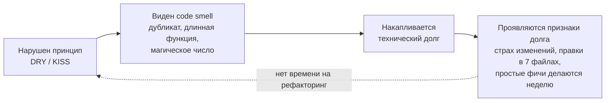

# Принципы качественного кода и технический долг

> [!abstract] О чём эта лекция
> До этой темы курс говорил о **процессе**: методологии, роли, этапы, инструменты. Эта лекция —
> про **сам код**: по каким критериям его вообще можно назвать хорошим и что происходит с проектом,
> в котором код писать быстро важнее, чем писать правильно.
>
> **Зачем это нужно.** Всё, что разбиралось в [[03. Жизненный цикл ПО|лекции 03]], упирается в одно:
> насколько дорого вносить изменения. Качественный код делает изменения дешёвыми, плохой — дорогими.
> Технический долг — это и есть мера этой дороговизны, а DRY и KISS — два правила, которые не дают ей расти.
>
> **Что ты должен уметь после лекции:** объяснить, почему «код работает» ≠ «код хороший»;
> сформулировать DRY и KISS и привести пример нарушения каждого; показать на Rust или Python,
> как нарушение выглядит и как исправляется; назвать code smell по коду и сказать, чем он грозит;
> отличить намеренный долг от ненамеренного; назвать 5 признаков того, что долг уже накопился,
> и 3–4 шага по его возврату.

---

# Понятие качественного кода

^a1c40e

## Код пишется один раз, читается — сотни

- Программа не просто работает. Её читают, изменяют, дополняют и поддерживают.
- Когда ты пишешь код, кажется, что его главная задача — выполнить функцию.
- На деле главная задача кода — **быть понятным другим разработчикам (и тебе самому через полгода)**.

> [!note] Соотношение времени
> По разным оценкам, разработчик тратит на чтение чужого кода в разы больше времени, чем на написание своего.
> Отсюда практический вывод: код оптимизируют в первую очередь **под чтение**, а уже во вторую — под написание.

## Что такое качественный код?

Качественный код — код, который легко:

- **Понимать** — читать и разбираться в логике без дополнительных объяснений;
- **Изменять** — вносить новые функции без страха всё поломать;
- **Тестировать** — проверять, что он работает правильно, быстро и надёжно;
- **Поддерживать** — исправлять ошибки спустя месяцы после написания.

Все четыре свойства связаны: непонятный код страшно менять, страшный код нечем проверить,
а непроверенный код невозможно сопровождать.

## Как это выглядит в коде: DRY на Python

Задача одна и та же, что в [[04. Анализ кода, технического долга и рабочего процесса|практике 04, задача 2]]:
посчитать итоговую сумму заказа со скидкой и доставкой. Ниже — три варианта для трёх типов клиентов.

```python
# Плохо: одна и та же логика скопирована трижды
def process_regular_order(price):
    discount = 10
    total = price - price * discount / 100
    delivery = 0 if total > 1000 else 300
    return total + delivery

def process_vip_order(price):
    discount = 20
    total = price - price * discount / 100
    delivery = 0 if total > 1000 else 300
    return total + delivery

def process_wholesale_order(price):
    discount = 30
    total = price - price * discount / 100
    delivery = 0 if total > 1000 else 300
    return total + delivery
```

Разница между функциями — **одна цифра**. Всё остальное скопировано. Значит, при изменении
порога бесплатной доставки править придётся в трёх местах, а при изменении формулы скидки — тоже в трёх.

```python
# Хорошо: каждое правило живёт в одном месте
FREE_DELIVERY_THRESHOLD = 1000
DELIVERY_COST = 300

def with_discount(price, percent):
    return price * (1 - percent / 100)

def delivery_for(total):
    return 0 if total > FREE_DELIVERY_THRESHOLD else DELIVERY_COST

def process_order(price, discount_percent):
    total = with_discount(price, discount_percent)
    return total + delivery_for(total)

# process_regular_order  -> process_order(price, 10)
# process_vip_order      -> process_order(price, 20)
# process_wholesale_order-> process_order(price, 30)
```

Теперь порог доставки меняется в одной строке, тип клиента превратился в параметр,
а каждую функцию можно проверить отдельным тестом.

## Как это выглядит в коде: KISS на Python

```python
# Плохо: «лесенка» из вложенных условий — 5 уровней отступов
def get_price(user, product, cart):
    if user is not None:
        if user.is_active:
            if product is not None:
                if product.in_stock:
                    if cart is not None and cart.has(product):
                        return product.price * 0.9
                    else:
                        return product.price
                else:
                    return None
            else:
                return None
        else:
            return None
    else:
        return None
```

```python
# Хорошо: ранние выходы (guard clauses) вместо вложенности
def get_price(user, product, cart):
    if user is None or not user.is_active:
        return None
    if product is None or not product.in_stock:
        return None
    if cart is not None and cart.has(product):
        return product.price * 0.9
    return product.price
```

Логика не изменилась — изменилось количество ветвлений, которое нужно держать в голове
одновременно. Это и есть простота: не «меньше кода», а **меньше одновременных условий**.

## Как это выглядит в коде: DRY и KISS на Rust

```rust
// Плохо: формула НДС продублирована, ставка «зашита» числом
fn total_regular(price: f64) -> f64 {
    price + price * 0.2
}

fn total_vip(price: f64) -> f64 {
    price * 0.8 + price * 0.8 * 0.2
}

fn total_wholesale(price: f64) -> f64 {
    price * 0.7 + price * 0.7 * 0.2
}
```

```rust
// Хорошо: правило НДС одно, скидка стала параметром
const VAT_RATE: f64 = 0.20;

fn with_vat(net: f64) -> f64 {
    net * (1.0 + VAT_RATE)
}

fn total(price: f64, discount: f64) -> f64 {
    with_vat(price * (1.0 - discount))
}

// обычный заказ    -> total(price, 0.0)
// VIP              -> total(price, 0.2)
// оптовый заказ    -> total(price, 0.3)
```

`0.2` в трёх местах — это **магическое число**: читатель не знает, что оно значит и где ещё встречается.
Константа `VAT_RATE` делает знание явным и изменяемым в одной точке.

## Как выглядит хорошая структура кода

Противоположность — функция, которая делает всё сразу:

```rust
// Плохо: имя ничего не говорит, внутри 200 строк разных действий
fn process(d: &Data) -> Result<(), String> {
    // чтение запроса → валидация → расчёт → запись в файл → отправка письма
    todo!()
}
```

```rust
// Хорошо: одна функция — одно действие, имя читается как глагол
fn validate(input: &RawOrder)  -> Result<Order, ValidationError>;
fn price(order: &Order)        -> Money;
fn persist(order: &Order, repo: &OrderRepo) -> Result<OrderId, StorageError>;
fn notify(order: &Order, mailer: &Mailer)   -> Result<(), MailError>;
```

Признаки хорошей структуры:

- **Имя функции отвечает на вопрос «что она делает»**, а не «как она устроена».
- **Один уровень абстракции** внутри функции: бизнес-логика не смешана с разбором JSON.
- **Ошибки типизированы**: `ValidationError` и `StorageError` говорят больше, чем `String` или `Exception`.
- **Зависимости приходят извне** (`repo`, `mailer`), а не создаются внутри — такую функцию можно протестировать.

---

# Фундаментальные принципы качественного кода

## 1. DRY — Don't Repeat Yourself

- Каждая логика должна быть в одном месте.
- **DRY** — принцип разработки, который гласит: каждый фрагмент знания или логики должен иметь
  единственное, однозначное, авторитетное представление в системе.
- Простыми словами: не копируй код. Если одна и та же логика написана в двух местах — DRY нарушен.

> [!important] Ключевая формулировка
> DRY — про **знание**, а не про совпадающие строки. Если два куска кода похожи случайно
> и меняться будут по разным причинам, это не дублирование. Если за ними стоит одно правило —
> это дублирование, даже если выглядят они по-разному.

### Опасности copy-paste программирования

1. **Ты не понимаешь код.** Скопировал, но не разобрался. Когда возникнет ошибка — не сможешь починить.
2. **Ты наследуешь чужие баги.** В чужом коде могут быть скрытые ошибки, которые переедут в твой проект.
3. **Нарушение DRY.** Если этот код потребуется ещё раз — его явно скопируют снова.

### Правила копирования кода

Если ты копируешь код, ты обязан:

1. Понять, как он работает, построчно.
2. Убедиться, что он подходит под твою задачу.
3. Переписать его своими словами.

Третий пункт — не формальность: переписывание своими словами и есть проверка понимания.

## 2. KISS — Keep It Simple, Stupid

- Сложность должна быть **обоснована**.
- Не добавляй сложность «на будущее» или «потому что так круто».

### Почему важна простота?

Сложный код имеет три фундаментальные проблемы:

1. **Сложнее понять.** Чем больше абстракций и хитрых приёмов, тем дольше новый разработчик будет разбираться.
2. **Больше багов.** Каждая дополнительная строчка кода — потенциальная ошибка. Меньше кода — меньше багов.
3. **Сложнее изменить.** Сложная система имеет много взаимосвязей: изменение в одном месте может сломать другое.

### Признаки избыточной сложности

Как понять, что KISS нарушен:

1. **Функция делает слишком много.** Если она называется `ОбрабатыватьЗаказИОтправитьПисьмо` — раздели на две.
2. **Глубокая вложенность.** Если код выглядит как лесенка с 5–6 уровнями отступов — упрощай.
3. **«Умные» приёмы.** Редкие конструкции «чтобы было короче» — подумай, поймёт ли коллега через год.
4. **Решение на будущее.** Поддержка трёх языков, когда нужен один; плагин-система для двух модулей.

---

# Code smells: как проблема становится видимой

^e7b21a

- **Code smell («запах кода»)** — внешний, заметный при чтении признак того, что в коде, вероятно, есть глубинная проблема.
- Это **не баг**: программа с «запахами» может исправно работать годами. Это индикатор того, что **изменяемость** кода уже пострадала.
- Цепочка понятий курса: **нарушение принципа** (DRY, KISS) → проявляется как **code smell** → накопление запахов → **технический долг** → **признаки долга** на уровне проекта.



> [!note] Code smell против признака технического долга
> Запах виден **в коде**: длинная функция, магическое число, дубликат. Признак долга виден **в процессе**:
> правки в семи файлах, страх изменений, падающая скорость. Первое — причина, второе — следствие.
> Признаки разобраны ниже, в разделе «Признаки технического долга».

## Каталог запахов

| Запах | Как выглядит | Чем грозит | Чем лечить |
|---|---|---|---|
| **Дублирование кода** | Одна и та же логика в двух и более местах | Правка в одном месте не попадает в другое | Вынести правило в одну функцию или константу (DRY) |
| **Длинная функция** | 100–300 строк, несколько уровней логики в одном месте | Невозможно понять целиком, страшно менять | Разбить так, чтобы одна функция делала одно действие |
| **Большой класс (God Object)** | Класс или модуль знает и делает всё | Любая правка задевает несвязанные части | Разделить по зонам ответственности |
| **Длинный список параметров** | Пять и более аргументов, часть не используется | Легко перепутать порядок, невозможно запомнить | Сгруппировать связанные параметры в структуру |
| **Магические числа** | `if total > 1000`, `* 0.2` без имени | Непонятно, что значит и где ещё встречается | Именованная константа |
| **Непонятные имена** | `a`, `b`, `temp`, `flag1` | Читатель тратит время на расшифровку | Имя, отвечающее на вопрос «что это» |
| **Проглоченное исключение** | `except: pass`, `catch {}` | Ошибка исчезает молча, баг ищут сутками | Логировать и обрабатывать там, где это осмысленно |
| **Мёртвый и закомментированный код** | Куски «на всякий случай», ветки, до которых нельзя дойти | Читатель не понимает, живой ли это код | Удалить: история всё равно хранится в VCS |
| **Спекулятивная общность** | Абстракции, настройки и параметры «на будущее» | Сложность без пользы прямо сейчас | Убрать до появления второй реальной нужды (KISS) |
| **Строковая типизация** | `role == "admin"` вместо перечисления или типа | Опечатку и регистр не поймает компилятор | Перевести на `enum` или тип-обёртку |
| **Глубокая вложенность** | 5–6 уровней `if` подряд | Все ветви приходится держать в голове сразу | Ранние выходы (guard clauses) |

> [!example] Разбор на примере из практики
> В [[04. Анализ кода, технического долга и рабочего процесса|практике 04, задача 2]] этот каталог применяется напрямую:
> три блока, отличающиеся одной цифрой, — **дублирование кода**; `1000` и `300` без имён — **магические числа**;
> цена и скидка, зашитые в каждый блок, — знание, которое должно быть параметром функции.
> Ни один из этих запахов не является багом: программа считает верно. Но изменение порога бесплатной доставки
> требует трёх правок — а это уже стоимость, то есть начало долга.

## Как пользоваться каталогом

1. **Запах — повод посмотреть, а не приказ переписывать.** Один длинный метод в стабильном модуле,
   который не менялся два года, может быть дешевле оставить как есть.
2. **Чинят там, где уже работаешь.** Правило «оставь код чуть чище, чем нашёл»: мелкие правки по ходу задачи
   вместо отдельного большого проекта по рефакторингу, который редко доходит до конца.
3. **Каталог — это словарь для ревью.** Назвать запах точнее и короче, чем объяснять претензию словами:
   «здесь дублирование, вынеси порог в константу» вместо абзаца текста. См. [[02. Командная работа в IT#Как формируется психологическая безопасность|ревью кода, а не человека]].

---

# Технический долг

^c3d51f

**Технический долг** — метафора, описывающая скрытую стоимость будущих переделок, которая возникает,
когда разработчики выбирают быстрое, но некачественное решение вместо правильного, но более трудоёмкого.

Механика такая:

- Ты пишешь код «быстро и грязно», нарушая DRY и KISS, чтобы успеть к дедлайну.
- Этот плохой код становится **долгом**.
- Каждый раз, внося изменения, ты **платишь проценты** — тратишь дополнительное время на разбор запутанной логики.
- Ты боишься менять код, потому что понимаешь: что-то сломается.
- Долг не исчезает сам. Он накапливается и замедляет разработку.

> [!note] Связь с курсом
> Технический долг — это то, что превращает дешёвый этап [[03. Жизненный цикл ПО#^ec018d|разработки]]
> в дорогой этап [[03. Жизненный цикл ПО#^4c9d48|поддержки]]. Экономия на качестве не отменяет работу —
> она переносит её вперёд по времени и увеличивает в цене.

## Как техдолг выглядит в коде: Python

**Пример 1. Проглоченное исключение.**

```python
# Долг: «пусть не мешает на демо»
def save_report(data, path):
    try:
        with open(path, "w", encoding="utf-8") as f:
            json.dump(data, f)
    except Exception:
        pass          # отчёт может молча не сохраниться — и никто не узнает
```

*Проценты:* через полгода приходит жалоба «отчёты иногда пустые». В логах ничего нет,
воспроизвести не удаётся, двое суток уходят на поиск места, где ошибка просто исчезла.

**Пример 2. Функция-монолит.**

```python
# Долг: «работает — не трогай»
def process_student(data):
    # 280 строк: валидация + расчёт стипендии + формирование приказа + печать + рассылка
    ...
```

*Проценты:* новое поле в карточке студента требует правки в семи файлах — это ровно условие
[[04. Анализ кода, технического долга и рабочего процесса|задачи 3 из практики 04]].
Каждая правка делается на ощупь, потому что тестов нет.

## Как техдолг выглядит в коде: Rust

**Пример 1. `unwrap()` везде, чтобы компилятор «отстал».**

```rust
// Долг
let config = File::open("config.toml").unwrap();
let port: u16 = raw_port.parse().unwrap();
```

*Проценты:* компилятор честно предупреждал об `Option` и `Result`, предупреждения заглушили.
Первый же отсутствующий конфиг или опечатка в числе — паника процесса вместо внятной ошибки.
Правильный вариант — вернуть `Result` наверх и решить, что делать, на уровне, где это осмысленно.

**Пример 2. Строка вместо типа.**

```rust
// Долг: «потом сделаю enum»
fn role_of(user: &User) -> String { "admin".to_string() }

match role_of(&user).as_str() {
    "admin" => allow_all(),
    "Admin" => allow_all(),      // опечатку в регистре компилятор не поймает
    _       => deny(),
}
```

```rust
// Возврат долга: тип выражает правило, а не хранит его строкой
enum Role { Admin, Teacher, Student }

fn role_of(user: &User) -> Role { Role::Admin }

match role_of(&user) {
    Role::Admin    => allow_all(),
    Role::Teacher  => allow_view(),
    Role::Student  => allow_own(),   // добавить вариант и забыть его не получится:
}                                    // компилятор потребует разобрать все случаи
```

*Проценты* в первом варианте — молча сломанные права доступа; во втором проверка встроена в тип.

## Причины возникновения технического долга

### 1. Жёсткие дедлайны

Самая частая причина. Дата релиза фиксирована и важнее качества: выставка, чёрная пятница,
окно запуска, контрактные обязательства. Решение принимается сознательно — «допилим потом».

**Пример из сферы:** интернет-магазин обязан запустить новую корзину к сезонной распродаже.
Модуль оплаты копируется из старой версии, чтобы не трогать проверенное. После распродажи
команда переключается на новые задачи, и «временное» решение живёт два года.

**Чем опасно:** долг, взятый под дедлайн, почти никогда не возвращают — потому что после релиза
появляется новый дедлайн.

### 2. Недостаток знаний

Разработчик не знает принципов или не видит альтернативы. Копипаста кажется ему самым надёжным
решением, а тесты — лишней работой.

**Пример из сферы:** в учебном проекте или в команде без наставника студент копирует один и тот же
обработчик формы для восьми экранов, потому что «так работает». Никто не показывает, что правило
можно вынести в одну функцию, — и проект стартует уже с долгом.

**Чем опасно:** это **ненамеренный** долг — его не фиксируют в планах, потому что о нём не знают.
Лечится не процессом, а обучением и [[02. Командная работа в IT#Как формируется психологическая безопасность|ревью кода]].

### 3. Экономия ресурсов

Денег или людей хватает только на функциональность. Рефакторинг не приносит видимой заказчику пользы,
поэтому времени на него не выделяют: «сначала доделаем фичи».

**Пример из сферы:** стартап на четырёх разработчиков живёт от раунда до раунда. В бэклоге — только
то, что видно инвестору. Через год скорость разработки падает вдвое, потому что каждая новая функция
требует всё больше правок в старом коде.

**Чем опасно:** экономия выглядит выигрышем ровно до момента, когда проект начинает замедляться.
Профилактика — закладывать долю времени на рефакторинг в каждый спринт, а не «когда-нибудь потом».

### 4. Неясные требования

Требования меняются уже после того, как архитектура выбрана. Система рассчитана на одно,
а просят другое — и новые требования встраиваются в конструкцию, которая для них не предназначена.

**Пример из сферы:** система учёта заказов проектировалась для одного кафе. Заказчик говорит:
«а теперь это сеть из 20 точек». Общий сток, единая база и права доступа достраиваются костылями,
потому что переделывать модель данных некогда.

**Чем опасно:** это единственный вид долга, который возникает **не по вине разработчика**.
Снимается он на этапе [[03. Жизненный цикл ПО#^046504|аналитики]], а не в коде: чем раньше выяснены
требования, тем меньше перестроек.

### 5. Устаревшие технологии

Версия языка, фреймворка или библиотеки устарела, поддержка прекращена, а миграция дорогая.
Код работает, но вокруг него сжимается кольцо: новые библиотеки не ставятся, уязвимости не закрываются,
специалистов под стек всё меньше.

**Пример из сферы:** проект на версии языка, снятой с поддержки. Каждая новая зависимость требует
старой версии, каждое обновление безопасности превращается в отдельный проект. Миграция откладывалась
три года и теперь стоит дороже, чем переписать модуль заново.

**Чем опасно:** долг здесь накапливается **сам**, без единого плохого решения: достаточно ничего не делать.

## Типы технического долга

### 1. Намеренный

Команда понимает, что делает неправильно, но принимает это решение сознательно.

Нормально, если:

- решение **зафиксировано** (в задаче, в репозитории, в решении по архитектуре);
- **запланировано время** на возврат;
- команда **действительно вернётся** к нему.

> [!tip] Намеренный долг — это инструмент
> Взять долг осознанно, чтобы успеть к окну возможностей, — нормальная инженерная практика.
> Проблемой его делает не сам факт, а отсутствие записи и срока возврата.
> Минимальная гигиена: комментарий `// TODO(долг): …` + задача в трекере + понимание, кто и когда закроет.

### 2. Ненамеренный

Разработчики не понимают, что делают плохо: пишут код, нарушая принципы, но не осознают этого.

Этот долг **самый опасный**, потому что накапливается незаметно: его никто не планировал,
никто не записал и никто не собирается возвращать — о нём просто не знают.

## Признаки технического долга

Как понять, что в проекте накопился долг.

### 1. Страх изменений

Разработчики боятся трогать модуль: «там всё сломается». Правки вносятся точечно, обходными путями,
лишь бы не менять основную логику. Появляются фразы «лучше не трогать — работает».

**Почему это признак долга:** страх — это не эмоция, а оценка риска. Он появляется там,
где поведение системы невозможно предсказать по коду.

### 2. Долгая разработка простых фич

Задача на два часа занимает неделю. Оценка «добавить одно поле» превращается в «переделать три модуля».

**Почему это признак долга:** это и есть **проценты** — время, которое уходит не на новую функциональность,
а на преодоление старого кода. Если скорость падает при том же составе команды, дело не в людях.

### 3. Множество багов

Ошибки появляются там, где ничего не меняли. Исправление одного бага порождает два новых.

**Почему это признак долга:** нарушены DRY и связность — изменение в одном месте незаметно меняет
поведение в другом. Плюс [[03. Жизненный цикл ПО#^ec018d|регрессии]] не ловятся автоматически.

### 4. Отсутствие тестов

Каждое изменение проверяется вручную. Нет автотестов — значит, нет способа узнать, что именно сломалось.

**Почему это признак долга:** тесты — это то, что делает рефакторинг безопасным. Без них любое
улучшение кода превращается в риск, а риск отбивает желание улучшать. Круг замыкается:
нет тестов → страшно менять → код деградирует → тесты написать ещё труднее.

### 5. Запутанный код

Функции по 200–300 строк, вложенность в 5–6 уровней, имена `a`, `b`, `temp`, `flag1`,
магические числа, закомментированные куски «на всякий случай», комментарии `// TODO` трёхлетней давности.

**Почему это признак долга:** это наиболее видимая часть — её можно измерить и показать.
Симптом, с которого обычно начинают разбор: метрики сложности и статический анализ дают список мест,
где долг сконцентрирован.

> [!warning] Главный вывод по признакам
> Все пять признаков связаны в цикл: запутанный код → нет тестов → страшно менять →
> простые фичи делаются долго → баги копятся → код дописывают сверху, не трогая старое.
> Разорвать цикл проще всего через тесты — именно они снимают страх.

---

# Ключевые термины

| Термин | Определение |
|---|---|
| **Качественный код** | Код, который легко понимать, изменять, тестировать и поддерживать |
| **DRY (Don't Repeat Yourself)** | Каждое знание или правило имеет единственное авторитетное представление в системе |
| **KISS (Keep It Simple, Stupid)** | Сложность должна быть обоснована; простое решение предпочтительнее «умного» |
| **Copy-paste программирование** | Перенос чужого кода без понимания и адаптации; главный источник дублирования |
| **Магическое число** | Значение, записанное в коде без имени и объяснения; меняется в нескольких местах |
| **Guard clause (ранний выход)** | Проверка в начале функции с немедленным возвратом вместо наращивания вложенности |
| **Технический долг** | Скрытая стоимость будущих переделок из-за выбора быстрого решения вместо правильного |
| **Проценты по долгу** | Дополнительное время, которое уходит на работу со старым некачественным кодом |
| **Намеренный долг** | Осознанное решение, зафиксированное и с запланированным сроком возврата |
| **Ненамеренный долг** | Долг, возникший из-за непонимания; не зафиксирован и потому опаснее всего |
| **Рефакторинг** | Изменение внутреннего устройства кода без изменения его поведения |
| **Code smell** | Внешний признак того, что в коде, вероятно, есть глубинная проблема; не баг, а индикатор потери изменяемости |
| **Дублирование кода** | Одна и та же логика в двух и более местах; следствие нарушения DRY |
| **Длинная функция / God Object** | Функция или класс, отвечающие сразу за многое; следствие нарушения KISS |
| **Спекулятивная общность** | Абстракции и параметры, добавленные «на будущее» и не используемые сейчас |
| **Строковая типизация** | Хранение категории строкой вместо перечисления; опечатку не ловит компилятор |
| **Мёртвый код** | Недостижимые или закомментированные участки, которые читаются как живые |

---

# Типичные заблуждения

- ❌ **«Код работает — значит, он хороший».** Работающая программа — необходимое, но не достаточное условие.
  Качество определяется тем, насколько дорого её менять дальше.
- ❌ **«DRY означает, что любой повтор надо убрать».** DRY — про дублирование **знания**, а не строк.
  Два похожих блока, которые меняются по разным причинам, объединять вредно: получится функция с флагами.
- ❌ **«Простой код — это короткий код».** Однострочник с «умным» приёмом часто сложнее для чтения,
  чем десять явных строк. KISS — про минимальное число одновременных условий, а не про количество символов.
- ❌ **«Копировать код нельзя никогда».** Можно — но по правилам: понять, проверить применимость,
  переписать своими словами. Запрещено копировать вслепую.
- ❌ **«Технический долг — это всегда провал».** Намеренный долг — рабочий инструмент, если он записан и
  у него есть срок возврата. Провал — это долг, о котором никто не знает.
- ❌ **«Если код не трогать, долг не растёт».** Растёт: устаревают зависимости, уходят люди,
  знавшие модуль, а вокруг появляется новый код, который на него опирается.
- ❌ **«Долг возвращают одним большим рефакторингом».** Так не работает: большой переписывающий проект
  редко доходит до конца. Возвращают постепенно, небольшими шагами, под прикрытием тестов.
- ❌ **«Code smell — это баг, его надо срочно чинить».** Запах не ломает поведение: программа может работать годами.
  Это сигнал о потере изменяемости, и чинят его там, где уже работаешь, а не отдельным героическим проектом.
- ❌ **«Раз есть каталог запахов — любой из них надо устранять».** Каталог помогает **назвать** проблему и оценить её цену.
  Стабильный код, который не меняется, может быть дешевле оставить в покое.
- ❌ **«Тесты — это отдельная работа, которую можно сделать потом».** Без тестов рефакторинг небезопасен,
  поэтому «потом» обычно не наступает. Тесты — это не надстройка над кодом, а условие его изменяемости.

---

# Связи с другими темами

- [[04. Анализ кода, технического долга и рабочего процесса]] — практика по этой лекции: поиск нарушений
  DRY и KISS в готовом коде, разбор признаков долга, выбор между CVCS и DVCS, стратегия ветвления.
- [[05. Логика и архитектура системы контроля версий]] — механизм, который делает возврат долга безопасным:
  отдельная короткоживущая ветка, ревью через [[05. Логика и архитектура системы контроля версий#^9ad41e|PR/MR]],
  возможность откатиться. Рефакторинг без VCS — это риск без страховки.
- [[03. Жизненный цикл ПО]] — долг рождается на этапе разработки и оплачивается на этапе поддержки;
  отсутствие тестов ломает этап тестирования; неясные требования как причина долга — это проблема аналитики.
- [[02. Командная работа в IT]] — ревью кода как главный механизм профилактики ненамеренного долга:
  второй человек видит нарушение принципов там, где автор его не замечает.
- [[04. ИИ в разработке ПО]] — ИИ ускоряет генерацию кода и потому ускоряет накопление долга,
  если результат не проверять: сгенерированный код часто повторяет один и тот же шаблон в разных местах.
- [[02. Вариант 6. Система учета заказов для небольшого кафе]] — осознанный архитектурный выбор
  (монолит против микросервисов) как пример решения, которое потом дорого менять.
- [[01. Роль анализа предметной области в процессе разработки ПО. Основные понятия ООА]] —
  инкапсуляция, модульность и декомпозиция как структурная профилактика дублирования.
- [[1.1 Django - введение во фреймворк]] — MTV как готовое разделение ответственности: модель,
  представление и шаблон живут отдельно именно для того, чтобы изменение одного не ломало другое.
- [[01_Технология_Разработки_ПО/00_Курс|00_Курс]] — оглавление курса и порядок прохождения.
