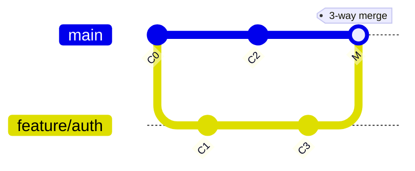

# Анализ кода, технического долга и рабочего процесса

> [!abstract] Что за работа
> **Теория:** [[06. Принципы качественного кода и технический долг]] (качество кода и долг)
> и [[05. Логика и архитектура системы контроля версий]] (коммиты, слияние, модели VCS, стратегии ветвления).
>
> **Что даёт результат:** шесть задач без кода на входе — только условия. Это проверка того,
> что материал не заучен, а применяется: по графу коммитов определить тип слияния, в чужом псевдокоде
> найти нарушения DRY и KISS, по симптомам опознать технический долг и спроектировать процесс работы
> команды с нуля. Такие задачи — типовой формат вопросов на защите.

---

# Ход работы

## Задача 1. Анализ графа коммитов и слияния

**Условие.** Файл `config.txt` содержит 100 строк. Общий предок — коммит `C0`.

1. Алиса в ветке `feature/auth` изменяет строку 15 и создаёт коммит `C1`.
2. Боб в ветке `main` изменяет строку 80 и создаёт коммит `C2`.
3. Алиса в ветке `feature/auth` изменяет строку 20 и создаёт коммит `C3`.
4. Происходит попытка слияния (merge) ветки `feature/auth` в `main`.



**Вопрос 1.** Какой тип слияния попытается выполнить система: Fast-Forward или 3-Way Merge? Обоснуй.

> [!example] Ответ
> **3-Way Merge.** В ветке `main` после точки разделения появился свой коммит (`C2`),
> поэтому простого перемещения указателя недостаточно — нужно объединять две разошедшиеся линии.

**Вопрос 2.** Возникнет ли конфликт слияния для файла `config.txt`? Обоснуй, опираясь на логику 3-Way Merge.

> [!example] Ответ
> **Конфликта не возникнет.** Изменения затронули разные строки одного файла (15 и 20 — в `feature/auth`,
> 80 — в `main`). Алгоритм сравнивает обе ветки с общим предком `C0` и видит, что правки не пересекаются,
> поэтому объединяет их автоматически.

**Вопрос 3.** Сколько родителей будет у итогового коммита слияния и на какие коммиты он будет ссылаться?

> [!example] Ответ
> **Два родителя: `C2` и `C3`** — по последнему коммиту каждой из сливаемых веток.
> Именно такой коммит превращает историю из цепочки в граф.

## Задача 2. Поиск нарушений принципов качества кода

**Условие.** Дан псевдокод обработки заказов в интернет-магазине. Найти нарушения DRY и KISS,
указать code smells.

```text
// Обработка заказа обычного клиента
цена = 100
скидка = 10
итого = цена - (цена * скидка / 100)
если итого > 1000:
    доставка = 0
иначе:
    доставка = 300
финал = итого + доставка
вывод("Итого: " + финал)
отправитьПисьмо("Заказ оформлен")

// Обработка заказа VIP-клиента
цена = 100
скидка = 20
итого = цена - (цена * скидка / 100)
если итого > 1000:
    доставка = 0
иначе:
    доставка = 300
финал = итого + доставка
вывод("Итого: " + финал)
отправитьПисьмо("Заказ оформлен")

// Обработка заказа оптового клиента
цена = 100
скидка = 30
итого = цена - (цена * скидка / 100)
если итого > 1000:
    доставка = 0
иначе:
    доставка = 300
финал = итого + доставка
вывод("Итого: " + финал)
отправитьПисьмо("Заказ оформлен")
```

**Вопрос 1.** Какие нарушения принципа DRY ты видишь? Приведи 2–3 примера повторяющейся логики.

> [!example] Ответ
> - Повторение вычислений стоимости заказа — одна и та же формула скидки в трёх блоках.
> - Повторение логики бесплатной доставки — порог и сумма доставки продублированы трижды.
> - Повторение вывода и отправки письма — финальная часть блоков идентична.
>
> Разница между тремя блоками — **одна цифра** (10, 20, 30), всё остальное скопировано.

**Вопрос 2.** Какие нарушения KISS или code smells (например, «магические числа») ты обнаружил?

> [!example] Ответ
> Цена заказа и размер скидки зашиты в каждый блок. Магические числа: `1000` (порог бесплатной доставки),
> `300` (стоимость доставки), `100` (цена). Ни одно из них не названо, поэтому читатель не знает,
> что они значат и где ещё встречаются.

**Вопрос 3.** Предложи, как улучшить этот код, не переписывая его полностью. Какие функции или константы стоит вынести?

> [!example] Ответ
> Лучше всего сделать две функции: одна учитывает скидку, вторая учитывает доставку.
> Такой подход позволит изменять скидки клиентов по необходимости, а также легко изменить правила доставки.

```text
Функция обработатьДоставку(СтоимостьЗаказа, ПорогБесплатной, СтоимостьДоставки):
    если СтоимостьЗаказа > ПорогБесплатной:
        вывод("Итого: " + СтоимостьЗаказа)
        вернуть СтоимостьЗаказа
    иначе:
        Итого = СтоимостьЗаказа + СтоимостьДоставки
        вывод("Итого: " + Итого)
        вернуть Итого

Функция обработатьЗаказ(Цена, Скидка):
    Итого = Цена - (Цена * Скидка / 100)
    вернуть "Стоимость заказа: " + Итого
```

> [!note] Сравнение с теорией
> Разбор этого же примера на Python и на Rust — в разделе
> [[06. Принципы качественного кода и технический долг#Как это выглядит в коде: DRY на Python|«Как это выглядит в коде»]]
> лекции 06. Псевдокод здесь и реальный код там совпадают по идее: правило скидки и правило доставки
> выносятся в отдельные функции, порог и сумма — в именованные константы.

## Задача 3. Анализ технического долга

**Условие.** Проект «Система учёта студентов» писался быстро, чтобы успеть к защите курсовой.
Спустя полгода проект активно развивается. Симптомы:

- чтобы добавить новое поле в карточку студента, требуется изменить код в 7 разных файлах;
- разработчики боятся трогать модуль расчёта стипендии — «там всё сломается»;
- функция `processData()` занимает 280 строк кода;
- тесты отсутствуют, каждое изменение проверяется вручную;
- в коде встречаются переменные с именами `a`, `b`, `temp`, `flag1`.

**Вопрос 1.** Какие признаки технического долга ты видишь? Укажи минимум 4 симптома и объясни каждый.

> [!example] Ответ
> - **Нарушение DRY:** чтобы внести новое поле в карточку студента, изменения требуются в нескольких
>   местах. Знание о структуре карточки продублировано — значит, у него нет единственного источника.
> - **Неясные названия переменных:** при изменении этих мест в коде потребуется дополнительное время,
>   чтобы понять, какая за что отвечает. Скорее всего — последствие **работы в спешке**.
> - **Функция `processData()`:** слишком много строк для простого обработчика данных.
>   Возможное нарушение принципов декомпозиции и нарушение KISS — функция делает слишком много.
> - **Ручная проверка вместо тестов:** при тестировании вручную могут остаться аспекты,
>   которые не будут отлажены, и придётся тратить время на дебаг позже.
> - **Страх изменений** модуля расчёта стипендии — прямое следствие трёх предыдущих пунктов.

**Вопрос 2.** Это намеренный или ненамеренный технический долг? Обоснуй.

> [!example] Ответ
> **Ненамеренный.** Проект до сих пор развивается, а последствия старых решений на скорую руку
> до сих пор не обработаны: решение нигде не зафиксировано, срок возврата не запланирован,
> то есть долг никто сознательно не брал — он накопился сам.

**Вопрос 3.** Какие действия ты бы предпринял как руководитель проекта, чтобы начать возвращать долг?
Предложи план из 3–4 шагов.

> [!example] Ответ
> 1. Провести собрание и выбрать специалистов, которые будут заниматься рефакторингом старого кода.
> 2. Подготовить тесты для всех обновлённых функций.
> 3. По-хорошему, написать тесты для существующих функций, чтобы избежать накопления технического долга снова.
> 4. Отслеживать соблюдение стратегий и принципов написания кода, чтобы не накапливать долг.

> [!tip] Почему порядок именно такой
> Пункт 3 стоит раньше фактического рефакторинга не случайно: тесты — это то, что делает рефакторинг
> безопасным. Без них любое «улучшение» кода превращается в риск сломать поведение, которое никто
> не может проверить. См. [[06. Принципы качественного кода и технический долг#Признаки технического долга|признаки долга]]:
> цикл «нет тестов → страшно менять → код деградирует» разрывается именно через тесты.

## Задача 4. Архитектурное решение: CVCS или DVCS

**Условие.** Компания разрабатывает медицинское приложение. Команда — 15 разработчиков в разных городах.
У некоторых периодически пропадает интернет. Требования к безопасности максимальные: код нельзя
выкладывать в публичный интернет.

**Вопрос.** Какую модель VCS выбрать — централизованную (CVCS) или распределённую (DVCS, например Git)?
Обоснуй: 2 преимущества выбранной модели, 1 недостаток, который придётся компенсировать,
и решение для требования безопасности.

> [!example] Ответ
> **CVCS.**
> 1. **Безопасность:** весь проект хранится на главном сервере, что позволяет настроить права доступа
>    для каждого пользователя.
> 2. **Объём данных:** при работе с CVCS скачивается не весь проект, а только локальная копия нужной версии.
>
> В сумме эти два пункта перекрывают требования по безопасности.
> Однако придётся что-то сделать с разработчиками, у которых нет постоянного доступа в интернет.

> [!warning] Как усилить этот ответ на защите
> В условии есть два требования, которые тянут в разные стороны, и это стоит проговорить явно —
> иначе вопрос «а что с интернетом?» останется без ответа.
>
> - **Работа без сети** — это сильная сторона DVCS: в Git вся история локальна, поэтому коммитить,
>   смотреть диффы и переключать ветки можно офлайн, а синхронизация нужна только для `push`/`fetch`.
>   В CVCS без сервера не работает почти ничего.
> - **Запрет на публичный интернет** решается не моделью VCS, а **размещением**: self-hosted GitLab,
>   Gitea или собственный сервер во внутреннем контуре. Так получают и распределённость, и изоляцию.
> - **Аргумент про объём** у DVCS закрывается partial clone, `sparse-checkout` и Git LFS —
>   то есть «скачивать не всё» умеют обе модели.
>
> Поэтому защищаемых ответов два: **DVCS + self-hosted-сервер** (закрывает оба требования) либо
> **CVCS + явный план офлайн-работы** (например, локальные зеркала). Выбрав CVCS, назови недостаток
> прямо: работа без сети невозможна — и предложи, чем компенсируешь.

## Задача 5. Связь VCS и рефакторинга

**Условие.** Коллега говорит: «Я хочу провести рефакторинг большого модуля, но боюсь, что что-то
сломается. Может, лучше не трогать — работает, и ладно?»

**Вопрос 1.** Объясни коллеге, как VCS делает рефакторинг безопасным. Какие возможности VCS снижают риск?

> [!example] Ответ
> - Система контроля версий позволяет сделать ветку проекта и работать в ней отдельно от стабильной версии.
> - Даже если разработчик сломает что-либо в своей ветке, это никак не сломает основную ветку проекта
>   или любые другие ветки.
>
> Дополнительно: любой шаг можно откатить, а история остаётся в `main` нетронутой до момента слияния.

**Вопрос 2.** Опиши пошаговый алгоритм безопасного рефакторинга с использованием VCS (минимум 4 шага).

> [!example] Ответ
> 1. Резервная копия текущей ветки проекта — на всякий случай: плохо, когда их нет.
> 2. Создание новой ветки под свои нужды.
> 3. Рефакторинг: изменение только конкретного модуля. Только в крайнем случае —
>    внесение изменений в другие части кода.
> 4. Перед соединением со стабильной веткой необходимо провести собрание и изучить вносимые
>    изменения всей командой.

> [!note] Как это выглядит в командах и терминах курса
> Шаг 1 — резервная ветка или тег на текущем состоянии; шаг 2 — короткоживущая ветка
> (`refactor/<модуль>`); шаг 3 — мелкие коммиты, каждый из которых сохраняет работоспособность;
> шаг 4 — [[05. Логика и архитектура системы контроля версий#^udalennye-repozitorii|PR/MR и code review]],
> а перед слиянием — прогон тестов и CI. «Собрание и изучить изменения» в современной практике —
> это и есть ревью в pull request, а не отдельное совещание.

## Задача 6. Проектирование рабочего процесса

**Условие.** Спроектируй стратегию работы с кодом для команды из 4 человек, разрабатывающих
мобильное приложение «Трекер привычек». Проект только начинается.

**Вопрос 1.** Как организовать ветки? Какие ветки постоянные, какие временные? Как называть?

> [!example] Ответ
> - Отдельная ветка под каждую фичу.
> - Отдельная стабильная ветка.
> - Отдельная экспериментальная: именно с ней будут соединяться все фичи перед выходом новой
>   стабильной версии проекта.
> - Название веток соответствует названию фичи.

**Вопрос 2.** Какие правила коммитов ввести в команде? Как часто коммитить? Что должно быть в сообщении?

> [!example] Ответ
> - Коммитить по мере готовности фичи: не должно быть «мешанины» из мелких коммитов
>   («Изменена фича1», «Фича один исправлена» и тому подобное) — все коммиты по конкретным функциям
>   и этапам работы должны быть схлопнуты в один чёткий коммит.
> - Сообщение коммита должно содержать полное описание изменений:
>   - что изменено;
>   - что сломано из-за изменений;
>   - что восстановлено с последнего коммита.

**Вопрос 3.** Как команда будет избегать накопления технического долга? Какие регулярные практики ввести?

> [!example] Ответ
> - Регулярное ревью в конце недели: есть ли нарушения, что можно сделать лучше, что можно упростить.
> - Написание тестов для каждой создаваемой фичи.

**Вопрос 4.** Как часто команда будет делать слияние веток, чтобы избежать «болезненных» конфликтов?
Обоснуй периодичность.

> [!example] Ответ
> Раз в одну-две недели — соединение с экспериментальной веткой после проведения тестов.
> Такая периодичность не будет приводить к ситуациям, когда один разработчик спустя долгое время
> сделал слияние и изменил основной код системы, из-за чего потребовалось дополнительное время
> на рефакторинг уже почти готовой фичи, которая опиралась на эту часть кода.

> [!tip] Соответствие стратегиям ветвления
> Описанная схема — `main` (стабильная) + интеграционная ветка + короткие ветки фич — это
> упрощённый **Git Flow** без релизных веток. По таблице из
> [[05. Логика и архитектура системы контроля версий#^modeli-workflow|«Модели совместной работы»]] ей соответствует
> совет: начинать с самого простого подходящего варианта. Для команды из 4 человек и нового проекта
> интеграционная ветка оправдана, пока нет автотестов; когда покрытие тестами вырастет, схему можно
> упростить до GitHub Flow, сливая фичи сразу в `main`.
> Схлопывание мелких коммитов в один — это `squash` при слиянии.

## Сводка: какое понятие проверяла каждая задача

| Задача | Что проверяет | Где это разобрано в теории |
|---|---|---|
| 1. Граф коммитов и слияния | Fast-forward против 3-way merge, общий предок, родители merge-коммита | [[05. Логика и архитектура системы контроля версий#Переход к слиянию: Merge\|Лекция 05, слияние]] |
| 2. Нарушения DRY и KISS | Дублирование, магические числа, вынесение правил в функции | [[06. Принципы качественного кода и технический долг#Code smells: как проблема становится видимой\|Лекция 06, каталог запахов]] |
| 3. Анализ технического долга | Признаки долга, намеренный против ненамеренного, план возврата | [[06. Принципы качественного кода и технический долг#Признаки технического долга\|Лекция 06, признаки долга]] |
| 4. CVCS или DVCS | Архитектурные модели VCS, требования проекта, размещение сервера | [[05. Логика и архитектура системы контроля версий#Архитектурные модели VCS\|Лекция 05, CVCS против DVCS]] |
| 5. VCS и рефакторинг | Ветка как страховка, ревью, рефакторинг | [[06. Принципы качественного кода и технический долг#Ключевые термины\|Лекция 06, рефакторинг]], [[05. Логика и архитектура системы контроля версий#^udalennye-repozitorii\|Лекция 05, PR/MR]] |
| 6. Рабочий процесс | Стратегии ветвления, squash, правила коммитов | [[05. Логика и архитектура системы контроля версий#Модели совместной работы (workflows)\|Лекция 05, workflows]] |

> [!tip] Как пользоваться этой таблицей перед защитой
> Если задача не решается — иди не к условию, а в указанный раздел теории. Каждая задача здесь проверяет
> ровно одно понятие: не получилось с типом слияния — значит, не усвоен 3-way merge, а не «задача сложная».

---

# Вывод

Все шесть задач решаются без написания кода — только на материале лекций 05 и 06. Что это показывает:

1. **Тип слияния определяется историей, а не намерением.** Fast-forward возможен только когда целевая
   ветка не двигалась; как только в `main` появился свой коммит — нужен 3-way merge и общий предок.
2. **Нарушения DRY и KISS видны в тексте кода.** Три блока, отличающиеся одной цифрой, — это дублирование
   знания; магические числа и функция на 280 строк — code smells, которые ищутся до запуска программы.
3. **Технический долг диагностируется по симптомам**, а не по ощущению: правки в семи файлах, страх изменений,
   функция-монолит, отсутствие тестов, бессмысленные имена. Все они связаны в один цикл.
4. **Выбор CVCS против DVCS — это выбор по требованиям**, а не по привычке. Ключевые вопросы:
   нужна ли работа офлайн, где размещается сервер, насколько велики бинарные активы.
5. **VCS — это страховка рефакторинга.** «Боюсь трогать, работает» лечится веткой, тестами и ревью,
   а не отказом от изменений.
6. **Стратегию ветвления выбирают под размер команды и зрелость тестов**: чем меньше людей и чем больше
   покрытие тестами, тем проще схема.

---

# Связи с другими темами

- [[06. Принципы качественного кода и технический долг]] — теория к задачам 2 и 3: DRY, KISS,
  причины и признаки долга, примеры на Rust и Python.
- [[05. Логика и архитектура системы контроля версий]] — теория к задачам 1, 4, 5 и 6: анатомия коммита,
  fast-forward против 3-way merge, CVCS против DVCS, PR/MR, стратегии ветвления.
- [[03. Жизненный цикл ПО]] — этап разработки и его артефакты (код, коммиты, MR/PR), этап тестирования
  как условие безопасного рефакторинга.
- [[02. Командная работа в IT]] — ревью как практика команды, а не как формальность; психологическая
  безопасность в разборе чужого кода.
- [[04. ИИ в разработке ПО]] — ИИ-агенты создают PR быстрее, чем люди их ревьюируют: отсюда рост
  требований к автоматическим проверкам, о которых идёт речь в задаче 6.
- [[01. Самоанализ на роли по Белбину]], [[02. Вариант 6. Система учета заказов для небольшого кафе]],
  [[03. Применение промпт-инжиниринга на этапах ЖЦПО]] — остальные практические работы курса.
- [[01_Технология_Разработки_ПО/00_Курс|00_Курс]] — оглавление курса и порядок прохождения.
