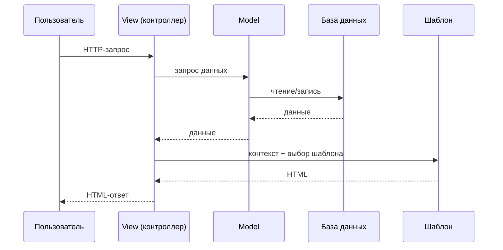

# Введение: Django и паттерн MVC

---

## Django

- **Django** — веб-фреймворк для Python, позволяющий создавать полноценные веб-приложения.
- Фреймворк включает встроенные средства для работы с базой данных (ORM), а также многие другие компоненты.
- Часто используется для создания API-сервисов и сайтов, через которые можно взаимодействовать с БД.
- **Встроенные возможности**: аутентификация, админ-панель, ORM, маршрутизация URL, работа с формами, защита от CSRF/XSS.
- **Принцип работы**: Django получает HTTP-запрос, обрабатывает его через views, при необходимости взаимодействует с моделями (данными) и возвращает HTTP-ответ (HTML или JSON).

---

## Model–View–Controller (MVC) — общий паттерн

- Паттерн MVC применяется, когда есть база данных и есть интерфейс, через который пользователи взаимодействуют с приложением.
- **Цель**: разделение ответственности между компонентами для упрощения поддержки, тестирования и масштабирования кода.
- **Типичный поток данных**:
  Пользователь → Controller → Model → Controller → View → Пользователь.

### 1. Model (Модель)

- Интерфейс для взаимодействия с данными в БД; абстракция над низкоуровневыми запросами.
- С помощью моделей описываются структуры данных, которые затем создаются в БД.
- **Ответственность**:
  1. хранение данных;
  2. бизнес-логика, связанная с данными;
  3. валидация данных;
  4. CRUD-операции (create, read, update, delete).
- **Пример**: модель `User` с полями `username`, `email`, `password` и методами для создания, чтения, обновления и удаления пользователей.

### 2. View (Представление)

- Видимая пользователю часть: интерфейс или презентационный слой.
- **Ответственность**:
  1. отображение данных пользователю;
  2. получение ввода от пользователя (в общем смысле MVC);
  3. форматирование данных для представления.
- **Примеры**: HTML-страница со списком товаров, JSON-ответ API, форма входа.

### 3. Controller (Контроллер)

- Компонент, в котором реализуется логика взаимодействия интерфейса с данными.
- Работа с данными выполняется через модель.
- **Ответственность**:
  1. обработка пользовательского ввода;
  2. вызов методов модели для работы с данными;
  3. выбор подходящего view для отображения результата.
- **Пример**: обработчик формы поиска, который принимает запрос, ищет товары через модель и передаёт результаты в view.

---

## MVC в Django: паттерн MTV

Django реализует идею MVC в собственной вариации, которую называют **MTV** (Model–Template–View). Концептуально это тот же паттерн, но термины смещены.

- **Model (MVC) = Model (MTV)** — описание структуры данных и правил работы с ними.
- **View (MVC) = Template (MTV)** — HTML-шаблоны, из которых собирается страница для пользователя.
- **Controller (MVC) = View (MTV)** — функции/классы views, которые принимают запрос, работают с моделями и передают данные в шаблоны.

Из-за этого в документации Django чаще говорят про **MTV**, хотя по сути это MVC с другими названиями компонентов.

---

### Роль модели (Model) в Django

Модель в Django — это **абстракция над базой данных**:

- Описывает поля сущности (например, `User`: `id`, `username`, `email` и т.д.).
- Определяет связи между сущностями (один-ко-многим, многие-ко-многим).
- Позволяет выполнять CRUD-операции без написания SQL:
  1. создать нового пользователя;
  2. прочитать все посты конкретного пользователя;
  3. обновить/удалить записи.
- Модели скрывают детали реализации БД (MySQL, SQLite и др.) и дают единый программный интерфейс к данным.

---

### Роль шаблона (Template) в Django

Шаблон в Django — это **HTML-файл с дополнительным синтаксисом** для вставки данных и логики отображения:

- Из шаблонов формируются **веб-страницы**, которые видит пользователь в браузере.
- Для одной страницы может использоваться **несколько шаблонов** (базовый layout + частичные шаблоны для блоков).
- Шаблоны отвечают только за **представление**, а не за работу с данными напрямую.

---

### Роль вида (View) в Django

Вид (view) в Django — это **контроллер** в терминах MVC:

- Принимает HTTP-запрос от пользователя.
- Обращается к **моделям**, чтобы получить/изменить данные в БД.
- Передаёт полученные данные в **шаблон** и возвращает готовую HTML-страницу клиенту.

Таким образом, view связывает модель и шаблон.


---

### Взаимодействие компонентов в Django (MTV)

- Данные хранятся в **таблицах** (реляционные БД: MySQL, SQLite) или **коллекциях/документах** (NoSQL: MongoDB).
- Модели описывают, как эти данные выглядят и связаны между собой.
- Шаблоны описывают, как данные показываются пользователю.
- Виды (views) реализуют **бизнес-логику** и координируют работу моделей и шаблонов.

---

# Установка Django

Django устанавливается внутри виртуального окружения проекта. Это позволяет изолировать зависимости разных проектов и не изменять системную установку Python.

> [!NOTE]
> Перед началом убедитесь, что установлены Python и `uv` / `pip`.
>
> Проверка установки:
>
> ```powershell
> python --version
> uv --version
> ```

## Установка с помощью uv

### 1. Создание проекта

Создайте отдельную папку и перейдите в неё:

```powershell
mkdir mysite
cd mysite
```

Инициализируйте проект `uv` в текущей папке:

```powershell
uv init
```

Если нужно создать проект в новой папке, укажите её название:

```powershell
uv init mysite
cd mysite
```

Для Django обычно удобно создавать проект без структуры устанавливаемого Python-пакета:

```powershell
uv init --no-package
```

### 2. Выбор версии Python

При необходимости можно указать версию Python:

```powershell
uv python pin 3.13
```

В результате в проекте будет создан файл `.python-version`, фиксирующий используемую версию интерпретатора.

### 3. Создание виртуального окружения

Создайте виртуальное окружение:

```powershell
uv venv
```

По умолчанию окружение будет создано в папке `.venv`.

При использовании `uv run` активировать окружение вручную необязательно. Если нужно активировать его в текущем терминале Windows PowerShell, выполните:

```powershell
.venv\Scripts\Activate.ps1
```

Для командной строки Windows:

```cmd
.venv\Scripts\activate.bat
```

### 4. Установка Django

Добавьте Django в зависимости проекта:

```powershell
uv add django
```

Команда автоматически:

- добавит Django в файл `pyproject.toml`;
- обновит файл `uv.lock`;
- установит Django и его зависимости в виртуальное окружение.

> [!NOTE]
> Отдельно выполнять `uv lock` после `uv add django` обычно не требуется: команда `uv add` сама обновляет lock-файл. При необходимости зависимости можно пересинхронизировать командой:
>
> ```powershell
> uv sync
> ```

### 5. Создание Django-проекта

Создайте структуру Django-проекта в текущей папке:

```powershell
uv run django-admin startproject config .
```

Здесь:

- `config` — имя внутреннего Django-проекта;
- `.` — текущая папка, поэтому файл `manage.py` будет создан в корне проекта.

После выполнения команды структура может выглядеть так:

```text
mysite/
├── .venv/
├── config/
│   ├── __init__.py
│   ├── asgi.py
│   ├── settings.py
│   ├── urls.py
│   └── wsgi.py
├── manage.py
├── pyproject.toml
└── uv.lock
```

### 6. Первоначальная настройка базы данных

Выполните стандартные миграции Django:

```powershell
uv run python manage.py migrate
```

В корне проекта будет создан файл базы данных SQLite:

```text
db.sqlite3
```

### 7. Запуск сервера разработки

Запустите встроенный сервер Django:

```powershell
uv run python manage.py runserver
```

После запуска откройте в браузере адрес:

```text
http://127.0.0.1:8000/
```

Для остановки сервера нажмите `Ctrl + C`.

### 8. Создание приложения

Django-проект может содержать несколько приложений. Создайте первое приложение:

```powershell
uv run python manage.py startapp main
```

После этого появится папка:

```text
main/
├── __init__.py
├── admin.py
├── apps.py
├── migrations/
├── models.py
├── tests.py
└── views.py
```

Чтобы Django учитывал приложение, добавьте его в список `INSTALLED_APPS` в файле `config/settings.py`:

```python
INSTALLED_APPS = [
    "django.contrib.admin",
    "django.contrib.auth",
    "django.contrib.contenttypes",
    "django.contrib.sessions",
    "django.contrib.messages",
    "django.contrib.staticfiles",

    "main",
]
```

## Установка с помощью pip

### 1. Создание папки проекта

```powershell
mkdir mysite
cd mysite
```

### 2. Создание виртуального окружения

```powershell
py -m venv .venv
```

Или:

```powershell
python -m venv .venv
```

### 3. Активация окружения

Для Windows PowerShell:

```powershell
.venv\Scripts\Activate.ps1
```

Для командной строки Windows:

```cmd
.venv\Scripts\activate.bat
```

После активации перед строкой терминала обычно появляется обозначение:

```text
(.venv)
```

### 4. Установка Django

Установите Django через `pip`:

```powershell
python -m pip install --upgrade pip
python -m pip install Django
```

Официальная документация Django рекомендует устанавливать пакет командой `python -m pip install Django` внутри виртуального окружения. [1]

### 5. Проверка установки

```powershell
python -m django --version
```

Также можно проверить установку через `pip`:

```powershell
python -m pip show Django
```

### 6. Создание Django-проекта

```powershell
django-admin startproject config .
```

Если команда `django-admin` не распознаётся, используйте:

```powershell
python -m django startproject config .
```

### 7. Выполнение миграций

```powershell
python manage.py migrate
```

### 8. Запуск сервера

```powershell
python manage.py runserver
```

Откройте в браузере:

```text
http://127.0.0.1:8000/
```

## Основные команды

| Команда | Назначение |
|---|---|
| `uv init` | Инициализация проекта `uv` |
| `uv venv` | Создание виртуального окружения |
| `uv add django` | Добавление Django в зависимости |
| `uv sync` | Установка зависимостей из `pyproject.toml` и `uv.lock` |
| `uv run django-admin startproject config .` | Создание Django-проекта |
| `uv run python manage.py migrate` | Выполнение миграций |
| `uv run python manage.py runserver` | Запуск сервера разработки |
| `uv run python manage.py startapp main` | Создание приложения |
| `python -m django --version` | Проверка версии Django |

## Рекомендуемый вариант

Для новых проектов рекомендуется использовать `uv`:

```powershell
mkdir mysite
cd mysite
uv init --no-package
uv venv
uv add django
uv run django-admin startproject config .
uv run python manage.py migrate
uv run python manage.py runserver
```

При таком подходе зависимости проекта хранятся в `pyproject.toml`, точные версии фиксируются в `uv.lock`, а команды выполняются в окружении проекта через `uv run`.
