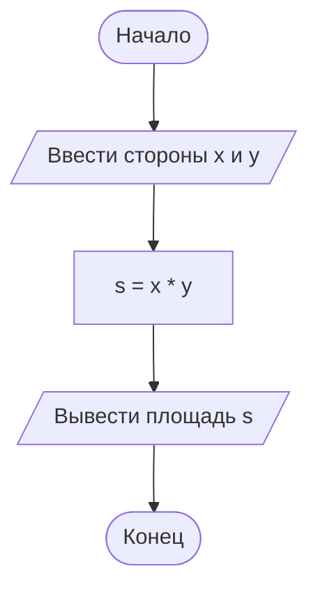

# 02. Линейный алгоритм — общий вид

> [!note] Об этой лекции
> Лекция **авторская**: в программе колледжа такой темы не было, и в учебный план она
> не входит. Она введена при сборке курса, чтобы сначала разобрать конструкции алгоритма
> в общем виде — схемами и псевдокодом, без языка программирования. Кода здесь нет совсем.

> [!abstract] О чём эта лекция
> Самый простой вид алгоритма: шаги выполняются друг за другом, без ветвлений и повторений.
> На нём разбираются два инструмента, которые понадобятся до конца курса: **блок-схема**
> и **псевдокод**.
>
> **Зачем это нужно.** Любая программа — это, в первую очередь, последовательность действий,
> и только во вторую — текст на языке. Если научиться записывать последовательность схемой
> и псевдокодом, то в лекциях 07–16 останется выучить только синтаксис: логика уже будет
> понятна. Здесь же появляется привычка, которая экономит часы: **прежде чем писать код,
> проговорить и проверить порядок шагов**.
>
> **Что ты должен уметь после лекции:** назвать, из каких блоков состоит схема линейного
> алгоритма; прочитать чужую схему словами; записать постановку задачи схемой и псевдокодом;
> объяснить, почему перестановка шагов меняет результат.

> [!tip] Что нужно знать заранее
> Только предыдущую лекцию: [[01. Основы алгоритмизации]] — что такое алгоритм и какие формы
> у блоков схемы. Программировать по-прежнему не нужно.

---

# Что такое линейный алгоритм

**Линейный алгоритм** — алгоритм, в котором шаги выполняются последовательно, один за другим,
от начала до конца. Ни один шаг не пропускается, ни один не выполняется дважды, порядок
не меняется.

Примеры вокруг нас:

| Задача | Линейный алгоритм |
|---|---|
| Собраться на учёбу | встать → умыться → одеться → выйти |
| Приготовить чай | вскипятить воду → положить заварку → налить кипяток → подождать |
| Оплатить покупку картой | приложить карту → дождаться подтверждения → забрать чек |

Общее у всех: **предыдущий шаг обязателен для следующего**. Если налить кипяток до того,
как положили заварку, получится не чай.

Линейных алгоритмов в программах много, и почти всегда они решают одну и ту же задачу
вычисления:

1. **взять данные** — откуда-то получить то, что известно (ввели с клавиатуры, пришло из файла);
2. **посчитать** — применить формулы из математической модели;
3. **показать результат** — вывести его на экран, записать в файл, отправить дальше.

Эта тройка — «ввод → вычисление → вывод» — встречается в курсе постоянно. В лекции 07 она
превратится в первые программы на Python.

---

# Схема линейного алгоритма

Напомним формы блоков из [[01. Основы алгоритмизации]] — вот те, что нужны для линейного
алгоритма:

| Блок по ГОСТ | Форма | Что внутри | Как записать в Obsidian (mermaid) |
|---|---|---|---|
| Терминатор | овал | начало и конец | `A([Начало])` |
| Ввод / вывод | параллелограмм | «ввести x», «вывести s» | `B[/Ввести x/]` |
| Процесс | прямоугольник | формула или присваивание | `C[s = x * y]` |
| Линии потоков | стрелка | порядок выполнения | `A --> B` |

Задача: найти площадь прямоугольника по двум сторонам.



Другие схемы этого вида: вычислить среднее двух чисел, перевести часы в минуты, посчитать
стоимость покупки по цене и количеству. Отличаются они только формулами — форма схемы
у них одна и та же.

> [!note] Стрелки — не украшение
> Схема читается по стрелкам: от «Начало» до «Конец», по одному блоку за раз.
> Если стрелку нарисовать в другую сторону, схема будет описывать другой алгоритм.

---

# Псевдокод

Рисовать схему удобно, когда хочется увидеть структуру. Но у схемы есть минус: формулы в ней
занимают много места, а длинный алгоритм превращается в простыню из рамок. Поэтому для записи
самих вычислений используют **псевдокод**.

**Псевдокод** — запись алгоритма на обычном языке с помощью ключевых слов, без правил
конкретного языка программирования. Его понимает человек, а компьютер — нет: псевдокод
нельзя запустить, он нужен, чтобы договориться о решении.

Правила простые:

- **ВВОД** — получить данные;
- **ВЫВОД** — показать результат;
- `:=` — «присвоить»: слева имя, справа то, что в него записывается;
- формулы записываются как в математике;
- одна строка — один шаг; порядок строк = порядок выполнения.

Тот же алгоритм площади прямоугольника на псевдокоде:

```text
ВВОД x, y
s := x * y
ВЫВОД s
```

Три записи одного алгоритма — словами, схемой и псевдокодом — несут одну и ту же информацию.
Выбирают ту, что удобнее для задачи: словами — чтобы объяснить, схемой — чтобы увидеть
структуру, псевдокодом — чтобы записать вычисления.

> [!tip] Зачем псевдокод, если есть язык программирования
> На псевдокоде можно думать, не отвлекаясь на правила языка: запятые, скобки, точки с запятой.
> Многие задачи курса удобнее сначала решить псевдокодом, а потом перевести в код — ошибок
> становится заметно меньше.

---

# Порядок шагов — часть алгоритма

В линейном алгоритме нет условий и повторений, но есть порядок, и он влияет на результат.
Классический пример — **обмен значений двух переменных**.

Задача: в переменной `a` лежит 3, в переменной `b` — 7. Нужно, чтобы стало наоборот:
`a` = 7, `b` = 3.

Наивная попытка «поменять местами» двумя присваиваниями:

```text
ВВОД a, b         (a = 3, b = 7)
a := b            (теперь a = 7, b = 7 — значение 3 потеряно!)
b := a            (b = 7, a = 7 — обмен не состоялся)
ВЫВОД a, b        (7 и 7)
```

Значение `a` потерялось в первой же строке: его перезаписали, а старое никуда не сохранили.
Правильный алгоритм использует третью переменную — временное хранилище:

```text
ВВОД a, b         (a = 3, b = 7)
c := a            (c = 3 — сохранили значение a)
a := b            (a = 7)
b := c            (b = 3)
ВЫВОД a, b        (7 и 3)
```

Порядок строк здесь нельзя менять: если сначала выполнить `a := b`, а потом `c := a`,
в `c` попадёт уже испорченное значение.

Ещё одна частая ошибка — вычислять раньше, чем получены данные:

```text
s := x * y        (x и y ещё неизвестны — считать нечего)
ВВОД x, y
ВЫВОД s
```

> [!warning] Порядок важнее скорости
> Новичок обычно торопится написать вычисления и забывает про ввод данных или про вывод
> результата. Проверка простая: пройди по схеме или по псевдокоду сверху вниз и спроси
> на каждом шаге — «есть ли у меня всё, что нужно для этого шага?».

---

# Как проверить линейный алгоритм

Пока программы нет, проверить алгоритм можно **трассировкой**: подставить конкретные числа
и выполнить шаги вручную, записывая значения переменных.

Задача: посчитать стоимость покупки — цена `p` и количество `n`, итог `s`.

| Шаг | Что делаем | Значения после шага |
|---|---|---|
| 1 | `ВВОД p, n` | `p = 50`, `n = 3` |
| 2 | `s := p * n` | `s = 150` |
| 3 | `ВЫВОД s` | на экране 150 |

Трассировка отвечает на два вопроса: **правильно ли посчитано** (сверяем с ручным счётом)
и **нет ли шага, которому не хватает данных** (как в примере выше — считать до ввода).

Проверять стоит на нескольких наборах: маленькие числа (легко считать в голове), ноль,
дробные числа. Если алгоритм работает только на одном красивом примере — он не проверен.

---

# Как это делают в проекте

Привычки этого уровня доступны сразу, без инструментов и библиотек.

**Привычка 1. Сначала постановка, потом шаги.** Прежде чем рисовать схему, ответь словами:
что дано, что нужно найти, по какой формуле считается результат. Это 10 секунд работы,
которые экономят час переписывания.

**Привычка 2. Шаги формулируют так, чтобы их можно было выполнить.** «Посчитать что-нибудь
полезное» — не шаг. «Умножить цену на количество и записать в `s`» — шаг. Если шаг нельзя
выполнить по инструкции, не заглядывая в голову автора, — он описан плохо.

**Привычка 3. Проверять на числах до того, как писать код.** Трассировка из предыдущего
раздела — это разовая ручная проверка. Привычка «прогнать алгоритм на бумажке» потом
превратится в автотесты (инженерный модуль), но работает она уже сейчас.

> [!note] Про остальные приёмы
> Тесты, библиотеки и инструменты появятся в инженерном модуле в конце курса. Пока —
> только простые привычки: понятная постановка, выполнимые шаги, проверка на числах.

---

# Ключевые термины

| Термин | Определение |
|---|---|
| **Линейный алгоритм** | алгоритм, в котором шаги выполняются последовательно, один за другим |
| **Ввод** | шаг, на котором алгоритм получает исходные данные |
| **Вывод** | шаг, на котором показывается результат |
| **Псевдокод** | запись алгоритма обычными словами с ключевыми словами `ВВОД`, `ВЫВОД`, `:=` |
| **Присваивание** | запись значения под именем: слева имя, справа выражение (`s := x * y`) |
| **Значение переменной** | то, что в переменной лежит в данный момент; при присваивании старое значение заменяется |
| **Трассировка** | выполнение алгоритма вручную на конкретных числах с записью значений |
| **Математическая модель** | формулы, по которым из исходных данных получается результат |

---

# Типичные заблуждения

- ❌ **«Линейный алгоритм — это про переменные».** Нет, это про порядок: шаги идут подряд,
  без развилок и повторов. Дело не в переменных, а в структуре.
- ❌ **«Раз шаги идут подряд, порядок можно менять».** Нельзя. Обмен значений и вычисление
  до ввода данных — два примера, где перестановка ломает алгоритм.
- ❌ **«Схема и псевдокод — одно и то же».** Это две записи одного алгоритма: схема показывает
  структуру, псевдокод — вычисления. В длинном алгоритме формулы удобнее писать псевдокодом.
- ❌ **«Псевдокод — это язык программирования, который надо выучить».** Это просто
  договорённость о записи. Правил у него три, и они в этой лекции.
- ❌ **«Можно писать шаги сразу в уме, схема лишняя».** Для двух-трёх шагов — да. Как только
  шагов больше, в голове остаётся не алгоритм, а ощущение «вроде так».
- ❌ **«Схема нужна только для отчёта».** Схема — дешёвый способ увидеть, что шаг стоит
  не на своём месте. Отчёт тут ни при чём.
- ❌ **«Если ответ совпал на одном примере, алгоритм правильный».** Совпал — значит, не опровергнут
  на этом примере. Проверяют на нескольких наборах, включая граничные (ноль, отрицательные, дробные).

---

# Проверь себя

1. Чем линейный алгоритм отличается от всех остальных?
2. Какие три шага есть почти в любой вычислительной задаче?
3. Что означает запись `s := x * y`?
4. Почему обмен значений двух переменных не работает без третьей переменной?
5. Как проверить линейный алгоритм, если программы ещё нет?

> [!example]- Ответы
> 1. В линейном алгоритме все шаги выполняются один раз и по порядку, без выбора пути
>    и без повторений: на схеме нет ни одного ромба и ни одного шестиугольника.
> 2. **Ввод данных, вычисление, вывод результата.** Порядок именно такой: вычислять до ввода
>    нельзя — переменные ещё пусты, а выводить до вычисления нечего.
> 3. Переменной `s` присваивается произведение **текущих** значений `x` и `y`; старое значение
>    `s` при этом затирается и вернуть его уже неоткуда.
> 4. Первое же присваивание затирает значение одной из переменных. Обменять можно только
>    «через третью ячейку»: сначала сохранить одно значение, потом перенести второе, потом
>    вернуть сохранённое. Так работают все приёмы обмена.
> 5. **Трассировкой:** пройти алгоритм вручную, записывая значения переменных после каждого
>    шага, — на 2–3 наборах данных, включая граничные (0, 1, равные значения). Полученный ответ
>    сверяется с посчитанным независимо: в уме или на калькуляторе.


---
# Практика

- **Задачи блока А:** [[02. Задачи. Линейный алгоритм]] — шесть задач с разбором под спойлером:
  схема «ввод → вычисление → вывод», обмен значений, порядок шагов, трассировка, формулы
  со скобками, граничные случаи.
- **Мини-проект блока А:** [[05. Мини-проект. Схема для задачи из жизни]] — итоговая работа
  блока (после лекции 04).
- **Кода в этой теме нет:** программирование начинается с лекции [[07. Линейный алгоритм]].
- [[00. Обзор задач блока А]] — чек-лист самопроверки и шаблон схемы для копирования.

---

# Связи с другими темами

- [[01. Основы алгоритмизации]] — формы блоков схемы по ГОСТ и этапы решения задачи.
- [[03. Разветвляющийся алгоритм — общий вид]] — что добавляется к схеме, когда появляется
  условие.
- [[04. Циклический алгоритм — общий вид]] — что добавляется, когда один шаг нужно повторить.
- [[07. Линейный алгоритм]] — та же задача, записанная кодом: ввод, вычисление, вывод.
- [[05. Язык Python - идентификаторы, операторы, типы данных]] — как записываются вычисления
  и имена в Python.
- [[02_Основы_Алгоритмизации_и_Программирования/00_Курс|00_Курс дисциплины]] — место лекции
  в программе и практики курса.
