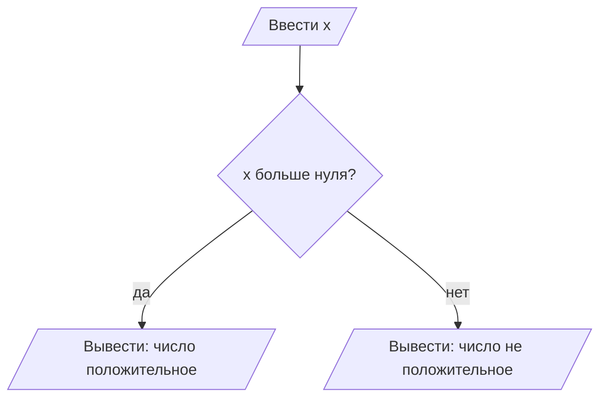
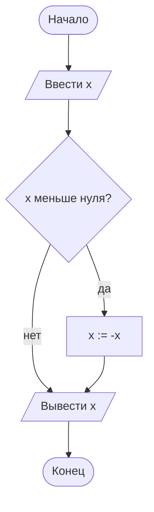
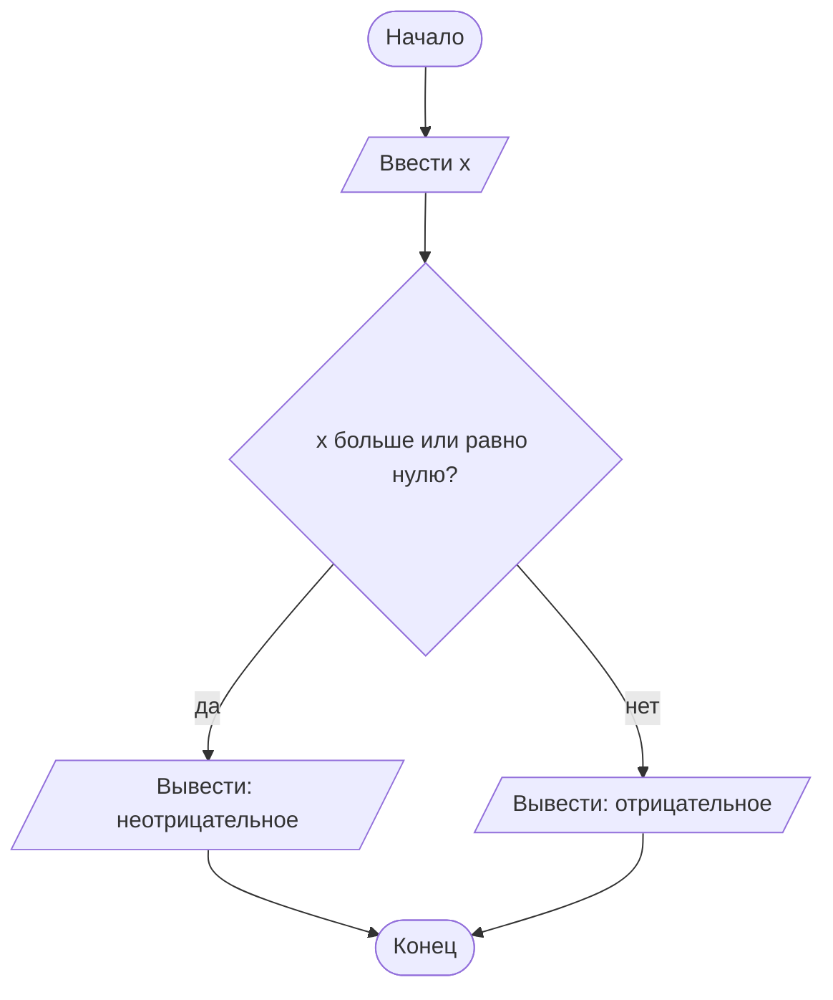
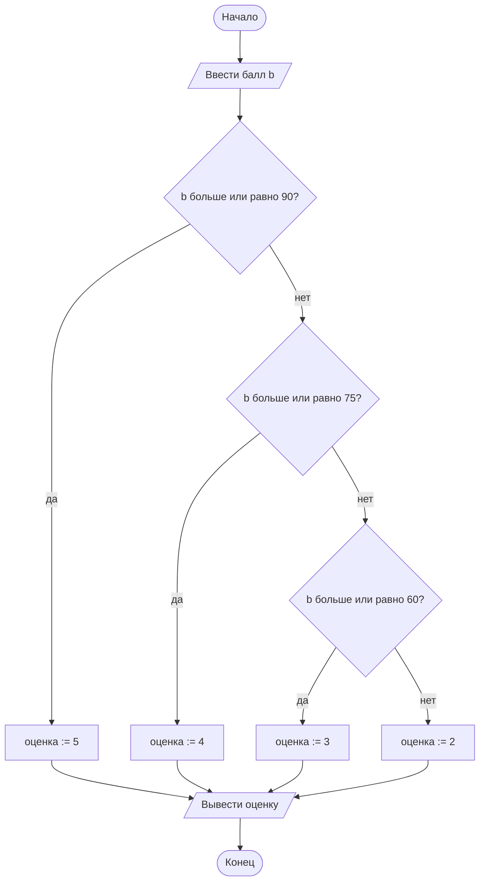

# 03. Разветвляющийся алгоритм — общий вид

> [!note] Об этой лекции
> Лекция **авторская**: в программе колледжа отдельной темы про развилки в общем виде не было.
> Она введена при сборке курса, чтобы разобрать условие и ветвление схемой и псевдокодом —
> до того, как появится `if` в Python.

> [!abstract] О чём эта лекция
> Как только в задаче появляется выбор — «если так, то одно, иначе другое» — линейный алгоритм
> заканчивается и начинается **разветвляющийся**. Здесь разбираем, откуда берётся выбор
> (условие), как он выглядит на схеме (ромб) и какие три формы развилки бывают.
>
> **Зачем это нужно.** Условия — это половина логики любой программы: проверка данных,
> выбор варианта, отбор подходящего. Все ошибки в условиях одинаковы во всех языках:
> непокрытый случай, неверная граница, перепутанный порядок проверок. Здесь они видны
> на схеме за минуту — в коде на них уходят часы отладки.
>
> **Что ты должен уметь после лекции:** сформулировать условие так, чтобы на него можно было
> ответить «да» или «нет»; нарисовать схему неполной, полной и многозначной развилки; записать
> составное условие словами **И**, **ИЛИ**, **НЕ**; объяснить, почему порядок проверок
> и границы влияют на результат.

> [!tip] Что нужно знать заранее
> [[01. Основы алгоритмизации]] (что такое алгоритм, формы блоков) и [[02. Линейный алгоритм — общий вид]]
> (схема, псевдокод, порядок шагов). Кода по-прежнему не требуется.

---

# Что такое условие

**Условие** — утверждение, про которое можно сказать, истинно оно или ложно. Третьего варианта
нет: «сегодня вторник» — либо да, либо нет.

Примеры условий и их значения:

| Условие | При `x = 5` | При `x = -2` |
|---|---|---|
| `x больше нуля` | истина | ложь |
| `x равно десяти` | ложь | ложь |
| `x не равно нулю` | истина | истина |
| `x чётное` | ложь | истина |

Условие может быть и про текст: «пароль совпадает с сохранённым», «слово начинается с гласной».
Важно одно: **на условие должен быть однозначный ответ**. «Число большое» — не условие:
для одного большое — это 100, для другого — миллион.

В блок-схеме условие изображается **ромбом**: один вход, два выхода — «да» (истина)
и «нет» (ложь).



> [!note] Почему у ромба два выхода
> Именно отсюда начинается ветвление: дальше алгоритм идёт разными путями. На схеме
> это видно глазом — и сразу заметно, если один из путей куда-то не ведёт.

---

# Три формы развилки

## 1. Неполная развилка: только «если»

Шаг выполняется **только если условие истинно**. Если ложно — ничего не происходит, алгоритм
идёт дальше.

Задача: получить модуль числа (убрать минус, если он есть).



Псевдокод:

```text
ВВОД x
ЕСЛИ x < 0 ТО
    x := -x
ВЫВОД x
```

Читается: «если условие выполнено — сделай это». Путь «нет» ведёт сразу дальше, минуя шаг.

## 2. Полная развилка: «если — иначе»

Оба пути что-то делают, и один из них выполняется обязательно.

Задача: вывести, положительное число или нет (без `если` в выводе — оба варианта прописаны
явно).



Псевдокод:

```text
ВВОД x
ЕСЛИ x >= 0 ТО
    ВЫВОД "неотрицательное"
ИНАЧЕ
    ВЫВОД "отрицательное"
```

Ключевое слово **ИНАЧЕ** и означает «все остальные случаи». Ветка `ИНАЧЕ` покрывает всё,
что не попало в условие, — даже то, о чём автор не подумал.

## 3. Многозначная развилка: лестница условий

Вариантов больше двух. Проверяем условия по очереди: как только одно истинно — выполняем
его ветку и уходим на общий выход, остальные не проверяются.

Задача: по баллу от 0 до 100 поставить оценку (90+ — «5», 75+ — «4», 60+ — «3», иначе — «2»).



Псевдокод:

```text
ВВОД b
ЕСЛИ b >= 90 ТО
    оценка := 5
ИНАЧЕ ЕСЛИ b >= 75 ТО
    оценка := 4
ИНАЧЕ ЕСЛИ b >= 60 ТО
    оценка := 3
ИНАЧЕ
    оценка := 2
ВЫВОД оценка
```

---

# Порядок проверок и границы

В лестнице условий две вещи ломают результат чаще всего: **порядок** и **границы**.

**Порядок.** Сравни две лестницы для одной и той же задачи про оценку:

| Порядок | Что получит студент с 95 баллами |
|---|---|
| сначала `b >= 90` (в лекции выше) | проверится первым и получит «5» — верно |
| сначала `b >= 60` | проверится первым и получит «3» — **ошибка** |

Причина: лестница останавливается на первом истинном условии. Поэтому порядок проверок —
от самого строгого условия к самому мягкому, иначе строгие случаи «съедаются» мягкими.

**Границы.** Условие `b > 90` и условие `b >= 90` отличаются ровно одним студентом —
тем, у кого ровно 90 баллов. Такие случаи называются **граничными**:

| Балл | Что должно быть | Проверяем, что попадёт |
|---|---|---|
| 89 | «4» | граница снизу |
| 90 | «5» | сама граница — здесь чаще всего ошибка |
| 91 | «5» | чуть выше границы |

Правило простое: **каждую границу проверяют тремя значениями — до, на и после.** Ошибка
на границе не видна на красивых числах и находится только так.

**Полнота.** Последняя ветка (`ИНАЧЕ`) должна ловить всё, что не подошло. Если её нет,
то при «неожиданном» значении алгоритм молча ничего не сделает — а это ошибка, которую
потом ищут очень долго.

---

# Составные условия

Иногда решение зависит не от одного утверждения, а от нескольких сразу. Условия соединяются
словами **И**, **ИЛИ**, **НЕ**:

| Связка | Когда истинно | Пример | Смысл в жизни |
|---|---|---|---|
| **И** | только когда истинны оба условия | `возраст >= 18 И есть_паспорт` | оформить документ |
| **ИЛИ** | когда истинно хотя бы одно | `оценка = 5 ИЛИ оценка = 4` | «хорошист и лучше» |
| **НЕ** | переворачивает условие | `НЕ (файл существует)` | «файла ещё нет» |

Как таблица истинности:

| A | B | A **И** B | A **ИЛИ** B | **НЕ** A |
|---|---|---|---|---|
| ложь | ложь | ложь | ложь | истина |
| ложь | истина | ложь | истина | истина |
| истина | ложь | ложь | истина | ложь |
| истина | истина | истина | истина | ложь |

Условие вида `x больше нуля И x меньше десяти` часто записывают в математике как двойное
неравенство `0 < x < 10`. В схемах и коде такой записи нет — приходится писать оба условия.
Это частая причина ошибок: начинающие пишут `0 < x < 10` и удивляются, почему «работает
не так» в языках, где так писать нельзя.

> [!tip] Сложное условие — в отдельное имя
> Если условие длинное, его стоит сначала назвать: `можно_оформить — это (возраст >= 18)
> И (есть паспорт)`. Тогда в развилке будет короткое слово, а не три строки текста, — и она
> станет читаемой. Этот приём позже превратится в логические переменные в Python.

---

# Как это делают в проекте

**Привычка 1. Спросить «а если ни одно условие не выполнено?»** У каждой развилки должен быть
ответ. В неполной — «ничего не делаем, идём дальше» (так и надо). В лестнице — ветка `ИНАЧЕ`,
которая ловит все остальные случаи.

**Привычка 2. Проверять границы.** Значение, стоящее ровно на границе, — самое опасное.
В тестировании это называют «проверка краёв»: до, на и после. Привычка стоит 30 секунд
и ловит ошибки, которые иначе живут в программе месяцами.

**Привычка 3. Не повторять одинаковые ветки.** Если две разные ветки делают одно и то же —
скорее всего, условие можно объединить (через **ИЛИ**) и упростить схему. Чем меньше путей,
тем меньше мест для ошибки.

**Привычка 4. Записывать все случаи явно.** Прежде чем рисовать схему, выпиши список случаев:
«меньше нуля», «ровно нуль», «больше нуля». Если случай не назван — он почти наверняка пропущен.

> [!note] Про инструменты
> Проверки границ, тесты и автоматические проверки условий — тема отдельного разговора
> в инженерном модуле. Пока важна сама привычка: прежде чем считать, что ветка правильная,
> задай себе вопрос «а на границе?».

---

# Ключевые термины

| Термин | Определение |
|---|---|
| **Разветвляющийся алгоритм** | алгоритм, в котором порядок шагов зависит от выполнения условия |
| **Условие** | утверждение, которое может быть истинным или ложным |
| **Истина / ложь** | два возможных значения условия; третьего не бывает |
| **Неполная развилка** | шаг выполняется только при истинном условии, иначе пропускается |
| **Полная развилка** | выполняются разные шаги при истинном и ложном условии |
| **Многозначная развилка** | лестница условий, проверяемых по очереди до первого истинного |
| **Составное условие** | условие из нескольких, соединённых связками **И**, **ИЛИ**, **НЕ** |
| **Граничное значение** | значение ровно на границе условия (`b = 90` для условия `b >= 90`) |
| **Ветка `ИНАЧЕ`** | все случаи, не подошедшие ни под одно из условий |

---

# Типичные заблуждения

- ❌ **«Условие может быть «примерно» истинным».** Нет. «Число большое», «погода хорошая» —
  не условия: они не поддаются проверке. Условие — всегда «да» или «нет».
- ❌ **«Ромб нужен только красоты ради».** Два выхода ромба — это и есть ветвление. Если
  ветку «нет» никуда не нарисовать, схема не полна.
- ❌ **«Порядок проверок не важен, важно, что все они есть».** Важен: лестница останавливается
  на первом истинном условии. Мягкое условие сверху «съедает» строгие снизу.
- ❌ **«`>` и `>=` — мелочь».** Они отличаются ровно граничным значением — и именно на нём
  чаще всего обнаруживается ошибка.
- ❌ **«Двойное неравенство `0 < x < 10` можно писать где угодно».** В математике можно,
  в схемах и большинстве языков — нет: пишут два условия через **И**.
- ❌ **«Если ветку `ИНАЧЕ` не рисовать, алгоритм станет короче».** Он станет неполным:
  «неожиданное» значение пройдёт мимо всех проверок, и непонятно, что должно было произойти.
- ❌ **«Одинаковые ветки — это нормально».** Две ветки с одинаковым действием — признак того,
  что условие сформулировано неверно; его почти всегда можно объединить.

---

# Проверь себя

1. Почему «число большое» — не условие?
2. Чем неполная развилка отличается от полной?
3. Сколько условий проверится в лестнице, если первое истинно?
4. Что произойдёт со студентом с 95 баллами, если лестницу начать с условия `b >= 60`?
5. Какими тремя значениями проверяют границу `b >= 90`?
6. Когда условие с **ИЛИ** истинно?

> [!example]- Ответы
> 1. Условие — это вопрос, на который есть однозначный ответ «да» или «нет». «Число большое»
>    ответа не даёт: непонятно, с чем сравнивать. Условием будет `x > 100`.
> 2. У **неполной** развилки действие есть только на ветке «да»: если условие ложно, ничего
>    не происходит. У **полной** обе ветки содержат действия — «если — иначе».
> 3. Проверится **одно** условие — то самое первое, оказавшееся истинным. До остальных очередь
>    не дойдёт: лестница заканчивает работу на первой истине.
> 4. Он получит «хорошо». Условие `b >= 60` истинно и для 95 баллов, а в лестнице срабатывает
>    первое истинное условие — до проверки `b >= 90` дело не дойдёт. Поэтому строгие условия
>    ставят первыми.
> 5. Чуть меньше границы (**89**), ровно на границе (**90**) и чуть больше (**91**). Так видно,
>    что обе стороны и сама граница обрабатываются правильно.
> 6. Условие с **ИЛИ** истинно, когда истинно хотя бы одно из простых условий — или оба сразу.
>    Ложно оно только тогда, когда ложны все части.


---
# Практика

- **Задачи блока А:** [[03. Задачи. Разветвляющийся алгоритм]] — шесть задач с разбором
  под спойлером: полная и неполная развилка, максимум из трёх чисел, чётность, лестница условий,
  составные условия, потерянный случай.
- **Мини-проект блока А:** [[05. Мини-проект. Схема для задачи из жизни]] — итоговая работа
  блока (после лекции 04).
- **Кода в этой теме нет:** `if / elif / else` появится в лекции [[08. Разветвляющийся алгоритм]].
- [[00. Обзор задач блока А]] — чек-лист самопроверки и шаблон схемы для копирования.

---

# Связи с другими темами

- [[01. Основы алгоритмизации]] — ромб как блок «проверка условия» и свойства алгоритма.
- [[02. Линейный алгоритм — общий вид]] — схема и псевдокод, на которых строится эта лекция.
- [[04. Циклический алгоритм — общий вид]] — в цикле тоже есть ромб: условие выхода из повторения.
- [[08. Разветвляющийся алгоритм]] — эта же логика на Python: `if`, `elif`, `else`, логические
  операторы.
- [[06. Принципы качественного кода и технический долг]] (дисциплина 01) — почему непокрытые
  случаи превращаются в долг и как это связано с тестами.
- [[02_Основы_Алгоритмизации_и_Программирования/00_Курс|00_Курс дисциплины]] — место лекции
  в программе и практики курса.
