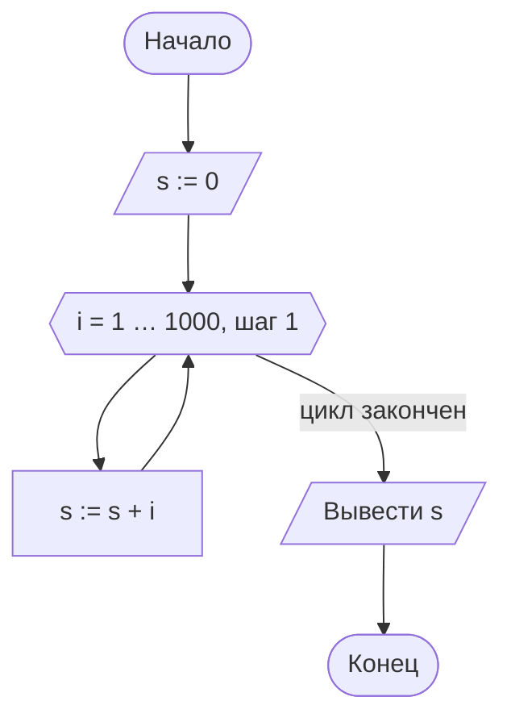
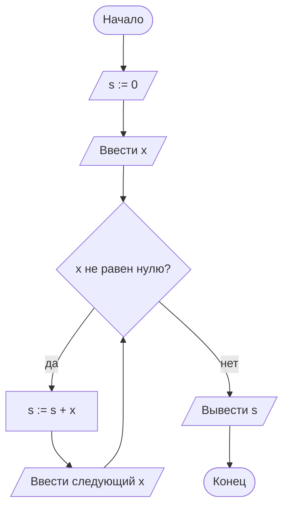
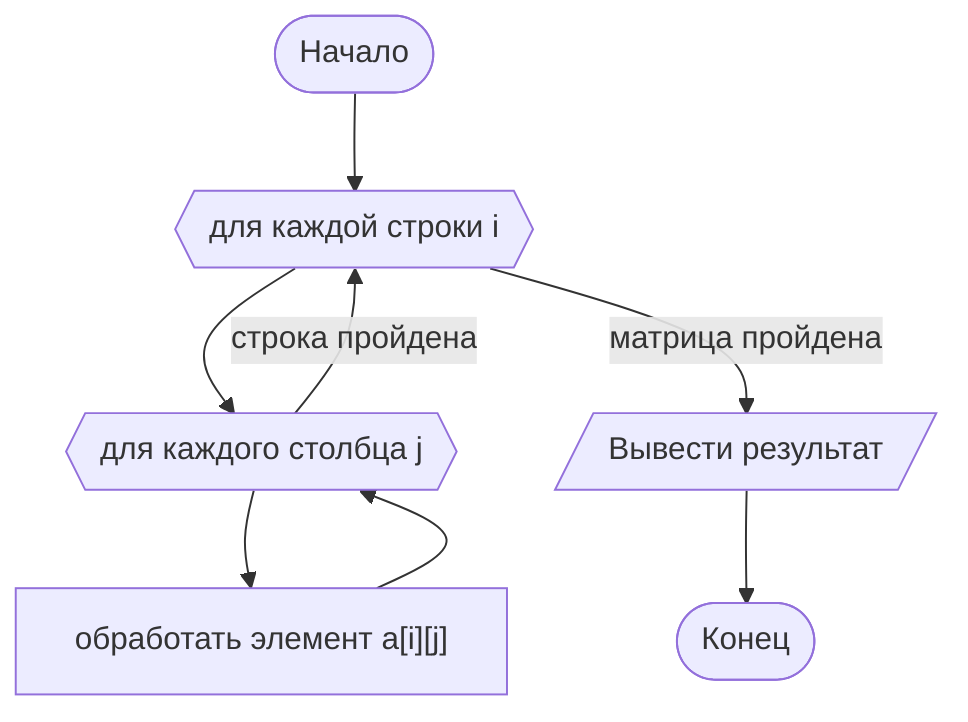

# 04. Циклический алгоритм — общий вид

> [!note] Об этой лекции
> Лекция **авторская**: в программе колледжа циклы разбирались сразу на языке.
> Здесь они разбираются схемами и псевдокодом — так видно устройство цикла само по себе,
> без синтаксиса `for` и `while`. Кода в лекции нет.

> [!abstract] О чём эта лекция
> Цикл — это повторение одного и того же действия. Здесь разбираем два вида повторения:
> **с известным числом шагов** (счётчик) и **по условию** (пока выполняется условие),
> а также накопление результата, таблицы значений и вложенные циклы.
>
> **Зачем это нужно.** Цикл — самое мощное, что есть в программировании: он превращает
> «посчитать для одного числа» в «посчитать для тысячи». И самое опасное: цикл без выхода
> вешает программу, а цикл с ошибкой в границах даёт ответ, который выглядит правдоподобно.
> Обе ошибки видны на схеме и в трассировке — эта лекция про то, как их поймать заранее.
>
> **Что ты должен уметь после лекции:** определить, какой цикл нужен задаче — со счётчиком
> или по условию; нарисовать схему цикла; записать цикл псевдокодом; объяснить, почему цикл
> обязательно закончится; сделать трассировку цикла на маленьком примере; правильно выбрать
> начальное значение при накоплении.

> [!tip] Что нужно знать заранее
> [[01. Основы алгоритмизации]], [[02. Линейный алгоритм — общий вид]],
> [[03. Разветвляющийся алгоритм — общий вид]]. Всё нужное — схемы, псевдокод и условие —
> уже разобрано.

---

# Зачем нужен цикл

Представь задачу: посчитать сумму чисел от 1 до 1000. Линейным алгоритмом это выглядит так:
999 операций сложения, записанных подряд. Так не делают.

**Циклический алгоритм** — алгоритм, в котором одна и та же группа шагов выполняется несколько
раз. Группа шагов называется **телом цикла**, одно выполнение тела — **итерацией**.

Циклы вокруг нас:

| Задача | Что повторяется | Когда остановиться |
|---|---|---|
| Пропылесосить комнату | движение по полу | пока не убрана вся площадь |
| Перелистать книгу до нужной страницы | листать страницу | пока страница не та, что нужна |
| Проверить работы 30 студентов | проверить одну работу | повторить 30 раз |
| Ждать, пока чайник закипит | проверка температуры | пока вода не 100 °C |

Делятся эти примеры на две группы — и это ровно два вида циклов:

- **известно, сколько раз повторять** — «проверить 30 работ», «сложить числа от 1 до 1000»;
- **число повторений заранее неизвестно** — «листать, пока не найдётся», «ждать, пока закипит».

---

# Цикл с известным числом повторений

Такой цикл задаётся **параметрами**: с какого значения начинать, до какого идти и с каким шагом.
Счётчик — переменная, которая «считает» повторения. В схеме по ГОСТ параметры цикла задаёт
шестиугольник — блок начала цикла:



Псевдокод:

```text
s := 0
ДЛЯ i ОТ 1 ДО 1000 ШАГ 1
    s := s + i
ВЫВОД s
```

Читается так: «для i от 1 до 1000 с шагом 1 выполни тело». Управление возвращается
к шестиугольнику, пока счётчик не выйдет за предел.

> [!note] Счётчик меняется сам — и это удобно
> В цикле со счётчиком программист не пишет «i := i + 1»: увеличение делает сам цикл,
> по параметрам из шестиугольника. Здесь же лежит самая частая ошибка: **шаг и границы
> выбирают невнимательно**. Например, `ДЛЯ i ОТ 0 ДО 1000` выполнится 1001 раз, а не 1000.

**Проверка границ цикла.** Прежде чем запускать, ответь на три вопроса:

| Вопрос | Для цикла «от 1 до 1000» |
|---|---|
| С какого значения начинается счёт? | с 1 |
| Включён ли конец? | да, 1000 входит |
| Сколько всего повторений? | 1000 − 1 + 1 = 1000 |
| Что будет, если граница равна 0 или 1? | цикл не выполнится ни разу (тело пропускается) |

---

# Цикл по условию

Если заранее неизвестно, сколько раз повторять, цикл задаётся условием: **повторять, пока
условие истинно**. Проверка стоит перед телом и повторяется каждую итерацию.

Задача: сложить числа, которые вводит пользователь, пока он не введёт 0.



Псевдокод:

```text
s := 0
ВВОД x
ПОКА x <> 0
    s := s + x
    ВВОД x
ВЫВОД s
```

Расшифровка: **ПОКА** условие истинно — выполняй тело и снова проверяй условие. Как только
условие стало ложным (пользователь ввёл 0) — выходим из цикла.

> [!warning] Тело должно менять условие
> Здесь тело цикла обязательно должно обновлять `x` — иначе условие `x <> 0` не изменится
> никогда, и цикл не закончится. Это вторая по частоте ошибка после границ.
> На схеме она видно сразу: если стрелка из тела возвращается к ромбу, а переменная
> из условия нигде внутри тела не меняется — цикл бесконечный.

---

# Бесконечный цикл

**Бесконечный цикл** — цикл, который никогда не заканчивается: условие выхода никогда
не становится ложным. Программа при этом «зависает»: выглядит как «ничего не происходит»,
но она не сломалась — она продолжает крутиться.

Как понять, что цикл закончится? Проверь три вещи:

1. **Условие вообще может стать ложным?** Пример: `ПОКА x > 0`, где внутри только
   `ВЫВОД x` — `x` не меняется, условие навсегда останется истинным.
2. **Переменные из условия меняются в теле?** Частая ошибка: обновляют не ту переменную
   или забывают обновление на одном из путей.
3. **Изменение идёт в нужную сторону?** `ПОКА i <> 100`, а внутри `i := i + 2`:
   при чётном шаге значение ровно 100 может не получиться — цикл будет крутиться мимо.
   Надёжнее писать `ПОКА i < 100`.

Заканчивающаяся итерация — не гарантия: если телу нужно много шагов (например, «искать
в большом списке»), цикл может выполняться долго и всё равно завершиться. Разница именно
в том, **меняется ли условие** в сторону выхода.

---

# Накопление результата

Очень частый шаблон: в цикле постепенно собирается результат. Есть три классические задачи,
и у каждой — своё **начальное значение**. Ошибка в нём ломает ответ, причём незаметно.

| Задача | Начальное значение | Что делается в цикле |
|---|---|---|
| **Сумма** элементов | `0` | прибавляем очередное значение |
| **Произведение** элементов | `1` | умножаем на очередное значение |
| **Максимум** элементов | первое значение (или очень маленькое число) | если очередное больше — запоминаем его |
| **Минимум** элементов | первое значение (или очень большое число) | если очередное меньше — запоминаем его |
| **Количество** подходящих | `0` | если элемент подходит — увеличиваем счётчик на 1 |

Почему именно так:

- сумму начинают с нуля, потому что к нулю можно прибавлять: `0 + a + b + …`. Если начать
  с первого элемента, его нужно отдельно обрабатывать — лишний шаг и лишняя ошибка;
- произведение начинают с единицы, потому что на ноль умножать нельзя — всё обратится в нуль;
- максимум **нельзя** начинать с нуля: если все числа отрицательные, ответом станет «0»,
  которого среди них нет. Правильно — взять первое значение как «максимум пока» и сравнивать
  с ним остальные.

Пример: найти максимум среди чисел 3, −7, −2.

```text
ВВОД первое число, максимум := первое число
ПОКА есть ещё числа
    ВВОД x
    ЕСЛИ x > максимум ТО
        максимум := x
ВЫВОД максимум
```

Трассировка: `максимум = 3` → `x = −7`, не больше → `x = −2`, не больше → ответ `3`. Верно.
А если бы начали с нуля — ответ был бы `0`, и это ошибка, которую очень легко не заметить.

---

# Таблицы значений (табулирование)

Типичная учебная задача: вывести таблицу значений функции на отрезке с шагом. Здесь цикл
соединяется с вычислением по формуле.

Задача: вывести значения `y = x²` для `x` от 1 до 5 с шагом 1.

```text
ДЛЯ x ОТ 1 ДО 5 ШАГ 1
    y := x * x
    ВЫВОД x, y
```

Результат — таблица:

| x | y |
|---|---|
| 1 | 1 |
| 2 | 4 |
| 3 | 9 |
| 4 | 16 |
| 5 | 25 |

Особенность таких задач — **накопление ответов в выводе**: результат не одна величина,
а строка за строкой. Если шаг дробный (например, 0,1), появляется вопрос точности: накапливая
шаг сложением, можно получить `0.30000000000000004` вместо `0.3`. Об этом — в инженерном
модуле; пока достаточно знать, что с дробным шагом нужна аккуратность.

---

# Вложенные циклы

**Вложенный цикл** — цикл внутри цикла. Внешний цикл делает один шаг, внутренний за это время
проходит **все свои шаги целиком**. Получается «таблица»: внешний счётчик — строки, внутренний —
столбцы.

Так обходят матрицу (таблицу чисел): пройти по всем строкам и в каждой строке — по всем
столбцам.



Сколько всего выполнится тело, если в матрице 3 строки и 4 столбца? `3 × 4 = 12` раз.
Это и есть главное свойство вложенных циклов: **внутренний выполняется столько раз, сколько
нужно внешнему**.

> [!tip] Трассировка вложенного цикла
> Чтобы понять, что делает вложенный цикл, распиши его вручную для маленького случая:
> строки 1–2, столбцы 1–3 — и выпиши, что происходит на каждом шаге. Шесть строк таблицы
> объясняют больше, чем чтение кода десять раз.

---

# Как это делают в проекте

**Привычка 1. Прокрутить цикл на маленьком примере.** Возьми `n = 3` вместо тысячи и выполни
руками, записывая значения счётчика и результата. Трассировка цикла отвечает на вопросы,
которые нельзя задать коду: правильные ли границы, с чего начинается счёт, что будет на первом
и последнем шаге.

**Привычка 2. Ответить «почему цикл закончится».** Это привычка про надёжность: если не можешь
объяснить, при каких условиях цикл выходит, — рано или поздно он зависнет. Особенно важно
для циклов по условию, где выход зависит от данных, введённых человеком.

**Привычка 3. Выбирать начальное значение осознанно.** Сумма с нуля, произведение с единицы,
максимум — с первого элемента: правило из таблицы выше. Это правило настолько часто нарушают,
что оно же и первый вопрос при проверке работы.

**Привычка 4. Называть счётчики понятно.** `i` и `j` подходят для «просто номера».
Но если счётчик считает работы студентов — лучше `номер_работы`, а если дни — `день`.
Имя счётчика объясняет, что перебирается.

> [!note] Про тесты и инструменты
> Трассировка, которую ты делаешь руками, позже превратится в автотесты: набор проверок,
> которые запускаются сами. Но принцип не изменится: сначала маленький понятный пример,
> потом — «а на границе?».

---

# Ключевые термины

| Термин | Определение |
|---|---|
| **Циклический алгоритм** | алгоритм, в котором группа шагов выполняется несколько раз |
| **Тело цикла** | шаги, которые повторяются |
| **Итерация** | одно выполнение тела цикла |
| **Счётчик** | переменная, которая считает повторения |
| **Цикл с известным числом повторений** | цикл, у которого заданы начало, конец и шаг счётчика |
| **Цикл по условию** | цикл, который повторяется, пока условие истинно |
| **Условие выхода** | условие, при котором циклический алгоритм прекращает повторения |
| **Бесконечный цикл** | цикл, условие выхода которого никогда не становится ложным |
| **Накопление** | сбор результата в одной переменной по ходу цикла (сумма, максимум, количество) |
| **Табулирование** | вывод таблицы значений функции на отрезке |
| **Вложенный цикл** | цикл внутри другого цикла; внутренний выполняется целиком на каждом шаге внешнего |

---

# Типичные заблуждения

- ❌ **«Цикл — это всегда «повторить N раз»».** Так бывает только у цикла со счётчиком.
  Цикл по условию повторяется столько раз, сколько потребуется, — это заранее неизвестно.
- ❌ **«В цикле по условию счётчик увеличивается сам».** Сам он увеличивается только в цикле
  со счётчиком. В цикле по условию всё, что меняет условие, пишешь ты — иначе цикл бесконечный.
- ❌ **«`for` и `while` — просто два синтаксиса одного и того же».** Разница в природе задачи:
  известно число повторений (`for`) или неизвестно (`while`). Выбор цикла диктует задача,
  а не удобство.
- ❌ **«Начальное значение при накоплении можно взять любое».** Сумма с нуля, произведение
  с единицы, максимум — с первого элемента. Любое другое значение даёт правдоподобный,
  но неверный ответ.
- ❌ **«Если программа зависла — что-то сломалось».** Скорее всего, условие выхода цикла
  никогда не становится ложным. Это самая частая причина «зависаний» у начинающих.
- ❌ **«Вложенный цикл — это два цикла подряд».** Нет: внутренний цикл выполняется целиком
  на каждом шаге внешнего. Для 3 строк и 4 столбцов тело выполнится 12 раз, а не 7.
- ❌ **«Проверять границы — лишняя работа».** Число повторений отличается на единицу
  от ожидаемого, и результат уже неверный — например, сумма всех чисел от 1 до 100, посчитанная
  от 0 до 100, отличается не сильно, но неправильно.

---

# Проверь себя

1. Чем отличается цикл с известным числом повторений от цикла по условию?
2. Сколько раз выполнится тело цикла `ДЛЯ i ОТ 1 ДО 10 ШАГ 2`?
3. Почему произведение начинают считать с единицы, а не с нуля?
4. Почему максимум нельзя начинать считать с нуля?
5. Почему цикл «ПОКА x > 0, тело: вывести x» никогда не закончится?
6. Сколько раз выполнится тело вложенного цикла для таблицы 5 строк на 3 столбца?

---

# Практика

- Задачи по теме: суммы и количества, таблицы значений, поиск максимума и минимума, вложенные
  циклы. Условия — в практиках курса; первыми задачами станут работы «Табулирование функции»,
  «Циклы с неизвестным числом повторений» и «Итеративные циклические структуры»
  из `03_Лабораторные` — они переезжают в практики.
- **Мини-проект блока А** — «схема для задачи из жизни»: обязательно и ветвление, и цикл.
  Полный список — в [[02_Основы_Алгоритмизации_и_Программирования/00_Курс|00_Курсе]].
- Кода в этой теме нет: циклы на Python — в лекциях [[09. Циклический алгоритм - цикл for]]
  и [[10. Циклический алгоритм - цикл while]].

---

# Связи с другими темами

- [[01. Основы алгоритмизации]] — шестиугольник «начало цикла» и ромб «проверка условия».
- [[02. Линейный алгоритм — общий вид]] — тело цикла состоит из линейных шагов.
- [[03. Разветвляющийся алгоритм — общий вид]] — условие выхода из цикла и условия внутри тела.
- [[09. Циклический алгоритм - цикл for]] — цикл со счётчиком на Python.
- [[10. Циклический алгоритм - цикл while]] — цикл по условию на Python.
- [[13. Вложенные последовательности]] — матрицы, которые обходятся вложенными циклами.
- [[02_Основы_Алгоритмизации_и_Программирования/00_Курс|00_Курс дисциплины]] — место лекции
  в программе, практики и мини-проекты.
