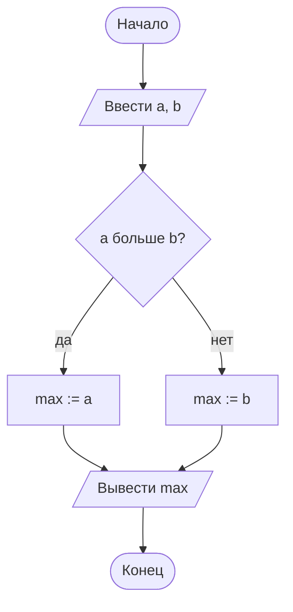

# 00. Задачи блока А — обзор

> [!abstract] Что это
> Практика блока А: четыре набора задач (по одному на каждую лекцию) и мини-проект.
> Задачи не про программирование — они про **описание решения**: прочитать условие,
> придумать порядок действий, нарисовать схему, записать псевдокод и проверить себя
> на маленьком примере.
>
> Именно это умение понадобится дальше: в блоке Б те же шаги превратятся в код, а ошибки
> останутся ровно теми же — неверный порядок, потерянный случай, цикл без выхода.

> [!important] Как работать с задачей
> 1. Прочитай условие и **не открывай разбор**. Разбор свёрнут (`> [!example]-`): он
>    раскрывается щелчком по заголовку.
> 2. Запиши решение сам: схема → псевдокод → трассировка на маленьких данных.
> 3. Прогони свой чек-лист (ниже).
> 4. Только теперь открой разбор и сверься. Совпало по шагам — задача закрыта.
>
> Разбор — это не «правильный ответ, который надо запомнить», а пример аккуратной записи.
> Если твоё решение отличается, но выдерживает чек-лист — оно верное.

# Чек-лист: свою схему проверяю сам

| # | Вопрос к своей схеме | Почему важно |
|---|---|---|
| 1 | Есть «Начало» и «Конец», и до «Конца» можно дойти? | алгоритм без конца — не алгоритм |
| 2 | Каждая стрелка куда-то ведёт; у развилки подписаны обе ветки? | ветка без выхода — самая частая ошибка |
| 3 | Все переменные сначала **получают значение**, и только потом используются? | «пустая» переменная — ошибка, которую видно только на схеме |
| 4 | Порядок шагов такой, что каждый шаг может выполниться? | в линейном алгоритме порядок — часть алгоритма |
| 5 | У цикла понятно, что именно его заканчивает и что это условие меняется? | иначе цикл никогда не закончится |
| 6 | Начальные значения накопления выбраны по правилу (сумма — 0, произведение — 1, максимум — первое значение)? | начинающий ошибается здесь чаще всего |
| 7 | Я прогнал алгоритм вручную на 2–3 наборах данных, включая граничные? | 0, 1, отрицательные, равные значения — там и живут ошибки |

# Шпаргалка: формы блоков

| Блок | Форма | Что внутри |
|---|---|---|
| Начало / конец | овал | слова «начало» и «конец» |
| Процесс (вычисление) | прямоугольник | формула или присваивание: `s := a + b` |
| Ввод / вывод | параллелограмм | «ввести x», «вывести s» |
| Условие (решение) | ромб | вопрос с ответом «да» / «нет», два выхода |
| Начало цикла | шестиугольник | параметры повторения: с чего, до чего, с каким шагом |

# Шаблон схемы для копирования

Схемы в курсе рисуются в **Mermaid** — Obsidian показывает их как картинку прямо в заметке.
Скопируй шаблон и замени подписи под свою задачу:

````markdown

````

Что здесь что: `([ ])` — овал, `[/ /]` — параллелограмм, `[ ]` — прямоугольник,
`{ }` — ромб, `{{ }}` — шестиугольник, `-->|да|` — стрелка с подписью.
Подписи пиши коротко, словами, а знаки «меньше» и «больше» заменяй словами или знаками
`≤` `≥` `≠` — так схема читается однозначно.

> [!tip] Если Mermaid не нравится
> Схему можно нарисовать на листе бумаги, сфотографировать и приложить к заметке — ГОСТ
> не требует электронной схемы. Можно и в draw.io: там фигуры по ГОСТ лежат в наборе
> `Flowchart`. Важен только результат: схему можно прочитать со стороны.

# Наборы задач

| Набор | После лекции | Задач | О чём |
|---|---|---|---|
| [[01. Задачи. Описание алгоритма]] | [[01. Основы алгоритмизации]] | 6 | шаги алгоритма, свойства, способы описания, чтение схемы |
| [[02. Задачи. Линейный алгоритм]] | [[02. Линейный алгоритм — общий вид]] | 6 | схема «вычислить и вывести», порядок шагов, трассировка |
| [[03. Задачи. Разветвляющийся алгоритм]] | [[03. Разветвляющийся алгоритм — общий вид]] | 6 | ромб на схеме, полная и неполная развилка, лестница условий |
| [[04. Задачи. Циклический алгоритм]] | [[04. Циклический алгоритм — общий вид]] | 8 | цикл со счётчиком и по условию, границы, накопление, вложенные циклы |
| [[05. Мини-проект. Схема для задачи из жизни]] | всего блока А | 1 проект | придумать процесс самому и описать его схемой и псевдокодом |

> [!note] Зачем отдельные задачи, если в лекциях есть «Проверь себя»
> «Проверь себя» — устные вопросы на понимание; их ответы тоже есть в лекциях, под свёрнутой
> врезкой. Задачи — письменная работа: схема, псевдокод, трассировка. Одно без другого
> не работает: понять теорию и уметь описать решение — разные умения.

# Готов ли ты к блоку Б

Блок А закрыт, если на каждый пункт отвечаешь «да» без подглядывания в лекции:

- объясняю, чем программа отличается от алгоритма, и называю четыре свойства алгоритма;
- читаю любую блок-схему по формам блоков: овал, параллелограмм, прямоугольник, ромб,
  шестиугольник;
- записываю один и тот же алгоритм словами, схемой и псевдокодом;
- вижу, что шаг использует переменную до того, как ей присвоили значение;
- выбираю вид цикла под задачу и объясняю, почему он закончится;
- считаю число повторений цикла и проверяю границы (входит ли конец, что при нуле);
- выбираю начальное значение для суммы, произведения и максимума и объясняю выбор;
- проверяю алгоритм на границах: ноль, единица, равные значения, отрицательные числа.

Если что-то из списка не получается — вернись к соответствующему набору задач: разбор
в нём показывает, как это выглядит в готовом решении.

---

# Связи с другими темами

- [[00. Обзор практик]] — все практики курса: блок А, семь практик блока Б, мини-проекты.
- [[01. Основы алгоритмизации]] — теория, на которой построены все задачи блока.
- [[02_Основы_Алгоритмизации_и_Программирования/00_Курс|00_Курс дисциплины]] — место блока А
  в программе и переход к блоку Б.
- [[00. Обзор практик блока Б]] — практики с кодом, куда перешли условия прежних
  лабораторных (`04_Код/Архив/Лабораторные/`).
