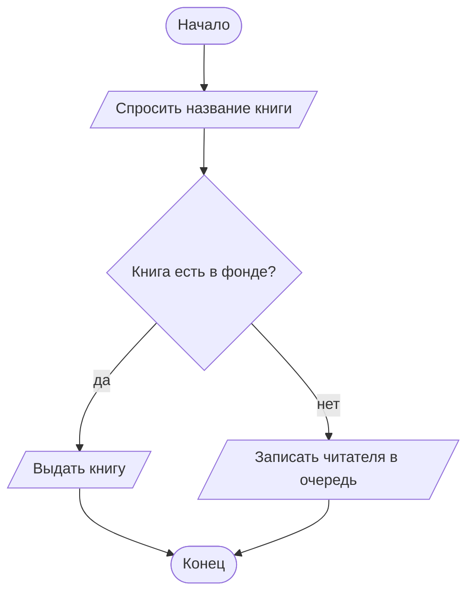
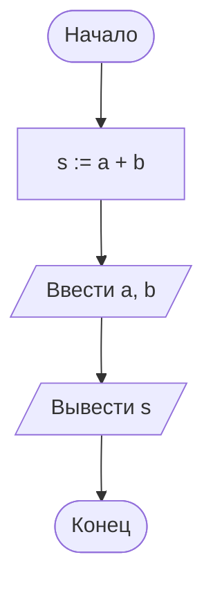

# 01. Задачи. Описание алгоритма

> [!abstract] О чём этот набор
> Шесть задач по лекции [[01. Основы алгоритмизации]]: что такое шаг алгоритма, какие свойства
> нарушают плохие инструкции, как читать блок-схему, как записать один алгоритм тремя
> способами, как разложить задачу по шести этапам. Кода здесь нет — только описание решения.
>
> **Что понадобится:** лист бумаги или шаблон схемы из [[00. Обзор задач блока А]].

---

## Задача 1. Рецепт как алгоритм

★☆☆ · шаги алгоритма, свойства алгоритма

**Условие.** Дана инструкция:

> Сделать бутерброд с сыром: взять ломтик хлеба, намазать маслом, положить сыр, накрыть вторым
> ломтиком хлеба.

**Задание.** 1) Выпиши шаги нумерованным списком и скажи, сколько их. 2) Назови, какие свойства
алгоритма у этой инструкции есть. 3) Испорть инструкцию три раза так, чтобы каждый раз
нарушалось ровно одно свойство: сначала **дискретность**, потом **понятность**, потом
**результативность**.

> [!example]- Разбор
> **1) Шаги — их четыре.**
>
> 1. Взять ломтик хлеба.
> 2. Намазать маслом.
> 3. Положить сыр.
> 4. Накрыть вторым ломтиком хлеба.
>
> **2) Свойства, которые видны.** *Дискретность* — инструкция разбита на отдельные шаги,
> каждый выполняется целиком. *Понятность* — все действия названы конкретно: «намазать маслом»,
> а не «сделать вкусно». *Конечность* — шагов четыре, после четвёртого работа заканчивается.
> *Результативность* — на выходе получается бутерброд, а не «что-то». *Массовость* — рецепт
> годится для любого хлеба и любого сыра, а не для одного конкретного ломтика.
>
> **3) Как испортить.**
>
> | Нарушаем | Как звучит инструкция | Что не так |
> |---|---|---|
> | дискретность | «Сделать бутерброд с сыром» | один шаг без границ: непонятно, из чего он состоит |
> | понятность | «Намазать маслом как надо» | «как надо» исполнитель понимает по-своему |
> | результативность | «Взять сыр и подумать, что с ним делать» | работа заканчивается, а результата нет |
>
> **Что здесь важно:** свойства алгоритма — не теория для заучивания, а вопросы, которые
> задают любой инструкции: из чего состоит, понятна ли, кончается ли, даёт ли результат,
> годится ли для разных данных.

---

## Задача 2. Робот и точность шага

★☆☆ · понятность и определённость шага

**Условие.** Перед тобой три записи одного и того же действия:

- а) посолить немного;
- б) посолить по вкусу;
- в) добавить 1 г соли.

**Задание.** 1) Какую из трёх записей выполнит робот-исполнитель, который понимает только точные
команды? 2) Что делать с двумя другими, чтобы они тоже стали шагами алгоритма?

> [!example]- Разбор
> **1) Выполнима только запись (в).** В ней есть число и единица измерения — исполнителю не нужно
> ничего додумывать. «Немного» и «по вкусу» — оценки, которые умеет делать человек, но не
> исполнитель: у слова «немного» нет значения, с которым можно сравнить.
>
> **2) Как переписать остальные.**
>
> | Было | Стало |
> |---|---|
> | посолить немного | добавить 1 г соли |
> | посолить по вкусу | попросить человека указать, сколько соли добавить, и ввести это число |
>
> Второй вариант — это уже заготовка шага **ввода**: алгоритм сам спрашивает значение, которое
> не может выбрать за исполнителя.
>
> **Что здесь важно:** если шаг нельзя выполнить, не догадываясь, — это ещё не шаг алгоритма.
> Превратить такое требование в шаг помогает либо число («1 г»), либо ввод значения у человека.

---

## Задача 3. Прочитай схему

★☆☆ · чтение блок-схемы

**Условие.** В библиотеке книга выдаётся так:



**Задание.** 1) Расскажи словами, что делает эта схема, — так, чтобы понял человек, не видевший
схемы. 2) Определи, что здесь ввод, что вывод, что процесс, что условие. 3) Что изменится, если
на схеме поменять ветки «да» и «нет» местами? 4) Что будет, если убрать блок «Записать читателя
в очередь»?

> [!example]- Разбор
> **1) Словами.** Читателя спрашивают название книги. Если книга есть в фонде, её выдают; если
> нет — записывают читателя в очередь. Затем работа заканчивается. Есть ровно две возможности,
> и обе приводят к концу.
>
> **2) Роли блоков.**
>
> | Что | Блок | Почему |
> |---|---|---|
> | ввод | «Спросить название книги» | данные приходят из внешнего мира |
> | условие | «Книга есть в фонде?» | вопрос с ответом «да» / «нет», два выхода |
> | вывод | «Выдать книгу» | результат работы, который видит человек |
> | процесс | «Записать читателя в очередь» | действие внутри алгоритма |
> | терминатор | «Начало», «Конец» | границы схемы |
>
> **3) Перестановка веток.** Результат не изменится: условие решает, по какой ветке идти,
> а на каком месте страницы нарисована ветка — не часть алгоритма. Важно только не перепутать
> подписи: «да» должно остаться на ветке «да». В этом отличие от линейного алгоритма, где
> порядок шагов — часть алгоритма и переставлять их нельзя.
>
> **4) Если убрать «Записать в очередь».** Ветка «нет» станет пустой: у стрелки нет действия,
> по схеме непонятно, что делать при отсутствии книги. Правильно на такой схеме либо писать
> действие, либо вести обе ветки прямо к «Концу» — тогда ромб просто ничего не меняет.
>
> **Что здесь важно:** схема читается по фигурам. Увидел ромб — ищи два пути и обе подписи;
> увидел пустую ветку — это ошибка, а не «мелочь».

---

## Задача 4. Один алгоритм — три способа

★★☆ · способы описания алгоритма

**Условие.** В магазине нужно посчитать сдачу: известны цена первой покупки, цена второй покупки
и сумма денег, которую дал покупатель.

**Задание.** Запиши алгоритм **тремя способами**: словами, блок-схемой и псевдокодом.
Затем ответь: чем формулы отличаются от словесной записи и почему схемы не заменяют формулы.

> [!example]- Разбор
> **Словами.** Найти стоимость покупок: сложить обе цены. Вычесть стоимость покупок из денег
> покупателя — это сдача. Сообщить сдачу покупателю.
>
> **Схема.** Словами: Начало → ввести цена1, цена2, деньги → стоимость := цена1 + цена2 → сдача := деньги − стоимость → вывести сдачу → конец.
> ```mermaid
> flowchart TD
>     Start([Начало]) --> In[/Ввести цена1, цена2, деньги/]
>     In --> Sum["стоимость := цена1 + цена2"]
>     Sum --> Change["сдача := деньги − стоимость"]
>     Change --> Out[/Вывести сдачу/]
>     Out --> End([Конец])
> ```
>
> **Псевдокод.**
>
> ```text
> ВВОД цена1, цена2, деньги
> стоимость := цена1 + цена2
> сдача := деньги - стоимость
> ВЫВОД сдача
> ```
>
> **Что где.** Слова хороши, чтобы договориться о задаче; формулы — чтобы считать без
> двусмысленности; схема — чтобы увидеть порядок шагов и ветки целиком, одним взглядом.
> Формулу схема не заменяет: в прямоугольнике всё равно написано `сдача := деньги − стоимость`.
> А слова не заменяют ни то, ни другое: «вычесть из денег стоимость» понятно человеку, но
> исполнителю нужна точная запись.
>
> **Проверка на числах.** Покупки 120 и 80, денег 500: стоимость 200, сдача 300.
>
> **Что здесь важно:** это **линейный алгоритм** — шаги идут один за другим, без ветвлений
> и повторений. Подробнее такие алгоритмы разбираются в лекции
> [[02. Линейный алгоритм — общий вид]].

---

## Задача 5. Шесть этапов на бытовой задаче

★★☆ · этапы решения задачи

**Условие.** Нужно узнать, сколько денег уходит на обеды в течение месяца.

**Задание.** Заполни таблицу: для каждого из шести этапов решения задачи напиши, что ты делаешь
конкретно в этой задаче. Потом ответь: на каком этапе появляется вычисление, а на каком — ещё
ничего не считается.

> [!example]- Разбор
>
> | # | Этап | Что делаю в этой задаче |
> |---|---|---|
> | 1 | Общая постановка | Решаю, что считаю: сумму за месяц или средний обед, что входит в обед |
> | 2 | Математическая модель | «Расход = сумма стоимостей обедов», «Средний обед = сумма / количество обедов» |
> | 3 | Разработка алгоритма | Шаги: собрать цены обедов → сложить → поделить на количество → вывести результат |
> | 4 | Разработка программы | Записываю эти шаги кодом (в курсе это будет блок Б) |
> | 5 | Отладка | Проверяю на одной неделе: сходится ли сумма с чеками |
> | 6 | Анализ результатов | Смотрю на ответ и решаю: похоже на правду или где-то забыт обед |
>
> **Вычисление появляется на этапе 3** — как последовательность шагов. На этапе 2 есть формулы,
> но по ним ещё не считают, а на этапе 1 не считается вообще ничего: там договариваются, что
> именно нужно найти.
>
> **Что здесь важно:** этапы не «проходят по одному разу и забывают». Увидев, что ответ не сходится
> с чеками (этап 6), возвращаются к модели (этап 2) — возможно, забыт ещё один вид расходов.

---

## Задача 6. Найди ошибку в схеме

★★☆ · порядок шагов, использование переменной до присваивания

**Условие.** Для задачи «ввести два числа и вывести их сумму» нарисовали такую схему:



**Задание.** 1) Найди ошибку. 2) Объясни, что произойдёт, если исполнитель выполнит эту схему
буквально. 3) Нарисуй исправленную схему и запиши её псевдокодом.

> [!example]- Разбор
> **1) Ошибка в порядке шагов.** Вычисление стоит **до** ввода: к моменту `s := a + b` переменные
> `a` и `b` ещё не получили значений.
>
> **2) Что произойдёт.** Исполнителю нечего складывать: в ячейках `a` и `b` либо пусто, либо
> остатки от прошлой работы. В первом случае он остановится с ошибкой, во втором — посчитает
> сумму неизвестно чего, и ответ будет выглядеть правдоподобно, но будет неверным. Второй случай
> опаснее: программа «работает», а ответ неправильный.
>
> **3) Как правильно.**
>
> **Схема словами.** Начало → ввести a, b → s := a + b → вывести s → конец.
> ```mermaid
> flowchart TD
>     Start([Начало]) --> In[/Ввести a, b/]
>     In --> Calc["s := a + b"]
>     Calc --> Out[/Вывести s/]
>     Out --> End([Конец])
> ```
>
> ```text
> ВВОД a, b
> s := a + b
> ВЫВОД s
> ```
>
> **Что здесь важно:** любой шаг может использовать только те переменные, которые уже получили
> значение раньше — из ввода или из присваивания. Порядок шагов в линейном алгоритме — часть
> алгоритма, и на схеме это видно сразу, а в коде — нет.

---

# Связи с другими темами

- [[00. Обзор задач блока А]] — чек-лист проверки схемы и шаблон для копирования.
- [[01. Основы алгоритмизации]] — теория: свойства алгоритма, формы блоков, шесть этапов.
- [[02. Задачи. Линейный алгоритм]] — следующий набор: схемы без ветвлений.
- [[03. Жизненный цикл ПО]] (дисциплина 01) — шесть этапов решения задачи как часть работы
  над большим продуктом.
- [[02_Основы_Алгоритмизации_и_Программирования/00_Курс|00_Курс дисциплины]] — место задач
  в программе курса.
