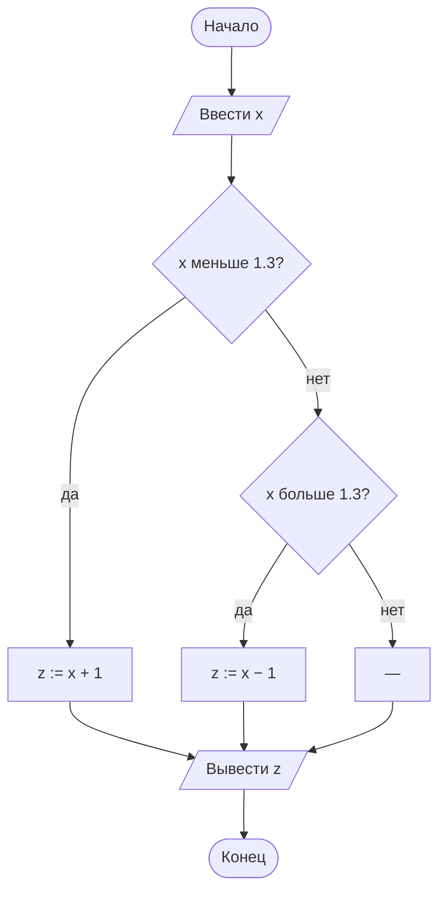

# 03. Задачи. Разветвляющийся алгоритм

> [!abstract] О чём этот набор
> Шесть задач по лекции [[03. Разветвляющийся алгоритм — общий вид]]: ромб на схеме, полная
> и неполная развилка, лестница условий и составные условия. Здесь появляется то, чего не было
> в линейных задачах: **алгоритм выбирает**, по какому пути идти, — а значит, у него есть пути,
> которые надо проверить отдельно.

> [!warning] Что чаще всего ломается в развилке
> 1. **Потерянный случай.** Условия не покрывают все данные: при `x = 1.3` не выполняется
>    ни «x < 1.3», ни «x > 1.3» — и алгоритм ничего не делает.
> 2. **Порядок условий.** Лестница проверок должна идти от самого строгого условия к самому
>    слабому, иначе первое истинное «украдёт» все подходящие случаи.
> 3. **Пустая ветка.** У стрелки нет действия — по схеме непонятно, что делать в этом случае.

---

## Задача 1. Больше, меньше или равно

★☆☆ · полная развилка, три исхода

**Условие.** Вводятся два числа. Нужно вывести одно из трёх сообщений: «первое больше»,
«второе больше», «числа равны».

**Задание.** 1) Нарисуй схему (понадобятся два ромба). 2) Запиши псевдокод. 3) Проверь на парах
`(7, 3)`, `(3, 7)`, `(5, 5)`.

> [!example]- Разбор
> **Схема.** Словами: Начало → ввести a, b → ромб «a больше b?» → да: вывести «первое больше»; нет: ромб «a меньше b?» → да: вывести «второе больше»; нет: вывести «числа равны» → конец.
> ```mermaid
> flowchart TD
>     Start([Начало]) --> In[/Ввести a, b/]
>     In --> R1{"a больше b?"}
>     R1 -->|да| Big[/Вывести «первое больше»/]
>     R1 -->|нет| R2{"a меньше b?"}
>     R2 -->|да| Small[/Вывести «второе больше»/]
>     R2 -->|нет| Same[/Вывести «числа равны»/]
>     Big --> End([Конец])
>     Small --> End
>     Same --> End
> ```
>
> **Псевдокод.**
>
> ```text
> ВВОД a, b
> ЕСЛИ a > b ТО
>     ВЫВОД «первое больше»
> ИНАЧЕ
>     ЕСЛИ a < b ТО
>         ВЫВОД «второе больше»
>     ИНАЧЕ
>         ВЫВОД «числа равны»
> ```
>
> **Проверка.**
>
> | `a` | `b` | Первый ромб | Второй ромб | Вывод |
> |---|---|---|---|---|
> | 7 | 3 | да | не проверяется | первое больше |
> | 3 | 7 | нет | да | второе больше |
> | 5 | 5 | нет | нет | числа равны |
>
> **Что здесь важно:** третий случай (равенство) не надо угадывать — он-то и есть «иначе»
> второго ромба. Случай «всё остальное» в развилке всегда достаётся ветке «нет», и это удобно:
> перечислять все варианты вручную не приходится.

---

## Задача 2. Максимум из трёх чисел

★★☆ · развилка внутри развилки, накопление максимума

**Условие.** Вводятся три числа. Нужно вывести наибольшее из них.

**Задание.** 1) Предложи решение через переменную «максимум». 2) Нарисуй схему и запиши
псевдокод. 3) Проверь на числах `(7, 2, 9)` и `(5, 5, 1)`. 4) Что изменится, если в условии
использовать `≥` вместо `>`?

> [!example]- Разбор
> **1) Идея.** Запомнить первое число как «максимум пока» и последовательно сравнивать с ним
> остальные: если очередное больше — оно и есть новый максимум.
>
> **2) Схема.** Словами: Начало → ввести a, b, c → max := a → ромб «b больше max?» → да: max := b → ромб «c больше max?» → да: max := c → вывести max → конец.
> ```mermaid
> flowchart TD
>     Start([Начало]) --> In[/Ввести a, b, c/]
>     In --> Init["max := a"]
>     Init --> R1{"b больше max?"}
>     R1 -->|да| SetB["max := b"]
>     R1 -->|нет| R2{"c больше max?"}
>     SetB --> R2
>     R2 -->|да| SetC["max := c"]
>     R2 -->|нет| Out[/Вывести max/]
>     SetC --> Out
>     Out --> End([Конец])
> ```
>
> **Псевдокод.**
>
> ```text
> ВВОД a, b, c
> max := a
> ЕСЛИ b > max ТО
>     max := b
> ЕСЛИ c > max ТО
>     max := c
> ВЫВОД max
> ```
>
> **3) Проверка.**
>
> | Данные | После `max := a` | После проверки `b` | После проверки `c` | Вывод |
> |---|---|---|---|---|
> | 7, 2, 9 | 7 | 2 не больше → max = 7 | 9 больше → max = 9 | 9 |
> | 5, 5, 1 | 5 | 5 не больше → max = 5 | 1 не больше → max = 5 | 5 |
>
> Равные значения работают нормально: строгое «больше» не даёт заменить максимум на такое же
> число, но и незачем — ответ от этого не меняется.
>
> **4) Если поставить `≥`.** Ответ будет тем же. Но у нестрогого сравнения появится лишняя
> работа: при равных значениях переменная `max` будет перезаписываться зря. Смысла в этом нет,
> поэтому в задачах на максимум пишут строгое «больше».
>
> **Что здесь важно:** эту же задачу можно решить вложенными ромбами («если a > b, то сравниваем
> a и c, иначе — b и c»). Оба решения верны. Выбирают то, которое проще проверить: с переменной
> «максимум» таблица значений получается короткой, а во вложенных ромбах легко запутаться
> в ветках.

---

## Задача 3. Чётное или нечётное

★☆☆ · условие на остаток от деления

**Условие.** Вводится целое число. Нужно вывести «чётное» или «нечётное».

**Задание.** 1) Запиши условие, по которому число считается чётным, и объясни, что означает
`n mod 2`. 2) Нарисуй схему и запиши псевдокод. 3) Проверь на числах 8, 7 и −6.

> [!example]- Разбор
> **1) Условие.** `n mod 2 = 0`. Запись `mod` — это **остаток от деления**: `7 mod 2 = 1`
> (семь делится на два с остатком один), `8 mod 2 = 0`. Число чётное, когда остаток от деления
> на два равен нулю.
>
> **2) Схема и псевдокод.** Словами: Начало → ввести n → ромб «n mod 2 = 0?» → да: вывести «чётное»; нет: вывести «нечётное» → конец.
> ```mermaid
> flowchart TD
>     Start([Начало]) --> In[/Ввести n/]
>     In --> Check{"n mod 2 = 0?"}
>     Check -->|да| Even[/Вывести «чётное»/]
>     Check -->|нет| Odd[/Вывести «нечётное»/]
>     Even --> End([Конец])
>     Odd --> End
> ```
>
> ```text
> ВВОД n
> ЕСЛИ n mod 2 = 0 ТО
>     ВЫВОД «чётное»
> ИНАЧЕ
>     ВЫВОД «нечётное»
> ```
>
> **3) Проверка.** `8 mod 2 = 0` → чётное. `7 mod 2 = 1` → нечётное. `−6 mod 2 = 0` → чётное:
> знак числа на чётность не влияет.
>
> **Что здесь важно:** проверяй именно «остаток равен нулю», а не «остаток равен единице»:
> у отрицательных чисел остаток в разных языках программирования считается по-разному
> (в одних получится 1, в других −1), а ноль — он и есть ноль. Подробнее про деление и остаток
> — в блоке Б, лекция [[07. Линейный алгоритм]].

---

## Задача 4. Оценка по баллам

★★☆ · лестница условий, порядок проверок

**Условие.** Известно число баллов от 0 до 100. Нужно вывести оценку: 90 и больше — «отлично»,
60 и больше — «хорошо», 40 и больше — «удовлетворительно», меньше 40 — «не сдано».

**Задание.** 1) Запиши лестницу условий. 2) Проверь её на значениях 95, 89, 60, 39. 3) Что
получит студент с 95 баллами, если лестницу начать с условия «балл ≥ 60»? 4) Почему так
происходит?

> [!example]- Разбор
> **1) Лестница.**
>
> ```text
> ВВОД балл
> ЕСЛИ балл >= 90 ТО
>     ВЫВОД «отлично»
> ИНАЧЕ ЕСЛИ балл >= 60 ТО
>     ВЫВОД «хорошо»
> ИНАЧЕ ЕСЛИ балл >= 40 ТО
>     ВЫВОД «удовлетворительно»
> ИНАЧЕ
>     ВЫВОД «не сдано»
> ```
>
> Схема — та же цепочка ромбов: из ветки «нет» каждого ромба выходит следующий ромб, а последняя
> ветка «нет» ведёт прямо к выводу «не сдано».
>
> **2) Проверка.**
>
> | Балл | Какое условие сработало первым | Вывод |
> |---|---|---|
> | 95 | `>= 90` | отлично |
> | 89 | `>= 90` — нет, `>= 60` — да | хорошо |
> | 60 | `>= 90` — нет, `>= 60` — да | хорошо |
> | 39 | ни одно | не сдано |
>
> **3) Если начать с `>= 60`.** Студент с 95 баллами получит «хорошо».
>
> **4) Почему.** В лестнице выполняется **первое истинное** условие, остальные пропускаются.
> Условие `балл >= 60` истинно и для 95 — значит, оно «забирает» себе все значения от 60 и выше,
> и до проверки `>= 90` дело уже не доходит. Поэтому лестницу строят от самого строгого условия
> к самому мягкому.
>
> **Что здесь важно:** порядок проверок в лестнице — часть алгоритма, ровно как порядок шагов
> в линейном алгоритме. Ошибка здесь не ломает программу: она просто выдаёт неверный ответ,
> и заметить её можно только на проверке — например, прогнав схему на 95 баллах.

---

## Задача 5. Составные условия

★★☆ · И, ИЛИ, НЕ

**Условие.** Правила аттракциона «Катапульта»: пускают, если рост **не меньше 140 см** и возраст
**не меньше 12 лет**. Билет со скидкой дают студентам **или** пенсионерам.

**Задание.** 1) Запиши условие допуска через **И** и определи, в каких из четырёх случаев оно
истинно. 2) Запиши условие скидки через **ИЛИ**. 3) Запиши условие «не пускать» через **НЕ**,
а потом перепиши его без НЕ.

> [!example]- Разбор
> **1) Допуск: условие `И`.** «рост ≥ 140 **И** возраст ≥ 12». Оно истинно только тогда, когда
> истинны **оба** простых условия:
>
> | Рост ≥ 140 | Возраст ≥ 12 | Пускают? |
> |---|---|---|
> | да | да | да |
> | да | нет | нет — маленький возраст |
> | нет | да | нет — низкий рост |
> | нет | нет | нет |
>
> **2) Скидка: условие `ИЛИ`.** «студент **ИЛИ** пенсионер» — истинно, если истинно хотя бы одно
> из двух (или оба сразу):
>
> | Студент | Пенсионер | Скидка |
> |---|---|---|
> | да | нет | да |
> | нет | да | да |
> | да | да | да |
> | нет | нет | нет |
>
> **3) «Не пускать».** Через НЕ: `НЕ (рост ≥ 140 И возраст ≥ 12)`. Без НЕ то же самое
> записывается так: `рост < 140 ИЛИ возраст < 12`. Это правило стоит запомнить: отрицание «И»
> превращается в «ИЛИ», а каждое простое условие меняется на противоположное.
>
> **Что здесь важно:** условие с И требует **всех** частей сразу, условие с ИЛИ — любой одной.
> Перепутать их легко, а стоит дорого: аттракцион с условием `ИЛИ` пустит несовершеннолетнего
> высокого роста. Проверка составных условий — таблица, как выше: перебрать все сочетания
> «да/нет» и посмотреть, что получается.

---

## Задача 6. Найди ошибку: потерянный случай

★★☆ · полнота условий, границы

**Условие.** Задача: вычислить `z` по трём правилам — при `x < 1.3` по одной формуле,
при `x = 1.3` по второй, при `x > 1.3` по третьей. В схеме решили обойтись двумя ромбами:



**Задание.** 1) Что выведет схема при `x = 1.3`? 2) Почему такая ошибка опаснее, чем деление
на ноль из задачи про `y = (a + b) / (a − b)`? 3) Исправь схему.

> [!example]- Разбор
> **1) При `x = 1.3`** не выполняется ни первое условие (`x` не меньше 1.3), ни второе (`x`
> не больше 1.3). Управление уходит по ветке «нет» второго ромба — в блок без действия. Дальше
> выводится `z`, но ей ничего не присвоили: значение либо пустое (исполнитель остановится
> с ошибкой), либо осталось от прошлой работы (выведется мусор).
>
> **2) Почему опаснее.** Деление на ноль останавливает работу сразу, и причину видно. Здесь
> ошибка может остаться незамеченной: программа «сработает», ответ будет выглядеть числом —
> просто неверным. Ошибка в границе (значение ровно 1.3) — типичный пропущенный случай.
>
> **3) Как исправить.** Второе условие не должно быть ещё одним строгим сравнением: случай
> «ровно 1.3» надо назвать явно или отдать его ветке «иначе».
>
> ```text
> ВВОД x
> ЕСЛИ x < 1.3 ТО
>     z := x + 1
> ИНАЧЕ ЕСЛИ x = 1.3 ТО
>     z := x * 2
> ИНАЧЕ
>     z := x - 1
> ВЫВОД z
> ```
>
> Заметь: третья ветка стала «иначе» без условия. Так надёжнее — все значения `x` попадают
> ровно в один из трёх случаев, и потеряться уже нечему.
>
> **4) Ещё одна частая ошибка того же рода:** ромб, у которого обе ветки ведут к одному и тому же
> действию. Например, `x > 0?` — и в обеих ветках `y := x * x`. Условие здесь ничего не решает:
> его надо либо убрать (алгоритм линейный), либо сделать действия в ветках разными. Прежде чем
> рисовать ромб, спроси себя: **что изменится** в зависимости от ответа? Если ничего — ромб лишний.
>
> **Что здесь важно:** у развилки должно быть однозначно понятно, куда попадает **любое**
> допустимое значение. Границы проверяют тремя значениями: чуть меньше, ровно на границе,
> чуть больше.

---

# Связи с другими темами

- [[00. Обзор задач блока А]] — чек-лист проверки схемы и шаблон для копирования.
- [[03. Разветвляющийся алгоритм — общий вид]] — теория: условие, неполная и полная развилка,
  лестница, составные условия.
- [[02. Задачи. Линейный алгоритм]] — предыдущий набор: шаги без выбора пути.
- [[04. Задачи. Циклический алгоритм]] — следующий набор: повторение шагов.
- [[08. Разветвляющийся алгоритм]] — те же развилки, записанные кодом на Python.
- [[02_Основы_Алгоритмизации_и_Программирования/00_Курс|00_Курс дисциплины]] — место задач
  в программе курса.
