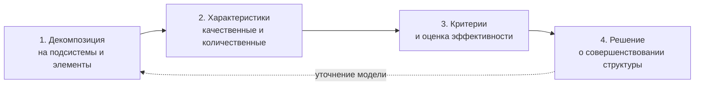
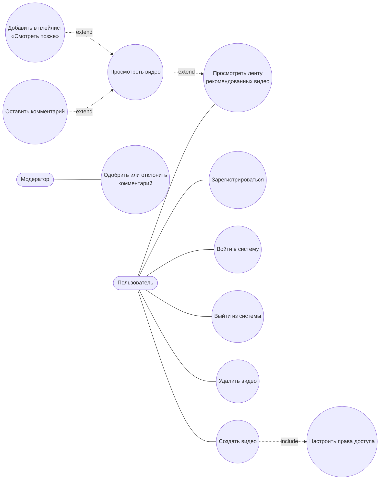
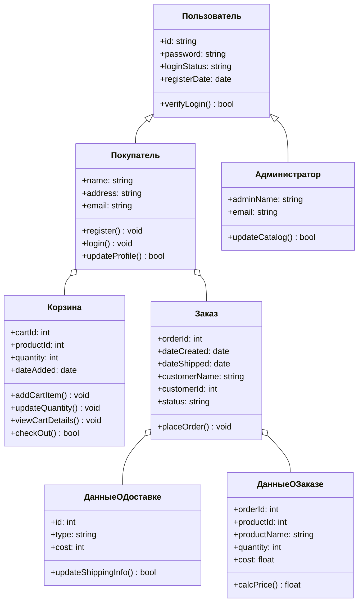

# Роль анализа предметной области в процессе разработки ПО. Основные понятия ООА

> [!abstract] О чём эта лекция
> **Зачем это нужно.** Программа, которая правильно работает, но решает не ту задачу, никому не нужна. Анализ предметной области — первый шаг разработки: он превращает пожелания заказчика в понятную разработчикам модель.
> **Что ты должен уметь после лекции:** объяснить, что такое предметная область и зачем её анализировать; различать операцию, функцию, бизнес-процесс, подпроцесс и бизнес-модель; назвать четыре этапа структурного анализа; определить класс, объект, атрибут, метод; различить ассоциацию, агрегацию, композицию и наследование; перечислить результаты объектно-ориентированного анализа.

# Предметная область и её анализ

**Предметная область** — информация об объектах, процессах и явлениях реального мира, которая, с точки зрения потенциальных пользователей, должна храниться и обрабатываться в разрабатываемой системе. Иначе говоря, это часть реального мира, в которой система будет работать. Для информационной системы это совокупность объектов, чьи свойства и отношения интересны пользователям.

У любой предметной области есть **границы рассмотрения**. При проектировании выделяют информационные объекты внутри границ и отвлекаются от всего, что находится снаружи. Для системы учёта посещений поликлиники важны «ФИО пациента» и «дата визита», но не «цвет куртки пациента».

**Анализ предметной области** (для коммерческой организации — **бизнес-моделирование**) — работа по выяснению настоящих потребностей людей и организаций. Они часто отличаются от того, что пользователи говорят напрямую. Анализ — это **первый шаг** разработки ПО.

## Зачем нужен анализ

В результате анализа разработчики должны:

- научиться понимать **язык**, на котором говорят на предприятии;
- выявить **цели** деятельности пользователей и заказчиков;
- определить набор **задач**, которые они решают, и свойства желаемых результатов;
- выделить **сущности** предметной области и первоначальные требования к функциональности;
- определить **границы проекта**;
- найти места возможных улучшений и оценить последствия решений о реализации той или иной функции;
- снизить риск создать невостребованный или неэффективный продукт.

## С чего начинается работа

Первым шагом при получении запроса на разработку становится определение **целей продукта** и перечня задач, которые он должен решить. Если заказчик сам не может их сформулировать, цели выявляют вместе с ним, например, **анкетированием**. Примеры вопросов заказчику:

- В чём вы видите назначение будущей системы? Какие проблемы она должна решить и какие возможности предоставить?
- Как она должна выглядеть? Известны ли вам аналогичные продукты?
- Система будет единичной или тиражируемой? В каких странах она будет работать?
- Предполагается ли обмен данными с другими существующими продуктами?
- Сколько пользователей будет работать с системой к моменту реализации и в перспективе?
- С какими системами вы работаете и как давно?

## Какие бывают проблемы

Главная проблема в том, что пользователи часто не могут чётко сформулировать требования. Их пожелания бывают **противоречивыми**, **неполными** или содержат профессиональный **жаргон**, непонятный разработчикам. Кроме этого:

1. Нечёткие требования пользователей.
2. Противоречия между требованиями разных заинтересованных сторон (стейкхолдеров).
3. Недостаточное понимание бизнес-процессов разработчиками.
4. Изменение требований в ходе разработки.
5. Неоднозначность терминов и понятий предметной области.
6. Неполнота информации о предметной области.

С этим работают **системные** или **бизнес-аналитики**: они изучают предметную область и передают знания остальным участникам проекта на более понятном разработчикам языке. Место этого этапа в жизненном цикле — раздел «Аналитика» в [[03. Жизненный цикл ПО]].

# Структурный анализ

**Структурный анализ** — метод исследования системы: он начинается с общего обзора, затем детализируется и приобретает иерархическую структуру со всё большим числом уровней. Он основан на двух принципах: **«разделяй и властвуй»** и **иерархической упорядоченности**.

Сложную задачу разбивают на множество меньших независимых задач («чёрных ящиков») и организуют их в древовидную иерархию. Это заметно упрощает понимание сложных систем.

## Разделяй и властвуй

| Шаг | Что делают |
|---|---|
| **Разделяй** | Разбивают сложную систему на подсистемы, каждую — на более мелкие части до элементарных модулей; определяют границы компонентов и их ответственность; работают с частями независимо |
| **Властвуй** | Анализируют и проектируют каждый компонент отдельно; определяют интерфейсы и правила взаимодействия; собирают компоненты в единую систему; проверяют согласованность частей |

## Иерархическая упорядоченность

- Система описывается многоуровневой иерархией: от общего к частному.
- Каждый уровень абстракции скрывает детали нижележащих уровней.
- Верхние уровни описывают систему в целом, нижние — конкретную реализацию.
- Компоненты одного уровня можно менять, не затрагивая другие уровни.

## Ключевые понятия

| Понятие | Определение | Пример |
|---|---|---|
| **Операция** | Элементарное (неделимое в рамках модели) действие, которое выполняется на одном рабочем месте одним исполнителем или системой. Имеет входы и выходы | Ввод данных из накладной; подписание документа; сканирование штрихкода |
| **Функция** | Совокупность операций, сгруппированных по признаку: виду деятельности, подразделению или типу данных. Часто соответствует зоне ответственности одного подразделения или роли | «Обработка заказов»: приём заказа, проверка наличия, резервирование, формирование счёта |
| **Бизнес-процесс** | Связанная совокупность функций, в ходе которой потребляются ресурсы и создаётся продукт (товар, услуга, информация, идея), ценный для потребителя. Есть начало (триггер) и результат, процесс повторяем и измерим | «Продажа товара»: от заявки до доставки и оплаты |
| **Подпроцесс** | Бизнес-процесс, который входит в более крупный процесс и тоже представляет ценность для потребителя | В «Продаже товара»: «Оформление заказа», «Сборка», «Доставка» |
| **Бизнес-модель** | Структурированное (обычно графическое) описание сети процессов и операций и связанных с ними данных, документов, организационных единиц и ресурсов; отражает существующую или планируемую деятельность предприятия | Модель процесса «Продажа товара» в нотации BPMN с ролями, документами и событиями |

Типичная иерархия декомпозиции: **бизнес-процесс → подпроцесс → функция → операция**. Границы между уровнями зависят от целей и глубины модели. Критерий процесса — **ценность для потребителя**: если действие не создаёт ценности для клиента (внутреннего или внешнего), это, как правило, вспомогательная функция или операция.

## Четыре этапа структурного анализа

Структурный анализ выявляет характеристики системы через выделение подсистем и их элементов и определение связей между ними.

**1. Декомпозиция.** Система разбивается на подсистемы и элементы, формируются структуры и их описание. Интернет-магазин делится на каталог, корзину, оформление заказа, оплату, доставку и управление пользователями; каталог — на поиск, фильтры, категории и карточку товара.

**2. Характеристики.** Каждому элементу описывают назначение, функции, входы и выходы, связи, а также измеримые свойства: время, стоимость, объём данных, частоту использования, надёжность. Для модуля «Оформление заказа»: качественно — принимает данные корзины, формирует заказ, передаёт в оплату и доставку; количественно — оформление не дольше 30 секунд, 8 полей формы, вероятность ошибки меньше 1%.

**3. Критерии и оценка.** Выбирают критерии (производительность, стоимость, надёжность, масштабируемость, удобство поддержки) и оценивают структуру: время отклика страницы меньше 2 секунд; стоимость модуля не выше 40 человеко-часов; новый способ оплаты подключается без изменения ядра. Оценка показывает узкие места: например, модуль оплаты слишком тесно связан с остальными.

**4. Решение.** По результатам оставляют структуру, меняют отдельные компоненты или полностью реорганизуют систему. Пример решений: вынести оплату в отдельный сервис, добавить кэширование каталога, сократить форму заказа с 8 до 5 полей.

> [!note] Про числа в примерах
> Значения «30 секунд», «2 секунды», «40 человеко-часов» — иллюстрации из лекции, а не нормативы. Реальные пороги задают вместе с заказчиком в требованиях.

# Объектно-ориентированный анализ и проектирование (ООАП, OOAD)

**ООАП (Object-Oriented Analysis and Design, OOAD)** — методология программной инженерии, которая объединяет два тесно связанных, но разных процесса:

- **объектно-ориентированный анализ (ООА, OOA)** — что находится в предметной области и что система должна делать: выявление объектов, их обязанностей и связей;
- **объектно-ориентированное проектирование (ООД, OOD)** — как это устроено внутри программы: детализация классов и архитектуры.

Методология опирается на принципы объектно-ориентированного программирования (ООП) и служит системным подходом к проектированию и построению программных систем. Сокращение «ООП» относится к программированию, а не к проектированию.

## Основные понятия

| Понятие | Определение | Пример |
|---|---|---|
| **Объект** | Экземпляр сущности из предметной области. Обладает **состоянием** (набором значений атрибутов), **поведением** (операциями) и **индивидуальностью** | Клиент банка: ФИО, номер счёта, баланс; может совершить платёж |
| **Класс** | Шаблон (тип) для создания объектов: описывает общие атрибуты и методы группы объектов | Класс «Клиент банка» задаёт, какие данные и действия есть у любого клиента |
| **Атрибут** | Характеристика объекта (свойство, поле) | `номер_счёта`, `баланс`, `дата_рождения` |
| **Метод (операция)** | Действие, которое объект может выполнить или которое можно выполнить над ним | `пополнить_счёт()`, `сменить_тариф()` |
| **Состояние объекта** | Текущие значения его атрибутов; меняется при вызове методов и внешних событиях | Баланс до и после пополнения |

## Принципы ООАП

- **Инкапсуляция.** Связанные данные и поведение объединены в объекте, детали реализации скрыты. В анализе это выглядит как разделение «интерфейса» (что можно сделать с объектом) и «внутренних правил» (как объект это делает).
- **Абстракция.** Остаются только свойства и действия, значимые для задачи. Для бронирования отеля важны номер и даты заезда и выезда, но не любимый цвет гостя.
- **Модульность и декомпозиция на объекты.** Предметная область разбивается на взаимодействующие объекты, каждый отвечает за свою часть. Это упрощает понимание, тестирование и поддержку.
- **Иерархия и обобщение.** Похожие объекты группируют в общие категории: «Вклад», «Накопительный счёт», «Кредитный счёт» — подтипы общего класса «Счёт». Так строят наследование и переиспользуют код.

## Концепции, специфичные для ООА

**Прецедент (use case)** — описание того, как пользователь или внешняя система взаимодействует с системой для достижения цели. Прецеденты помогают найти объекты и их обязанности: прецедент «Оформить заказ» приводит к объектам «Покупатель», «Корзина», «Заказ». Пример: «Клиент оформляет заявку на кредит».

**Обязанности и распределение ответственности.** В анализе решают, какой объект отвечает за действие или хранение данных: не «система проверяет баланс», а «объект Счёт проверяет свой баланс». Модель становится понятнее и устойчивее к изменениям. Для распределения обычно применяют три ориентира:

- **информационный эксперт** — действие поручают тому объекту, у которого есть нужные данные;
- **низкое сцепление** — как можно меньше зависимостей между объектами;
- **высокая связность** — у каждого объекта чёткая, сосредоточенная ответственность.

## Отношения между объектами

| Отношение | Смысл | Пример |
|---|---|---|
| **Ассоциация** | Объекты «знают» друг о друге и взаимодействуют | «Клиент имеет Счёт» |
| **Агрегация** | «Часть — целое», часть может существовать отдельно от целого | Университет — Студент |
| **Композиция** | «Часть — целое», часть не существует без целого; удаление целого удаляет части. Строже агрегации | Дом — Комната; «Позиция заказа» без «Заказа» |
| **Наследование (обобщение)** | «Является разновидностью» (is-a) | Менеджер — сотрудник; депозитный счёт — счёт |
| **Зависимость** | Временная связь: один объект использует другой, не храня постоянную ссылку | Метод принимает объект другого класса как параметр |

В анализе эти отношения помогают структурировать словарь предметной области.

# Результат объектно-ориентированного анализа

Обычно ООА заканчивается набором моделей:

- **концептуальная модель** предметной области в виде диаграммы классов с классами, атрибутами, методами и связями;
- **диаграмма прецедентов**, которая показывает, кто и что делает с системой;
- **описания сценариев** (текстовые use case): поведение объектов в конкретных ситуациях;
- **диаграммы состояний** — для объектов с выраженным жизненным циклом;
- **диаграммы последовательностей** — для взаимодействия объектов во времени.

Все эти диаграммы — часть языка UML, см. [[03. Язык UML. Использование UML на разных этапах разработки ПО]].

## Пример диаграммы прецедентов

Модель видеосервиса: **актёры** (пользователь, модератор) и их цели. Связь `include` означает, что прецедент всегда содержит другой; `extend` — что прецедент может быть добавлен к другому при определённых условиях.

## Пример диаграммы классов

Модель интернет-магазина: классы с атрибутами и методами, наследование (`Покупатель` и `Администратор` — разновидности `Пользователя`) и отношения «часть — целое».

Как читать: стрелка с пустым треугольником — наследование; ромб на стороне «целого» — агрегация; блок с тремя секциями — класс (имя, атрибуты, методы).

# Жизненный цикл ООАП

1. Сбор требований.
2. Анализ предметной области: выявление объектов и их обязанностей.
3. Проектирование архитектуры и детализация классов.
4. Реализация и тестирование.

**Преимущества ООАП:** лучшее понимание предметной области, более простая поддержка и расширение системы, повторное использование кода.

# Ключевые термины

| Термин | Определение |
|---|---|
| **Предметная область** | Часть реального мира, объекты и процессы которой должна отражать система |
| **Бизнес-моделирование** | Анализ предметной области для коммерческой организации |
| **Структурный анализ** | Иерархическая декомпозиция системы от общего к частному |
| **Операция / функция / бизнес-процесс / подпроцесс** | Уровни декомпозиции деятельности: от неделимого действия до процесса, дающего ценность потребителю |
| **Бизнес-модель** | Структурированное описание процессов, данных, документов и ресурсов предприятия |
| **ООАП (OOAD)** | Методология, объединяющая объектно-ориентированный анализ и проектирование |
| **Объект / класс** | Экземпляр сущности с состоянием, поведением и индивидуальностью / шаблон для создания объектов |
| **Прецедент (use case)** | Сценарий взаимодействия пользователя или внешней системы с системой для достижения цели |
| **Композиция** | Отношение «часть — целое», при котором часть не существует без целого |

# Типичные заблуждения

- ❌ «Анализ — это лишний этап, можно сразу писать код». Ошибка в требованиях, найденная позже, стоит дороже (см. [[03. Жизненный цикл ПО]]).
- ❌ «Заказчик знает, чего хочет, достаточно записать сказанное». Его слова часто неполны, противоречивы и не совпадают с реальными потребностями.
- ❌ «Предметную область нужно описать целиком». Нужны только объекты внутри границ проекта.
- ❌ «ООП и ООД — одно и то же». ООП — программирование; ООД — проектирование.
- ❌ «Агрегация и композиция одинаковы». В композиции часть не живёт без целого.

# Связи с другими темами

- [[03. Жизненный цикл ПО]] — место анализа среди этапов жизненного цикла и участники этапа.
- [[02. Структура CASE-технологии. Структура среды разработки]] — как модели предметной области строят и проверяют в CASE-средствах.
- [[03. Язык UML. Использование UML на разных этапах разработки ПО]] — язык диаграмм, в которых записывают результаты анализа.
- [[01. Введение в технологию разработки ПО]] — роль бизнес-аналитика и продакт-менеджера в команде.
