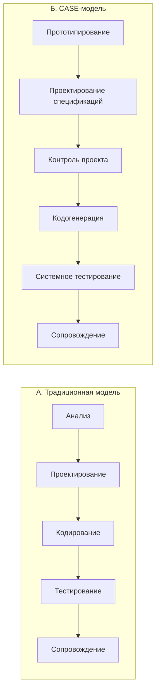
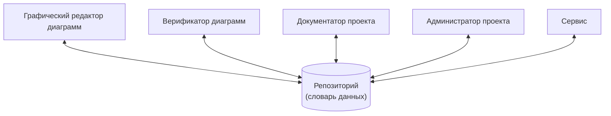
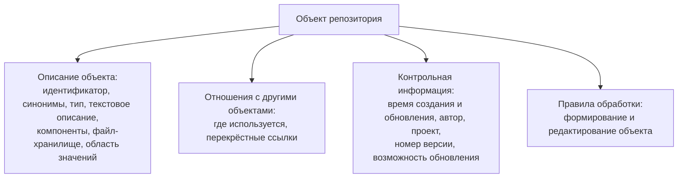
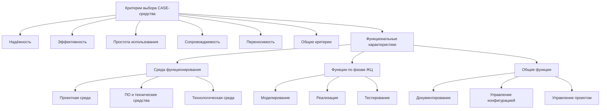

# Структура CASE-технологии. Структура среды разработки

> [!abstract] О чём эта лекция
> **Зачем это нужно.** Большие информационные системы нельзя создавать вручную и в одиночку: слишком дорого ошибаться на ранних этапах, слишком много людей и изменений. CASE-технологии автоматизируют анализ, проектирование и контроль и хранят всю информацию о проекте в общем репозитории.
> **Что ты должен уметь после лекции:** объяснить, зачем нужны CASE-средства и как они меняют распределение трудозатрат; назвать состав и архитектуру CASE-пакета; описать репозиторий и его функции; назвать четыре типа диаграмм и виды контроля ошибок; классифицировать CASE-средства; выбирать средство по критериям.

# Зачем нужен CASE

**CASE (Computer-Aided Software Engineering)** — автоматизированная разработка ПО. К традиционной (канонической) технологии создания информационных систем (ИС) предъявляются такие требования:

1. **Ранние этапы критичны.** Проект делят на стадии: анализ (понять и описать бизнес-логику), проектирование (определить модули и архитектуру), кодирование, тестирование, сопровождение. Исправление ошибки предыдущей стадии обходится примерно **в 10 раз дороже**, чем на текущей. Значит, нужны эффективные средства автоматизации именно анализа и проектирования. Более общий вариант этой идеи — «правило 1:10:100» в [[03. Жизненный цикл ПО]].
2. **Сложную ИС не сделать в одиночку.** Коллективная работа отличается от индивидуальной, нужны средства координации и управления коллективом разработчиков.
3. **Жизненный цикл сравним со сроком эксплуатации.** Компании перестраивают бизнес-процессы примерно раз в два года — примерно столько же занимает создание ИС по традиционной технологии. К сдаче система может оказаться ненужной. Нужен инструмент, который сокращает время разработки и переработки в несколько раз.
4. **Условия меняются в ходе проекта.** Изменения на поздних этапах дороги, поэтому инструменты должны быть гибкими к изменяющимся требованиям.

> [!note] Как читать эти числа
> «В 10 раз дороже» и данные TRW ниже — исторические оценки из литературы 1970–1990-х годов о каскадных проектах. Сам вывод (чем позже найдена ошибка, тем дороже её исправить) подтверждается и сегодня, но конкретные множители в современных короткоцикловых проектах, как правило, меньше и зависят от процесса.

# CASE-модель жизненного цикла

CASE-технологии предлагают подход к жизненному циклу (ЖЦ) на основе автоматизации. При их использовании меняются **все фазы** ЖЦ, сильнее всего — анализ и проектирование. Наиболее автоматизируемые фазы — **контроль проекта** и **кодогенерация**, хотя остальные тоже поддерживаются.

В CASE-модели **прототипирование заменяет традиционный системный анализ**: пользователь видит и оценивает прототип, а не только бумажное описание.

## Трудозатраты по фазам ЖЦ

| Способ разработки | Анализ | Проектирование | Кодирование | Тестирование |
|---|:---:|:---:|:---:|:---:|
| Традиционная разработка | 20% | 15% | 20% | 45% |
| Структурные методологии проектирования | 30% | 30% | 15% | 25% |
| CASE-технологии | 40% | 40% | 5% | 15% |

Во всех строках сумма равна 100%. Вывод: при CASE основной объём работы переходит с кодирования и тестирования на анализ и проектирование.

| Традиционная разработка | Разработка с CASE |
|---|---|
| Основные усилия — на кодирование и тестирование | Основные усилия — на анализ и проектирование |
| «Бумажные» спецификации | Быстрое итеративное прототипирование |
| Ручное кодирование | Автоматическая кодогенерация |
| Ручное документирование | Автоматическая генерация документации |
| Тестирование кодов | Автоматический контроль проекта |
| Сопровождение кодов | Сопровождение спецификаций проектирования |

> [!warning] Что не так с графиком «уменьшение затрат»
> В лекции есть график: по горизонтали объём проекта (число подпрограмм, от 1 до 100 000), по вертикали коэффициент уменьшения стоимости и времени разработки. Линии на графике **падают** с ростом объёма (примерно с 25 до нескольких единиц), а подпись к нему утверждает, что CASE эффективнее всего для систем от 1000 подпрограмм, то есть больших. Эти два утверждения не согласуются, и без исходных данных график однозначно не прочитать. Надёжный вывод один: CASE окупается там, где нужны координация коллектива, общий репозиторий и контроль спецификаций, то есть на крупных проектах.

# Состав CASE-технологий

**CASE-средства** — инструментарий для поддержки и усиления методов анализа и проектирования. Это графически ориентированные инструменты, которые помогают строить и редактировать проект в интерактивном режиме, организовывать его в виде иерархии уровней абстракции и проверять соответствие компонентов. К CASE относят любое ПО, автоматически помогающее в разработке, сопровождении или управлении проектом и обладающее тремя чертами:

- **мощная графика** для описания и документирования системы; освобождает специалиста от второстепенных вопросов;
- **интеграция**: лёгкая передача данных между средствами, управление процессом проектирования через планирование проекта;
- **репозиторий** — компьютерное хранилище всей информации о проекте, общее для разработчиков и основа автоматического получения ПО и его повторного использования.

## Методология, метод, нотация

**Методология** определяет шаги и этапность проекта и правила распределения методов. В рамках методологии CASE-технология включает методы, которые с помощью графической нотации строят диаграммы; их поддерживает инструментальная среда.

| Понятие | Определение | Пример |
|---|---|---|
| **Метод** | Процедура или техника получения описаний компонентов информационной системы | Проектирование потоков и структур данных |
| **Нотация** | Отображение структуры системы, данных и этапов обработки с помощью графических символов, а также описание проекта на формальных и естественных языках | DFD, ERD, IDEF0, UML |
| **Инструментальные средства CASE** | Программы, поддерживающие одну или несколько методологий анализа и проектирования | Пакеты для моделирования данных и процессов |

# Архитектура CASE-средства

Ядро CASE-пакета — **репозиторий**, специализированная база данных проекта. Она отражает состояние проектируемой системы в каждый момент времени. Объекты всех диаграмм синхронизированы через общий **словарь данных**. Вокруг репозитория расположены модули:

Интегрированный CASE-пакет включает **четыре основных компонента**:

| Компонент | Назначение |
|---|---|
| **Централизованное хранение** (репозиторий) | Основа пакета; хранит всю информацию о ПО на протяжении ЖЦ. База должна выдерживать большой объём описаний и надёжно защищать от ошибок и потери данных |
| **Средства ввода** | Ввод данных в репозиторий и взаимодействие с пакетом. Поддерживают разные методологии и работают на всём ЖЦ для разных ролей: аналитиков, проектировщиков, инженеров, администраторов |
| **Средства анализа, проектирования и разработки** | Планирование и анализ описаний и их преобразование при разработке, включая генерацию кода и схем баз данных |
| **Средства вывода** | Документирование, управление проектом и кодовая генерация |

Все компоненты вместе должны: поддерживать **графические модели**, **контролировать ошибки**, **организовывать и поддерживать репозиторий**, **поддерживать процесс проектирования и разработки**.

## Вспомогательные модули

- **Документатор проекта** формирует отчёты о состоянии проекта: по времени, автору, элементам диаграмм, по диаграмме или проекту в целом.
- **Администратор проекта** — инструменты инициализации проекта, задания параметров, назначения и изменения прав доступа к элементам проекта, мониторинга выполнения.
- **Сервис** — системные утилиты обслуживания репозитория: архивация, восстановление данных, создание нового репозитория.

# Репозиторий

**Репозиторий (словарь данных)** — специализированная база данных для хранения, систематизации и управления всей информацией о проектируемой ИС на протяжении её жизненного цикла.

## Задачи репозитория

1. Инкрементный режим при вводе описаний объектов.
2. Распространение нового или исправленного описания на всё информационное пространство проекта.
3. Синхронизация информации от разных пользователей (коллективная работа).
4. Хранение версий проекта и его отдельных компонентов.
5. Сборка любой запрошенной версии.
6. Контроль информации на корректность, полноту и состоятельность.

## Организация и поддержка репозитория

Основные функции средств организации и поддержки репозитория — **хранение, доступ, обновление, анализ и визуализация** всей информации по проекту. В репозитории лежат не только информационные объекты разных типов, но и **отношения между их компонентами**, а также **правила их использования или обработки**. Репозиторий может хранить свыше 100 типов объектов: структурные диаграммы, определения экранов и меню, проекты отчётов, описания данных, логику обработки, модели данных, организационные модели, модели обработки, исходный код, элементы данных.

Каждый объект в репозитории описывается четырьмя группами сведений:

На основе репозитория:

- **интегрируют CASE-средства** и разделяют информацию между разработчиками. Уровни интеграции: общий интерфейс для всех средств, передача данных между ними, единая система представлений фаз ЖЦ, перенос данных и средств между аппаратными платформами;
- **стандартизируют документацию** и проверяют состоятельность спецификаций: все отчёты строятся автоматически из репозитория;
- **управляют проектом**: контролируют безопасность (права доступа), версии и изменения.

## CASE-репозиторий и репозиторий системы контроля версий

Слово «репозиторий» встречается и в лекции про системы контроля версий. Понятия близки, но различаются:

| Признак | Репозиторий CASE | Репозиторий Git |
|---|---|---|
| Что хранит | Объекты модели (диаграммы, элементы данных, спецификации) и **отношения между ними** | Файлы проекта в виде снимков (коммитов), связанных в историю |
| Понимает ли содержимое | Да: знает типы объектов, проверяет полноту и согласованность | Нет: для него файлы — просто текст или двоичные данные |
| Версии | Версии проекта и его компонентов, сборка любой версии | Коммиты, ветки, теги; история восстанавливается по любому коммиту |
| Совместная работа | Синхронизация ввода разных пользователей, блокировка объекта на время правки, права доступа | Каждый разработчик работает с полной копией, изменения объединяются слиянием (merge) |
| Проверки | Автоматический контроль синтаксиса, полноты, балансировки диаграмм | Проверки настраивают отдельно (тесты, CI, ревью) |

Идеи у них общие: единый источник истины, версии, контроль доступа, воспроизводимость. Современный вариант — записывать модели как код (например, Mermaid или PlantUML) и хранить в Git вместе с программой: получается история и ревью диаграмм, но проверки согласованности между моделями приходится обеспечивать отдельно. Устройство Git изнутри — в [[05. Логика и архитектура системы контроля версий]] (дисциплина «Технология разработки ПО»); диаграммы как код — в [[03. Язык UML. Использование UML на разных этапах разработки ПО]].

# Поддержка графических моделей

Графическая ориентация CASE в том, что система описывается схемами и формами, которые проще, чем многостраничные текстовые описания; они же служат наглядной «двумерной» документацией проекта. Существенны **четыре типа диаграмм**:

| Тип | Что моделирует | Как строится | Пример |
|---|---|---|---|
| **DFD** — диаграммы потоков данных (функциональное проектирование) | Процессы преобразования данных, источники и адресаты информации, внешние сущности, хранилища | По результатам структурного анализа, интервью, регламентов. Иерархическая декомпозиция от **контекстной диаграммы** (вся система как один процесс) к диаграммам нижних уровней. Элементы: процессы, внешние сущности, потоки, хранилища | «Обработка заказа»: поток «Данные покупателя» → процесс → хранилище «База товаров» → поток «Чек» |
| **ERD** — «сущность — связь» (моделирование данных) | Информационная структура: сущности, атрибуты, связи | Выделяют сущности, их идентификаторы (первичные ключи), атрибуты, типы связей (1:1, 1:M, M:N), затем приводят модель к нормальным формам | `Студент` связан 1:M с `Оценка` |
| **STD** — диаграммы переходов состояний (моделирование поведения) | Как объект или система меняет состояние под действием событий | Определяют состояния и допустимые переходы; каждому переходу — событие, условие и действие | Банкомат: «Ожидание карты» → «Ввод PIN-кода» при событии «Карта вставлена» |
| **Структурные диаграммы (карты)** | Архитектура ПО: иерархия модулей, порядок вызова, внутримодульная структура | Сверху вниз: от главного управляющего модуля к подчинённым. На связях показывают параметры и управляющие флаги | Дерево вызовов: модули платежей подчинены главному модулю |

Есть и другие диаграммы, но они, как правило, вспомогательные. Их создают **диаграммеры** — графические редакторы. Современные диаграммеры умеют создавать иерархически связанные диаграммы, сочетающие графику и текст; редактировать объекты в любом месте; перемещать, выравнивать и масштабировать группы объектов; сохранять связи при перемещении; автоматически контролировать ошибки. Пользователь думает о проектировании, а не о расположении элементов.

# Контроль ошибок

Контроль ошибок важен на анализе и проектировании: их можно **автоматически найти на ранних этапах**. CASE проверяет проект на полноту и состоятельность до кодирования. Данные фирмы TRW по пяти крупным проектам (исторические, см. замечание выше): при традиционной организации на ошибки проектирования приходится 64% всех ошибок, на ошибки кодирования — 32%; ошибку проектирования на этапе сопровождения найти в **100 раз** труднее, чем на этапе анализа и проектирования спецификаций.

Диаграммеры и верификаторы выполняют такие виды контроля:

| Вид контроля | Что проверяют | Примеры правил |
|---|---|---|
| **Синтаксис диаграмм и типы элементов** (при вводе и редактировании) | Формальные правила построения | У функционального элемента есть хотя бы один входной и один выходной поток; два хранилища не связывают напрямую без процесса |
| **Типы** | Соответствие типов объектов | Функциональный элемент представляет процедурную компоненту; поток данных представлен компонентой данных |
| **Полнота и состоятельность** | Все элементы идентифицированы и отражены в репозитории | Для DFD: неименованные и несвязанные потоки, процессы, хранилища; источники и стоки вне контекстной диаграммы; хранилища на контекстной диаграмме. В словаре данных: циклические и эквивалентные определения, неопределённые объекты |
| **Декомпозиция функций** | Качество разбиения | Оценка по метрикам ПО и частичный семантический контроль |
| **Сквозной контроль (балансировка)** | Согласованность диаграмм одного или разных типов | См. ниже |

## Балансировка диаграмм

- **Вертикальная** (диаграммы одного типа): потоки данных родительской (детализируемой) диаграммы должны совпадать с потоками детализирующей диаграммы нижнего уровня.
- **Горизонтальная** (DFD, ERD, STD, словари данных, мини-спецификации):
  - каждое хранилище данных на DFD соответствует сущности или связи на ERD;
  - каждый управляющий процесс на DFD детализируется диаграммой STD, и наоборот; условие или действие в STD соответствует входному или выходному управляющему потоку на DFD;
  - каждый поток и хранилище определены в словаре данных, и каждое определение из словаря отражено на диаграмме, в мини-спецификации или другом определении;
  - каждый процесс на DFD детализируется либо DFD, либо мини-спецификацией (но не обоими способами сразу); каждая мини-спецификация соответствует единственному процессу;
  - ссылки на данные в мини-спецификациях соответствуют объектам на диаграммах и в словаре; по возможности проверяется семантика: если поток связан с хранилищем, в спецификации есть операции чтения или записи (READ, GET, WRITE, PUT).

# Классификация CASE-средств

Классифицируют по нескольким признакам.

| Признак | Виды |
|---|---|
| **Поддерживаемые методологии проектирования** | Структурно-ориентированные; объектно-ориентированные; комплексно-ориентированные (набор методологий) |
| **Графические нотации** | С фиксированной нотацией; с отдельными нотациями; с наиболее распространёнными нотациями |
| **Степень интегрированности** | **Tools** — отдельные локальные средства; **toolkit** — набор неинтегрированных средств, охватывающих большинство этапов; **workbench** — полностью интегрированные средства с общим репозиторием |
| **Тип и архитектура вычислительной техники** | Ориентированные на персональный компьютер (ПЭВМ); на локальную сеть (ЛВС); на глобальную сеть (ГВС); смешанного типа |
| **Режим коллективной разработки** | Не поддерживающие коллективную разработку; ориентированные на разработку в реальном времени (одновременная работа над проектом); ориентированные на объединение подпроектов (части создают отдельно, затем сводят) |

## Классификация по типам

**Тип** отражает функциональную ориентацию средства в технологическом процессе. Различают три группы (в лекции упомянуты также «категории» и «уровни», но их содержание не раскрыто):

| Тип | Что делают | Что получают на выходе | Примеры из лекции |
|---|---|---|---|
| **Анализ и проектирование** | Создают спецификации системы и проект по известным методологиям | Спецификации компонентов и интерфейсов; «калька» архитектуры; детальный проект с алгоритмами и определениями структур данных | CASE Аналитик, The Developer, Excelerator, POSE, ProKit*Workbench, Design-Aid |
| **Проектирование баз данных и файлов** | Логическое моделирование данных, автоматическое приведение к третьей нормальной форме, генерация схем БД и описаний форматов файлов | Схемы БД, описания форматов | ERwin, Chen Toolkit, S-Designor, Designer2000, Silverrun |
| **Программирование** | Поддерживают программирование и тестирование, кодогенерацию из спецификаций; сюда же входят генераторы кода, анализаторы кода, генераторы тестов, анализаторы покрытия, отладчики | Документированная исполняемая программа | COBOL 2/Workbench, DECASE, NETRON/CAP, APS |

> [!note] Примеры из лекции — исторические
> Перечисленные продукты относятся в основном к 1990-м — началу 2000-х. Часть из них сменила владельцев или снята с поддержки; их текущее состояние не проверялось. Из перечня по сей день выпускается модельер данных ERwin (сегодня **erwin Data Modeler** компании Quest Software, версия 15.2 от 06.01.2026). Современные средства — в разделе «Актуальность» ниже.

# Критерии оценки и выбора CASE-средств

Стратегия выбора зависит от целей проекта и квалификации специалистов. Одно средство редко закрывает все потребности, поэтому обычно применяют **набор средств**: одно для анализа, другое для проектирования. Критерии бывают **числовыми** (например, объём памяти) и **двоичными** (да или нет — например, умеет ли выгружать документацию в PostScript). Набор критериев эксперт выбирает и уточняет под конкретный проект: это критический шаг всего процесса выбора.

## Общие характеристики качества

Лекция подробно раскрывает только функциональные характеристики. Шесть верхних критериев — это характеристики качества ПО в духе стандартов ISO/IEC 9126 и 25010; их расшифровка ниже дана по этим стандартам и не взята из презентации.

| Критерий | Что оценивают | Вопрос при выборе |
|---|---|---|
| **Надёжность** | Способность средства работать без сбоев, не терять данные проекта, восстанавливаться после отказов | Что произойдёт с моделью при аварии? Есть ли резервное копирование репозитория? |
| **Эффективность** | Скорость работы и расход ресурсов при больших моделях | Как ведёт себя средство на модели в тысячи объектов? Сколько памяти нужно? |
| **Простота использования** | Насколько быстро специалист осваивает интерфейс и работает без ошибок | Сколько времени уйдёт на обучение команды? |
| **Сопровождаемость** | Как просто исправлять, обновлять и настраивать само средство | Как часто выходят обновления, есть ли поддержка производителя? |
| **Переносимость** | Работа на разных платформах и возможность перенести проект в другое средство | Есть ли экспорт в стандартные форматы? |
| **Общие критерии** | Внешние условия применения: стоимость и лицензия, документация, обучение, репутация поставщика | Укладывается ли средство в бюджет? Есть ли документация на нужном языке? |

## Функциональные характеристики

**1. Среда функционирования.**

- *Проектная среда:* какие процессы ЖЦ поддерживает средство (анализ требований, проектирование, кодирование, тестирование, оценка, сопровождение, обеспечение качества, управление конфигурацией и проектом), какие области применения (обработка транзакций, системы реального времени, ИС, системы повышенной безопасности) и какого **размера** приложения (ограничения по числу строк кода, уровней вложенности, размеру БД, числу элементов данных и объектов конфигурационного управления).
- *ПО и технические средства:* требуемое оборудование (процессор, оперативная и дисковая память) и поддерживаемое оборудование (например, устройства ввода и вывода); требуемое ПО (операционные системы, графические оболочки) и поддерживаемое ПО.
- *Технологическая среда:* соответствие стандартам (язык, БД, репозиторий, коммуникации, интерфейс, документация, управление конфигурацией, безопасность, обмен информацией); совместимость с другими средствами (обмен данными с текстовыми процессорами, БД, другими CASE; выгрузка репозитория в стандартный формат); поддерживаемые методы (структурный или объектно-ориентированный анализ и проектирование) и языки (программирования, баз данных и запросов, графические, спецификации требований, интерфейсы операционных систем).

**2. Функции, ориентированные на фазы ЖЦ.**

- *Моделирование:* построение диаграмм; графический анализ; ввод и редактирование спецификаций требований и проекта; язык спецификаций (импорт, экспорт, редактирование); моделирование данных и процессов; проектирование архитектуры ПО; **имитационное моделирование** (динамика системы, время отклика, загрузка ресурсов, пропускная способность); **прототипирование** (в основном внешнего интерфейса, с участием пользователей); генерация экранных форм.
- *Реализация:* синтаксически управляемое редактирование кода; **кодогенерация** (код, схемы БД, запросы, экраны и меню); компиляция; конвертация кода между языками; анализ надёжности; **реверсивный инжиниринг** (по готовому коду восстанавливают спецификации); реструктуризация кода; анализ кода (размер, показатели сложности, перекрёстные ссылки, соответствие стандартам); отладка (трассировка, поиск узких мест).
- *Тестирование:* описание тестов (данные, алгоритмы, ожидаемые результаты); запись и воспроизведение действий оператора; автоматический запуск тестов; **регрессионное тестирование** (повтор ранее выполненных тестов, чтобы найти различия); автоматический анализ результатов; анализ **тестового покрытия** (какие операторы, процедуры и переменные выполнялись).

**3. Общие функции.**

- *Документирование:* редактирование текста и графики, работа с формами, возможности издательских систем, гипертекст, соответствие стандартам документирования, автоматическая генерация документации из репозитория.
- *Управление конфигурацией:* контроль доступа и изменений (права, извлечение элемента для правки, блокировка на время изменения, возврат в репозиторий); журнал модификаций; управление версиями; учёт состояния объектов конфигурации; автоматическое построение версий.
- *Управление проектом:* управление работами и ресурсами (задания, исполнители, последовательность, завершённость этапов); плановые и фактические данные (графики, ресурсы, персонал, бюджет); оценка затрат и сроков; управление процедурами тестирования; управление качеством; корректирующие действия (обработка сообщений о проблемах).

Все эти функции поддерживаются посредством репозитория.

# Актуальность: как CASE выглядит сегодня

Термин «CASE» в 2020-х годах используют реже, но идеи живы и распределены по обычным инструментам разработки:

| Идея CASE | Как реализована сегодня |
|---|---|
| Графические модели и диаграммеры | Draw.io, StarUML, Enterprise Architect, Lucidchart; для UML — см. [[03. Язык UML. Использование UML на разных этапах разработки ПО]] |
| Моделирование данных и генерация схем БД | erwin Data Modeler и подобные; в веб-проектах — описание моделей в коде и автоматические миграции схемы |
| Диаграммы как код в репозитории | Mermaid, PlantUML и хранение в Git |
| Кодогенерация | Генераторы по описанию интерфейса и схемы, шаблоны проектов, ИИ-ассистенты (см. [[04. ИИ в разработке ПО]]) |
| Автоматическая документация | Генерация документации из кода и описаний API |
| Общий репозиторий и права доступа | Git-хостинги, системы управления требованиями и задачами |

> [!note] Снимок на 09.2026
> Проверено 29.09.2026: erwin Data Modeler (Quest Software) — версия 15.2 от января 2026. Перечень средств в таблице типов — из лекции, исторический, не проверялся. Перечень современных инструментов — из лекции по UML, отдельно не проверялся. Следующая сверка — **03.2027**.

# Ключевые термины

| Термин | Определение |
|---|---|
| **CASE** | Автоматизированная разработка ПО; инструменты поддержки анализа, проектирования, контроля и управления проектом |
| **Репозиторий (словарь данных)** | База данных проекта: объекты модели, отношения между ними, правила и контрольная информация |
| **Метод / нотация / методология** | Техника построения описаний / графические символы диаграмм / шаги и этапность проекта |
| **Диаграммер** | Графический редактор диаграмм в составе CASE |
| **Верификатор** | Модуль проверки диаграмм на синтаксис, полноту и согласованность |
| **DFD / ERD / STD** | Диаграммы потоков данных / «сущность — связь» / переходов состояний |
| **Балансировка** | Проверка согласованности диаграмм: вертикальная (между уровнями), горизонтальная (между типами) |
| **Кодогенерация** | Автоматическое получение кода из проектных спецификаций |
| **Реверсивный инжиниринг** | Восстановление проектных спецификаций по существующему коду |
| **Tools / toolkit / workbench** | Отдельное средство / набор неинтегрированных средств / полностью интегрированный пакет с общим репозиторием |

# Типичные заблуждения

- ❌ «CASE — это программа, которая сама пишет программы». Кодогенерация — лишь одна из функций; главное — модель проекта и контроль.
- ❌ «CASE ускоряет кодирование». Он сдвигает трудозатраты на анализ и проектирование; кодирование и тестирование сокращаются как следствие.
- ❌ «Репозиторий CASE — то же самое, что репозиторий Git». Первый понимает содержимое и связи между объектами, второй хранит историю файлов.
- ❌ «Одно средство закроет всё». Обычно берут набор средств под разные этапы.
- ❌ «Чем больше функций, тем лучше средство». Критерии выбирают под проект: лишние возможности повышают стоимость и сложность освоения.

# Связи с другими темами

- [[03. Жизненный цикл ПО]] — этапы ЖЦ, которые автоматизирует CASE, и правило удорожания ошибок.
- [[01. Роль анализа предметной области в процессе разработки ПО. Основные понятия ООА]] — что моделируют на этапе анализа перед тем, как вводить модель в CASE.
- [[03. Язык UML. Использование UML на разных этапах разработки ПО]] — нотация, поддерживаемая большинством современных средств.
- [[05. Логика и архитектура системы контроля версий]] — устройство репозитория Git для сравнения с CASE-репозиторием.
- [[04. ИИ в разработке ПО]] — современная автоматизация проектирования и генерации кода.
