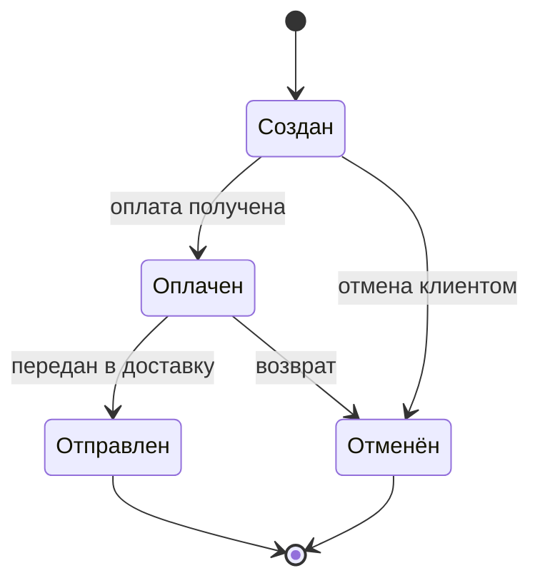
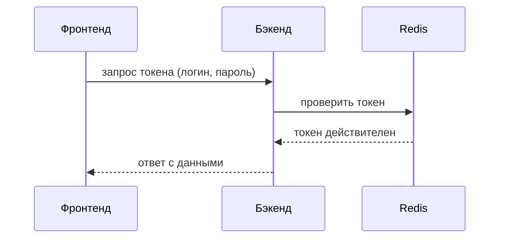

# Язык UML. Использование UML на разных этапах разработки ПО

> [!abstract] О чём эта лекция
> **Зачем это нужно.** Аналитики, разработчики, тестировщики и заказчики должны понимать друг друга без двусмысленностей. UML даёт для этого общий визуальный язык: одну и ту же систему можно описать «чертежами» разного вида.
> **Что ты должен уметь после лекции:** объяснить, что такое UML и чем он не является; назвать две группы диаграмм и приводить примеры; сопоставить типы диаграмм этапам жизненного цикла; выбрать минимальный набор диаграмм под проект; назвать инструменты «визуальные» и «диаграммы как код».

# Что такое UML

**UML (Unified Modeling Language)** — унифицированный язык моделирования. Это **не язык программирования**, а **визуальный язык** для спецификации, визуализации, конструирования и документирования артефактов сложных программных систем.

Зачем он нужен:

- **Единый язык общения.** Разработчики, аналитики, тестировщики и заказчики говорят на одном языке и избегают двусмысленностей.
- **Абстракция.** Можно отвлечься от синтаксиса кода и сосредоточиться на архитектуре и логике.
- **Документирование.** Диаграммы — «чертежи» системы, необходимые для поддержки и масштабирования.

UML стандартизирован консорциумом **OMG (Object Management Group)**. Действующая версия спецификации — **UML 2.5.1**; в ней определены **14 типов диаграмм** двух групп.

## Две группы диаграмм

| Группа | Что показывает | Типы диаграмм |
|---|---|---|
| **Структурные (статические)** | Из чего состоит система | Классов, объектов, компонентов, композитной структуры, пакетов, развёртывания, профилей |
| **Поведенческие (динамические)** | Как система ведёт себя во времени | Вариантов использования (прецедентов), деятельности, состояний, последовательности, коммуникации, обзора взаимодействий, временные диаграммы |

На практике чаще всего используют лишь несколько: классов, последовательности и вариантов использования; далее по ним идут деятельности, состояний, компонентов и развёртывания.

# UML на этапах жизненного цикла

Жизненный цикл ПО условно делят на этапы (подробнее — [[03. Жизненный цикл ПО]]). На каждом из них UML решает свои задачи, и используются разные диаграммы.

| Этап | Задача | Диаграммы |
|---|---|---|
| **1. Сбор и анализ требований** | Понять, *что* должна делать система, и зафиксировать бизнес-процессы | Вариантов использования; деятельности |
| **2. Архитектурное проектирование** | Определить, *как* система устроена на высоком уровне и где физически размещается | Компонентов; развёртывания |
| **3. Детальное проектирование** | Спроектировать внутреннюю структуру кода и базы данных до написания кода | Классов; состояний |
| **4. Кодирование** | Решать точечные проблемы и согласовывать решения в команде | Последовательности |
| **5. Тестирование** | Проверить соответствие требованиям и архитектуре | Деятельности и состояний; последовательности |
| **6. Внедрение и сопровождение** | Развернуть систему и поддерживать её | Развёртывания; классов и компонентов |

## Этап 1. Сбор и анализ требований

- **Диаграмма вариантов использования (Use Case Diagram)** показывает границы системы, **актёров** (пользователей или внешние системы) и их цели. Это основа технического задания и пользовательских историй (User Stories). Пример — диаграмма в [[01. Роль анализа предметной области в процессе разработки ПО. Основные понятия ООА]].
- **Диаграмма деятельности (Activity Diagram)** моделирует бизнес-процессы и алгоритмы: поток управления, ветвления, параллельное выполнение. Похожа на блок-схему, но поддерживает параллелизм и «дорожки» (swimlanes) — кто выполняет шаг.

## Этап 2. Архитектурное проектирование

- **Диаграмма компонентов (Component Diagram)** показывает крупные части системы («микросервис авторизации», «база данных», «шлюз REST API») и интерфейсы между ними.
- **Диаграмма развёртывания (Deployment Diagram)** описывает физическую архитектуру: на каких серверах (узлах) какие компоненты работают. Особенно важна DevOps-инженерам и при настройке облачной инфраструктуры (например, AWS или Kubernetes).

## Этап 3. Детальное проектирование

- **Диаграмма классов (Class Diagram)** — основа объектно-ориентированного проектирования: классы, атрибуты, методы и связи (наследование, ассоциация, композиция, агрегация). Часто служит исходной схемой для реляционной базы данных. Важно: ER-диаграмма — отдельная нотация для моделирования данных (см. [[02. Структура CASE-технологии. Структура среды разработки]]); диаграмма классов может стать отправной точкой для схемы БД, но не заменяет ER-модель.
- **Диаграмма состояний (State Machine Diagram)** показывает жизненный цикл **одного объекта**: например, как заказ переходит из «Создан» в «Оплачен», «Отправлен» или «Отменён». Незаменима для сложных бизнес-сущностей и конечных автоматов.

## Этап 4. Кодирование

На этом этапе UML нужен не «для рисования», а для точечных проблем и общения в команде. Главная диаграмма — **последовательности (Sequence Diagram)**: она показывает взаимодействие объектов во времени. Подходит для проектирования API, вызовов между микросервисами, работы с БД и очередями сообщений (Kafka, RabbitMQ).

Пример: как фронтенд запрашивает токен у бэкенда и как бэкенд проверяет его в Redis.

## Этап 5. Тестирование

- **Диаграммы деятельности и состояний** помогают составлять тест-кейсы и чек-листы. QA-инженер сверяет диаграмму состояний с тестами: учтены ли все переходы, включая негативные сценарии.
- **Диаграмма последовательности** помогает понять, на каком шаге взаимодействия сервисов возник сбой (узкое место или ошибка API). Связь с тестированием — [[07. Тестирование программного обеспечения]] в дисциплине «Технология разработки ПО».

## Этап 6. Внедрение и сопровождение

- **Диаграмма развёртывания** актуализируется и служит картой инфраструктуры для настройки CI/CD, мониторинга и масштабирования.
- **Диаграммы классов и компонентов** служат документацией для **онбординга** — ввода в проект новых разработчиков. Новичку проще изучить «карту» системы, чем читать тысячи строк чужого кода.

# UML в современной разработке

- **«Бюрократический UML» ушёл вместе с каскадной моделью.** Раньше в Waterfall UML использовали для документации на сотни страниц, которая устаревала к моменту релиза.
- **«Agile UML» (whiteboard UML).** Сегодня диаграмму быстро набрасывают на доске или в онлайн-инструменте (Miro, FigJam) во время уточнения задач или архитектурного ревью.
- **Diagram as Code (диаграммы как код).** Диаграмму описывают текстом, который автоматически превращается в картинку. Такие файлы хранят в Git вместе с кодом: они версионируются, сравниваются по изменениям и проходят ревью (см. [[05. Логика и архитектура системы контроля версий]]).

# Инструменты

| Категория | Инструмент | Особенности |
|---|---|---|
| **Визуальные (GUI)** | **Draw.io (diagrams.net)** | Бесплатный, интегрируется с Confluence и Jira |
| | **StarUML** | Стандарт для детального UML-моделирования |
| | **Enterprise Architect (Sparx)** | Тяжёлое корпоративное решение, применяется в банках и госсекторе |
| | **Lucidchart** | Веб-инструмент для совместной работы |
| **Диаграммы как код** | **PlantUML** | Текстовый скрипт; интегрируется с IDE (IntelliJ IDEA, VS Code) |
| | **Mermaid.js** | Де-факто стандарт для Markdown; работает «из коробки» в GitHub, GitLab, Notion, Obsidian, поэтому диаграммы можно вставлять прямо в `README.md` |

Все диаграммы этого конспекта написаны на Mermaid и отображаются в Obsidian.

# Как выбирать диаграммы

UML — не догма: не нужно применять все 14 типов в одном проекте.

| Тип проекта | Достаточно |
|---|---|
| Простой CRUD-сервис | Диаграммы классов (для БД) и последовательности (для API) |
| Распределённая микросервисная архитектура | Развёртывания и компонентов |
| Сложный бизнес-процесс | Деятельности и вариантов использования |

> [!note] Снимок на 09.2026
> Число и состав типов диаграмм (14, две группы) и версия 2.5.1 сверены 29.09.2026 с публичными обзорами стандарта; перечень инструментов взят из лекции преподавателя и отдельно не проверялся. Следующая сверка — **03.2027**.

# Ключевые термины

| Термин | Определение |
|---|---|
| **UML** | Унифицированный визуальный язык моделирования ПО; не язык программирования |
| **OMG** | Консорциум, стандартизирующий UML |
| **Структурная диаграмма** | Показывает статическое устройство системы |
| **Поведенческая диаграмма** | Показывает поведение системы во времени |
| **Актёр** | Пользователь или внешняя система, взаимодействующая с системой |
| **Диаграмма вариантов использования** | Границы системы, актёры и их цели |
| **Диаграмма классов** | Классы, атрибуты, методы и связи между классами |
| **Диаграмма последовательности** | Обмен сообщениями между объектами по времени |
| **Диаграмма состояний** | Состояния одного объекта и переходы между ними |
| **Диаграмма деятельности** | Процесс или алгоритм с ветвлениями и параллелизмом |
| **Диаграмма компонентов / развёртывания** | Логические части системы / их размещение на узлах |
| **Diagram as Code** | Диаграмма, описанная текстом и хранящаяся в репозитории вместе с кодом |

# Типичные заблуждения

- ❌ «UML — язык программирования». Это язык описания; из диаграммы код не запускается сам по себе.
- ❌ «Нужно нарисовать все 14 диаграмм». Выбирают те, что отвечают на вопросы проекта.
- ❌ «UML работает только в каскадной модели». В гибких проектах его используют как быстрый набросок и как диаграммы-код.
- ❌ «Диаграмма классов — то же, что ER-диаграмма». Она описывает классы и их поведение, ER — данные и связи сущностей.
- ❌ «Чем подробнее диаграмма, тем лучше». Слишком подробная схема устаревает и не читается.

# Связи с другими темами

- [[01. Роль анализа предметной области в процессе разработки ПО. Основные понятия ООА]] — примеры диаграмм прецедентов и классов и понятия, которые в них изображают.
- [[02. Структура CASE-технологии. Структура среды разработки]] — программные средства, в которых строят и проверяют диаграммы.
- [[03. Жизненный цикл ПО]] — этапы, к которым привязаны диаграммы.
- [[07. Тестирование программного обеспечения]] — как диаграммы состояний и деятельности превращаются в тест-кейсы.
