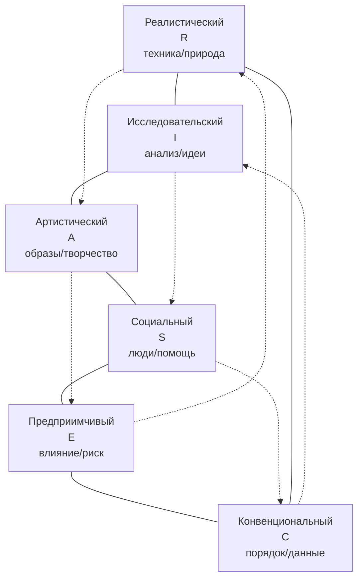

# Типы профессий по Климову Е. А.

> [!abstract] О чём эта лекция
> **Зачем это нужно.** Чтобы осознанно выбирать профессию и понимать, где пригодятся твои интересы, нужно видеть, с чем работает человек: с людьми, природой, техникой, знаками или художественными образами. Классификация Е. А. Климова показывает пять базовых предметов труда и помогает отнести к ним реальные профессии. Типология Дж. Холланда дополняет её учётом типа личности (RIASEC) и объясняет, почему конгруэнтность личности и среды определяет успешность.
> **Что ты должен уметь после лекции:** объяснить, что такое предмет труда; перечислить пять типов по Климову и привести примеры; назвать ограничение классификации и объяснить переход к Холланду; перечислить шесть типов RIASEC, показать их на гексагоне и соотнести с типами Климова на примере.

> [!note] Источник раздела о Холланде
> На паре 04.10.2026 раздаточный материал по Холланду не выдан — был только устный мостик («торговый представитель-винегрет»). Раздел о RIASEC добавлен по проверенным открытым источникам (учебные пособия по психологии труда, обзоры Holland Codes) как дополнение для завершения курса, не выдаётся за диктовку преподавателя. Формулировка примера с пары переписана в академичный вид, оригинал — в примечании.

---

# Предмет труда

**Предмет труда** — объекты целенаправленной деятельности человека, то, что он преобразует, изменяет, обрабатывает.

Климов выделил пять объектов труда:

1. Человек
2. Природа
3. Техника
4. Знаковая система
5. Художественный образ

# Пять типов профессий по Климову

## Человек — человек

К этому типу относятся профессии, направленные на воспитание, обучение, информирование, бытовое, торговое и медицинское обслуживание. Примеры: учителя, врачи, журналисты, парикмахеры, HR-менеджеры, продавцы-консультанты.

## Человек — природа

К этому типу относятся профессии, связанные с сельским хозяйством, лесной отраслью, природоохранной деятельностью, биотехнологиями, метеорологией, геодезией и т. д. Речь идёт о тех профессиях, представители которых непосредственно связаны с природой. Примеры: егеря, садовники, агрономы, ветеринары, экологи.

## Человек — техника

К этому типу относятся все профессии, связанные с обслуживанием техники (ремонт, наладка, установка, управление). Сюда же входят профессии по производству и обработке металлов, их механической сборке и монтажу, а также по сборке и монтажу электрооборудования. В этот же тип включают профессии по обработке и использованию неметаллических изделий, полуфабрикатов, промышленных товаров, а также по переработке продуктов сельского хозяйства. Примеры: инженеры, автомеханики, операторы станков, энергетики.

## Человек — знаковая система

Предмет труда — схемы, знаки, устная и письменная речь, цифры, ноты, формулы, карты, рисунки, дорожные знаки. К этому типу относятся умственные виды деятельности — люди, работающие со знаковыми системами (цифрами, кодами, буквами и прочими символами). Примеры: программисты, бухгалтеры, переводчики, аналитики данных, диспетчеры.

## Человек — художественный образ

Предмет труда — изобразительная, музыкальная, литературно-художественная, актёрская деятельность. Сюда входят различные творческие профессии. Примеры: дизайнеры, музыканты, актёры, художники, архитекторы.

---

# Ограничения типологии Климова и мостик к Холланду

Классификация Климова удобна как первая ориентация, но несовершенна: в реальной жизни одна профессия часто содержит признаки нескольких типов.

> [!example] Академичная переформулировка примера с пары
> Торговый представитель в процессе работы одновременно управляет техникой (водит автомобиль), работает со знаковыми системами (отчёты в Excel), интенсивно общается с людьми (поставщики и клиенты) и может взаимодействовать с природой или проявлять художественные умения на корпоративных мероприятиях. Куда отнести такого «пациента», если он совмещает все пять предметов труда?

> [!note] Оригинал реплики с пары (разговорный)
> «Вот такой винегрет нам предлагают современные реалии. Куда этого пациента будем записывать? ... Во всю глотку горланит песни под гитару (певец доморощенный).» — сохранён для истории, переписан выше в академичный вид.

Вывод: одной предметной оси недостаточно. Эффективность и успешность зависят от того, насколько профессия подходит **типу личности**. Эту линию развивает типология Дж. Холланда.

---

# Типология Дж. Холланда (RIASEC) — краткий разбор по открытым источникам

Американский психолог Джон Холланд (John Holland, 1919–2008) предложил модель, где выбор профессии — это поиск соответствия между **типом личности** и **типом профессиональной среды**. Совпадение (конгруэнтность) предсказывает удовлетворённость и устойчивость.

## Шесть типов личности/среды

| Код | Тип | Коротко: любит / умеет | ←→ Климов (ближайшее) | Примеры профессий (3–4) |
|---|---|---|---|---|
| **R** | **Реалистический** (Realistic) | Работа руками, техника, природа, чёткий результат; избегает «болтовни» | Человек — техника / Человек — природа | Инженер, автомеханик, агроном, пилот |
| **I** | **Исследовательский** (Investigative) | Анализ, идеи, эксперименты, решение интеллектуальных задач | Человек — знаковая система / Человек — природа | Учёный, аналитик, программист-исследователь, врач-диагност |
| **A** | **Артистический** (Artistic) | Творчество, образы, самовыражение, нестандарт | Человек — художественный образ | Дизайнер, музыкант, журналист, архитектор |
| **S** | **Социальный** (Social) | Общение, помощь, обучение, эмпатия | Человек — человек | Учитель, врач, психолог, HR |
| **E** | **Предприимчивый** (Enterprising) | Влияние, руководство, проекты, риск, переговоры | Человек — человек / Человек — знаковая система | Предприниматель, торговый представитель, юрист, менеджер |
| **C** | **Конвенциональный** (Conventional) | Порядок, данные, правила, отчётность, точность | Человек — знаковая система / Человек — техника | Бухгалтер, оператор БД, логист, инспектор |

Каждый человек — комбинация 2–3 ведущих типов (код Холланда, например `SAE`, `RIC`). Профессия тоже имеет код среды.

## Гексагон Холланда

Типы расположены на шестиугольнике в порядке R–I–A–S–E–C. Соседние типы близки, противоположные — далеки. Это помогает оценить совместимость.

> [!note] Как читать схему
> Сплошные рёбра — соседство (высокая совместимость, например R↔I, S↔E). Пунктир — противоположности (R↔S, I↔E, A↔C) — низкая совместимость, выше риск неудовлетворённости.

Диаграмма дублируется файлом `Диаграммы/Холланд_гексагон.drawio.svg` для печати.

## Соотношение с Климовым и идея конгруэнтности

| Климов | Логика | Холланд уточняет |
|---|---|---|
| 5 предметов труда — *с чем* работаешь | Предмет | 6 типов личности — *какой ты* и какая среда тебе подходит |
| Один предмет → условный тип | Классификация | Комбинация RIASEC → профиль |
| «Винегрет» — проблема отнесения | Ограничение | «Винегрет» — норма: у человека и профессии — профиль из 2–3 букв; смотрим совпадение, а не одну клетку |
| — | Прогноз успеха | **Конгруэнтность** (совпадение кодов) → удовлетворённость, устойчивость, меньшая вероятность кризиса карьеры |

> [!tip] Пример конгруэнтности
> Студент с профилем `SA` (социальный + артистический) выбирает между `S`-средой (учитель) и `C`-средой (бухгалтер-операционист). Первая даст высокую конгруэнтность, вторая — низкую и риск кризиса профессиональной карьеры (стагнация, уход в личную жизнь как компенсация). Торговый представитель из примера — типичный `E+S+C` профиль: предприимчивый + социальный + конвенциональный, поэтому и «размазан» по Климову.

> [!warning] Не путай
> Климов отвечает на вопрос *предмет труда*, Холланд — *тип личности и среды*. Используй обе карты вместе, а не вместо друг друга. Код Холланда — ориентир, не ярлык: профиль может меняться с опытом (см. стадии в лекции 01).

---

# Ключевые термины

| Термин | Определение |
|---|---|
| **Предмет труда** | Объект, который человек преобразует в процессе труда |
| **Тип «Человек — человек»** | Профессии, где главный предмет — другой человек |
| **Тип «Человек — природа»** | Профессии с природными/биологическими объектами |
| **Тип «Человек — техника»** | Профессии с техникой и её обслуживанием/производством |
| **Тип «Человек — знаковая система»** | Профессии со знаками, кодами, данными, текстами |
| **Тип «Человек — художественный образ»** | Творческие профессии с художественными образами |
| **Типология Холланда RIASEC** | 6 типов личности/среды (R,I,A,S,E,C), код из 2–3 букв, гексагон совместимости |
| **Конгруэнтность** | Совпадение профиля личности и требований среды; предиктор удовлетворённости |
| **Гексагон Холланда** | Шестиугольник R-I-A-S-E-C: соседи близки, противоположности далеки |
| **Ограничение классификации** | Одна реальная профессия может содержать признаки нескольких типов Климова — нужен учёт личности |

---

# Типичные заблуждения

- ❌ **«Профессию можно однозначно отнести к одному типу Климова».** Реальные обязанности межтипны — это и показывает пример торгового представителя; смотри профиль, а не ярлык.
- ❌ **«Если профессия с компьютером — только “Знаковая система”».** Программист — и «Знаковая система», и «Техника» (железо/сети), и «Человек» (команда).
- ❌ **«Холланд — тест, который навсегда ставит штамп».** Код — срез предпочтений, он может сдвигаться по мере профессионализации (лекция 01, стадии 5–7).
- ❌ **«Климов vs Холланд — что-то одно».** Климов — про предмет, Холланд — про личность/среду; вместе они сильнее.

---

# Связи с другими темами

- [[01. Психология профессиональной деятельности]] — предмет труда и RIASEC-профиль помогают понять выбор на стадиях оптации и подготовки; смена профиля связана с кризисами.
- [[03. Кризисы профессионального самоопределения и способы выхода из них]] — низкая конгруэнтность (S-личность в C-среде) повышает риск кризисов роста/карьеры и актуализации.
- [[02. Командная работа в IT]] — в IT сочетаются типы «Человек — человек / техника / знаковая система»; RIASEC помогает собрать комплементарную команду.
- [[Введение в психологию]] (дисциплина 05) — общие понятия личности, на которые опираются обе типологии.
