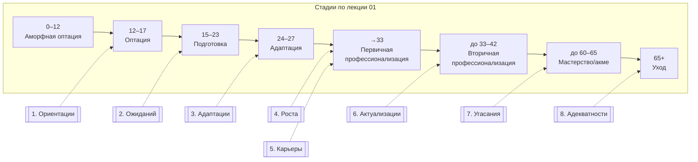
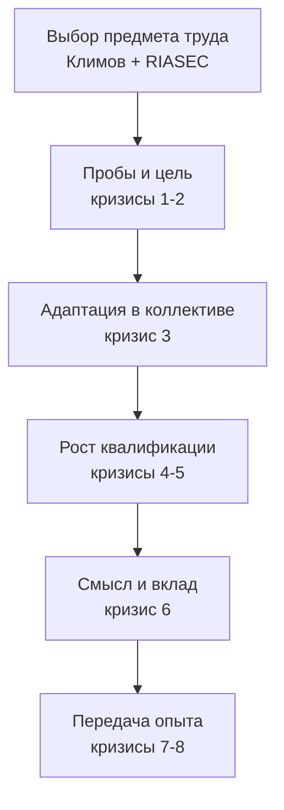

# Кризисы профессионального самоопределения и способы выхода из них

> [!abstract] О чём эта лекция
> **Зачем это нужно.** Стадии профессионального становления (лекция 01) сменяют друг друга не гладко — на переходах возникают нормативные кризисы: напряжение, сомнения, перестройка ведущей деятельности. Знание восьми кризисов помогает отличить ожидаемый переход от «ошибки выбора» и подобрать формы помощи.
> **Что ты должен уметь после лекции:** дать определение каждому из 8 кризисов; назвать возраст/стадию привязки; перечислить ключевые признаки и объяснить, почему кризис возникает; назвать способы выхода и формы работы профконсультанта с примером; показать связь с типами профессий (лекция 02) и стадиями (лекция 01).

> [!note] Источник
> Признаки и способы выхода — запись с пары 30.09.2026. Определения и развернутые пояснения добавлены по учебному пособию Э. Ф. Зеера «Психология профессий» и открытым обзорам кризисов профессионального развития как дополнение для завершения курса. Опечатки из конспекта («мотивы руда» → «мотивы труда», «уход в хобби, семью, быть» → «быт») исправлены. Не выдавать дополнения за диктовку преподавателя.

---

# Карта кризисов на линии жизни

***Как читать:*** кризис 1–3 — молодость и учёба, 4–6 — зрелость и стабилизация, 7–8 — поздняя зрелость и выход. Стрелка пунктиром — кризис на переходе к стадии.

Диаграмма дублируется файлом `Диаграммы/Кризисы_проф_становления.drawio.svg` для печати.

---

# 1. Кризис учебно-профессиональной ориентации

> [!example] Определение
> **Кризис учебно-профессиональной ориентации** — нормативный кризис на пороге выбора профессии (14–17 лет, стадия оптации), когда подросток должен перейти от фантазий к обоснованному выбору учебного маршрута, а Я-концепция ещё не сформирована.

**Когда:** конец оптации (лекция 01, стадия 2). **Почему возникает:** смена ведущей деятельности (игра/учёба → учебно-профессиональная), давление внешней оценки (родители, ЕГЭ), случайные события (переезд, болезнь) ломают намерения.

## Признаки возникновения

1. Неудачное формирование и реализация профессиональных намерений — выбор «за компанию» или по престижу, без пробы сил.
2. Несформированность «Я-концепции», трудности её коррекции — не знаю, что умею и что хочу.
3. Случайные судьбоносные события — травма, переезд, кризис в семье, резко меняющие траекторию.

## Способы выхода, формы работы профконсультанта

1. **Выбор профессионального учебного заведения или другого способа подготовки** — маршрутизация: колледж/вуз, профиль, кружки, стажировки.
2. **Глубокая и систематическая помощь в профессиональном и личностном самоопределении** — профдиагностика (интересы, способности), пробы (проекты, волонтёрство), беседа с семьёй.

> [!tip] Карточка-примера
> 9-классник хочет «в IT, потому что платят», но не пробовал кодить и боится математики. Консультант даёт батарею (Климов + RIASEC), организует 2-недельную пробу на Python и встречу с junior-разработчиком — формируется реалистичная Я-концепция.

---

# 2. Кризис учебно-профессиональных ожиданий

> [!example] Определение
> **Кризис учебно-профессиональных ожиданий** — разочарование в выбранной подготовке на младших курсах (16–20 лет), когда реальное содержание учёбы не совпадает с романтизированными ожиданиями.

**Когда:** профессиональная подготовка (лекция 01, стадия 3, 15–23). **Почему:** перестройка ведущей деятельности (школьная → учебно-профессиональная), смена социально-экономических условий (деньги есть, но «вечно не хватает»), столкновение с рутиной.

## Признаки возникновения

1. Неудовлетворённость профессиональным образованием и подготовкой — «не тому учат».
2. Перестройка ведущей деятельности — нужно учиться самостоятельно, а не «как в школе».
3. Изменение социально-экономических условий — стипендия/подработка дают деньги, но субъективно их мало, растёт тревога.

## Способы выхода

1. Смена мотивов учебной деятельности на практико-ориентированные — проекты, хакатоны, стажировки.
2. Формирование профессиональной идеи/цели — «зачем учу матан, если хочу в GameDev?» → цель связывает объёмы знаний.
3. Коррекция выбора профессии/специальности/специализации — смена профиля без драмы.
4. Удачный выбор научного руководителя и темы — наставник возвращает смысл.

> [!tip] Карточка-примера
> Студент 2 курса разочарован «теорией вместо кода». Перевод в проектную группу с наставником, где он делает пет-проект на Rust, возвращает мотивацию и смысл теории.

---

# 3. Кризис адаптации к социально-профессиональной ситуации

> [!example] Определение
> **Кризис адаптации** — трудности вхождения в профессию и коллектив после выпуска (18–27 лет, стадия адаптации), когда профессиональная деятельность становится ведущей, но опыт «по образцу».

**Когда:** стадия 4 адаптации (24–27 по паре, 18–25 по Зееру). **Почему:** освоение новой социальной роли, разновозрастный коллектив, несовпадение ожиданий и реальности (зарплата, рутина, иерархия).

## Признаки возникновения

1. Трудности адаптации, особенно общение с разновозрастными коллегами.
2. Освоение новой ведущей деятельности — профессиональной.
3. Несовпадение ожиданий и действительности.

## Способы выхода

1. **Активация профессиональных усилий и обозначение верхнего предела возможностей** — честный аудит «что умею / где учусь», план на 3 месяца.
2. **Коррекция мотивов труда и Я-концепции, поиск смысла труда в данной организации** — коучинг, наставничество, прояснение ценностей (в конспекте «мотивы руда» — опечатка, верно «труда»).

> [!tip] Карточка-примера
> Выпускник колледжа теряется среди старших коллег. Наставник даёт задачи «с лесами» — сначала по образцу с ревью, затем самостоятельные, плюс разбор коммуникации в команде.

---

# 4. Кризис профессионального роста

> [!example] Определение
> **Кризис профессионального роста** — неудовлетворённость темпами и потолком роста (25–33 года, первичная профессионализация), когда должность не даёт развития, а сравнение с однокурсниками усиливает тревогу.

**Когда:** первичная профессионализация (становление специалиста). **Почему:** потребность в квалификации сталкивается с семейными/финансовыми ограничениями.

## Признаки возникновения

1. Неудовлетворённость возможностями занимаемой должности.
2. Сравнение успехов с бывшими сокурсниками.
3. Потребность в повышении квалификации.
4. Создание семьи и ухудшение финансовых возможностей.

## Способы выхода

1. Повышение квалификации, в т. ч. за свой счёт — курсы, сертификация.
2. Ориентация на карьеру — вертикаль/горизонталь, roadmap.
3. Смена места работы/должности.
4. Уход в хобби, семью, быт — *в конспекте «быть» — опечатка, верно «быт»* — как временный буфер, не побег.

> [!tip] Карточка-примера
> Разработчик упёрся в потолок «поддержки». План: за 6 месяцев закрыть курс по архитектуре + pet-проект + внутренний переход в команду продукта.

---

# 5. Кризис профессиональной карьеры

> [!example] Определение
> **Кризис профессиональной карьеры** — стагнация после стабилизации (30–40 лет, переход первичная → вторичная профессионализация), когда рост остановился, статус не радует, а личная жизнь становится компенсацией.

**Когда:** стабилизация, вторичная профессионализация до 33–42. **Почему:** исчерпан прежний способ работы, нет новых вызовов.

## Признаки возникновения

1. Стабилизация ситуации, прекращение развития.
2. Неудовлетворённость собой и статусом.
3. Ориентация на личную жизнь как компенсация несостоятельности.

## Способы выхода

1. Переход на новую должность/работу, принятие рискованных предложений.
2. Освоение новой специальности, повышение квалификации.
3. Развитие Я-концепций, переосмысление себя и места в мире — рефлексия, супервизия.

> [!tip] Карточка-примера
> Менеджер 5 лет на одной роли без роста. Решение — переход в продукт с понижением на старте, но с новой траекторией, + коучинг по Я-концепции.

---

# 6. Кризис социально-профессиональной актуализации

> [!example] Определение
> **Кризис социально-профессиональной актуализации** — неудовлетворённость возможностью реализовать себя в сложившейся ситуации (35–45 лет, вторичная профессионализация/мастерство), смена ценностно-смысловой сферы.

**Когда:** зрелость, профессионал. **Почему:** меняются ценности — от «карьеры» к «смыслу/вкладу», прежние достижения обесцениваются.

## Признаки возникновения

1. Неудовлетворённость возможностью реализовать себя.
2. Изменение ценностно-смысловой сферы.

## Способы выхода

1. Переход на инновационный уровень деятельности — новые методы, продукты.
2. Сверхнормативная социально-профессиональная активность, переход на новую должность/работу.
3. Смена профессиональной позиции — наставник, эксперт, предприниматель.

> [!tip] Карточка-примера
> Врач с 15-летним стажем выгорает от рутины — уходит в преподавание и разработку клинических рекомендаций (инновационный уровень).

---

# 7. Кризис угасания профессиональной деятельности

> [!example] Определение
> **Кризис угасания** — предпенсионный переход (55–65 лет, стадия мастерства → уход), ожидание новой социальной роли, сужение поля и здоровья.

**Когда:** стадия 7 (мастерство, до 60–65) и её завершение. **Почему:** психофизиологические изменения, ожидание пенсии, сужение профессиональных контактов.

## Признаки возникновения

1. Ожидание ухода на пенсию и новой социальной роли.
2. Сужение социально-профессионального поля.
3. Психофизиологические изменения и ухудшение здоровья.

## Способы выхода

1. Постепенное повышение активности во внепрофессиональной сфере — хобби, семья, сообщество.
2. Социально-экономическая подготовка к новому виду жизнедеятельности — финансы, быт, здоровье.

> [!tip] Карточка-примера
> Инженер за 2 года до пенсии передаёт знания (наставничество), параллельно осваивает волонтёрство и финансовое планирование.

---

# 8. Кризис социально-психологической адекватности

> [!example] Определение
> **Кризис социально-психологической адекватности** — кризис после выхода из профессии (пожилой возраст, стадия 8), потеря профессиональной идентификации, новая бытовая и социальная реальность.

**Когда:** уход из профессии, пожилой возраст. **Почему:** утрата роли, сужение финансов, старение, «ненужность».

## Признаки возникновения

1. Новый способ жизнедеятельности: больше свободного времени, загруженность домашними заботами.
2. Сужение финансовых возможностей.
3. Социально-психологическое старение.
4. Утрата профессиональной идентификации.
5. Общая неудовлетворённость жизнью.
6. Чувство собственной ненужности.
7. Резкое ухудшение здоровья.

## Способы выхода

1. Организация социально-психологической взаимопомощи пенсионеров — группы поддержки.
2. Вовлечение в общественно-полезную деятельность — наставничество, НКО, клубы.
3. Социально-психологическая активность: «Там, где нет хороших стариков, там нет и хорошей молодёжи» — межпоколенческий обмен.

> [!tip] Карточка-примера
> Пенсионер теряет смысл после увольнения — включение в кружок «Наставник для студентов колледжа» + группа взаимопомощи возвращает идентичность.

---

# Сводная таблица 8 кризисов

| № | Кризис | Стадия/возраст | Ключевые признаки | Выход / работа консультанта |
|---|---|---|---|---|
| 1 | Ориентации | Оптация 14–17 | Неудачные намерения, не «Я», случайности | Выбор маршрута, профдиагностика, пробы |
| 2 | Ожиданий | Подготовка 16–23 | Разочарование учёбой, смена деятельности, деньги | Практика, цель, смена профиля, наставник |
| 3 | Адаптации | Адаптация 18–27 | Трудности с коллективом, новая ведущая деятельность, разрыв ожиданий | Активация усилий, коррекция мотивов труда и Я |
| 4 | Роста | Первичная профессионализация 25–33 | Потолок должности, сравнение, нужна квалификация, семья/деньги | Курсы, карьера, смена работы, быт как буфер |
| 5 | Карьеры | Стабилизация 30–40 | Стоп развития, неудовлетворённость статусом, уход в личное | Новая должность/специальность, Я-концепция |
| 6 | Актуализации | Вторичная/мастерство 35–45 | Нереализованность, смена ценностей | Инновации, сверхнормативная активность, новая позиция |
| 7 | Угасания | Мастерство→уход 55–65 | Ожидание пенсии, сужение поля, здоровье | Внепрофессиональная активность, подготовка к пенсии |
| 8 | Адекватности | Уход 65+ | Свободное время+быт, финансы, старение, утрата идентичности, здоровье | Взаимопомощь, полезная деятельность, активность |

---

# Профилактика и связь с другими лекциями

- **Ранняя профдиагностика и пробы** (Климов + Холланд, лекция 02) снижают кризисы 1–3: конгруэнтность RIASEC уменьшает разрыв ожиданий.
- **Наставничество и проектность** в подготовке (лекция 03) сглаживают переход к адаптации.
- **Непрерывное развитие** и смена позиции (стадии 5–7 лекции 01) — профилактика кризисов 4–6: не ждать стагнации.
- **Подготовка к пенсии заранее** (финансы, хобби, наставничество) — смягчает 7–8.

---

# Ключевые термины

| Термин | Определение |
|---|---|
| **Кризис профессионального самоопределения** | Нормативное напряжение при смене стадии становления (ожидаемо, не провал) |
| **Я-концепция** | Представление о себе и своём месте в профессии; перестраивается в кризисах 1,3,5 |
| **Ведущая деятельность** | Деятельность, определяющая развитие на стадии (учёба → профессия) |
| **Профессиональная адаптация** | Вхождение в коллектив и роль после выпуска |
| **Сверхнормативная активность** | Деятельность выше нормы — инновации, инициативы, наставничество |
| **Социально-психологическая адекватность** | Способность сохранять идентичность и активность после выхода из профессии |
| **Нормативный кризис** | Ожидаемый кризис перехода, в отличие от ненормативного (болезнь, увольнение) |

---

# Типичные заблуждения

- ❌ **«Кризис — значит ошибся с профессией».** Кризисы нормативны; даже при удачном выборе они наступают на переходах.
- ❌ **«Кризис надо переждать».** Без действия (цель, обучение, смена позиции) кризис закрепляется в стагнации.
- ❌ **«Поможет только смена работы».** В арсенале — и повышение квалификации, и Я-концепция, и инновационный уровень, и взаимопомощь.
- ❌ **«После 40 поздно меняться».** Кризисы 5–6 как раз решаются сменой специальности/позиции и дают новый виток.

---

# Связи с другими темами

- [[01. Психология профессиональной деятельности]] — 8 стадий: каждый кризис — переход; сверять без противоречий (возрастные границы условны).
- [[02. Типы профессий по Климову Е. А.]] — низкая конгруэнтность (RIASEC vs среда) усиливает кризисы 4–6.
- [[02. Командная работа в IT]] — кризис адаптации разворачивается в реальном коллективе.
- [[Понятие Общения. Структура Общения]] (дисциплина 05) — коммуникативные трудности — ядро кризиса адаптации.
- [[08. Гибкие методологии — Agile, Scrum, Kanban]] — проф. культура и роли как контекст для кризисов роста/карьеры в IT.
