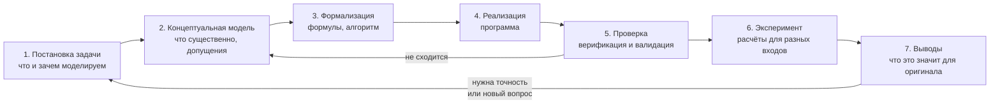

# Основы моделирования

> [!abstract] О чём эта лекция
> В [[01. Введение в предмет|первой лекции]] модель была определена одной фразой; после этого две лекции ушли на консоль и язык C++. Здесь мы возвращаемся к главному слову дисциплины и разбираем его подробно: из чего состоит модель, какими они бывают, как их строят по шагам и, главное, как проверить, что модели можно верить.
>
> **Зачем это нужно.** Программа, которая выдаёт число, ещё ничего не доказывает: число может быть красивым и неверным. Умение отличить «программа работает» от «модель верна» — то, чем моделирование отличается от простого программирования.
>
> **Что ты должен уметь после лекции:** объяснить, что такое модель, оригинал, допущение, входные и выходные данные; привести примеры моделей разных видов; назвать этапы моделирования по порядку; отличить верификацию от валидации; на примере падающего шарика показать, как численная модель сверяется с точной и как ошибка зависит от шага; назвать модели из других дисциплин базы (UML, ЖЦ ПО) и сказать, что в них упрощено.

# Что такое модель

**Оригинал** — то, что мы изучаем: реальный объект, процесс или система (падающий шарик, интернет-магазин, очередь в столовой).

**Модель** — упрощённое представление оригинала, которое сохраняет только свойства, важные для конкретной задачи, и отбрасывает остальные. У модели всегда есть **цель**: карта метро отвечает на вопрос «как доехать», а не «сколько метров между станциями», поэтому на ней нет масштаба.

**Моделирование** — построение модели и исследование оригинала с её помощью. **Анализ** — исследование самой модели: корректна ли она, насколько точна, что происходит в граничных случаях.

Из определения следуют два важных свойства:

- **Упрощение — не недостаток, а суть.** Модель, учитывающая всё, ничем не проще оригинала и бесполезна.
- **Модель верна не «вообще», а для своей цели.** Формула свободного падения годится для стального шарика с высоты 20 м и не годится для пёрышка: цель и допущения разные.

> [!note] Модель и программа
> Программа — реализация модели, но не сама модель. Одну модель можно реализовать на разных языках и разными способами; и наоборот, безупречно работающая программа может реализовывать неверную модель.

# Из чего состоит модель

| Часть | Что это | Пример: падение шарика |
|---|---|---|
| **Входные данные (параметры)** | То, что задаёт пользователь модели | Начальная высота `h0` |
| **Допущения** | Что решили считать несущественным | Нет сопротивления воздуха; ускорение постоянно |
| **Связи (правила)** | Формулы, алгоритмы, логика, по которым вход превращается в выход | Формула пути при равноускоренном движении |
| **Константы** | Числа, которые не меняются | Ускорение свободного падения `g = 9.81 м/с²` |
| **Выходные данные (результаты)** | То, ради чего строилась модель | Время падения |

Допущения — самая важная и самая часто забываемая часть: они определяют, **где** модели можно верить. Запись допущений вместе с моделью — обязательная привычка.

# Виды моделей

Одну и ту же модель можно классифицировать по разным признакам.

| Признак | Виды | Пример |
|---|---|---|
| **Форма** | материальные (макет, чучело); абстрактные: словесные, графические (схемы, диаграммы), математические (формулы), компьютерные (программы) | Глобус — материальная; диаграмма классов UML — графическая; `S = 4πR²` — математическая |
| **Изменение во времени** | **статические** описывают состояние «на момент»; **динамические** описывают, как система меняется | Формула объёма шара — статическая; падение шарика — динамическая |
| **Случайность** | **детерминированные**: один и тот же вход всегда даёт один и тот же выход; **стохастические**: в модель включена случайность | Площадь шара по радиусу — детерминированная; длина очереди в столовой — стохастическая |
| **Время в модели** | **непрерывные** (величины меняются плавно); **дискретные** (меняются скачками, шагами) | Формула пути от времени — непрерывная; пошаговый расчёт на компьютере — дискретный |

> [!tip] Как пользоваться таблицей
> Задача «описать модель» всегда решается перебором признаков: в какой форме? Статическая или динамическая? Случайности нет? Время плавное или по шагам? Так модель из «вроде бы понятно» превращается в точное описание.

**Компьютерная (имитационная) модель** воспроизводит поведение системы шаг за шагом во времени: программа «проигрывает» процесс, а мы наблюдаем результат. Компьютер всегда работает шагами, поэтому любая непрерывная величина на нём становится дискретной; отсюда возникает погрешность, которая разобрана в примере ниже.

# Этапы моделирования

Построение модели — это цикл, а не прямая линия:



| Этап | Вопрос, на который он отвечает |
|---|---|
| **1. Постановка задачи** | Что нужно узнать и зачем? Какая точность приемлема? |
| **2. Концептуальная модель** | Какие свойства оригинала существенны, а какие отбросить? Какие допущения принять? |
| **3. Формализация** | Какими формулами или правилами описать связи? Что вход, что выход? |
| **4. Реализация** | Как записать это программой? (На этом этапе нужны C++ и функции из лекций [[02. Основы C++|02]] и [[03. Функции в C++|03]].) |
| **5. Проверка** | Правильно ли реализована модель и верна ли она для цели? |
| **6. Эксперимент** | Что будет при других входных данных, какие граничные случаи? |
| **7. Выводы** | Что результаты говорят об оригинале и где заканчивается их применимость? |

Стрелка «не сходится» на схеме — самое важное: если проверка провалилась, чинят не программу, а модель или допущения.

# Пример: время падения шарика

**Задача.** Узнать, за сколько секунд шарик упадёт с высоты `h0` метров.

**Допущения.** Нет сопротивления воздуха; ускорение `g = 9.81 м/с²` постоянно; начальная скорость равна нулю.

Построим две модели одной задачи и сравним их.

**Модель 1 — точная (аналитическая).** Путь при равноускоренном движении: `h0 = g·t² / 2`. Отсюда `t = √(2·h0 / g)`. Считается одной формулой и одной функцией.

**Модель 2 — пошаговая (численная).** Не пользуемся готовой формулой: двигаем шарик маленькими шагами `dt` секунд. За каждый шаг он опускается на `v·dt` метров, а его скорость растёт на `g·dt`. Повторяем, пока шарик не достигнет земли, и считаем шаги. Это простейший **метод Эйлера**; идея «пересчитывать величины шаг за шагом» лежит в основе многих имитационных моделей, где точной формулы нет.

```cpp
#include <iostream>
#include <iomanip>   // std::setprecision — число знаков при выводе
#include <cmath>     // std::sqrt

const double g = 9.81;   // ускорение свободного падения, м/с²

// Точная модель: время падения с высоты h0 (м) без сопротивления воздуха.
double fallTimeExact(double h0) {
    return std::sqrt(2 * h0 / g);
}

// Пошаговая модель: двигаем шарик шагами dt, пока он не достигнет земли.
double fallTimeEuler(double h0, double dt) {
    double h = h0;   // текущая высота, м
    double v = 0;    // текущая скорость вниз, м/с
    double t = 0;    // прошедшее время, с
    while (h > 0) {          // цикл while: повторять, пока шарик выше земли
        h = h - v * dt;      // за время dt он опустился на v * dt
        v = v + g * dt;      // за время dt его скорость выросла на g * dt
        t = t + dt;          // время идёт
    }
    return t;
}

// Печатает результат пошаговой модели и её отличие от точной.
void report(double h0, double dt) {
    double exact = fallTimeExact(h0);
    double t = fallTimeEuler(h0, dt);
    std::cout << "dt = " << dt << " с:  t = " << t << " с,  ошибка = " << t - exact << " с\n";
}

int main() {
    std::cout << std::fixed << std::setprecision(4);   // всегда 4 знака после запятой

    std::cout << "Высота 20 м, точное время: " << fallTimeExact(20) << " с\n";
    report(20, 0.1);
    report(20, 0.01);
    report(20, 0.001);

    std::cout << "\nГраничные случаи (точная / численная при dt = 0.01):\n";
    std::cout << "h0 =  0 м:  " << fallTimeExact(0)  << " / " << fallTimeEuler(0, 0.01)  << "\n";
    std::cout << "h0 =  1 м:  " << fallTimeExact(1)  << " / " << fallTimeEuler(1, 0.01)  << "\n";
    std::cout << "h0 = -5 м:  " << fallTimeExact(-5) << " / " << fallTimeEuler(-5, 0.01) << "\n";
    return 0;
}
```

Цикл `while` в C++ работает так же, как в Python: пока условие в скобках истинно, тело выполняется снова (Python-версия — в лекции [[10. Циклический алгоритм - цикл while]]). Всё остальное в программе — из лекций 02 и 03.

Результат (компиляция `g++ -std=c++20 -Wall -Wextra`, g++ 12.2 на Linux):

```text
Высота 20 м, точное время: 2.0193 с
dt = 0.1000 с:  t = 2.1000 с,  ошибка = 0.0807 с
dt = 0.0100 с:  t = 2.0300 с,  ошибка = 0.0107 с
dt = 0.0010 с:  t = 2.0200 с,  ошибка = 0.0007 с

Граничные случаи (точная / численная при dt = 0.01):
h0 =  0 м:  0.0000 / 0.0000
h0 =  1 м:  0.4515 / 0.4600
h0 = -5 м:  -nan / 0.0000
```

## Что показывает этот запуск

1. **Численная модель приближается к точной, когда шаг уменьшается.** Шаг 0.1 с даёт ошибку 0.0807 с, шаг 0.001 с — 0.0007 с. Измельчая шаг, точность покупают временем счёта: при `dt = 0.001` цикл делает 2020 повторов вместо 21 при `dt = 0.1`.
2. **Ошибка не равна нулю никогда.** Пошаговая модель считает время кратным `dt`: она не может остановиться между шагами. Погрешность метода — цена компьютерной дискретности.
3. **Граничные случаи вскрывают дефекты.** Для `h0 = -5` (отрицательная высота — бессмыслица) точная формула вернула `-nan` («не число»: корень из отрицательного), а пошаговая молча вернула `0.0000` как будто всё в порядке. Ни одна модель не сказала «на вход подана ерунда». Значит, входные данные нужно проверять явно (`if (h0 < 0)` — отказ с сообщением): это часть модели, а не мелочь.
4. Запись `-nan` зависит от платформы: g++ на Linux печатает `-nan`, другие компиляторы могут печатать иначе. Суть одна — результат не является числом.

# Проверка модели

Проверка — этап, на котором чаще всего экономят, и напрасно. Различают два вопроса:

| Вопрос | Название | Как проверяют | Пример из лекции |
|---|---|---|---|
| **Правильно ли построена модель?** Соответствует ли программа своему описанию | **Верификация** | Сравнение с известным точным решением, контрольные значения, разбор по шагам | Пошаговая модель сверена с формулой: ошибка падает вместе с шагом |
| **Та ли это модель?** Соответствует ли она оригиналу и цели | **Валидация** | Сравнение с измерением или наблюдением в реальности | Секундомер: упадёт ли стальной шарик с 20 м за ≈2 с? А пёрышко? |

Верификацию можно сделать за письменным столом, валидация требует данных из реального мира. Пройти одну без другой недостаточно: программа может безупречно считать модель, которая не описывает оригинал.

Три приёма, которыми пользуются постоянно:

- **Контрольные значения.** Заранее известный ответ для простого входа: шар радиуса 1 — площадь ≈ 12.566, объём ≈ 4.189 (как в [[03. Функции в C++#Разбор программы «площадь и объём шара»|программе про шар]]).
- **Граничные случаи.** Нуль, очень большое значение, отрицательное, пустой ввод. Приём тот же, что в тестировании ПО — [[07. Тестирование программного обеспечения#Анализ граничных значений|анализ граничных значений]] (дисциплина «Технология разработки ПО»).
- **Сравнение двух моделей одной задачи.** Если простая и сложная модели расходятся сильнее, чем допустимо, ошибка в одной из них, как в примере выше.

**Вычислительный эксперимент** — серия запусков модели с разными входными данными, чтобы выяснить, как результат зависит от параметров. В примере это было три значения шага `dt`; в реальных задачах — десятки и сотни запусков. Результаты эксперимента обычно смотрят на графиках; средства для расчётов и графиков на Python — курсы [[00. NumPy]] и [[00. Matplotlib]].

# Модели в разработке ПО

Слово «модель» встречается не только в расчётах. Почти всё, что описывает ПО до написания кода, — тоже модели: у них есть оригинал, цель и допущения.

| Модель | Оригинал | Что упрощено | Где разобрано |
|---|---|---|---|
| **Модель предметной области, бизнес-модель** | Работа организации, которую автоматизируют | Оставлены объекты и процессы, важные для системы | [[01. Роль анализа предметной области в процессе разработки ПО. Основные понятия ООА]] |
| **Диаграммы UML** | Устройство и поведение будущей системы | Показан один аспект (структура, порядок сообщений, состояния) | [[03. Язык UML. Использование UML на разных этапах разработки ПО]] |
| **Модель жизненного цикла** | Процесс разработки программы (каскад, V-модель, гибкие подходы) | Оставлены этапы и порядок работ, отброшены детали конкретной команды | [[03. Жизненный цикл ПО#Модели жизненного цикла\|модели жизненного цикла]] |
| **Вычислительная модель** | Физический, экономический или иной процесс | Учтены существенные величины и законы | Эта лекция |

Для всех действует один и тот же вывод: у модели есть цель и допущения, и вне них ей верить нельзя. Проверка модели предметной области — согласование с заказчиком, проверка UML — сверка с требованиями, проверка вычислительной модели — верификация и валидация.

---

# Ключевые термины

| Термин | Определение |
|---|---|
| Оригинал | Реальный объект, процесс или система, которые изучают с помощью модели |
| Модель | Упрощённое представление оригинала, сохраняющее свойства, важные для цели |
| Моделирование | Построение модели и исследование оригинала с её помощью |
| Допущение | Условие, которым упрощают оригинал при построении модели; определяет границы применимости |
| Входные данные (параметры) | Величины, которые задаёт пользователь модели |
| Выходные данные | Результаты, ради которых модель построена |
| Статическая / динамическая модель | Описывает состояние «на момент» / описывает изменение во времени |
| Детерминированная / стохастическая модель | Один вход даёт один выход / в модель включена случайность |
| Непрерывная / дискретная модель | Величины меняются плавно / шагами |
| Имитационная модель | Компьютерная модель, воспроизводящая поведение системы шаг за шагом |
| Метод Эйлера | Простейший пошаговый способ численного расчёта: на каждом шаге величины пересчитываются по скорости их изменения |
| Шаг (`dt`) | Промежуток времени, на который продвигается пошаговая модель за один повтор цикла |
| Погрешность | Отличие результата модели от точного решения |
| Верификация | Проверка того, что модель построена правильно: программа соответствует описанию |
| Валидация | Проверка того, что построена нужная модель: она соответствует оригиналу и цели |
| Вычислительный эксперимент | Серия запусков модели с разными входными данными |

---

# Типичные заблуждения

- ❌ «Чем подробнее модель, тем она лучше». Лишние детали делают модель дорогой и запутанной; ценность модели — в разумном упрощении под цель.
- ❌ «Программа запустилась и выдала число — значит, модель верна». Программа может считать неверную модель или неверно считать верную; для этого и нужны верификация и валидация.
- ❌ «Модель верна вообще». Она верна для своей цели и в границах допущений: формула падения без воздуха неверна для пёрышка.
- ❌ «Численный результат должен совпадать с формулой точно». Пошаговая модель всегда даёт погрешность; важно, что она уменьшается вместе с шагом и укладывается в допустимую.
- ❌ «Шаг надо брать как можно меньше». Уменьшение шага улучшает точность, но растит время счёта; выбирают компромисс под требуемую точность.
- ❌ «Модель — это только формулы и программы». Диаграмма UML, схема процесса и модель жизненного цикла — тоже модели.

---

# Связи с другими темами

- [[01. Введение в предмет]] — первое определение модели и анализа, среда курса.
- [[02. Основы C++]] и [[03. Функции в C++]] — язык и функции, на которых реализована модель в примере.
- [[06_Моделирование_и_Анализ_ПО/00_Курс|00_Курс]] — оглавление и порядок прохождения.
- [[03. Язык UML. Использование UML на разных этапах разработки ПО]] и [[01. Роль анализа предметной области в процессе разработки ПО. Основные понятия ООА]] (Написание кода ИС) — модели ПО: что они упрощают и на каких этапах используются.
- [[03. Жизненный цикл ПО]] и [[07. Тестирование программного обеспечения]] (Технология разработки ПО) — модели процесса разработки и проверка по граничным значениям.
- [[10. Циклический алгоритм - цикл while]] (Основы алгоритмизации) — цикл `while` в Python, на котором построена пошаговая модель.
