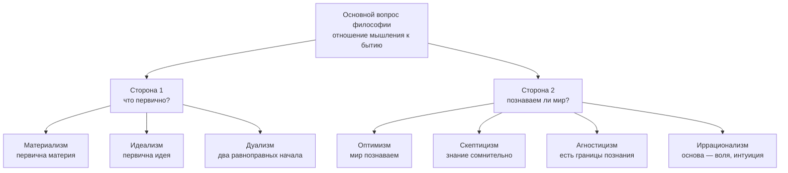
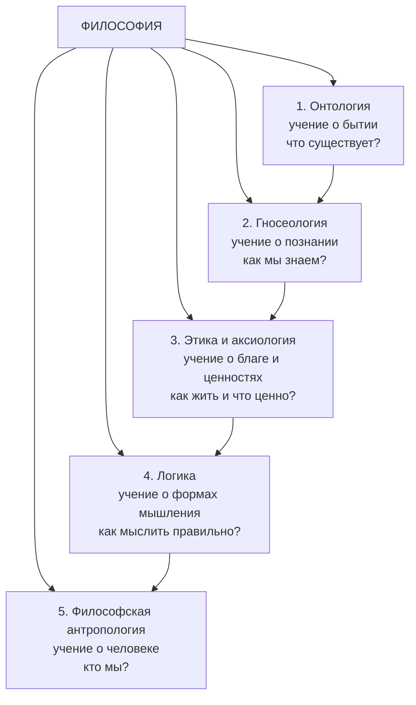

# Основные задачи и особенности философии

> [!abstract] Цель и задачи лекции
> **Цель:** сформировать представление о философии как об особом способе освоения мира: показать её происхождение, предмет, роли, особенности, функции и структуру философского знания (основные разделы).
> **Задачи:**
> 1. раскрыть смысл термина «философия» и три понимания философии;
> 2. определить предмет философии и разобрать основной вопрос философии с двумя его сторонами;
> 3. объяснить три роли философии (методологическая, ценностная, мировоззренческая);
> 4. раскрыть четыре особенности философии и показать их следствия;
> 5. разобрать пять функций философии на конкретных примерах;
> 6. дать карту разделов философии и научиться определять, к какому разделу относится вопрос.
>
> *Пояснение для начинающих (для чайника):* представь, что знание — это город. Физика знает одну улицу, биология — другую, программирование — свой квартал. Философия не владеет ни одной улицей: она держит **карту всего города** и спрашивает «куда ведут эти улицы и зачем вообще этот город построили». Поэтому философские вопросы не «сложнее» других — они **про целое, а не про часть**: не «как работает этот код», а «что считать правильным решением»; не «как устроен мозг», а «что такое человек».

> [!note] Как устроена лекция
> Разделы 1–2 дают язык (термины, предмет, основной вопрос), разделы 3–5 — «зачем философия нужна» (роли, особенности, функции), раздел 6 — карту знания (разделы), разделы 7–9 — инструменты самостоятельной работы. Для повторения перед зачётом достаточно разделов 1, 3, 5, 6 и «Ключевых терминов».

---

# 1. Что такое философия: происхождение термина и три понимания

## 1.1 Происхождение термина

Слово **философия** образовано от двух древнегреческих корней: **φιλέω (филе́о)** — «люблю» и **σοφία (софи́я)** — «мудрость». Дословно — **«любовь к мудрости»**, «стремление к мудрости».

По преданию, сохранившемуся у римского автора **Марка Туллия Цицерона** («Тускуланские беседы», I в. до н. э.), слово ввёл **Пифагор** (VI в. до н. э.). Смысл его жеста принципиален: на вопрос, кто он, Пифагор ответил, что он не мудрец (**софос**), а лишь любитель мудрости (**философос**), потому что мудрость принадлежит богам, а человеку доступно только стремление к ней.

Из этого следует первая и главная черта философии: **философ — не владелец истины, а тот, кто её ищет.** Философское знание не заканчивается «окончательным ответом», оно живёт в поиске и споре.

> [!tip] Аналогия для понимания
> Врач не «владелец здоровья» — он его ищет, восстанавливает, защищает. Философ так же относится к мудрости: не хранит её как готовый набор формул, а каждый раз добирается до неё заново — через вопрос, аргумент и критику.

## 1.2 Три понимания философии

В учебной традиции философию определяют **тремя способами**. Это не три разных предмета, а три взгляда на один и тот же предмет — как три проекции одного тела.

### Понимание 1. Философия как любовь к мудрости

Философия — особый **способ отношения к миру**: удивление, вопрос, готовность сомневаться и проверять основания. Древние говорили: философия начинается с **удивления** (Платон, «Теэтет») и с **сомнения** (Рене Декарт, XVII в.).

- **Ключевой вопрос:** что вообще достойно быть названным знанием?
- **Что даёт:** привычку не принимать на веру ни чужое мнение, ни собственное.

### Понимание 2. Философия как теоретическая форма мировоззрения

**Мировоззрение** — система представлений человека о мире и о своём месте в нём, включающая знания, ценности, идеалы и установки поведения. Оно есть у каждого человека, даже если он никогда не открывал философскую книгу: складывается стихийно — из семьи, культуры, опыта, новостей.

Философия — это мировоззрение, доведённое до **теоретического** уровня: понятия определены, утверждения связаны в систему, выводы обоснованы, а не просто провозглашены.

- **Ключевой вопрос:** как устроен мир и каково моё место в нём — но не «как я это чувствую», а «на каком основании я так считаю».
- **Что даёт:** осознанный, а не стихийный выбор системы ценностей.

### Понимание 3. Философия как наука о всеобщем

Философия рассматривается как **наука о всеобщих законах** природы, общества и человеческого мышления. Она оперирует **категориями** — предельно общими понятиями: бытие, материя, сознание, причина, сущность, необходимость, свобода, истина, добро.

- **Ключевой вопрос:** что верно обо всём существующем, а не только о конкретной области.
- **Что даёт:** язык и понятийный аппарат, которым пользуются все частные науки.

### Сводная таблица трёх пониманий

| Понимание | Короткая формула | Главный вопрос | Что даёт человеку | Где «слабое место» |
|---|---|---|---|---|
| Любовь к мудрости | способ отношения к миру | что достойно называться знанием? | привычка проверять основания | легко превращается в «вечный вопрос без ответа» |
| Теоретическое мировоззрение | система взглядов на мир и себя | каково моё место в мире и на каком основании? | осознанный выбор ценностей | риск подменить обоснование декларацией |
| Наука о всеобщем | учение о предельно общих законах | что верно обо всём существующем? | понятийный аппарат для наук | спорно, «наука» ли это в строгом смысле |

## 1.3 Чем философия отличается от мифа, религии и науки

Чтобы понять специфику философии, её удобно сравнить с тремя другими способами объяснения мира.

| Критерий | Миф | Религия | Наука | Философия |
|---|---|---|---|---|
| Основа | образ, символ, повествование | вера и откровение | опыт и эксперимент | рациональный аргумент |
| Отношение к сомнению | сомнение не предполагается | сомнение преодолевается верой | сомнение — рабочий инструмент | сомнение — рабочая норма |
| Предмет | происхождение мира и родовых норм | отношение человека к высшему | отдельная область реальности | мир в целом и отношение «человек — мир» |
| Способ обоснования | «так рассказывали предки» | авторитет священного текста | повторяемая проверка | логическая связь оснований и выводов |
| Результат | картина мира и ритуал | спасение, смысл, община | проверяемое знание | обоснованное понимание и критерии ценностей |
| Ответ на вопрос «как жить» | через обычай рода | через заповедь | не отвечает (описывает, как есть) | через обоснование ценностей |

> [!example] Разбор на одном вопросе
> Вопрос «откуда взялся мир?»
> - **Миф:** «мир родился из хаоса, боги разделили небо и землю» — образно, но без обоснования.
> - **Религия:** «мир сотворён Богом» — опора на откровение и веру.
> - **Наука (космология):** «ранняя Вселенная описывается моделью горячего Большого взрыва» — проверяемые данные и границы применимости.
> - **Философия:** «что значит “возникнуть”? нужно ли миру основание вне его самого? что вообще означает “быть”?» — вопрос об основаниях самой постановки.
>
> Обратите внимание: философия не конкурирует с наукой за факты о мире — она работает **на уровне понятий и оснований**, которыми наука пользуется.

## 1.4 Как возникла философия: от мифа к логосу и «осевое время»

Философия в собственном смысле возникает в **Древней Греции в VI в. до н. э.** Первые философы (**Фалес**, **Анаксимандр**, **Гераклит**) задали вопрос нового типа: не «какие боги правят миром», а **«из чего всё состоит и что всё удерживает в порядке»**. Фалес отвечал — «вода», Гераклит — «огонь и мера». Ценна не сама догадка, а тип вопроса: **искать единое естественное основание многообразия**, а не перечислять божества.

Исторически этот переход называют **«от мифа к логосу»**: **логос** (λόγος) — слово, разум, смысловой порядок вещей. Миф объясняет мир через персонажей и события; логос — через понятия и закономерности.

Немецкий философ **Карл Ясперс** («О происхождении и цели истории», 1949) назвал период **VIII–II вв. до н. э.** **«осевым временем»**: в разных культурах независимо и почти одновременно происходит переход от мифологического сознания к рефлексии (мышлению о самом мышлении) и к вопросу о смысле человеческого существования.

| Культура | Осевое время | Что появляется |
|---|---|---|
| Древняя Греция | VI–IV вв. до н. э. | натурфилософия, Сократ, Платон, Аристотель, логика |
| Древняя Индия | VIII–VI вв. до н. э. | упанишады, буддизм, джайнизм — [[02. Философия Древней Индии]] |
| Древний Китай | VI–III вв. до н. э. | Конфуций, Лао-цзы, «сто школ» — [[03. Философия Древнего Китая]] |
| Древняя Палестина | VIII–VI вв. до н. э. | пророческая традиция: этика и справедливость как воля Бога |

> [!note] Зачем это знать
> Две следующие лекции курса — про Индию и Китай — попадают ровно в «осевое время». Поэтому сравнение «греческий логос — индийское освобождение — китайский путь» корректно исторически, а не просто красиво звучит.

---

# 2. Предмет философии и основной вопрос философии

## 2.1 Предмет философии

У каждой науки свой **предмет** — выделенная область реальности: у физики — материя и движение, у биологии — живое, у юриспруденции — право.

Предмет философии устроен иначе: это **отношение «человек — мир»**, рассматриваемое в предельно общей форме. Философию интересует не отдельная область, а:

1. **мир в целом** — что такое бытие, из чего он устроен, изменяется ли и по каким основаниям;
2. **человек** — что такое сознание, свобода, личность, смысл жизни;
3. **отношение между ними** — познаваем ли мир, как в нём действовать, что в нём ценно.

Отсюда формула, которую удобно запомнить: **философия изучает всеобщее в отношении «человек — мир».**

| Сравнение | Частная наука | Философия |
|---|---|---|
| Вопрос | как падает тело | что значит существовать |
| Вопрос | как работает алгоритм | что считать правильным решением и почему |
| Вопрос | как устроен мозг | что такое сознание и «я» |
| Границы | область предмета | предельные основания любой области |

## 2.2 Основной вопрос философии

В классической учебной традиции (восходит к Гегелю и закрепилась у Ф. Энгельса) выделяют **основной вопрос философии** — **вопрос об отношении мышления к бытию**, то есть о том, что из них первично и совпадают ли они.

**Бытие** — всё, что существует: вещи, процессы, состояния. **Мышление** (сознание, дух, идея) — способность отражать и осмыслять существующее.

У вопроса **две стороны**:

**Сторона 1 — онтологическая: что первично, бытие или мышление?**

| Позиция | Утверждение | Примеры представителей |
|---|---|---|
| **Материализм** | первична материя, бытие; сознание — свойство высокоорганизованной материи | Демокрит, Эпикур, Т. Гоббс, К. Маркс |
| **Идеализм** | первично духовное начало: идея, сознание, дух | объективный: Платон, Гегель; субъективный: Дж. Беркли |
| **Дуализм** | материя и дух — два равноправных, несводимых начала | Р. Декарт |

**Сторона 2 — гносеологическая: познаваем ли мир?**

| Позиция | Утверждение |
|---|---|
| **Гносеологический оптимизм** | мир в принципе познаваем, знание способно соответствовать действительности |
| **Скептицизм** | достоверное знание сомнительно; сомнение — норма познания (Пиррон, отчасти Юм) |
| **Агностицизм** | принципиальные границы познания: «вещи в себе» недоступны (И. Кант) |
| **Иррационализм** | основу мира и человека схватывает не разум, а воля, интуиция, переживание (А. Шопенгауэр, Ф. Ницше, А. Бергсон) |

*Диаграмма: основной вопрос философии и его две стороны. Дублируется файлом `Диаграммы/Философия_основной_вопрос.drawio.svg`.*

> [!note] Важная оговорка (дополнение к материалу пары)
> Формулировка «основной вопрос философии» — традиция немецкой классической философии и марксизма. Многие направления XX в. (феноменология, экзистенциализм, аналитическая философия) считают главным другой вопрос: о **смысле человеческого существования** или о **языке и способах описания мира**. На экзамене корректно назвать классическую формулировку и добавить эту оговорку — это показывает владение темой, а не заучивание.

---

# 3. Три роли философии

Философия выполняет в культуре три различные роли. Важно не смешивать их: роль отвечает на вопрос «чем философия служит человеку», а функция (раздел 5) — «какую работу она выполняет».

## 3.1 Методологическая роль

**Определение:** философия выступает как **свод правил и нормативов познания и деятельности**. Она формулирует принципы, по которым строятся рассуждение, исследование и практика.

**Что именно даёт философия как методология:**

- **принцип причинности** — всякое событие имеет основание; без него невозможен ни научный поиск, ни отладка программы;
- **принцип системности** — объект надо рассматривать как целое со связями, а не как набор деталей;
- **принцип проверяемости** — утверждение должно допускать проверку опытом или логикой (в науке XX в. — идеи верифицируемости и **фальсифицируемости** Карла Поппера);
- **«бритва Оккама»** — не умножать сущности без необходимости: из конкурирующих объяснений предпочтительнее более простое;
- **принцип развития** — объект меняется, и описание «как сейчас» не равно описанию «как устроен».

**Пример из профессии:** методологии разработки ПО (дисциплина 01) — это прикладная методология: они отвечают не «что писать», а «по каким правилам организовывать работу». Их философское основание — представления о порядке, разделении труда и предсказуемости деятельности.

**Что теряем без этой роли:** практику без критериев — «делаем, потому что так привыкли», без возможности оценить, правильный ли выбран способ.

## 3.2 Ценностная роль

**Определение:** философия не только описывает и объясняет мир, но и **оценивает его с точки зрения мыслящего человека**. Она отвечает за язык ценностей: что такое добро и зло, справедливость, достоинство, ответственность.

Философия при этом **воспитывает**: она формирует способность оценивать, а не только знать. Наука описывает факты; философия спрашивает, что из возможного **следует** делать.

**Примеры:**

- **этика искусственного интеллекта:** можно ли принимать автоматические решения о людях, кто отвечает за ошибку алгоритма;
- **биоэтика:** границы вмешательства в человеческий организм;
- **профессиональная этика:** что делать инженеру, которому поручают заведомо небезопасное решение.

**Что теряем без этой роли:** техническую возможность без критерия — «можно сделать, значит, надо сделать».

## 3.3 Роль мировоззрения

**Определение:** любая философская концепция предлагает свою **систему и иерархию ценностей**, то есть отвечает на вопрос «в чём смысл жизни и ради чего стоит действовать».

Конспект фиксирует три исторически реальных варианта ответа (все три существуют как философские позиции):

| Вариант смысла | Философская позиция | Как выглядит на практике |
|---|---|---|
| Стремление к наслаждению | **гедонизм** (Аристипп) и **эпикуреизм** (Эпикур: наслаждение как отсутствие страданий и тревог) | удовольствие и отсутствие боли как критерий выбора |
| Ограничение потребностей и служение высшей цели | **стоицизм** (Зенон, Эпиктет, Марк Аврелий), **кинизм** (Диоген) | самообладание, независимость от внешнего, долг |
| Строжайшее исполнение моральных предписаний | **деонтологическая этика** (И. Кант: поступок по долгу, а не по склонности) | действие из принципа, а не из выгоды или настроения |

**Что теряем без этой роли:** стихийное мировоззрение — набор чужих установок, принятых без проверки.

> [!tip] Как запомнить три роли
> Методологическая — **«как правильно делать и познавать»** (правила). Ценностная — **«что хорошо и что плохо»** (оценка). Мировоззренческая — **«ради чего жить»** (смысл). Порядок: правила → оценка → смысл.

---

# 4. Особенности философии

Особенности — то, чем философия отличается от других форм знания. В материале курса их четыре; ниже каждая раскрыта подробно, а в п. 4.5 добавлены ещё три, которые встречаются в учебниках и нужны для полного ответа.

## 4.1 Внутренняя свобода

**Содержание:** главным достоинством философии древние считали её **внутреннюю свободу**: она не была «ничьей прислужницей», а наоборот — ей служили другие науки и искусства.

**Как это понимать:** философия не принимает ничьих указаний о том, что считать истиной. Она обязана обосновывать, но не обязана подчиняться авторитету — ни политическому, ни религиозному, ни научной моде.

**Историческая справка (дополнение):** в Средние века философия официально считалась «служанкой богословия» (лат. **ancilla theologiae**) — её задача сводилась к обоснованию положений веры. Именно освобождение от этой роли (эпоха Возрождения и Нового времени) вернуло философии самостоятельность. Отсюда и формулировка конспекта: философия гордилась тем, что **не была прислужницей**.

**Следствие для учёбы:** в философии нет «правильного ответа по указанию». Есть более и менее обоснованные позиции — и обязанность показать основания.

## 4.2 Рациональность и целостность

**Содержание:** философия анализирует связь **части и целого**, человеческого существования и мира в целом — **рациональными, логическими, понятными средствами**.

Разберём по двум составляющим:

1. **Рациональность.** Философия опирается на понятие, суждение, умозаключение и аргумент, а не на образ, откровение или личный авторитет. Отсюда требование: любое утверждение должно быть связано с основаниями, а противоречия — замечаться и устраняться.
2. **Целостность.** Философию интересует не отдельный фрагмент, а **взаимосвязь**: как часть относится к целому, как человек относится к миру, как знание связано с ценностью.

> [!example] Пример «часть и целое»
> Медицина лечит орган — это уровень части. Философия спрашивает: что такое здоровье человека **как целого** — только ли отсутствие болезни, или ещё способность действовать и находить смысл? Оба вопроса законны, но они разных уровней. Ошибка возникает, когда ответ об одном уровне переносят на другой: «раз анализы в норме, значит, всё в порядке».

## 4.3 Субъект и объект философии

**Определения:**

- **Субъект** — тот, **кто** познаёт и действует: мыслящий индивид, человек.
- **Объект** — то, **что** познаётся: предметы, процессы, отношения вокруг нас.

В философии эта пара работает с важной особенностью: **человек одновременно субъект и объект философского рассмотрения**. Мы познаём мир (мир — объект), но мы познаём и человека, и само познание. Мышление, изучающее самое себя, называется **рефлексией** (от лат. *reflexio* — обращение назад), и это специфический философский способ работы.

| Понятие | Кто/что это | Пример в философии |
|---|---|---|
| Субъект | познающий и действующий | я как мыслящий человек |
| Объект | познаваемое | мир, общество, текст, собственное мышление |
| Рефлексия | обращение мышления на себя | «почему я считаю это истинным?» |

## 4.4 Образ Дао духовного развития

**Содержание:** образно философию можно определить как **Дао духовного развития человечества**.

**Дао** (道, *dào*) в китайской традиции — начало бытия, невидимый вездесущий закон, **путь**, по которому проходят вещи (подробно — [[03. Философия Древнего Китая#6. Даосизм — Лао-цзы и «Дао дэ цзин»]]).

Смысл сравнения: философия — не склад готовых истин, а **путь**. Она задаёт направление духовного движения человечества: от мифа — к понятию, от обычая — к обоснованной норме, от чужого мнения — к собственной позиции. Как и Дао, философия не «вещь», а способ движения.

## 4.5 Дополнительные особенности (расширение для полного ответа)

Три особенности, которые встречаются в учебной литературе и усиливают ответ:

1. **Рефлексивность.** Философия мыслит о предпосылках всякого мышления: она спрашивает, откуда взялись понятия, которыми пользуются наука и обыденность.
2. **Проблемность.** Философские вопросы не закрываются окончательно. Вопрос о справедливости или о природе сознания возвращается в каждом поколении, потому что меняется сам человек и его мир.
3. **Универсализм (категориальность).** Философия говорит языком категорий — предельно общих понятий, применимых к любой области: бытие, причина, сущность, возможность, свобода.

---

# 5. Функции философии

**Функция** — работа, которую философия выполняет в культуре и в жизни человека. В материале курса их пять; каждая разобрана с примером.

## 5.1 Мировоззренческая функция

**Содержание:** позволяет возвысить стихийно сложившуюся, фрагментарную картину мира до уровня серьёзных обобщений, придать ей **систематичность и целостность**.

**Как это работает:** у человека есть разрозненные представления («надо быть честным», «деньги важны», «справедливости нет»). Философия не добавляет новых представлений — она **упорядочивает** их: проверяет на совместимость, расставляет по значимости, связывает с основаниями.

**Пример:** студент считает, что «работа — это только заработок», и одновременно что «дело должно быть по душе». Мировоззренческая работа философии — заметить противоречие и предложить язык для его разрешения (например, различение внешних и внутренних мотивов деятельности).

## 5.2 Познавательная (гносеологическая) функция

**Содержание:** опираясь на данные частных наук и используя предельно общие категории, философия познаёт мир **в соотношении с человеком** и познаёт место человека в мире.

**Как это работает:** наука даёт факты; философия собирает из них целостную картину и вырабатывает критерии знания: что считать доказательством, что — объяснением, где граница между научным и ненаучным утверждением.

**Пример:** данные нейронаук о принятии решений сами по себе не отвечают на вопрос о свободе воли — философский анализ связывает факты с понятиями ответственности и выбора.

## 5.3 Функция социальной и культурной критики

**Содержание:** философия **развеивает старые и развивает новые общественные идеалы**, способствует практическому изменению общества.

**Как это работает:** она подвергает проверке то, что считается само собой разумеющимся: нормы, институты, привычные оценки. Критика здесь не «недовольство», а **проверка оснований**.

**Примеры:** критика сословного неравенства в философии Просвещения; критика общества потребления в XX в.; современная критика алгоритмического управления людьми.

## 5.4 Методологическая функция

**Содержание:** осмысление, анализ и упорядочивание **приёмов и методов** познания и практической деятельности.

Отличие от роли (п. 3.1) тонкое, но важное: **роль** — место философии в культуре («она служит методологией»), **функция** — конкретная работа («она разбирает и упорядочивает методы»).

**Пример:** философский анализ эксперимента: что такое контролируемость, как устроена причинная связь в данных, почему корреляция не равна причине.

## 5.5 Прогностическая и конструктивная функция

**Содержание:** философия не только понимает, как устроен мир и человек, — она **конструирует новые миры и возможные пути развития**, то есть строит проекты будущего.

**Как это работает:** философские идеи становятся программами действия: идея прав человека — в правовые институты, идея самоуправления — в политические формы, идея разумного предела роста — в экологическую политику.

**Пример:** дискуссии о будущем труда при автоматизации или о границах искусственного интеллекта — это работа прогностической функции: сначала мысленный проект, затем институты.

## 5.6 Дополнительные функции и сводная таблица

В учебниках добавляют ещё три функции: **аксиологическую** (оценка явлений с точки зрения ценностей), **воспитательную** (формирование личности и гражданской позиции) и **интегративную** (связывание разрозненного знания в единую картину).

| Функция | На какой вопрос отвечает | Пример в профессии IT |
|---|---|---|
| Мировоззренческая | каким я вижу мир и своё место в нём | выбор специализации и критериев успеха |
| Познавательная | как мы знаем и что считаем знанием | оценка источников и доказательности данных |
| Социально-критическая | что в обществе устроено неправильно и почему | критика «тёмных паттернов» интерфейсов |
| Методологическая | как правильно действовать и исследовать | выбор методологии разработки, ревью |
| Прогностическая и конструктивная | что возможно и куда двигаться | проектирование систем и их последствий |
| Аксиологическая | что ценно | приоритизация требований и рисков |
| Воспитательная | каким человеком стать | профессиональная ответственность |
| Интегративная | как связать разрозненное в целое | архитектурное мышление, системный анализ |

---

# 6. Структура философского знания: основные разделы философии

Философия — не одна дисциплина, а **семья разделов**, у каждого свой круг вопросов. Ниже — пять основных разделов (материал курса) и расширенный список.

*Диаграмма: пять основных разделов философии. Стрелки — логика изучения: от бытия к знанию, ценностям, мышлению и человеку. Дублируется файлом `Диаграммы/Философия_разделы.drawio.svg`.*

## 6.1 Онтология (метафизика) — учение о бытии

**Этимология:** греч. *ontos* — «сущее», *logos* — «учение». Буквально — учение о сущем. Термин «метафизика» восходит к изданию сочинений Аристотеля, где книги «после физики» (*ta meta ta physika*) были помещены после физических трактатов; затем название закрепилось как обозначение учения о первоначалах.

**Круг вопросов:** что существует? что такое бытие и небытие? что такое материя, пространство, время, движение? что такое сущность вещи и чем она отличается от её свойств? что первично — материя или сознание?

**Почему это фундамент:** пока не решено, что вообще существует, нельзя решить, откуда берётся знание (гносеология) и что в мире ценно (этика). Онтология задаёт «каркас» остальным разделам.

**Для чайника:** онтология — это вопрос «что вообще есть в мире и в каком смысле “есть”?». Число 5 существует? А справедливость? А программа, которой нет ни в одном запущенном процессе, но есть исходный код? Ответ зависит от того, что вы признаёте существующим, — это и есть онтологическая позиция.

**Где встретится в курсе:** [[02. Философия Древней Индии#4.4 Категории ведизма|лекция 02, категории ведизма]] (абсолют и душа), [[03. Философия Древнего Китая#6. Даосизм — Лао-цзы и «Дао дэ цзин»]] (Дао как первооснова).

## 6.2 Гносеология (эпистемология) — учение о познании

**Этимология:** греч. *gnosis* — «знание». Термин «эпистемология» (*episteme* — знание, наука) употребляется как синоним.

**Круг вопросов:** как мы познаём мир? что такое истина и чем она отличается от правдоподобия и заблуждения? каковы источники знания — опыт, разум, интуиция? где границы познания? что такое научный метод?

**Ключевые понятия:** субъект и объект познания, чувственное познание (ощущение, восприятие, представление) и рациональное (понятие, суждение, умозаключение), истина и её критерии (практика, непротиворечивость, проверяемость), абсолютная и относительная истина.

**Для чайника:** гносеология — вопрос «откуда я знаю то, что знаю, и как отличить знание от мнения?». Когда вы говорите «я знаю, что этот код работает, потому что я его запустил» — вы уже используете определённый критерий истины (практическую проверку).

**Где встретится в курсе:** [[02. Философия Древней Индии#6. Буддизм|лекция 02, буддизм]] (цель познания — освобождение от страдания), [[03. Философия Древнего Китая#2. Особенности древнекитайской философии]] (познание как следование пути).

## 6.3 Этика и аксиология — учение о благе и ценностях

**Этимология:** греч. *ethos* — «нрав, обычай»; *axios* — «ценный». **Этика** — учение о морали и нравственности; **аксиология** — учение о ценностях (что значимо и почему).

**Круг вопросов:** что такое добро и зло? в чём смысл жизни? что такое счастье, долг, совесть, справедливость, свобода? как обосновать моральную норму? как соотносятся ценности между собой (иерархия ценностей)?

**Для чайника:** этика — вопрос «как следует поступать, даже когда никто не проверяет»; аксиология — «что для меня важнее чего и почему». Различение полезно: этика говорит о поступках, аксиология — о значимости.

**Где встретится в курсе:** [[02. Философия Древней Индии#7. Благородный восьмеричный путь — три культуры|лекция 02, восьмеричный путь]] (этика как тренировка поведения), [[03. Философия Древнего Китая#5. Как стать благородным мужем — семь принципов и их иероглифы]] (жэнь, сяо, ли, и).

## 6.4 Логика — учение о законах и формах мышления

**Круг вопросов:** как правильно рассуждать? что такое понятие, суждение, умозаключение? какие рассуждения обоснованны, а какие — нет? что такое доказательство, аргумент, софизм и логическая ошибка?

**Ключевые законы классической логики** (сформулированы в традиции Аристотеля):

| Закон | Содержание | Как нарушается |
|---|---|---|
| Закон тождества | понятие должно сохранять одно значение в течение рассуждения | подмена тезиса, двусмысленность слова |
| Закон противоречия | два противоположных суждения не могут быть истинны одновременно | «и да, и нет» в одном смысле |
| Закон исключённого третьего | из двух противоречащих суждений одно истинно | уклонение от ответа при чёткой альтернативе |
| Закон достаточного основания | всякое положение должно быть обосновано | утверждение без аргумента, ссылка на авторитет |

**Для чайника:** логика — «инструментальный» раздел. Она не отвечает, что хорошо и что существует, но следит, чтобы рассуждение не разваливалось. Ошибка «после этого — значит вследствие этого» (*post hoc ergo propter hoc*) — типичный пример нарушения: «после обновления упала производительность, значит, виновато обновление» (причиной может быть что угодно).

**Где пригодится:** в любой дисциплине с аргументацией — от защиты курсовой до код-ревью.

## 6.5 Философская антропология — учение о сущности человека

**Этимология:** греч. *anthropos* — «человек».

**Круг вопросов:** что такое человек? чем человек отличается от других существ? что такое личность, индивидуальность, свобода, творчество? есть ли у человека «природа» или он создаёт себя сам? в чём смысл человеческого существования?

**Для чайника:** антропология — раздел «кто мы». Все остальные разделы так или иначе про человека, но здесь человек сам становится предметом вопроса.

**Где встретится в курсе:** [[03. Философия Древнего Китая#4. Конфуций — учитель Кун]] (цзюнь-цзы как идеал человека), связь с дисциплиной 04 ([[01. Психология профессиональной деятельности]]).

## 6.6 Расширенный список разделов (дополнение)

| Раздел | Предмет | Пример вопроса |
|---|---|---|
| **Эстетика** | прекрасное, искусство, вкус | что делает произведение искусством? |
| **Социальная философия** | общество и его устройство | что удерживает общество вместе? |
| **Философия истории** | смысл и направленность исторического процесса | есть ли у истории направление? |
| **Философия науки** | основания и методы науки | что отличает науку от ненауки? |
| **Философия религии** | природа религиозного опыта | как соотносятся вера и знание? |
| **Философия техники** | техника как способ бытия человека | меняет ли техника самого человека? |
| **Философия права** | основания права и справедливости | что делает закон справедливым? |
| **Политическая философия** | власть, свобода, государство | чем оправдана власть? |

## 6.7 Упражнение «разложи вопрос по разделам»

Определите раздел для каждого вопроса (ответы — под свёрнутой врезкой).

1. Существует ли время независимо от нас?
2. Можно ли считать знание истинным, если его нельзя проверить?
3. Справедливо ли неравенство, возникшее из разных стартовых возможностей?
4. Правомерно ли рассуждение «все студенты сдали, значит, этот студент сдал»?
5. Что делает человека личностью?
6. Меняет ли социальная сеть природу дружбы?
7. Что красивее — симметрия или асимметрия и почему?

> [!example]- Ответы к упражнению
> 1. Онтология (бытие времени). 2. Гносеология (критерий истины). 3. Этика и аксиология (справедливость, ценности). 4. Логика (ошибка от частного к общему — неправомерное умозаключение). 5. Философская антропология. 6. Социальная философия с антропологическим оттенком. 7. Эстетика.

---

# 7. Методы философии (расширение)

**Метод** — способ построения и обоснования знания. У философии нет единого «экспериментального» метода, поэтому её методы — это **способы рассуждения**.

| Метод | Суть | Пример применения |
|---|---|---|
| **Диалектический** | рассмотрение явлений в развитии, взаимосвязи и противоречии | анализ того, как количество изменений переходит в новое качество системы |
| **Метафизический** | рассмотрение явлений как устойчивых, изолированных, без внутренних противоречий | классификация объектов по неизменным признакам |
| **Герменевтический** | истолкование текста и смысла в его контексте | чтение «Лунь юй» или «Дао дэ цзина» с учётом эпохи |
| **Феноменологический** | описание явлений такими, как они даны сознанию, без предварительных теорий | описание структуры переживания времени |
| **Мысленный эксперимент** | воображаемая ситуация, проверяющая понятие | «корабль Тесея», «пещера» Платона, «мозг в колбе» |

> [!example] Мысленный эксперимент «корабль Тесея» — зачем он нужен
> У корабля постепенно заменили все доски. Тот ли это корабль? Если из старых досок собрали второй — какой из них настоящий? Эксперимент не требует фактов, он проверяет **понятие тождества**: что делает вещь той же самой вещью — материал, форма или непрерывность истории. Именно так работает философский метод: через вымышленную ситуацию обнажить скрытое в обыденном понятии допущение.

---

# 8. Мировоззрение: структура, уровни и исторические типы (расширение)

Понятие мировоззрения нужно, чтобы понять **мировоззренческую роль и функцию** философии (пп. 3.3 и 5.1).

**Определение.** Мировоззрение — целостная система взглядов, оценок и принципов, определяющих отношение человека к миру и его поведение.

**Структура мировоззрения:**

| Компонент | Что это | Пример |
|---|---|---|
| Знания | представления о мире | «общество развивается», «природа закономерна» |
| Ценности | что значимо | свобода, справедливость, безопасность |
| Идеалы | образ должного | «общество равных возможностей» |
| Убеждения | устойчивая готовность действовать | «нельзя лгать даже ради выгоды» |
| Нормы | правила поведения | профессиональный кодекс |
| Поступки | реальное поведение | конкретные решения |

**Уровни:** **обыденное (житейское)** — складывается стихийно из опыта; **теоретическое** — понятийно оформлено и обосновано. Философия — теоретический уровень мировоззрения.

**Исторические типы мировоззрения:**

| Тип | Опора | Сильная сторона | Ограничение |
|---|---|---|---|
| Миф | образ и повествование | целостность, связь с родом | отсутствие обоснования и критики |
| Религия | вера, откровение | смысл, утешение, община | опора на авторитет, а не на аргумент |
| Философия | понятие и аргумент | обоснованность, критичность | требует усилий, не даёт готовых рецептов |

---

# 9. Как работать с философским текстом (для самообучения)

Философский текст читается не как учебник и не как художественная проза. Рабочая схема из шести шагов:

1. **Найди вопрос.** О чём на самом деле спрашивает автор? Если вопрос не найден, текст будет казаться «набором фраз».
2. **Выпиши тезис.** Одно предложение: что утверждает автор.
3. **Выпиши аргументы.** На каких основаниях он так считает? Обычно их 2–3.
4. **Найди возражение.** Какое сильнейшее возражение возможно? Хороший автор его уже учитывает.
5. **Подбери пример.** Свой, из жизни или профессии. Понял — если смог привести свой пример.
6. **Сформулируй позицию.** Согласен/не согласен и **почему** (это и есть философская работа, а не пересказ).

> [!example] Разбор по схеме: «Благородный муж стремится к гармонии, а не к единообразию» (Конфуций)
> 1. **Вопрос:** что такое согласие между людьми — одинаковость или согласованность?
> 2. **Тезис:** подлинная гармония возможна при различии позиций, а единообразие её подменяет.
> 3. **Аргумент:** гармония предполагает согласование разного (как звуки в музыке); одинаковость не требует согласования вообще.
> 4. **Возражение:** при различии позиций выше риск конфликта, единообразие проще в управлении.
> 5. **Пример:** в команде, где все соглашаются с руководителем, ошибок меньше не становится — их просто не замечают.
> 6. **Позиция:** согласен, но с оговоркой: различие работает только при общей цели, иначе это не гармония, а распад.

---

# 10. Задания для семинара и самостоятельной работы

Эти задания рассчитаны на работу в группе, но каждое выполнимо и в одиночку.

1. **Карта разделов.** Возьмите 10 вопросов из своей будущей профессии и разложите по разделам философии (образец — п. 6.7). Обоснуйте каждый выбор одной фразой.
2. **Три роли на одном кейсе.** Кейс: компания внедряет систему автоматической оценки сотрудников. Найдите по одному проявлению методологической, ценностной и мировоззренческой роли философии в этом кейсе.
3. **Дебаты «философия бесполезна».** Одна команда защищает тезис, другая опровергает. Обязательное условие: каждый аргумент должен быть связан с конкретной функцией из раздела 5.
4. **Сравнительный анализ.** Сравните объяснение одного и того же явления (например, происхождения порядка в мире) в мифе, религии, науке и философии по таблице п. 1.3.
5. **Эссе на 1 страницу.** «Какое понимание философии (из трёх) мне ближе и почему». Оценивается обоснованность, а не «правильность» выбора.

---

# Ключевые термины

| Термин | Определение |
|---|---|
| **Философия** | (1) любовь к мудрости как способ отношения к миру; (2) теоретическая форма мировоззрения; (3) учение о всеобщих законах природы, общества и мышления |
| **Мировоззрение** | Система представлений, оценок и принципов, определяющих отношение человека к миру и его поведение |
| **Логос** | Греч. «слово, разум, смысловой порядок»; переход «от мифа к логосу» — появление рационального объяснения мира |
| **Осевое время** | Период VIII–II вв. до н. э. (К. Ясперс): независимый переход к рефлексии в Греции, Индии, Китае, Палестине |
| **Бытие** | Всё, что существует; предельно общее понятие о существующем |
| **Материя** | Философская категория для объективной реальности, данной в ощущении |
| **Сознание** | Способность отражать и осмыслять действительность; субъективная сторона человеческого бытия |
| **Субъект** | Тот, кто познаёт и действует |
| **Объект** | То, что познаётся |
| **Рефлексия** | Обращение мышления на само себя, анализ собственных оснований |
| **Категория** | Предельно общее понятие (бытие, причина, сущность, необходимость, свобода) |
| **Методология** | Свод правил и нормативов познания и деятельности |
| **Онтология (метафизика)** | Учение о бытии и его первоосновах |
| **Гносеология (эпистемология)** | Учение о познании, истине и его границах |
| **Этика** | Учение о морали, добре и зле, должном |
| **Аксиология** | Учение о ценностях и их иерархии |
| **Логика** | Учение о формах и законах правильного мышления |
| **Философская антропология** | Учение о сущности человека, личности, свободе |
| **Материализм** | Позиция: первична материя, сознание — её свойство |
| **Идеализм** | Позиция: первично духовное начало (идея, дух, сознание) |
| **Дуализм** | Позиция: материя и дух — два равноправных начала |
| **Агностицизм** | Учение о принципиальной непознаваемости основы мира («вещи в себе») |
| **Скептицизм** | Позиция сомнения в достоверности знания |
| **Иррационализм** | Признание первоосновой воли, интуиции, переживания, а не разума |
| **Диалектика** | Метод рассмотрения явлений в развитии, взаимосвязи и противоречии |
| **Герменевтика** | Искусство и теория истолкования текстов и смыслов |
| **Дао** | В китайской традиции — начало бытия, невидимый закон и путь вещей |

---

# Типичные заблуждения

- ❌ **«Философия — ничья прислужница, поэтому её можно игнорировать».** Свобода философии не равна её бесполезности: частные науки дают факты, философия даёт критерии выбора метода и ценностей. Игнорируя её, человек пользуется чужими критериями, не проверяя их.
- ❌ **«Философия — абстрактные рассуждения без пользы».** Методологическая и прогностическая функции напрямую формируют методы науки и проекты будущего — от принципов доказательности до дискуссий об ИИ.
- ❌ **«Разделы философии — отдельные науки, не связанные между собой».** Онтология → гносеология → этика → логика → антропология — это путь от «что есть» к «кто мы и как жить»: ответ в одном разделе ограничивает ответы в других.
- ❌ **«Основной вопрос философии — вопрос о том, есть ли Бог».** Классическая формулировка шире: это вопрос об отношении мышления к бытию, а религиозная версия — лишь один из возможных ответов.
- ❌ **«Материализм — это про деньги и выгоду».** В философии материализм — онтологическая позиция о первичности материи, а не жизненная установка.
- ❌ **«В философии нет правильных ответов, значит, подойдёт любой».** Ответов много, но они оцениваются по обоснованности, непротиворечивости и способности выдерживать возражение. «Любой» ответ — это не философия, а произвол.
- ❌ **«Логика нужна только математикам».** Законы тождества и достаточного основания проверяют любой текст — от курсовой до технического задания.
- ❌ **«Мировоззрение есть только у философов».** Оно есть у каждого; разница в том, стихийное оно или обоснованное.

---

# Вопросы для самопроверки

1. Как переводится слово «философия» и почему, по преданию, Пифагор отказался называть себя мудрецом?
2. Назовите три понимания философии и укажите, чем они различаются.
3. Чем философское объяснение отличается от мифологического, религиозного и научного? Приведите пример на одном вопросе.
4. Что такое «осевое время» и почему оно важно для нашего курса?
5. Сформулируйте основной вопрос философии и назовите его две стороны с соответствующими направлениями.
6. Перечислите три роли философии и приведите пример каждой из профессиональной области.
7. Объясните особенности «рациональность и целостность» и «субъект и объект» на собственном примере.
8. Назовите пять функций философии. Чем функция отличается от роли?
9. Перечислите пять основных разделов философии и вопрос каждого раздела.
10. Разложите вопрос «что справедливее: равный результат или равные возможности?» по разделам и обоснуйте выбор.

> [!example]- Ответы
> 1. *φιλοσοφία* — «любовь к мудрости» (*филео* — люблю, *софия* — мудрость). По преданию у Цицерона, Пифагор считал, что мудрость принадлежит богам, а человеку доступно лишь стремление к ней; поэтому он назвал себя философом, а не софосом. Отсюда: философ — ищущий, а не владеющий истиной.
> 2. (1) любовь к мудрости — способ отношения к миру; (2) теоретическая форма мировоззрения — обоснованная система взглядов; (3) наука о всеобщих законах природы, общества и мышления. Различаются фокусом: отношение → система взглядов → всеобщее знание.
> 3. Миф опирается на образ и не требует обоснования; религия — на веру и откровение; наука — на опыт и эксперимент в границах своего предмета; философия — на рациональный аргумент и спрашивает о предельных основаниях и ценностях. Пример разобран в п. 1.3.
> 4. Период VIII–II вв. до н. э. (К. Ясперс), когда в Греции, Индии, Китае и Палестине независимо произошёл переход от мифа к рефлексии и вопросу о смысле существования. Важно, потому что лекции об Индии и Китае попадают в этот период — их сравнение исторически корректно.
> 5. Отношение мышления к бытию. Сторона 1 (онтологическая): что первично — материализм, идеализм, дуализм. Сторона 2 (гносеологическая): познаваем ли мир — оптимизм, скептицизм, агностицизм, иррационализм.
> 6. Методологическая (правила познания и деятельности — например, принципы анализа требований), ценностная (оценка — например, этика ИИ), мировоззренческая (смысл и иерархия ценностей — например, выбор специализации).
> 7. «Рациональность и целостность»: связь части и целого разбирается логическими средствами — например, здоровье органа (часть) и здоровье человека как целого. «Субъект и объект»: субъект — познающий, объект — познаваемое; в философии человек и то и другое, отсюда рефлексия.
> 8. Мировоззренческая, познавательная, социально-критическая, методологическая, прогностическая и конструктивная. **Роль** — место философии в культуре, **функция** — конкретная работа, которую она выполняет.
> 9. Онтология («что существует?»), гносеология («как мы знаем?»), этика и аксиология («как жить и что ценно?»), логика («как мыслить правильно?»), философская антропология («кто мы?»).
> 10. Это вопрос **этики и аксиологии** (ценность справедливости) с выходом в **социальную философию** (устройство общества). Не онтология: вопрос не о том, что существует, а о том, что должно быть.

---

# Источники и рекомендуемая литература

**Первичная основа — материалы занятий** (преп. Минбулатова И. Г.): три роли, четыре особенности, пять функций, пять разделов.

**Дополнительно по теме лекции (открытые академические ресурсы):**

1. Stanford Encyclopedia of Philosophy — обзорные статьи по онтологии, эпистемологии, этике: <https://plato.stanford.edu/>.
2. Internet Encyclopedia of Philosophy — вводные статьи по основным разделам: <https://iep.utm.edu/>.
3. К. Ясперс. Смысл и назначение истории (о «осевом времени»).
4. А. Г. Спиркин. Философия: учебник — разделы о предмете, функциях и структуре философского знания.
5. Введение в философию (под ред. И. Т. Фролова) — классический учебный курс по темам лекции.

> [!warning] Про даты и спорные оценки
> Даты жизни древних мыслителей и атрибуции авторства в философии часто приблизительны: в тексте они приводятся в принятой учебной традиции. Если даты расходятся в разных источниках, на экзамене уместно сказать «по традиционной хронологии…» — это корректнее, чем выдавать одну дату за единственную.

---

# Что из материала преподавателя, а что добавлено

| Блок | Источник |
|---|---|
| Три роли философии | материал занятий |
| Четыре особенности (внутренняя свобода, рациональность и целостность, субъект и объект, образ Дао) | материал занятий; формулировки пп. 4.1–4.4 сохранены |
| Пять функций философии | материал занятий |
| Пять основных разделов философии | материал занятий; расширенные описания и вопросы — дополнение по учебной литературе |
| Этимология термина, Пифагор и Цицерон, «от мифа к логосу», осевое время | дополнение по открытым источникам |
| Предмет философии, основной вопрос и направления | дополнение по учебной литературе |
| Дополнительные особенности, функции, разделы, методы, структура мировоззрения | дополнение по учебной литературе |
| Задания, вопросы для самопроверки, разбор текста | авторская методическая разработка |

---

# Связи с другими темами

- [[02. Философия Древней Индии]] — как онтология (Брахман и Атман), гносеология (познание как путь освобождения) и этика (карма, дхарма, восьмеричный путь) решались в ведической традиции.
- [[03. Философия Древнего Китая]] — конфуцианский идеал благородного мужа (этика) и даосское Дао (онтология) как восточные ответы на те же вопросы, к которым отсылает п. 4.4.
- [[01_Дисциплины/07_Основы_Философии/00_Курс|00_Курс]] — оглавление дисциплины, уровни освоения и подготовка к экзамену.
- [[00. Методические указания по курсу «Основы философии»]] — планы занятий, формы контроля и список вопросов к зачёту.
- [[01. Психология профессиональной деятельности]] (дисциплина 04) — мировоззренческая роль философии проявляется в выборе профессии и ценностей; антропологический раздел пересекается с понятием профессионального становления.
- [[01. Введение в технологию разработки ПО]] (дисциплина 01) — методологическая роль философии: методология как свод правил организации деятельности.
- [[04. ИИ в разработке ПО]] (дисциплина 01) — ценностная роль философии на примере этики автоматизированных решений.
