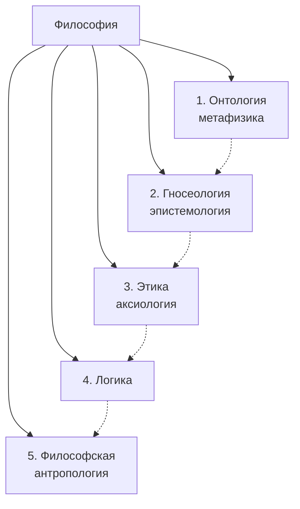

# Основные задачи и особенности философии

> [!abstract] О чём эта лекция
> **Зачем это нужно.** Философия учит выбирать мировоззрение осознанно, а не стихийно, и даёт язык для разговора о ценностях, знании и месте человека в мире. Без этого любая частная наука остаётся набором фактов без целого.
> **Что ты должен уметь после лекции:** назвать три роли философии (методологическая, ценностная, мировоззренческая); перечислить четыре особенности и пять функций философии; нарисовать схему пяти основных разделов и кратко объяснить каждый.

У людей всегда есть свобода мировоззренческого выбора: какую систему ценностей принять.

---

# Три роли философии

## 1. Методологическая роль

В данном случае философия выступает как свод правил и нормативов познания и деятельности.

## 2. Ценностная роль

Философия не только учит мыслить, но и воспитывает. Она не только описывает и объясняет мир, но и оценивает его с точки зрения мыслящего, думающего, философствующего человека.

## 3. Роль мировоззрения

Любая философская концепция предлагает свою систему, иерархию ценностей: для одного мыслителя смыслом жизни будет стремление к наслаждению, для другого — ограничение потребностей и служение высшей цели, для третьего он будет заключён в выработке и строжайшем исполнении моральных предписаний.

---

# Особенности философии

## 1. Внутренняя свобода

Чем всегда гордились древние философы, так это тем, что главным достоинством философии была её внутренняя свобода, что она не была ничьей прислужницей, что наоборот — ей служили все другие науки и искусства.

## 2. Рациональность и целостность

Философия анализирует связь части и целого, человеческого существования и мира в целом рациональными, логическими, понятными средствами.

## 3. Субъект и объект философии

- **Субъектом** философии является мыслящий индивид, человек. Субъект — это тот, кто познаёт.
- **Объекты** — предметы вокруг нас, то, что мы познаём.

## 4. Образ Дао духовного развития

Образно философию можно определить как Дао духовного развития человечества. **Дао** — начало бытия, невидимый вездесущий закон, путь, по которому проходят вещи.

---

# Функции философии

## 1. Мировоззренческая

Позволяет возвысить стихийно сложившуюся и фрагментарную картину мира до уровня серьёзных обобщений, придать ей систематичность и целостность.

## 2. Познавательная

Опираясь на данные частных наук и используя собственно предельно общие категории, философия познаёт мир в соотношении с человеком, познаёт место человека в мире.

## 3. Функция социальной и культурной критики

Развеивает старые и развивает новые общественные идеалы, способствует практическому изменению общества.

## 4. Методологическая

Осмысление, анализ, упорядочивание приёмов и методов познания и практической деятельности.

## 5. Прогностическая и конструктивная

Философия не только пытается понять, как устроен мир и человек, она сама конструирует новые миры и возможные пути развития.

---

# Основные разделы философии

*Диаграмма: пять основных разделов философии. Пунктир — логика изучения: от бытия к знанию, ценностям, мышлению и человеку. Дублируется файлом `Диаграммы/Философия_разделы.drawio.svg`.*

Каждый из них будет изучен в процессе курса:

## 1. Онтология — метафизика

**Учение о бытии.** Что существует? Что такое материя, пространство, время, движение, бытие и небытие. Фундамент для всего остального.

## 2. Гносеология — эпистемология

**Учение о знании.** Как мы познаём? Что такое истина, заблуждение, научный метод, границы познания.

## 3. Этика — аксиология

**Учение о благе и ценностях.** Что такое добро и зло, смысл жизни, счастье, долг, ценности.

## 4. Логика

**Учение о законах и формах мышления.** Понятия, суждения, умозаключения, аргументация. Инструмент для всех разделов.

## 5. Философская антропология

**Учение о сущности человека.** Что такое человек, личность, свобода, творчество, смысл существования.

> [!note] Как читать схему
> Онтология отвечает «что есть», гносеология — «как знаем», этика — «как жить», логика — «как мыслить правильно», антропология — «кто мы». В курсе будем двигаться от бытия к человеку.

---

# Ключевые термины

| Термин | Определение |
|---|---|
| **Мировоззрение** | Система представлений человека о мире и своём месте в нём, включающая ценности и ориентацию |
| **Методология** | Свод правил и нормативов познания и деятельности |
| **Онтология** | Раздел философии о бытии и его основах |
| **Гносеология** | Раздел философии о знании и познании |
| **Этика / аксиология** | Учение о благе, добре и ценностях |
| **Логика** | Учение о законах и формах правильного мышления |
| **Философская антропология** | Учение о сущности и природе человека |
| **Субъект / объект** | Субъект — кто познаёт; объект — что познаётся |
| **Дао** | В китайской традиции — начало бытия, невидимый вездесущий закон и путь вещей |

---

# Типичные заблуждения

- ❌ **«Философия — ничья прислужница, её можно игнорировать».** Наоборот: частные науки дают факты, философия собирает из них целостную картину и даёт критерии выбора ценностей.
- ❌ **«Философия — только абстрактные рассуждения без пользы».** Её прогностическая и методологическая функции напрямую формируют методы науки и проекты будущего.
- ❌ **«Основные разделы — отдельные науки без связи».** Онтология → гносеология → этика → логика → антропология — это путь от «что есть» к «кто мы и как жить».

---

# Связи с другими темами

- [[02. Философия Древней Индии]] — как онтология (Брахман/Атман) и этика (карма/дхарма) решались в ведической традиции.
- [[03. Философия Древнего Китая]] — конфуцианский идеал благородного мужа (этика) и даосское Дао (онтология) как восточные ответы на те же вопросы.
- [[01. Психология профессиональной деятельности]] (дисциплина 04) — мировоззренческая роль философии проявляется в выборе профессии и ценностей.
- [[01. Введение в технологию разработки ПО]] — методологическая роль перекликается с методологиями разработки.
