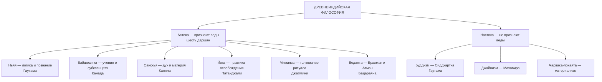
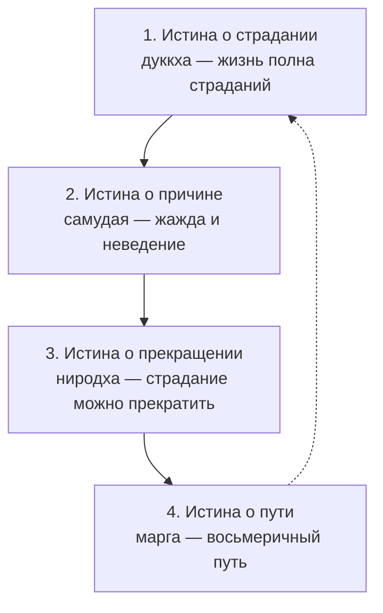
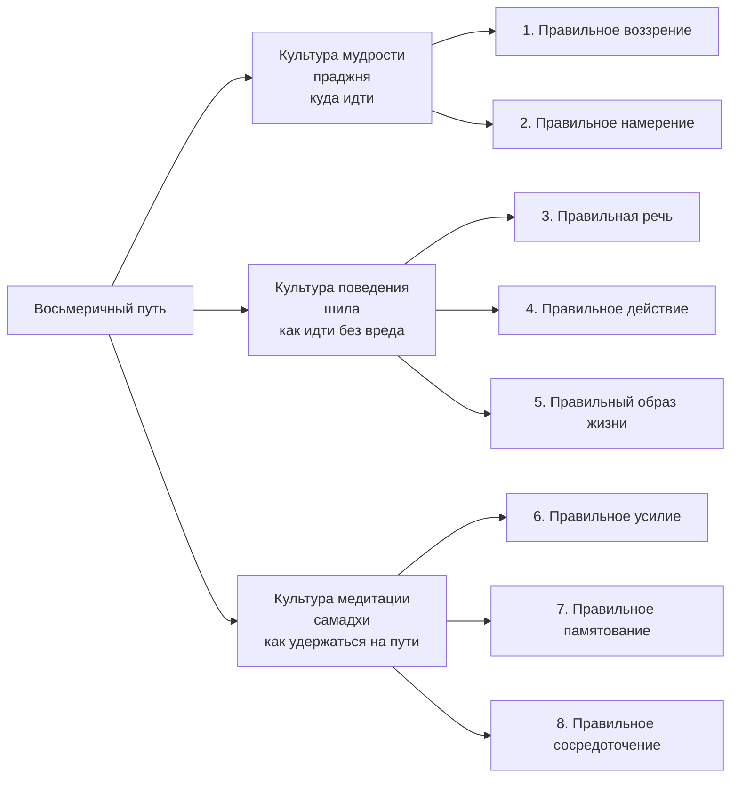

# Философия Древней Индии

> [!abstract] Цель и задачи лекции
> **Цель:** показать, как в древнеиндийской традиции соединились социальный порядок (варны и дхарма), ритуально-философский канон (веды и упанишады) и поиск освобождения от страдания (буддизм и джайнизм), — и как из этого сложились понятия, которые до сих пор работают в мировой культуре.
> **Задачи:**
> 1. описать историко-культурный контекст и периодизацию древнеиндийской философии;
> 2. раскрыть варновую структуру общества и её связь с дхармой и кармой;
> 3. охарактеризовать ведийскую литературу и шесть ключевых категорий ведизма;
> 4. разграничить ортодоксальные и неортодоксальные школы;
> 5. изложить четыре благородные истины буддизма и раскрыть каждый шаг восьмеричного пути;
> 6. сравнить буддизм, джайнизм и чарваку по вопросу о душе, мире и способе освобождения.
>
> *Пояснение для начинающих (для чайника):* индийская философия начинается не с вопроса «как устроен мир», а с вопроса **«как перестать страдать»**. Представьте колесо: пока оно крутится, человек рождается снова и снова (**сансара**), и каждое действие оставляет след (**карма**). Всё остальное — социальный порядок, ритуал, медитация, аскеза — это разные способы остановить колесо. Если запомнить эту схему, все понятия лекции встанут на место: варна — где ты стоишь в колесе, дхарма — что тебе положено делать, мокша и нирвана — выход из колеса.

> [!note] Как устроена лекция
> Разделы 1–2 — контекст и общество, разделы 3–5 — источники и школы, разделы 6–7 — буддизм (самый большой блок), разделы 8–10 — джайнизм, чарвака и сравнение. Для повторения к зачёту достаточно разделов 2, 4.4, 6.4, 7 и 8.

> [!important]- Для преподавателя: как провести это занятие в группе
> **Расчёт времени:** 90 минут; материал удобно делить на два занятия по 45 минут.
> **Занятие 1 (варны и веды):**
> 1. **5 мин — входной вопрос:** «Если бы ваш социальный статус определялся рождением и его нельзя было изменить — что бы это сделало с вашей мотивацией?» Выводит на логику кармы.
> 2. **15 мин — раздел 2:** схема варн на доске (пирамида + неприкасаемые вне неё), разбор «варна ≠ профессия».
> 3. **15 мин — раздел 4:** четыре веды, упанишады, шесть категорий. Ключевое — связка карма → сансара → дхарма → мокша.
> 4. **10 мин — закрепление:** упражнение «чья дхарма» (см. раздел 12, задание 1).
> **Занятие 2 (буддизм и джайнизм):**
> 1. **5 мин — связка:** «ведизм говорит: исполняй дхарму; Будда скажет: этого мало».
> 2. **20 мин — раздел 6:** четыре истины по схеме «диагноз → причина → прогноз → рецепт».
> 3. **15 мин — раздел 7:** восемь шагов в трёх культурах; попросить привести пример нарушения «правильной речи» из соцсетей.
> 4. **5 мин — раздел 8:** отличие джайнизма (радикальная аскеза) от буддизма (срединный путь).
> **Что вынести на доску:** пирамида варн; цепочка «карма → сансара → дхарма → мокша»; схема четырёх истин; таблица трёх культур восьмеричного пути.
> Полный план — [[00. Методические указания по курсу «Основы философии»]].

---

# 1. Историко-культурный контекст Древней Индии

## 1.1 География и периодизация

Древнеиндийская цивилизация сложилась в бассейне рек **Инд** и **Ганг** (северная часть Индостана). Речные долины давали земледелие, земледелие — излишек, излишек — города, жречество и письменность. Именно здесь складываются социальные и религиозные формы, которые позже получат философское обоснование.

**Принятая в курсе периодизация** (по материалу занятий, с уточнениями по учебной литературе):

| Период | Примерные даты | Что происходит |
|---|---|---|
| Индская (Хараппская) цивилизация | III–II тыс. до н. э. | города, ремёсла, письменность (не расшифрована); ранние культы |
| Ведийский период | XV–VI вв. до н. э. | складывание вед, варновой структуры, ритуальной культуры |
| Период упанишад | VIII–VI вв. до н. э. | переход от ритуала к философскому вопросу о Брахмане и Атмане |
| Период «шраманских» учений | VI–IV вв. до н. э. | появление буддизма, джайнизма, чарваки; формирование даршан |

> [!note] Про датировки (дополнение)
> В индологии датировки древнейших текстов расходятся: например, составление «Ригведы» большинство исследователей относит примерно к XV–XII вв. до н. э., а не к XV в. В конспекте сохранена датировка из материала занятий (XV–VI вв. до н. э.) как учебная рамка; на экзамене достаточно назвать период и отметить, что точные даты дискуссионны.

**Ключевой переход, который надо понять:** от **ритуала** к **вопросу**. В ведийскую эпоху правильность действия (жертвоприношения) считалась достаточной: верно совершённый ритуал поддерживает порядок мира. В упанишадах появляется другой вопрос: **что стоит за ритуалом и за миром вообще** — и ответ ищут не в действии, а в знании.

## 1.2 Что такое «даршана»

**Даршана** (санскр. *darśana* — «видение», «зрение», «точка зрения») — так в Индии называют **философскую школу**. Слово точное: школа — это способ видеть мир, а не просто набор тезисов.

Особенность индийской традиции: школы **не существовали изолированно**. Каждая формулировала свою позицию через спор с другими, и прежде чем сделать вывод, разбирала аргументы противника. Отсюда — поразительная широта кругозора и строгость аргументации (подробнее — раздел 3).

---

# 2. Социальная структура Индии: варны и дхарма

## 2.1 Что такое варна и чем она отличается от касты

**Варна** (санскр. *varṇa* — «цвет», «качество», «разряд») — **замкнутое сословие**: большая социальная группа, принадлежность к которой определяется рождением и не меняется в течение жизни.

Индийское общество традиционно делилось на четыре варны. Перейти из одной варны в другую **нельзя**: статус наследовался, и он же определял **дхарму** — должный образ действий человека.

**Варна и джати — не одно и то же (дополнение).** Варна — теоретическая схема из четырёх разрядов. **Джати** (*jāti* — «рождение», «род») — реальная община с наследственным занятием, правилами брака и питания; их тысячи. В русском языке слово «каста» (от порт. *casta* — «род», «порода») обычно соответствует именно джати, а не варне. Поэтому корректно говорить: «варна — сословная рамка, каста (джати) — реальная община внутри этой рамки».

## 2.2 Откуда взялись варны

В ведийской традиции происхождение варн описывается в **«Пуруша-сукте»** — гимне десятой мандалы «Ригведы», где из тела космического первочеловека **Пуруши** при жертвоприношении возникают части общества:

| Часть тела Пуруши | Варна | Смысл образа |
|---|---|---|
| Уста | **брахманы** | речь, знание, молитва |
| Руки | **кшатрии** | сила, защита, власть |
| Бёдра | **вайшьи** | опора, труд, хозяйство |
| Ступни | **шудры** | основание, служение |

> [!note] Как это понимать
> Это не историческое описание, а **обоснование порядка**: общество мыслится как единое тело, где каждая часть имеет своё назначение и достоинство. Именно поэтому варна осмысляется не как привилегия, а как **долг** — и поэтому попытка «сменить роль» разрушает не социальную лестницу, а космический порядок.

## 2.3 Четыре варны подробно

### 2.3.1 Брахманы — жрецы, священнослужители, учителя

- **Цвет одежды:** белый (цвет чистоты и знания).
- **Функция в обществе:** хранители ведического знания, совершители ритуалов, учителя и наставники.
- **Дхарма:** учить и наставлять, сохранять тексты, жить аскетично и нестяжательно; получать содержание как дар, а не как плату за «услугу».
- **Связь с кармой:** знание вед и правильное исполнение ритуала считались условием благого перерождения; ошибка в ритуале рассматривалась как нарушение порядка, а не как технический сбой.
- **Для чайника:** брахман — «хранитель документации» общества: он отвечает за то, чтобы ритуал (протокол) исполнялся точно, потому что от этого, как считалось, зависит работа всего мира.

### 2.3.2 Кшатрии — воины и правители

- **Цвет одежды:** красный (цвет силы и жертвенности).
- **Функция:** защита общины, управление, война и суд; военная и племенная знать.
- **Дхарма:** мужество, защита дхармы и подданных, справедливость в управлении, щедрость к брахманам.
- **Пример:** кшатрийские роды и раджи в эпосе «Махабхарата»; по преданию, **Сиддхартха Гаутама** (будущий Будда) происходил из кшатрийского рода — это важно: основатель буддизма был не жрецом, а представителем воинского сословия.
- **Ключевой конфликт:** в «Бхагавадгите» кшатрий Арджуна колеблется, воевать ли с родственниками; ответ Кришны — исполнять дхарму воина без привязанности к плодам действия. Это классическая постановка проблемы долга.

### 2.3.3 Вайшьи — земледельцы, ремесленники, торговцы

- **Цвет одежды:** жёлтый (цвет земли и плодородия).
- **Функция:** производство и обмен — земледелие, скотоводство, ремесло, торговля; экономическая основа общества.
- **Дхарма:** честный труд, поддержание хозяйства, забота о работниках, благотворительность.
- **Связь с кармой:** честный труд улучшает карму и, по верованию, способствует лучшему рождению в следующей жизни.
- **Важно:** многие ранние последователи Будды — горожане, купцы и ремесленники, то есть вайшьи. Новое учение было привлекательно тем, кто экономически силён, но социально ниже брахманов.

### 2.3.4 Шудры — зависимое население, слуги

- **Цвет одежды:** чёрный.
- **Функция:** обслуживание трёх высших варн, физический труд.
- **Дхарма:** служение и послушание; для шудры служение и есть путь исполнения долга.
- **Ограничения:** шудры не проходили обряд посвящения («второго рождения») и в строгой традиции не допускались к изучению вед.

### Сводная таблица варн

| Варна | Занятие | Цвет | Дхарма | Что даёт исполнению долга |
|---|---|---|---|---|
| **Брахманы** | жрецы, учителя | белый | учить, сохранять знание, аскеза | благополучное перерождение, авторитет |
| **Кшатрии** | воины, правители | красный | защита, управление, справедливость | слава, порядок в обществе |
| **Вайшьи** | земледельцы, торговцы | жёлтый | труд, честный обмен | достаток, лучшее рождение |
| **Шудры** | слуги, работники | чёрный | служение и послушание | исполнение долга своей варны |

*Наглядная схема — файл `Диаграммы/Социальная_структура_Индии.drawio.svg`: четыре варны идут сверху вниз (брахманы → кшатрии → вайшьи → шудры), у каждой подписаны занятие, цвет и дхарма; неприкасаемые вынесены **отдельным пунктирным блоком ниже** — графически это и есть их положение «вне варновой системы».*

## 2.4 Неприкасаемые — вне варновой системы

**Неприкасаемые** (самоназвание — **далиты**, от *dalita* — «угнетённый», «расколотый») — люди, стоявшие **вне четырёх варн**.

- **Занятия:** работы, считавшиеся «нечистыми», — уборка, обработка кожи, работа с трупами, ассенизация.
- **Положение:** социальная изоляция — отдельные поселения, запрет на вход в храмы, ограничения в доступе к воде и пище; отсутствие права на ведический ритуал.
- **Обоснование в традиции:** рождение в таком положении объяснялось кармой прошлых жизней — как следствие серьёзных нарушений дхармы.
- **Историческое продолжение (дополнение):** в XX в. движение за права далитов возглавил **Бхимрао Амбедкар** (1891–1956) — юрист, один из авторов Конституции Индии, где дискриминация по признаку неприкасаемости запрещена. В 1956 г. он публично принял буддизм вместе с сотнями тысяч последователей, рассматривая его как учение без сословной иерархии.

> [!note] Варна и карма: почему «просто профессия» — неверно
> Варна — это **религиозно закреплённый долг**, а не род занятий. Нарушение дхармы своей варны ухудшает карму и ведёт к худшему перерождению; следование — улучшает. Отсюда практический вывод для ответа на экзамене: в варновой логике «сменить профессию» бессмысленно — важно исполнять свой долг на своём месте, а социальная мобильность возможна только через перерождение.

## 2.5 Варна и четыре стадии жизни — ашрамы (дополнение)

Варна отвечала на вопрос «кто я по рождению», **ашрама** (*āśrama*) — на вопрос «какой долг у меня сейчас». Жизненный путь «дваждырождённых» (трёх высших варн) делился на четыре стадии:

| Стадия | Содержание | Главная задача |
|---|---|---|
| **Брахмачарья** | ученичество у учителя | обучение, воздержание, послушание |
| **Грихастха** | дом, семья, хозяйство | труд, рождение детей, содержание общества |
| **Ванапрастха** | «уход в лес» | постепенный отход от дел, сосредоточение |
| **Санньяса** | отречение | освобождение (мокша), отказ от всего |

Смысл схемы: **долг меняется с возрастом**. То, что добродетельно в 20 лет (учиться), в 60 рассматривается как уклонение от итоговой задачи — освобождения.

---

# 3. Общая характеристика древнеиндийской философии

Две черты, отмеченные в материале курса:

1. **Широта кругозора и стремление к истине.** Индийская философия отличается поразительной широтой взглядов: в ней соседствуют учения о вечной душе (веданта) и об отсутствии «я» (буддизм), о реальности мира и о его иллюзорности, о всемогуществе ритуала и о его бесполезности.
2. **Культура спора.** Несмотря на множество школ с существенно различающимися взглядами, каждая стремилась изучить позиции остальных: прежде чем прийти к заключению, школа **тщательно взвешивала аргументы и возражения** противника.

**Почему это важно:** такая практика создала в Индии развитую логику и теорию познания. Школа **ньяя** разработала схему доказательного рассуждения из пяти членов (тезис, основание, пример, применение, вывод) — функциональный аналог силлогизма, но сложившийся независимо от греческой традиции.

> [!tip] Сравнение для запоминания
> Греческая философия чаще начинается с вопроса «из чего всё?», индийская — с вопроса «как освободиться от страдания?». Поэтому греческая традиция дала европейской культуре логику и физику как теории природы, а индийская — психотехнику, этику самообуздания и тонкую теорию сознания.

---

# 4. Ведическая литература как источник философской мысли

## 4.1 Веды: что это такое

**Веды** (санскр. *veda* — «знание»; однокоренное с русским «ведать», «знать») — древние сборники ритуальных текстов: гимны божествам, жертвенные формулы, напевы и заклинания. Возникали примерно в **XV–VI вв. до н. э.** и передавались устно, с исключительно точной техникой запоминания (отсюда их сохранность).

**Структура каждой веды (дополнение):** каждая веда состоит из четырёх слоёв, и это важно для понимания эволюции мысли:

| Слой | Что содержит | Какой вопрос преобладает |
|---|---|---|
| **Самхиты** | гимны и мантры | к кому обратиться и что произнести |
| **Брахманы** | наставления к ритуалу | как правильно совершить обряд |
| **Араньяки** | «лесные книги», толкования | что ритуал значит |
| **Упанишады** | философские диалоги | что есть первооснова мира и «я» |

Логика движения: **действие → толкование действия → вопрос об основании всего.**

## 4.2 Четыре веды

| Веда | Содержание | Особенности |
|---|---|---|
| **Ригведа** («веда гимнов») | Самая древняя: **1028 гимнов**, около **10 600 стихов**, организованных в 10 книг — **мандал**; жертвенные формулы, напевы и заклинания | источник большинства философских мотивов, включая «Пуруша-сукту» и гимн «Насадия» («не было ни бытия, ни небытия…») |
| **Самаведа** («веда напевов») | собрание мелодичных гимнов в честь богов | тексты по составу в основном совпадают с «Ригведой», ценность — в музыкальной организации ритуала |
| **Яджурведа** («веда жертвенных формул») | присловия и формулы, произносимые при жертвоприношениях | существует в двух редакциях — «белой» и «чёрной» |
| **Атхарваведа** («веда заклинаний») | заклинания, заговоры, бытовые и лечебные формулы | долгое время считалась «низшей»; ценна как источник народных верований |

## 4.3 Упанишады

**Упанишады** (*upaniṣad*) — религиозно-философские тексты, завершающие ведический комплекс; их называют **веданта** — «конец вед» (в смысле «завершение») и одновременно «суть вед».

**Этимология:** слово переводят как **«сидеть около»** — ученик сидит около учителя и внимает тайному наставлению. Отсюда — характер текстов: это не гимны для собрания, а **диалоги** учителя и ученика.

**Датировка и объём:** возникли в **VIII–VI вв. до н. э.** (ранние), поздние создавались вплоть до средневековья.

**Сколько их (уточнение):** в конспекте приведена оценка «около 300 упанишад». Точнее по данным индологии: канонический список **«Муктика-упанишады»** называет **108** текстов, всего известно **более 200** текстов с названием «упанишада», а **главными (мукхья)** считаются **13** — именно их комментировали классические философы (например, Шанкара).

**Главные темы:** соотношение **Брахмана** (абсолюта) и **Атмана** (самости), природа смерти и бессмертия, путь освобождения через знание.

## 4.4 Категории ведизма

Шесть ключевых категорий (по материалу курса) плюс мокша — для полноты картины.

| Категория | Определение | Пояснение «для чайника» |
|---|---|---|
| **Карма** (*karman*) | действие, дело, акт; закон причинности поступка, по которому человек берёт на себя ответственность за новое перерождение | «каждое действие оставляет след, и след определяет, где ты окажешься дальше» |
| **Сансара** (*saṃsāra*) | круговорот перерождений души; «колесо сансары» в буддийской схеме включает **6 миров** — от адских состояний до мира богов | «колесо, которое крутится, пока ты за что-то держишься» |
| **Дхарма** (*dharma*) | безличный порядок, закон, должный образец поведения, которому нужно следовать | «правила игры, общие для всех; своя дхарма у каждой варны и стадии жизни» |
| **Сатья** (*satya*) | истина в её объективном бытии; правда и правдивость | «то, что есть на самом деле, — и обязанность говорить так» |
| **Брахман** (*brahman*) | абсолют, безличное духовное начало, которое порождает мир и в которое мир возвращается | «не бог-личность, а первооснова всего — как океан по отношению к волнам» |
| **Атман** (*ātman*) | «душа», субъективное духовное начало, внутренняя самость человека | «то, что в тебе самом глубже личности» |
| **Мокша** (*mokṣa*) — дополнение | освобождение из круговорота сансары, цель религиозно-философской жизни | «выход из колеса» |

**Ключевая связь, которую надо уметь объяснить одной фразой:** карма движет сансарой, дхарма задаёт правильное действие, знание Брахмана и Атмана ведёт к мокше.

## 4.5 «Великие изречения» упанишад (дополнение)

Идея тождества Атмана и Брахмана выражена в так называемых **махавакьях** — «великих изречениях»:

| Изречение | Перевод | Источник |
|---|---|---|
| **Тат твам аси** | «Ты есть То» | «Чхандогья-упанишада» |
| **Ахам Брахмасми** | «Я есть Брахман» | «Брихадараньяка-упанишада» |
| **Праджнянам Брахма** | «Сознание есть Брахман» | «Айтарея-упанишада» |
| **Аям атма Брахма** | «Этот Атман есть Брахман» | «Мандукья-упанишада» |

> [!example] Почему «Ты есть То» — онтологический тезис
> Фраза утверждает: внутренняя самость человека (Атман) и первооснова мира (Брахман) — не две вещи, а одна. Отсюда следует практический вывод: освобождение достигается не перемещением «туда», а **узнанием** того, что уже есть. Знание здесь не информационно, а освобождающе.

---

# 5. Школы древнеиндийской философии: ортодоксальные и неортодоксальные (дополнение)

Индийские школы делятся по одному формальному признаку: **признают ли они авторитет вед**.

- **Астика** (ортодоксальные) — признают;
- **Настика** (неортодоксальные) — не признают.

*Диаграмма: ортодоксальные и неортодоксальные школы. Дублируется файлом `Диаграммы/Индия_школы_даршаны.drawio.svg`.*

| Школа | Ключевая идея | Основатель (по традиции) |
|---|---|---|
| **Ньяя** | теория познания и правила доказательства | Гаутама |
| **Вайшешика** | мир состоит из атомов и субстанций с качествами | Канада |
| **Санкхья** | двойственность духа (**пуруша**) и материи (**пракрити**) | Капила |
| **Йога** | практика сосредоточения как путь освобождения | Патанджали |
| **Миманса** | тщательное толкование ведийского ритуала и долга | Джаймини |
| **Веданта** | учение о Брахмане и Атмане, «конец вед» | Бадараяна |

---

# 6. Буддизм

## 6.1 Возникновение буддизма и жизнь Будды

Буддизм возникает в **VI–V вв. до н. э.** в среде «шраманских» движений — странствующих аскетов и учителей, не признававших исключительного авторитета вед и жречества (**шрамана** — «тот, кто трудится над собой»).

**Основатель — Сиддхартха Гаутама** из кшатрийского рода Шакья, ставший **Буддой** — «пробуждённым», «просветлённым».

**Датировка (важно для точности ответа):** традиционная хронология — **563–483 гг. до н. э.**; современная наука чаще принимает более позднюю рамку — **около 480–400 гг. до н. э.** Точная дата смерти Будды в науке не установлена — это признанный дискуссионный вопрос.

**Каноническая биография (схема «четыре встречи»):**

| Этап | Событие | Смысл |
|---|---|---|
| Рождение | Лумбини, семья правителя | жизнь в роскоши, ограждение от страданий |
| Четыре встречи | старик, больной, мертвец, аскет | открытие неизбежности страдания и возможность иного пути |
| Уход из дворца | отречение, годы аскезы | аскеза не дала ответа |
| Просветление | Бодх-Гая, под деревом бодхи | постижение причины страдания и пути |
| Первая проповедь | Сарнатх, «поворот колеса дхармы» | изложение четырёх благородных истин |
| Паринирвана | Кушинагара, около 80 лет | окончательный уход из круговорота рождений |

**Дальнейшая история (дополнение):** после смерти Будды учение закреплялось на **соборах**; со временем община разделилась на направления — **тхеравада** («учение старейшин») и **махаяна** («великая колесница»). Распространению буддизма за пределы Индии способствовал император **Ашока** (правил около 268–232 гг. до н. э.), поддержавший миссии в Шри-Ланку и другие регионы.

## 6.2 Цель познания в буддизме и понятие нирваны

**Положения материала курса:**

- Цель познания — **освобождение человека от страданий**.
- Избавление от страданий достижимо **не в загробной жизни, а в настоящей**.
- Такое прекращение страданий называется **нирваной**; буквально — **«угасший»** (как пламя).
- Под нирваной понимают состояние полной невозмутимости, освобождение от внешнего мира, а также от мира мыслей.

**Разбор понятия:**

**Нирвана** (санскр. *nirvāṇa* — «угасание», «затухание») — не место и не «рай», а **состояние**: угасание жажды, вражды и неведения, а вместе с ними — прекращения новых рождений. Сравнение с пламенем точно: огонь гаснет не потому, что его «унесли в другое место», а потому что **кончилось топливо**.

> [!warning] Нирвана — не «вечное блаженство» в бытовом смысле
> Нирвана — это прекращение страдания через угасание жажды, а не награда с удовольствиями. В буддийской терминологии блаженство нирваны — блаженство **покоя и свободы от привязанностей**, а не наслаждения.

## 6.3 Три признака существования (дополнение)

Чтобы понять первую и вторую истины, нужны три базовых понятия буддийской онтологии:

| Признак | Термин | Содержание |
|---|---|---|
| Непостоянство | **анитья** (*anitya*) | всё составное изменяется и распадается; устойчивых вещей нет |
| Страдание | **дуккха** (*duḥkha*) | неудовлетворённость как следствие непостоянства |
| Безсамостность | **анатман** (*anātman*) | нет неизменного «я»; личность — поток состояний |

**Почему это важно:** буддизм отрицает вечную душу (Атман), которую признают упанишады. Это главный вероучительный разрыв с ведизмом: освобождение — не «слияние души с абсолютом», а **прекращение самого потока** привязанностей.

## 6.4 Четыре благородные истины

Чтобы избавиться от страданий и достичь нирваны, человек должен следовать **четырём благородным истинам** (*чатвари арья сатьяни*).

*Диаграмма: четыре благородные истины как цикл «диагноз → причина → прогноз → рецепт». Дублируется файлом `Диаграммы/Буддизм_4_истины.drawio.svg`.*

### Истина 1. Жизнь полна страданий (дуккха)

**Содержание:** рождение, болезнь, старость, смерть, соединение с неприятным, разлука с приятным, неудовлетворённые желания — всё это страдание. Даже радость непостоянна, поэтому содержит в себе будущую неудовлетворённость.

**Что часто понимают неверно:** дуккха — не «всё плохо», а «всё ненадёжно». Точнее всего переводить как **неудовлетворённость**, «неполнота», «то, что не держится».

**Для чайника:** как у держания горячей чашки: сейчас терпимо, но удержать навсегда нельзя. Проблема не в чашке, а в хватке.

### Истина 2. Страдания имеют причину (самудая)

**Содержание:** причина страдания — **жажда** (**танха**, *tṛṣṇā* — буквально «жажда», «страстное желание») и **неведение** (**авидья**) — непонимание непостоянства и безсамостности.

Жажда имеет три формы: жажда чувственных удовольствий, жажда существования (продолжения себя) и жажда несуществования (уничтожения).

**Логика:** если бы страдание было случайным, его нельзя было бы устранить системно. Причина делает его устранимым.

### Истина 3. Страдания можно прекратить (ниродха)

**Содержание:** если угасить жажду, прерывается цепь перерождений — «колесо жизни» останавливается. Это и есть нирвана.

**Важно:** утверждение о **достижимости** здесь принципиально: без третьей истины первые две были бы просто пессимистическим описанием мира.

### Истина 4. Существует метод — восьмеричный путь (марга)

**Содержание:** путь (**марга**) — практическая методика, а не вероучение. Это **срединный путь** между двумя крайностями: гедонизмом (погоня за удовольствиями) и крайним аскетизмом (истязание себя).

**Обоснование из биографии:** Гаутама испробовал обе крайности — дворцовую роскошь и жёсткую аскезу — и ни одна не привела к освобождению.

> [!tip] Как запомнить четыре истины
> **Диагноз → причина → прогноз → рецепт.** Будда выступает как врач: (1) болезнь есть, (2) у неё есть причина, (3) она излечима, (4) вот курс лечения. Это не пессимизм, а клиническая схема.

## 6.5 Срединный путь

**Срединный путь** (*мадхьяма марга*) — принцип, по которому правильная практика избегает обеих крайностей:

| Крайность | В чём состоит | Почему не работает |
|---|---|---|
| **Гедонизм** | поиск наслаждений как цель | наслаждение непостоянно, жажда усиливается |
| **Аскетизм** | истязание тела, отказ от всего | ослабляет ум и не устраняет причину (жажду) |
| **Срединный путь** | дисциплина + ясность ума + этика | работает с причиной, а не с симптомами |

---

# 7. Благородный восьмеричный путь — три культуры

Восьмеричный путь делят на **три культуры** (три группы тренировки, *śikṣā*): **мудрость (праджня)**, **поведение (шила)** и **медитация (самадхи)**.

*Диаграмма: восемь шагов пути в трёх культурах. Дублируется файлом `Диаграммы/Буддизм_восьмеричный_путь.drawio.svg`.*

## 7.1 Культура мудрости (праджня)

### Шаг 1. Правильное воззрение (знание)

**Содержание:** понимание четырёх благородных истин, непостоянства (анитья) и отсутствия неизменного «я» (анатман), а также закона кармы.

- *На практике:* изучение учения и критическое осмысление, а не слепая вера. В традиции прямо говорится: проверяй учение, как проверяют золото огнём.
- *Ошибка:* принимать буддизм «на удачу», как набор обрядов, — тогда первый шаг пропущен, и остальные превращаются в ритуал.

### Шаг 2. Правильное намерение (стремление)

**Содержание:** жизнь по принципам учения: отречение от жажды, доброжелательность, непричинение вреда.

- *На практике:* формирование мотивации сострадания, а не эгоистического достижения нирваны «для себя».
- *Почему это отдельный шаг:* даже верное знание работает неверно при неверной мотивации — например, медитация ради превосходства над другими.

## 7.2 Культура поведения (шила)

### Шаг 3. Правильная речь

**Содержание:** воздержание от четырёх видов речи — лжи, злословия (сплетен и раздора), грубых слов, пустословия.

- *Пример:* не лгать даже «во благо»; говорить вовремя и по существу; не пересказывать слухи, даже если они кажутся правдивыми.
- *Современный пример:* анонимный оскорбительный комментарий — нарушение сразу двух пунктов: грубая речь и злословие.

### Шаг 4. Правильное поведение (действие)

**Содержание:** не причинять зла живому, не брать неданного (не красть), не прелюбодействовать.

- *Пример:* **ахимса** (*ahiṃsā*) — непричинение вреда живому; уважение чужой собственности и чужих отношений.
- *Уточнение:* ахимса в буддизме — принцип ненасилия; в джайнизме она доведена до предельной строгости (см. раздел 8).

### Шаг 5. Правильный образ жизни

**Содержание:** мирный, честный и чистый способ заработка, не связанный с причинением вреда.

- *Традиционно запрещены:* торговля оружием, живыми существами (в том числе работорговля), мясом, ядами и опьяняющими веществами; обман при сделках.
- *Пример:* земледелец, ремесленник, учитель, врач — допустимо; браконьер, ростовщик, обманывающий заёмщиков, — нет.

## 7.3 Культура медитации (самадхи)

### Шаг 6. Правильное усилие

**Содержание:** самовоспитание и самообладание: не допускать возникновения неблагих состояний, отсекать возникшие, взращивать благие и поддерживать возникшие.

- *Пример:* заметить гнев в момент его появления и заменить терпением; не «бороться с собой», а переключить внимание на причину.

### Шаг 7. Правильное памятование (осознанность)

**Содержание:** осознанность, основанная на благородных целях: наблюдение за телом, ощущениями, состояниями ума и явлениями — без привязанности и оценки.

- *Пример:* практика **випассаны** (*vipaśyanā* — «ясное видение») — наблюдение непостоянства восприятия: ощущение возникает и уходит, и это видно непосредственно.

### Шаг 8. Правильное сосредоточение

**Содержание:** владение методами медитации, ведущими к прозрению: четыре **дхьяны** — ступени углублённого сосредоточения.

- *Пример:* **шаматха** (*śamatha* — «успокоение») — устойчивое сосредоточение, на основе которого становится возможным прозрение.

> [!tip] Три культуры вместе
> Мудрость даёт **«куда идти»**, поведение — **«как идти без вреда»**, медитация — **«как удержаться на пути»**. Без одной из трёх путь обрывается: знание без этики — цинизм, этика без мудрости — ханжество, медитация без обеих — самообман.

> [!note] Важная деталь (дополнение)
> Восемь шагов — не лестница, которую проходят по порядку и забывают про предыдущие ступени. В традиции их описывают как **взаимно поддерживающие факторы**, развиваемые одновременно: правая речь удерживает ум спокойным, спокойный ум видит яснее, ясное видение корректирует намерение.

---

# 8. Джайнизм — учение «победителей»

## 8.1 Возникновение и основатель

- **Джайнизм** — религиозно-философское учение, возникшее в Индии приблизительно в **VI в. до н. э.**
- **Основатель — Вардхамана**, более известный как **Джина Махавира** («великий победитель»). **Джина** (*jina*) — «победитель»: победивший привязанности и карму. Отсюда название учения.
- **Традиционные даты жизни Махавиры:** 599–527 гг. до н. э. (в науке также встречается рамка около 540–468 гг. до н. э.).
- **Численность (уточнение):** в конспекте приводилась оценка «примерно 8 млн приверженцев, из которых 4 млн в Индии». По современным данным вернее говорить **около 4–5 млн** последователей в мире, причём подавляющее большинство — **в Индии** (перепись Индии 2011 г. — около 4,45 млн джайнов). Это одна из самых малочисленных, но очень влиятельных в этическом отношении общин Индии.
- **Предшественники (дополнение):** традиция называет **24 тиртханкаров** — «устроителей брода», учителей, показывающих путь через сансару. Двадцать третий — **Паршванатха**, двадцать четвёртый — Махавира.

## 8.2 Цель и источник мудрости

- **Цель философии джайнизма — святость**: особый образ поведения, посредством которого достигается освобождение.
- **Источником мудрости считается не бог, а святые** — те, кто достиг силы и счастья на основе совершенного знания и посредством поведения, вытекающего из этого знания. Это принципиально: джайнизм **нетеистичен** — он не опирается на бога-творца.

## 8.3 Учение о бытии

Джайнизм как этическое учение опирается на особое учение о бытии: **существует множество вещей**, наделённых реальностью и обладающих, с одной стороны, **постоянными**, с другой — **случайными, преходящими свойствами**.

**Пояснение:** это решение проблемы изменения. Вещь одновременно устойчива (её субстанция сохраняется) и изменчива (её состояния сменяются). Отсюда — знаменитая джайнская теория множественности точек зрения:

| Понятие | Содержание | Аналогия |
|---|---|---|
| **Анекантавада** | учение о многогранности реальности: ни одно суждение не исчерпывает предмет | слон и слепые мудрецы: каждый описал часть |
| **Сьядвада** | учение об условности суждений: «в некотором отношении…» | «в одном отношении верно, в другом — нет» |

> [!note] Почему это важно для философии вообще
> Джайнская логика «с некоторой точки зрения» — одна из древних форм признания **ограниченности любой позиции**. Она близка современной идее о том, что описание зависит от ракурса и уровня рассмотрения, — при этом джайнизм не скатывается в «всё равно что думать»: каждая точка зрения должна быть корректна в своих границах.

## 8.4 Этика джайнизма: пять обетов

| Обет | Содержание | Крайняя форма в монашестве |
|---|---|---|
| **Ахимса** | непричинение вреда живому | фильтрация воды, щётка для сметания насекомых с дороги |
| **Сатья** | правдивость | отказ от речи, способной причинить вред |
| **Астея** | неворовство | отказ от принятия неданного |
| **Брахмачарья** | воздержание | полный целибат для монахов |
| **Апариграха** | нестяжательство | отказ от собственности; у дигамбаров — и от одежды |

**Следствие в быту:** строгое вегетарианство, отказ от корнеплодов (при выкапывании гибнут мелкие организмы), традиционная занятость джайнов в торговле и финансах — ремёсла, связанные с насилием, были закрыты.

## 8.5 Направления и отличие от буддизма

После смерти Махавиры община разделилась на **дигамбаров** («одетых в пространство», то есть нагих аскетов) и **шветамбаров** («одетых в белое») — различие в строгости аскезы и в отношении к текстам.

| Критерий | Буддизм | Джайнизм |
|---|---|---|
| Путь | **срединный**: отказ от обеих крайностей | **радикальная аскеза** |
| Душа | **анатман** — нет неизменного «я» | **джива** — вечная индивидуальная душа у каждого существа |
| Ненасилие | ахимса как этический принцип | ахимса как абсолют, доведённый до деталей быта |
| Основатель | Будда — пробуждённый | Джина — победитель (один из 24 тиртханкаров) |
| Отношение к ведам | не признают | не признают |

---

# 9. Чарвака-локаята: древнеиндийский материализм (дополнение)

Чтобы картина индийской философии была полной, нужно упомянуть третью неортодоксальную школу — **чарваку** (локаяту).

- **Онтология:** существуют только четыре элемента — земля, вода, огонь, воздух; сознание — продукт их сочетания, как опьяняющая сила — свойство смеси ингредиентов, которых по отдельности нет.
- **Гносеология:** единственный достоверный источник знания — **восприятие**; выводы о загробном мире, карме и освобождении считаются необоснованными.
- **Отрицание вед,** жречества и посмертного воздаяния.
- **Этика:** жить следует сообразно этой жизни. Известна формула, приписываемая школе: «пока жив — живи счастливо» (в том числе с иронией по поводу обещаний рая за жертвоприношения).

**Зачем это знать:** чарвака показывает, что индийская традиция **не была однородно религиозной** — в ней существовала последовательная материалистическая линия, с которой спорили все остальные школы. Именно в споре с ней оттачивались доказательства бытия души и закона кармы.

---

# 10. Сравнение школ: ведизм, буддизм, джайнизм, чарвака

| Критерий | Ведизм / упанишады | Буддизм | Джайнизм | Чарвака |
|---|---|---|---|---|
| Авторитет вед | признают | не признают | не признают | не признают |
| Душа | **Атман** = Брахман | **анатман** — нет «я» | **джива** — много индивидуальных душ | души нет |
| Первооснова | Брахман (духовное начало) | взаимозависимое возникновение | множество субстанций | четыре элемента |
| Причина страдания | неведение тождества Атмана и Брахмана | жажда и неведение | приток кармической материи к душе | страдание естественно, иного мира нет |
| Способ освобождения | знание (джняна) + ритуал и долг | восьмеричный путь | аскеза и пять обетов | освобождения нет — живи разумно здесь |
| Отношение к аскезе | умеренная, по стадии жизни | отвергается как крайность | высшая ценность | бессмысленна |
| Ненасилие | ограничено ритуалом (включая жертвы) | ахимса как норма | ахимса абсолютна | не принцип |

---

# 11. Значение древнеиндийской философии

1. **Постановка проблемы страдания как философской.** Вопрос «как жить, зная о смерти?» стал центральным, а не побочным.
2. **Развитие логики и эпистемологии.** Ньяя создала теорию доказательства; джайнизм — логику точек зрения; буддийская традиция — тонкий анализ сознания.
3. **Этика ненасилия.** Ахимса повлияла на практики ненасильственного сопротивления XX в. (например, на стратегию Махатмы Ганди).
4. **Психотехника.** Медитативные практики, выросшие из буддийской традиции, стали предметом научных исследований и терапевтических методик.
5. **Понятийный след в мировой культуре.** Карма, дхарма, нирвана, сансара вошли в обыденный язык — часто в упрощённом виде, поэтому важно знать их точное содержание.

---

# 12. Задания для семинара и самостоятельной работы

1. **«Чья дхарма».** Даны ситуации: (а) правитель должен казнить преступника; (б) купец видит возможность нажиться на голоде; (в) ученик хочет бросить учёбу ради заработка. Определите варну/стадию жизни и объясните, в чём состоит дхарма в каждом случае.
2. **Карта категорий.** Составьте схему связей: карма → сансара → дхарма → мокша, указав, что усиливает и что ослабляет каждое звено.
3. **Врачебная схема.** Перескажите четыре благородные истины языком врача (диагноз, анамнез, прогноз, курс лечения), не используя буддийских терминов.
4. **Шаг пути в современной жизни.** Выберите один из восьми шагов и приведите два примера: соблюдение и нарушение — из своей повседневности.
5. **Сравнительный анализ.** Заполните таблицу п. 10 по памяти, затем сверьтесь. Объясните, почему джайнизм выбрал аскезу, а буддизм — срединный путь.
6. **Мини-дебаты.** Тезис: «Чарвака — самая честная из индийских школ». Аргументы должны опираться на различие источников знания (восприятие vs вывод vs авторитет).

---

# Ключевые термины

| Термин | Определение |
|---|---|
| **Даршана** | Философская школа; буквально «видение», «точка зрения» |
| **Варна** | Замкнутое наследственное сословие: брахманы, кшатрии, вайшьи, шудры |
| **Джати (каста)** | Реальная наследственная община с фиксированным занятием; их тысячи внутри варновой рамки |
| **Далиты (неприкасаемые)** | Люди вне варновой системы, занятые «нечистыми» работами |
| **Ашрама** | Стадия жизни: ученичество, домохозяин, уход от дел, отречение |
| **Веды** | Древние сборники ритуальных текстов: Ригведа, Самаведа, Яджурведа, Атхарваведа |
| **Упанишады** | Религиозно-философские тексты, завершение вед («сидеть около» учителя); 13 главных, канон называет 108 |
| **Карма** | Действие и его следствие; закон причинности поступка |
| **Сансара** | Круговорот перерождений; в буддийской схеме — 6 миров |
| **Дхарма** | Безличный порядок и должный образец поведения |
| **Сатья** | Истина в её объективном бытии; правдивость |
| **Брахман** | Абсолют, безличное духовное начало мира |
| **Атман** | Внутренняя самость, «душа»; в упанишадах тождествен Брахману |
| **Мокша** | Освобождение из круговорота перерождений |
| **Астика / настика** | Школы, признающие / не признающие авторитет вед |
| **Шесть даршан** | Ньяя, вайшешика, санкхья, йога, миманса, веданта |
| **Дуккха** | Страдание как неудовлетворённость, неполнота существования |
| **Танха** | Жажда, страстное желание — причина страдания |
| **Авидья** | Неведение непостоянства и безсамостности |
| **Анитья / анатман** | Непостоянство / отсутствие неизменного «я» |
| **Нирвана** | Угасание жажды, невозмутимость, конец перерождений |
| **Восьмеричный путь** | Восемь факторов в трёх культурах: мудрость, поведение, медитация |
| **Праджня / шила / самадхи** | Мудрость / нравственное поведение / сосредоточение |
| **Ахимса** | Непричинение вреда живому |
| **Джина Махавира** | Основатель джайнизма, 24-й тиртханкара |
| **Анекантавада / сьядвада** | Многогранность реальности / условность суждений («в некотором отношении») |
| **Чарвака-локаята** | Материалистическая школа: четыре элемента, достоверно только восприятие |

---

# Типичные заблуждения

- ❌ **«Каста — это просто профессия».** Варна — религиозно-правовая роль с наследственной дхармой; сменить её при жизни нельзя, в отличие от профессии. Кроме того, варна (4 сословия) и джати/каста (тысячи общин) — разные уровни описания.
- ❌ **«Нирвана — это рай с вечным блаженством».** Нирвана — угасание жажды и конец перерождений; блаженство здесь понимается как покой и свобода от привязанностей, а не как набор удовольствий.
- ❌ **«Четыре истины — пессимизм».** Это клиническая схема: признать болезнь, найти причину, установить излечимость, назначить лечение. Пессимизм остановился бы на первой истине.
- ❌ **«Буддизм и джайнизм — одно и то же, потому что обе из Индии и обе про ненасилие».** Буддизм — срединный путь и учение об отсутствии «я»; джайнизм — радикальная аскеза, вечная индивидуальная душа и ахимса как абсолют.
- ❌ **«Буддизм — это про медитацию, этика вторична».** Этика (шила) — три из восьми шагов пути; без неё медитация в традиции считается не работающей, а опасной.
- ❌ **«Карма — это судьба, которую нельзя изменить».** Карма — закон последствий действия: именно потому, что действие имеет вес, будущее изменяемо. Фатализм здесь — искажение.
- ❌ **«Упанишады — это гимны».** Упанишады — философские диалоги, завершающие ведический комплекс; гимны — это самхиты.
- ❌ **«Индийская философия вся религиозная».** Чарвака-локаята — последовательный материализм с опорой на восприятие и отрицанием вед.
- ❌ **«Джайнов 8 миллионов».** Современные оценки — около 4–5 млн в мире, из них около 4,45 млн в Индии (перепись 2011 г.).

---

# Вопросы для самопроверки

1. Опишите периодизацию древнеиндийской философии и назовите ключевой переход от вед к упанишадам.
2. Перечислите четыре варны: занятие, цвет, дхарма. Кто такие неприкасаемые и почему они вне системы?
3. Чем варна отличается от касты (джати)? Почему варну нельзя назвать «профессией»?
4. Назовите четыре веды и их содержание. Сколько стихов и гимнов в «Ригведе»?
5. Что означает слово «упанишада» и почему эти тексты так названы? Сколько упанишад считается главными?
6. Дайте определения шести категорий ведизма и объясните связь «карма — сансара — дхарма — мокша».
7. Чем ортодоксальные школы отличаются от неортодоксальных? Назовите шесть даршан.
8. Изложите четыре благородные истины, объяснив каждую. Почему их сравнивают с работой врача?
9. Раскройте восемь шагов восьмеричного пути и распределите их по трём культурам.
10. В чём отличие джайнизма от буддизма по трём пунктам: путь, душа, ненасилие?
11. Какие положения чарваки делают её материалистической школой?
12. Почему учение об анатмане — главный разрыв буддизма с ведийской традицией?

> [!example]- Ответы
> 1. Индская цивилизация (III–II тыс. до н. э.) → ведийский период (XV–VI вв. до н. э.) → упанишады (VIII–VI вв. до н. э.) → шраманские учения (VI–IV вв. до н. э.). Переход: от правильности **ритуала** к вопросу об **основании мира** — ответ ищут в знании (Брахман и Атман), а не в действии.
> 2. Брахманы (жрецы и учителя, белый, учить и хранить знание), кшатрии (воины и правители, красный, защита и управление), вайшьи (земледельцы и торговцы, жёлтый, труд и обмен), шудры (слуги, чёрный, служение). Неприкасаемые (далиты) — вне варн: «нечистые» работы, социальная изоляция, отсутствие доступа к ведическому ритуалу; положение объяснялось кармой прошлых жизней.
> 3. Варна — сословная рамка из четырёх разрядов, джати — реальная община с наследственным занятием (их тысячи). Варна не «профессия», потому что это религиозно закреплённый долг (дхарма): она не выбирается, не меняется при жизни и определяет не только работу, но и ритуальный статус и путь перерождения.
> 4. Ригведа — гимны (1028 гимнов, около 10 600 стихов, 10 мандал); Самаведа — напевы; Яджурведа — жертвенные формулы; Атхарваведа — заклинания и заговоры.
> 5. «Сидеть около» — ученик внимает тайному наставлению учителя; тексты имеют форму диалога. Главными считаются 13 упанишад; канон «Муктика» называет 108, всего известно более 200.
> 6. Карма — действие и его следствие; сансара — круговорот перерождений; дхарма — должный порядок; сатья — истина; Брахман — абсолют; Атман — самость (плюс мокша — освобождение). Связь: карма движет сансарой, дхарма задаёт правильное действие, знание Брахмана/Атмана ведёт к мокше.
> 7. По признанию авторитета вед: астика признают, настика нет. Шесть даршан: ньяя, вайшешика, санкхья, йога, миманса, веданта.
> 8. (1) жизнь есть дуккха — неудовлетворённость из-за непостоянства; (2) причина — жажда (танха) и неведение (авидья); (3) прекращение возможно — нирвана; (4) метод — восьмеричный путь, срединный между гедонизмом и аскезой. Схема врача: диагноз → причина → прогноз → рецепт.
> 9. Мудрость (праджня): правильное воззрение, правильное намерение. Поведение (шила): правильная речь, правильное действие, правильный образ жизни. Медитация (самадхи): правильное усилие, правильное памятование, правильное сосредоточение.
> 10. Путь: буддизм — срединный, джайнизм — радикальная аскеза. Душа: буддизм — анатман (нет «я»), джайнизм — джива (вечная индивидуальная душа). Ненасилие: в буддизме — этическая норма, в джайнизме — абсолют, распространённый на бытовые детали.
> 11. Мир состоит из четырёх элементов, сознание — свойство их сочетания; достоверно только восприятие; веды, карма и посмертие отрицаются; смысл жизни — в этой жизни.
> 12. Упанишады утверждают вечный Атман, тождественный Брахману, и освобождение как узнание этого тождества. Буддизм отрицает неизменное «я»: личность — поток состояний. Значит, освобождение — не слияние души с абсолютом, а прекращение самого потока жажды и рождений.

---

# Источники и рекомендуемая литература

**Первичная основа — материалы занятий** (преп. Минбулатова И. Г.): варны, веды, шесть категорий, четыре истины, восьмеричный путь, джайнизм.

**Дополнительно:**

1. Stanford Encyclopedia of Philosophy — статьи о буддийской философии, джайнизме, индийских даршанах: <https://plato.stanford.edu/>.
2. Internet Encyclopedia of Philosophy — разделы по индийской философии: <https://iep.utm.edu/>.
3. С. Радхакришнан. Индийская философия — классический академический обзор традиции.
4. «Дхаммапада» — собрание изречений Будды (доступны академические переводы).
5. Упанишады — академические переводы с комментариями (ранние упанишады).

---

# Что из материала преподавателя, а что добавлено

| Блок | Источник |
|---|---|
| Историческая справка, периодизация (XV–VI вв. до н. э.) | материал занятий |
| Четыре варны с цветами, неприкасаемые, связь варны с дхармой и кармой | материал занятий; расширено примерами и сравнением варна/джати |
| Общая характеристика (широта кругозора, культура спора) | материал занятий |
| Четыре веды, упанишады («сидеть около»), шесть категорий ведизма | материал занятий; уточнены объём «Ригведы» и число упанишад |
| Четыре благородные истины, нирвана, восьмеричный путь в трёх культурах | материал занятий; шаги раскрыты примерами |
| Джайнизм: Махавира, цель — святость, источник мудрости — святые, учение о бытии | материал занятий; **исправлена численность** (было «8 млн»), добавлены пять обетов, анекантавада |
| Пуруша-сукта, ашрамы, структура вед, махавакьи, шесть даршан, биография Будды, три признака существования, соборы и Ашока, тиртханкары, чарвака, сравнительные таблицы | дополнение по учебной и справочной литературе |
| Задания, вопросы для самопроверки | авторская методическая разработка |

---

# Связи с другими темами

- [[01. Основные задачи и особенности философии]] — онтология (Брахман и Атман), гносеология (познание как путь освобождения) и этика (карма, дхарма, восьмеричный путь) как примеры разделов философии.
- [[03. Философия Древнего Китая]] — сравнение путей: индийская нирвана и китайское Дао/у-вэй; дхарма и китайское ли как нормативные системы; обе традиции относятся к «осевому времени».
- [[01_Дисциплины/07_Основы_Философии/00_Курс|00_Курс]] — оглавление дисциплины, уровни освоения, карта понятий.
- [[00. Методические указания по курсу «Основы философии»]] — планы занятий, вопросы к зачёту, критерии оценки.
- [[01_Дисциплины/07_Основы_Философии/02_Сообщения/01. Даосизм/Текст выступления|Сообщение «Даосизм»]] — пример устного выступления по смежной теме восточной философии.
- [[01. Психология профессиональной деятельности]] (дисциплина 04) — идеи варны и дхармы перекликаются с вопросом выбора предмета труда и нормативного кризиса профессионального становления.
- [[05_Психология_Общения/Коммуникативная сторона общения]] (дисциплина 05) — «правильная речь» как нормативная модель коммуникации.
