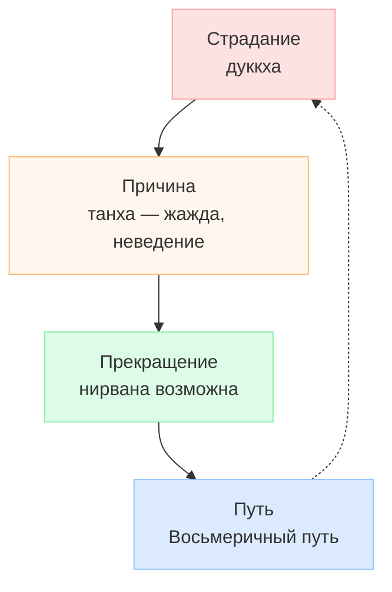

# Философия Древней Индии

> [!abstract] О чём эта лекция
> **Зачем это нужно.** Индийская философия показывает, как одна культура соединила социальную иерархию, ведический ритуал и глубокий поиск освобождения от страданий. Разобрав варны, веды и буддийский путь, ты видишь, откуда берутся понятия кармы и дхармы, которые позже встречаются и в психологии.
> **Что ты должен уметь после лекции:** объяснить варновую структуру (4 касты + неприкасаемые) и связь с дхармой; назвать 4 веды и упанишады, дать 6 категорий ведизма; изложить 4 благородные истины и 8-ричный путь по трём культурам + джайнизм.

---

# Историческая справка

Древнеиндийская цивилизация сложилась в бассейне Инда и Ганга в III–II тыс. до н.э. Социальная структура закрепилась в варнах, а духовная — в ведах (XV–VI вв. до н.э.) и упанишадах (VIII–VI вв. до н.э.). Философские школы (даршаны) спорили между собой, но каждая внимательно изучала аргументы других прежде чем делать вывод.

# Социальная структура Индии

Индийское общество традиционно делилось на **варны** — замкнутые сословия. Перейти из одной варны в другую нельзя: статус наследовался и определял дхарму (долг).

## 1. Брахманы — жрецы, священнослужители, монахи

- **Цвет одежды:** белый
- **Функция:** хранители ведического знания, совершители ритуалов, учителя. Их дхарма — учить и наставлять, жить аскетично.
- **Карма:** исполнение ритуалов и знание вед считалось условием благого перерождения.

## 2. Кшатрии — воины, военная знать, представители племенной власти

- **Цвет одежды:** красный
- **Функция:** воины и правители, защита общины, управление. Дхарма — мужество, защита дхармы.
- **Пример:** раджи и кшатрийские роды в эпосе «Махабхарата».

## 3. Вайшьи — земледельцы-общинники, ремесленники, торговцы

- **Цвет одежды:** жёлтый
- **Функция:** производство и обмен: земледелие, скотоводство, ремесло, торговля. Дхарма — труд и поддержание хозяйства.
- **Связь с кармой:** честный труд улучшает карму и способствует повышению варны в следующем рождении.

## 4. Шудры — зависимое население, слуги, основные производители

- **Цвет одежды:** чёрный
- **Функция:** обслуживание трёх высших варн, физический труд. Дхарма — служение и послушание.

## Неприкасаемые — изгои (далиты)

Вне четырёх варн — люди, занятые «нечистыми» работами (уборка, обработка кожи). Социально изолированы, не входили в общину, не имели доступа к ведическому ритуалу. Позже — движение за права далитов.

> [!note] Варна и карма
> Варна — не просто «профессия», а религиозно закреплённый долг. Нарушение дхармы своей варны ухудшает карму и ведёт к худшему перерождению; следование — улучшает.

---

# Общая характеристика Древней Индии

- Индийская философия отличается поразительной широтой кругозора, которая свидетельствует о её неуклонном стремлении к отысканию истины.
- Несмотря на наличие множества различных школ, взгляды которых весьма значительно отличаются друг от друга, каждая школа старалась изучить взгляды всех других и, прежде чем прийти к тому или иному заключению, тщательно взвешивала их аргументы и возражения.

---

# Ведическая литература как источник философской мысли

## Веды

**Веды** — от слова «ведать», «знать». Древние сборники ритуальных материалов, гимны божествам. Возникли примерно в XV–VI веках до н. э. Известны четыре основные веды по времени создания:

### 1. Ригведа
Самая древняя, состоящая из 10 000 стихов, объединённых в 1028 гимнов. Представляет собой жертвенные формулы, напевы и заклинания.

### 2. Самаведа
Собрание мелодичных гимнов в честь богов.

### 3. Яджурведа
Присловия, произносимые при жертвоприношениях.

### 4. Атхарваведа
Веда, в которой собраны заклинания.

## Упанишады

**Упанишады** — ведические тексты, религиозно-философские комментарии к ведам. Слово «упанишад» дословно переводится как «сидеть около», то есть внимать учителю. Эти тексты как завершение ведического комплекса возникли в VIII–VI веках до н. э. Сегодня в Индии около 300 упанишад.

## Основные категории ведизма

- **Карма** — действие, дело, акт, жребий, с помощью которых человек берёт на себя ответственность за новое перерождение.
- **Сансара** — перерождение души человека. Колесо сансары отображает 6 миров от ада до богов.
- **Дхарма** — безличный порядок, закон, положительный образец, которому нужно следовать.
- **Сатья** — истина в её объективном бытии.
- **Брахман** — абсолют, безличное духовное начало, которое порождает мир и в которое мир возвращается.
- **Атман** — «душа», субъективное духовное начало. В упанишадах — тождество Атмана и Брахмана: «Ты есть То».

---

# Буддизм

- Цель познания — освобождение человека от страданий.
- В основе этики буддизма лежит убеждение в том, что избавление от страданий достижимо не в загробной жизни, а в настоящей.
- Такое прекращение страданий называется у буддистов **нирваной**. Буквально — «угасший» (как пламя).
- Под нирваной понимают состояние полной невозмутимости, освобождение от внешнего мира, а также от мира мыслей.

---

# Философия буддизма — четыре благородные истины

*Диаграмма: четыре благородные истины как цикл диагноза и лечения. Дублируется файлом `Диаграммы/Буддизм_4_истины.drawio.svg`.*

Чтобы избавиться от страданий и достигнуть нирваны, человек должен следовать **четырём благородным истинам**:

1. **Жизнь полна страданий (дуккха)** — неудовлетворённые желания, болезни, старость, смерть, разлука с приятным. Даже радость непостоянна.
2. **Страдания имеют причину (самудая)** — эгоизм, ложные желания (танха — жажда), неведение (авидья) о непостоянстве и отсутствии «я».
3. **Страдания можно прекратить (ниродха)**, если приостановить «колесо жизни» — угасить жажду, разорвать цепь перерождений.
4. **Существует метод устранения страдания — Восьмеричный путь (марга)** — срединный путь между аскетизмом и гедонизмом.

> [!note] Нирвана — не «вечное блаженство» в бытовом смысле
> **Нирвана** — состояние вечного блаженства в смысле прекращения новых рождений, полная невозмутимость и растворённость в безличном целом; не «рай», а угасание пламени жажды.

> [!tip] Как запомнить 4 истины
> Диагноз → причина → прогноз (излечимо) → рецепт. Будда выступает как врач.

---

# Благородный восьмеричный путь — три культуры

Восьмеричный путь традиционно делят на три культуры (группы тренировки):

## 1. Культура мудрости (праджня)

1. **Правильное воззрение (знание)** — понимание 4 благородных истин, непостоянства и отсутствия самости.
   - *На практике:* изучение учения, критическое осмысление, а не слепая вера.
2. **Правильное намерение (стремление)** — жизнь по принципам учения: отречение от жажды, доброжелательность, непричинение вреда.
   - *На практике:* формирование мотивации сострадания, а не эгоистического достижения нирваны.

## 2. Культура поведения (шила)

3. **Правильная речь** — воздержание от лжи, злословия, грубой речи, пустословия.
   - *Пример:* не лгать даже «во благо», говорить вовремя и по существу.
4. **Правильное поведение (действие)** — не причинять зла, не красть, не прелюбодействовать.
   - *Пример:* ахимса — не убивать живое, уважать чужую собственность.
5. **Правильный образ жизни** — мирный, честный, чистый способ заработка, не связанный с убийством, торговлей оружием, ядами, обманом.
   - *Пример:* земледелец, ремесленник, учитель — да; браконьер, ростовщик — нет.

## 3. Культура медитации (самадхи)

6. **Правильное усилие** — самовоспитание, самообладание: отсекать неблагие состояния и взращивать благие.
   - *Пример:* замечать гнев и заменять его терпением.
7. **Правильное памятование (мышление)** — осознанность, основанная на благородных целях: наблюдение за телом, ощущениями, умом, явлениями без привязанности.
   - *Пример:* практика випассаны — видеть непостоянство восприятия.
8. **Правильное сосредоточение** — верные методы медитации, четыре дхьяны (углубления), ведущие к прозрению.
   - *Пример:* шаматха — успокоение ума, затем прозрение.

> [!tip] Три культуры вместе
> Мудрость даёт «куда идти», поведение — «как идти без вреда», медитация — «как удержаться на пути». Без одного из трёх путь обрывается.

---

# Джайнизм — «Победитель»

- Религиозно-философское учение, возникшее в Индии приблизительно в VI веке до н.э. Основатель — **Вардхамана** или **Джина Махавира** («великий победитель»).
- Насчитывает примерно 8 млн приверженцев, из которых 4 млн в Индии.
- Цель философии джайнизма — святость, особый образ поведения, при помощи которого достигается освобождение.
- Источником мудрости в джайнизме считается не бог, а особые святые, достигшие силы и счастья на основе совершенного знания и посредством поведения, вытекающего из этого знания.
- Джайнизм как этическое учение опирается на особое учение о бытии. Согласно этому учению, существует множество вещей, наделённых реальностью и обладающих, с одной стороны, постоянными, с другой — случайными, или преходящими свойствами.

> [!note] Отличие от буддизма
> Буддизм — срединный путь и угасание жажды; джайнизм — радикальная аскеза и ненасилие (ахимса) как буквальный отказ от причинения вреда любому живому.

---

# Ключевые термины

| Термин | Определение |
|---|---|
| **Варна** | Замкнутое сословие (брахманы, кшатрии, вайшьи, шудры + неприкасаемые) с наследственной дхармой |
| **Карма / Сансара** | Действие и его плод, ведущие к перерождению в колесе сансары (6 миров) |
| **Дхарма** | Должный закон и образец поведения для своей варны |
| **Упанишады** | Философские комментарии к ведам («сидеть около учителя»), ~300 текстов |
| **4 благородные истины** | Диагноз, причина, прекратимость и путь избавления от страдания |
| **Восьмеричный путь** | 8 шагов в 3 культурах (мудрость, поведение, медитация) — метод прекращения страдания |
| **Нирвана** | Угасание жажды, невозмутимость, конец перерождений |
| **Джайнизм** | Учение Джины Махавиры, аскеза и ахимса |

---

# Типичные заблуждения

- ❌ **«Каста — просто профессия».** Варна — религиозно-правовая роль с дхармой; смена варны невозможна, в отличие от современной профессии.
- ❌ **«Нирвана — рай с блаженством».** Нирвана — угасание, а не вечный праздник; блаженство — в прекращении жажды.
- ❌ **«4 истины — пессимизм».** Это медицинская схема: признать болезнь, найти причину, признать излечимость, дать рецепт.
- ❌ **«Буддизм и джайнизм — одно и то же».** Буддизм — срединный путь; джайнизм — крайняя аскеза и буквальная ахимса.

---

# Связи с другими темами

- [[01. Основные задачи и особенности философии]] — онтология (Брахман/Атман) и этика (карма/дхарма) как примеры разделов.
- [[03. Философия Древнего Китая]] — сравнение индийского пути освобождения (нирвана) с даосским недеянием (у-вэй).
- [[01. Психология профессиональной деятельности]] — идеи варны/дхармы перекликаются с выбором предмета труда и нормативным кризисом.
