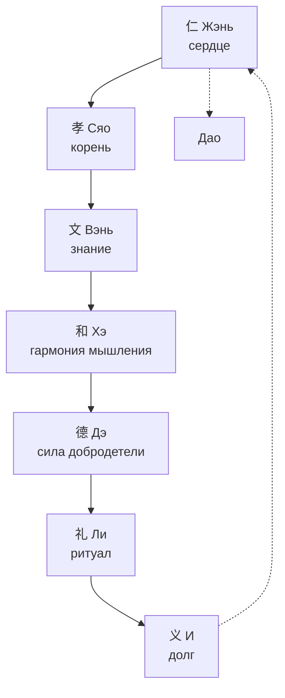

# Философия Древнего Китая

> [!abstract] О чём эта лекция
> **Зачем это нужно.** Китайская философия — это не отвлечённые теории, а проекты идеального общества и человека. Конфуцианство учит, каким должен быть благородный муж, даосизм — как следовать Дао через недеяние, а культ предков связывает оба учения с реальной обрядностью.
> **Что ты должен уметь после лекции:** назвать 5 особенностей китайской философии; объяснить идеал цзюнь-цзы через 7 принципов с иероглифами; раскрыть Дао и у-вэй; описать культ предков как мистико-обрядовую основу.

---

# Воспитание — одно из главных направлений древнекитайской философии

- Древнекитайская философия представлена в трудах многих мыслителей, которые рассматривали мир — человека, его общество и природу — как единое целое универсума.
- Труды философов (в основном Конфуция) направляют нас совершать добро и учат нравственности, бескорыстности, справедливости, сдержанности, доброжелательности, любви по отношению к людям.

---

# Особенности древнекитайской философии

## 1. Синкретизм

- Единый комплекс религиозных, мифологических и философских идей.
- В Китае нет разделения философии и религии. Есть термин **цзяо** (教, jiào) — учение. Им обозначали все духовные учения.

## 2. Особенности китайской религии

- В Китае нет веры в сверхъестественное в западном смысле.
- Идеалом религии является не что иное как естественность.
- В китайском языке отсутствует слово «бог» как единый творец; есть Небо (Тянь, 天) и духи.

## 3. Подчинённость философии политической практике

- На первом месте стояли проблемы политической этики.
- Выработка планов идеального общества:
    - управление государством
    - формирование образа идеального правителя
    - отношений между различными группами в обществе и т. д.

## 4. Разрыв философии и естествознания

- Философия и естествознание в Китае существовали отгородившись друг от друга непроходимой стеной.
- Занятие естественно-научными наблюдениями и прикладными знаниями признавалось уделом людей низших, лишённых возвышенных дел.

## 5. Комментаторский характер философии

- Источником философствования был религиозный канонический текст.
- Текст носил сакральный характер. Менять в нём ничего нельзя, его можно только комментировать.

---

# Конфуций — учитель Кун (551–479 гг. до н.э.)

> Учитель сказал: В пятнадцать лет я обратил свои помыслы к учёбе. В тридцать лет я встал на ноги. В сорок освободился от сомнений. В пятьдесят познал волю Неба. В шестьдесят научился отличать правду от неправды...

По преданию, Конфуций отредактировал «Пятикнижие» (У-цзин) и создал «Лунь юй» (Беседы и суждения).

## Учения Конфуция о человеке

- Главная проблема — это проблема воспитания нового человека.
- **«Благородный муж» (Цзюнь-цзы, 君子, jūnzǐ)** — понятие, воплотившее черты идеальной личности.
- Конфуций рассматривал человека в трёх измерениях:
    1. **Цзюнь-цзы (君子)** — идеальный человек, пример для подражания
    2. **Жэнь (人, rén — человек вообще)** — обозначение человека вообще, обычного среднего человека
    3. **Сяо-жэнь (小人, xiǎorén)** — маленький человек. Эта категория одновременно и социальная (простолюдин) и этическая (лишённый добродетели человек любого сословия)

---

# Как стать благородным мужем? — семь принципов и их иероглифы

Благородный муж никогда не успокаивается на достигнутом, он постоянно занимается самосовершенствованием в надежде постичь Дао.

> [!note] Как читать иероглифы ниже
> Для каждого принципа: **крупный иероглиф → пиньинь → разбор по ключам-радиклам → перевод и как графика раскрывает понятие**. Транслитерация — пиньинь, упрощённые иероглифы; в скобках — традиционные.

## 1. Жэнь — человеколюбие, гуманность

仁

**rén — жэнь**

- **Графика:** 仁 = **亻(人, rén, человек)** + **二 (èr, два)**. Буквально «человек и другой человек» — отношение между двумя людьми.
- **Смысл:** человеколюбие, верность, справедливость, взаимность. Высшая добродетель.
- **Как раскрывает:** иероглиф показывает, что человечность рождается в отношении, а не в изоляции.
- **Цитата:** Цзыгун спросил: «Можно ли всю жизнь руководствоваться одним словом?» Учитель ответил: «Это слово — **взаимность (恕, shù)**. Не делай другим того, чего не желаешь себе».

## 2. Сяо — сыновняя почтительность

孝

**xiào — сяо**

- **Графика:** 孝 = **耂 (lǎo, старый)** сверху + **子 (zǐ, ребёнок)** снизу. Старец над ребёнком — ребёнок поддерживает старого.
- **Смысл:** почтительность к родителям и уважение к старшим — основа жэнь.
- **Цитата:** «Благородный муж стремится к основе. Когда он достигает основы, перед ним открывается правильный путь» — сяо и есть основа.

### Виды сяо — пять отношений (у-лунь, 五伦)

1. Правителя и подчинённого
2. Отца и сына
3. Мужа и жены
4. Старшего и младшего брата
5. Друга и друга

Нарушение сяо разрушает весь порядок.

## 3. Вэнь — знание духовной культуры предков

文

**wén — вэнь**

- **Графика:** 文 — древняя пиктограмма человека с татуировкой/узором на груди — украшенный человек, культура.
- **Смысл:** знание канонов, ритуалов, музыки, истории — «культурность».
- **Как раскрывает:** без вэнь жэнь слеп: доброта без знания культуры превращается в наивность.

## 4. Хэ — гармония, самостоятельность мышления

和

**hé — хэ**

- **Графика:** 和 = **禾 (hé, злак)** + **口 (kǒu, рот)**. Совместная трапеза из общего злака — согласие.
- **Смысл в лекции:** самостоятельность мышления при сохранении гармонии; не конформизм, а взвешенное согласие.
- **Конфуций:** «Благородный муж стремится к гармонии, а не к единообразию» (和而不同).

## 5. Дэ — моральное совершенство, добродетель

德

**dé — дэ**

- **Графика:** 德 = **彳 (chì, шаг)** + **直 (zhí, прямой)** + **心 (xīn, сердце)**. Прямое сердце в поступке, шаг за шагом.
- **Смысл:** мера внутреннего этического совершенства, сила дэ как притяжение без принуждения.
- **Контекст:** «Идеальные правила существовали только в древности, поэтому тогда в Поднебесной царили культура и порядок (вэнь)» — дэ возвращает этот порядок.

## 6. Ли — ритуал, этикет

礼 (трад. 禮)

**lǐ — ли**

- **Графика:** 礼 = **礻(示, shì, алтарь)** + **豊 (lǐ, сосуд с дарами)**. Жертвоприношение у алтаря — ритуал.
- **Смысл:** манеры воспитанного человека, форма, делающая жэнь видимым.
- **Примеры из лекции:** сидеть только поджав ноги, хождение по циновкам только босиком, приём пищи палочками, волосы в пучке, опрятная одежда, отказ от брани.

> [!tip] Ли без жэнь — пустая форма
> «Если человек не обладает человеколюбием, то к чему ему ритуалы?» (Лунь юй).

## 7. И — социальный долг, справедливость

义 (трад. 義)

**yì — и**

- **Графика:** 義 = **羊 (yáng, баран — жертва)** + **我 (wǒ, я с оружием)**. Я, приносящее должное, справедливое.
- **Смысл:** долг, справедливость, правильное соотнесение своего и общего.
- **Связь:** и — внешний критерий для ли: ритуал должен быть справедливым.

> [!note] Семь как система
> **Жэнь** — сердце, **Сяо** — корень, **Вэнь** — знание, **Хэ** — мышление, **Дэ** — сила, **Ли** — форма, **И** — мера. Вместе — путь цзюнь-цзы к Дао.

---

## Жэнь — подробно

Жэнь — многозначное понятие, включающее все лучшие нравственные ценности и нормы поведения человека.

- Жэнь — принцип взаимности. Цзыгун спросил: «Можно ли всю жизнь руководствоваться одним словом?» Учитель ответил: «Это слово — взаимность. Не делай другим того, чего не желаешь себе».

## Сяо — подробно

Сяо — сыновняя почтительность к родителям и уважение к старшим. Цзюнь-цзы сказал: «Благородный муж стремится к основе. Когда он достигает основы, перед ним открывается правильный путь». Сяо — основа человеколюбия (жэнь).

## Дэ — добродетель

Мера внутреннего этического совершенства. Моральное совершенство. Согласно учению Конфуция, идеальные правила существовали только в древности, поэтому именно тогда в Поднебесной царили культура и порядок (вэнь).

## Ли — ритуалы

Манеры воспитанного человека:
1. Сидеть только поджав ноги
2. Хождение по циновкам только босиком
3. Приём пищи с помощью двух палочек
4. Волосы собраны в пучок, а не распущены
5. Всегда должна быть опрятная одежда
6. Отказ от бранных слов и др.

---

# Даосизм — Лао-цзы (604–VI в. до н.э.)

Философ, которому приписывается авторство классического даосского трактата **«Дао дэ цзин» (道德经, Dàodéjīng)**.

## Центральное понятие даосизма — Дао

道

**dào — Дао**

- Дао — всеобщая закономерность мира, первооснова всего существующего.
- Дао — космический и нравственный принцип.
- Невидимый естественный закон сущего, который управляет материальным миром.
- Дао неисчерпаемо, вечно, пусто, порождает вещи:

> Дао рождает одно, одно рождает два, два рождает три, а три рождает все существа (道生一，一生二，二生三，三生万物).

## У-вэй — недеяние

无为

**wúwéi — у-вэй**

- Совершенно мудрый не обладает человеколюбием в конфуцианском смысле и предоставляет народу возможность жить собственной жизнью.
- У-вэй — безропотное подчинение естественному пути, действие без насилия над природой вещей.

## Этика даосизма: главный принцип — недеяние

- Отказ от цивилизации и её достижений как цель, а не средство
- Идеал простоты и естественности (цзы-жань, 自然, zìrán)
- Покой, гармония с миром
- Стремление экономно расходовать жизненные силы
- Совершить 1200 добрых дел подряд — путь к бессмертию в позднем даосизме
- Воздержание от лжи, зла, кражи, излишеств, алкоголя

---

# Культ предков — мистицизм

> [!abstract] О чём блок
> Почему в Китае почитание предков стало религией без бога, как оно связано с конфуцианским ли и даосским Дао, и какие обряды делают связь миров зримой.

Культ предков в Китае — не «дополнение» к философии, а её живая почва. В синкретичном цзяо конфуцианство задало этику, даосизм — космологию, а культ предков — обрядовую практику и мистику.

## 1. Истоки и смысл

- **Род как непрерывность.** Человек — звено между предками и потомками. Почитание поддерживает **сяо** за пределами смерти и продлевает дхарму рода.
- **Предки как духи (шэнь, 神).** После смерти старший остаётся покровителем: от него зависят урожай, здоровье, удача. Забвение — разрыв Дао рода.
- **Без бога, но с Небом.** Вместо единого творца — **Тянь (天, tiān)** и множество духов предков; религия естественности строится на гармонии с ними.

## 2. Обрядность

- **Домашние алтари (цытан, 祠堂):** таблички с именами предков (пайвэй, 牌位), благовония, подношения пищи и чая.
- **Ритуалы ли:** поклоны, доклады о важных событиях (рождение, экзамен), ежегодные праздники Цинмин (清明) и Чжунъюань (中元) — уборка могил, сжигание бумажных даров.
- **Гадание и мистика:** «Книга перемен» (И-цзин, 易经) как язык общения с предками; толкование знаков, выбор дат.

## 3. Связь с конфуцианством и даосизмом

- **Конфуцианство** кодифицировало культ в **ли**: сыновняя почтительность продолжается в ритуале; нарушение ли — неуважение к предкам.
- **Даосизм** дал космологию: предки растворяются в Дао и становятся частью естественного круговорота (цзы-жань); ритуал помогает не насилием, а следованием потоку.

## 4. Мистицизм и современность

- Вера в **взаимопроникновение миров**: живые и мёртвые сосуществуют, граница — ритуал.
- В современном Китае и диаспоре культ сохраняется в семейных обрядах, хотя официальная идеология секулярна.

> [!tip] Как запомнить
> **Сяо → Ли → Культ предков → Дао:** почтительность в семье → ритуал → почитание ушедших → гармония с естественным путём.

## Материалы к сообщению

Материалы сообщения о даосизме хранятся в [[01_Дисциплины/07_Основы_Философии/02_Сообщения/00. Сообщения|разделе «Сообщения»]].

Сообщение к 05.10.2026 («Даосизм», до 10 минут) — две оценки за презентацию (PowerPoint/HTML) или одна за рассказ. Слайды и полный текст уже подготовлены в `02_Сообщения/01. Даосизм/`.

---

# Ключевые термины

| Термин | Определение |
|---|---|
| **Цзяо (教)** | Синкретичное учение — единство философии, религии и мифа в Китае |
| **Цзюнь-цзы (君子)** | Благородный муж — идеал конфуцианства |
| **Жэнь (仁)** | Человеколюбие, взаимность — сердце добродетелей |
| **Сяо (孝)** | Сыновняя почтительность — корень жэнь |
| **Вэнь (文)** | Культурность, знание канонов |
| **Хэ (和)** | Гармония и самостоятельность мышления |
| **Дэ (德)** | Моральная сила, совершенство |
| **Ли (礼)** | Ритуал, этикет — форма жэнь |
| **И (义)** | Долг, справедливость |
| **Дао (道)** | Всеобщий закон и путь вещей |
| **У-вэй (无为)** | Недеяние — следование естественному пути без насилия |
| **Культ предков** | Почитание духов предков через алтари и ритуалы ли как основа мистицизма |

---

# Типичные заблуждения

- ❌ **«Конфуцианство — религия с богом».** В Китае нет единого бога-творца; Тянь и предки — естественные, а не сверхъестественные силы.
- ❌ **«Ли — формальность».** Без жэнь ли пусто, но без ли жэнь невидимо — форма необходима.
- ❌ **«У-вэй — бездействие».** У-вэй — действие в такт Дао, без насилия, а не лень.
- ❌ **«Культ предков — суеверие».** Это система поддержания сяо и социальной непрерывности, кодифицированная в ли.

---

# Связи с другими темами

- [[01. Основные задачи и особенности философии]] — конфуцианская этика и даосская онтология как примеры разделов философии.
- [[02. Философия Древней Индии]] — сравнение пути освобождения: индийская нирвана vs китайское Дао и у-вэй; карма/дхарма vs сяо/ли.
- [[01. Психология профессиональной деятельности]] — идеал цзюнь-цзы как версия профессионального становления.
