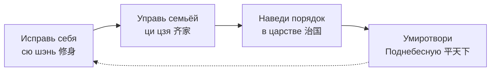
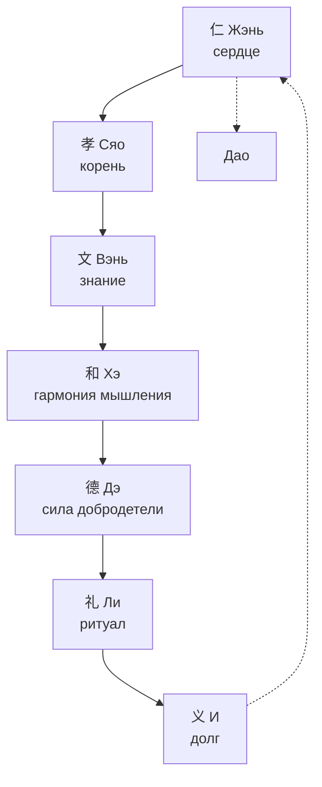
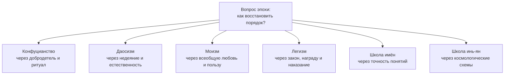

# Философия Древнего Китая

> [!abstract] Цель и задачи лекции
> **Цель:** показать древнекитайскую философию как практический проект устройства человека, семьи и государства: как конфуцианство строит нравственный порядок через ритуал и долг, как даосизм предлагает следовать естественному пути, и как культ предков связывает оба учения с живой обрядовой практикой.
> **Задачи:**
> 1. описать исторический контекст (эпоха «ста школ») и объяснить пять особенностей древнекитайской философии;
> 2. раскрыть учение Конфуция о человеке и три измерения личности;
> 3. разобрать семь принципов благородного мужа с иероглифами, пиньинем и разбором ключей;
> 4. объяснить понятия Дао, дэ, у-вэй и цзы-жань и показать их связь с этикой даосизма;
> 5. описать культ предков как мистико-обрядовую основу китайской духовности;
> 6. сравнить конфуцианство, даосизм, моизм и легизм по их ответам на вопрос о порядке.
>
> *Пояснение для начинающих (для чайника):* китайская философия почти не спрашивает «что есть бытие» — она спрашивает **«как навести порядок»**. Конфуций отвечает: через **ритуал и долг** — начни с себя и своей семьи, и порядок распространится на государство. Лао-цзы отвечает наоборот: порядок уже есть, он называется **Дао**; не мешай ему — и всё устроится само (**у-вэй**, «недеяние»). Представьте сад: конфуцианец его стрижёт, подвязывает и подписывает каждое растение; даос наблюдает, куда тянутся ветки, и подставляет подпорки там, где дерево само просит. Оба хотят, чтобы сад жил, — разница в способе.

> [!note] Как устроена лекция
> Раздел 1 — исторический контекст, раздел 2 — пять особенностей, разделы 3–5 — конфуцианство (самый большой блок), раздел 6 — даосизм, раздел 7 — культ предков, разделы 8–9 — другие школы и сравнение. Для повторения к зачёту достаточно разделов 2, 5, 6, 7.

> [!important]- Для преподавателя: как провести это занятие в группе
> **Расчёт времени:** 90 минут; материал делится на два занятия.
> **Занятие 1 (особенности и Конфуций):**
> 1. **5 мин — входной вопрос:** «Можно ли научить человека быть порядочным так же, как учат профессии?» Выводит на идею воспитания как центральной темы.
> 2. **15 мин — раздел 2:** пять особенностей; особое внимание — цзяо (нет разделения философии и религии) и подчинённость политике.
> 3. **20 мин — раздел 5:** семь иероглифов. Пишите каждый на доске крупно, разбирая ключи: графика запоминается лучше перевода.
> 4. **5 мин — закрепление:** студенты по памяти пишут 仁孝文和德礼义 и называют перевод.
> **Занятие 2 (Дао и культ предков):**
> 1. **10 мин — противопоставление:** «Конфуций наводит порядок, Лао-цзы не мешает». Разобрать цитату «Дао рождает одно…» по частям.
> 2. **15 мин — раздел 6:** Дао, дэ, у-вэй, цзы-жань; обсудить, почему у-вэй — не лень.
> 3. **15 мин — раздел 7:** культ предков: алтарь, таблички, Цинмин; спросить, какие аналоги есть в культуре студентов.
> 4. **5 мин — раздел 9:** сравнительная таблица конфуцианства и даосизма.
> **Что вынести на доску:** семь иероглифов с ключами; схема «личность → семья → государство → Поднебесная»; таблица «конфуцианство vs даосизм».
> Полный план — [[00. Методические указания по курсу «Основы философии»]].

---

# 1. Историко-культурный контекст Древнего Китая

## 1.1 Периодизация

| Период | Примерные даты | Что важно для философии |
|---|---|---|
| Шан (Инь) | XVI–XI вв. до н. э. | гадания на панцирях и костях, культ предков, верховное божество Шанди |
| Западное Чжоу | XI–VIII вв. до н. э. | идея **«мандата Неба»**, «Книга перемен», складывание ритуальной культуры |
| Чуньцю («Вёсны и осени») | 722–481 гг. до н. э. | распад единого царства, жизнь Конфуция |
| Чжаньго («Сражающиеся царства») | 475–221 гг. до н. э. | эпоха **«ста школ»**: конфуцианство, даосизм, моизм, легизм |
| Цинь | 221–207 гг. до н. э. | объединение Китая, легизм как государственная идеология |
| Хань | 202 г. до н. э. — 220 г. н. э. | конфуцианство становится официальной доктриной, система экзаменов |

## 1.2 Почему философия расцвела именно в эпоху раздробленности

Период Чуньцю и Чжаньго — время войн, распада старого ритуального порядка и социального кризиса. Философский вопрос эпохи был практическим: **как восстановить порядок, если прежние формы больше не работают?**

Отсюда три следствия, которые объясняют весь облик китайской философии:

1. **Центральная тема — порядок**, а не первооснова бытия.
2. **Философ — советник правителя**, а не только мыслитель: школы предлагали проекты управления.
3. **Много школ одновременно** («сто школ», *бай цзя*), потому что заказ на проект был у каждого правителя.

> [!note] Связь с лекцией 01
> Китайская философия VI–III вв. до н. э. попадает в **«осевое время»** К. Ясперса — тот же период, что упанишады и Будда в Индии и греческая натурфилософия. Поэтому сопоставление «Дао — Брахман», «ли — дхарма» исторически корректно.

## 1.3 Ключевые понятия контекста

| Понятие | Иероглиф | Содержание |
|---|---|---|
| **Тянь** | 天 *tiān* | Небо: высший безличный порядок и источник легитимности власти |
| **Мандат Неба** | 天命 *tiānmìng* | право править, данное Небом; утрачивается при несправедливости |
| **Ци** | 气 *qì* | жизненная энергия, «дыхание», из которой складываются все вещи |
| **Инь и ян** | 阴阳 *yīn-yáng* | две взаимодополняющие силы: тёмное/мягкое и светлое/активное |
| **Пять стихий** | 五行 *wǔxíng* | дерево, огонь, земля, металл, вода — схема взаимопревращений |
| **И-цзин** | 易经 *Yìjīng* | «Книга перемен»: система гексаграмм, язык описания изменений |

---

# 2. Особенности древнекитайской философии

Пять особенностей (материал курса), каждая раскрыта подробно.

## 2.1 Синкретизм

**Содержание:** древнекитайская философия — **единый комплекс религиозных, мифологических и философских идей**. В Китае нет разделения философии и религии в европейском смысле.

**Ключевое понятие:** **цзяо** (教, *jiào*) — «учение». Этим словом обозначали **любые** духовные учения: конфуцианство (*жу цзяо*), даосизм (*дао цзяо*), позже буддизм (*фо цзяо*).

**Графика иероглифа 教:** слева — 孝 (*xiào*, почтительность, ср. знак 子 «ребёнок») и 爻 (перекрестье, знак обучения), справа — 攵 (рука с палочкой, действие). Буквально: **учить через почтительность и действие** — то есть учение неразрывно связано с воспитанием и практикой, а не только с теорией.

**Следствие:** один человек мог одновременно исполнять конфуцианские ритуалы, даосские практики и буддийские обряды. Отсюда устойчивая формула «три учения — одна семья» (*сань цзяо*).

## 2.2 Особенности китайской религии: религия естественности

**Содержание (материал курса):**

- в Китае нет веры в сверхъестественное в западном смысле;
- идеалом религии является **естественность**;
- в китайском языке нет слова «бог» как единого творца; есть **Небо (Тянь, 天)** и **духи (шэнь, 神)**.

**Уточнение (дополнение):** в древних текстах встречается **Шанди** (上帝, *Shàngdì*) — верховное божество шанской эпохи, и иероглиф 神 (*shén*) обозначает духов и божеств. Речь поэтому идёт не об отсутствии слова, а об **отсутствии идеи личного бога-творца, создавшего мир из ничего**. Небо-Тянь — это не личность, а **высший безличный порядок**, которому следует и человек, и правитель.

**Следствие:** религиозность в Китае строится не на вере в догматы, а на **согласовании с естественным порядком** — через ритуал, предков и следование Дао.

## 2.3 Подчинённость философии политической практике

**Содержание:** на первом месте стояли проблемы **политической этики**. Философия вырабатывала планы идеального общества:

- устройство управления государством;
- образ идеального правителя;
- отношения между различными группами общества.

**Почему так сложилось:** философ выступал как советник правителя, а его учение — как проект реформы. Отсюда характерный жанр: трактат-наставление правителю.

**Пример:** в «Лунь юй» на вопрос об управлении Конфуций отвечает, что править — значит «исправлять»: если имена правильны, речь в порядке; если речь в порядке, дела идут; если дела идут, ритуал и музыка процветают; если ритуал в порядке, наказания уместны; если наказания уместны, народ знает, куда себя девать. Это прямая логическая цепочка от этики к государственному устройству.

## 2.4 Разрыв философии и естествознания

**Содержание:** философия и естествознание в Китае существовали, **«отгородившись друг от друга непроходимой стеной»**. Занятие естественно-научными наблюдениями и прикладными знаниями признавалось **уделом людей низших**, лишённых возвышенных дел.

**Пояснение:** в Китае были развиты астрономия, математика, медицина, но они оставались **техникой** и не становились теорией природы в философском смысле. Философа интересовало «как управлять и как жить», а не «почему падает тело».

**Следствие:** отсутствие связки «философия природы → теоретическое естествознание», которая в Европе позже дала научную революцию. Это не «отсталость», а **другая организация знания**: приоритет был у этики и управления.

## 2.5 Комментаторский характер философии

**Содержание:** источником философствования был **канонический текст**, носивший сакральный характер. Менять в нём ничего нельзя — **его можно только комментировать**.

**Как это работало:** новый философ не провозглашал новое учение с нуля, а писал комментарий к «Лунь юй», «И-цзину» или «Дао дэ цзину» — и через толкование проводил свою мысль.

**Следствия:**

- **плюс:** сохранение традиции, преемственность, высокая культура чтения;
- **минус:** новизна маскируется под толкование, спор между школами ведётся как спор о прочтении одного текста.

> [!example] Пример для понимания
> Неоконфуцианец **Чжу Си** (1130–1200) не писал «нового конфуцианства»: он составил комментарии и выделил **«Четверокнижие»** («Лунь юй», «Мэн-цзы», «Да сюэ», «Чжун юн»), которое стало основой государственных экзаменов. Фактически он переформатировал традицию — формально оставшись комментатором.

---

# 3. Воспитание — одно из главных направлений древнекитайской философии

**Положения материала курса:**

- Древнекитайская философия представлена в трудах многих мыслителей, которые рассматривали мир — человека, его общество и природу — как **единое целое универсума**.
- Труды философов (в основном Конфуция) направляют нас совершать добро и учат **нравственности, бескорыстности, справедливости, сдержанности, доброжелательности, любви по отношению к людям**.

**Почему именно воспитание:** если порядок в государстве держится на нравственности людей, а не на силе, то **главная политическая задача — воспитание**. Отсюда логическая цепочка, ставшая классической формулой конфуцианства (из трактата «Да сюэ», «Великое учение»):

*Диаграмма: конфуцианская логика «личность → семья → государство → Поднебесная». Порядок распространяется снизу вверх; сбой в начале ломает всю цепь.*

> [!tip] Как это понимать сегодня
> Модель «начни с себя» — не лозунг, а **онтологическая схема**: общество рассматривается как продолжение личности, а не как отдельный механизм. Поэтому испорченный чиновник — не «ошибка в системе», а симптом непорядка в человеке.

---

# 4. Конфуций — учитель Кун

## 4.1 Биография и тексты

**Конфуций** (латинизированная форма имени **Кун-цзы**, 孔子, *Kǒngzǐ* — «учитель Кун»), **551–479 гг. до н. э.**, уроженец царства Лу.

**Основные вехи (по традиции):** происходил из обедневшей аристократической семьи; занимал невысокие должности, включая управление строительством и складами; около тринадцати лет странствовал по царствам, предлагая правителям своё учение, но не получил поста; вернулся в Лу и посвятил последние годы преподаванию. По традиции, число учеников доходило до трёх тысяч, а ближайших — около семидесяти.

> Учитель сказал: В пятнадцать лет я обратил свои помыслы к учёбе. В тридцать лет я встал на ноги. В сорок освободился от сомнений. В пятьдесят познал волю Неба. В шестьдесят научился отличать правду от неправды…

Эта цитата — не автобиография, а **модель жизненного пути**: учение → устойчивость → свобода от сомнений → понимание Неба → безошибочное суждение. Она читается как программа самовоспитания на всю жизнь.

**Тексты:**

| Текст | Содержание |
|---|---|
| **«Пятикнижие» (У-цзин, 五经)** | По преданию, отредактировано Конфуцием: «Ши цзин» (Книга песен), «Шу цзин» (Книга истории), «И цзин» (Книга перемен), «Ли цзи» (Книга ритуалов), «Чуньцю» (летопись «Вёсны и осени») |
| **«Лунь юй» (论语)** | «Беседы и суждения» — запись высказываний Конфуция и бесед с учениками; **20 глав**; составлена учениками и их преемниками |

> [!note] Важная оговорка об авторстве
> Сам Конфуций, по общему мнению исследователей, ничего не писал: «Лунь юй» — запись его учеников, складывавшаяся в течение десятилетий и достигшая канонической формы к началу эпохи Хань. Поэтому корректно говорить: «в “Лунь юй” передано высказывание Конфуция».

## 4.2 Учение Конфуция о человеке: три измерения

**Главная проблема учения — проблема воспитания нового человека.** Ключевое понятие — **«благородный муж» (цзюнь-цзы, 君子, *jūnzǐ*)**, воплотившее черты идеальной личности.

Конфуций рассматривал человека в трёх измерениях:

| Термин | Иероглиф | Кто это |
|---|---|---|
| **Цзюнь-цзы** | 君子 *jūnzǐ* | **идеальный человек**, пример для подражания; буквально «сын правителя», но у Конфуция — не происхождение, а достоинство |
| **Жэнь** | 人 *rén* | **человек вообще**, обычный средний человек (не путать с добродетелью 仁 — то же чтение, другой иероглиф) |
| **Сяо-жэнь** | 小人 *xiǎorén* | **«маленький человек»**: одновременно социальная категория (простолюдин) и этическая (человек без добродетели любого сословия) |

> [!important] Главное нововведение Конфуция
> До Конфуция «цзюнь-цзы» означало **знатного по рождению**. Конфуций переопределил понятие: благородным делает **не кровь, а добродетель**. Это переворот: путь к достоинству открыт через учение и самовоспитание. Именно поэтому воспитание стало центральной темой всей китайской философии.

**Три других ключевых принципа учения (дополнение):**

1. **Исправление имён (чжэн мин, 正名).** Вещь должна называться своим именем: «правитель должен быть правителем, подданный — подданным, отец — отцом, сын — сыном». Беспорядок начинается не с действий, а с расхождения слов и должного.
2. **Золотая середина (чжун юн, 中庸).** Добродетель — середина между избытком и недостатком; смелость без меры — безрассудство, щедрость без меры — расточительство.
3. **Учение (сюэ, 学).** Человек становится собой через учёбу и практику, а не по природе: «Учиться и не размышлять — напрасно терять время; размышлять и не учиться — опасно».

## 4.3 Последователи: Мэн-цзы и Сюнь-цзы (дополнение)

| Мыслитель | Даты | Ключевая идея |
|---|---|---|
| **Мэн-цзы** (孟子, *Mèngzǐ*) | ок. 372–289 гг. до н. э. | природа человека **добра**; зло — результат утраты врождённых ростков добродетели |
| **Сюнь-цзы** (荀子, *Xúnzǐ*) | ок. 310–235 гг. до н. э. | природа человека **неупорядочена**; порядок создаётся воспитанием и ритуалом |

Оба — конфуцианцы, но с противоположной отправной точкой. Это полезно для понимания: **конфуцианство — не монолит**, внутри него шёл спор о природе человека, от которого зависела вся программа воспитания.

---

# 5. Как стать благородным мужем — семь принципов и их иероглифы

Благородный муж никогда не успокаивается на достигнутом: он постоянно занимается **самосовершенствованием** в надежде постичь Дао.

> [!note] Как читать иероглифы ниже
> Для каждого принципа даны: **крупный иероглиф → пиньинь (транслитерация) → разбор по ключам-радикалам → смысл → цитата или пример → как это работает в жизни**. Транслитерация — пиньинь, иероглифы упрощённые; в скобках — традиционные начертания. Ключ (радикал) — смысловая часть иероглифа: она подсказывает, о какой области идёт речь.

## 5.1 Жэнь — человеколюбие, гуманность

仁

<b>rén — жэнь</b>

- **Графика:** 仁 = **亻(人, rén, «человек»)** + **二 (èr, «два»)**. Буквально: «человек и ещё один человек» — отношение между двумя.
- **Смысл:** человеколюбие, верность, справедливость, взаимность. **Высшая добродетель**, объединяющая все остальные.
- **Как графика раскрывает понятие:** человечность рождается **в отношении**, а не в изоляции: одинокий человек не может быть жэнь — для неё нужен другой.
- **Цитата:** Цзыгун спросил: «Можно ли всю жизнь руководствоваться одним словом?» Учитель ответил: «Это слово — **взаимность (恕, shù)**. Не делай другим того, чего не желаешь себе».
- **Для чайника:** жэнь — это «поставь себя на место другого» как **постоянная установка**, а не разовое сочувствие.
- **Когда нарушается:** когда забота о «своих» превращается в пренебрежение к чужим; когда вежливость есть, а внимания к человеку нет.

## 5.2 Сяо — сыновняя почтительность

孝

<b>xiào — сяо</b>

- **Графика:** 孝 = **耂 (lǎo, «старый»)** сверху + **子 (zǐ, «ребёнок»)** снизу. Старец над ребёнком — ребёнок поддерживает старого.
- **Смысл:** почтительность к родителям и уважение к старшим — **корень жэнь**: тот, кто не научился уважению в семье, не научится ему и в обществе.
- **Цитата:** «Благородный муж стремится к основе. Когда он достигает основы, перед ним открывается правильный путь» — сяо и есть эта основа.
- **Для чайника:** семья — «тренажёр» нравственности. Отношения «родитель — ребёнок» задают шаблон всех остальных: уважение к руководителю, к учителю, к старшему коллеге.
- **Когда нарушается:** когда забота о родителях формальна (деньги без участия) или когда почтительность подменяет честность: сяо не требует соглашаться с ошибкой родителя — традиция прямо говорит о долге почтительного увещевания.

### Пять отношений (у-лунь, 五伦)

Структура социальных связей, в каждой из которых своя взаимная обязанность:

| № | Отношение | Что требуется от старшего | Что требуется от младшего |
|---|---|---|---|
| 1 | Правитель и подчинённый | справедливость и забота | преданность |
| 2 | Отец и сын | любовь и пример | почтительность (сяо) |
| 3 | Муж и жена | ответственность | поддержка |
| 4 | Старший и младший брат | покровительство | уважение |
| 5 | Друг и друг | доверие (взаимность) | верность |

> [!important] Отношения взаимны
> У-лунь — **не одностороннее подчинение**: в каждом отношении обязанность есть у обеих сторон. Правитель, не заботящийся о подданных, теряет мандат Неба; отец, не подающий примера, теряет основание требовать сяо.

## 5.3 Вэнь — знание духовной культуры предков

文

<b>wén — вэнь</b>

- **Графика:** 文 — древняя пиктограмма человека с узором (татуировкой) на груди: **украшенный человек**, то есть человек культурный.
- **Смысл:** знание канонов, ритуалов, музыки, истории, поэзии — «культурность» как освоение наследия.
- **Как раскрывает понятие:** без вэнь жэнь слепо: доброта без знания культуры превращается в наивность, а чувство меры — в произвол.
- **Для чайника:** вэнь — это «культурный слой», без которого добрые намерения нечем реализовать: вы хотите поддержать человека, но не знаете, что в данной ситуации уместно.
- **Когда нарушается:** когда знание традиций становится самоцелью и эрудиция подменяет нравственность (Конфуций предупреждал и об этом).

## 5.4 Хэ — гармония, самостоятельность мышления

和

<b>hé — хэ</b>

- **Графика:** 和 = **禾 (hé, «злак»)** + **口 (kǒu, «рот»)**. Совместная трапеза из общего злака — согласие при сохранении различий.
- **Смысл в лекции:** **самостоятельность мышления при сохранении гармонии**; не конформизм, а взвешенное согласие.
- **Цитата:** «Благородный муж стремится к гармонии, а не к единообразию» (和而不同, *hé ér bù tóng* — «в гармонии, но не одинаковы»).
- **Для чайника:** в хорошей команде люди спорят и остаются в рабочем согласии; в плохой — все соглашаются, а проблемы копятся. Первое — хэ, второе — его имитация.
- **Когда нарушается:** когда «гармония» требует молчать о проблеме, чтобы не портить отношения.

## 5.5 Дэ — моральное совершенство, добродетель

德

<b>dé — дэ</b>

- **Графика:** 德 = **彳 (chì, «шаг»)** + **直 (zhí, «прямой»)** + **心 (xīn, «сердце»)**. Прямое сердце, выраженное в поступке, — шаг за шагом.
- **Смысл:** мера внутреннего этического совершенства; **сила дэ** — способность притягивать людей без принуждения.
- **Контекст из лекции:** «Идеальные правила существовали только в древности, поэтому тогда в Поднебесной царили культура и порядок (вэнь)» — дэ возвращает этот порядок.
- **Для чайника:** дэ — это авторитет, который не требует напоминать о себе: за человеком с дэ идут добровольно. Управление через дэ Конфуций сравнивал с Полярной звездой: она остаётся на месте, а все остальные обращаются к ней.
- **Когда нарушается:** когда власть опирается только на наказание и страх: порядок держится, пока смотрят.

## 5.6 Ли — ритуал, этикет

礼 (трад. 禮)

<b>lǐ — ли</b>

- **Графика:** 礼 = **礻(示, shì, «алтарь», «дух»)** + **豊 (lǐ, «сосуд с дарами»)**. Жертвоприношение у алтаря — ритуал.
- **Смысл:** манеры воспитанного человека; **форма, делающая жэнь видимым**.
- **Примеры из лекции:** сидеть только поджав ноги; ходить по циновкам только босиком; принимать пищу двумя палочками; волосы собирать в пучок, а не распускать; всегда опрятная одежда; отказ от бранных слов.
- **Для чайника:** ли — «протокол взаимодействия». Как в программировании: содержание важно, но без согласованного формата обмена сообщение не дойдёт. Правила этикета — не украшение, а способ сделать уважение **наблюдаемым**.
- **Когда нарушается:** в обе стороны — и когда ритуал исполняют без чувства, и когда «искренность» оправдывает грубость.

> [!tip] Ли без жэнь — пустая форма
> «Если человек не обладает человеколюбием, то к чему ему ритуалы?» («Лунь юй»). Формула работает и обратно: без ли жэнь остаётся невидимым и неорганизованным.

## 5.7 И — социальный долг, справедливость

义 (трад. 義)

<b>yì — и</b>

- **Графика:** 義 = **羊 (yáng, «баран» — жертвенное животное)** + **我 (wǒ, «я», изображение оружия)**. Я, приносящее должное, — справедливое действие.
- **Смысл:** долг, справедливость, правильное соотнесение своего и общего; поступок «потому что должно», а не «потому что выгодно».
- **Классическое противопоставление:** **и 義 (долг) против ли 利 (выгода)**. Благородный муж знает долг, маленький человек — выгоду.
- **Связь с ли:** и — **внешний критерий** для ли: ритуал должен быть справедливым, иначе форма поддерживает неправду.
- **Для чайника:** и — это ответ на вопрос «что я должен, даже если мне это невыгодно»: вернуть найденное, признать свою ошибку, не сваливать ответственность на коллегу.

## 5.8 Семь принципов как система

| Принцип | Иероглиф | Роль в системе |
|---|---|---|
| **Жэнь** | 仁 | сердце: содержание добродетели |
| **Сяо** | 孝 | корень: где добродетель зарождается |
| **Вэнь** | 文 | знание: чем добродетель образована |
| **Хэ** | 和 | мышление: как добродетель соотносится с другими |
| **Дэ** | 德 | сила: как добродетель действует на людей |
| **Ли** | 礼 | форма: как добродетель проявляется |
| **И** | 义 | мера: как добродетель сверяется со справедливостью |

*Диаграмма: путь благородного мужа — от сяо через ли и и к Дао.*

> [!example] Как семь принципов работают в одной ситуации
> Студент видит, что одногруппник списывает на экзамене.
> - **Жэнь** не позволяет ни донести из злорадства, ни пройти мимо безразлично.
> - **Хэ** требует не разрушать отношения, но и не подыгрывать.
> - **И** задаёт критерий: списывание несправедливо по отношению к тем, кто готовился.
> - **Ли** подсказывает форму: поговорить наедине, а не устраивать публичный разбор.
> - **Дэ** определяет результат: если вас уважают, разговор подействует сильнее, чем жалоба.
> Так этика Конфуция работает не как список запретов, а как **набор согласованных ориентиров**.

---

# 6. Даосизм — Лао-цзы и «Дао дэ цзин»

## 6.1 Лао-цзы и текст

**Лао-цзы** (老子, *Lǎozǐ* — «Старый учитель») — философ, которому приписывается авторство классического даосского трактата **«Дао дэ цзин»** (道德经, *Dàodéjīng*).

**Легендарная биография:** по преданию, служил хранителем архивов при чжоуском дворе; встретился с Конфуцием; покинул Китай, уходя на запад, и на заставе по просьбе начальника заставы Инь Си изложил своё учение в пяти тысячах знаков, после чего исчез.

**Датировка (важно для точности):** традиционные даты жизни — **VI в. до н. э.** (в конспекте — 604 г. до н. э. как традиционная дата рождения); современные исследователи считают, что текст складывался постепенно и принял близкую к нынешней форму примерно в **IV–III вв. до н. э.**, а авторство Лао-цзы — вопрос традиции, а не установленный факт.

**Структура трактата:**

| Параметр | Значение |
|---|---|
| Объём | **81 чжан** (глава), около **5000 иероглифов** |
| Части | **Дао цзин** — главы 1–37 (о пути); **Дэ цзин** — главы 38–81 (о силе-дэ) |
| Жанр | афоризмы в стихотворной форме, без последовательного сюжета |
| Следствие жанра | множество толкований: отсюда комментаторская традиция |

## 6.2 Центральное понятие даосизма — Дао

道

<b>dào — Дао</b>

- **Графика:** 道 = **辶(辵, chuò, «движение, путь»)** + **首 (shǒu, «голова»)**. Дорога, по которой идёт «голова» — то есть осмысленное движение, направление.
- **Дао — всеобщая закономерность мира**, первооснова всего существующего.
- **Дао — космический и нравственный принцип одновременно**: закон природы и норма поведения не разделены.
- **Дао — невидимый естественный закон сущего**, который управляет материальным миром.
- **Дао неисчерпаемо, вечно, пусто и порождает вещи:**

> Дао рождает одно, одно рождает два, два рождает три, а три рождает все существа (道生一，一生二，二生三，三生万物).

**Как читать эту цитату:** это схема порождения многообразия из единства: единое Дао → первичное единство → два начала (инь и ян) → три (их взаимодействие) → всё множество вещей. Числа здесь — не счёт, а **логика развёртывания**: простота порождает сложность, не переставая быть основой.

**Отрицательная характеристика Дао (важно):** «Дао, которое может быть выражено словами, не есть постоянное Дао» (первая фраза трактата). Дао нельзя определить как вещь — его описывают через образы: вода, долина, пустота сосуда, не обработанное дерево (朴, *pǔ*, «простота»).

> [!example] Образ воды — почему он центральный
> Вода мягче всего, но точит камень; она занимает низкие места, которые другие отвергают, и потому становится морем. Даосский идеал: **уступая, побеждаешь; находясь внизу, становишься выше**. Это не мораль смирения, а наблюдение за тем, как устроено естественное усилие.

## 6.3 Дэ — сила Дао

**Дэ** (德, *dé*) в даосизме — **проявление Дао в конкретной вещи**: то, что делает вещь собой. Если Дао — всеобщий путь, то дэ — индивидуальная «мощь» существа, его природная полнота.

| Понятие | Смысл | Пример |
|---|---|---|
| **Дао** | всеобщий путь и закон | русло реки |
| **Дэ** | проявление Дао в вещи, её сила | вода, текущая по этому руслу |

**Для чайника:** Дао — законы природы, дэ — то, насколько конкретное существо соответствует своей природе. У дерева дэ — расти, у человека — жить осознанно и просто.

## 6.4 У-вэй — недеяние

无为

<b>wúwéi — у-вэй</b>

- **Графика:** 无 (*wú*, «не, без») + 为 (*wéi*, «делать, действовать»). Буквально — «неделание».
- **Совершенно мудрый не обладает человеколюбием в конфуцианском смысле и предоставляет народу возможность жить собственной жизнью.**
- **У-вэй — безропотное подчинение естественному пути**, действие без насилия над природой вещей.

> [!important] У-вэй — не бездействие
> Это **действие в такт Дао**: минимум навязанного, максимум следования естественному ходу. Сравнение из «Дао дэ цзина»: управлять государством — как жарить мелкую рыбу: если постоянно переворачивать, она развалится.
> **Три признака у-вэй:** (1) действие вовремя, а не заранее; (2) усилие соразмерно, а не максимально; (3) результат достигается, но исполнитель «не присваивает» его.

**Классический пример — притча о поваре Дине** (из «Чжуан-цзы»): повар разделывает тушу так, что нож служит ему девятнадцать лет и не тупится. Секрет не в силе, а в том, что лезвие идёт **по естественным промежуткам**, а не рубит кости. Мораль: мастерство — это не насилие над материалом, а знание его структуры.

## 6.5 Цзы-жань — естественность

**Цзы-жань** (自然, *zìrán*) — буквально «сам так», «само-собой». В даосизме — идеал **естественности**: состояние, при котором вещь действует согласно своей природе, без внешнего принуждения.

Связка понятий: **Дао** задаёт путь → **у-вэй** — способ двигаться по нему → **цзы-жань** — результат: естественность существования.

## 6.6 Этика даосизма: главный принцип — недеяние

Положения материала курса, раскрытые по пунктам:

| Принцип | Содержание | Практическое следствие |
|---|---|---|
| **Отказ от цивилизации** | достижения цивилизации — цель, а не средство; они усложняют желания и уводят от природы | критика роскоши, статусного потребления |
| **Идеал простоты и естественности (цзы-жань)** | жить согласно природе, а не согласно моде | умеренность, минимум искусственных потребностей |
| **Покой и гармония с миром** | спокойствие как условие ясности | медитация, дыхательные практики |
| **Экономия жизненных сил** | не растрачивать ци напрасно | режим, умеренность, отсутствие суеты |
| **1200 добрых дел** | путь к бессмертию в позднем (религиозном) даосизме | этическая дисциплина как условие духовного результата |
| **Воздержание** | отказ от лжи, зла, кражи, излишеств, алкоголя | пять запретов как минимум практики |

> [!note] Уточнение про «1200 добрых дел»
> Это требование относится к **религиозному даосизму**, оформившемуся спустя века после Лао-цзы. В трактате **«Баопу-цзы»** (抱朴子) даосского мыслителя **Гэ Хуна** (283–343) сказано: чтобы стать «земным бессмертным», нужно накопить **300** добрых дел, а чтобы стать «небесным бессмертным» — **1200**; при этом одно серьёзное нарушение обнуляет накопленное. Важно, что Гэ Хун прямо связывал даосское бессмертие с конфуцианскими добродетелями — верностью и сыновней почтительностью: это пример того самого синкретизма (п. 2.1).

## 6.7 Философский и религиозный даосизм (дополнение)

| Линия | Что это | Тексты и имена |
|---|---|---|
| **Философский даосизм** | учение о Дао, у-вэй и естественности | «Дао дэ цзин», «Чжуан-цзы» (ок. IV–III вв. до н. э.) |
| **Религиозный даосизм** | обряды, пантеон, практики долголетия, алхимия | оформился к III–V вв. н. э.; Гэ Хун, даосские храмы и ритуалы |

**Чжуан-цзы** — второй по значимости автор: его тексты полны притч и парадоксов. Знаменитый фрагмент — **«сон о бабочке»**: Чжуан-цзы приснилось, что он бабочка; проснувшись, он не знает — то ли он человек, которому снилась бабочка, то ли бабочка, которой снится человек. Смысл: границы «я» и различения вещей условны перед лицом Дао.

---

# 7. Культ предков — мистицизм

> [!abstract] О чём блок
> Почему в Китае почитание предков стало религией без бога, как оно связано с конфуцианским ли и даосским Дао, и какие обряды делают связь миров зримой.

Культ предков в Китае — не «дополнение» к философии, а её **живая почва**. В синкретичном цзяо конфуцианство задало этику, даосизм — космологию, а культ предков — обрядовую практику и мистику.

## 7.1 Истоки и смысл

- **Род как непрерывность.** Человек — звено между предками и потомками. Почитание поддерживает **сяо** за пределами смерти и продлевает долг рода. Смерть не разрывает отношений: она меняет их форму.
- **Предки как духи (шэнь, 神).** После смерти старший остаётся покровителем рода: от него зависят урожай, здоровье, удача потомков. Забвение предков — **разрыв связи рода**, источник несчастий.
- **Без бога, но с Небом.** Вместо единого творца — **Тянь (天, tiān)** и множество духов предков; религия естественности строится на гармонии с ними, а не на вере в догматы.
- **Древность практики.** Гадания на панцирях и костях в шанскую эпоху — уже форма обращения к предкам; то есть культ древнее самой философии и стал её материалом.

## 7.2 Обрядность

| Обряд | Термин | Содержание |
|---|---|---|
| **Домашний алтарь** | цытан (祠堂) | место почитания в доме или родовой зал; таблички с именами предков — **пайвэй (牌位)**, благовония, подношения пищи и чая |
| **Поклоны и доклады** | в рамках ли | поклоны перед табличками; доклад предкам о важных событиях: рождении, свадьбе, успешном экзамене, переезде |
| **Цинмин** | 清明 | праздник «ясной светлости» (апрель): уборка и приведение в порядок могил, подношения |
| **Чжунъюань** | 中元 | праздник «среднего праздника» (седьмой месяц): поминовение, в том числе безродных душ |
| **Гадание** | И-цзин (易经) | «Книга перемен» как язык общения с миром предков; толкование знаков, выбор дат и решений |

**Почему обряд важен теоретически:** ритуал делает отношение к невидимому **наблюдаемым и повторяемым**. Для конфуцианства это доказательство силы ли, для даосизма — способ двигаться вместе с естественным круговоротом.

## 7.3 Связь с конфуцианством и даосизмом

- **Конфуцианство** кодифицировало культ в **ли**: сыновняя почтительность продолжается в ритуале; нарушение ли — неуважение к предкам. При этом сам Конфуций говорил о духах сдержанно: «почитай духов, но держись от них в отдалении»; на вопрос о служении духам он отвечал, что сначала надо научиться служить людям. То есть культ сохранён как **нравственная практика**, а не как мистическая доктрина.
- **Даосизм** дал космологию: предки растворяются в Дао и становятся частью естественного круговорота (цзы-жань); ритуал помогает не насилием, а следованием потоку.
- **Итог:** одно и то же действие (поклон у алтаря) читается в двух учениях по-разному — как исполнение долга и как следование естественному порядку. Это и есть синкретизм в действии.

## 7.4 Мистицизм и современность

- **Взаимопроникновение миров.** Живые и умершие сосуществуют; граница между мирами поддерживается **ритуалом**: пока ритуал исполняется, связь не рвётся.
- **Мистическая логика.** Отношения с предками взаимны: потомки дают почитание и подношения, предки — покровительство. Это не «сделка», а продолжение семейной взаимности за пределы смерти.
- **Современность.** В Китае и в диаспоре культ сохраняется в семейных обрядах — алтари, Цинмин, подношения, — хотя официальная идеология секулярна. В XX в. практика переживала периоды жёстких ограничений, но бытовая форма оказалась устойчивее институтов.

> [!tip] Как запомнить
> **Сяо → Ли → Культ предков → Дао:** почтительность в семье → ритуал → почитание ушедших → гармония с естественным путём.

---

# 8. Другие школы эпохи «ста школ» (дополнение)

Чтобы ответить на вопрос «чем конфуцианство отличается от других проектов порядка», нужны его конкуренты.

*Диаграмма: шесть ответов на один вопрос эпохи. Дублируется файлом `Диаграммы/Китай_сто_школ.drawio.svg`.*

| Школа | Основатель / представитель | Ключевая идея | Критика со стороны оппонентов |
|---|---|---|---|
| **Моизм** (墨家) | **Мо-цзы** (ок. 470–391 до н. э.) | **всеобщая любовь (цзянь ай, 兼爱)**: заботиться о чужих как о своих; критерий — польза для народа; осуждение завоевательных войн | Мэн-цзы: всеобщая любовь отменяет особое отношение к родителям, то есть разрушает сяо |
| **Легизм** (法家) | **Шан Ян**, **Хань Фэй-цзы** (ок. 280–233 до н. э.) | человек движим выгодой; порядок создаёт **закон (фа, 法)** с неотвратимой наградой и наказанием | конфуцианцы: закон без добродетели даёт послушание без совести |
| **Школа имён** (名家) | **Гунсунь Лун**, **Хуэй Ши** | точность понятий; знаменитый софизм «белая лошадь — не лошадь» | критиковали как пустую словесную игру |
| **Школа инь-ян** (阴阳家) | **Цзоу Янь** | объяснение истории и природы через инь-ян и пять стихий | сводит этику к космологической схеме |

> [!note] Кто победил исторически
> В царстве Цинь победу дал **легизм** — жёсткая дисциплина позволила объединить Китай (221 г. до н. э.). Но уже при Хань официальной доктриной стало **конфуцианство**, а легистская техника управления осталась внутри государства. Устойчивая формула поздней традиции: «снаружи конфуцианец, внутри легист» (и даос в частной жизни).

---

# 9. Сравнение конфуцианства и даосизма

| Критерий | Конфуцианство | Даосизм |
|---|---|---|
| **Идеал человека** | цзюнь-цзы — благородный муж | шэн жэнь — совершенномудрый |
| **Источник порядка** | воспитание, ритуал, долг | естественный ход Дао |
| **Способ действия** | активное самосовершенствование и служение | у-вэй — действие без насилия |
| **Отношение к обществу** | служение, ответственность, иерархия | дистанция, уединение, простота |
| **Отношение к ритуалу (ли)** | основа нравственной жизни | искусственная надстройка |
| **Отношение к знанию** | учёба (сюэ) и культурное наследие (вэнь) | отказ от накопленного знания ради простоты |
| **Ключевая метафора** | Полярная звезда, вокруг которой всё обращается | вода, занимающая низкие места |
| **Слабое место (в критике оппонента)** | формализм, подмена чувства обрядом | пассивность, отказ от ответственности |

> [!tip] Как отвечать на экзамене
> Не противопоставляйте школы «в лоб». Корректная формула: **обе отвечают на один вопрос о порядке, но по-разному понимают источник беспорядка.** Конфуций видит причину в неисполнении долга, Лао-цзы — в избытке вмешательства. Дальше приводите по одному примеру на каждую позицию.

---

# 10. Значение древнекитайской философии

1. **Конфуцианство стало государственной доктриной** эпохи Хань и оставалось основой образования и отбора чиновников через систему экзаменов (кэцзюй) более двух тысячелетий.
2. **Сформировалась модель образования** как социального лифта: достоинство определяется учёбой, а не рождением (следствие переопределения понятия цзюнь-цзы).
3. **Культурное влияние за пределами Китая** — Корея, Япония, Вьетнам: иероглифика, экзаменационная система, нормы семейного поведения.
4. **Неоконфуцианство** (Чжу Си, XI–XII вв.) собрало традицию в систему и закрепило «Четверокнижие» как канон.
5. **Даосизм дал китайской культуре** образ природы, эстетику простоты, практики саморегуляции и язык описания изменений.
6. **Культ предков обеспечил устойчивость** социальной ткани: род как институт переживал смену династий и режимов.

---

# 11. Задания для семинара и самостоятельной работы

1. **Иероглифы по памяти.** Напишите 仁 孝 文 和 德 礼 义 крупно, проговаривая ключ каждого и называя перевод. Затем проверьте себя по таблице п. 5.8.
2. **Кейс «ли без жэнь».** Опишите ситуацию (в семье, в учебной группе, на работе), где форма соблюдена, а содержание утрачено. Объясните, какой принцип нарушен и что бы сделал благородный муж.
3. **Конфуций против Лао-цзы.** Дана проблема: команда перегружена задачами и срывает сроки. Сформулируйте решение с конфуцианской и с даосской позиций. Сравните, что каждая потеряет.
4. **Разбор цитаты.** «Дао рождает одно, одно рождает два, два рождает три, а три рождает все существа». Объясните каждую ступень и приведите свой пример «развёртывания простого в сложное».
5. **Культ предков в сравнении.** Найдите в своей культуре практику поминовения и сравните её по трём пунктам: что делается, зачем, кто обязан. Сделайте вывод о функции ритуала.
6. **Школы и современность.** Определите, какая школа (конфуцианство, даосизм, моизм, легизм) стоит за каждой из управленческих практик: система KPI и штрафы; корпоративная культура и кодексы; политика «не мешай команде работать»; благотворительные программы компании.

---

# Ключевые термины

| Термин | Определение |
|---|---|
| **Цзяо (教)** | «Учение»: синкретичное единство философии, религии и мифа в Китае |
| **Тянь (天)** | Небо: высший безличный порядок и источник легитимности власти |
| **Мандат Неба (天命)** | Право править, данное Небом; утрачивается при несправедливости |
| **Цзюнь-цзы (君子)** | Благородный муж: идеал личности, определяемый добродетелью, а не рождением |
| **Сяо-жэнь (小人)** | «Маленький человек»: простолюдин или человек без добродетели |
| **Жэнь (仁)** | Человеколюбие, взаимность — сердце всех добродетелей |
| **Сяо (孝)** | Сыновняя почтительность — корень жэнь |
| **Вэнь (文)** | Культурность, знание наследия предков |
| **Хэ (和)** | Гармония при сохранении различий; самостоятельность мышления |
| **Дэ (德)** | Моральная сила и совершенство; в даосизме — проявление Дао в вещи |
| **Ли (礼)** | Ритуал, этикет — форма, делающая жэнь видимым |
| **И (义)** | Долг и справедливость, противоположность выгоде (利) |
| **У-лунь (五伦)** | Пять типов отношений с взаимными обязанностями |
| **Чжэн мин (正名)** | «Исправление имён»: соответствие слов и должного |
| **Чжун юн (中庸)** | Золотая середина: добродетель между избытком и недостатком |
| **Дао (道)** | Всеобщий закон и путь вещей; первооснова, неисчерпаемая и безымянная |
| **У-вэй (无为)** | Недеяние: действие в такт естественному порядку, без насилия |
| **Цзы-жань (自然)** | Естественность, «сам-так-бытие» |
| **Ци (气)** | Жизненная энергия, «дыхание» мира |
| **Инь-ян (阴阳)** | Две взаимодополняющие силы мироздания |
| **И-цзин (易经)** | «Книга перемен»: система гексаграмм и язык описания изменений |
| **Культ предков** | Почитание духов предков через алтари и ритуалы ли |
| **Цытан (祠堂) / пайвэй (牌位)** | Родовой алтарь / таблички с именами предков |
| **Цинмин (清明) / Чжунъюань (中元)** | Праздники поминовения: уборка могил / поминание душ |
| **Бай цзя (百家)** | «Сто школ»: множество философских направлений эпохи Чжаньго |
| **Легизм (法家)** | Школа закона: порядок через норму, награду и наказание |
| **Моизм (墨家)** | Школа Мо-цзы: всеобщая любовь и критерий пользы |

---

# Типичные заблуждения

- ❌ **«Конфуцианство — религия с богом».** В Китае нет идеи единого бога-творца, создавшего мир из ничего; Тянь и духи предков — естественные силы и высший безличный порядок, а не личное божество.
- ❌ **«Ли — это формальность и показуха».** Без жэнь ли пусто, но без ли жэнь невидимо и неорганизованно: форма — способ сделать уважение наблюдаемым.
- ❌ **«У-вэй — это бездействие и лень».** У-вэй — действие в такт Дао, соразмерное и своевременное. Пример повара Дина: нож идёт по естественным промежуткам, и работа делается с меньшим усилием.
- ❌ **«Цзюнь-цзы — это знатный человек».** До Конфуция — да; у Конфуция благородным делает добродетель и учение, а не происхождение.
- ❌ **«Конфуцианство требует слепого подчинения старшим».** У-лунь — система **взаимных** обязанностей; традиция прямо предусматривает почтительное увещевание родителя или правителя.
- ❌ **«Даосизм против цивилизации вообще».** Критика относится к избытку искусственных потребностей и вмешательству, а не к труду как таковому: идеал — простота, а не деградация.
- ❌ **«Культ предков — суеверие».** Это система поддержания сяо и социальной непрерывности, кодифицированная в ли; сам Конфуций относился к духам сдержанно, сохраняя ритуал как нравственную практику.
- ❌ **«Даосизм и конфуцианство исключают друг друга».** В реальной жизни они сосуществовали: одна и та же личность могла быть конфуцианцем на службе и даосом в уединении — следствие синкретизма (цзяо).
- ❌ **«“Дао дэ цзин” написан Лао-цзы как единый текст».** Авторство традиционно; текст складывался постепенно и оформился примерно в IV–III вв. до н. э.

---

# Вопросы для самопроверки

1. Назовите пять особенностей древнекитайской философии и объясните каждую.
2. Что означает термин «цзяо» и почему он важен для понимания китайской духовности?
3. Какие исторические условия породили «сто школ»?
4. Почему воспитание стало центральной темой китайской философии?
5. Перечислите три измерения человека у Конфуция. В чём новизна понятия «цзюнь-цзы»?
6. Разберите семь принципов благородного мужа: иероглиф, пиньинь, ключ, смысл.
7. Объясните формулу «ли без жэнь — пустая форма, жэнь без ли — невидимо».
8. Что такое Дао? Почему о нём говорят «неисчерпаемо, вечно, пусто»?
9. Что такое у-вэй и чем он отличается от бездействия? Приведите пример.
10. В чём смысл требования «1200 добрых дел» и к какой линии даосизма оно относится?
11. Опишите культ предков: истоки, обрядность, связь с конфуцианством и даосизмом, современность.
12. Сравните конфуцианство, даосизм, моизм и легизм по ответу на вопрос о порядке.

> [!example]- Ответы
> 1. Синкретизм (единство философии, религии и мифа — цзяо); религия естественности (нет идеи бога-творца, есть Тянь и духи); подчинённость политической практике (проекты идеального общества); разрыв философии и естествознания (прикладные знания считались уделом низших); комментаторский характер (сакральный канон можно только толковать).
> 2. Цзяо (教) — «учение»; так называли любые духовные учения: жу цзяо (конфуцианство), дао цзяо (даосизм), фо цзяо (буддизм). Важно, потому что показывает отсутствие границы между философией и религией: учение — это одновременно мировоззрение, практика и обряд.
> 3. Распад единого царства, войны и кризис ритуального порядка в эпохи Чуньцю и Чжаньго. Философский заказ шёл от правителей: каждая школа предлагала проект восстановления порядка, поэтому школ было много и они конкурировали.
> 4. Если порядок держится на нравственности людей, а не на силе, то главная политическая задача — воспитание. Схема «исправь себя → управь семьёй → наведи порядок в царстве → умиротвори Поднебесную» делает личное совершенствование основой государственного порядка.
> 5. Цзюнь-цзы (君子) — идеальный человек; жэнь (人) — человек вообще; сяо-жэнь (小人) — «маленький человек» в социальном и этическом смысле. Новизна: до Конфуция цзюнь-цзы означало знатность по рождению, у Конфуция — достоинство, достигаемое учением и добродетелью.
> 6. 仁 rén (亻+二) — человеколюбие, взаимность; 孝 xiào (耂+子) — сыновняя почтительность; 文 wén (узор на груди) — культурность; 和 hé (禾+口) — гармония при различии; 德 dé (彳+直+心) — моральная сила; 礼 lǐ (礻+豊) — ритуал; 义 yì (羊+我) — долг и справедливость.
> 7. Ли без жэнь — ритуал, исполняемый без внутреннего содержания: пустая форма. Жэнь без ли — доброе отношение, не имеющее формы выражения: оно остаётся невидимым и неорганизованным, а значит, не может стать нормой для других.
> 8. Дао (道) — всеобщая закономерность и первооснова всего, одновременно космический и нравственный принцип. «Неисчерпаемо, вечно, пусто» — потому что Дао не вещь и не имеет пределов: оно описывается через образы пустоты и воды и не определяется словами («Дао, которое может быть выражено словами, не есть постоянное Дао»).
> 9. У-вэй (无为) — «недеяние»: действие в такт естественному порядку, без насилия над природой вещей. Отличие от бездействия — в соразмерности и своевременности: например, повар Дин ведёт нож по естественным промежуткам, поэтому работает легче и дольше других.
> 10. Требование относится к религиозному даосизму; в «Баопу-цзы» Гэ Хуна 300 добрых дел дают «земное бессмертие», 1200 — «небесное», а серьёзное нарушение обнуляет накопленное. Важно, что добрые дела понимаются в том числе как конфуцианские добродетели (верность, сяо) — пример синкретизма.
> 11. Истоки: человек как звено рода, предки как духи-покровители, Тянь вместо бога-творца. Обрядность: домашний алтарь цытан с табличками пайвэй, поклоны и доклады, праздники Цинмин и Чжунъюань, гадание по И-цзину. Связь: конфуцианство кодифицировало культ в ли, даосизм дал космологию растворения в Дао. Современность: практика сохраняется в семейных обрядах при секулярной официальной идеологии.
> 12. Конфуцианство — порядок через добродетель, ритуал и воспитание; даосизм — через у-вэй и естественность; моизм — через всеобщую любовь и критерий пользы; легизм — через закон с неотвратимой наградой и наказанием. Исторически победил синтез: конфуцианская идеология при легистской технике управления.

---

# Источники и рекомендуемая литература

**Первичная основа — материалы занятий** (преп. Минбулатова И. Г.): пять особенностей, Конфуций и три измерения человека, семь принципов, Дао и у-вэй, этика даосизма, культ предков.

**Дополнительно:**

1. «Лунь юй» («Беседы и суждения») — академические переводы (в том числе П. С. Попова, В. А. Кривцова).
2. «Дао дэ цзин» — академические переводы (в том числе Ян Хиншуна, Е. А. Торчинова).
3. «Чжуан-цзы» — внутренние главы, включая притчу о поваре Дине.
4. Stanford Encyclopedia of Philosophy — статьи о Конфуции, Лао-цзы, даосизме, моизме: <https://plato.stanford.edu/>.
5. Internet Encyclopedia of Philosophy — разделы по китайской философии: <https://iep.utm.edu/>.
6. Справочные материалы к сообщению о даосизме — [[01_Дисциплины/07_Основы_Философии/02_Сообщения/01. Даосизм/Источники|Источники]].

---

# Что из материала преподавателя, а что добавлено

| Блок | Источник |
|---|---|
| Пять особенностей (синкретизм и цзяо, религия естественности, подчинение политике, разрыв с естествознанием, комментаторство) | материал занятий; уточнено про Шанди и 神 |
| Воспитание как главное направление; труды Конфуция о нравственности | материал занятий |
| Конфуций (551–479 гг. до н. э.), цитата «в пятнадцать лет…», «Пятикнижие», «Лунь юй», три измерения человека | материал занятий |
| Семь принципов с иероглифами (仁孝文和德礼义), цитаты о взаимности (恕), «гармония, а не единообразие», примеры ли | материал занятий; графика ключей, примеры и «когда нарушается» — расширение |
| Дао (道), цитата «Дао рождает одно…», у-вэй (无为), этика даосизма, 1200 добрых дел | материал занятий; уточнены структура трактата и датировка, добавлен источник требования (Гэ Хун) |
| Культ предков: четыре раздела | материал занятий; расширены термины обрядности и связь с учениями |
| Периодизация, «сто школ», Тянь и мандат Неба, чжэн мин, чжун юн, у-лунь, Мэн-цзы и Сюнь-цзы, дэ, цзы-жань, Чжуан-цзы, моизм, легизм, школа имён, школа инь-ян, экзаменационная система, неоконфуцианство | дополнение по учебной и справочной литературе |
| Задания, вопросы для самопроверки | авторская методическая разработка |

---

# Связи с другими темами

- [[01. Основные задачи и особенности философии]] — конфуцианская этика и даосская онтология как примеры разделов философии; образ Дао как «путь духовного развития» (особенность 4).
- [[02. Философия Древней Индии]] — сравнение путей освобождения: индийская нирвана и китайское Дао/у-вэй; дхарма и ли как нормативные системы; обе традиции относятся к «осевому времени».
- [[01_Дисциплины/07_Основы_Философии/00_Курс|00_Курс]] — оглавление дисциплины, карта понятий и подготовка к экзамену.
- [[00. Методические указания по курсу «Основы философии»]] — планы занятий, вопросы к зачёту, критерии оценки.
- [[01_Дисциплины/07_Основы_Философии/02_Сообщения/01. Даосизм/Текст выступления|Сообщение «Даосизм»]] — развёрнутое устное выступление по разделу 6 с притчей о поваре Дине.
- [[01_Дисциплины/07_Основы_Философии/02_Сообщения/00. Сообщения|Обзор сообщений]] — навигация по устным выступлениям дисциплины.
- [[01. Психология профессиональной деятельности]] (дисциплина 04) — идеал цзюнь-цзы как версия профессионального становления: путь через учение и практику.
- [[05_Психология_Общения/Коммуникативная сторона общения]] (дисциплина 05) — ли и у-лунь как нормативная модель коммуникации.
- [[01. Введение в технологию разработки ПО]] (дисциплина 01) — Дао как аналогия архитектуры: путь, по которому система «течёт» естественно, без принуждения.
