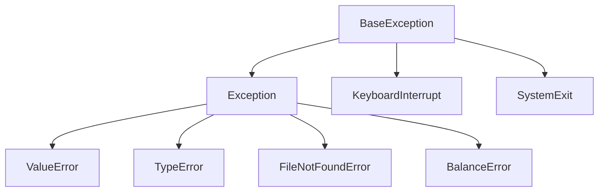
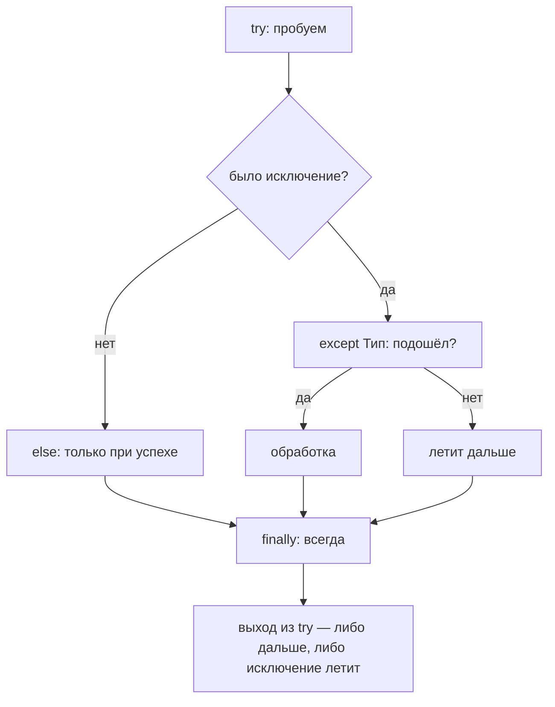

# 01. Обработка ошибок полностью

> [!abstract] О чём лекция
> В курсе Python ты уже писал `try / except ValueError` чтобы программа не падала на `int("abc")`. Здесь — **вся** конструкция целиком: `try → except → else → finally`, `raise`, `raise ... from`, свои классы ошибок и `assert`. Главное правило: **лови только то, на что знаешь что ответить; остальное — пусть падает громко и понятно**. Ошибка — не стыд, а сообщение: чем точнее оно, тем быстрее чинить.
>
> После лекции ты будешь отличать `except Exception: pass` (вред) от `except ValueError as e: log...; raise` (польза) и понимать, зачем `else` вообще существует.

> [!tip] Опора
> База: `try/except` с конкретным типом из [[05. Язык Python - идентификаторы, операторы, типы данных]] и проверка ввода из [[07. Линейный алгоритм]]. Если там уверенно, здесь просто добавляем детали. Код запускай в `uv` — все примеры копируемы.

---

# Зачем это нужно — «упасть рядом с причиной»

Представь банкомат. Ты вводишь `250` при балансе `100`. Что лучше:
- **А)** молча выдать `None` и идти дальше — а потом упасть в другом месте («баланс `None`»)?
- **Б)** сразу сказать: `BalanceError: не хватает 150.00` и показать где?

Вариант **Б** — инженерный. Ошибку видно *в месте проверки*, а не через 10 функций.

Три идеи, к которым будем возвращаться:

1. **Fail fast** — проверь аргументы сразу и кинь понятную ошибку (`raise ValueError`).
2. **Узкий `try`** — оборачивай только одну опасную строчку, а не весь файл.
3. **Не глотай** — `except: pass` стирает улику. Лучше залогировать и перебросить `raise`.

---

# Иерархия — кто кого ловит

Все ошибки в Python — объекты. Иерархия упрощённо:



Почему важно: `except Exception` **не ловит** `KeyboardInterrupt` (Ctrl+C) и `SystemExit` — и это правильно. Свои ошибки наследуй от `Exception`, никогда от `BaseException`, иначе твою `MyError` не поймает обычный `except Exception`.

Правило порядка в `except`: от частного к общему.

```python
try:
    ...
except FileNotFoundError:
    ...  # сначала узкое
except OSError:
    ...  # потом широкое — FileNotFoundError это подвид OSError
except Exception:
    ...  # самое широкое — последним
```

Если поменять местами — широкий `except` проглотит узкий, и второй никогда не сработает.

---

# Вся конструкция — как она идёт по шагам



Код-образец со всеми четырьмя частями:

```python
class BalanceError(Exception):
    """Свой смысл + данные внутри."""

    def __init__(self, amount: float, balance: float) -> None:
        super().__init__(f"не хватает {amount - balance:.2f} руб.")
        self.amount = amount
        self.balance = balance


def withdraw(balance: float, amount: float) -> float:
    if amount <= 0:
        raise ValueError("сумма должна быть положительной")
    if amount > balance:
        raise BalanceError(amount, balance)
    return balance - amount


for bal, amt in [(100, 30), (100, -5), (100, 250)]:
    try:
        result = withdraw(bal, amt)          # ← только опасный вызов
    except ValueError as err:
        print(f"ValueError: {err}")
    except BalanceError as err:
        print(f"BalanceError: {err}; не хватило {err.amount - err.balance:.2f}")
    else:
        print(f"Успех: остаток {result}")     # ← сюда только если не было исключения!
    finally:
        print("--- попытка обработана ---")
```

Вывод:

```text
Успех: остаток 70
--- попытка обработана ---
ValueError: сумма должна быть положительной
--- попытка обработана ---
BalanceError: не хватает 150.00 руб.; не хватило 150.00
--- попытка обработана ---
```

Таблица — зачем каждая часть:

| Часть | Когда | Зачем | Типично |
|---|---|---|---|
| `try` | всегда | опасный вызов | одна строка: `int(text)`, `open(...)`, `json.load` |
| `except X` | если `X` (или наследник) | обработать ожидаемое | `except ValueError as e:` |
| `else` | если **не было** исключения | код успеха, который нельзя прятать в `try` | валидация результата |
| `finally` | **всегда** — успех, ошибка, `return`, `break` | освободить ресурс | `file.close()`, `lock.release()` |

> [!warning] `else` — не украшение
> Если положить `result = withdraw(...); print(result)` внутрь `try`, то и `print` попадёт под `except`. Ошибка в `print` (опечатка) будет поймана как `ValueError` — и ты увидишь «не число» вместо настоящей причины. `else` отделяет «что пробуем» от «что делаем при успехе».

Крошечный пример, где без `else` ловишь не то:

```python
# ПЛОХО: в try две вещи
try:
    data = json.loads(text)        # может быть JSONDecodeError
    print(data["timeout"])         # а тут KeyError — но поймает тот же except!
except json.JSONDecodeError:
    print("кривой json")

# ХОРОШО: в try только опасное, остальное в else
try:
    data = json.loads(text)
except json.JSONDecodeError:
    print("кривой json")
else:
    print(data["timeout"])         # KeyError уже не спрячется
```

---

# `finally` — и что вместо него

`finally` выполняется **даже если** в `try` был `return`:

```python
def demo(x: int) -> int:
    try:
        if x < 0:
            raise ValueError("отрицательное")
        return x * 2
    finally:
        print("finally сработал")   # напечатается и при return, и при исключении

print(demo(5))
```

```text
finally сработал
10
```

Ловушка: `return` внутри `finally` **перетрёт** всё.

```python
def bad() -> int:
    try:
        return 1
    finally:
        return 2   # ← тихо проглотит и return 1, и любое исключение!

print(bad())  # 2 — ошибка исчезла
```

Правило: в `finally` **только уборка**, никаких `return`/`raise`.

В современном Python для уборки чаще используют `with` (контекст-менеджер) — он внутри делает тот же `finally`:

```python
# вместо try/finally с close
with open("data.txt", encoding="utf-8") as f:
    text = f.read()
# файл закроется сам, даже при исключении
```

Запомни: `finally` или `with` — но не голый `open` без закрытия.

---

# Свои исключения — имя = смысл

Стандартных (`ValueError`, `KeyError`) хватает для общих случаев. Когда у ошибки **свой бизнес-смысл**, заведи класс:

```python
class BalanceError(Exception):
    def __init__(self, amount: float, balance: float) -> None:
        super().__init__(f"не хватает {amount - balance:.2f} руб.")
        self.amount = amount
        self.balance = balance
```

Что даёт:

- **Имя объясняет** — `except BalanceError` читается как фраза.
- **Данные внутри** — `err.amount`, `err.balance` вместо парсинга строки.
- **Точечная ловля** — не поймаешь чужое.

Как оформлять (по [документации Python](https://docs.python.org/3/tutorial/errors.html#user-defined-exceptions) и [Real Python](https://realpython.com/python-exceptions/)):

- наследуй от `Exception`, имя с суффиксом `Error`;
- сообщение — человеческое, данные — в атрибутах;
- документируй в docstring функции, что она может кинуть `BalanceError`.

Антипример: кидать `Exception("не хватает")` — ловить придётся тоже `except Exception`, и ты поймаешь вообще всё.

---

# `raise`, `raise e` и `raise ... from` — три разных смысла

```python
def load_count(text: str) -> int:
    try:
        return int(text)
    except ValueError as e:
        # Вариант 1: просто перебросить как есть — traceback не теряется
        # raise
        # Вариант 2: перевести в свою ошибку, сохранив причину
        raise ValueError(f"не число: {text!r}") from e
        # Вариант 3: скрыть причину (редко нужно)
        # raise ValueError(f"не число: {text!r}") from None

try:
    load_count("abc")
except ValueError as err:
    print("ошибка:", err)
    print("причина:", repr(err.__cause__))
```

```text
ошибка: не число: 'abc'
причина: ValueError("invalid literal for int() with base 10: 'abc'")
```

Разница — принципиальна для отладки:

| Запись | Что делает с traceback | `__cause__` | Когда |
|---|---|---|---|
| `raise` (без аргументов) | перебрасывает **тот же** объект, строка указывает на исходное место | — | залогировал и кидаешь дальше |
| `raise ValueError(...) from e` | цепочка: «выше была `e`, из-за неё — новая» + фраза *The above exception was the direct cause...* | `e` | переводишь низкоуровневую ошибку в доменную |
| `raise ValueError(...) from None` | гасит цепочку — показываешь только новую | `None` (подавляет) | шумная низкоуровневая деталь не нужна пользователю |
| `raise e` (с переменной) | может **сбросить** traceback на текущую строку — теряешь место исходной ошибки | — | не делай, используй `raise` |

Правило из [Python docs](https://docs.python.org/3/reference/simple_stmts.html#the-raise-statement): хочешь сохранить причину — `from e`; хочешь пробросить — голый `raise`.

Мини-упражнение — проверь сам:

```python
# 1) голый raise сохраняет строку ValueError внутри int()
try:
    try: int("x")
    except ValueError: raise
except ValueError as e: print("голый raise — строка int:", e.__traceback__.tb_lineno)

# 2) raise e — строка уже здесь
try:
    try: int("x")
    except ValueError as e: raise e
except ValueError as e: print("raise e — строка raise e:", e.__traceback__.tb_lineno)
```

---

# `assert` — не для пользователя

```python
def average(numbers: list[float]) -> float:
    assert len(numbers) > 0, "среднее пустого списка не определено"
    return sum(numbers) / len(numbers)
```

`assert` — это **страховка программиста**: «этот код я считаю невозможным». От `raise ValueError` отличается двумя вещами:

- `assert` выключается флагом `python -O` — все проверки исчезнут из байт-кода (см. [доку](https://docs.python.org/3/reference/simple_stmts.html#the-assert-statement));
- `assert` кидает `AssertionError` без смысла для пользователя.

Поэтому:

- `assert` — для инвариантов внутри: «список не пуст, потому что я уже проверил выше»;
- `if ...: raise ValueError` — для всего, что пришло извне (ввод, файл, сеть).

Никогда не пиши `assert user_input.isdigit()` — при `python -O` проверка пропадёт и данные уйдут дальше.

---

# Чего делать нельзя — шпаргалка антипаттернов

| Плохо | Почему больно | Как правильно |
|---|---|---|
| `except: pass` / `except Exception: pass` | стирает улику, программа идёт дальше сломанной, падать будет в другом месте | лови **конкретный** тип; если глотаешь — хотя бы `logging.exception` |
| `except:` без типа | ловит даже `KeyboardInterrupt` (Ctrl+C) | `except Exception:` если уж широко, но лучше узко |
| Широкий `try` на 30 строк | прячешь опечатки под обработку ввода | в `try` — **один** опасный вызов, остальное в `else` |
| `except Exception as e: raise e` | сбрасывает traceback | `raise` без аргументов |
| `return` / `raise` в `finally` | гасит предыдущий `return` и исключение | в `finally` только `close`/`release` |
| Парсить `str(err)` чтобы узнать тип | сообщение меняется между версиями Python | сравнивай `type(err)` и читай атрибуты `err.amount` |
| `return None` вместо ошибки | вызывающий не узнаёт о проблеме, будет `NoneType has no attr` потом | `raise ValueError(...)` или явный `Result`-объект |
| `assert` для проверки ввода | исчезнет под `-O` | `if not ...: raise` |

> [!tip] Узкий `try` + `logging` вместо `print`
> В учебном коде `print` ок, в проекте — `import logging; logging.exception("не удалось...")`. `logging.exception` сам печатает traceback — не нужно `print(e)`.

---

# Как это делают в проекте — 4 правила

1. **Дели ошибки на ожидаемые и неожиданные.** `FileNotFoundError`, `JSONDecodeError`, `BalanceError` — ожидаемые, их обрабатываешь и даёшь понятное сообщение. Всё остальное — пусть падает с полным traceback, его увидит лог.
2. **Свои исключения — часть интерфейса.** Если модуль может кинуть `BalanceError`, это пишут в docstring функции и ловят именно `BalanceError`, а не `Exception`.
3. **В `finally`/`with` — только ресурсы.** Никакой бизнес-логики.
4. **Ни одной тихой ошибки.** Любой `except` либо восстанавливает работу (дефолт, повтор), либо логирует и перебрасывает. Пустых `except` в код-ревью не пропускают — [Real Python](https://realpython.com/python-exceptions/) и [гид по исключениям 3.12](https://docs.python.org/3/tutorial/errors.html) сходятся в этом.

Мини-паттерн «попроси снова» (ожидаемая ошибка — обрабатываем):

```python
def ask_int(prompt: str) -> int:
    while True:
        try:
            return int(input(prompt))
        except ValueError:
            print("Нужно целое число, попробуйте ещё раз.")
```

---

# Типичные заблуждения — коротко

| Думают | На самом деле |
|---|---|
| «Чем больше `try`, тем надёжнее» | Надёжность — в проверках и тестах, лишний `try` только прячет баги |
| «`except Exception` — защита от всего» | Защита и от опечаток — баг всплывёт позже и в другом месте |
| «`finally` — только для файлов» | Для любых ресурсов: соединение, лок, временный файл |
| «`assert` = `raise`» | `assert` выключается `-O` и не для пользователя |
| `else` не нужен | Нужен, чтобы не ловить ошибки успеха |

---

# Проверь себя

1. Чем `else` отличается от кода сразу после `try/except`?
2. Зачем `raise ... from e`, если сообщение и так понятное?
3. Почему `except Exception: pass` опаснее, чем отсутствие `try`?
4. Когда своя `BalanceError` лучше `ValueError`?
5. Почему `assert` не годится для `int(input())`?
6. Что будет, если в `finally` написать `return 2`?

> [!success]- Ответы
> 1. `else` выполняется **только** если исключения не было, и его ошибки **не** попадают в `except`. Это отделение «пробуем» от «делаем при успехе».
> 2. Связывает две ошибки явно: в `__cause__` лежит причина, а traceback пишет «direct cause». Без `from` связь остаётся лишь как `__context__`, и код не отличит перевод от совпадения.
> 3. Ошибка исчезает — программа идёт дальше с битыми данными; падение случится позже и в другом месте, искать дольше.
> 4. Когда у ошибки есть смысл и данные (`amount`, `balance`) — её можно поймать точечно и показать «не хватило 150».
> 5. `python -O` стирает все `assert` — проверка исчезнет именно когда данные пришли извне.
> 6. `return` из `finally` перетрёт и предыдущий `return`, и любое исключение — ошибка тихо исчезнет.

---

# Практика

[[08. Тесты]] научит проверять и такие случаи (`pytest.raises`), а [[09. Отладка и диагностика]] — читать traceback и `logging`. Сейчас: [[01. Практика. Исключения, обработка ошибок и аннотации типов]] — три задачи: своё исключение с `from`, разбор файла с ошибками, типизированный модуль под `mypy`.

---

# Опора на дисциплину 02

- [[05. Язык Python - идентификаторы, операторы, типы данных]] — `try/except` одной веткой и `int(input())`.
- [[07. Линейный алгоритм]] — проверка ввода: откуда вообще берётся `ValueError`.

---

# Связи с другими темами

- [[02. Типизация и аннотации]] — опишем ошибки и данные типами.
- [[08. Тесты]] — `pytest.raises(BalanceError)` — тест что функция падает правильно.
- [[09. Отладка и диагностика]] — `traceback` и `logging.exception`.
- [Python Tutorial — Errors and Exceptions](https://docs.python.org/3/tutorial/errors.html) · [raise statement](https://docs.python.org/3/reference/simple_stmts.html#the-raise-statement) · [Real Python — Exceptions](https://realpython.com/python-exceptions/)

