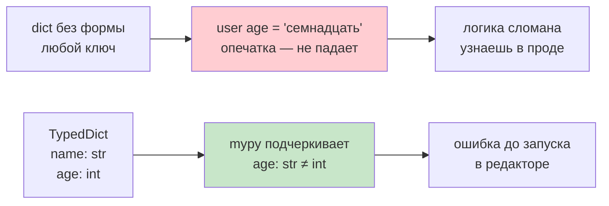
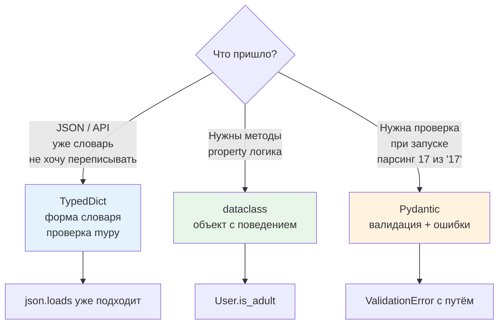

# 03. Словари с формой — TypedDict и современный синтаксис

> [!abstract] О чём лекция
> В базовом курсе словарь — мешок пар «ключ → значение» без правил: любой ключ, любое значение. Здесь словарь получает **форму**: какие ключи обязательны, какие опциональны, какие только для чтения. Инструмент — `TypedDict` — не меняет поведение программы во время выполнения, но даёт подсказки редактору и проверке типов. Разберём, когда брать `TypedDict`, когда `dataclass`, и где уже нужен `Pydantic`.
> **Ключевая мысль:** `TypedDict` — это «словарь как запись» с проверкой формы до запуска, а не во время.

> [!tip] Что нужно знать заранее
> [[11. Кортежи, списки, словари]] — словари и `get`; [[02. Типизация и аннотации]] — `dict[str, int]` и `Any`. `TypedDict` не заменяет словарь — он его описывает.

---

# Зачем форма у словаря



Без формы словарь принимает всё:

```python
user = {"name": "Аня", "age": 17}
user["age"] = "семнадцать"   # опечатка — программа не падает, но логика сломана
user["city"] = "..."         # лишний ключ — тоже никто не заметит
```

Если словарь — это «запись» с фиксированными полями (пользователь, настройки, ответ API), хотелось бы увидеть ошибку ещё до запуска. `TypedDict` именно это и делает — но **только** при проверке типов (`mypy`, `pyright`), а не во время выполнения.

---

# Базовый `TypedDict`

```python
from typing import TypedDict

class User(TypedDict):
    name: str
    age: int

u: User = {"name": "Аня", "age": 17}   # ok
# u: User = {"name": "Аня"}            # ошибка проверки: пропущен age
# u: User = {"name": "Аня", "age": "17"} # ошибка: age не int
```

По умолчанию все ключи — **обязательны** (`required=True`).

**Необязательные ключи — `NotRequired`:**

```python
from typing import TypedDict, NotRequired

class User(TypedDict):
    name: str
    age: int
    city: NotRequired[str]     # можно опустить

a: User = {"name": "Аня", "age": 17}                # ok
b: User = {"name": "Аня", "age": 17, "city": "Клгд"} # ok
```

Старое имя `total=False` — то же, что «все необязательны», сейчас предпочитают `NotRequired`.

> [!warning] `TypedDict` не проверяет во время выполнения
> Аннотация — подсказка, интерпретатор её игнорирует:
> ```python
> u: User = {"name": "Аня", "age": "семнадцать"}  # запустится без ошибки
> ```
> Ловит только `mypy`/`pyright`. Если нужна проверка при запуске — уже `Pydantic` или ручная.

---

# Современный синтаксис (Python 3.11+ / 3.12)

**`Required` — обратно «сделать обязательным» внутри `total=False`:** полезно для миграции старых описаний, но сейчас чаще пишут класс с `NotRequired` точечно.

**`ReadOnly`** — поле только для чтения (не менять после создания):

```python
from typing import TypedDict, ReadOnly

class Config(TypedDict):
    host: ReadOnly[str]   # менять нельзя: config["host"] = "new" — ошибка проверки
    port: int
```

**Распаковка словарей — `Unpack` и `**kwargs` (PEP 692):**

```python
from typing import TypedDict, Unpack

class UserKw(TypedDict):
    name: str
    age: NotRequired[int]

def create_user(**kwargs: Unpack[UserKw]) -> User:
    return {"name": kwargs["name"], "age": kwargs.get("age", 18)}  # type checker проверит вызовы
```

**Наследование форм:**

```python
class Base(TypedDict):
    id: int

class Extended(Base):
    name: str   # id + name
```

---

# `TypedDict` vs `dataclass` vs `Pydantic` — когда что



| Вопрос | `TypedDict` | `@dataclass` | `Pydantic` |
|---|---|---|---|
| Что это | словарь с формой | класс с полями | класс с валидацией и парсингом |
| Проверка | только `mypy` до запуска | немного (`__post_init__` руками) | при создании объекта, с исключениями |
| Создание | `{"name": "Аня"}` | `User(name="Аня")` — с методами | `User(name="Аня")` + `model_validate({...})` |
| JSON | `json.loads` уже словарь — подходит | нужно конвертировать | `model_dump()` / `model_validate_json()` |
| Мутабельность | обычный словарь | обычно изменяемый / `frozen=True` | по умолчанию мутабельный, есть `frozen` |

Правило новичка:

- **Пришёл JSON / API и нужно просто описать форму словаря без переделки кода — `TypedDict`.**
- **Нужны методы, `@property`, логика — `dataclass`.**
- **Нужна проверка при запуске, парсинг строки `"17"` → `17`, сообщения об ошибках — `Pydantic`** (разбор в курсе `03. Pydantic`, там `TypedDict` расширяется).

Пример выбора:

```python
# JSON с API — удобно как TypedDict, не переписывая места где уже словари
from typing import TypedDict, NotRequired

class ApiUser(TypedDict):
    id: int
    name: str
    email: NotRequired[str]

def handle(data: ApiUser) -> None:
    print(data["name"])

# Та же сущность как объект с поведением — dataclass
from dataclasses import dataclass

@dataclass
class UserObj:
    name: str
    age: int
    def is_adult(self) -> bool:
        return self.age >= 18
```

---

# Практика и нюансы

**Нюанс 1. Ключи, которые не идентификаторы — функциональный синтаксис:**

```python
from typing import TypedDict

# ключ "user-name" нельзя написать как поле класса
User2 = TypedDict("User2", {"user-name": str, "age": int})
```

**Нюанс 2. `TypedDict` не имеет методов.** Это описание, а не класс: `User.keys` не существует. Хочешь методы — `dataclass`.

**Нюанс 3. Вложенность — описывай каждый уровень:**

```python
class Address(TypedDict):
    city: str
    zip: NotRequired[str]

class UserWithAddr(TypedDict):
    name: str
    address: Address
```

**Нюанс 4. `dict` vs `Mapping`:** аннотация `dict` — изменяемый словарь, `Mapping` — только чтение. Для аргумента «не меняю» точнее `Mapping[str, int]`.

**Нюанс 5. Проверка не спасёт от лишних ключей в `**kwargs` без `Unpack`:** просто `**kwargs: User` не проверит имена ключей; нужен `Unpack[User]`.

> [!warning] Не путай `TypedDict` и `dataclass` при валидации
> `UserTyped: TypedDict = {"age": "17"}` — `mypy` поймает, но запуск — нет. `UserData(age="17")` с `@dataclass` тоже запустится. Только `Pydantic` упадёт с `ValidationError` и покажет путь к полю — это его работа.

---

# Хорошие практики

1. **Описывай то, что уже словарь.** Если функция принимает `dict` и ты знаешь ключи — заведи `TypedDict` рядом с функцией.
2. **Не смешивай миры.** Либо везде словари с `TypedDict`, либо везде объекты. Смесь `user["name"]` и `user.name` в одном файле — источник опечаток.
3. **Отмечай `NotRequired` точечно.** Лучше `city: NotRequired[str]` чем `total=False` на весь словарь.
4. **Для JSON-API держи схему узкой.** `NotRequired` для каждого нового опционального поля, а не `extra` без проверки.
5. **Оставляй вход гибким, выход строгим.** Принимай `Mapping` / `TypedDict`, возвращай конкретный `TypedDict` или `dataclass`.

---

# Типичные заблуждения

- ❌ **«`TypedDict` проверяет во время выполнения»** — только `mypy`/`pyright`.
- ❌ **«`TypedDict` можно создать как класс с методами»** — нельзя, методы игнорируются.
- ❌ **«`total=False` и `NotRequired` — одно и то же»** — `total=False` делает все ключи необязательными, `NotRequired` — один ключ.
- ❌ **«`TypedDict` заменяет `dataclass`»** — нет, это разные уровни: форма словаря vs объект с поведением.

---

# Ключевые термины

| Термин | Определение |
|---|---|
| **`TypedDict`** | описание формы словаря для проверки типов |
| **`NotRequired` / `Required`** | делает один ключ необязательным / обязательным |
| **`ReadOnly`** | ключ только для чтения |
| **`Unpack`** | позволяет типизировать `**kwargs` словарём-формой |
| **`Mapping`** | интерфейс «только чтение» словаря |
| **`dataclass`** | класс-хранилище с `__init__`/`__repr__`, часто альтернатива `TypedDict` когда нужны методы |

---

# Проверь себя

1. Чем `TypedDict` отличается от `dict[str, int]`?
2. Как сделать поле `city` необязательным?
3. Когда выбрать `TypedDict`, а когда `@dataclass`?
4. Почему `u: User = {"age": "17"}` не падает при запуске?
5. Как типизировать `**kwargs` словарём-формой?

> [!example]- Ответы
> 1. `dict[str,int]` — любой ключ-строка, значение int; `TypedDict` — конкретные имена ключей и их типы.
> 2. `city: NotRequired[str]`.
> 3. `TypedDict` — уже словарь/JSON, не нужен объект; `dataclass` — нужны методы/`@property`/проверки.
> 4. Аннотации не проверяются во время выполнения — ловит только `mypy`/`pyright`.
> 5. `def f(**kwargs: Unpack[User]): ...`.

---

# Практика

- **Задачи.** Сделать форму для ответа API `{"id", "name", "email?"}` с `NotRequired`, написать функцию `handle(data: ApiUser)` и проверить `mypy`; переписать её же как `dataclass` для сравнения.
- **Дальше:** [[07. Декораторы]] — как оборачивать такие функции, не теряя типы.

---

# Связи с другими темами

- [[02. Типизация и аннотации]] — `Any`, `Mapping`, `Sequence`
- [[16. Проектирование - фабрики и реестры]] — фабрики, которые возвращают `TypedDict`
- `03. Pydantic/08. Альтернативы и место Pydantic` — где `TypedDict` заканчивается и начинается `Pydantic`
