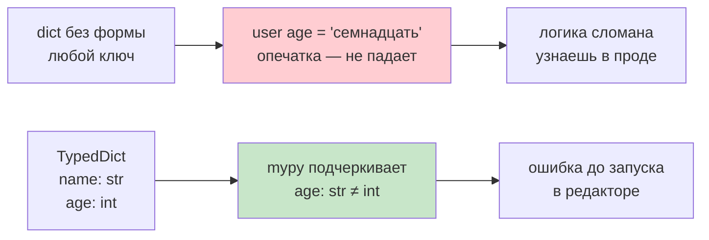
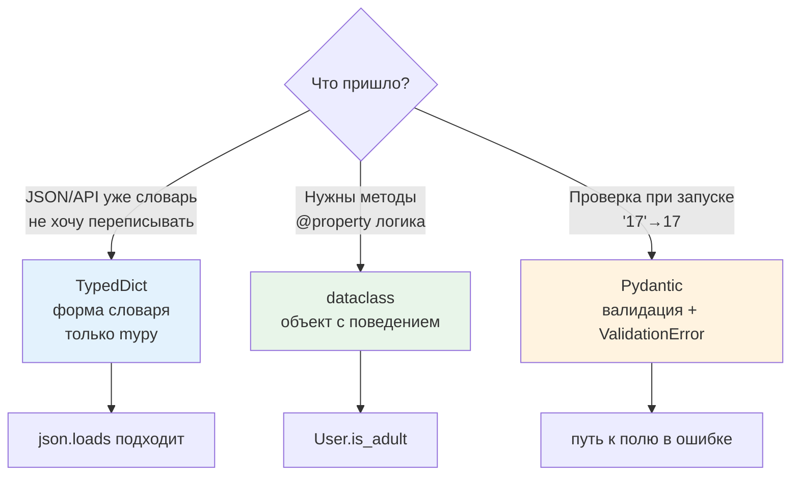

# 03. Словари с формой — TypedDict и современный синтаксис

> [!abstract] О чём лекция
> В базовом курсе словарь — «мешок» без правил: любой ключ, любое значение. Когда словарь — это запись с фиксированными полями (пользователь, ответ API), хочется проверить форму **до запуска**. `TypedDict` — описание формы словаря для `mypy`/`pyright`: какие ключи обязательны, какие `NotRequired`, какие `ReadOnly`, как типизировать `**kwargs` через `Unpack`. При этом во время выполнения это всё ещё обычный `dict` — проверка только до запуска, для проверки при запуске уже `Pydantic`.
>
> После лекции ты отличишь `dict[str,int]` («любой ключ») от `User(TypedDict)` («ключи name/age») и выберешь `TypedDict` vs `dataclass` vs `Pydantic` за 10 секунд.

> [!tip] Что нужно
> Словари из [[11. Кортежи, списки, словари]], `dict[str,int]` из [[02. Типизация и аннотации]]. Примеры копируемы — запускай и смотри подчёркивания Pylance.

---

# Зачем форма у словаря



Без формы словарь принимает всё — и опечатку не видно:

```python
user = {"name": "Аня", "age": 17}
user["age"] = "семнадцать"   # ← опечатка, но Python молчит
user["city"] = "..."         # лишний ключ — тоже молчит
```

Если словарь — это **запись** с фиксированными полями (пользователь, настройки, `json` с `API`), хочется увидеть ошибку в редакторе. `TypedDict` именно это — но **только** при проверке типов (`mypy`/`pyright`), а не во время выполнения (для выполнения — `Pydantic`).

Аналогия: `TypedDict` — бланк анкеты: поля `name/age` напечатаны, `mypy` — контролёр который не даст сдать бланк с пустым `age` или `age="семнадцать"`.

---

# Базовый `TypedDict`

```python
from typing import TypedDict

class User(TypedDict):
    name: str
    age: int

u: User = {"name": "Аня", "age": 17}          # ok
# u: User = {"name": "Аня"}                  # mypy: Missing key "age"
# u: User = {"name": "Аня", "age": "17"}     # mypy: Incompatible type str ≠ int
# u: User = {"name": "Аня", "age": 17, "city": "Клгд"}  # mypy: Extra key "city"
```

По умолчанию все ключи **обязательны** (`required=True`). Это как `NOT NULL` в БД — без поля не сдать.

**Необязательные — `NotRequired`:**

```python
from typing import TypedDict, NotRequired

class User(TypedDict):
    name: str
    age: int
    city: NotRequired[str]   # можно опустить

a: User = {"name": "Аня", "age": 17}                 # ok
b: User = {"name": "Аня", "age": 17, "city": "Клгд"} # ok
# c: User = {"name": "Аня", "age": 17, "city": 123}  # mypy: city должен быть str
```

Старое `total=False` — то же что «все необязательны», сейчас предпочитают точечно `NotRequired` — виднее что именно опционально.

> [!warning] Во время выполнения — обычный dict
> ```python
> u: User = {"name": "Аня", "age": "семнадцать"}  # запустится!
> print(u["age"])  # семнадцать — строка, а не int
> ```
> Ловит только `mypy`/`pyright`. Интерпретатор аннотации игнорирует — как в [[02. Типизация и аннотации]].

---

# Современный синтаксис (3.11+ / 3.12)

**`ReadOnly` — только для чтения:**

```python
from typing import TypedDict, ReadOnly

class Config(TypedDict):
    host: ReadOnly[str]   # config["host"] = "new" → mypy ошибка
    port: int

cfg: Config = {"host": "localhost", "port": 8000}
# cfg["host"] = "127.0.0.1"  # mypy: ReadOnly
cfg["port"] = 9000           # ok
```

Полезно для `id`, `created_at` — поле пришло с сервера, менять нельзя.

**Распаковка `**kwargs` — `Unpack` (PEP 692):**

Без `Unpack` имена ключей не проверяются:

```python
from typing import TypedDict, NotRequired, Unpack

class UserKw(TypedDict):
    name: str
    age: NotRequired[int]

def create_user(**kwargs: Unpack[UserKw]) -> User:
    return {"name": kwargs["name"], "age": kwargs.get("age", 18)}

create_user(name="Аня")              # ok
create_user(name="Аня", age=17)      # ok
# create_user(name="Аня", age="17")  # mypy: age str ≠ int
# create_user(nam="Аня")             # mypy: Unexpected keyword "nam" — опечатка!
```

**Наследование форм — расширение бланка:**

```python
class Base(TypedDict):
    id: int

class Extended(Base):
    name: str   # id + name
# Extended = {"id": int, "name": str}

class WithCity(Extended):
    city: NotRequired[str]
```

**Ключи не-идентификаторы — функциональный синтаксис:**

```python
from typing import TypedDict
User2 = TypedDict("User2", {"user-name": str, "age": int})  # дефис нельзя как поле
```

---

# `TypedDict` vs `dataclass` vs `Pydantic` — когда что



| Вопрос | `TypedDict` | `@dataclass` | `Pydantic` |
|---|---|---|---|
| Что | словарь с формой | класс с полями | класс с валидацией |
| Проверка | только `mypy` до запуска | `__post_init__` руками | при создании + парсинг |
| Создание | `{"name": "Аня"}` | `User(name="Аня")` | `User(name="Аня")` / `model_validate({...})` |
| JSON | `json.loads` уже подходит | `asdict` + `json` руками | `model_dump()` / `model_validate_json()` |
| Методы | нет — только данные | да (`is_adult`) | да |

Правило новичка:

- **Пришёл `json` и код уже на `dict` — `TypedDict`.** Не переписываешь `user["name"]` на `user.name`.
- **Нужны методы/`@property` — `dataclass`.**
- **Данные извне и нужен парсинг `"17"`→`17` — `Pydantic`** (см. курс `03. Pydantic/08. Альтернативы и место Pydantic`).

```python
# TypedDict — уже словарь
from typing import TypedDict, NotRequired
class ApiUser(TypedDict):
    id: int; name: str; email: NotRequired[str]
def handle(data: ApiUser) -> None: print(data["name"])

# dataclass — объект
from dataclasses import dataclass
@dataclass
class UserObj:
    name: str; age: int
    def is_adult(self) -> bool: return self.age >= 18
```

---

# Практика и нюансы

**Вложенность — описывай каждый уровень:**

```python
class Address(TypedDict):
    city: str; zip: NotRequired[str]
class UserWithAddr(TypedDict):
    name: str; address: Address
```

**`dict` vs `Mapping`:** `dict[str,int]` — изменяемый, `Mapping[str,int]` — только чтение (как `Sequence` vs `list` в [[02. Типизация и аннотации]]). Для аргумента «не меняю» точнее `Mapping`.

**Лишние ключи без `Unpack` не ловятся:** `def f(**kwargs: User)` — имена не проверятся; нужен `**kwargs: Unpack[User]`.

> [!warning] Не путай `TypedDict` и `dataclass` в валидации
> Оба не проверяют при запуске — только `Pydantic` упадёт с `ValidationError` и покажет `loc`.

---

# Хорошие практики

1. **Описывай то что уже `dict`.** Функция принимает `dict` и знаешь ключи → заведи `TypedDict` рядом.
2. **Не смешивай миры.** Либо `user["name"]` везде, либо `user.name` — смесь = опечатки.
3. **`NotRequired` точечно,** не `total=False` на весь бланк.
4. **Узкая схема для API.** Каждое новое поле — `NotRequired[str]`, а не `extra`.
5. **Вход гибкий, выход строгий:** принимай `Mapping`/`TypedDict`, возвращай конкретный `TypedDict`/`dataclass`.

---

# Типичные заблуждения

- ❌ «`TypedDict` проверяет во время выполнения» — только `mypy`.
- ❌ «Можно методы» — нельзя, это описание, `User.keys` нет.
- ❌ «`total=False` = `NotRequired`» — первое делает все ключи необязательными.
- ❌ «Заменяет `dataclass`» — разные уровни: форма словаря vs объект.

---

# Ключевые термины

| Термин | Что |
|---|---|
| `TypedDict` | форма словаря для проверки типов |
| `NotRequired`/`Required` | один ключ необязателен/обязателен |
| `ReadOnly` | только чтение |
| `Unpack` | типизирует `**kwargs` через форму |
| `Mapping` | чтение словаря |

---

# Проверь себя

1. Чем `TypedDict` от `dict[str,int]`?
2. Как сделать `city` необязательным?
3. Когда `TypedDict` а когда `dataclass`?
4. Почему `{"age":"17"}` не падает при запуске?
5. Как типизировать `**kwargs`?

> [!example]- Ответы
> 1. `dict[str,int]` — любой ключ `str`; `TypedDict` — конкретные имена `name/age`.
> 2. `city: NotRequired[str]`.
> 3. `TypedDict` — уже словарь/json; `dataclass` — нужны методы.
> 4. Аннотации игнор при запуске — ловит только `mypy`.
> 5. `def f(**kwargs: Unpack[User]):`.

---

# Практика

Сделать форму `{"id","name","email?"}` с `NotRequired`, написать `handle(data: ApiUser)` и прогнать `mypy`; переписать как `dataclass` для сравнения. Дальше — [[07. Декораторы]].

---

# Связи

- [[02. Типизация и аннотации]] — `Any`/`Mapping`/`Sequence`
- [[04. Датаклассы — когда и как, и где дополняет Pydantic]] — объект vs словарь
- `03. Pydantic/08. Альтернативы и место Pydantic` — где начинается `Pydantic`

