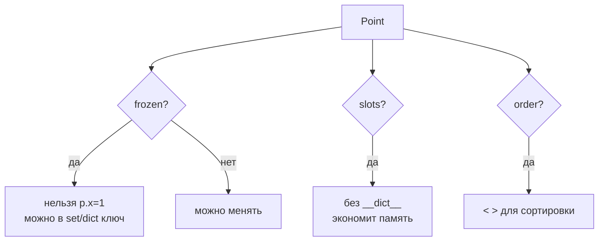
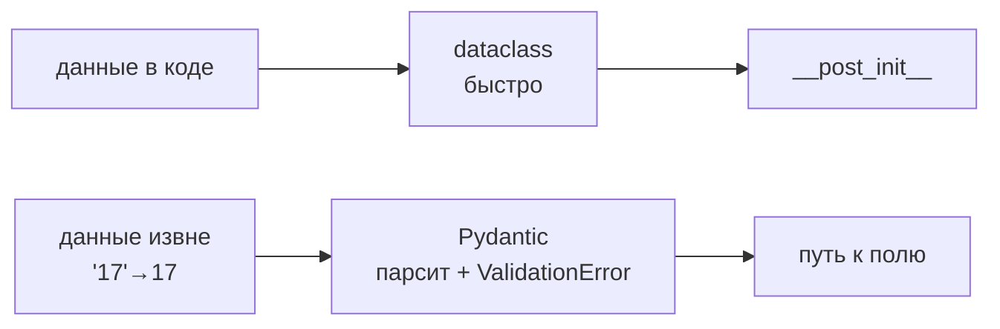

# 04. Датаклассы — когда и как, и где дополняет Pydantic

> [!abstract] О чём лекция
> В [[16. Объектно-ориентированное программирование]] `@dataclass` — короткий способ без ручного `__init__`/`__repr__`. Здесь — глубоко для грамотного разработчика: `field`, `frozen/slots/kw_only/order`, `__post_init__`, `namedtuple` vs класс, и честный ответ где кончается `dataclass` и начинается `Pydantic`. **Мысль:** `dataclass` — «класс как запись» без парсинга; `Pydantic` дополняет когда данные извне и нужна проверка.
>
> После лекции ты напишешь `field(default_factory=list)`, `frozen+slots` и решишь за 10с — `dataclass` или `Pydantic`.

> [!tip] Нужно
> `__init__/__repr__/@property` из [[16. Объектно-ориентированное программирование]], аннотации из [[02. Типизация и аннотации]]. Вся магия — расширение знакомого.

---

# База — что уже было, но напомним

```mermaid
flowchart LR
  A[@dataclass<br>class Student] --> B[генерит]
  B --> C[__init__]
  B --> D[__repr__]
  B --> E[__eq__]
  C --> F[__post_init__<br>проверки]
  F --> G[объект + @property]
```

```python
from dataclasses import dataclass, field

@dataclass
class Student:
    name: str
    group: str
    scores: list[int] = field(default_factory=list)  # не []!

    def __post_init__(self) -> None:
        if not self.name.strip():
            raise ValueError("имя не может быть пустым")

    @property
    def average(self) -> float:
        return sum(self.scores) / len(self.scores) if self.scores else 0.0

s = Student("Аня", "П-21", [5, 4, 5])
print(s)         # Student(name='Аня', group='П-21', scores=[5, 4, 5])
print(s.average) # 4.666...
```

Без `@dataclass` те же `__init__/__repr__/__eq__` — 20 строк руками. Декоратор печатает бланк по полям.

> Анкета: поля `name/group/scores` — пустые строки, `@dataclass` — штамп бланка, `__post_init__` — проверка что `name` не пусто.

---

# `field` — тонкая настройка поля

```python
from dataclasses import dataclass, field

@dataclass
class Item:
    name: str
    price: float
    tags: list[str] = field(default_factory=list)          # новый список каждому
    secret: str = field(repr=False, compare=False, default="")  # скрыть из repr/==
    created: float = field(init=False, default=0.0)       # не в __init__, ставит __post_init__
    note: str = field(default="", metadata={"help": "подсказка"})  # metadata — для инструментов
```

| `field` | Зачем |
|---|---|
| `default` / `default_factory` | значение по умолчанию; изменяемое — только через `factory` |
| `init=False` | не в `__init__` — ставит `__post_init__` |
| `repr=False` | не показывать (секрет, большой массив) |
| `compare=False` | не в `==` (кэш, `id`) |
| `hash=False` | не в `hash` при `frozen` |
| `kw_only=True` | только `name="..."` — защита от перепутанного порядка |
| `metadata` | пометки для своих инструментов |

> [!warning] Ловушка `= []`
> `tags: list = []` — один список на всех объектов (как `def f(x=[])`). Только `field(default_factory=list)`. Проверка: `a=Item("a",1); b=Item("b",2); a.tags.append("x"); print(b.tags)` — с `[]` у `b` тоже `["x"]`.

---

# Настройки декоратора — как «значение»



```python
@dataclass(frozen=True, slots=True, order=True, kw_only=True)
class Point:
    x: float; y: float

p = Point(x=1, y=2)
# p.x = 3  # FrozenInstanceError
print(p < Point(2, 2))  # True — order по x, потом y
```

| Опция | Смысл |
|---|---|
| `frozen=True` | неизменяемый → `FrozenInstanceError`, можно хешировать (`set`/`dict` ключ) |
| `slots=True` | без `__dict__` — быстрее и экономнее (миллионы объектов) |
| `order=True` | `<,<=,>,>=` по полям по порядку |
| `kw_only=True` | все поля `x=1, y=2` — меньше путаницы |
| `eq=True`/`repr=True` | по умолчанию — сравнение и печать по полям |

Лучший «значение-объект» — `frozen+slots`: как `namedtuple`, но с `@property` и проверками.

---

# `__post_init__` — проверки и производные

```python
from dataclasses import dataclass, field

@dataclass
class Circle:
    radius: float
    area: float = field(init=False)

    def __post_init__(self) -> None:
        if self.radius <= 0:
            raise ValueError("радиус >0")
        self.area = 3.14 * self.radius ** 2

c = Circle(5)
print(c.area)  # 78.5
# Circle(-1) → ValueError
```

Правило: **что можно проверить сразу — в `__post_init__`**, не «потом». Сложную логику — в `@classmethod from_dict`.

Нюанс `frozen`: в `__post_init__` менять поле можно только через `object.__setattr__(self, "area", ...)` .

---

# `dataclass` vs `namedtuple` vs класс

| Вопрос | `dataclass` | `namedtuple` | Обычный класс |
|---|---|---|---|
| изменяемость | по выбору | неизменяемый | изменяемый |
| память | `slots` — экономно | экономно | `__dict__` |
| `@property`/методы | да | почти нет | да |
| `default`/`field` | гибко | ограничено | руками |
| проверки/наследование | да | нет | да |

`Point(x,y)` как `namedtuple` короче, но как только нужен `default_factory`/`@property`/`__post_init__` — бери `dataclass`.

---

# Где дополняет Pydantic — честно



| Задача | `dataclass` | `Pydantic` |
|---|---|---|
| проверка от тебя | `__post_init__` | `field_validator` + `PositiveInt`/`EmailStr` |
| парсинг `"17"`→`17` | нет | `model_validate({"age":"17"})` |
| `ValidationError` с `loc` | руками | да |
| `json` | `asdict`+`json` | `model_dump()`/`model_validate_json()` |
| `.env` | руками | `pydantic-settings` |

Граница:

```python
from dataclasses import dataclass
@dataclass
class UserDC:
    name: str; age: int
# UserDC(age="17") — запустится, age будет строкой!

from pydantic import BaseModel, ValidationError
class UserMD(BaseModel):
    name: str; age: int

u = UserMD(name="Аня", age="17")  # → 17 (парсит)
print(u)  # name='Аня' age=17
# UserMD(name="Аня", age="семнадцать") → ValidationError
```

> Пока данные создаёшь ты — `dataclass`. Как только пришли извне (форма/API/файл) и нужен парсинг — `Pydantic` (см. `03. Pydantic/08. Альтернативы и место Pydantic`).

---

# Хорошие практики

1. `field(default_factory=list)` — не `=[]`.
2. `__post_init__` — коротко: проверки + 1-2 производных; сложное → `from_dict`.
3. Значение — `frozen+slots`.
4. Скрывай `repr=False, compare=False` для секретов.
5. Валидация без парсинга — `dataclass`; парсинг строки→число — `Pydantic`.

---

# Типичные заблуждения

- ❌ «`dataclass` проверяет `age: int`» — нет, только `mypy`.
- ❌ «`frozen` глубокий» — только объект, вложенный `list` остаётся изменяемым (нужен `tuple`).
- ❌ «`slots` всегда быстрее» — на паре объектов не заметно, на миллионах — да.
- ❌ «`Pydantic` замена» — дополняет для внешних данных, внутри `dataclass` легче.

---

# Ключевые термины

| Термин | Что |
|---|---|
| `@dataclass` | генерирует `__init__/__repr__/__eq__` |
| `field` | настройка поля |
| `__post_init__` | проверки после `__init__` |
| `frozen/slots` | неизменяемость/экономия |
| `Pydantic` | парсинг/валидация внешних данных |

---

# Проверь себя

1. Чем `field(default_factory=list)` от `= []`?
2. Что даёт `frozen` и почему `list` внутри всё ещё меняется?
3. Когда `dataclass` а когда `Pydantic`?
4. Зачем `__post_init__`?
5. Как скрыть `secret` из `print`?

> [!example]- Ответы
> 1. Первое — новый список каждому, второе — один на всех.
> 2. Нельзя менять поля; вложенный `list` — отдельный объект.
> 3. `dataclass` — данные в коде; `Pydantic` — извне с парсингом.
> 4. Проверить и посчитать производные сразу.
> 5. `field(repr=False, compare=False)`.

---

# Практика

Переписать `Student/Point` с `frozen+slots`, `repr=False`, `__post_init__`. Дальше — `03. Pydantic/08. Альтернативы и место Pydantic`.

---

# Связи

- [[07. Декораторы]] — `@dataclass` как декоратор
- [[02. Типизация и аннотации]] — `list[str]`
- [[03. Словари с формой — TypedDict и современный синтаксис]] — словарь vs объект
- `03. Pydantic/01. Зачем валидировать данные` — продолжение

