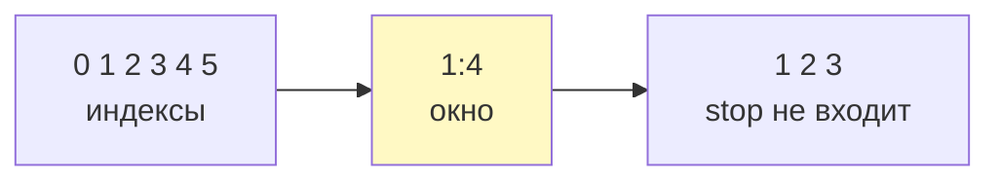
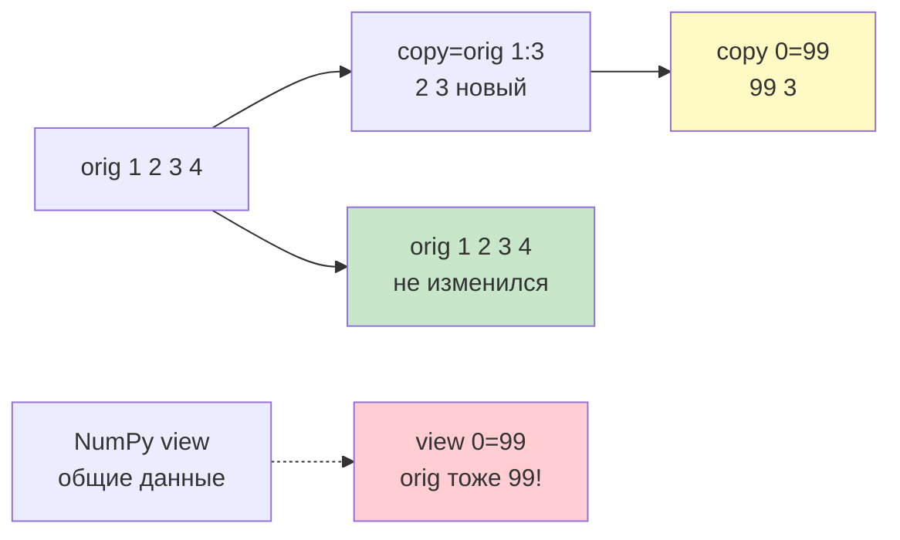
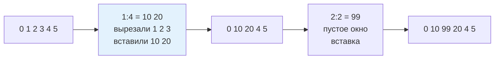

# 05. Срезы и объект slice — глубоко, разжёвано для новичка

> [!abstract] О чём лекция
> В базе `items[1:4]` — «кусочек списка». Здесь — вся механика: `start:stop:step`, объект `slice` без скобок, почему в Python срез — копия (в `numpy` — вид), присваивание срезу, `islice` для ленивого обхода и ловушки шага. **Мысль:** срез — объект с тремя числами; поняв его, читаешь `a[::-1]` как формулу.
>
> После лекции ты отличишь `copy = orig[1:3]` (новый список) от `view = arr[1:3]` (тот же массив) и вставишь `nums[2:2]=[99]` без гугла.

> [!tip] Нужно
> Индексы и `a[:]` из [[11. Кортежи, списки, словари]], матрицы из [[13. Вложенные последовательности]]. Опыт с `range` помогает — срез почти `range`.

---

# Срез как «окно» с тремя числами



> `stop` как забор — до него, но не включая. Как `range(1,4)` → `1,2,3`.

| Параметр | Что | По умолчанию |
|---|---|---|
| `start` | откуда, включая | `0` если `step>0`, иначе `len-1` |
| `stop` | докуда, не включая | `len` если `step>0`, иначе «до -1» |
| `step` | шаг | `1` |

```python
nums = [0, 1, 2, 3, 4, 5]
print(nums[1:4])    # [1,2,3]
print(nums[:3])     # [0,1,2]  от начала
print(nums[3:])     # [3,4,5]  до конца
print(nums[::2])    # [0,2,4]  шаг 2
print(nums[::-1])   # [5,4,3,2,1,0] разворот!
print(nums[4:1:-1]) # [4,3,2] назад
print(nums[-3:])    # [3,4,5] последние 3 — -1 это последний
```

Читать: `a:b:c` — «`a`, `a+c`, `a+2c` … пока < `b`».

---

# Объект `slice` без скобок

Скоба `seq[...]` — синтаксис, `slice` — объект с тремя числами:

```python
nums[1:4:2]          # синтаксис
nums[slice(1, 4, 2)] # то же объектом

window = slice(1, 4)
print(nums[window])  # [1,2,3] — «окно» передали в функцию

# slice умеет поправить границы под длину
print(slice(1, 100).indices(5))  # (1,5,1) — 100 урезали до 5
```

Где нужно:

- свой класс-последовательность `__getitem__(self, key)` — туда приходит `slice`;
- функция `def take(data: list[int], window: slice) -> list[int]: return data[window]`;
- `pandas`/`numpy` — там `slice` тоже, но часто **вид**, не копия.

---

# Срез — всегда копия (в Python), не вид



```python
orig = [1, 2, 3, 4]
copy = orig[1:3]   # [2,3] новый список
copy[0] = 99
print(orig)  # [1,2,3,4] — не изменился
print(copy)  # [99,3]

# NumPy — наоборот (вид)
# import numpy as np
# arr = np.array([1,2,3,4])
# view = arr[1:3]; view[0]=99; print(arr) # [1,99,3,4] — изменился!
```

| Мир | Срез | Цена |
|---|---|---|
| `list`/`str`/`tuple` | копия верхнего уровня | память + `O(k)` |
| `numpy.ndarray` | вид (без копии) | быстро, но изменения видны |

Ловушка вложенных:

```python
matrix = [[1,2],[3,4]]
shallow = matrix[:]        # копия только верхнего
shallow[0][0] = 99
print(matrix)  # [[99,2],[3,4]] — вложенный общий!

deep = [row[:] for row in matrix]  # копия каждого уровня
```

Сколько уровней вложенности — столько `[:]`.

---

# Присваивание срезу — вставка/удаление без цикла



```python
nums = [0, 1, 2, 3, 4, 5]
nums[1:4] = [10, 20]    # заменили 3 элемента на 2 → длина 6→5
print(nums)  # [0,10,20,4,5]

nums[2:2] = [99]        # вставка без удаления — пустой срез
print(nums)  # [0,10,99,20,4,5]

nums[3:] = []           # удалить хвост
# del nums[1:3] — то же
```

> [!warning] Правая часть — любой итерируемый
> `nums[1:2] = "hi"` → `['h','i']` (строка итерируется). Хочешь один элемент — `["hi"]`.

---

# Шаг и граничные случаи

```python
s = "Python"
print(s[::-1])    # nohtyP — идиома разворота
print(s[::-2])    # nhy
print(s[5:1:-1])  # noht
print(s[:])       # копия (строки неизменяемы — но синтаксис ок)
print(s[10:20])   # "" — выход за границы НЕ ошибка!
# s[::0]  # ValueError: slice step cannot be zero — единственная ошибка среза
```

| Нюанс | Что |
|---|---|
| `seq[100:200]` | не `IndexError`, а `""`/`[]` |
| `seq[::0]` | `ValueError` |
| `len(seq[::2])` | `(len+1)//2` для нечётной — не угадывай, `len()` после |
| `seq[::-1]` | новая строка/список — для строки ок |

---

# Производительность — когда `islice`

Срез копирует `O(k)` — на миллионах заметно:

```python
big = list(range(1_000_000))
part = big[1000:2000]   # скопировал 1000 → ~8KB

from itertools import islice
for x in islice(big, 1000, 2000):  # без копии, по одному
    process(x)

lazy = (x*x for x in big if x%2==0)  # генератор — тоже лениво
```

Правило: **нужен результат целиком — срез; нужен обход — `islice`/генератор.** `reversed(a)` — ленивый разворот без копии vs `a[::-1]` — копия.

---

# Хорошие практики

1. `data[:n]` лучше `data[0:n]`; `data[-n:]` — последние `n`.
2. Копия — `list(a)` или `a[:]` (второе читается как «хочу копию»).
3. Разворот для итерации — `reversed(a)` (без копии); для копии — `a[::-1]`.
4. Не меняй список во время `for` по срезу — собери новый.
5. Свой класс — поддержи `slice`:

```python
class Scores:
    def __init__(self, values): self._values = list(values)
    def __getitem__(self, key):
        if isinstance(key, slice): return Scores(self._values[key])
        return self._values[key]
print(Scores([1,2,3,4])[1:3]._values)  # [2,3]
```

---

# Типичные заблуждения

- ❌ «`a[1:3]` меняет `a`» — нет, новый объект.
- ❌ «Выход за границы — ошибка» — нет, пусто/урезается.
- ❌ «`a[:]` глубокая» — только верх, вложенные общие.
- ❌ «Шаг 0 можно» — `ValueError`.
- ❌ «Срез везде вид» — в `list` копия, в `numpy` вид.

---

# Ключевые термины

| Термин | Что |
|---|---|
| срез `a:b:c` | `slice(start,stop,step)` в скобках |
| `slice` | объект без скобок |
| `islice` | ленивый срез без копии |
| вид (view) | `numpy` — ссылка на те же данные |
| поверхностная копия | `a[:]` — только верхний уровень |

---

# Проверь себя

1. Что `[1,2,3,4,5][1:4]` и почему без `5`?
2. Чем `[::-1]` от `reversed()`?
3. Что `nums[1:1]=[99]`?
4. Почему `matrix[:]` не копирует вложенные?
5. Что `slice(2,10,2).indices(5)`?

> [!example]- Ответы
> 1. `[2,3,4]` — индексы 1,2,3; `stop` не входит.
> 2. `[::-1]` — копия, `reversed` — итератор без копии.
> 3. Вставка `99` на позицию 1.
> 4. Только внешний список — вложенные те же объекты.
> 5. `(2,5,2)` → `[2,4]`.

---

# Практика

Ленивые обходы `islice` vs срез, копия матрицы, свой `__getitem__` с `slice`. Дальше — [[03. Словари с формой — TypedDict и современный синтаксис]].

---

# Связи

- [[11. Кортежи, списки, словари]] — индексы
- [[13. Вложенные последовательности]] — `[[0]*n]*m` ловушка
- [[06. Остатки продвинутого синтаксиса]] — `*` vs срез
- [[02. Типизация и аннотации]] — `Sequence[int]` для среза
- `02_Курсы/02. NumPy` — там срез вид

