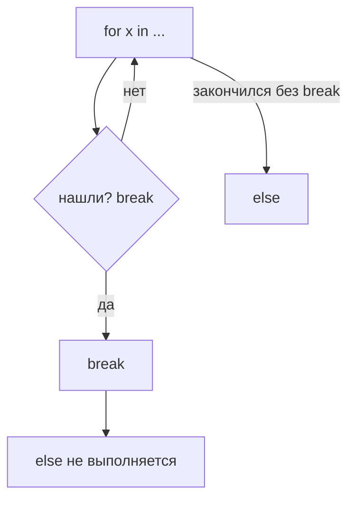

# 06. Остатки продвинутого синтаксиса

> [!abstract] О чём лекция
> В курсе Python эти темы помечали «потом»: `lambda`, генераторные выражения, `*args`/`**kwargs`, распаковка, `for...else` и `:=`. В реальных проектах они встречаются ежедневно — но половина из них уместна **только** там, где делает код короче без потери смысла. Разберём каждую так, чтобы ты уверенно **читал** чужой код и знал когда **не писать** так сам.
>
> Правило лекции: **сначала понятно, потом кратко**. Если коллега переспрашивает «что тут происходит» — конструкция не оправдана.

> [!tip] Что нужно знать
> `def`, `for`, `list/dict`, `sorted(..., key=)` из [[11. Кортежи, списки, словари]] и [[14. Функции и модули]]. Всё новое показано на копируемых примерах — запускай.

---

# Карта — когда что

| Конструкция | Зачем | Когда брать | Когда не брать |
|---|---|---|---|
| `lambda` | функция на одну строку без имени | `key=` в `sorted/max/filter` на месте | правило на 2+ строки или нужно дважды |
| `(x for x in ...)` | считать без списка в памяти | `sum/max/any` от большого потока | нужны повторы / индексы |
| `*args, **kwargs` | «сколько угодно» аргументов | обёртки, проброс дальше (декораторы, логирование) | обычная бизнес-функция — честный список параметров |
| распаковка `a, *b = ...` | разобрать последовательность | заголовок + хвост, обмен `a,b=b,a` | магия на 3 звёздочки |
| `for...else` | «если не нашли `break`» | узкий поиск с `break` | если можно `return`/`any` — бери их |
| `:=` (walrus) | присвоить в условии | `if (n:=len(s))>3:` и `while chunk:=f.read()` | обычный `if` с присваиванием выше |

---

# `lambda` — маленькая функция без имени

```python
prices = [120, 350, 80, 500]
print(sorted(prices, key=lambda v: -v))   # [500, 350, 120, 80]
```

Это то же что:

```python
def by_price_desc(v: int) -> int:
    return -v
sorted(prices, key=by_price_desc)
```

Разница — `lambda` живёт **на месте вызова** и не получает имени. Пишут её когда правило **короткое и одноразовое**:

```python
pairs = [("Аня", 17), ("Боря", 22)]
sorted(pairs, key=lambda p: p[1])   # по возрасту
max(words, key=len)                 # не нужен lambda — есть готовая len!
filter(lambda x: x > 0, numbers)    # оставь только положительные
```

Почему `max(words, key=len)` лучше `key=lambda w: len(w)` — [PEP 8](https://peps.python.org/pep-0008/) и [Real Python — lambda](https://realpython.com/python-lambda/): если есть готовая функция, `lambda` — лишний шум.

**Граница:**

```python
# ПЛОХО: lambda на две строки — уже не читается
key = lambda u: (u["city"].lower(), -u["age"])  # сделай def

# ХОРОШО: именная функция — можно тестировать и типизировать
def user_key(u: dict) -> tuple[str, int]:
    return (u["city"].lower(), -u["age"])
```

> [!warning] Три ловушки `lambda`
> 1. Нет аннотаций и docstring — не документируешь.
> 2. В `lambda` нельзя `if` без `else`, циклы, `return` — только выражение.
> 3. Замыкание в цикле: `[lambda: i for i in range(3)]` вернёт три раза `2` — поздняя привязка. Делай `lambda i=i: i`.

---

# Генераторные выражения — «список без списка»

```python
prices = [120, 350, 80, 500]
total = sum(x for x in prices if x > 100)   # 970
print(total)
```

Со скобками `[...]` был бы **список в памяти**, с `(...)` — **генератор**, выдаёт по одному. Для `sum`, `max`, `any`, `all`, `next` генератор экономит память и читается как фраза:

```python
numbers = [3, -1, 0, 7, 2]
print(any(n < 0 for n in numbers))                          # есть отрицательные? True
print(all(n > 0 for n in numbers))                          # все положительные? False
print(next((n for n in numbers if n < 0), None))            # первое отрицательное: -1
```

Зачем `next(..., None)`: `next` берёт первый элемент генератора; второй аргумент — что вернуть если не нашли (без него — `StopIteration`).

**Чем отличается от спискового включения и функции-генератора:**

| Запись | Что создаёт | Память | Повторно пройти? |
|---|---|---|---|
| `[x*x for x in a]` | список | держит всё | да |
| `(x*x for x in a)` | генератор-выражение | по одному | **нет** — одноразовый |
| `def gen(): yield x*x` | функция-генератор | по одному | новый вызов — заново |

```python
gen = (x for x in numbers if x > 0)
print(list(gen))  # [3, 7, 2]
print(list(gen))  # [] — уже пуст!
```

Если нужны повторы или `len`/`[0]` — делай список. Если считаешь один раз на большом потоке (файл в 1 млн строк) — генератор.

> [!tip] Круглая скобка может исчезнуть
> `sum(x for x in a)` — скобки генератора совпали со скобками вызова, писать `sum((x for x in a))` не нужно. А вот `list(x for x in a)` vs `[x for x in a]` — второе короче.

---

# `*args` и `**kwargs` — «сколько угодно» аргументов

```python
def report(title: str, *values: int, unit: str = "") -> str:
    return f"{title}: {', '.join(str(v) for v in values)}{unit}"

print(report("Цены", 120, 350, 80, unit=" руб."))
# Цены: 120, 350, 80 руб.
```

Разбор сигнатуры:

| Фрагмент | Что внутри функции | Как вызывать |
|---|---|---|
| `*values` | кортеж `tuple[int, ...]` из позиционных после `title` | `report("Цены", 1,2,3)` |
| `unit=""` после `*` | **keyword-only** — только по имени | `unit=" руб."` — ок, `report("Ц", 1, "руб.")` — уже в `values`! |
| `**attrs` | словарь `dict[str, str]` из именованных | `make_tag("a", href="/")` |

```python
def make_tag(name: str, **attrs: str) -> str:
    pairs = [f'{k}="{v}"' for k,v in attrs.items()]
    return f"<{name} {' '.join(pairs)}>"

print(make_tag("a", href="/home", title="Дом"))
params = {"href": "/docs", "title": "Справка"}
print(make_tag("a", **params))   # **params раскладывает словарь в аргументы
```

Имена `args/kwargs` — соглашение (PEP 8: `*args`, `**kwargs`), важны звёздочки, не имена. Аннотации — как в [[02. Типизация и аннотации]]: `*args: int` → каждый аргумент `int`, `**kwargs: str` → каждое значение `str`.

**Когда брать, когда нет:**

- ✅ **Обёртки / проброс** — логирование, замер времени, декораторы: `def wrapper(*args, **kwargs): return func(*args, **kwargs)`
- ❌ **Бизнес-функция** `def create_user(*args, **kwargs)` — прячешь интерфейс; вызывающему не видно что передавать. Перечисли честно: `def create_user(name: str, age: int, city: str = "")`.

Ещё тонкость: параметр после `*` становится keyword-only — это защита от «перепутал порядок».

---

# Распаковка — `a, *rest` и `*` в вызове

```python
prices = [120, 350, 80, 500]
first, *rest = prices
print(first, rest)          # 120 [350, 80, 500]

a, b = 1, 2
a, b = b, a                 # обмен без временной переменной
print(a, b)                 # 2 1

print(report("Цены", *prices, unit=" руб."))  # *prices раскладывает список в аргументы
```

Приёмы новичка:

- `first, *middle, last = [1,2,3,4]` — голова/хвост;
- `for key, value in dict.items():` — распаковка пары;
- `a, _ = (1,2)` — `_` «не нужно»;
- `[*a, *b]` — склейка списков; `{**d1, **d2}` — слияние словарей (правое побеждает).

> [!warning] Одна звёздочка — один «хвост»
> `a, *b, *c = [1,2,3]` — `SyntaxError`. Хвост только один.

---

# `for ... else` — «если не было `break`»



```python
def find_negative(numbers: list[int]) -> None:
    for n in numbers:
        if n < 0:
            print("нашли:", n)
            break
    else:                       # сработает только если break не было
        print("отрицательных нет")

find_negative([1,2,-3])   # нашли: -3
find_negative([1,2,3])    # отрицательных нет
```

Легко спутать с `if/else`. В проектах чаще пишут яснее — через `return` или `any`:

```python
def has_negative(numbers: list[int]) -> bool:
    for n in numbers:
        if n < 0: return True
    return False
# или
has_negative = any(n < 0 for n in numbers)
```

Правило: `for...else` допустим, но если коллега спросит «а `else` к чему?» — перепиши на `return`/`any`.

Заметка: `else` срабатывает и когда цикл **не выполнился ни разу** (`[]`) — тоже «без break».

---

# Моржовый оператор `:=` — присвоить в условии

[PEP 572](https://peps.python.org/pep-0572/) — «walrus» (морж) из-за формы `:=` (глаза и клыки).

```python
prices = [120, 350, 80, 500]
if (count := len(prices)) > 3:     # посчитали и сразу проверили
    print(f"чисел больше трёх: {count}")

# без walrus пришлось бы дважды или с переменной выше
```

Классика где оправдан — чтение по кускам:

```python
# while chunk := file.read(8192):
#     process(chunk)
```

И включения: `filtered = [y for x in data if (y := f(x)) > 0]` — посчитали `f(x)` один раз.

**Когда не брать:**

```python
# ПЛОХО: прячешь присваивание в середине выражения
if (a := foo()) and (b := bar(a)) and b > 10: ...

# ХОРОШО: две строки — читается сверху вниз
a = foo()
b = bar(a)
if b > 10: ...
```

Правило [Real Python — walrus](https://realpython.com/python-walrus-operator/): `:=` экономит ровно один повтор; если без него читается лучше — не используй.

---

# Как это делают в проекте — 4 правила

1. **`lambda` — только на месте и в одну строку.** Длиннее — `def` с именем, тестами и типами.
2. **Генератор — для одного прохода.** Нужен `len`/повтор — список. Поток из файла — генератор.
3. **`*args/**kwargs` — в обёртках.** В бизнес-логике — явные параметры.
4. **Экзотика по необходимости.** `for...else` и `:=` разрешены, но проходят ревью только если без них хуже.

---

# Типичные заблуждения

| Думают | На самом деле |
|---|---|
| `lambda` быстрее `def` | Скорость та же — только запись короче |
| Генератор как список | Ленивый и одноразовый, второй проход пуст |
| `*args` делает функцию универсальной | Скрывает интерфейс — не видно что передавать |
| `else` у `for` — «если цикл не запустился» | `else` — «если не было `break`», даже после полного прохода |
| `:=` везде экономит код | Только где значение нужно и в условии, и в теле |

---

# Проверь себя

1. Когда `lambda` уместна, а когда `def`?
2. Чем `(x for x in a)` отличается от `[x for x in a]`?
3. Что в `values` при `report("Итог", 1,2,3)`? А где `unit`?
4. Что выведет `find_negative([5,6])`?
5. Как `first, *rest = prices`?
6. Почему `list(gen)` второй раз пуст?

> [!success]- Ответы
> 1. `lambda` — коротко и одноразово на месте (`key=lambda p:p[1]`). Иначе — `def`.
> 2. Список хранит всё; генератор выдаёт по одному и одноразовый — для `sum/any` экономнее.
> 3. `values == (1,2,3)` — кортеж; `unit` — keyword-only, только `unit="..."`.
> 4. `отрицательных нет` — цикл без `break` → `else`.
> 5. `first==120`, `rest==[350,80,500]`.
> 6. Генератор исчерпался — хранит не данные, а «как достать следующее».

---

# Практика

[[02. Практика. Модульное тестирование и продвинутый синтаксис]] — задачи 2–3: `*args/**kwargs`, генераторные выражения, `:=`. Дальше — [[07. Декораторы]]: где `*args/**kwargs` живут по делу — в обёртках.

---

# Опора на дисциплину 02

- [[11. Кортежи, списки, словари]] — `sorted(..., key=)`, включения.
- [[13. Вложенные последовательности]] — проход и распаковка в циклах.
- [[14. Функции и модули]] — параметры функций → здесь `*args/**kwargs`.

---

# Связи

- [[02. Типизация и аннотации]] — как типизировать `*args: int` → `tuple[int,...]`.
- [[07. Декораторы]] — `*args/**kwargs` в декораторах.
- [[10. Сложность и производительность]] — генератор экономит память на больших данных.
- [PEP 572 — walrus](https://peps.python.org/pep-0572/) · [Real Python — walrus](https://realpython.com/python-walrus-operator/) · [Real Python — lambda](https://realpython.com/python-lambda/)

