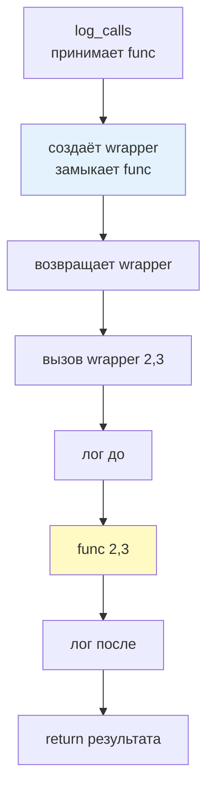
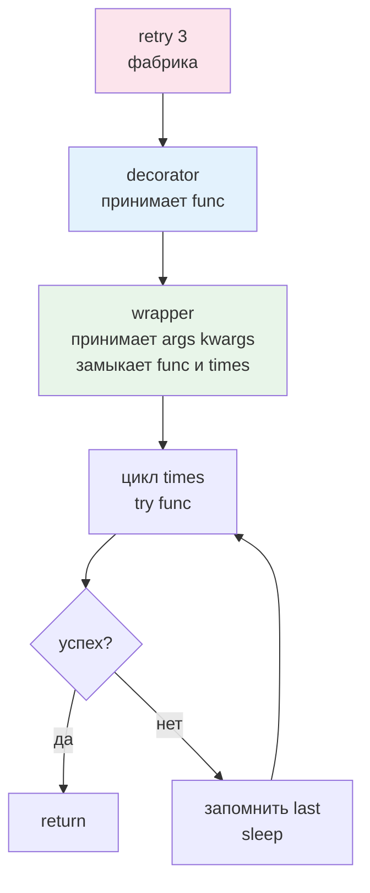
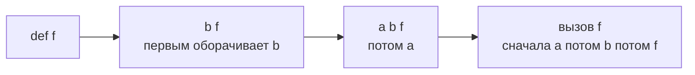
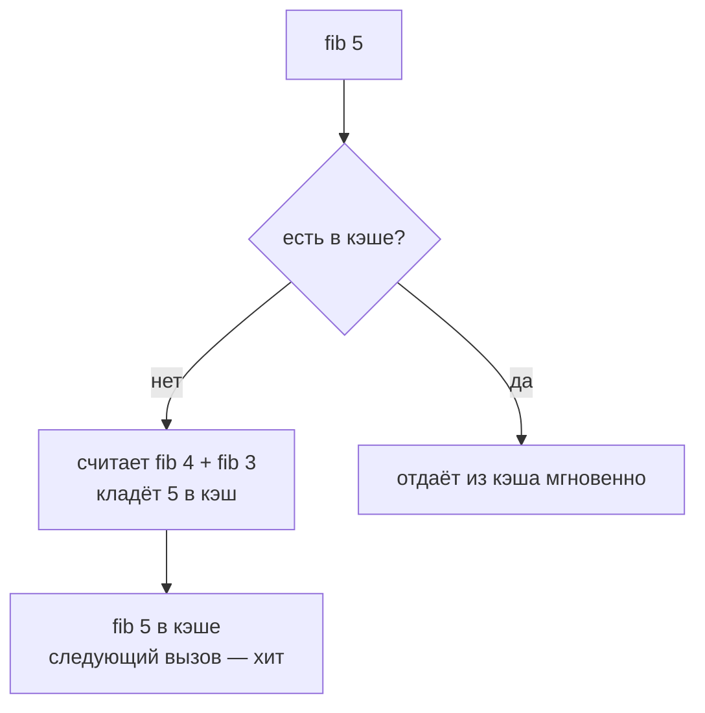

# 07. Декораторы — обёртки с сохранением смысла, разжёвано для новичка

> [!abstract] О чём лекция
> Декоратор — способ обернуть функцию, не меняя её код: добавить логирование, проверку, кэш, повтор. В Python это возможно, потому что функции — объекты: их можно передавать, возвращать и хранить.
> **Ключевая мысль:** декоратор — это функция, которая принимает функцию и возвращает новую — её «обёртку».

> [!tip] Что нужно знать заранее
> [[14. Функции и модули]] — `def`, `return`, область видимости; [[02. Типизация и аннотации]] — `Callable`. Про замыкания ниже всё разжёвано — опыта с ними не нужно.

---

# Функция как объект — база для декоратора

```mermaid
flowchart LR
  A[def greet] --> B[объект-функция в памяти]
  B --> C[переменная greet указывает на объект]
  C --> D[call = greet<br>вторая стрелка на тот же объект]
  B --> E[run(greet, ...)<br>передали объект аргументом]
```

```python
def greet(name: str) -> str:
    return f"Привет, {name}"

print(greet)          # <function greet at 0x...>
call = greet          # второе имя для той же функции
print(call("Аня"))    # Привет, Аня — вызвали через переменную

def run(func, value):
    return func(value)

print(run(greet, "Борис"))  # Привет, Борис — передали функцию аргументом
```

Раз функция — объект, её можно **вернуть** из другой функции — так появляется обёртка.

> [!tip] Аналогия — пульт
> Функция как телевизор: `greet` — наклейка «ТВ». `call = greet` — вторая наклейка на тот же ТВ. `run(greet, ...)` — отдал пульт другу, он нажал кнопку. Декоратор — чехол: надел на ТВ, ТВ тот же, вид другой.

---

# Первый декоратор — логирующий

Задача: перед каждым вызовом печатать, что вызвали и с чем.



```python
def log_calls(func):
    def wrapper(*args, **kwargs):
        print(f"Вызов {func.__name__}{args} {kwargs}")
        result = func(*args, **kwargs)
        print(f"Вернула {result!r}")
        return result
    return wrapper

def add(a: int, b: int) -> int:
    return a + b

logged_add = log_calls(add)
print(logged_add(2, 3))
```

`log_calls(add)` не вызывает `add`, а возвращает новую функцию `wrapper`, которая уже умеет логировать. Синтаксис `@` — то же, короче:

```python
def log_calls(func): ...

@log_calls
def add(a: int, b: int) -> int:
    return a + b

print(add(2, 3))   # то же, что add = log_calls(add)
```

Так читается: «объявляю `add` и тут же оборачиваю её `log_calls`».

---

# `*args` / `**kwargs` — почему обёртка так пишет

Обёртка не знает, какие у исходной функции параметры — один, два, именованные. Поэтому она принимает «всё, что передадут»:

```python
def wrapper(*args, **kwargs):
    # args — кортеж позиционных, kwargs — словарь именованных
    return func(*args, **kwargs)  # та же распаковка при вызове
```

Это делает декоратор **универсальным**: он подходит и к `add(a,b)`, и к `greet(name)`, и к `func()`.

---

# Теряем имя и как его сохранить — `functools.wraps`

Без `wraps` обёртка «съедает» имя и описание исходной функции:

```python
def log_calls(func):
    def wrapper(*args, **kwargs):
        return func(*args, **kwargs)
    return wrapper

@log_calls
def add(a, b):
    """Складывает a и b."""
    return a + b

print(add.__name__)   # wrapper — не то!
print(add.__doc__)    # None — потеряли
```

Исправляется одной строкой:

```python
import functools

def log_calls(func):
    @functools.wraps(func)
    def wrapper(*args, **kwargs):
        print(f"Вызов {func.__name__}")
        return func(*args, **kwargs)
    return wrapper

@log_calls
def add(a, b):
    """Складывает a и b."""
    return a + b

print(add.__name__)   # add
print(add.__doc__)    # Складывает a и b.
```

> [!important] Правило
> Каждый декоратор-автор пишет `@functools.wraps(func)` на своей `wrapper`. Это сохраняет `__name__`, `__doc__`, `__module__` и `__wrapped__`. Без него ломаются подсказки, тесты и документация.

---

# Декоратор с параметрами — «фабрика декораторов»

Хотим ` @retry(3)` — повторить 3 раза при ошибке. Параметры декоратора — это **ещё один уровень** вложенности:



```python
import functools, time

def retry(times: int):
    def decorator(func):
        @functools.wraps(func)
        def wrapper(*args, **kwargs):
            last = None
            for _ in range(times):
                try:
                    return func(*args, **kwargs)
                except Exception as e:
                    last = e
                    time.sleep(0.1)
            raise last  # все попытки исчерпаны
        return wrapper
    return decorator

@retry(3)
def fetch(url: str) -> str:
    # запрос, который может упасть
    ...
```

Как читается: `retry(3)` **возвращает** декоратор, который уже принимает `func`. Поэтому три уровня: `retry(times)` → `decorator(func)` → `wrapper(*args, **kwargs)`.

> [!warning] Частая ошибка
> Написал `@retry` без скобок, а `retry` ждёт `times` — получишь `TypeError`. Запомни: есть два вида ` @decorator` и `@decorator(...)` — у второго обязательно скобки, даже если `@decorator()`.

---

# Класс-декоратор и декораторы для классов

Декоратором может быть и класс с `__call__`:

```python
class CountCalls:
    def __init__(self, func):
        functools.update_wrapper(self, func)
        self.func = func
        self.calls = 0
    def __call__(self, *a, **kw):
        self.calls += 1
        return self.func(*a, **kw)

@CountCalls
def greet(name): ...
```

А декоратор для класса — обычная функция, принимающая класс:

```python
def add_repr(cls):
    def __repr__(self): return f"{cls.__name__}({self.__dict__!r})"
    cls.__repr__ = __repr__
    return cls

@add_repr
class User:
    def __init__(self, name): self.name = name
```

Так работает `@dataclass` — тоже декоратор, только генерирует `__init__`/`__repr__`.

---

# Хорошие практики и нюансы

**Нюанс 1. Порядок декораторов — снизу вверх.**



```python
@a
@b
def f(): ...  # то же, что f = a(b(f))
```

Сначала `b` оборачивает `f`, потом `a`. На вызове — наоборот: `a` → `b` → `f`.

**Нюанс 2. Декоратор не должен менять поведение без нужды.** Логирование, кэш, проверка — ок; менять тип возвращаемого значения молча — нет.

**Нюанс 3. Сохраняй сигнатуру, если нужна проверка.** `functools.wraps` копирует имя/doc, но не сигнатуру. Для строгой проверки используют `inspect.signature` или библиотеку `decorator` — в базовом курсе достаточно `wraps`.

**Нюанс 4. Для методов — `self` уже в `*args`.** Тот же `wrapper(*args, **kwargs)` работает и для методов.

**Нюанс 5. Известные декораторы из стандартной библиотеки:**

| Декоратор | Что делает |
|---|---|
| `@functools.lru_cache` | мемоизация: помнит прошлые вызовы |
| `@property`, `@classmethod`, `@staticmethod` | уже знакомы |
| `@functools.cached_property` | как `@property`, но считается один раз |

```python
from functools import lru_cache

@lru_cache(maxsize=None)
def fib(n: int) -> int:
    return n if n < 2 else fib(n-1) + fib(n-2)
```



**Практика:** декоратор — как строительные леса: надел, проверил, снял — исходная функция не менялась. Поэтому его любят для «поперечных» задач: логи, метрики, повторы, права.

---

# Типичные заблуждения

- ❌ **«Декоратор вызывает функцию сразу»** — нет, он возвращает обёртку; вызов будет позже.
- ❌ **«Без `*args/**kwargs` можно, я знаю параметры»** — тогда декоратор подойдёт только к одной сигнатуре.
- ❌ **«`@wraps` — для красоты»** — без него ломаются `help()`, тесты, дебаггер.
- ❌ **«`@decorator` и `@decorator()` — одно и то же»** — разное: первое передаёт функцию, второе вызывает фабрику.
- ❌ **«Декоратор — только для функций»** — и для классов тоже.

---

# Ключевые термины

| Термин | Определение |
|---|---|
| **Функция высших порядков** | принимает или возвращает другую функцию |
| **Замыкание** | `wrapper` помнит `func` из внешней области |
| **Декоратор** | функция `(func) -> wrapper`, часто с `@` |
| **`functools.wraps`** | сохраняет имя/doc исходной функции |
| **Фабрика декораторов** | `decorator_factory(args) -> decorator -> wrapper` |

---

# Проверь себя

1. Что делает `@log_calls` над `def add`?
2. Зачем `*args/**kwargs` в обёртке?
3. Что сломается без `@wraps`?
4. Как написать декоратор с параметром `times`?
5. В каком порядке применяются `@a @b`?

> [!example]- Ответы
> 1. Заменяет `add` на `wrapper`, которая логирует и вызывает исходную.
> 2. Чтобы обёртка подошла к любой сигнатуре — с любыми позиционными и именованными аргументами.
> 3. `__name__`, `__doc__`, `__wrapped__` — подсказки и тесты покажут `wrapper`.
> 4. Три уровня: `def retry(times): def decorator(func): @wraps(func) def wrapper(...): ... return wrapper; return decorator`.
> 5. Снизу вверх: `f = a(b(f))`.

---

# Практика

- **Задачи.** Написать `@timer`, `@retry`, `@memoize` руками (с `wraps`); измерить ускорение `fib` с `lru_cache`.
- **Дальше:** [[04. Датаклассы — когда и как, и где дополняет Pydantic]] — декоратор `@dataclass` в деле.

---

# Связи с другими темами

- [[14. Функции и модули]] — `*args/**kwargs` и `if __name__`
- [[03. Словари с формой — TypedDict и современный синтаксис]] — типизация обёрток `Callable`
- [[04. Датаклассы — когда и как, и где дополняет Pydantic]] — `@dataclass` как декоратор
- `02_Курсы/01. Инженерные практики Python/01_Лекции/16. Проектирование - фабрики и реестры` — где декораторы регистрируют обработчики
