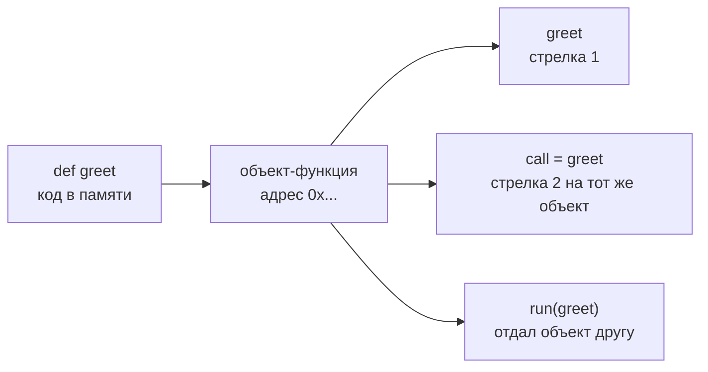
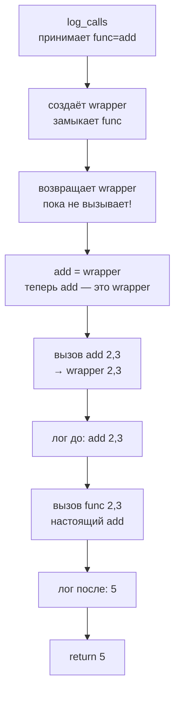
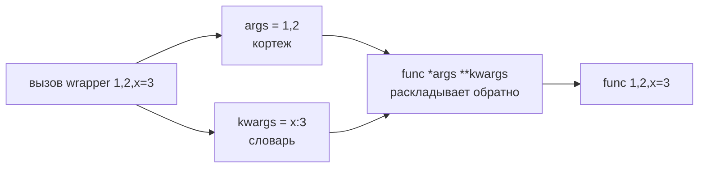
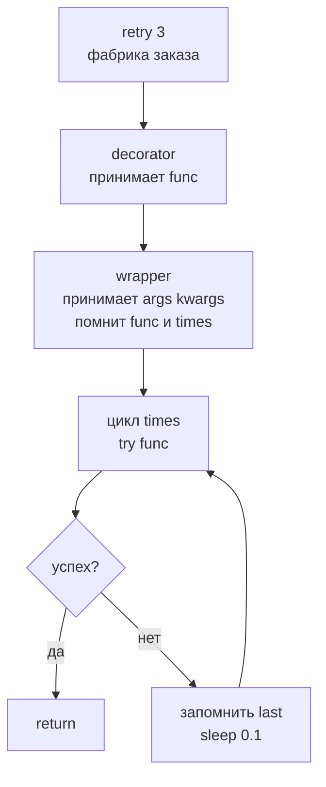
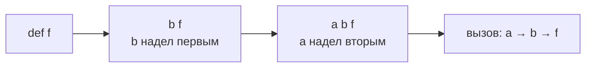
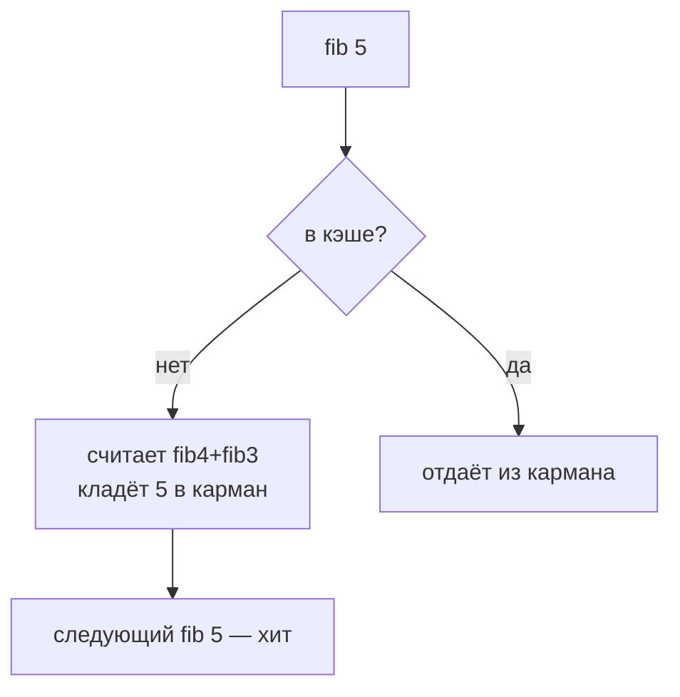

# 07. Декораторы — обёртки с сохранением смысла, разжёвано для новичка

> [!abstract] О чём лекция — для чайника
> Представь функцию как коробку с кнопкой. Декоратор — это чехол на коробку: кнопка та же, но чехол добавляет «пикнуть» перед нажатием. В Python это возможно потому что функция — объект как число или строка: её можно положить в переменную, передать другу, вернуть из функции. Декоратор — функция которая **принимает функцию и возвращает новую — её обёртку**. Научишься добавлять логирование, замер времени, кэш, повтор — не меняя исходный код.
>
> **Ключевая мысль для запоминания:** `@decorator` = `func = decorator(func)` — просто синтаксический сахар.

> [!tip] Что нужно знать заранее — всего две вещи
> `def` и `return` из [[14. Функции и модули]] и что `Callable` из [[02. Типизация и аннотации]] это «что-то вызываемое». Замыкание ниже разжёвано с нуля — опыта не нужно.

---

# Функция как объект — база, без этого декоратор магия

В Python функция — не заклинание, а **объект в памяти** как список. На него можно указать двумя именами:



```python
def greet(name: str) -> str:
    return f"Привет, {name}"

print(greet)           # <function greet at 0x...> — объект!
call = greet           # второе имя на тот же объект
print(call("Аня"))     # Привет, Аня — вызвали через второе имя
print(greet("Аня"))    # то же — две стрелки на одну коробку

def run(func, value):  # func — тот же объект, просто параметр
    return func(value)

print(run(greet, "Борис"))  # Привет, Борис — передали функцию как число
```

> [!tip] Аналогия для чайника — пульт и телевизор
> `def greet` — собрал телевизор и наклеил бумажку `greet`. `call = greet` — наклеил вторую бумажку `call` на тот же телевизор. `run(greet, ...)` — отдал телевизор другу, он нажал кнопку. Декоратор — чехол: телевизор тот же, вид другой, кнопка работает через чехол.

Раз функцию можно **вернуть** из другой функции — появляется обёртка:

```python
def make_wrapper(func):
    def wrapper():  # новая коробка которая внутри помнит func
        print("до")
        func()
        print("после")
    return wrapper  # вернули новую коробку, не вызывали!
```

---

# Первый декоратор — логирующий, шаг за шагом

Задача для новичка: перед каждым вызовом `add` печатать «вызвали с ...» и «вернула ...», но **не лезть в код `add`**.



Шаги для чайника:

1. `log_calls` — фабрика чехлов. Ей даёшь `add`, она шьёт чехол `wrapper`.
2. `wrapper` — чехол. Внутри помнит `func` (замыкание — карман чехла).
3. Возвращаешь чехол, а не результат. Вызов будет потом.

```python
def log_calls(func):
    def wrapper(*args, **kwargs):
        print(f"Вызов {func.__name__}{args} {kwargs}")
        result = func(*args, **kwargs)  # настоящий вызов
        print(f"Вернула {result!r}")
        return result
    return wrapper  # ← не func(), а wrapper

def add(a: int, b: int) -> int:
    return a + b

logged_add = log_calls(add)  # надели чехол, не вызывали!
print(logged_add(2, 3))
# Вызов add(2, 3) {}
# Вернула 5
# 5
```

Синтаксис `@` — то же, но короче. Читается для чайника: «объявляю `add` и тут же надеваю чехол `log_calls`»:

```python
def log_calls(func): ...

@log_calls              # ← сахар: add = log_calls(add)
def add(a: int, b: int) -> int:
    return a + b

print(add(2, 3))  # уже логирует
```

> [!warning] Для чайника — не путай создание и вызов
> `log_calls(add)` — надели чехол (вернули `wrapper`). `logged_add(2,3)` — нажали кнопку через чехол. Декоратор **не вызывает** функцию сразу.

---

# `*args` / `**kwargs` — почему чехол так пишет, для чайника

Чехол не знает какие у коробки кнопки: `add(a,b)` — две, `greet(name)` — одна, `func()` — ноль. Чтобы подойти ко всем, чехол делает универсальный вход «сколько дадут»:



```python
def wrapper(*args, **kwargs):
    # args — кортеж позиционных, kwargs — словарь именованных
    # *args, **kwargs в определении — «собери всё что дали»
    # *args, **kwargs в вызове — «разложи обратно»
    return func(*args, **kwargs)
```

Для чайника: `*args` — мешок куда падают все позиционные, `**kwargs` — коробка куда падают именованные. Чехол их ловит и перебрасывает дальше без разбора. Поэтому декоратор **универсален** — подходит и к `add(a,b)` и к `greet(name)`.

---

# Теряем имя — как не потерять паспорт, `functools.wraps`

Без `wraps` чехол крадёт паспорт:

```python
def log_calls(func):
    def wrapper(*args, **kwargs):
        return func(*args, **kwargs)
    return wrapper

@log_calls
def add(a, b):
    """Складывает a и b."""
    return a + b

print(add.__name__)  # wrapper — ой!
print(add.__doc__)   # None — потеряли описание!
help(add)            # показывает wrapper, не add
```

Исправляется одной строкой — наклей паспорт обратно:

```python
import functools

def log_calls(func):
    @functools.wraps(func)  # ← скопируй паспорт func на wrapper
    def wrapper(*args, **kwargs):
        print(f"Вызов {func.__name__}")
        return func(*args, **kwargs)
    return wrapper

@log_calls
def add(a, b):
    """Складывает a и b."""
    return a + b

print(add.__name__)  # add — вернули!
print(add.__doc__)   # Складывает a и b.
print(add.__wrapped__)  # исходная add — есть!
```

> [!important] Правило для чайника — всегда пиши `@wraps`
> Каждый чехол — `@functools.wraps(func)` на `wrapper`. Без него ломаются подсказки IDE, `help()`, тесты и документация. Это не красота, а паспорт.

---

# Декоратор с параметрами — фабрика чехлов ` @retry(3)`

Хочешь `@retry(3)` — повторить 3 раза при ошибке. Параметры — это **ещё один слой**: фабрика чехлов.

Для чайника: `retry(3)` — заказ чехла «на 3 попытки». Заказ возвращает чехол-decorator, а тот уже надевается.



Три уровня для запоминания:

```python
import functools, time

def retry(times: int):          # 1. фабрика: сколько попыток
    def decorator(func):        # 2. декоратор: какую функцию
        @functools.wraps(func)
        def wrapper(*args, **kwargs):  # 3. чехол: какие аргументы
            last = None
            for _ in range(times):
                try:
                    return func(*args, **kwargs)  # пробуем
                except Exception as e:
                    last = e
                    time.sleep(0.1)
            raise last  # все исчерпаны
        return wrapper
    return decorator

@retry(3)                # ← сначала retry(3) → decorator, потом decorator(fetch)
def fetch(url: str) -> str:
    # запрос который может упасть
    ...
```

Читается: `retry(3)` **возвращает** декоратор, декоратор принимает `func` и возвращает `wrapper`. Поэтому ` @retry(3)` и ` @retry` — разное:

- ` @decorator` — чехол без заказа (декоратор сам `func` принимает);
- ` @decorator(...)` — заказ чехла (фабрика), скобки обязательны даже `@decorator()`.

> [!warning] Частая ошибка чайника
> Написал `@retry` без `(3)` а `retry` ждёт `times` — `TypeError: missing 1 required argument`. Запомни два вида.

---

# Класс-декоратор и декоратор для класса — для полноты

Чехлом может быть класс с `__call__` (коробка которая вызывается как функция):

```python
class CountCalls:
    def __init__(self, func):
        functools.update_wrapper(self, func)  # паспорт
        self.func = func
        self.calls = 0
    def __call__(self, *a, **kw):
        self.calls += 1
        print(f"вызов #{self.calls}")
        return self.func(*a, **kw)

@CountCalls
def greet(name): print(f"Привет, {name}")

greet("Аня"); print(greet.calls)  # 1
```

Декоратор для класса — функция которая принимает класс:

```python
def add_repr(cls):
    def __repr__(self): return f"{cls.__name__}({self.__dict__!r})"
    cls.__repr__ = __repr__
    return cls

@add_repr
class User:
    def __init__(self, name): self.name = name

print(User("Аня"))  # User({'name': 'Аня'})
```

Так работает `@dataclass` — декоратор генерирует `__init__`/`__repr__` за тебя.

---

# Хорошие практики и нюансы — шпаргалка для чайника

**Нюанс 1. Порядок — снизу вверх, как матрёшка.**



```python
@a
@b
def f(): ...  # f = a(b(f))
```

Сначала `b` надел чехол, потом `a`. При вызове — наоборот: `a` → `b` → `f`.

**Нюанс 2. Чехол не меняет коробку без нужды.** Логирование, кэш, проверка — ок; тихо менять `str`→`int` — нет.

**Нюанс 3.** `wraps` копирует паспорт, но не сигнатуру. Для строгой проверки — `inspect.signature` или `decorator` — в базе хватает `wraps`.

**Нюанс 4. Для методов `self` уже в `*args`.** Тот же `wrapper(*args, **kwargs)` работает.

**Нюанс 5. Известные чехлы из stdlib:**

| Чехол | Что делает — для чайника |
|---|---|
| `@functools.lru_cache` | запоминает ответы: второй раз не считает |
| `@property` | поле как формула |
| `@functools.cached_property` | как `@property` но считает один раз |

```python
from functools import lru_cache

@lru_cache(maxsize=None)
def fib(n: int) -> int:
    return n if n < 2 else fib(n-1) + fib(n-2)

# без кэша fib(35) — секунды, с кэшем — миллисекунды
print(fib(35))
```



> Декоратор — строительные леса: надел, проверил, снял — коробка не менялась. Любят для поперечных задач: логи, метрики, повторы, права.

---

# Типичные заблуждения — чайник, не верь

- ❌ «Декоратор сразу вызывает функцию» — нет, возвращает чехол, вызов позже.
- ❌ «Без `*args/**kwargs` можно, я знаю параметры» — чехол подойдёт только к одной коробке.
- ❌ «`@wraps` для красоты» — без него `help()` врёт, тесты падают.
- ❌ «`@decorator` = `@decorator()`» — разное: первое — чехол, второе — заказ чехла.
- ❌ «Только для функций» — и для классов.

---

# Ключевые термины — для чайника

| Термин | Что это простыми словами |
|---|---|
| Функция высшего порядка | функция которая принимает/возвращает функцию (как `run`) |
| Замыкание | чехол помнит `func` из кармана (внешней области) |
| Декоратор | `func → wrapper` с `@` |
| `@wraps` | наклей паспорт обратно |
| Фабрика декораторов | `заказ(args) → decorator → wrapper` |

---

# Проверь себя — для чайника

1. Что делает `@log_calls` над `def add`?
2. Зачем чехлу `*args/**kwargs`?
3. Что сломается без `@wraps`?
4. Как написать ` @retry(3)`?
5. Порядок `@a @b`?

> [!example]- Ответы
> 1. `add = log_calls(add)` — надевает чехол `wrapper` который логирует и вызывает настоящий `add`.
> 2. Чтобы чехол подошёл к любой коробке — с любыми аргументами.
> 3. Паспорт: `__name__/__doc__/__wrapped__` — IDE и `help` покажут `wrapper`.
> 4. Три матрёшки: `def retry(times): def decorator(func): @wraps(func) def wrapper(...): ... return wrapper; return decorator`.
> 5. Снизу вверх: `f = a(b(f))`, вызов `a→b→f`.

---

# Практика

Написать `@timer` (замер), `@retry` (повтор), `@memoize` руками **с `wraps`**; измерить `fib` с `lru_cache`. Дальше — [[04. Датаклассы — когда и как, и где дополняет Pydantic]] — `@dataclass` как чехол.

---

# Связи с другими темами

- [[06. Остатки продвинутого синтаксиса]] — `*args/**kwargs` подробно
- [[03. Словари с формой — TypedDict и современный синтаксис]] — `Callable` для типизации чехла
- [[04. Датаклассы — когда и как, и где дополняет Pydantic]] — `@dataclass` как декоратор
- [Real Python — Decorators](https://realpython.com/primer-on-python-decorators/) · [functools.wraps](https://docs.python.org/3/library/functools.html#functools.wraps)

