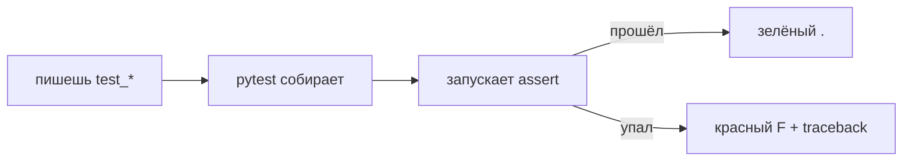
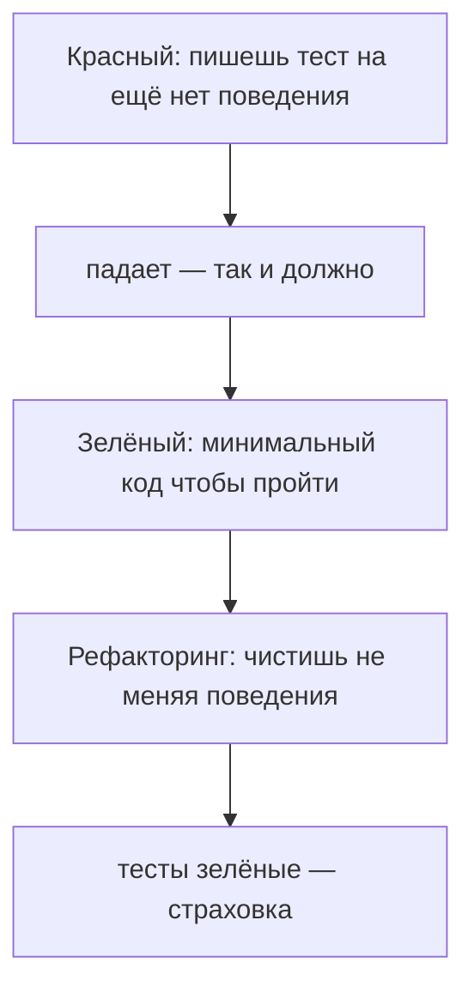

# 08. Тесты

> [!abstract] О чём лекция
> Тест — код, который проверяет код. Нужен не «для галочки», а чтобы **менять программу и знать что не сломал старое**. В курсе Python ты проверял руками: запустил, посмотрел вывод. Здесь то же — но одной командой `pytest`, хоть сто раз, в том числе в CI.
>
> После лекции ты напишешь `test_withdraw.py` с `assert`, `pytest.raises` и `parametrize`, поймёшь `fixture`/`tmp_path` и цикл *красный → зелёный → рефакторинг*.

> [!tip] Что нужно
> Функции из [[14. Функции и модули]], `assert` и `raise` из [[01. Обработка ошибок полностью]]. Всё запускаем через `uv` — примеры копируемы.

---

# От `assert` к `pytest` — зачем фреймворк

Минимальный тест — утверждение:

```python
def rubles(amount: float) -> str:
    return f"{amount:.2f} руб."

assert rubles(100) == "100.00 руб."
assert rubles(0) == "0.00 руб."
print("проверки прошли")
```

Работает, но при падении не видно *какая* из проверок и сколько всего. `pytest` оформляет проверки как **функции** и даёт отчёт:

```python
# test_withdraw.py
import pytest

class BalanceError(Exception): ...

def withdraw(balance: float, amount: float) -> float:
    if amount <= 0: raise ValueError("сумма должна быть положительной")
    if amount > balance: raise BalanceError("недостаточно средств")
    return balance - amount

def test_withdraw_reduces_balance():
    assert withdraw(100, 30) == 70

def test_withdraw_whole_balance():
    assert withdraw(50, 50) == 0

@pytest.mark.parametrize("amount", [0, -1, -100])
def test_withdraw_rejects_non_positive(amount):
    with pytest.raises(ValueError):
        withdraw(100, amount)

def test_withdraw_more_than_balance():
    with pytest.raises(BalanceError, match="недостаточно"):
        withdraw(100, 250)
```

Запуск:

```bash
uv add --dev pytest
uv run pytest -q          # -q = коротко: точки и итог
uv run pytest -v          # -v = подробно: имя каждого теста
uv run pytest -k "non_positive"  # только подходящие по имени
```

Вывод:

```text
......                                                                   [100%]
6 passed in 0.01s
```

> [!note] Почему файл `test_*.py` и функция `test_*`
> `pytest` находит тесты **по имени** — без регистрации. Это соглашение из [документации pytest](https://docs.pytest.org/en/stable/explanation/goodpractices.html). Нарушишь — тест просто не запустится.

---

# Правила `pytest` — шпаргалка

| Правило | Смысл | Пример |
|---|---|---|
| файл `test_*.py` или `*_test.py` | авто-поиск | `test_withdraw.py` |
| функция `test_*` | тест | `def test_withdraw_whole_balance():` |
| проверка — `assert` | не учи `assertEqual` | `assert withdraw(50,50)==0` |
| одно поведение — один тест | упавший сразу говорит *что* сломалось | отдельные `test_*` для границ |
| имя — ожидание | читается как требование | `test_withdraw_rejects_non_positive` |

Полезные приёмы:

- `with pytest.raises(Тип):` — проверяем что **падает** нужной ошибкой (тоже поведение!);
- `match="текст"` — проверяем сообщение (регулярка);
- `@pytest.mark.parametrize("amount", [...])` — один тест на много наборов, не копируй функции;
- `pytest.raises` + `match` — ловит только нужный текст, не любой `ValueError`.



---

# Фикстуры и `tmp_path` — общая подготовка

Фикстура — «подготовь мне данные перед тестом». Использует `withdraw` выше:

```python
import pytest

@pytest.fixture
def balance() -> float:
    return 100

def test_withdraw_from_fixture(balance: float):
    assert withdraw(balance, 30) == 70
```

`pytest` сам вызовет `balance()` и передаст значение в тест. Фикстуры бывают с областью `scope="function"` (по умолчанию — на каждый тест), `module`, `session`.

Для файлов — встроенная фикстура `tmp_path` (временная папка, удаляется после теста):

```python
def test_write_report(tmp_path):
    report = tmp_path / "report.txt"
    report.write_text("итог: 70\n", encoding="utf-8")
    assert report.read_text(encoding="utf-8") == "итог: 70\n"
    # папка исчезнет — не мусорим
```

> [!tip] Не делай `open("/tmp/...")` руками
> `tmp_path` кроссплатформенна, уникальна для каждого теста и чистится сама. См. [pytest tmp_path](https://docs.pytest.org/en/stable/how-to/tmp_path.html).

Другие встроенные: `capsys` (ловит `print`), `monkeypatch` (подменяет переменные окружения).

---

# Что тестировать первым — границы и баги

1. **Границы.** `0`, `1`, `максимум`, `пусто`, `отрицательно`. Для `withdraw`: `amount==0`, `amount==balance`, `amount>balance`.
2. **То, что уже ломалось.** Нашёл баг → сначала тест который его повторяет (*красный*), потом правка → *зелёный*. Баг не вернётся (регрессия).
3. **Чистые функции.** «Считает и возвращает» — тестируется тривиально: данные → результат. Поэтому в курсе много раз: *считай и возвращай, печатай — вызывающий*.
4. **Разбор данных.** Пустой файл, битая строка, одна запись — отдельно.

Что **не** тестировать:

- язык: `assert 1+1==2`;
- без проверки: `def test_x(): withdraw(100,30)` — не упадёт и без `assert`;
- реализацию вместо поведения: сравнение внутреннего списка вместо результата.

---

# Красный → зелёный → рефакторинг



Смысл не в ритуале, а в страховке: на шаге *рефакторинг* не страшно трогать код — есть автоматическая проверка.

> [!warning] Тест который не может упасть — бесполезен
> Сломай функцию нарочно (`return 0`) и запусти `pytest`. Остался зелёным — тест ничего не проверяет.

---

# Как в проекте

1. **Тесты рядом с кодом** — папка `tests/` + `uv run pytest`. В VS Code: `"python.testing.pytestEnabled": true` в `.vscode/settings.json`.
2. **Тест — про поведение**, не про устройство: «при `>balance` — `BalanceError`», а не «внутри список».
3. **Каждый баг/фича — с тестом.** Ревью без тестов спрашивает «как проверить что не сломается?» ([[13. Git и GitHub]]).
4. **Медленное подменяют.** Файлы → `tmp_path`, сеть/время → `monkeypatch`/`unittest.mock`. Это мост к [[17. Внедрение зависимостей]].

---

# Типичные заблуждения

| Думают | На самом деле |
|---|---|
| «Тесты писать дольше кода» | Сначала да, потом экономят часы отладки |
| «Только в больших проектах» | Учебную задачу с тестами делать быстрее — не вводишь руками |
| «100% покрытия — цель» | Покрытие = доля строк под тестами. Цель — важные случаи, не процент |
| «Напишу тесты после всего» | Тогда тест повторяет ошибки кода — позже дороже |
| «Тесты мешают менять код» | Мешают менять *поведение* — и это их работа |

> [!tip] Покрытие
> `uv add --dev pytest-cov && uv run pytest --cov=src` — отчёт. 100% не требуй, но <70% — тревожно. См. [pytest-cov](https://pytest-cov.readthedocs.io/).

---

# Проверь себя

1. Почему `test_*` лучше набора `assert` внизу файла?
2. Как проверить что функция падает с `BalanceError` и текстом «недостаточно»?
3. Что делает `parametrize`?
4. Какой тест напишешь первым для разбора файла?
5. Зачем убеждаться что новый тест *краснеет*?
6. Почему чистую функцию тестировать легче?

> [!success]- Ответы
> 1. Видно какая проверка упала, сколько всего, можно запустить выборочно (`-k`).
> 2. `with pytest.raises(BalanceError, match="недостаточно"): withdraw(100,250)`
> 3. Прогоняет один тест на многих наборах — меньше копий, видно на каком упал.
> 4. Границы: пустой, битая строка, одна запись.
> 5. Если не краснеет — не проверяет.
> 6. Нет ввода/файлов: передал → сравнил.

---

# Практика

[[02. Практика. Модульное тестирование и продвинутый синтаксис]] — `parametrize`, фикстуры, `tmp_path`. Дальше — [[09. Отладка и диагностика]]: когда тест упал и неясно почему.

---

# Опора на дисциплину 02

- [[14. Функции и модули]] — маленькие функции, которые можно проверить по отдельности.
- [[15. Работа с файлами]] — где тесты чаще всего нужны.
- [[07. Линейный алгоритм]] — «считай отдельно, печатай отдельно» — без этого тестировать больно.

---

# Связи

- [[02. Типизация и аннотации]] — типы — договор, тесты — поведение.
- [[09. Отладка и диагностика]] — `traceback` + `logging` когда тест красный.
- [[17. Внедрение зависимостей]] — подмена файлов/сети чтобы тесты были простыми.
- [pytest docs](https://docs.pytest.org/) · [Real Python — pytest](https://realpython.com/pytest-python-testing/)

