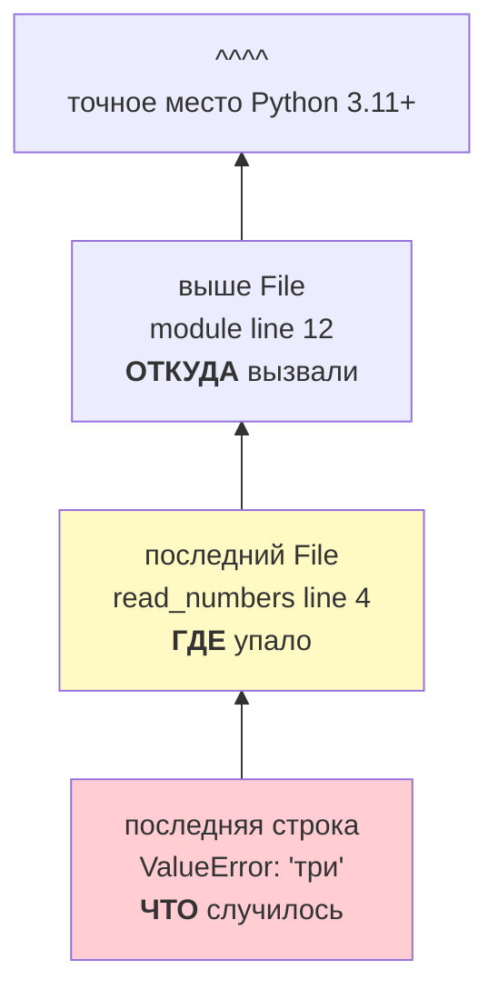
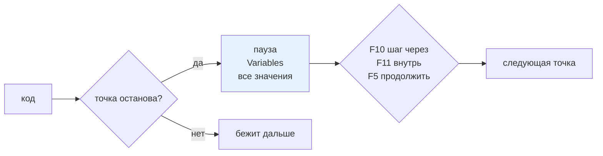
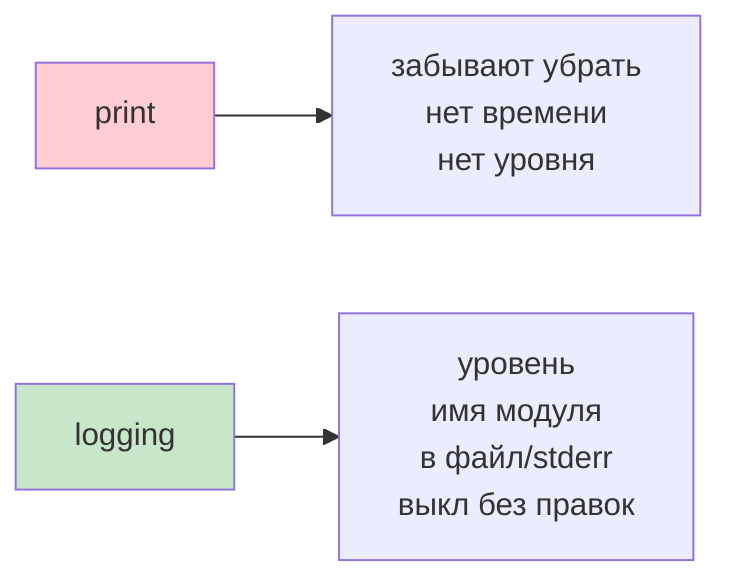
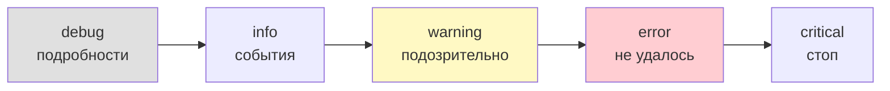
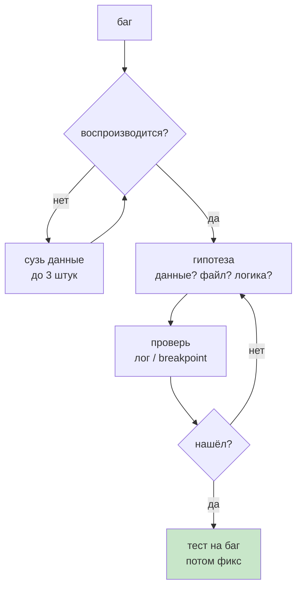

# 09. Отладка и диагностика

> [!abstract] О чём лекция
> Программа сломалась — что делать? В курсе Python был один приём: `print`. Здесь — полный набор: как **читать traceback снизу-вверх**, как останавливать код в VS Code (`F9`/`F5`/`F10`/`F11`) и в терминале `breakpoint()`, и почему в проекте `print` заменяют на `logging` с уровнями `DEBUG→CRITICAL`. Главная мысль: отладка — не угадывание, а **сужение области поиска** по гипотезе.
>
> После лекции ты прочитаешь любой `Traceback` за 10 секунд и включишь логи без правки кода.

> [!tip] Что нужно
> `try/except` из [[01. Обработка ошибок полностью]], тесты из [[08. Тесты]]. Примеры копируемы — запускай в `uv`.

---

# Читаем traceback правильно



```python
def read_numbers(text: str) -> list[int]:
    numbers: list[int] = []
    for part in text.split(","):
        numbers.append(int(part))   # ← упадёт на 'три'
    return numbers

def average(numbers: list[int]) -> float:
    return sum(numbers) / len(numbers)

print(average(read_numbers("1,2,три")))
```

```text
Traceback (most recent call last):
  File "/tmp/eng/crash.py", line 12, in <module>
    print(average(read_numbers("1,2,три")))
                  ^^^^^^^^^^^^^^^^^^^^^^^
  File "/tmp/eng/crash.py", line 4, in read_numbers
    numbers.append(int(part))
                   ^^^^^^^^^
ValueError: invalid literal for int() with base 10: 'три'
```

Как читать за 10 секунд (снизу вверх, но сначала последнюю строку):

| Шаг | Что смотришь | Зачем |
|---|---|---|
| 1 | последняя строка `ValueError: ... 'три'` | **что** случилось — тип и причина |
| 2 | последний свой `File ... line 4` | **где** — твой код, а не библиотека |
| 3 | блок выше `File ... line 12` | **откуда** вызвали — цепочка |
| 4 | `^^^^` под строкой | точное место в выражении |

Три ловушки новичка:

1. `average` в traceback **нет** — аргументы считаются раньше вызова, до `average` не дошли.
2. Ошибка в библиотеке (`json`, `requests`) — чаще всего **твои данные** не те, а не баг библиотеки. Ищи свой первый `File` в списке.
3. `^^^^` появилось в 3.11 — в старых версиях его нет, читай по строке.

> [!tip] Алгоритм
> Последняя строка → последний свой `File` → один шаг вверх. Этого хватает в 90% случаев. Подробно — [Python Tutorial — Errors](https://docs.python.org/3/tutorial/errors.html).

---

# Точки останова — остановиться и посмотреть



**VS Code:** клик слева от номера (`F9` — поставить/снять), `F5` — запустить отладку, `Shift+F5` — стоп.

| Клавиша | Что делает |
|---|---|
| `F5` | продолжить до следующей точки |
| `F10` | шаг через строку (вызов целиком) |
| `F11` | шаг внутрь функции |
| `Shift+F5` | остановить |

**Терминал без VS Code:** `breakpoint()` — встроенная пауза (PEP 553):

```python
def read_numbers(text: str) -> list[int]:
    parts = text.split(",")
    breakpoint()  # ← откроется (Pdb)
    return [int(p) for p in parts]
```

В `(Pdb)`:

| Команда | Что |
|---|---|
| `p parts` | напечатать переменную |
| `n` | следующая строка |
| `s` | внутрь вызова |
| `c` | продолжить |
| `q` | выйти |

> [!warning] Не коммить `breakpoint()`
> Это как `print` — для поиска, не для истории. Поставил → нашёл → убрал. В CI он повесит сборку.

---

# `print` — почему не в проекте



```python
import logging

logging.basicConfig(
    level=logging.INFO,
    format="%(asctime)s %(levelname)s %(name)s %(message)s",
    datefmt="%H:%M:%S",
)
logger = logging.getLogger(__name__)  # имя = твой модуль

def average(numbers: list[int]) -> float | None:
    if not numbers:
        logger.warning("пустой список: среднее не определено")
        return None
    logger.info("считаю среднее по %d числам", len(numbers))  # %d — целое
    return sum(numbers) / len(numbers)

logger.info("среднее [1,2,3]=%s", average([1,2,3]))
logger.warning("среднее []=%s", average([]))
```

```text
20:06:59 INFO __main__ считаю среднее по 3 числам
20:06:59 INFO __main__ среднее [1,2,3]=2.0
20:06:59 WARNING __main__ пустой список: среднее не определено
20:06:59 WARNING __main__ среднее []=None
```

Почему так (подробно — [logging HOWTO](https://docs.python.org/3/howto/logging.html)):

1. **Куда:** `stderr`, а не `stdout` → `python prog.py > result.txt` не заберёт логи, результат чист.
2. **Уровни — фильтр:** `DEBUG` для подробностей, `INFO` для событий, `WARNING`/`ERROR` всегда видны. В проде `level=INFO`, при разборе `DEBUG`.
3. **Формат — один раз:** время, уровень, имя модуля — не пишешь руками.
4. **Экономия:** `logger.debug("вход %r", data)` — склейка только если `DEBUG` включён; `f"вход {data}"` склеит всегда.

Уровни:

| Уровень | Когда | Пример |
|---|---|---|
| `debug` | детали для разбора | `logger.debug("вход %r", parts)` |
| `info` | норма: «сохранил 120 записей» | |
| `warning` | подозрительно, но работаем дальше | пустой список |
| `error` | не удалось: файл не найден | |
| `critical` | программа не может продолжать | |



Передавай значения **аргументами** `%s/%d/%r`, а не `f""` — `f` склеит даже когда лог выключен. `%s` — как `str`, `%r` — как `repr` (с кавычками).

Ошибка с traceback — через `logger.exception` **внутри** `except`:

```python
def read_number(text: str) -> int | None:
    try: return int(text)
    except ValueError:
        logger.exception("не удалось разобрать %r", text)
        return None

read_number("три")
# ERROR не удалось разобрать 'три'
# Traceback ... ValueError: ...
```

Так ошибка не «проглатывается» — в логе и сообщение, и весь `Traceback`.

---

# Приёмы, которые сужают поиск

| Приём | Как | Когда |
|---|---|---|
| маленький пример | 3 числа вместо 3000 | воспроизводится не всегда |
| деление пополам | проверь середину — данные ок? смотри дальше | неясно где ломается |
| лог входа/выхода | `logger.debug("вход %r выход %r", data, res)` | результат «не тот» |
| границы | `[]`, `0`, `1`, `max` | падает «иногда» |
| изолировать | вызови функцию отдельно в REPL | сложная цепочка |



> [!important] Невоспроизводимый баг — не чинят
> Сначала делают тест который падает ([[08. Тесты]]), потом чинят — тогда видно что не вернётся.

---

# Как в проекте

1. **`print` — только в черновике.** В коммите — `logging` с уровнем и `__name__`.
2. **Логи не спамят.** `debug` — подробности, `info` — ключевые события. Тысяча «вошёл в функцию» мешает искать.
3. **Один сбой — один лог.** Либо там где поймал, либо на верхнем уровне — иначе три копии одного `Traceback`.
4. **Гипотеза → проверка.** «Данные не те?» — `p data` в отладчике, а не перечитывание всего файла.
5. **Точка дешевле `print`.** Не правишь код — не забудешь убрать.

---

# Типичные заблуждения

| Думают | На самом деле |
|---|---|
| «Виновата библиотека» | Смотри свой первый `File` — чаще данные не те |
| «Читать снизу и всё» | Сначала последняя строка (*что*), потом свой `File` (*где*) |
| «Лог = `print`» | Уровни, имя модуля, файл, выкл без правок |
| «Больше логов лучше» | Важное тонет — уровни и краткость |
| «Отладчик для профи» | `F9`/`F5`/`p` — с первого дня |

---

# Проверь себя

1. Что читаешь первым в `Traceback`?
2. `F10` vs `F11`?
3. Что делает `breakpoint()` и `p`/`n`?
4. Чем `warning` от `info`?
5. Почему «один лог на ошибку»?
6. Почему баг → тест → фикс?

> [!success]- Ответы
> 1. Последнюю строку — тип и причина, потом свой последний `File`.
> 2. `F10` — перешагнуть вызов, `F11` — зайти внутрь.
> 3. Пауза + `(Pdb)`; `p` — напечатать, `n` — следующая строка.
> 4. `warning` заметен и при `level=INFO` — сигнал «подозрительно, но работаем».
> 5. Дубль скрывает настоящее место — лог пухнет.
> 6. Тест закрепляет условия сбоя — после фикса проверит что не вернулся.

---

# Практика

[[04. Практика. Инструменты и структура]] — починить сломанный отчёт по `traceback` и логам.

---

# Опора на дисциплину 02

- [[06. Среды разработки и виртуальное окружение]] — отладчик VS Code.
- [[05. Язык Python - идентификаторы, операторы, типы данных]] — первый `Traceback` в курсе.

---

# Связи

- [[01. Обработка ошибок полностью]] — какие ошибки ловить.
- [[08. Тесты]] — баг → тест.
- [[15. Docstring]] — меньше отладки если договор ясен.
- [logging HOWTO](https://docs.python.org/3/howto/logging.html) · [traceback](https://docs.python.org/3/library/traceback.html)

