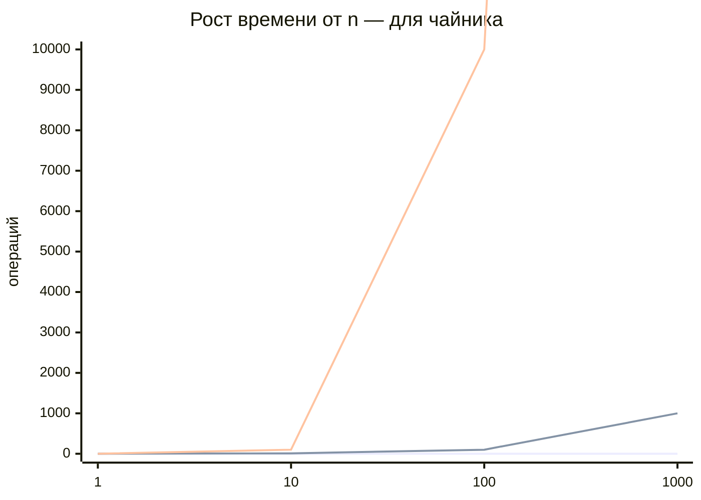
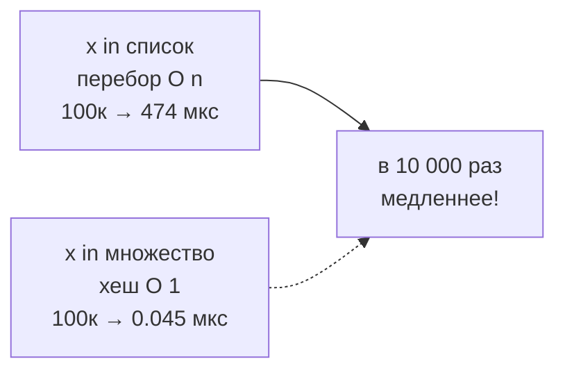
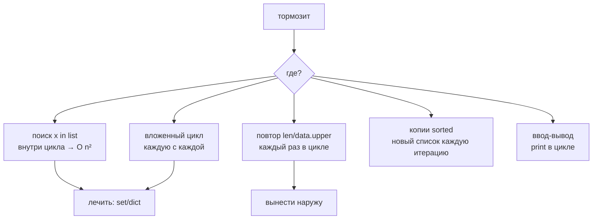
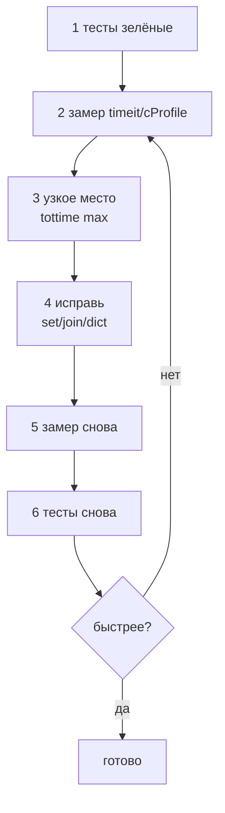

# 10. Сложность и производительность

> [!abstract] О чём лекция — для чайника
> «Тормозит» — не значит «перепиши всё». Сначала **замерь** где тормозит. Здесь словарь «сколько стоит поиск в списке vs множестве» (в 10 000 раз!), инструменты `timeit` (линейка) и `cProfile` (рентген), и правило «сначала замер, потом пили». После лекции ты не будешь гадать «а вдруг здесь медленно» — покажешь цифры.
>
> Представь: `O(1)` — взять книгу с полки по номеру, `O(n)` — перебрать все книги, `O(n²)` — каждую книгу сравнить с каждой.

---

# Порядок роста — словарь, не теория, для чайника

Сложность — ответ на «что будет если данных в 10 раз больше?».



> Нижняя плоская — `O(1)` «полка по номеру» (не зависит), средняя прямая — `O(n)` «перебрать», верхняя взлёт — `O(n²)` «каждую с каждой». Данных ×10 → время: `O(1)` без изменений, `O(n)` ×10, `O(n²)` ×100.

| Как называют | Пишут | Пример для чайника | Данных ×10 → время |
|---|---|---|---|
| константа | `O(1)` | взять `d[key]`, `x in set` — по хешу | не изменилось |
| логарифм | `O(log n)` | `bisect` — делением пополам в отсортированном | чуть-чуть |
| линейная | `O(n)` | `sum(list)`, `x in list` — перебор | ×10 |
| почти линейная | `O(n log n)` | `sorted(list)` | ×10+ |
| квадратичная | `O(n²)` | вложенный цикл `for i: for j:` | **×100** |

Два правила которые запомнит даже чайник:



- `x in список` — идёт по одному: `O(n)`;
- `x in множество`/`словарь` — хеш-таблица: `O(1)`.

На 10 элементах не заметишь, на 100 000 — в 10 000 раз (проверим ниже).

---

# Измеряем: `timeit` — линейка для чайника

`timeit.repeat` — запускает много раз и отдаёт список секунд; берут **минимум** — самое чистое без помех.

```python
import timeit

data_list = list(range(100_000))
data_set = set(data_list)

def measure(func, repeat=5, number=200):
    return min(timeit.repeat(func, repeat=repeat, number=number)) / number

search_list = measure(lambda: 99999 in data_list)
search_set = measure(lambda: 99999 in data_set)
print(f"список:    {search_list*1e6:8.3f} мкс")
print(f"множество: {search_set*1e6:8.3f} мкс")
```

```text
список:     474.217 мкс
множество:    0.045 мкс
```

Для чайника: одна и та же проверка «есть ли 99 999?» — в 10 500 раз быстрее в множестве! `number=200` — сколько раз внутри одного замера (делят чтобы получить один вызов), `lambda: ...` — функция без имени из [[06. Остатки продвинутого синтаксиса]].

Ещё замеры для чайника — что быстрее на 20 000:

```python
parts = ["слово"] * 20_000
numbers = [i % 2000 for i in range(20_000)]

def concat():
    text = ""
    for p in parts: text += p
    return text

def join():
    return "".join(parts)

def unique_list():
    seen = []
    for n in numbers:
        if n not in seen: seen.append(n)
    return seen

def unique_dict():
    return list(dict.fromkeys(numbers))

for f in (concat, join, unique_list, unique_dict):
    best = min(timeit.repeat(f, repeat=5, number=1))
    print(f"{f.__name__:12} {best*1000:8.3f} мс")
```

```text
concat          0.796 мс
join            0.169 мс
unique_list    97.693 мс
unique_dict     0.375 мс
```

| Задача для чайника | Медленно | Быстро | Выигрыш |
|---|---|---|---|
| поиск | `x in list` | `x in set` | ~10 000× |
| строка | `s += part` в цикле | `"".join(parts)` | ~5× |
| уникальные | `if x not in list` | `dict.fromkeys` | ~260× |

> [!note] Для чайника — цифры плавают
> На твоём ноутбуке будут другие, важен **порядок**: множество vs список — тысячи раз, не 10%. `s +=` ускоряется CPython (одна ссылка), но `join` предсказуем — бери его.

---

# Профилирование: рентген `cProfile` — для чайника

`timeit` — линейка для одной операции. Если тормозит вся программа — нужен рентген: какая **функция** жрёт время. `cProfile` — делает снимок.

```python
import cProfile, pstats

def unique_slow(numbers):
    seen = []
    result = []
    for n in numbers:
        if n not in seen:  # ← вот тут O(n) внутри цикла → O(n²)
            seen.append(n)
            result.append(n)
    return result

nums = [i % 1300 for i in range(6_000)]
cProfile.run("unique_slow(nums)", "prof.out")
pstats.Stats("prof.out").sort_stats("tottime").print_stats(4)
```

```text
   ncalls  tottime  percall  cumtime  percall filename:lineno(function)
        1    0.018    0.018    0.018    0.018 prof.py:5(unique_slow)
     2600    0.000    0.000    0.000    0.000 {method 'append' ...}
```

Для чайника:

| Колонка | Что значит простыми словами |
|---|---|
| `ncalls` | сколько раз вызывали |
| `tottime` | время **внутри** функции без детей |
| `cumtime` | время с детьми (всё что она вызвала) |
| первая строка | **кто виноват** — `unique_slow` 0.018с, а `append` 0.000 |

Видишь: `append` 2600 раз, но виноват не он, а `n not in seen` — перебор списка. Рентген показал **место**, думать всё равно тебе.

---

# Типичные источники «тормозит» — для чайника



1. **Поиск в списке внутри цикла** — `if x in seen` где `seen` — `list` из тысяч → `O(n²)`. Лечить `set` (если порядок не важен) или `dict.fromkeys`.
2. **Вложенные циклы по одним данным** — часто `dict` за один проход.
3. **Повторно считаешь в цикле** `len(data)` / `data.upper()` — вынеси до `for`.
4. **Лишние копии** `sorted(data)` где `data.sort()` хватит.
5. **Медленный ввод-вывод** — `print` в 10к цикле, запись по строке — накопи и один `write`.
6. **Не та структура** — `list` где нужен `set`/`dict`.

---

# Порядок действий — для чайника, не гадай



```text
1. Убедись что правильно (тесты зелёные)
2. Замерь — timeit для куска, cProfile для всей
3. Найди самое дорогое — не «подозрительное»
4. Исправь алгоритм/структуру
5. Замерь снова — сравни цифры
6. Прогони тесты — быстрее ≠ правильнее
```

> Без замера — гадание. Чаще тормозит ввод-вывод, а не твои циклы — покажет только рентген.

---

# Как в проекте — для чайника, 5 правил

1. **Сначала понятно, потом быстро.** Преждевременная оптимизация — усложняет без пользы.
2. **Правильная структура > микротрюк.** `set` вместо `list` даёт ×1000, а `x+=1` vs `x=x+1` — копейки.
3. **Меряй на реальных данных.** На 3 элементах разница не видна.
4. **Регрессия производительности.** В больших проектах есть замер который падает если стало медленнее.
5. **Не жертвуй читаемостью за микросекунды.** Если трюк требует 5 строк комментария — не стоит.

---

# Типичные заблуждения — чайник, не верь

| Думают | На самом деле |
|---|---|
| «Медленно → переписать всё» | Тормозит одно место — рентген покажет |
| `list` и `set` почти одно | Для `in` — тысячи раз на 100к |
| Включения всегда быстрее | Быстрее цикла на ту же работу, но алгоритм важнее |
| Оптимизация всегда полезна | Неизмеренная — тратит время и портит читаемость |
| `cProfile` покажет строку-виноватую | Покажет функцию и время — вывод делаешь ты |

---

# Ключевые термины — для чайника

| Термин | Что это простыми словами |
|---|---|
| Сложность `O(...)` | ответ на вопрос «что будет со временем, если данных станет в 10 раз больше» |
| `O(1)` | время не зависит от объёма: `d[key]`, `x in set` — обращение по хешу |
| `O(n)` | линейный перебор: `sum(list)`, `x in list`. Данных ×10 → время ×10 |
| `O(n²)` | вложенный цикл, «каждую с каждой». Данных ×10 → время ×100 |
| Хеш-таблица | устройство `set` и `dict`: значение ищется сразу, без перебора |
| `timeit` | «линейка»: гоняет один кусок кода много раз и считает время |
| `timeit.repeat` | несколько замеров подряд; берут **минимум** — самый чистый, без помех системы |
| `cProfile` | «рентген» всей программы: показывает, какая **функция** съела время |
| `tottime` | время внутри самой функции, без учёта того, что она вызвала |
| `cumtime` | время функции вместе со всеми её вложенными вызовами |
| Узкое место (bottleneck) | строка или функция с наибольшим `tottime` — её и стоит править |
| Преждевременная оптимизация | ускорение без замера: усложняет код, а выигрыша не даёт |

---

# Проверь себя — для чайника

1. Чем `O(1)` от `O(n)` если данных ×10?
2. Почему `x in set` быстрее `x in list`?
3. Зачем `repeat` и минимум?
4. Что `tottime`?
5. Что до и после оптимизации?
6. Почему тесты после?

> [!success]- Ответы
> 1. `O(1)` — без изменений, `O(n)` — ×10, `O(n²)` — ×100.
> 2. Хеш-таблица vs перебор.
> 3. Отсеять помехи (другие процессы), минимум — самое чистое.
> 4. Время внутри самой функции без детей.
> 5. До — убедиться что верно + замер; после — снова замер + тесты.
> 6. Легко сломать поведение — тесты ловят.

---

# Практика

[[05. Практика. Сторонние библиотеки, читаемость и оценка производительности]] — `timeit` vs `cProfile`, `list` vs `set`.

---

# Опора на дисциплину 02

- [[04. Циклический алгоритм — общий вид]] — вложенные циклы `O(n²)`.
- [[09. Циклический алгоритм - цикл for]] — 1000×1000 = 1М шагов.
- [[13. Вложенные последовательности]] — матрицы — частый `O(n²)`.

---

# Связи

- [[08. Тесты]] — защита после оптимизации.
- [[06. Остатки продвинутого синтаксиса]] — `dict.fromkeys`.
- [[00. NumPy]] — векторизация вместо циклов — главный выигрыш.
- [timeit](https://docs.python.org/3/library/timeit.html) · [cProfile](https://docs.python.org/3/library/profile.html) · [Big O cheatsheet](https://www.bigocheatsheet.com/)

