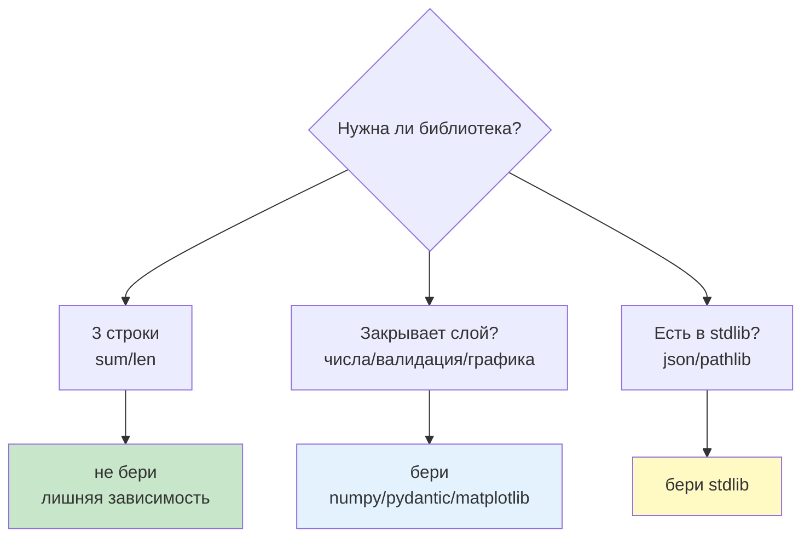
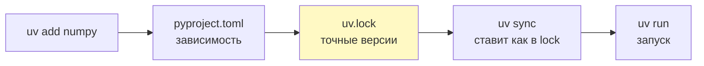
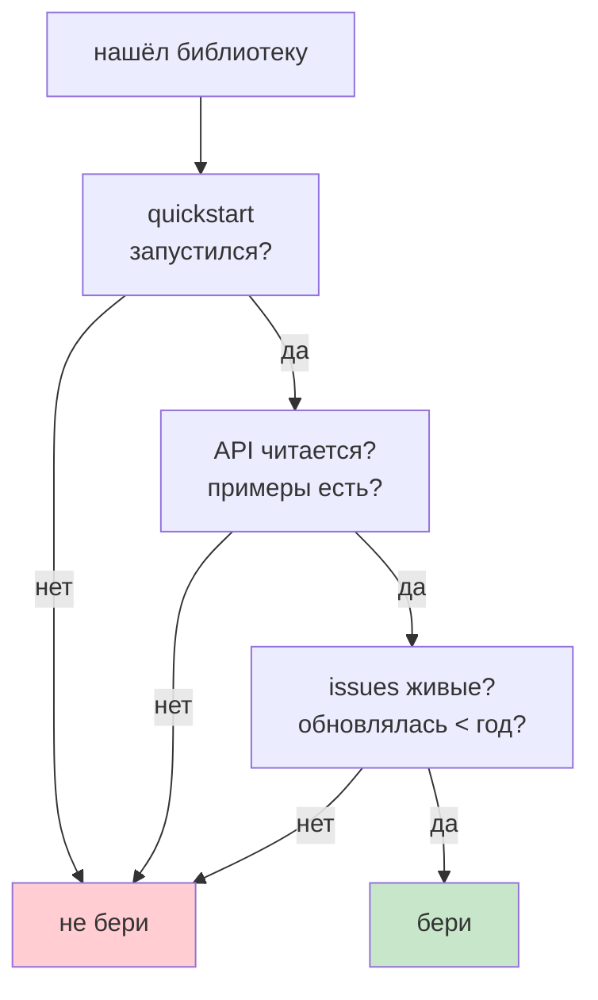

# 11. Сторонние библиотеки

> [!abstract] О чём лекция
> До сих пор — только язык и `stdlib` (`math`, `json`, `pathlib`). В реальности **большая часть кода — чужие библиотеки**. Здесь как их брать (`uv add`), как не утонуть в версиях (`pyproject.toml` / `uv.lock`) и главное — **когда брать, а когда писать самому**. После лекции ты отличишь «надо `numpy`» от «хватит `sum/len`».
>
> Нужно: `uv` из [[06. Среды разработки и виртуальное окружение]] и умение читать `traceback`.

---

# Зачем библиотека



Правило: **библиотеку берут когда она закрывает целый слой, а не чтобы «короче»**. Своя реализация будет хуже, медленнее или с багами:

| Задача | Своими руками | Библиотека | Вывод |
|---|---|---|---|
| среднее по 10 числам | 3 строки | `statistics.mean` | не надо |
| 100к чисел | цикл — миллисекунды | `numpy` — доли мс | бери (замер в [[10. Сложность и производительность]]) |
| проверить форму из API | 30 `if` | `pydantic` модель | бери |
| график | нельзя вручную | `matplotlib` 5 строк | бери |
| `json`/`pathlib` | уже в `stdlib` | не ищи на PyPI | бери `stdlib` |

> Первая строка — главная: если `stdlib` хватает — библиотека только добавит вес и риск.

---

# Установка — `uv add`

```bash
uv init my-project
uv add numpy                 # в зависимости
uv add --dev pytest mypy    # только для разработки
uv run python main.py       # запуск в окружении проекта
uv sync                     # восстановить по lock-файлу
```



Что где лежит:

| Файл | Что | Коммитят? |
|---|---|---|
| `pyproject.toml` | «паспорт»: имя, зависимости `dependencies = ["numpy>=1.26"]` | **да** |
| `uv.lock` | точные версии + хеши со всех машин | **да** |
| `.venv/` | папка с установленным | **нет** (в `.gitignore`) |
| `.python-version` | версия Python | **да** |

«Коммитят» = `git add` + `commit` → история; то что в `.gitignore` в историю не попадает (подробно — [[13. Git и GitHub]]).

Версии `major.minor.patch` (`1.26.4`): `major` — ломает совместимость, `minor` — новое, `patch` — фиксы. Запись `numpy>=1.26,<2` — «1.26 и выше, но не 2». `uv` сам подбирает совместимые.

---

# Как читать документацию — за 3 минуты

1. **Установка** → `pip install / uv add` — проверь имя на PyPI.
2. **Quickstart** — скопируй минимальный пример, запусти.
3. **API Reference** — сигнатура `func(a: int) -> str` + пример.
4. **Changelog / Release notes** — что сломалось в `major`.
5. **Issues** — есть ли живой мейнтейнер.



> [!tip] Критерий «брать/не брать» за 5 минут
> Есть quickstart → API читается → обновлялась < год → issues отвечают → можно брать. Нет — ищи альтернативу. См. [Real Python — dependency guide](https://realpython.com/python-dependency-management/).

---

# Когда писать самому

Пиши сам когда:

- **Задача узкая** и на `stdlib` — 10 строк (свой `mean` — не нужен `numpy`).
- **Зависимость дороже задачи** — тянуть `pandas` ради `sum` — перебор.
- **Хочешь контроль** — чужая библиотека может бросить поддержку.

Не пиши сам когда:

- **Слой тяжёлый** — парсинг дат, валидация, криптография — там уже учтены края.
- **Скорость нужна** — `numpy` на C, твой цикл проиграет в 100× (см. [[10. Сложность и производительность]]).
- **Безопасность** — не изобретай свой хеш/токен.

Правило из [The Python Packaging User Guide](https://packaging.python.org/): зависимость — долг: её надо обновлять, она может сломаться. Чем меньше — тем спокойнее.

---

# Хорошие практики

1. **Одна библиотека — одна задача.** Не бери «комбайн» ради одной функции.
2. **Фиксируй версии.** `uv lock` коммить, `uv sync` в CI — одинаковые версии у всех.
3. **Отделяй `dev`.** `pytest/mypy/ruff` → `--dev`, не в прод.
4. **Читай лицензию.** MIT/Apache — ок, GPL — подумай.
5. **Обновляй регулярно.** `uv sync --upgrade` + тесты — не копить долг.

---

# Типичные заблуждения

| Думают | На самом деле |
|---|---|
| «Чем больше библиотек, тем круче» | Каждая — риск и вес |
| «`pip install` без `uv` ок» | Без `lock` — «у меня работает, у тебя нет» |
| «Возьму и разберусь потом» | Сначала quickstart — потом `add` |
| «Своё всегда лучше» | Для слоя — хуже и дороже |

---

# Проверь себя

1. Когда `stdlib` лучше внешней библиотеки?
2. Где точные версии и что коммитят?
3. Зачем `--dev`?
4. Как за 3 минуты понять брать ли библиотеку?
5. Когда писать самому?

> [!success]- Ответы
> 1. Когда хватает `json/pathlib/statistics` — без лишней зависимости.
> 2. `uv.lock` — коммитят; `.venv` — нет.
> 3. Инструменты разработки не нужны в проде — не раздувают образ.
> 4. Quickstart запускается → API читается → обновлялась → issues живые.
> 5. Узкая задача на 10 строк `stdlib` или когда контроль важнее «слоя».

---

# Практика

[[05. Практика. Библиотеки и качество]] — решить брать/не брать на 3 примерах + `uv add` и `lock`.

---

# Опора на дисциплину 02

- [[06. Среды разработки и виртуальное окружение]] — `uv`, `.venv`.
- [[05. Язык Python - идентификаторы, операторы, типы данных]] — `stdlib` vs внешнее.

---

# Связи

- [[12. Структура проекта и модули]] — `pyproject.toml` как паспорт.
- [[13. Git и GitHub]] — что коммитить, что в `.gitignore`.
- [[10. Сложность и производительность]] — `numpy` vs цикл.
- [Packaging User Guide](https://packaging.python.org/) · [Real Python — uv](https://realpython.com/python-uv/)

