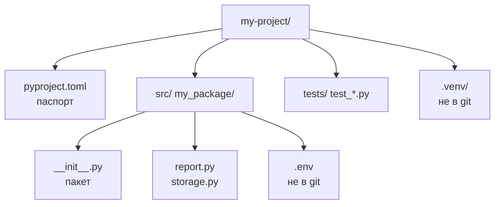
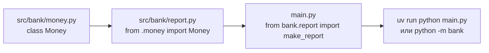

# 12. Структура проекта и модули

> [!abstract] О чём лекция
> Пока код жил в одном файле `main.py` — было просто. В проекте файлов десятки: где что лежит, как импортировать без `sys.path.append`, где хранить настройки чтобы не коммитить пароли. После лекции ты соберёшь `src/my_package` с `pyproject.toml`, `.env` и точкой входа — так что `uv run` и `python -m` работают одинаково.
>
> Нужно: `uv` и `import` из [[14. Функции и модули]].

---

# Структура: как выглядит проект



Минимальный проект:

```text
my-project/
  pyproject.toml
  .env.example      # пример без секретов — коммитят
  .env              # твои секреты — не коммитят
  .gitignore
  src/
    bank/
      __init__.py
      money.py
      report.py
  tests/
    test_report.py
  main.py           # тонкая точка входа
```

Почему `src/`? Чтобы тесты импортировали установленный пакет, а не файл рядом — ловит ошибки упаковки. Рекомендация — [Python Packaging User Guide — src layout](https://packaging.python.org/en/latest/discussions/src-layout-vs-flat-layout/).

`__init__.py` делает папку **пакетом** (в 3.3+ можно без, но с ним явнее; можно оставить пустым или экспортировать `from .money import Money`).

---

# Импорты



Три вида:

```python
# src/bank/money.py
class Money: ...

# src/bank/report.py
from .money import Money              # относительный — внутри пакета
from bank.money import Money          # абсолютный — тоже внутри пакета

# main.py (вне src)
from bank.report import make_report   # абсолютный — из установленного пакета
```

Правило: внутри пакета — **относительные** `.money` или абсолютные `bank.money` — оба ок; извне — только абсолютный `bank.report`. Никогда `sys.path.append("src")` — это костыль; правильно `uv run` или `pip install -e .`.

Запуск:

```bash
uv run python main.py
python -m bank          # если в pyproject указан [project.scripts]
```

---

# `pyproject.toml`: паспорт проекта

```toml
[project]
name = "bank"
version = "0.1.0"
requires-python = ">=3.12"
dependencies = ["pydantic>=2"]

[project.scripts]
bank = "bank.cli:main"   # точка входа: bank → функция main

[tool.ruff]
line-length = 88

[tool.mypy]
strict = true
```

- `dependencies` — что ставить в проде; `uv add` пишет сюда;
- `[project.scripts]` — консольная команда после `uv sync`;
- `[tool.*]` — настройки `ruff/mypy/pytest` в одном файле (раньше было `setup.cfg`).

Подробно — [PEP 621](https://peps.python.org/pep-0621/) и [Packaging guide](https://packaging.python.org/en/latest/specifications/pyproject-toml/).

---

# Конфигурация: настройки отдельно от кода

Код не должен знать пароль от БД. Настройки — в окружении (переменные `env`) и файле `.env`.

## .env — локальные настройки, в git НЕ попадает

```text
# .env.example — коммитят
DB_HOST=localhost
DB_NAME=bank

# .env — не коммитят (в .gitignore)
DB_HOST=prod.db.example.com
DB_PASSWORD=секрет
```

`.gitignore`:

```text
.venv/
.env
__pycache__/
```

## src/bank/config.py — читаем настройки

```python
import os
from pathlib import Path

# uv читает .env сам; без uv — python-dotenv
try:  # локально .env есть
    from dotenv import load_dotenv
    load_dotenv()
except ImportError:
    pass

DB_HOST = os.getenv("DB_HOST", "localhost")
DB_NAME = os.getenv("DB_NAME", "bank")
DB_PASSWORD = os.getenv("DB_PASSWORD", "")  # пусто → упадёт позже честно
```

Запуск с переменными без файла:

```bash
# bash / macOS / Linux
DB_HOST=localhost uv run python main.py

# PowerShell (Windows)
$env:DB_HOST="localhost"; uv run python main.py
```

`uv` читает `.env` автоматически — [uv docs — env](https://docs.astral.sh/uv/). Для `pydantic-settings` есть `BaseSettings` — см. курс `03. Pydantic/05. Настройки приложения`.

> [!warning] Никогда не коммить `.env`
> Пароль в git = пароль в истории навсегда. Коммить только `.env.example` с пустыми примерами.

---

# Как это делают в проекте

1. **Один файл — одна ответственность.** `money.py` — деньги, `report.py` — отчёт, не свалка.
2. **Тонкая `main.py`.** Парсит аргументы, вызывает `make_report`, печатает. Логика — в `src/`.
3. **Все настройки — через `config.py`.** Нет `if DEBUG: host="localhost"` по всему коду.
4. **Установка — `uv sync`.** Новый участник клонирует → `uv sync` → всё как у всех.

---

# Типичные заблуждения

| Думают | На самом деле |
|---|---|
| `src` не нужен | Без `src` тесты видят файл рядом, а не установленный пакет — скрывает ошибки |
| `sys.path.append` — норма | Костыль; правильно `pyproject.toml` + `uv run` |
| Пароль в коде — ок пока приватно | История git помнит всё — только `.env` |
| `__init__.py` не нужен в 3.12 | Можно без, но с ним явно и совместимо с инструментами |

---

# Проверь себя

1. Зачем `src/`?
2. Чем `from .money` от `from bank.money`?
3. Что коммитить: `pyproject.toml`, `uv.lock`, `.venv`, `.env`?
4. Где хранить `DB_PASSWORD`?
5. Зачем `[project.scripts]`?

> [!success]- Ответы
> 1. Тесты видят установленный пакет, а не файл рядом — `src` ловит ошибки упаковки.
> 2. Оба внутри пакета; относительный короче, абсолютный явнее — извне только абсолютный.
> 3. `pyproject.toml` и `uv.lock` — да, `.venv` и `.env` — нет.
> 4. В `env` / `.env`, читает `config.py` через `os.getenv`.
> 5. Консольная команда `bank` → `bank.cli:main`.

---

# Практика

[[04. Практика. Система контроля версий, структура проекта и диагностика]] — собрать `src/bank` с `pyproject.toml`, `.env.example` и точкой входа.

---

# Опора на дисциплину 02

- [[14. Функции и модули]] — `import` и `if __name__`.
- [[06. Среды разработки и виртуальное окружение]] — `uv`, `.venv`.

---

# Связи

- [[11. Сторонние библиотеки]] — `dependencies` в `pyproject.toml`.
- [[13. Git и GitHub]] — что в `.gitignore`.
- [[15. Docstring]] — `help(bank.report)` читается если структура ясна.
- [src layout](https://packaging.python.org/en/latest/discussions/src-layout-vs-flat-layout/) · [PEP 621](https://peps.python.org/pep-0621/)

