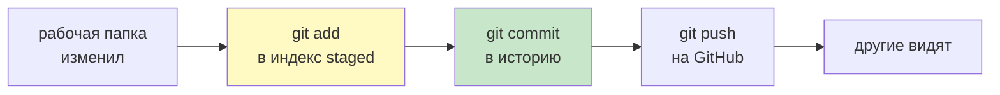
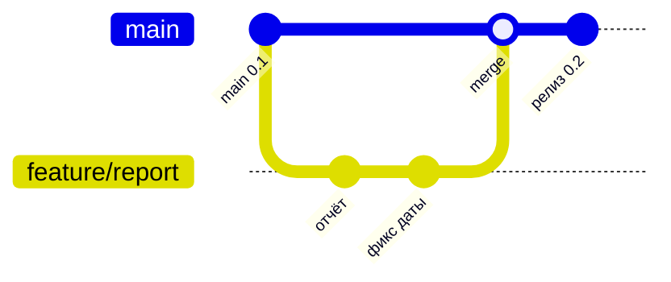
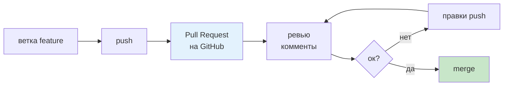

# 13. Git и GitHub

> [!abstract] О чём лекция
> Git — «машина времени» для кода: помнит каждое сохранение (коммит), ветки для параллельной работы и Pull Request для ревью. GitHub — место где эта история живёт и где её обсуждают. После лекции ты сделаешь `add → commit → push`, заведёшь ветку, откроешь PR и разрулишь конфликт — без страха сломать `main`.
>
> Нужно: терминал, `git` установлен ([git-scm.com](https://git-scm.com/)).

---

# Установка и первая настройка

```bash
git --version
git config --global user.name "Твоё Имя"
git config --global user.email "you@example.com"
git config --global init.defaultBranch main
```

Проверка: `git config --list`.

---

# Три состояния файла



| Состояние | Где | Команда |
|---|---|---|
| изменён | рабочая папка | `git status` покажет красным |
| проиндексирован | `staging area` | `git add file.py` |
| сохранён | история `.git/` | `git commit -m "сообщение"` |
| отправлен | GitHub | `git push` |

Минимальный цикл:

```bash
git status
git add src/bank/report.py
git commit -m "feat: добавил отчёт по датам"
git push
```

> Сообщение коммита — как тема письма: `feat:`, `fix:`, `docs:` + что сделал. См. [Conventional Commits](https://www.conventionalcommits.org/).

---

# Что не попадает в репозиторий

`.gitignore` — список игнорируемого:

```text
.venv/
.env
__pycache__/
*.pyc
.DS_Store
```

Проверить: `git status` — игнорируемое не показывается. Коммитить `.gitignore` **надо** — он общий для команды.

---

# Сообщение коммита

Хорошо:

```text
feat: добавил кэш lru_cache для fib

- ускорение 260× на больших данных
- тест test_fib_cached
```

Плохо: `фикс`, `обновил`, `...`.

---

# Ветки



```bash
git switch -c feature/report   # создал и перешёл
# ... правишь ...
git add -A && git commit -m "feat: отчёт"
git push -u origin feature/report
git switch main
git pull
```

Ветка — указатель на коммит, создание — мгновенно. Правило: `main` — всегда зелёная, работу — в ветках `feature/...`, `fix/...`.

---

# Pull request и ревью



Шаги:

1. `push` ветки → на GitHub кнопка **Compare & pull request**.
2. Опиши что и зачем, прикрепи скрин/тест.
3. Коллега комментирует строку → правишь → `push` снова (PR обновится).
4. После `Approve` → **Squash and merge** или **Merge**.

Ревью без тестов спрашивает «как проверить?» — см. [[08. Тесты]].

---

# Конфликты

Два человека поправили одну строку:

```text
<<<<<<< HEAD
x = 1  # твой main
=======
x = 2  # ветка feature
>>>>>>> feature
```

Решение:

```bash
git switch feature/report
git merge main   # или git pull --rebase
# поправь файл, убери <<<<<, оставь нужное
git add file.py
git commit
git push
```

Инструмент VS Code подсвечивает конфликт и даёт кнопки **Accept Current / Incoming / Both**.

---

# Полезные команды для разбора

```bash
git log --oneline --graph --all -10   # история
git diff              # что изменил не в индексе
git diff --staged     # что в индексе
git show HEAD         # что в последнем коммите
git restore file.py   # выкинуть изменения в файле
git restore --staged file.py  # убрать из индекса
```

---

# Как это делают в проекте

1. **Коммит — логический кусок.** Не «за день», а «добавил фичу + тест».
2. **Ветка на задачу.** Одна задача = одна ветка = один PR.
3. **`main` не ломают.** Прямой `push` в `main` запрещён.
4. **История читаема.** `git log --oneline` — как оглавление.

---

# Типичные заблуждения

| Думают | На самом деле |
|---|---|
| `git add .` всегда ок | Добавит и мусор — лучше `git add -p` или по файлам |
| Коммит = сохранение файла | Коммит — сохранение **снимка** всего проекта |
| Ветка — копия папки | Ветка — указатель, весит байты |
| Конфликт — поломка | Норма при параллели — решается за минуту |

---

# Проверь себя

1. Чем `add` от `commit`?
2. Что в `.gitignore` и коммитят ли его?
3. Зачем ветки?
4. Что происходит в PR?
5. Как разрешить конфликт?

> [!success]- Ответы
> 1. `add` — в индекс (подготовка), `commit` — в историю.
> 2. `.venv/.env/__pycache__` — коммитят сам `.gitignore`.
> 3. Параллельно работать не ломая `main`.
> 4. Обсуждение + ревью + тесты → `merge`.
> 5. Слить `main` в ветку, поправить `<<<<<`, `add` + `commit`.

---

# Практика

[[04. Практика. Инструменты и структура]] — история `feature` → PR → конфликт.

---

# Опора на дисциплину 02

- [[06. Среды разработки и виртуальное окружение]] — `.venv` и `.gitignore`.
- `01_Технология_Разработки_ПО/01_Лекции/09. Паттерны программирования.md` — ветки как способ не ломать `main` при паттернах.

---

# Связи

- [[12. Структура проекта и модули]] — что коммитить.
- [[08. Тесты]] — PR без тестов не принимают.
- [Pro Git book](https://git-scm.com/book/en/v2) · [GitHub flow](https://docs.github.com/en/get-started/using-github/github-flow)

