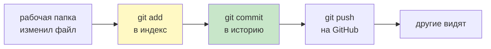
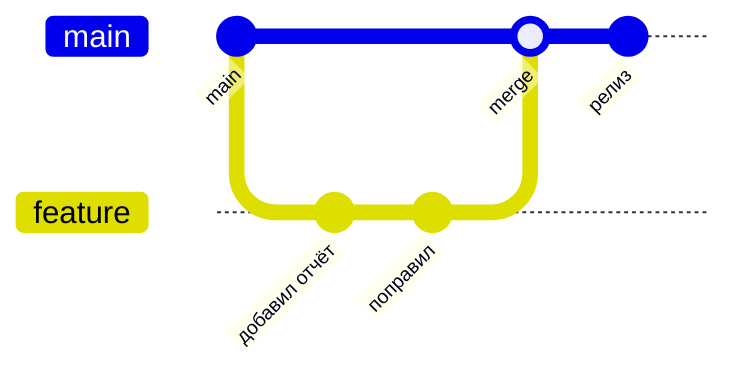
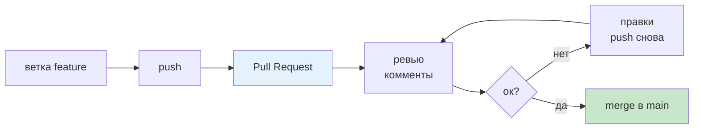

# 13. Git и GitHub

> [!abstract] О чём лекция
> Git — это машина времени для кода: можно вернуться к любой сохранённой версии, посмотреть,
> что менялось и почему, работать над двумя задачами параллельно, не мешая друг другу.
>
> **Репозиторий** — папка проекта вместе со скрытой историей всех сохранённых версий.
> GitHub — это сайт, где репозиторий живёт вместе с историей и где код обсуждают.
> Лекция — про то, как этим пользоваться по-взрослому: что коммитить, как писать сообщения,
> зачем ветки и что происходит на ревью.

# Установка и первая настройка

Проверить, есть ли Git: `git --version`. Если нет, установка зависит от системы:

| Система | Команда |
|---|---|
| Windows | `winget install --id Git.Git -e` или установщик с git-scm.com |
| macOS | `brew install git` или `xcode-select --install` |
| Ubuntu / Debian | `sudo apt install git` |

Один раз нужно сказать Git, от чьего имени будут коммиты (имя и почта попадают
в историю):

```bash
git config --global user.name "Имя Фамилия"
git config --global user.email "you@example.com"
```

# Три состояния файла



Git видит файл в одном из трёх состояний:

```text
рабочая папка  →  индекс (staging)  →  коммит (история)
   правишь           git add            git commit
```

| Состояние | Что это | Команда |
|---|---|---|
| изменён | файл отличается от последнего коммита | `git status`, `git diff` |
| проиндексирован | изменение отобрано в следующий коммит | `git add файл` |
| закоммичен | версия сохранена в истории | `git commit -m "текст"` |

```bash
git status                  # что изменилось
git diff                    # что именно изменилось построчно
git add main.py tests/      # отобрать изменения к коммиту
git commit -m "Добавляет проверку пустого списка"   # сохранить версию
git log --oneline           # история: по строке на коммит
```

> [!tip] `git add -A` — не всегда то, что нужно
> `-A` добавит **всё**, включая случайные файлы (`report.txt` после запуска, `.env` с паролями).
> Лучше перечислить нужное или сначала посмотреть `git status`.

# Что не попадает в репозиторий

Файл `.gitignore` перечисляет то, что в историю не идёт:

```text
.venv/          # окружение: восстанавливается командой uv sync
__pycache__/    # кэш Python
.env            # секреты и локальные настройки
*.log           # логи работы
data/output/    # результаты, которые получаются запуском
```

Правило простое: **в репозиторий идут исходники, а не результаты и не секреты**.
Что восстанавливается командой — восстанавливают командой. Что содержит пароль —
не хранят в истории вообще: удалить файл из последнего коммита легко, из всей истории — сложно.

Живой пример — `.gitignore` репозитория, в котором лежит этот курс: в нём исключены папка
сборки `_Экспорт/`, кэш `__pycache__/` и временные `~$`-файлы офисных программ.

# Сообщение коммита

Коммит — это ответ на вопрос «почему», а не «что» (что и так видно в `git diff`).

| Плохо | Хорошо |
|---|---|
| `fix` | `Исправляет деление на ноль при пустом списке` |
| `update` | `Добавляет экспорт отчёта в JSON` |
| `изменения по проекту` | `Переносит практики блока Б в отдельную папку` |

Формат, к которому быстро привыкаешь:

```text
Первая строка: что сделано, до 60 символов, в повелительном наклонении.
Пустая строка.
Ниже — зачем это сделано и на что влияет: детали для того, кто будет
читать историю через полгода.
```

Хороший коммит **маленький**: одна задача — один коммит. Тогда `git log` читается как
журнал работ, а откатить одну задачу можно, не задевая остальные.

# Ветки



Ветка — это независимая линия работы. Пока основная ветка (`main`) стабильна, задачи
делают в своих ветках:

```bash
git switch -c feature/json-report     # создать ветку и перейти в неё
git switch main                       # вернуться
git branch                            # список веток
git merge feature/json-report         # влить ветку в текущую
```

Зачем: можно спокойно экспериментировать, а в `main` всегда лежит работающая версия.
Если эксперимент провалился, ветку просто не вливают — код в `main` не тронут.

# Pull request и ревью



**Pull request (PR)** — предложение влить ветку в основную. На GitHub в нём видно:

- **diff** — построчные изменения;
- **комментарии** — вопросы и замечания к конкретным строкам;
- **проверки (checks)** — автоматические: тесты, линтер, сборка.

Зачем PR, если можно влить ветку локально:

1. **Ревью.** Свежий взгляд находит то, что автор пропустил: опечатки, пропущенные границы,
   запутанные места.
2. **История решений.** В обсуждении остаётся «почему сделали так», а не только «что изменилось».
3. **Автоматическая проверка (CI).** CI (continuous integration — «непрерывная интеграция») —
   сервис, который сам запускает тесты и линтер ([[08. Тесты]], [[14. Читаемость кода]])
   на каждый pull request до того, как код попадёт в `main`. На GitHub этим занимается
   GitHub Actions.

На что смотрят на ревью: тесты есть? границы обработаны? имена понятные? нет ли случайных
файлов и отладочных `print`? Понятно ли из описания, зачем изменение?

# Конфликты

Конфликт возникает, когда две ветки меняют одни и те же строки. Git останавливает слияние
и помечает место:

```text
<<<<<<< HEAD
total = sum(numbers) / len(numbers)
=======
total = sum(numbers) / count_positive
>>>>>>> feature/report
```

`HEAD` — та ветка, на которой ты сейчас стоишь. Верхняя часть (до `=======`) — твоя
версия строки, нижняя — версия из вливаемой ветки `feature/report`.

Что делать: выбрать нужный вариант (иногда — объединить оба), удалить маркеры и закоммитить.
Затем **обязательно запустить тесты**: конфликт разрешён не тогда, когда маркеры исчезли,
а когда программа работает.

> [!warning] Маркеры конфликта в файлах — это ошибка
> Если в коде остались строки `<<<<<<<`, файл не запустится (это синтаксическая ошибка),
> а хуже того — такой файл можно случайно закоммитить. Перед коммитом ищи маркеры поиском
> по проекту.

# Полезные команды для разбора

| Задача | Команда |
|---|---|
| кто и когда менял строку | `git blame файл.py` |
| что менялось в коммите | `git show <хеш>` |
| вернуть файл к версии из последнего коммита | `git restore файл.py` |
| отменить последний коммит, оставив изменения | `git reset --soft HEAD~1` (`HEAD~1` — «на один коммит назад от текущего») |
| отменить коммит новым коммитом, не трогая историю | `git revert <хеш>` |
| посмотреть разницу между ветками | `git diff main feature/report` |

Опасные команды (`git reset --hard`, `git clean -fd`, `push --force`) удаляют работу
безвозвратно — их применяют, только понимая, что именно потеряется.

# Как это делают в проекте

1. **Коммитят часто и маленькими шагами.** Проверенная работа всегда зафиксирована:
   эксперимент можно начать заново, не теряя сделанного.
2. **Никогда не коммитят секреты.** `.env` в `.gitignore`; для примера кладут
   `.env.example` без значений.
3. **`main` — рабочая версия.** Незаконченное живёт в ветке.
4. **Сообщения коммитов пишут для коллег** (и для себя через полгода): что сделано и зачем.
5. **Часть работы делает машина.** Тесты и линтер в PR — не формальность, а способ
   не пропустить поломку.

# Типичные заблуждения

| Заблуждение | Как на самом деле |
|---|---|
| «Git нужен только для командной работы» | И для личной: вернуться к рабочей версии, понять, что изменил вчера |
| «Коммит — это сохранение файла» | Коммит — версия всего проекта, с текстом «почему» |
| «Ветки нужны только в больших проектах» | Ветка — способ не ломать работающую версию, даже в одиночку |
| «Ошибочный коммит нельзя исправить» | Можно: `restore`, `revert`, переписывание истории в своей ветке |
| «Раз в `.gitignore` есть `.env`, пароль в безопасности» | Проверь: файл мог быть закоммичен раньше. Тогда пароль меняют |

# Проверь себя

1. Чем `git add` отличается от `git commit`?
2. Почему `.venv/` и `__pycache__/` не коммитят?
3. Что должно быть в первой строке сообщения коммита?
4. Зачем нужна ветка, если работаешь один?
5. Что показывает pull request, кроме изменённого кода?
6. Конфликт разрешён — как убедиться, что всё в порядке?

> [!success]- Ответы
> 1. `git add` только отбирает изменения в следующий коммит; историю создаёт `git commit`.
> 2. Они восстанавливаются командами (`uv sync`) и генерируются автоматически: в истории
>    это лишний вес и шум.
> 3. Что сделано: коротко, понятно, в повелительном наклонении.
> 4. Чтобы в основной ветке всегда была работающая версия, а эксперименты не ломали её.
> 5. Комментарии ревьюеров и результаты автопроверок (тесты, линтер, сборка).
> 6. Запустить тесты: исчезновение маркеров — только первый шаг.

# Практика

[[04. Практика. Инструменты и структура]] — первая задача: история, ветка, `.gitignore` и коммиты по шагам.

# Опора на дисциплину 02

Материалы курса Python, на которые опирается лекция, и то, что она к ним добавляет:

- [[06. Среды разработки и виртуальное окружение]] — структура проекта и `.venv`: оттуда идёт вопрос «что коммитить, а что нет».

# Связи с другими темами

- [[05. Логика и архитектура системы контроля версий]] — теория из дисциплины 01: коммит, ветка, `HEAD`, слияние и конфликт; здесь то же — в команды.
- [[08. Тесты]] — то, что запускают автоматически в PR.
- [[14. Читаемость кода]] — что проверяет линтер до ревью.
- [[12. Структура проекта и модули]] — какие файлы проекта попадают в репозиторий.
- `00_Мета/Журнал_изменений.md` — пример того, как ведётся история изменений в этой базе.
