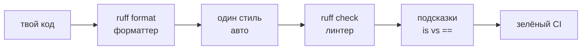
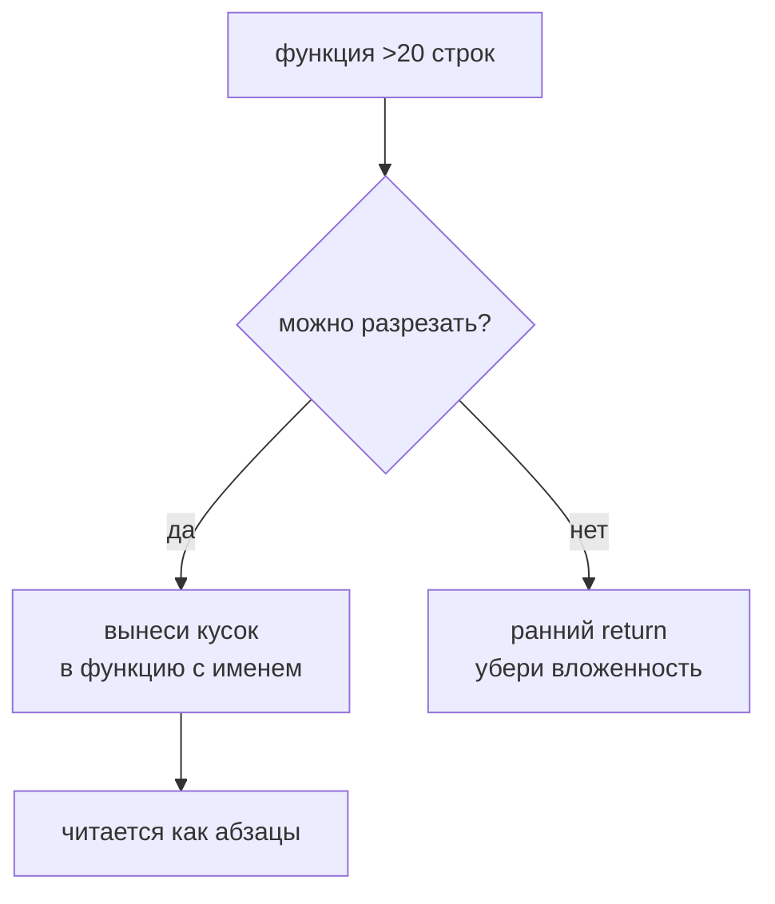

# 14. Читаемость кода

> [!abstract] О чём лекция
> Код читают в 10 раз чаще чем пишут. PEP 8 — договор «как писать одинаково», `ruff format` — форматтер, который делает одинаково машиной, `ruff check` — линтер, который находит `is` vs `==`, неиспользуемое и сложное. После лекции `uv run ruff format` и `uv run ruff check` будут зелёными до ревью.
>
> Нужно: `uv`, VS Code.

---

# PEP 8 в объёме, который нужен каждый день

PEP 8 — [стиль Python](https://peps.python.org/pep-0008/) — не закон, а договор чтобы не спорить. Главное:

| Тема | Норма | Пример |
|---|---|---|
| имена | `snake_case` для функций/переменных, `PascalCase` для классов, `UPPER` для констант | `user_count`, `User`, `MAX_RETRY` |
| длина строки | 88 (ruff) / 79 (PEP 8) | перенос `(` |
| пробелы | `a = 1` не `a=1` в коде, `,` после запятой | |
| импорты | сверху, stdlib → third party → local, по алфавиту | `isort`/`ruff` сортирует |
| сравнение | `is None` не `== None`, `if items:` не `if len(items)!=0:` | |

Читается как: «пиши как все в проекте, а не как привык».

---

# `ruff format`: формат делает машина



```bash
uv add --dev ruff
uv run ruff format src tests          # формат
uv run ruff check src tests           # линтер
uv run ruff check --fix src           # авто-исправляет что может
```

`ruff format` не спрашивает «как форматировать» — форматирует как считает нужным. Спор «2 vs 4 пробела» исчезает: запускаешь и всё одинаково. Настройка в `pyproject.toml`:

```toml
[tool.ruff]
line-length = 88
target-version = "py312"
lint.select = ["E","F","W","C90"]
lint.ignore = []

[tool.ruff.format]
quote-style = "double"       # как было в black
indent-style = "space"
```

В VS Code: `settings.json` `"editor.formatOnSave": true`, `"editor.defaultFormatter": "charliermarsh.ruff"` — одно расширение закрывает и формат, и линтер.

> [!note] А `black`?
> `black` был стандартом форматтера до `ruff format`. `ruff format` совместим с ним по стилю
> (те же 88 символов, те же переносы) и работает в 10–100 раз быстрее, поэтому в курсе
> используется один инструмент — `ruff`. Ставить `black` отдельно не нужно: если в чужом
> проекте встретишь `[tool.black]`, знай, что это то же самое, что `[tool.ruff.format]`.

До/после:

```python
# до ruff format
def foo(x,y):
    return {"a":1,"b": 2}

# после ruff format
def foo(x, y):
    return {"a": 1, "b": 2}
```

---

# ruff: линтер ищет проблемы

`ruff` — быстрый линтер (замена `flake8`, `isort`, `pylint` частично). Находит то что формат не ловит:

| Код | Что скажет `ruff` |
|---|---|
| `if x == None:` | `E711 use is None` |
| `if len(items) == 0:` | `C401 use if not items:` |
| `import os, sys` | `E401 multiple imports` |
| неиспользуемый `import` | `F401 unused` |
| `x = 1` но не используешь | `F841` |

Исправляешь руками или `ruff check --fix`.

Разница `ruff format` и `ruff check` — это две команды одного инструмента:

- `ruff format` — **как выглядит** (пробелы, кавычки, переносы);
- `ruff check` — **что не так** (ошибки, стиль, сложность).

Вместе — `ruff format` + `ruff check` = «красиво и без багов стиля», одной установкой.

---

# Как выглядит код после исправлений

До:

```python
import os, sys
def calc(values):
    if len(values)==0:
        return None
    if values==None:
        return None
    total=0
    for v in values:
        total+=v
    return total/len(values)
```

После `ruff format` + `ruff check --fix`:

```python
import sys

def calc(values: list[float] | None) -> float | None:
    if values is None or not values:
        return None
    return sum(values) / len(values)
```

Короче, читается сверху вниз, без `len==0`.

---

# Читаемость сверх форматтера

Форматтер не делает код понятным — только ровным. Понятность — твоя работа:

1. **Имена — глаголы/существительные:** `user_count` не `n`, `is_valid` не `flag`.
2. **Функция — 20 строк.** Больше → режь на две.
3. **Ранний `return`:** `if not items: return None` вместо вложенности.
4. **Один уровень абстракции:** не смешивай `open` + `json` + `расчёт` в одной функции.
5. **Комментарий — почему, не что:** `# кэш на 5 минут, иначе API банит` — полезно; `# считаем сумму` — мусор.



---

# Как это делают в проекте

1. **Формат при сохранении.** VS Code `formatOnSave` — никаких «забыл отформатировать».
2. **`ruff` в CI.** `uv run ruff check` падает если стиль сломан — не доходит до ревью.
3. **Ревью — про логику, не про пробелы.** Пробелы уже поправил `ruff format`.
4. **Имена обсуждают.** `user_count` vs `users` — ревью ловит.

---

# Типичные заблуждения

| Думают | На самом деле |
|---|---|
| «Формат — вкусовщина» | В команде — договор, `ruff format` его пишет |
| «Линтер душит» | Ловит опечатки до тестов |
| «88 символов — много» | 88 — компромисс `ruff format` (наследие `black`), 79 — для терминала 80-х |
| «Читаемость — пробелы» | Пробелы — `ruff format`, читаемость — имена и декомпозиция |

---

# Проверь себя

1. Чем `ruff format` отличается от `ruff check`?
2. Почему `is None` а не `== None`?
3. Зачем `formatOnSave`?
4. Что делает линтер кроме пробелов?
5. Когда комментарий нужен?

> [!success]- Ответы
> 1. `format` — приводит к одному виду, `check` — ищет ошибки стиля и логики.
> 2. `None` — синглтон, `is` быстрее и правильно.
> 3. Форматирует автоматом — не забудешь.
> 4. Неиспользуемое, сложность, `is` vs `==`.
> 5. Когда объясняет *почему*, а не *что* делает строка.

---

# Практика

[[05. Практика. Сторонние библиотеки, читаемость и оценка производительности]] — `ruff format` + `ruff check` на своём коде.

---

# Опора на дисциплину 02

- [[05. Язык Python - идентификаторы, операторы, типы данных]] — имена и `is`.
- [[14. Функции и модули]] — короткие функции.

---

# Связи

- [[15. Docstring]] — имя + docstring = понятно без чтения кода.
- [[12. Структура проекта и модули]] — настройки в `pyproject.toml`.
- [PEP 8](https://peps.python.org/pep-0008/) · [ruff](https://docs.astral.sh/ruff/) · [ruff format](https://docs.astral.sh/ruff/formatter/) · [black](https://black.readthedocs.io/) — что `ruff format` заменил

