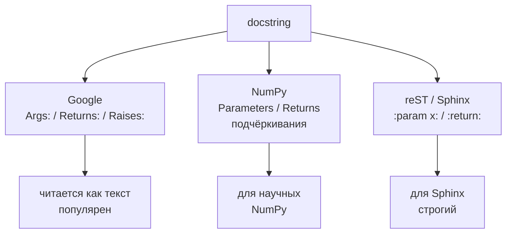
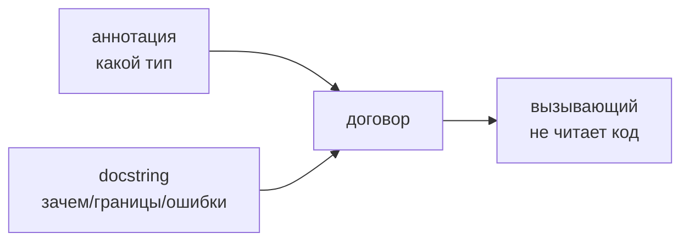

# 15. Docstring

> [!abstract] О чём лекция
> Docstring — описание функции/класса прямо в коде, которое видит `help()` и IDE. Аннотации говорят *какой* тип, docstring — *зачем* и *как* пользоваться. После лекции ты напишешь Google-стиль docstring с `Args/Returns/Raises` и не будешь дублировать типы словами.
>
> Нужно: функции из [[14. Функции и модули]], аннотации из [[02. Типизация и аннотации]].

---

# Что показывает `help()`

```python
def discounted(price: float, percent: int) -> float:
    """Цена со скидкой.

    Args:
        price: исходная цена (>0).
        percent: скидка 0..100.

    Returns:
        Цена после скидки.

    Raises:
        ValueError: если percent вне диапазона.
    """
    if not 0 <= percent <= 100:
        raise ValueError("percent 0..100")
    return price * (1 - percent / 100)

help(discounted)
```

`help` печатает docstring + сигнатуру. В VS Code то же видно при наведении. Без docstring — только `discounted(price, percent)` и гадай.

---

# Одной строкой или блоками

```python
def is_even(n: int) -> bool:
    """Чётное ли число."""
    return n % 2 == 0

def complex_calc(a, b):
    """Многострочный — первая строка как заголовок, пустая, потом детали.

    Детали могут быть на несколько абзацев.
    """
```

Правило PEP 257: первая строка — глагол, точка в конце, одна строка — одна строка, много — заголовок + пустая + тело.

---

# Что писать и что не писать

Пиши:

- **зачем** функция и когда её брать;
- **границы** (`percent 0..100`, `пустой список → None`);
- **что кидает** (`Raises: ValueError`);
- **пример** если неочевидно (`Examples:`).

Не пиши:

- дублирование типов: `price (float) — цена` — тип уже в аннотации;
- «что делает строка» — пиши зачем;
- очевидное: `i += 1  # увеличиваем i`.

Плохо/хорошо:

```python
# плохо: дублирует аннотацию и код
def add(a: int, b: int) -> int:
    """Складывает a (int) и b (int) и возвращает int."""
    return a + b

# хорошо: зачем и границы
def add(a: int, b: int) -> int:
    """Сумма двух целых. Переполнение не проверяется."""
    return a + b
```

---

# Стили оформления



Выбери один стиль на проект. В этом курсе — **Google**:

```python
def withdraw(balance: float, amount: float) -> float:
    """Снимает сумму со счёта.

    Args:
        balance: текущий баланс.
        amount: сумма к снятию (>0, ≤balance).

    Returns:
        Остаток после снятия.

    Raises:
        ValueError: если amount ≤0.
        BalanceError: если не хватает средств.

    Examples:
        >>> withdraw(100, 30)
        70
    """
```

NumPy стиль — для `numpy`/`pandas`:

```python
"""
Parameters
----------
x : float
    Описание.
Returns
-------
float
    Описание.
"""
```

Sphinx — `:param x:` — реже в прикладном коде.

---

# Docstring — контракт, а не украшение



Аннотация + docstring = полный договор: тип + смысл. Без docstring вызывающий лезет в код; без аннотации — гадает о типах.

`doctest` проверяет примеры в docstring:

```bash
uv run python -m doctest -v src/bank/money.py
```

---

# Как это делают в проекте

1. **Все публичные функции — с docstring.** Приватные `_helper` — по необходимости.
2. **Один стиль.** Google в этом курсе — не смешивай с NumPy.
3. **Типы — в аннотациях, не в тексте.** Не дублируй `str` словами.
4. **`Raises` — честно.** Что кидаешь — то и в `Raises`.

---

# Типичные заблуждения

| Думают | На самом деле |
|---|---|
| «Docstring — комментарий» | Комментарий — `#` для разработчика, docstring — `help` для пользователя |
| «Писать типы в docstring» | Тип в аннотации, в docstring — зачем |
| «Чем длиннее, тем лучше» | Коротко и по делу — 5 строк лучше абзаца воды |
| «Примеры не нужны» | Пример — лучший тест понятности |

---

# Проверь себя

1. Чем docstring от комментария?
2. Что в `Args/Returns/Raises`?
3. Почему не дублировать `int` в тексте?
4. Какой стиль в курсе?
5. Зачем `Examples`?

> [!success]- Ответы
> 1. Docstring видит `help`/IDE, комментарий — только в коде.
> 2. Аргументы, что возвращает, что кидает.
> 3. Тип уже в аннотации — дублирование рассинхронит.
> 4. Google.
> 5. Показать как вызывать — проверка понятности.

---

# Практика

[[05. Практика. Сторонние библиотеки, читаемость и оценка производительности]] — `help` + `doctest`.

---

# Опора на дисциплину 02

- [[14. Функции и модули]] — `def` без описаний → теперь с ними.
- [[02. Типизация и аннотации]] — типы в аннотациях.

---

# Связи

- [[14. Читаемость кода]] — имя + docstring = не лезть в код.
- [[08. Тесты]] — `doctest` как первый тест примера.
- [PEP 257](https://peps.python.org/pep-0257/) · [Google style guide](https://google.github.io/styleguide/pyguide.html)

