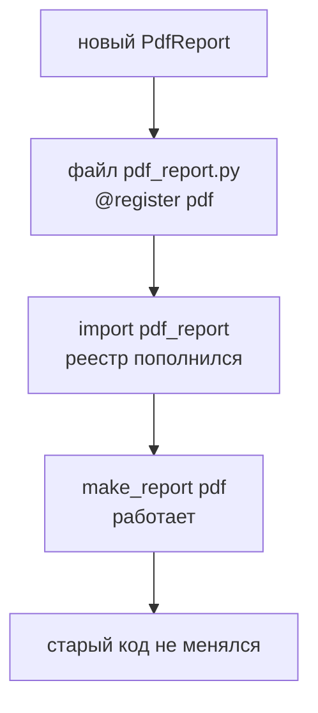

# 16. Проектирование — фабрики и реестры

> [!abstract] О чём лекция
> Длинный `if name=="a": make_a() elif name=="b": make_b()` — признак что выбор создают через реестр: словарь `{"a": make_a, "b": make_b}`. Здесь как заменить лестницу `if` на реестр, как писать фабрику и почему расширение тогда без правки старого кода. После лекции `if` на 5 веток превратишь в `registry[name]()` .
>
> Нужно: функции как объекты, `dict` из [[11. Кортежи, списки, словари]], декораторы из [[07. Декораторы]].

---

# Проблема: длинный `if` при создании

```python
def make_report(kind: str):
    if kind == "csv": return CsvReport()
    elif kind == "json": return JsonReport()
    elif kind == "html": return HtmlReport()
    # ... ещё 5
    else: raise ValueError(f"неизвестный {kind}")
```

Каждый новый отчёт — правка этого `if`. Забыл `else` — `None` уползёт дальше. Тестировать каждую ветку отдельно больно.

---

# Реестр: словарь «имя → создатель»

```mermaid
flowchart LR
  A[до: if/elif<br>лестница] --> B[реестр<br>dict a→make_a<br>b→make_b]
  B --> C[registry[name]<br>создаёт]
  C --> D[новый<br>registry[new]=make_new<br>без правки if]
```

```python
from collections.abc import Callable

ReportFactory = Callable[[], object]

registry: dict[str, ReportFactory] = {
    "csv": lambda: CsvReport(),
    "json": lambda: JsonReport(),
    "html": lambda: HtmlReport(),
}

def make_report(kind: str):
    try:
        factory = registry[kind]
    except KeyError:
        raise ValueError(f"неизвестный отчёт {kind!r}") from None
    return factory()
```

Плюсы:

- добавить → `registry["pdf"] = lambda: PdfReport()` — без правки `make_report`;
- тестировать каждый `make_*` отдельно;
- `registry` можно собрать декоратором.

Реестр через декоратор (как `Flask`/`pytest`):

```python
registry: dict[str, ReportFactory] = {}

def register(name: str):
    def decorator(factory: ReportFactory):
        registry[name] = factory
        return factory
    return decorator

@register("csv")
def make_csv(): return CsvReport()

@register("json")
def make_json(): return JsonReport()

# make_report как выше — registry уже заполнен
```

> Так работает `@dataclass` и `@register` — декоратор регистрирует, а не вызывает сразу.

---

# Фабрика: создание объектов

Фабрика — функция/класс который **решает что создать** по данным:

```python
def report_factory(kind: str, data: list):
    report = make_report(kind)  # из реестра
    report.load(data)
    return report
```

Когда фабрика — класс:

```python
class ReportFactory:
    def __init__(self, registry: dict[str, ReportFactory]):
        self.registry = registry
    def create(self, kind: str):
        return self.registry[kind]()
```

Фабрика + реестр + DI ([[17. Внедрение зависимостей]]) — часто вместе: фабрика создаёт, реестр знает *что*, DI передаёт *зависимости*.

---

# Зачем это нужно: расширение без правки

Принцип **Открыт для расширения, закрыт для изменения** (OCP): новый `PdfReport` — новый файл + `register`, старый `make_report` не трогаешь → не ломаешь.



Без реестра — каждый новый тип — правка `if` в 3 местах и риск забыть.

---

# Как это делают в проекте

1. **Реестр — рядом с фабрикой.** `registry.py` экспортирует `register` и `make`.
2. **Ключ — строка из конфига/CLI.** `kind` приходит из `config`/`argparse`, не захардкожен.
3. **Фабрика тонкая.** Создаёт и отдаёт, не считает.
4. **Тест на неизвестный ключ.** `pytest.raises(ValueError)` для `"unknown"`.

---

# Типичные заблуждения

| Думают | На самом деле |
|---|---|
| «`if` проще реестра» | На 2 ветки — да, на 5+ — реестр короче и без правок |
| «Реестр — магия» | Обычный `dict` + `callable` |
| «Фабрика — ООП» | Фабрика — функция; класс когда нужна конфигурация |
| «Реестр везде» | Только где выбор типа по строке/конфигу |

---

# Проверь себя

1. Чем `if/elif` хуже реестра на 5+ типах?
2. Что хранит `registry`?
3. Как добавить новый отчёт без правки `make_report`?
4. Как декоратор регистрирует?
5. Что такое фабрика?

> [!success]- Ответы
> 1. Каждый новый — правка `if`, легко забыть ветку.
> 2. `str → callable` который создаёт объект.
> 3. `registry["new"] = make_new` или `@register("new")`.
> 4. `register(name)` возвращает декоратор который кладёт `factory` в `dict`.
> 5. Функция/класс который решает что создать по данным.

---

# Практика

[[03. Практика. Паттерны проектирования — фабрики, реестры и внедрение зависимостей]] — реестр отчётов `csv/json/html` + фабрика.

---

# Опора на дисциплину 02

- [[11. Кортежи, списки, словари]] — `dict` как реестр.
- [[14. Функции и модули]] — функции как объекты.
- [[16. Объектно-ориентированное программирование]] — классы отчётов.

---

# Связи

- [[07. Декораторы]] — `@register`.
- [[17. Внедрение зависимостей]] — фабрика создаёт, DI передаёт зависимости.
- [Refactoring — Factory](https://refactoring.guru/design-patterns/factory-method)

