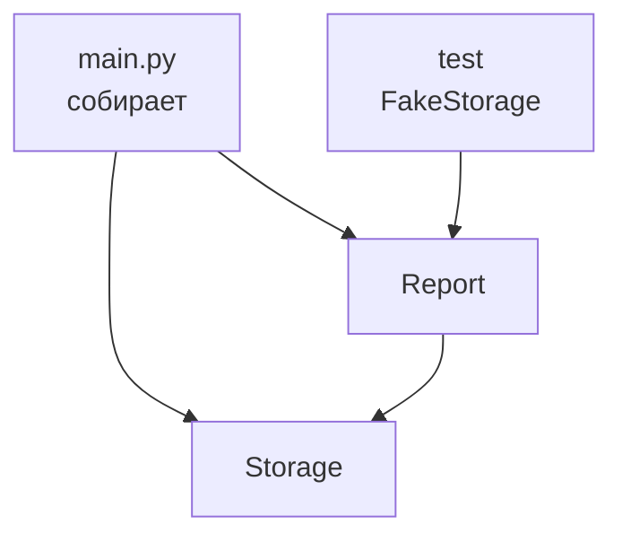

# 17. Внедрение зависимостей

> [!abstract] О чём лекция
> Объект сам открывает файл и лезет в БД — тестировать больно: нужен файл и сеть. Решение — **внедрение зависимостей (DI)**: объект получает готовых помощников в конструкторе, а не создаёт их внутри. Тогда в проде передаёшь реальный `FileStorage`, в тесте — `FakeStorage` без файла. После лекции ты перепишешь `Report(storage)` вместо `Report()` с `open` внутри.
>
> Нужно: классы из [[16. Объектно-ориентированное программирование]], тесты из [[08. Тесты]].

---

# Проблема: объект создаёт своих помощников

```python
class Report:
    def __init__(self, path: str):
        self.path = path
    def save(self, data: str):
        with open(self.path, "w", encoding="utf-8") as f:  # ← сам открыл файл
            f.write(data)
```

Тест:

```python
def test_save():
    r = Report("/tmp/report.txt")
    r.save("hi")
    assert open("/tmp/report.txt").read() == "hi"  # нужен реальный файл!
```

Проблемы:

- тест требует файловую систему;
- нельзя подменить на память;
- `Report` знает *как* хранить, а должен знать *что* хранить.

---

# Решение: зависимость приходит в конструктор

```mermaid
flowchart LR
  A[без DI<br>Report сам open] --> B[тест сложен<br>нужен файл]
  C[с DI<br>Report(storage)] --> D[тест: FakeStorage<br>память]
  C --> E[прод: FileStorage<br>файл/БД]
```

```python
from typing import Protocol

class Storage(Protocol):
    def write(self, data: str) -> None: ...
    def read(self) -> str: ...

class FileStorage:
    def __init__(self, path: str): self.path = path
    def write(self, data: str) -> None:
        Path(self.path).write_text(data, encoding="utf-8")
    def read(self) -> str:
        return Path(self.path).read_text(encoding="utf-8")

class FakeStorage:
    def __init__(self): self.data = ""
    def write(self, data: str) -> None: self.data = data
    def read(self) -> str: return self.data

class Report:
    def __init__(self, storage: Storage):  # ← получает готовое
        self.storage = storage
    def save(self, data: str) -> None:
        self.storage.write(data)

# прод
report = Report(FileStorage("/tmp/report.txt"))
report.save("hi")

# тест — без файлов
def test_save():
    fake = FakeStorage()
    Report(fake).save("hi")
    assert fake.read() == "hi"
```

`Storage` — `Protocol` (утиная типизация): «кто умеет `write/read` — подходит», наследоваться не надо. Подробнее — [[02. Типизация и аннотации]] + [PEP 544](https://peps.python.org/pep-0544/).

---

# Что считается зависимостью

Зависимость — **всё что «снаружи» объекта**:

| Внешнее | Пример | Заменяем в тесте на |
|---|---|---|
| файл | `open`, `Path` | `FakeStorage` (память) |
| сеть | `requests.get` | `FakeApi` (словарь) |
| время | `datetime.now()` | `FakeClock` (фиксированное) |
| случайность | `random` | `FakeRandom` (список) |
| БД | `sqlite3` | `FakeRepo` (dict) |

В конструктор передают **интерфейс** (`Protocol`), а не конкретный класс — тогда подмена без правки `Report`.

Контейнер DI — когда зависимостей много — просто словарь/фабрика:

```python
def make_report(env: str) -> Report:
    storage = FileStorage("/tmp/r.txt") if env=="prod" else FakeStorage()
    return Report(storage)
```

Без фреймворков — достаточно функции-фабрики. Фреймворки (`dependency-injector`) — когда зависимостей десятки.

---

# Как это выглядит в больших проектах



`main.py` — единственное место где создают реальные зависимости (Composition Root). Остальной код получает готовое — не знает откуда.

Сравнение с наследованием:

- **Наследование:** `FileReport(Report)` + `FakeReport(Report)` — два класса ради теста, дублирование.
- **DI:** один `Report` + две `Storage` — композиция вместо наследования, гибче.

---

# Как это делают в проекте

1. **Конструктор — честный.** Всё что нужно — в `__init__`, без `open` внутри методов.
2. **Зависимость — `Protocol`, не класс.** Легко подменить.
3. **Тест — с `Fake`.** Не мокать `open` через `patch` без нужды — лучше `FakeStorage`.
4. **`main` — собирает.** Только там `FileStorage("/tmp")`, везде — `Storage`.

---

# Типичные заблуждения

| Думают | На самом деле |
|---|---|
| «DI — фреймворк» | DI — приём: передать в `__init__`; фреймворк — опция |
| «Создать внутри проще» | Проще писать, сложнее тестировать |
| «Много параметров в `__init__` — плохо» | 3–4 зависимости — норма; больше → разбей класс |
| «Наследование решает» | Наследование — «is-a», DI — «has-a», второе гибче |

---

# Проверь себя

1. Чем `Report(FakeStorage)` лучше `Report("/tmp")` с `open` внутри?
2. Что такое `Storage(Protocol)`?
3. Где создают реальные зависимости?
4. Когда нужен контейнер?
5. DI vs наследование?

> [!success]- Ответы
> 1. Тест без файлов, быстро и без `tmp_path`.
> 2. Описание «умеет write/read» — подходит любой с такими методами.
> 3. В `main.py` (Composition Root) — один раз.
> 4. Когда зависимостей много — фабрика/словарь.
> 5. DI — композиция, наследование — жёсткая иерархия; DI гибче для подмены.

---

# Практика

[[03. Практика. Паттерны проектирования — фабрики, реестры и внедрение зависимостей]] — `Report` с `Storage` + тесты с `Fake`.

---

# Опора на дисциплину 02

- [[16. Объектно-ориентированное программирование]] — `__init__`, `Protocol` vs `ABC`.
- [[08. Тесты]] — `Fake` вместо `tmp_path`/`patch`.

---

# Связи

- [[16. Проектирование - фабрики и реестры]] — фабрика создаёт, DI получает.
- [[08. Тесты]] — лёгкие тесты без файлов.
- [Martin Fowler — DI](https://martinfowler.com/articles/injection.html) · [PEP 544 — Protocol](https://peps.python.org/pep-0544/)

