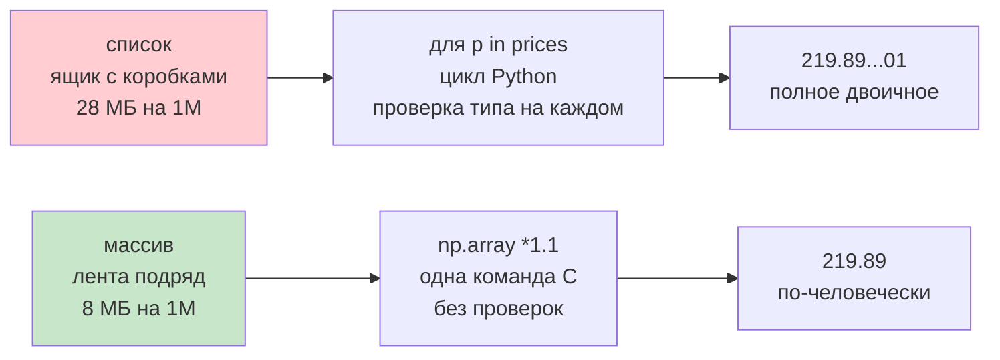
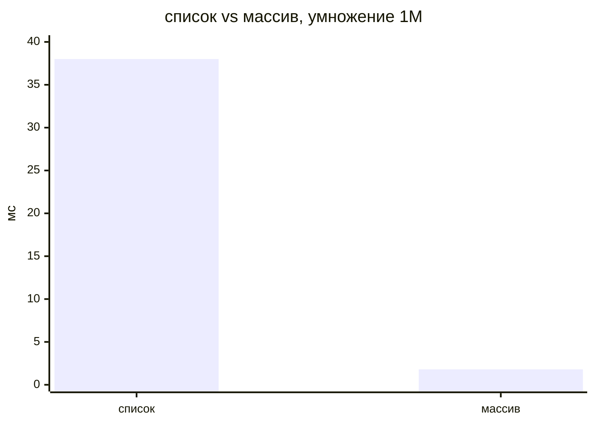
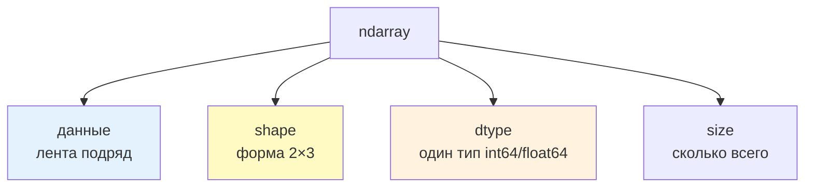
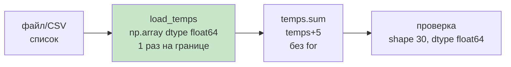

# 01. Зачем NumPy — для чайника

> [!abstract] О чём лекция — для чайника
> Представь список как ящик с подписанными коробочками: каждая коробка — объект-число с паспортом `int(5)`. Массив `ndarray` — как лента в кассе: числа лежат подряд одним типом `float64`, без паспортов. Поэтому `prices * 1.1` на списке — перебери каждую коробку циклом, на массиве — одна команда которая на C пробегает ленту. После лекции ты отличишь ящик от ленты, знаешь `shape/dtype/size` и меряешь `21×/73×` линейкой `timeit`.
>
> **Мысль для чайника:** список — «что угодно куда угодно», массив — «один тип подряд — быстро».

> [!tip] Что нужно — 5 минут
> Переменные, `for`, `list` из [[11. Кортежи, списки, словари]]. `import numpy as np` — единственное новое. Примеры копируемы — запускай.

---

# Одна задача двумя способами — для чайника

Магазин +10% к трём ценам. Списком — вручную каждую коробку, массивом — одна команда:

```python
import numpy as np
prices = [199.90, 249.50, 99.90]
print("списком:", [p*1.1 for p in prices])
print("массивом:", np.array(prices) * 1.1)
print(type(prices), "|", type(np.array(prices)))
```

```text
списком: [219.89000000000001, 274.45000000000005, 109.89000000000001]
массивом: [219.89 274.45 109.89]
list | ndarray
```

Две строки — два мира, для чайника:



| Для чайника | `list` — ящик коробок | `ndarray` — лента |
|---|---|---|
| как `×1.1` | `[p*1.1 for p]` — цикл | `arr*1.1` — одна операция |
| вывод | `219.890...01` всё как есть | `219.89` прячет младшие разряды |
| память 1М | ~28 МБ разрозненно | ~8 МБ непрерывно `float64` |
| скорость 1М | 0.038с | 0.0018с — **21×** |
| тип | можно `1,"два",None` | один `dtype` на всех |

> Почему `219.890...01` vs `219.89` — не ошибка. Внутри оба двоичные дроби; `list` печатает честно, `ndarray` — удобно (скрывает шум). Точность одинакова.

Преимущество ленты — устройство: один `dtype` → размер известен → лежат подряд → C бежит без паспортов.

---

# Насколько быстрее — линейка `timeit` для чайника



Код-линейка: `timeit` запускает `N` раз и делит:

```python
import timeit, numpy as np
many = list(range(1_000_000))
lst = timeit.timeit("[x*2 for x in data]", globals={"data": many}, number=5)
arr = timeit.timeit("data*2", globals={"data": np.arange(1_000_000)}, number=5)
print(f"список {lst/5:.3f}с | массив {arr/5:.4f}с | ×{lst/arr:.0f}")
# список 0.038с | массив 0.0018с | ×21
```

Для суммы 200к:

```python
import numpy as np, timeit
rng = np.random.default_rng(42)          # 42 — seed, одинаковые числа каждый раз
data = rng.normal(4, 1, 200_000)          # 200к вокруг 4 ±1
t1 = timeit.timeit("total=0.0\nfor v in data: total+=v", globals={"data": data}, number=1)
t2 = timeit.timeit("total=data.sum()", globals={"data": data}, number=1)
print(f"цикл {t1:.4f}с | numpy {t2:.5f}с | ×{t1/t2:.0f}")
# цикл 0.0127с | numpy 0.00017с | ×73
```

Вывод для чайника: **цикл по массиву = отказ от NumPy**. Если пишешь `for v in array:` — ищи `arr.sum()`/`arr*2`.

> На твоей машине цифры другие — важен порядок `21×/73×`. На 20 числах массив даже медленнее (1.4мкс vs 0.9мкс), на 1к — уже `×19`, но 27мкс vs 1.4мкс глазом не видно; на 1М — 39мс vs 0.8мс — видно.

---

# Массив — данные + форма + тип, для чайника



```python
import numpy as np
marks = np.array([5,4,5,3])
print(marks, "shape", marks.shape, "dtype", marks.dtype, "size", marks.size, "ndim", marks.ndim)
# [5 4 5 3] shape (4,) dtype int64 size 4 ndim 1 — вектор

table = np.array([[5,4,5],[3,4,3]])
print(table, "\nshape", table.shape, "ndim", table.ndim, "size", table.size)
# [[5 4 5] [3 4 3]] shape (2,3) ndim 2 size 6 — таблица
```

Для чайника:

| Что | Что значит | Пример |
|---|---|---|
| `shape=(4,)` | лента 4 | вектор оценок |
| `shape=(2,3)` | 2 строки 3 столбца | таблица |
| `shape=()` | скаляр 0 измерений | `np.array(5)` |
| `ndim` | сколько осей | `1`/`2`/`0` |
| `size` | всего элементов | `shape` перемножить |
| `dtype` | один тип на всех | `int64`/`float64` |

Ключевое для чайника: в массиве **не бывает** `1, "два", None` — один `dtype`. Разные — приводит:

```python
print(np.array([1, 2.5, 3]), "→", np.array([1, 2.5, 3]).dtype)  # [1. 2.5 3.] float64 — 1→1.0
print(np.array([1, "два"]).dtype)  # <U21 — строка
print(np.array([1, 2.5, 3]).astype(int))  # [1 2 3] — обрезает
```

Это не ограничение, а скорость: размер известен → лежат подряд.

---

# Когда не нужен — для чайника, шпаргалка

| Задача чайника | Бери | Почему |
|---|---|---|
| дела на день, стек | `list`/`deque` | разные типы, вставка |
| поиск по ключу | `dict` | нужен ключ |
| 20 записей отчёт | `list`/`dict` | мало, циклы незаметны |
| тысячи чисел, таблицы | **NumPy** | одна команда по всем |
| таблица с подписями, разные типы столбцов | `pandas` (на NumPy) | нужны имена |

Сигнал для чайника: «одинаковое действие над многими числами (×, +, среднее, фильтр)» → `NumPy`. «Разные объекты» → `list/dict`.

---

# Как в проекте — для чайника, 5 правил



1. **На границе один раз в массив.** `data.py` читает → `np.array(..., dtype=np.float64)` → дальше только `ndarray`:
```python
from pathlib import Path
import numpy as np
def load_temps(path: Path) -> np.ndarray:
    raw = [float(l.strip()) for l in path.read_text().splitlines() if l.strip()]
    return np.array(raw, dtype=np.float64)
```
2. **Проверяй форму и тип сразу.** `assert temps.shape==(30,)` — как `pydantic`, но для массива.
3. **Цикл по массиву — баг.** Вместо `for v in temps: total+=v` → `temps.sum()`, вместо `for i: temps[i]+=5` → `temps+5` (21–73×).
4. **Маленькие — списком, большие — массивом.** 20 → пофиг, 1М → только массив.
5. **Память считай.** `float64` 1М → 8 МБ; список → 28 МБ; `a+b` — ещё 8 МБ промежуточный.

---

# Типичные заблуждения — чайник, не верь

| Думают | На самом деле |
|---|---|
| «Ускоряет цикл» | Запускает свой цикл на C без проверок — разы, не проценты |
| «Массив — быстрый список» | Лента одного `dtype` с `shape` vs ящик ссылок |
| «219.89 точнее» | Точность одна, печать разная |
| «Один dtype — минус» | Это плюс — скорость |
| «На 20 числах нужен NumPy» | На 20 — пофиг, на тысячах — да |

---

# Проверь себя — для чайника

1. Чем лента от ящика и что `dtype`?
2. Почему список `219.89...01` а массив `219.89`?
3. Что `shape (2,3)`?
4. Что `np.array([1,2.5,3])`?
5. Когда `list` а когда `ndarray`?

> [!success]- Ответы
> 1. Лента — непрерывно один `dtype`; ящик — ссылки на разные объекты. `dtype` — тип всех.
> 2. Лента печатает удобно, скрывая младшие разряды двоичной дроби.
> 3. 2 строки 3 столбца, `ndim 2`, `size 6`.
> 4. `[1. 2.5 3.] float64` — `1→1.0`.
> 5. `list` — разные типы/мало данных; `ndarray` — тысячи однотипных или таблица.

---

# Практика

[[01. Практика. Массивы и индексация]] задачи 1–2: `shape/dtype`, `timeit` 21×.

---

# Опора на дисциплину 02

- [[11. Кортежи, списки, словари]] — `list` ящик → здесь `ndarray` лента
- [[05. Язык Python - идентификаторы, операторы, типы данных]] — `int/float` → здесь один `dtype`
- [[13. Вложенные последовательности]] — `[[5,4],[3,4]]` → здесь `shape (2,3)` без вложенных

---

# Связи

- [[02. Создание массивов и типы данных]] — как делать массивы
- [[08. Векторизация и скорость]] — почему `for` медленнее `21×/73×`
- [NumPy — What is NumPy?](https://numpy.org/doc/stable/user/whatisnumpy.html) · [NumPy — Quickstart](https://numpy.org/doc/stable/user/quickstart.html)

