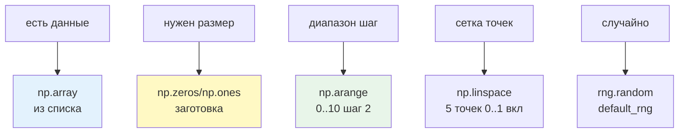
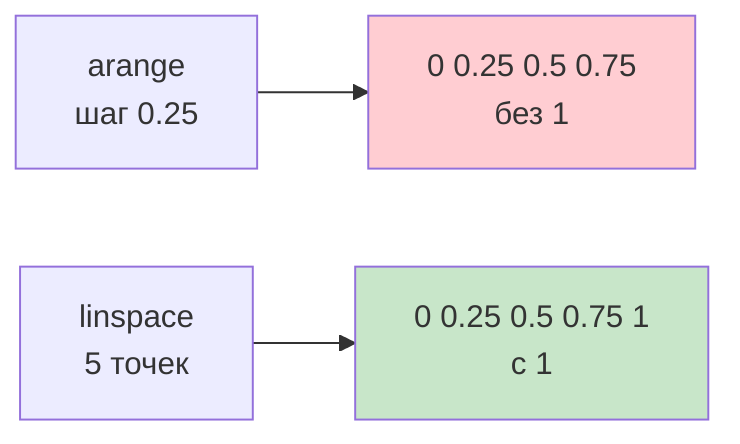
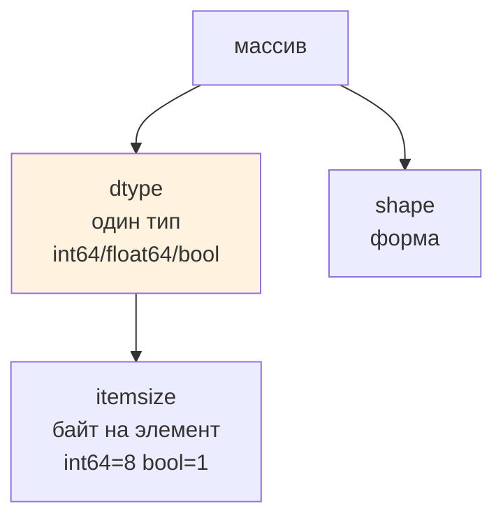
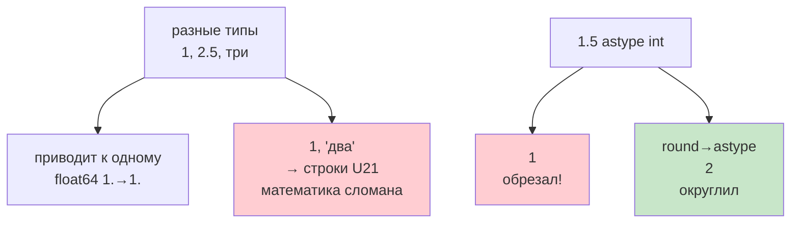

# 02. Создание массивов и типы данных — для чайника

> [!abstract] Для чайника
> Массив можно получить 5 способами: из списка, нулями, единицами, диапазоном, сеткой. Здесь все 5 на пальцах, плюс `dtype` — один тип на всех, и `astype` который обрезает, а не округляет. После лекции ты выберешь `zeros` vs `ones` vs `arange` vs `linspace` без гугла и не потеряешь `1.5 → 1`.
>
> Представь `dtype` как язык ленты: вся лента говорит на одном языке `int64` или `float64`, иначе перевод.

---

# Пять способов — для чайника, шпаргалка



```python
import numpy as np
print("из списка:", np.array([3,1,2]))
print("нули 4:", np.zeros(4))
print("единицы 2×3:\n", np.ones((2,3)))
print("диапазон 0..10 шаг2:", np.arange(0,10,2))
print("равномерно 5 точек 0..1:", np.linspace(0,1,5))
print("случайно 3:", np.random.default_rng(42).random(3))
```

```text
из списка: [3 1 2]
нули 4: [0. 0. 0. 0.]
единицы 2×3: [[1. 1. 1.] [1. 1. 1.]]
диапазон 0..10 шаг2: [0 2 4 6 8]
равномерно 5 точек: [0. 0.25 0.5 0.75 1.]
случайно 3: [0.773 0.438 0.858]
```

| Для чайника | Что даёт | Когда | Запомнить |
|---|---|---|---|
| `np.array(data)` | из списка | данные уже есть | `dtype` из данных |
| `np.zeros(shape)` | нули | заготовка | `shape` число или `(2,3)` |
| `np.ones(shape)` | единицы | тесты | `np.ones((2,3))` — 2×3 |
| `np.arange(start,stop,step)` | диапазон | счётчики | **stop не входит** |
| `np.linspace(start,stop,count)` | `count` точек **вкл** `stop` | графики | количество точек |
| `rng.random(size)` | `[0,1)` | генерация | `default_rng(seed)` |

Разница для чайника:

```python
print(np.arange(0,1,0.25))    # [0. 0.25 0.5 0.75] — как range, без 1
print(np.linspace(0,1,5))     # [0. 0.25 0.5 0.75 1.] — шкала с концами, с 1
```



Для графиков бери `linspace` — задаёшь **сколько точек**, нет «неполного хвоста» от дробного шага. `arange` — для счётчиков.

---

# `dtype` — один язык на ленте, для чайника



```python
marks = np.array([5,4,5,3])
print(marks, marks.dtype, "байт", marks.itemsize)  # int64 8 байт
print(marks.astype(float), "→ float64")  # [5. 4. 5. 3.]

print(np.array([True, False]).dtype)  # bool
print(np.array(["Аня","Борис"]).dtype)  # <U5 — строки фикс длины 5
```

| `dtype` для чайника | Что | Байт | Когда |
|---|---|---|---|
| `int64` | целые | 8 | оценки, индексы (по умолч) |
| `int32` | целые меньше 2e9 | 4 | экономия 1М массива |
| `float64` | дробные | 8 | среднее, проценты (по умолч) |
| `bool` | `True/False` | 1 | маски `marks>4` |
| `<U5` | строки 5 | 20 | редко |
| `object` | что угодно | — | почти не бери |

Приведение `astype` — **новый массив**, старый не трогает:

```python
a = np.array([5,4,5,3])
b = a.astype(float)
print(b, b.dtype, "| старый", a.dtype)  # не изменился

print("обрезает:", np.array([2.7, 2.2]).astype(int))  # [2 2] — отбросил!
print("округляет:", np.round([2.7, 2.2]).astype(int))  # [3 2]
print("деление:", np.array([7,8])/2, "| целочисл:", np.array([7,8])//2)  # [3.5 4.] vs [3 4]
```

Для чайника: `astype(int)` — ножницы, не округление. Нужно округлить — сначала `np.round`.

> Половинки `1.5`/`2.5` округляются к чётному: `np.round([1.5,2.5])` → `[2. 2.]` — как `round`. Для денег — округляй до копеек явно.

---

# Опасности — для чайника, 2 ловушки



```python
print(np.array([1, 2.5, 3]), "→", np.array([1, 2.5, 3]).dtype)  # float64
print(np.array([1, "два"]).dtype)  # <U21 — строки!
print(np.array([1.5, 2.5]).astype(int))  # [1 2] — отбросил
print(np.round([1.5, 2.5]))  # [2. 2.] — к чётному
```

1. **Один `dtype` на всех.** `[1,"два"]` → строки, `*1.1` сломается. Разные типы — `list` или `pandas`.
2. **Потеря точности.** `1.5→int` = `1` (отброс). Хочешь `2` — `np.round` → `astype`.

> Целые `/` → вещественное `3.5`, `//` → целое `3`. Проверяй `dtype` результата.

---

# Размерности `()` vs `(1,)` — для чайника

```mermaid
flowchart LR
  A[np.array 5<br>shape ()<br>скаляр 0D] --> B[size 1<br>ndim 0]
  C[np.array 5<br>shape 1,<br>вектор 1D] --> D[size 1<br>ndim 1]
  style A fill:#fff9c4
  style C fill:#e3f2fd
```

```python
print("2×3", np.zeros((2,3)).shape)  # (2,3)
print("скаляр", np.array(5).shape, "ndim", np.array(5).ndim)  # () 0
print("вектор1", np.array([5]).shape, "ndim", np.array([5]).ndim)  # (1,) 1
```

`()` — скаляр без измерений (как `sum`), `(1,)` — вектор из одного. Путаются — проверяй `shape`.

---

# Как в проекте — для чайника, 5 правил

1. **Не `append` в цикле.** Квадратично — каждый раз копия:
```python
# плохо: квадратично
a = np.array([])
for x in range(1000): a = np.append(a, x)
# хорошо: один раз
a = np.zeros(1000, dtype=int)
for i,x in enumerate(range(1000)): a[i]=x
# ещё лучше: без цикла
a = np.arange(1000)
```
2. **`dtype` явно где важно.** Счётчики `int64`, экономия `int32`, маски `bool`.
3. **Проверяй до расчёта.** `assert temps.shape==(30,)` — ловит `broadcast` ошибку на входе.
4. **`linspace` для шкал, `arange` для счётчиков** — видно в коде что делаешь.
5. **`round` → `astype`** за один проход, не теряй `0.5`.

---

# Типичные заблуждения — чайник

| Думают | На самом деле |
|---|---|
| `array` как список | Приводит к общему `dtype` |
| `astype` округляет | Отбрасывает; `round` до |
| Разные типы в массиве | Один `dtype`; остальное `object` медленно |
| `arange` вкл `stop` | Не вкл, как `range` |
| `()` = `(1,)` | Скаляр vs вектор |
| `append` в цикле ок | Квадратично — `zeros`/`arange` |

---

# Проверь себя — для чайника

1. `arange` vs `linspace`?
2. `np.array([1,2.5,3]).dtype`?
3. `int64→float64` меняет старый?
4. `[2.7,2.2].astype(int)` и как `[3 2]`?
5. Чем опасен `append` в цикле?

> [!success]- Ответы
> 1. `arange` шаг без `stop` `[0 0.25 0.5 0.75]`; `linspace` 5 точек с `stop` `[0 …1]`.
> 2. `float64` — приводит целое к вещ.
> 3. `astype(float)` новый, старый не меняется.
> 4. `[2 2]` отброс; `np.round(...).astype(int)` → `[3 2]`.
> 5. Копия каждый раз — `zeros`/`arange`.

---

# Практика

[[01. Практика. Массивы и индексация]] — 5 способов, `shape/dtype`, `astype+round`.

---

# Опора на дисциплину 02

- `int/float/bool` → один `dtype`
- `list` → `ndarray` блок
- `uv add numpy` → теперь `dtype`

---

# Связи

- [[01. Зачем NumPy]] — форма и тип в общем
- [[03. Индексация, срезы и представления]] — доступ к элементам
- [NumPy — dtypes](https://numpy.org/doc/stable/reference/arrays.dtypes.html) · [NumPy — creation](https://numpy.org/doc/stable/user/basics.creation.html)

