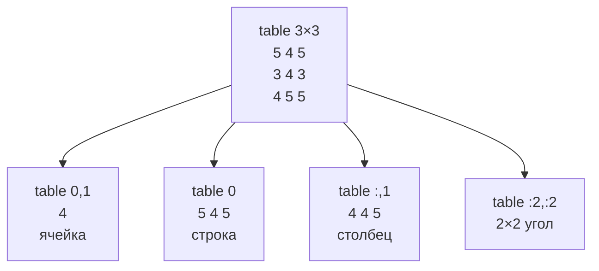
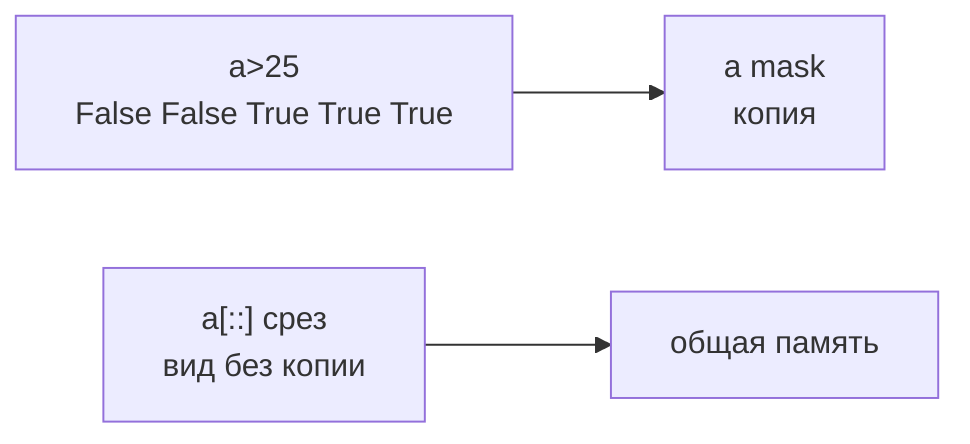
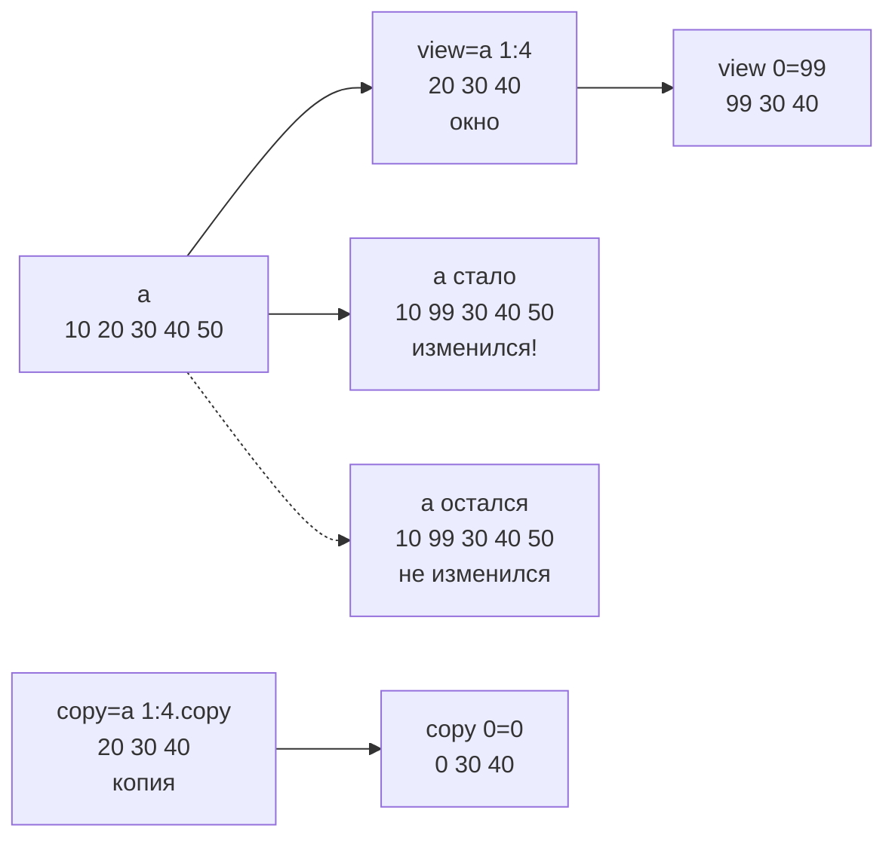

# 03. Индексация и срезы многомерных массивов. Представления и копии

> [!abstract] Цель и задачи лекции
> **Цель:** раскрыть механизмы индексации и срезов `ndarray` в одно- и двумерном случае и разграничить семантику представлений (views) и копий.
> **Задачи:** описать синтаксис `a[0]`/`a[1:4]`/`a[:,1]`/`a[[0,2]]`/`a[mask]`; объяснить, почему срез — вид с общей памятью; ввести критерий `shares_memory`/`base`.
>
> *Пояснение для начинающих (для чайника):* в списке `a[1:4]` — копия, в NumPy `a[1:4]` — окно (вид) на те же данные: поменял окно — поменял оригинал. Представь массив как лист Excel: `table[0,1]` — ячейка, `table[:,1]` — столбец, `a[1:4]` — окно без копирования.

---

# Базовая индексация и срезы: сопоставление со списками Python

```python
import numpy as np
a = np.array([10,20,30,40,50])
print(a[0], a[-1])   # 10 50
print(a[1:4])        # [20 30 40] — с 1 по 3, 4 не входит
print(a[::2])        # [10 30 50] — каждый второй
print(a[::-1])       # [50 40 30 20 10] — развернуть
```

| Для чайника | Что |
|---|---|
| `a[0]` | первый |
| `a[-1]` | последний |
| `a[1:4]` | окно 1..3 |
| `a[::2]` | каждый второй |
| `a[::-1]` | разворот |

Индекс вне — `IndexError`, как в списке. Но `a[100:200]` — не ошибка, а `[]` (как срез списка).

---

# Двумерная индексация: строки и столбцы



```python
table = np.array([[5,4,5],[3,4,3],[4,5,5]])
print(table[0,1])      # 4 — строка 0 столбец 1
print(table[0])        # [5 4 5] — строка 0
print(table[:,1])      # [4 4 5] — столбец 1 (все строки)
print(table[:2,:2])    # [[5 4][3 4]] — угол 2×2
```

Запятая — граница измерений: до `,` — строки, после — столбцы. Как `matrix[row][col]` но одной операцией `table[0,1]`.

---

# Расширенная индексация: списки индексов и булевы маски

Кроме `:` есть расширенные: **fancy** и **маска** (подробно — [[06. Булева индексация. Логические маски, фильтрация и условный выбор]]):

```python
a = np.array([10,20,30,40,50])
print(a[[0,2,4]])  # [10 30 50] — порядок любой, можно повторы
print(a[a>25])     # [30 40 50] — маска [F F T T T] → отбирает True

table = np.array([[5,4,5],[3,4,3]])
mask = table[1] >= 4  # [False True False]
print(table[1][mask]) # [4] — только где True
```



Практическое правило (пояснение для начинающих):

- `a[1:4]` с `:` — **вид** (окно, без копии, быстро);
- `a[[0,2]]` и `a[a>0]` — **копия** (новый массив, исходный не трогает).

---

# Семантика среза: представление vs копия



```python
a = np.array([10,20,30,40,50])
view = a[1:4]  # окно
print(np.shares_memory(a, view))  # True — общая память!
print(view.base is a)  # True — view на памяти a
view[0]=99
print(a)  # [10 99 30 40 50] — оригинал поменялся!

copy = a[1:4].copy()  # копия — свой блок
copy[0]=0
print(a)  # [10 99 30 40 50] — не поменялся
print(np.shares_memory(a, copy))  # False
```

`view.base` — чей блок показывает окно (для среза — `a`, для копии — `None`). `np.shares_memory(a,b)` — главный детектор: `True` — окно.

| Для чайника | Память | Меняет `a`? |
|---|---|---|
| `a[1:4]` | вид `True` | да! |
| `a[1:4].copy()` | копия `False` | нет |
| `a[[0,2]]` | копия | нет |
| `a[a>0]` | копия | нет |

Половина багов чайника: дал `x=arr[1:4]` в функцию, там `x[0]=0` — и `arr` «сам» испортился. В списке `lst[1:4]` — копия, в NumPy — окно.

---

# Обоснование представлений: эффективность памяти и быстродействия

Вид не копирует — быстро и экономит:

```python
big = np.arange(1_000_000)
import timeit
t1 = timeit.timeit("x=big[100000:900000]", globals={"big":big}, number=1000)
t2 = timeit.timeit("x=big[100000:900000].copy()", globals={"big":big}, number=1000)
print(f"вид {t1:.4f}с | копия {t2:.4f}с")  # 0.0001 vs 0.4137
print("6.4 МБ без копирования" , big[100000:900000].nbytes/1e6)
```

Вид в 4000 раз быстрее и без 6 МБ!

Практическое правило (пояснение для начинающих):

- смотреть на часть — вид `a[1:4]`;
- менять независимо — `.copy()`;
- сомневаешься — `np.shares_memory(a,b)`.

> `reshape` и `T` тоже часто вид — `b=a.reshape(2,3); b[0,0]=99` → `a[0]` тоже `99` (см. [[07. Управление формой массива. Изменение, транспонирование и соединение]]).

---

# Рекомендации по применению в проектах

1. **Чтение — вид, запись — копия.** `week=temps[7:14]` для среднего — вид быстро. `fixed=temps.copy(); fixed[peak]=median` — править.
2. **Тест на память.** `assert not np.shares_memory(orig, filtered)` — фильтр не испортил оригинал.
3. **Маска вместо цикла.** `grades[grades>=4]` вместо `for v: if v>=4`.
4. **Не `a[a>0]=0` без копии если `a` ещё нужен** — сначала `b=a.copy()`.
5. **Документируй вид/копию.** `def get_window(arr) -> np.ndarray: """вид"""`.

---

# Типичные заблуждения

| Думают | На самом деле |
|---|---|
| Срез копирует как в `list` | Вид с общей памятью — меняет оригинал |
| `a[mask]` — вид | Копия |
| `view[0]=99` не трогает | Трогает — `shares_memory True` |
| `copy` медленно — не надо | Иногда надо — без него испортишь |
| `reshape` копия | Часто вид |

---

# Вопросы для самопроверки

1. `a[1:4]` vs `a[[1,2,3]]` по памяти?
2. Что `shares_memory`?
3. Почему `view[0]=99` меняет `a`?
4. Когда `.copy()`?
5. Как проверить вид?

> [!success]- Ответы
> 1. Вид vs копия.
> 2. Делят ли блок памяти.
> 3. Вид — общая память.
> 4. Когда менять независимо от оригинала.
> 5. `np.shares_memory(a,b)` или `b.base is a`.

---

# Практика

[[01. Практика. Конструирование, свойства и индексация массивов]] задача 3: вид меняет оригинал, `.copy()` нет.

---

# Опора на дисциплину 02

- `lst[1:4]` копия → здесь `arr[1:4]` вид — тот же `:` другой смысл
- `matrix[row][col]` → здесь `table[0,1]` запятой
- `for if` → здесь `a[a>0]` без цикла

---

# Связи

- [[02. Конструирование массивов ndarray и система типов данных]] — получить массив
- [[06. Булева индексация. Логические маски, фильтрация и условный выбор]] — маски подробно
- [NumPy — indexing](https://numpy.org/doc/stable/user/basics.indexing.html)

