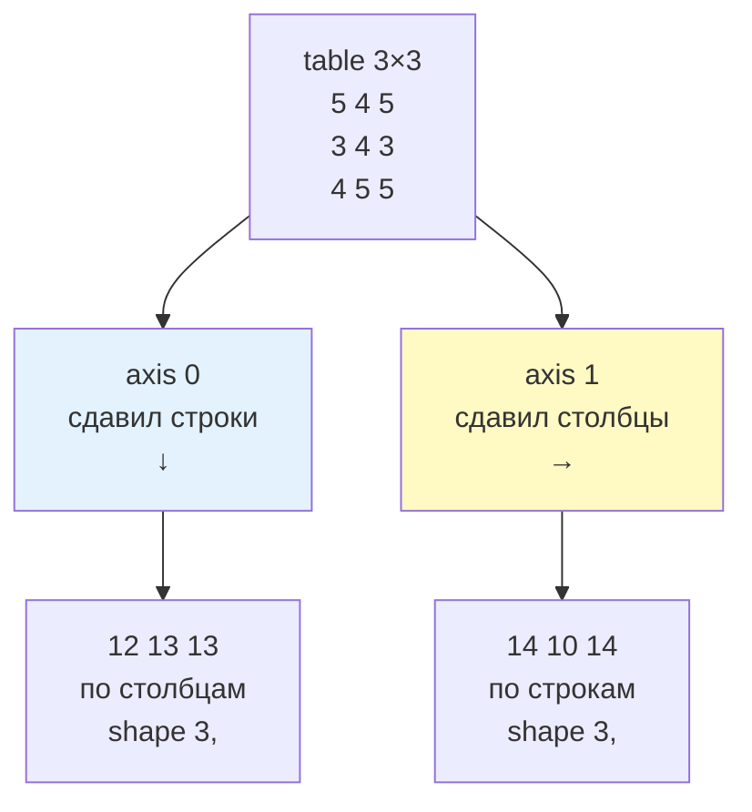
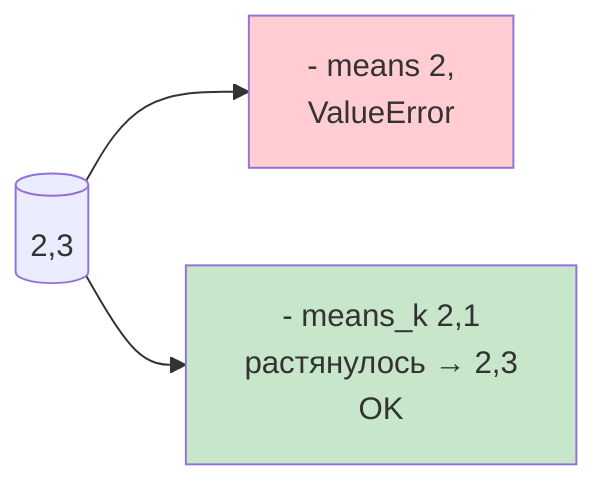

# 05. Агрегаты и оси — для чайника

> [!abstract] Для чайника
> Агрегат сворачивает массив: `sum` — в одно число, `mean` — среднее. `axis` — куда сворачиваем: `axis=0` — по столбцам (вертикаль), `axis=1` — по строкам (горизонталь). `keepdims` оставляет `1` чтобы не сломать вычитание. После лекции `table.mean(axis=0)` — средние по предметам, а не по ученикам.
>
> Представь таблицу: `axis=0` — сдавливаешь строки вниз, `axis=1` — столбцы вправо.

---

# Базовые агрегаты — для чайника

```python
import numpy as np
marks = np.array([5,4,5,3,4])
print(marks.sum(), marks.mean(), marks.std().round(2))  # 21 4.2 0.75
print(marks.min(), marks.max(), np.median(marks))  # 3 5 4.0
table = np.array([[5,4,5],[3,4,3],[4,5,5]])
print(table.sum(), table.mean().round(2))  # 38 4.22
```

| Для чайника | Что | Без `axis` |
|---|---|---|
| `sum` | сумма | весь массив |
| `mean` | среднее | весь |
| `std` | разброс | весь |
| `min/max` | минимум/максимум | весь |
| `np.median` | медиана | весь (функция, не метод) |

Методы массива — `a.sum()`, функция — `np.median(a)`.

---

# Оси — для чайника, картинка



```python
table = np.array([[5,4,5],[3,4,3],[4,5,5]], dtype=float)
print("столбцы axis0:", table.sum(axis=0))  # [12 13 13] — вертикаль
print("строки  axis1:", table.sum(axis=1))  # [14 10 14] — горизонталь
print("среднее предмета axis0:", table.mean(axis=0).round(2))  # [4. 4.33 4.33]
```

| `axis` для чайника | Куда давит | Результат `(3,3)` |
|---|---|---|
| `None` | весь | скаляр `()` |
| `0` | строки ↓ — по столбцам | `(3,)` |
| `1` | столбцы → — по строкам | `(3,)` |

Мнемоника чайника: `axis=0` — ноль — вдоль строк, убирает 0-е измерение. `2×3` `axis0`→`(3,)` `axis1`→`(2,)`.

> Путаница: `mean(axis=0)` — среднее **по столбцам** (предметам), `axis=1` — по строкам (ученикам). Проверяй `shape`.

---

# `keepdims` — для чайника, зачем `1`

Нужно чтобы `table - means` не сломалось. Без `keepdims` — вектор `(2,)`, с — `(2,1)` столбик:

```python
table = np.array([[5,4,3],[2,4,6]], dtype=float)
means = table.mean(axis=1)              # (2,) [4. 4.]
means_k = table.mean(axis=1, keepdims=True)  # (2,1) [[4.][4.]]
print(means.shape, means_k.shape)
try: table - means
except ValueError: print("table-means ValueError")  # (2,3)-(2,) не растянуть
print(table - means_k)  # [[1 0 -1][-2 0 2]] — каждая строка минус своё среднее!
```



Тихая ошибка чайника: `(3,3) - mean(axis=1)` с `(3,)` **не падает** но вычитает не туда (столбцы вместо строк!). `keepdims` → `(3,1)` растянется только правильно.

Для `axis0` `(3,)` уже подходит для `(3,3)`, `keepdims→(1,3)` нужно для `concatenate` чтобы осталась 2D.

---

# Пустой массив — для чайника

```python
import warnings
empty = np.array([])
print(empty.size, empty.sum())  # 0 0.0 — сумма пустого 0
with warnings.catch_warnings(): warnings.simplefilter("ignore")
print(empty.mean())  # nan — среднего нет + warning
with np.errstate(divide="ignore"): print(np.array([1.0])/0)  # [inf]
```

`sum пустого=0` `mean=nan` + `RuntimeWarning`. `1/0→inf`. Управлять: `np.seterr` на всю программу, `np.errstate`/`warnings.catch_warnings` локально. В проекте `if arr.size==0: return nan` до агрегата.

---

# Как в проекте — для чайника

1. **`axis0` столбцы `axis1` строки.** `temps.mean(axis=0)` дни, `axis1` станции.
2. **`keepdims` для вычитания.** `table - table.mean(axis=0, keepdims=True)` — явно строка средних.
3. **`size==0` до агрегата.** `if grades.size==0: return nan`.
4. **`mean` vs `median`.** Среднее тянет выбросы, медиана нет — показывают оба.
5. **`cumsum`.** `np.cumsum(daily)` — накоплено без цикла.

---

# Типичные заблуждения — чайник

| Думают | На самом деле |
|---|---|
| `axis0` по строкам | По столбцам (схлопнул строки) |
| Агрегат скаляр | С `axis` — массив |
| `keepdims` не нужен | Без него `table-means` падает/молчит неверно |
| Пустой `mean=0` | `nan` + warning |
| `median` метод | Функция `np.median` |

---

# Проверь себя — для чайника

1. `table.sum(axis0)` `(3,3)`?
2. Чем `axis0` vs `axis1`?
3. Зачем `keepdims`?
4. `[].mean()`?
5. Как убрать warning пустого?

> [!success]- Ответы
> 1. Суммы по столбцам `(3,)`.
> 2. `0` вертикаль, `1` горизонталь.
> 3. Оставить `1` для `broadcast`.
> 4. `nan` + warning.
> 5. `if size==0` до или `seterr`.

---

# Практика

[[02. Практика. Вычисления и маски]] — `mean(axis0)`, `keepdims`.

---

# Опора на дисциплину 02

- `for v: total+=v` → `arr.sum()` без цикла
- `sum(list)` → `arr.mean(axis=0)`

---

# Связи

- [[04. Арифметика и broadcasting]] — после агрегата
- [NumPy — aggregates](https://numpy.org/doc/stable/reference/routines.statistics.html)

