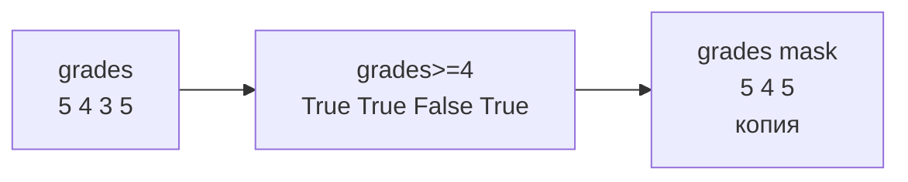
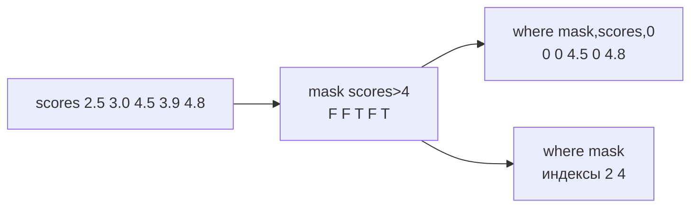

# 06. Булева индексация. Логические маски, фильтрация и условный выбор

> [!abstract] Цель и задачи лекции
> **Цель:** раскрыть механизм булевой индексации и аппарата логических масок для фильтрации и условного выбора без явных циклов.
> **Задачи:** определить булеву маску `a>4 → [True …]`; описать поэлементные связки `&`/`|`/`~`; сопоставить `np.where`/`argsort`/`unique`; показать фильтрацию строк `data[mask]`.
>
> *Пояснение для начинающих (для чайника):* маска — массив галочек `True/False` той же формы; `grades[mask]` — только галочки, без `for/if`; представь трафарет: где дырка `True` — проходит, где `False` — нет.

---

# Булева маска: определение и применение



```python
import numpy as np
grades = np.array([5,4,3,5,4,3,5])
print(grades>4)          # [True False False True False False True]
print(grades>=4)         # [True True False True True False True] bool
mask = grades>=4
print(grades[mask])      # [5 4 5 4 5] — копия, не вид!
print("сколько", mask.sum(), "доля", mask.mean().round(2))  # 5 0.71 — True как 1
```

Маска `shape` как у данных, `dtype=bool`. `a[mask]` — новый массив. `sum` считает галочки, `mean` — долю.

| Для чайника | Что |
|---|---|
| `a>4` | галочки `bool` |
| `a[mask]` | только `True` — копия |
| `mask.sum()` | сколько |
| `mask.mean()` | доля |
| `a[a>4]=0` | записать по галочкам — меняет исходный! |

---

# Поэлементные логические операции `&`/`|`/`~`

Для массивов только поэлементные `& | ~`, `and/or` — для одного `bool`:

```python
temps = np.array([-5,0,7,12,3,-2])
print(temps[(temps>=0) & (temps<=10)])  # [0 7 3] — скобки обязательны!
print(temps[(temps<0) | (temps>10)])    # [-5 12 -2]
print(temps[~(temps<0)])               # [0 7 12 3] — не холодно
```

Без `()` — `a>0 & a<10` читается `a > (0&a) <10` — ошибка. Для чайника: два условия — `()` вокруг каждого + `&`.

---

# Функция `np.where`: условный выбор



```python
scores = np.array([2.5,3.0,4.5,3.9,4.8])
print(np.where(scores>4, scores, 0))          # [0. 0. 4.5 0. 4.8] — где True x иначе y
print(np.where(scores>4)[0])                  # [2 4] — индексы где True
print(np.where(scores>=4, "зачёт","незачёт")) # тернарный по всему массиву
```

`where(mask,x,y)` — значения, `where(mask)` — индексы (кортеж по осям).

---

# Сортировка и `argsort`

```python
grades = np.array([5,4,3,5,4])
print(np.sort(grades[grades>=4]))  # [4 4 5 5] — отобрали и отсортировали
print(np.argsort(grades))          # [2 1 4 0 3] — порядок индексов, не значения
print(grades[np.argsort(grades)])  # [3 4 4 5 5]
print(np.unique(grades, return_counts=True))  # (array[3,4,5], array[1,2,2])
```

`argsort` — как номерки в гардеробе: говорит куда поставить. `top = scores[np.argsort(scores)[::-1][:3]]` — топ-3 без порчи исходного. `np.sort` — копия, `a.sort()` — на месте.

---

# Фильтрация строк табличных данных

```python
data = np.array([[5,4,5],[3,4,3],[4,5,5],[2,3,2]])
mask = data[:,0] >=4  # [True False True False] — по первому столбцу
print(data[mask])     # [[5 4 5][4 5 5]] — только строки где True
```

Маска строк `(4,)` + таблица `(4,3)` — выбирает строки без `broadcast`.

---

# Рекомендации по применению в проектах

1. **Маска вместо цикла.** `hot=temps[temps>30]` вместо `for/if/append`.
2. **`&` со `()`:** `(grades>=3)&(grades<=4)` — без `()` сломает приоритет.
3. **`where` для замены.** `np.where(scores<0,0,scores)` — отрицательные→0.
4. **`argsort` для топа.** `idx=np.argsort(scores)[::-1]; top=scores[idx[:3]]`.
5. **Запись осторожно:** `grades[grades<3]=3` меняет исходный; нужен `copy`.

---

# Типичные заблуждения

| Думают | На самом деле |
|---|---|
| `and` для масок | `&` с `()` |
| `a[mask]` вид | Копия `False` |
| `where` всегда индексы | С 3 args — значения |
| Маска не меняет | Выбор нет, `a[mask]=0` да |
| `sort` портит | `np.sort` копия |

---

# Вопросы для самопроверки

1. Что `grades>4`?
2. Почему `&` не `and`?
3. `where(mask,x,y)` vs `where(mask)`?
4. Доля `True`?
5. Строки `data[:,0]>=4`?

> [!success]- Ответы
> 1. Галочки `bool`.
> 2. `&` поэлементно, `and` для одного.
> 3. Значения vs индексы.
> 4. `mask.mean()`.
> 5. `mask=data[:,0]>=4; data[mask]`.

---

# Практика

[[02. Практика. Вычисления и маски]] — маски, `where`, `argsort`.

---

# Опора на дисциплину 02

- `if` в цикле → `grades[grades>4]` без `if`
- `filter` → `bool`-массив трафарет

---

# Связи

- [[03. Индексация и срезы многомерных массивов. Представления и копии]] — вид vs копия
- [NumPy — where](https://numpy.org/doc/stable/reference/generated/numpy.where.html)

